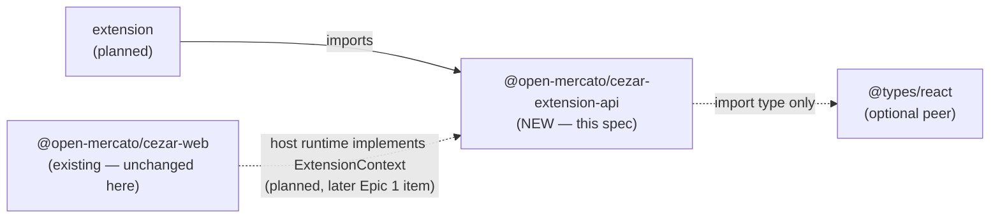

# Extension API package — `@open-mercato/cezar-extension-api`

> Slug: `extension-api-package` · Status: **designed, awaiting implementation** · Epic 1
> (Extension Runtime), item 1 of the cockpit extension platform. This spec covers **only the
> public API package**. The host runtime, extension loading, core component contracts and the
> implementation picker are later Epic 1 items with their own specs (see § Planned consumers).
> Delivery: one PR to `main`.

## 📝 TLDR

Today the cockpit (`packages/web`) is a closed set of hard-wired React components: the command
palette is hand-written JSX, there is no in-browser event bus, every module talks to
`localStorage` on its own, and the one component table (`SETTINGS_SECTIONS`) is a private
constant. Nothing outside the repository can add a feature or swap a component without
editing Cezar's source.

The proposal adds a fifth npm workspace, `packages/extension-api`
(`@open-mercato/cezar-extension-api`): a dependency-free, Node-free, DOM-free package that is
the **only** supported contract between Cezar and an extension. From one entry point it exports
the `Extension`, `ExtensionContext` and `ExtensionManifest` types, `defineExtension()`, and the
typed contracts for **commands, events, storage and the component registry** — including the
token (`defineComponentContract`) through which core will later declare which components an
extension may re-implement, and the props that make up each component's functional contract.
It imports nothing from `packages/web`, and an example extension written against it alone is
typechecked and activated in its tests. No shipped behaviour changes: the cockpit does not load
extensions until the host-runtime item lands.

## Resolved assumptions (autonomous defaults)

The brief left these open. Each default is the most reversible choice; all are safe to override
before merge — the package is private and has no consumer yet.

| # | Question | Applied default | Why |
|---|---|---|---|
| Q1 | The brief describes a whole platform (runtime, loading, component replacement, user choice). Is this spec the platform or only Epic 1 item 1? | **Item 1 only**: the API package. The host runtime, loader/trust model, core contracts and picker UI are separate specs. | Each is independently deployable; the package ships value (a reviewable, testable contract) without a host, and bundling them would make one PR carry a security-sensitive loader. |
| Q2 | Package name and location | **`@open-mercato/cezar-extension-api` at `packages/extension-api`.** | Every workspace uses the `@open-mercato/cezar-*` scope; the brief's `cezar-extension-api` is the unscoped spelling of the same name. |
| Q3 | Publish to npm now, or keep private? | **`private: true`**, version kept in lockstep with the release, not published. Publication is its own later decision (it joins the release set and gains a `BACKWARD_COMPATIBILITY.md` section then). | Mirrors `contract`/`api-client` (both private). A published surface is a compatibility promise; there is nothing to promise before a host exists. |
| Q4 | What is a component implementation — a React component, or a framework-neutral `mount(el, props)` contract? | **A React `ComponentType<Props>`**, referenced by `import type` only (the package has no runtime React dependency). | The cockpit is React 19 and replacements must render inside its tree with its context; a DOM-mount contract can be added later as an additive union member. |
| Q5 | Declarative contributions in the manifest (VS Code `contributes`) or imperative registration in `activate`? | **Imperative only.** The manifest is identity + compatibility; everything registers through `ExtensionContext`. | Least surface; an optional `contributes` block (for lazy activation) is additive later, and old hosts ignore unknown manifest keys. |
| Q6 | Should item 1 ship concrete core catalogs (tokens for core components, events, commands) or data access (the API client)? | **No — mechanisms only.** Each later item adds its core tokens to this package in the same PR as the host code that honours them. | A contract declared before anything renders it is a promise nobody keeps; data access needs the trust model first. |
| Q7 | May extensions declare their own replaceable contracts (`declare`/`resolve`) in v1? | **No, deferred.** v1 extensions provide implementations for core contracts only. | Additive later; keeps the first registry to one verb (`provide`). |
| Q8 | Storage semantics | **Async, JSON values, one private key-value scope per extension**; the backend (browser vs `~/.cezar`) is the host item's choice. | An async API keeps both backends possible without a breaking change; project-scoped storage is additive later. |

## 📝 Problem Statement

The goal of the platform (all epics) is that extensions can add features **and** provide
alternative implementations of existing components while honouring core's functional contract,
with the user choosing which implementation to use — all without modifying Cezar's code. That
needs a boundary that does not exist today:

- **No seams to program against.** The explorer pass over `packages/web/src` found no command,
  event, or component registry: command-palette groups are fixed JSX
  (`components/command-palette.tsx`), live signals are private SSE/WebSocket plumbing
  (`api/global-events.tsx`, `api/ws.ts`), there is no in-browser event emitter, and
  persistence is per-module `localStorage` under ad-hoc `cez-*` keys. The closest thing to a
  component registry is `SETTINGS_SECTIONS` (`routes/settings/registry.tsx`), a private,
  closed union.
- **Nothing an extension could import.** Anything an extension reached into — a web module,
  the api-client — would be an internal that moves with every refactor. Extensions written
  against internals break on every release, which is exactly what VS Code's and Obsidian's
  single API modules (`vscode`, `obsidian`) exist to prevent.
- **Order of work.** The host runtime, loader and picker all need a shared vocabulary for
  "extension", "command", "event", "storage", "component contract". Settling it first, as types
  with tests but no runtime effect, lets the later items be reviewed against a fixed contract
  instead of inventing it inside a large host PR.

## 📝 Proposed Solution

A new workspace package whose entire job is the contract:

1. **One entry point.** `package.json` `exports` has exactly `"."` (plus `./package.json`);
   `src/index.ts` only re-exports. A file under `src/` is not public until the barrel exports it.
2. **Zero runtime dependencies.** The runtime part is a handful of pure helpers
   (`defineExtension`, `validateManifest`, `isValidExtensionId`, `isValidContributionId`,
   `defineCommand`, `defineEvent`, `defineComponentContract`, `isExtensionError`) and one error
   class (`ExtensionDefinitionError`); everything else is types. React is referenced
   through `import type` only. Extensions may therefore bundle their own copy without pulling
   anything in.
3. **Typed tokens instead of bare strings.** Commands, events and component contracts are
   created with `define*` helpers that return a small frozen object `{ kind, id, version? }`
   whose optional, type-only phantom member carries the argument/payload/props types (without
   it TypeScript would treat every token of a kind as interchangeable). The producer and consumer share the token and
   get compile-time checking; the host matches tokens **by `id` (and `version`), never by object
   identity**, because each extension bundle carries its own copy of the package.
4. **JSON across the boundary.** Command arguments/results, event payloads and stored values
   must be JSON-serializable (enforced at the type level). Only component props carry
   functions. This keeps a future isolated runtime (worker or iframe) for non-UI logic possible
   without an API break.
5. **Namespaced ids.** An extension id is `publisher.name`; every id an extension creates
   (command, event, implementation) starts with its own extension id. The helpers validate the
   grammar; the host enforces ownership at registration. The `cezar` publisher is reserved for
   core.
6. **The user chooses.** Documented host semantics that the types encode: providing an
   implementation never selects it — the user picks per contract; core's default implementation
   always stays available and is the fallback when a replacement fails.

### Alternatives considered

- **Export the API from `packages/web` (or `@open-mercato/cezar-react` when it exists).**
  Rejected: an extension would depend on the whole application or component library, and every
  internal refactor would risk breaking it. The brief requires a package that does not import
  `packages/web` internals.
- **Plain string ids with `any` args (VS Code `commands.executeCommand`).** Rejected for the
  typed surface: tokens give the same ergonomics plus type checking, and anyone can still create
  a token for an id they only know as a string.
- **Global declaration merging (`declare module … { interface ComponentContracts … }`).**
  Rejected: it is invisible at runtime, so a host cannot list or version-check contracts, and it
  couples every extension's types into one global namespace.
- **Validate manifests with zod inside this package.** Rejected: it would add the package's only
  runtime dependency. `validateManifest` is a small hand-written validator, and it is the single
  source of the manifest rules — the future loader calls it rather than re-deriving them.

## 📝 Architecture



The API package depends on nothing but React's types; the cockpit and extensions will depend
on it, never the other way round.

- **Placement.** `packages/extension-api` beside `contract` and `api-client`, with the same
  structural guarantees: `lib: ["ES2022"]` and `types: []` in its tsconfig make any `node:*`
  import or DOM global a compile error, so the same source runs in the browser, in vitest's Node
  environment and in a future worker. Like `contract`/`api-client` it exports raw `.ts`, so its
  consumers are TypeScript-aware (Vite, vitest, tsx); plain `node` cannot import it until the
  publication item adds a build.
- **No dependency on `contract` or `api-client` in item 1.** Core contracts whose props need
  domain types (a task list needs run summaries) come with Q6's later items; that item decides
  whether this package re-exports those types or declares narrower view models.
- **The cockpit does not import it yet.** `packages/web`, its Vite aliases and its bundle are
  unchanged. The host item adds the dependency, the alias and the `ExtensionContext`
  implementation.
- **Relation to other specs.** Independent of `2026-07-27-publishable-react-components.md`
  (not yet implemented): that package exposes Cezar components *to* host applications; this one
  lets extensions plug *into* Cezar. When both exist, core contract props should match the public
  props of the corresponding `@open-mercato/cezar-react` component.

### Planned consumers (out of scope, named so the types are designed for them)

| Later item | What it needs from this package |
|---|---|
| Extension host runtime (packages/web) | Implements `ExtensionContext`; activation/deactivation, namespace enforcement, listener isolation, the storage backend. |
| Discovery, loading and trust model | `validateManifest`, `engines.cezar`; the decision about where extensions come from and how the user trusts them, taken **before** any third-party code runs. |
| Core component contracts + implementation picker | Adds `cezar.*` tokens via `defineComponentContract`; renders the user-selected implementation with fallback; a Settings section to choose. |
| Core commands/events catalog, command palette integration | Adds `cezar.*` command and event tokens; lists `title`d commands in the palette. |
| Publication | Adds a `dist` build, removes `private`, gains a `BACKWARD_COMPATIBILITY.md` section; must join the automated release set (`ReleaseManifests`) first if it has not already. |

## 📝 API Contracts

The public surface, exported from `src/index.ts`. Signatures are normative; file split and
internal helpers are the implementer's choice. Every exported symbol carries TSDoc — for
extension authors the TSDoc is the documentation.

### Identifiers

```ts
/** `publisher.name`: two dot-separated segments of [a-z0-9][a-z0-9-]*, ≤ 64 chars. `cezar` is reserved. */
export type ExtensionId = string
/** Two or more dot-separated segments of [a-z0-9][a-z0-9-]*, ≤ 128 chars — e.g. `acme.tasks.open-next`. */
export type ContributionId = string

export function isValidExtensionId(id: string): boolean
export function isValidContributionId(id: string): boolean
```

Ownership (an extension may only create ids under `${extension.id}.`) is enforced by the host,
because only the host knows which extension is calling.

### Manifest and extension

```ts
export interface ExtensionManifest {
  readonly id: ExtensionId
  /** Display name. */
  readonly name: string
  /** The extension's own semver version, e.g. `1.4.0` or `2.0.0-beta.1`. */
  readonly version: string
  readonly description?: string
  readonly author?: string
  /** Semver range over the Cezar release version, e.g. `^0.12.0`. The host refuses to activate outside it. */
  readonly engines: { readonly cezar: string }
}

export interface ManifestIssue { readonly path: string; readonly message: string }

/** Pure; never throws. Unknown keys are ignored (forward compatibility). `[]` means valid. */
export function validateManifest(value: unknown): ManifestIssue[]

export interface Extension {
  readonly manifest: ExtensionManifest
  activate(context: ExtensionContext): void | Promise<void>
  deactivate?(): void | Promise<void>
}

/**
 * Identity for type inference plus fail-fast validation: throws `ExtensionDefinitionError`
 * (code `invalid-manifest`, with `issues`) on an invalid manifest or a non-function `activate`;
 * returns the same object with its manifest frozen.
 */
export function defineExtension<E extends Extension>(extension: E): E

/** Thrown by this package's helpers at definition time — never by the host. */
export class ExtensionDefinitionError extends Error {
  override readonly name: 'ExtensionDefinitionError'
  readonly code: 'invalid-manifest' | 'invalid-id'
  readonly issues: readonly ManifestIssue[]
}
```

Validation rules: `id` per the grammar; `name` non-empty, ≤ 80 chars; `version` matches the
semver.org grammar; `engines.cezar` a non-empty string ≤ 64 chars (range semantics are the
host's); `description`/`author` strings when present.

### Context, lifecycle and disposal

```ts
export interface Disposable { dispose(): void }

export interface ExtensionContext {
  /** The manifest as the host loaded it. */
  readonly extension: Readonly<ExtensionManifest>
  /** Disposed by the host after `deactivate`. For the extension's own resources (timers, DOM listeners). */
  readonly subscriptions: Disposable[]
  readonly commands: Commands
  readonly events: Events
  readonly storage: ExtensionStorage
  readonly components: ComponentRegistry
}
```

Lifecycle semantics the host must implement (documented in TSDoc, tested when the host lands):
`activate` is awaited once; everything registered through the context is tracked and disposed
automatically on deactivation, in reverse order, after `deactivate()` resolves; every
`register`/`on`/`provide` also returns a `Disposable` for early removal; `dispose()` is
idempotent; any context call after deactivation rejects/throws with code `disposed`.

### JSON boundary

```ts
export type JsonPrimitive = string | number | boolean | null
export type JsonValue = JsonPrimitive | readonly JsonValue[] | { readonly [key: string]: JsonValue }

type NonJson = Function | Date | bigint | symbol
/** `true` when T survives a JSON round trip; `void` (no payload) counts as JSON. Accepts interfaces. */
export type IsJson<T> = IsJsonAt<T, []>
type IsJsonAt<T, Depth extends readonly unknown[]> = [T] extends [void] ? true
  : [T] extends [JsonValue] ? true
  : Depth['length'] extends 10 ? true
  : T extends JsonPrimitive ? true
  : T extends NonJson ? false
  : T extends readonly (infer U)[] ? IsJsonAt<U, [...Depth, unknown]>
  : T extends object
    ? (false extends { [K in keyof T]-?: IsJsonAt<Exclude<T[K], undefined>, [...Depth, unknown]> }[keyof T] ? false : true)
    : false
```

Why a predicate rather than a constraint: `T extends JsonValue` rejects every plain `interface`
(interfaces have no index signature), and a self-referential constraint (`P extends JsonSafe<P>`) is a
circular-constraint error (TS2313). The helpers below therefore put the check on a
**parameter** (`id: IsJson<P> extends true ? ContributionId : never`), which turns a
non-JSON type argument into a compile error at the definition site. This construction was
checked against the repository's TypeScript 7.0.2: it accepts an interface with optional and
array fields and `void`, and rejects a function or a `Date` field. The implementer may refine
it; the type tests in Step 4 are the requirement.

*As built (PR #3):* the first draft of this construction — without the `JsonValue` fast path and
the depth counter — was a TS2589 ("excessively deep") error on `IsJson<JsonValue>`, so a value
read from storage could not be written back, and a TS2615 on any recursive interface. The fast
path settles `JsonValue` and every type literal at once; the depth counter (ten levels, deeper
structure assumed JSON) keeps each recursion's arguments distinct, so recursive shapes terminate.

### Commands

```ts
export interface CommandToken<Args extends readonly unknown[] = [], Result = void> {
  readonly kind: 'command'
  readonly id: ContributionId
  /** Type-only phantom — never set at runtime. It is what makes tokens of different types distinct. */
  readonly __types?: (...args: Args) => Result
}
export function defineCommand<Args extends readonly unknown[] = [], Result = void>(
  id: [IsJson<Args>, IsJson<Result>] extends [true, true] ? ContributionId : never,
): CommandToken<Args, Result>

export interface CommandOptions {
  /** When present, the host may list the command in the command palette under this title. */
  readonly title?: string
}

export interface Commands {
  register<A extends readonly unknown[], R>(
    command: CommandToken<A, R>,
    handler: (...args: A) => R | Promise<R>,
    options?: CommandOptions,
  ): Disposable
  execute<A extends readonly unknown[], R>(command: CommandToken<A, R>, ...args: A): Promise<R>
}
```

Host semantics: one handler per id (a second `register` fails with `duplicate-registration`);
an extension registers only ids in its own namespace; `execute` of an unknown id rejects with
`command-not-found`; a throwing handler rejects the caller's promise and never takes down the
host.

### Events

```ts
export interface EventToken<Payload = void> {
  readonly kind: 'event'
  readonly id: ContributionId
  /** Type-only phantom, as on `CommandToken`. */
  readonly __payload?: (payload: Payload) => Payload
}
/** `void` (the default) means the event carries no payload. */
export function defineEvent<Payload = void>(
  id: IsJson<Payload> extends true ? ContributionId : never,
): EventToken<Payload>

export interface Events {
  on<P>(event: EventToken<P>, listener: (payload: P) => void): Disposable
  /** Payload-less events are emitted as `emit(token)`. */
  emit<P>(event: EventToken<P>, ...payload: [P] extends [void] ? [] : [payload: P]): void
}
```

Host semantics: delivery is asynchronous (after `emit` returns) in subscription order; a
throwing listener is isolated and reported, never propagated to the emitter or other listeners;
an extension emits only events in its own namespace (`cezar.*` events are emitted by core
only); any extension may listen to any event.

### Storage

```ts
export interface ExtensionStorage {
  /** Unchecked cast: data may have been written by an older version of the extension — validate it. */
  get<T = JsonValue>(key: string): Promise<T | undefined>
  /** Same JSON predicate as commands and events, so interface-typed values are accepted. */
  set<T>(key: string, value: T & (IsJson<T> extends true ? unknown : never)): Promise<void>
  delete(key: string): Promise<void>
  keys(): Promise<string[]>
}
```

`set`'s value is spelled `T & (IsJson<T> extends true ? unknown : never)` rather than
`IsJson<T> extends true ? T : never`: both accept exactly the same values, but with the second
form a host implementing `set` gets a TS2589 error from `value as JsonValue` (as built, PR #3).

Private to the extension (no extension can read another's keys). Keys are non-empty strings
≤ 128 chars. Size limits are the host's and surface as `storage-quota`. Deleting all
`~/.cezar`/browser state loses extension data too, consistent with § Zero config ("new state may
be written, never required").

### Component registry

```ts
import type { ComponentType } from 'react'

export interface ComponentContract<Props> {
  readonly kind: 'component'
  readonly id: ContributionId
  /** Major version of the functional contract. Bumped on any incompatible props change. */
  readonly version: number
  /** Type-only phantom, as on `CommandToken`. */
  readonly __props?: (props: Props) => Props
}
export function defineComponentContract<Props>(
  id: ContributionId,
  options: { readonly version: number },
): ComponentContract<Props>

export type ComponentProps<C> = C extends ComponentContract<infer P> ? P : never

export interface ComponentImplementation<Props> {
  /** Namespaced under the providing extension, e.g. `acme.compact-tasks.dense`. */
  readonly id: ContributionId
  /** Shown to the user when they choose an implementation. */
  readonly title: string
  readonly description?: string
  readonly component: ComponentType<Props>
}

export interface ComponentRegistry {
  /** `NoInfer`: P comes from the contract only, so an implementation with other props is rejected. */
  provide<P>(contract: ComponentContract<P>, implementation: ComponentImplementation<NoInfer<P>>): Disposable
}
```

What "keeping core's functional contract" means, as types and host rules:

- **Props are the contract.** Every prop — data and callbacks — is part of it; TSDoc on each
  core contract's props states the behaviour an implementation must honour (e.g. "call
  `onOpen(runId)` when the user activates a row"). A later conformance kit may test that.
- **Versioned.** An implementation is bound to the `version` of the token it was compiled
  against; a host whose contract has moved to a new major ignores it with a
  `contract-version-mismatch` diagnostic instead of rendering it with the wrong props.
- **Opt-in selection, guaranteed fallback.** `provide` only makes an implementation available.
  The user selects it per contract; core's default implementation is always listed, and a
  replacement that throws while rendering falls back to it with a visible notice.

### Errors

```ts
export type ExtensionErrorCode =
  | 'invalid-manifest' | 'invalid-id' | 'namespace-violation' | 'duplicate-registration'
  | 'command-not-found' | 'contract-version-mismatch' | 'storage-quota' | 'disposed'

/** Duck-typed (`code` property) because host and extension carry separate copies of this package. */
export function isExtensionError(error: unknown, code?: ExtensionErrorCode): error is Error & { code: ExtensionErrorCode }
```

`defineExtension` throws `invalid-manifest` and the token helpers throw `invalid-id`, both as
`ExtensionDefinitionError`; the remaining codes are raised by the host. `isExtensionError`
recognises all of them by `code`, so a host can classify an error thrown by an extension's own
copy of this package. The union grows additively.

### The example extension (definition-of-done fixture)

`packages/extension-api/examples/hello-extension/index.ts` imports **only**
`@open-mercato/cezar-extension-api`. It declares its own contract so the fixture is
self-contained (v1 hosts render only core contracts), and it needs neither JSX nor a React
runtime — a function component may return a string:

```ts
import {
  defineCommand, defineComponentContract, defineEvent, defineExtension,
  type ComponentProps,
} from '@open-mercato/cezar-extension-api'

const Greeting = defineComponentContract<{ name: string }>('example.hello.greeting', { version: 1 })
const SayHello = defineCommand<[name: string], string>('example.hello.say-hello')
const Greeted = defineEvent<{ name: string; count: number }>('example.hello.greeted')

const LoudGreeting = ({ name }: ComponentProps<typeof Greeting>) => `HELLO, ${name.toUpperCase()}!`

export default defineExtension({
  manifest: { id: 'example.hello', name: 'Hello', version: '1.0.0', engines: { cezar: '>=0.11.1' } },
  activate(context) {
    context.commands.register(SayHello, async (name) => {
      const stored = await context.storage.get('count')
      const count = (typeof stored === 'number' ? stored : 0) + 1
      await context.storage.set('count', count)
      context.events.emit(Greeted, { name, count })
      return `Hello, ${name}!`
    }, { title: 'Hello: say hello' })
    context.components.provide(Greeting, {
      id: 'example.hello.loud', title: 'Loud greeting', component: LoudGreeting,
    })
  },
})
```

## 📝 Package and build contract

`packages/extension-api/package.json`:

- `"name": "@open-mercato/cezar-extension-api"`, `"private": true`, `"type": "module"`,
  version equal to the current release (lockstep), `license` MIT.
- `"exports": { ".": "./src/index.ts", "./package.json": "./package.json" }` — source exports,
  the same pattern as `contract`/`api-client`; `"files": ["src"]`.
- **No `dependencies`.** `peerDependencies: { "@types/react": ">=19 <20" }` with
  `peerDependenciesMeta` marking it optional; `devDependencies`: `@types/react`,
  `@types/node` (tests only), `typescript`, `vitest` (a dependency belongs to the workspace that
  imports it).
- Scripts: `test` (`vitest run`), `typecheck` (`tsc --noEmit -p tsconfig.json && tsc --noEmit -p
  tsconfig.test.json`) — two passes, so the Node-free guarantee on `src` is checked without
  the test-only Node types.

Configuration files, modelled on `packages/api-client`:

- **All tests live in `test/`, never in `src/`**, so `src/` holds only the public surface and
  the boundary guard can hold it to the strict import rule.
- `tsconfig.json`: the `contract` compiler options (`lib: ["ES2022"]`, `types: []`, strict,
  `.ts` import extensions) plus `verbatimModuleSyntax: true` (type-only imports must be spelled
  `import type`); includes `src/**/*.ts` only.
- `tsconfig.test.json`: extends it with `noEmit`, `rootDir: "."`, `types: ["node"]` and includes
  `src/`, `test/` and `examples/` (the boundary test reads files; `@types/node` becomes a
  devDependency). Test-only — `src` stays Node-free under the first typecheck pass.
- `vitest.config.ts`: project `extension-api`, `environment: 'node'`, includes
  `test/**/*.test.ts`. There is always at least one test file (Step 1), because
  `passWithNoTests` is set only in the root config and a project's own `vitest run` exits 1
  without tests.

Repository wiring (root):

- `package.json` `workspaces` gains `packages/extension-api`; `typecheck` gains
  `typecheck:extension-api` (`npm run typecheck -w @open-mercato/cezar-extension-api`).
- `vitest.config.ts` `projects` gains `./packages/extension-api/vitest.config.ts`.
- `package-lock.json` regenerated by `npm install` (workspace symlink only; no new registry
  packages beyond what the web workspace already resolves).
- Release: `ReleaseManifests` also stamps private packages (`contract`, `apiClient`), so joining
  it is not publication — but it means changing `packages/cezar/src/release/` and both release
  scripts, which this item keeps untouched. Until then the version is bumped by hand in the
  release PR alongside `packages/web` (as release commit 4763447f did for web). Joining the
  automated set is a small follow-up and a precondition of publication.
- `AGENTS.md`: "Repository layout" becomes five workspaces with a row for the package and its
  rules (Node-free, DOM-free, zero runtime deps, single entry point, never imports `packages/web`
  or the service); a "Task routing" row points at the package README and this spec.
- `packages/extension-api/README.md`: author-facing rules and a short guide, in the style of the
  contract README.

## 📝 UI/UX

None in this item: no screen, route, setting or string changes. The implementation picker and
command-palette integration belong to the host items.

## 📝 Edge Cases & Failure Scenarios

| Scenario | Behaviour |
|---|---|
| Two copies of the package (host + extension bundle) | Tokens are plain frozen objects compared by `id`/`version`; errors are recognised by `code`, not `instanceof`. A type test pins that a structurally equal token literal is accepted; the host item tests the runtime matching. |
| Malformed extension id, command/event/contract id | `defineExtension` throws `ExtensionDefinitionError` with issues; `define*` throws an error with code `invalid-id` at module load — the author sees it immediately. |
| Manifest from a newer Cezar with unknown keys | Ignored by `validateManifest`; the host's `engines.cezar` check decides activation. |
| Non-serializable command argument or event payload | Compile error in the extension; the host still treats payloads as untrusted data. |
| Stored value from an older extension version | `get<T>` is documented as an unchecked cast; the example checks the type of what it reads before using it. |
| An extension imports a web internal | Not preventable in third-party code, and unsupported; inside this repo the boundary test forbids it for the package and its example. |
| TypeScript 7 (`tsgo`) behaviour of the `IsJson` construction | Pinned by type tests in the package typecheck, which is part of `npm run typecheck`. |

## 📝 Risks & Impact Review

- **Compatibility surfaces:** none of the surfaces in `BACKWARD_COMPATIBILITY.md` change — no
  CLI, route, state file, workflow/skill format, protocol or `@open-mercato/cezar` manifest
  change. The new package is private; `check:pack` and the published tarball are unaffected, and
  `@open-mercato/cezar` must not depend on it.
- **Freezing the wrong abstraction before a host exists.** The types are designed against the
  named planned consumers, but the host item may still need changes. Mitigation: private,
  `0.x`, labelled experimental in the README; no external consumer can be broken until
  publication, and each host item may revise the types in the same PR that implements them.
- **React coupling.** Type-only, optional peer. The runtime cost of a React-typed registry — the
  host must share one React instance with extensions — is the loader item's problem and is named
  there.
- **Security.** This item loads and runs no extension code. The loader item must settle the trust
  model first: code in the cockpit's origin passes the same-origin guard and can drive the local
  API, which can start agents with unrestricted `Bash` (#430) — an installed extension is local
  code execution. The JSON-only boundary keeps an isolated runtime for non-UI logic possible.
- **Validation cost.** Root `typecheck` and `test` each gain one small project; no build step, no
  browser.
- **Rollback:** delete the workspace and revert the root wiring; nothing else references it.

## 📋 Phasing

1. **Phase 1 — Workspace and boundary.** The package exists, is wired into the monorepo gates,
   and its boundary (single entry point, no runtime dependencies, no web/service imports,
   Node/DOM-free) is enforced by tests. Shippable alone: an empty but guarded package.
2. **Phase 2 — The API surface.** Manifest, extension, context, commands, events, storage,
   component registry and errors, each with unit and type tests.
3. **Phase 3 — Proof and documentation.** The example extension, an in-memory test host that
   activates it, the export snapshot, README and `AGENTS.md`.

## 📋 Implementation Plan

Every step keeps `npm run typecheck`, `npm test`, `npm run test:unit`, `npm run build` and
`npm run test:package` green.

### Phase 1 — Workspace and boundary

1. **Scaffold the package.** Add `packages/extension-api/{package.json,tsconfig.json,
   tsconfig.test.json,vitest.config.ts,src/index.ts}` per § Package and build contract, with
   `src/index.ts` exporting only a `Disposable` interface for now. Wire root `workspaces`,
   `typecheck:extension-api` and the vitest project; run `npm install` to update the lockfile.
   Add `test/surface.test.ts`, which imports `@open-mercato/cezar-extension-api` **by package
   name** and asserts the module loads. *Test:* `npm test -- --project extension-api` runs that
   file and passes; `npm run typecheck` prints the `typecheck:extension-api` leg.
2. **Boundary guard test.** `test/boundary.test.ts` asserts: `exports` keys are exactly `.` and
   `./package.json`; `dependencies` is absent or empty; every import in `src/**/*.ts` is
   relative or an `import type` from `react`; every import in `examples/**/*.ts` is relative or
   the package's own name; no specifier in either names `@open-mercato/cezar-web`,
   `@open-mercato/cezar`, `@open-mercato/cezar-api-client`, `@open-mercato/cezar-contract` or a
   `packages/web` path. `test/` itself is exempt (it imports `vitest` and `node:*`). *Test:* the
   guard fails when a forbidden import is added to `src/` (check once, locally).

### Phase 2 — The API surface

3. **Identifiers, manifest, extension.** `isValidExtensionId`, `isValidContributionId`,
   `ExtensionManifest`, `validateManifest`, `Extension`, `defineExtension`,
   `ExtensionDefinitionError`. *Test:* valid/invalid ids (reserved `cezar` accepted by the
   grammar, rejected only by the host), every manifest rule, unknown keys ignored,
   `defineExtension` returns the same object with a frozen manifest and throws with issues.
4. **JSON boundary and errors.** `JsonValue`, `IsJson`, `ExtensionErrorCode`,
   `isExtensionError`. *Test:* type tests — interface payload accepted, optional fields
   accepted, function/`Date` payload rejected (`@ts-expect-error`); `isExtensionError` on a
   plain `{ code }` error.
5. **Commands and events.** Tokens, `defineCommand`, `defineEvent`, `Commands`, `Events`,
   `CommandOptions`. *Test:* tokens are frozen with the right `kind`/`id` and no phantom key at
   runtime; invalid ids throw `invalid-id`; type tests: argument/result/payload checking,
   payload-less `emit(token)`, `EventToken<number>` not assignable from a `Pay` token, and a
   structurally equal object literal (built without the helper) assignable to the token type.
6. **Storage, components, context.** `ExtensionStorage`, `ComponentContract`,
   `defineComponentContract`, `ComponentProps`, `ComponentImplementation`,
   `ComponentRegistry`, `ExtensionContext`. *Test:* contract tokens carry `version`
   (a positive integer, else throws); type tests reject an implementation whose props differ
   from the contract.

### Phase 3 — Proof and documentation

7. **The example and a recording fake context.** Add `examples/hello-extension/index.ts`
   exactly as specified, and `test/fake-context.ts` (test-only, not exported): an
   `ExtensionContext` that records registrations in maps keyed by id, runs command handlers
   directly, keeps storage in a `Map` and records emitted events. It deliberately implements
   **none** of the host semantics (namespaces, duplicate detection, async delivery, disposal) —
   those belong to, and are tested by, the host-runtime item. *Test:* `test/example.test.ts`
   imports the example through its default export, checks `defineExtension` accepted its
   manifest, activates it against the fake, executes `SayHello` twice and sees
   `'Hello, Ada!'`, two recorded `Greeted` payloads with counts 1 and 2, and one `Greeting`
   implementation registered under `example.hello.loud`.
8. **Export snapshot.** Extend `test/surface.test.ts` (it already imports the package by name,
   proving resolution through the workspace link and the export map) to snapshot the sorted
   runtime export names. *Test:* adding or removing a runtime export fails
   until the snapshot is updated deliberately.
9. **Docs.** `packages/extension-api/README.md` (rules, id grammar, JSON boundary, lifecycle,
   the example, "experimental, private" status) and the `AGENTS.md` layout and routing updates.
   *Test:* the validation gate; the README's example is the checked-in example file, referenced
   rather than duplicated.
