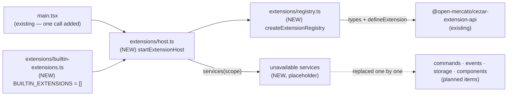

# Extension registry — the cockpit's extension lifecycle runtime

> Slug: `extension-registry` · Status: **designed, awaiting implementation** · Epic 1
> (Extension Runtime), item 2. Builds on item 1, `2026-09-18-extension-api-package.md`
> (`packages/extension-api`, merged in #3). This spec covers **the registry and the extension
> lifecycle only**. The host services behind `ExtensionContext` (commands, events, storage,
> components), a management UI (including runtime enable/disable), persisted enablement and
> the loader are later items. Delivery: one PR to `main`.

## 📝 TLDR

Item 1 defined what an extension is (`Extension`, `ExtensionManifest`, `ExtensionContext`),
but nothing in Cezar can hold one, activate it or report on it. The proposal adds a
**registry** to the cockpit (`packages/web/src/extensions/`): it registers extensions by
unique id, keeps each one's manifest and status (`registered`, `active`, `failed`,
`disabled`), runs `activate()` and `deactivate()` so that one extension's failure never
blocks the others, and lists which extensions are active. Extensions are registered
statically in code for now: the cockpit starts the registry at boot with a built-in list
that ships **empty**, so users see no change until a later item adds an extension or the
services extensions need.

## Resolved assumptions (autonomous defaults)

The brief left these open. Each default is the most reversible choice and is safe to
override before merge: everything lives inside the private cockpit package, and nothing is
persisted.

| # | Question | Applied default | Why |
|---|---|---|---|
| Q1 | Is this spec only the registry, or does it also cover the host services behind `ExtensionContext` (commands, events, storage, components), a management UI and the loader? | **Registry only**, plus the lifecycle half of the context (`extension`, `subscriptions`, automatic disposal, the `disposed` error). The four services come from an **injected seam**, so each later item can swap in one real service. | The brief lists lifecycle only. Each service works without the others, so each can be specified and reviewed separately. The seam keeps the registry's tests independent of any service. |
| Q2 | Where does the registry live? | **`packages/web/src/extensions/`**, as a **pure module**: `registry.ts` imports only `@open-mercato/cezar-extension-api` (no React, no DOM, no module state). | Item 1's spec named `packages/web` as the host. A sixth workspace would add release and wiring work before anything else needs it. Keeping the module pure makes a later move into a package or a worker cheap. |
| Q3 | Does the cockpit start the registry in this item, or is the registry a module only? | **Start it**: `main.tsx` starts the host with a static `BUILTIN_EXTENSIONS` list that **ships empty**. The boot does not wait for it, and it can never throw. Until the service items land, the services are placeholders that fail with "not available yet". | This makes the brief's "registered statically in code" real code instead of a module only tests import. With the list empty, the boot does nothing new (see § Risks). |
| Q4 | Activation order, and is there a timeout? | **Sequential, in registration order.** Each `activate()` is limited to **10 s** (option `timeoutMs`); when the limit passes, the extension becomes `failed` with code `activation-timeout`. A `deactivate()` over the same limit is reported (`deactivation-timeout`), and disposal goes ahead. | If two extensions compete for the same id, the result is always the same. A hung extension delays the others by at most 10 s. AGENTS.md says to enumerate the exits from every state; without a limit, a hung `activate()` would never leave `registered`. |
| Q5 | What does `disabled` mean, and is it saved? | **Set in code at registration** (`register(ext, { enabled: false })`), kept in memory, **not saved**. A disabled extension is never activated. Changing it at runtime (`disable`/`enable`) comes with the management-UI item, together with the screen that calls it. | The brief needs the status, and nothing in this item would call a runtime toggle. A saved choice is user state and needs a screen to change it. It also follows § Zero config: there is no setting the user must write. |
| Q6 | Are the `engines.cezar` range and the reserved `cezar` publisher enforced now? | **Deferred to the loader item.** Built-in extensions compile together with the cockpit, so they are always compatible, and they may use `cezar.*` ids. | Checking the range needs a semver dependency or a hand-written parser. Both checks only matter for third-party code, which only the loader can let in. |

## 📝 Problem Statement

- **An extension has nowhere to run.** `packages/extension-api` is types plus pure helpers
  (by design: its README says "Nothing loads extensions yet"). No code in `packages/web` or the
  service registers, activates, deactivates or lists an extension. The only code that calls
  `activate` is the package's own `test/example.test.ts`, which runs it against
  `test/fake-context.ts`: a test-only recorder that deliberately implements "none of the host
  semantics" and leaves them to "the host-runtime item".
- **The lifecycle contract is written but not honoured.** `ExtensionContext`'s TSDoc promises
  that `activate` is awaited once, that everything registered is disposed in reverse order after
  `deactivate()` resolves, and that any context call after deactivation fails with code
  `disposed`. Nothing implements or tests those promises.
- **Every later item needs a single owner of "which extensions exist and in what state."** The
  commands, events, storage and component items each need to tie a registration to the
  extension that made it and release it when that extension stops. Without one registry, each
  would build its own bookkeeping.

## 📝 Proposed Solution

1. **One registry per cockpit**, created by `createExtensionRegistry(options)` and holding one
   entry per extension id, in registration order.
2. **Registration validates and rejects duplicates.** `register(extension)` runs the
   extension through `defineExtension` (the single source of the manifest rules, and it freezes
   the manifest), refuses an id that is already registered, and records the manifest **as it
   was at registration**. Registration is synchronous and runs no extension code.
3. **Activation is isolated and bounded.** Each activation gets a fresh context and a fresh
   **scope** (the object that tracks what the extension registered). The registry calls
   `activate(context)`, catches a synchronous throw or a rejection, and limits the call with
   `timeoutMs`. On failure it records the error, disposes whatever the extension had already
   registered, and moves on to the next extension. An `activate` that timed out is remembered
   until it settles, so it is never overlapped by a retry.
4. **Deactivation honours the contract.** The registry awaits `deactivate()` (also limited by
   the timeout, with errors reported but not fatal), then disposes the extension's own
   `subscriptions` and the host-tracked registrations, each in reverse order. After that, the
   scope refuses further calls with code `disposed`.
5. **Services are injected.** The registry does not implement commands, events, storage or
   components. It passes each activation's scope to an injected `services(scope)` factory, and
   services call `scope.track()` and `scope.assertLive()` to take part in the lifecycle.
6. **Static registration at boot.** `startExtensionHost()` registers `BUILTIN_EXTENSIONS` and
   starts `activateAll()` without the boot waiting for it. The list ships empty.

### Prior art

- **VS Code:** an exception in one extension's `activate` is logged, the others keep running,
  and `deactivate` may return a promise. We adopt the isolation and the awaited `deactivate`.
  We skip activation events (lazy activation) and `extensionDependencies`; both can be added
  later because the manifest ignores unknown keys.
- **Obsidian:** plugins have `onload`/`onunload`, and the set of enabled plugins is saved in the
  vault's config. We adopt enabled/disabled as a state separate from failure, and defer saving
  it and changing it at runtime (Q5).
- **OSGi:** bundles have public transitional states (`STARTING`, `STOPPING`). We keep the brief's
  four states. The transition in progress is serialized internally instead (§ State machine),
  because no caller in this item needs to see it.
- **Backstage:** apps list their plugins statically in code. That is the same first stage the
  brief asks for, before any discovery.

### Alternatives considered

- **Concurrent activation (`Promise.allSettled`).** Rejected for now: a hang already cannot
  block the others beyond the timeout, and concurrent activation makes the winner of an id
  conflict (two extensions registering the same command) depend on timing. It can become an
  option later without changing the API.
- **Registry implements the four services directly.** Rejected: that is four specs' worth of
  semantics (namespaces, asynchronous event delivery, a storage backend, the picker) in one PR,
  and it would couple the lifecycle tests to all of them.
- **A new `packages/extension-host` workspace.** Rejected for now (Q2). The pure-module rule
  keeps it cheap to extract when a second consumer appears.
- **Make the registry a React context/store.** Rejected: that would require React in unit tests
  and tie lifecycle code to rendering. A provider can wrap the registry once something renders
  from it.

## 📝 Architecture



The registry depends only on the API package. The cockpit starts it, and the four services
plug in through one seam that later items fill.

- **Placement.** `packages/web/src/extensions/{registry,host,builtin-extensions}.ts` plus their
  tests. `registry.ts` stays **pure**: its only import is the extension-api package. It uses no
  React, no DOM, no `window`, and no module-level state. Timers are the standard
  `setTimeout`/`clearTimeout`, which vitest's fake timers control.
- **Wiring the API package into the cockpit.** `packages/web` gains the workspace dependency
  `@open-mercato/cezar-extension-api` (`^0.11.1`, lockstep, like the api-client). It resolves to
  **source**, like the api-client: a `vite.config.ts` alias and a `tsconfig.json` `paths` entry
  to `../extension-api/src/index.ts` (the package exports raw `.ts`, and web's tsconfig already
  allows `.ts` import extensions).
- **Boot.** `main.tsx` calls `startExtensionHost({ extensions: BUILTIN_EXTENSIONS })` before
  `createRoot(...).render(...)` and does not await it. `App`, and therefore `routes.test.tsx`
  and every component test, are untouched. `main.tsx` is the only place where the host is
  created in production.
- **No consumer of the instance yet.** Nothing in the cockpit reads the registry in this item.
  The first item that needs it (e.g. the command palette) exposes it through a React provider,
  so no singleton accessor is added before then.
- **Service and boundary.** No change to `packages/cezar`, the contract, the api-client or any
  HTTP route. In `packages/extension-api` only documentation changes: the README and the
  lifecycle TSDoc in `src/context.ts` and `src/extension.ts` (Step 5). There is no type or
  runtime change, so the export snapshot is unchanged.

## 📝 Data Model

In memory only, with one entry per extension. Nothing is written to `.ai/cezar/`, `~/.cezar/`
or `localStorage`, and a page reload rebuilds the registry from the static list.

| Field | Type | Meaning |
|---|---|---|
| `id` | `ExtensionId` | `manifest.id`; unique within the registry. |
| `manifest` | `Readonly<ExtensionManifest>` | The metadata (name, version, description, author, engines), captured at `register` and frozen by `defineExtension`. Reassigning `extension.manifest` afterwards changes neither the record nor the context. |
| `status` | `'registered' \| 'active' \| 'failed' \| 'disabled'` | See § State machine. |
| `error` | `{ code?: string; message: string }` | Present only while `failed`: the thrown error's string `code` (if it has one) and its `message`, or `activation-timeout`. The thrown object itself is passed to `onError` and never stored. |

Records are **immutable snapshots**: each transition replaces an entry's record with a new
frozen object. `list()` therefore returns a consistent array, and a later UI can compare records
by reference (e.g. with `useSyncExternalStore`).

## 📝 API Contracts

Host-side, exported from `packages/web/src/extensions/registry.ts`. These are **cockpit-internal**
signatures, not part of the extension API. The signatures below are required; how the file is
split internally is the implementer's choice. They were type-checked against the merged
`packages/extension-api` source with the repo's TypeScript 7.0.2 and web's compiler options.

```ts
import type {
  Disposable, Extension, ExtensionContext, ExtensionId, ExtensionManifest, ManifestIssue,
} from '@open-mercato/cezar-extension-api'

export type ExtensionStatus = 'registered' | 'active' | 'failed' | 'disabled'

export interface ExtensionFailure {
  /** The thrown error's string `code` when it has one; `activation-timeout` for a timeout. */
  readonly code?: string
  readonly message: string
}

/** Immutable: every transition produces a new record. */
export interface ExtensionRecord {
  readonly id: ExtensionId
  readonly manifest: Readonly<ExtensionManifest>
  readonly status: ExtensionStatus
  /** Present only when `status` is `failed`. */
  readonly error?: ExtensionFailure
}

/** One activation's lifecycle, as the host services see it. */
export interface ExtensionScope {
  readonly extension: Readonly<ExtensionManifest>
  /**
   * Tracks a registration for disposal when this activation ends. Returns an idempotent
   * Disposable that disposes the registration early AND untracks it. On an ended activation it
   * disposes `registration` at once, then throws `disposed`, so nothing leaks.
   */
  track(registration: Disposable): Disposable
  /** Throws an error with code `disposed` (recognised by `isExtensionError`) once the activation has ended. */
  assertLive(): void
}

export type ExtensionServices = Pick<ExtensionContext, 'commands' | 'events' | 'storage' | 'components'>

export interface ExtensionErrorReport {
  readonly id: ExtensionId
  readonly phase: 'activate' | 'deactivate' | 'dispose'
  /** What was thrown; for a timeout, an Error with code `activation-timeout` / `deactivation-timeout`. */
  readonly error: unknown
}

export interface ExtensionRegistryOptions {
  /** Builds the service half of one activation's context. Called once per activation. */
  readonly services: (scope: ExtensionScope) => ExtensionServices
  /** Limit on each `activate()` and `deactivate()` call. Default 10_000 ms. */
  readonly timeoutMs?: number
  /**
   * Every isolated failure. Default: `console.error` with an `[cezar:extensions]` prefix.
   * Called inside a try/catch: a throwing reporter is swallowed, never propagated.
   */
  readonly onError?: (report: ExtensionErrorReport) => void
}

export interface ExtensionRegistry {
  /** Synchronous; runs no extension code. `{ enabled: false }` registers it `disabled`. Throws `invalid-extension` or `duplicate-extension`. */
  register(extension: Extension, options?: { readonly enabled?: boolean }): ExtensionRecord
  get(id: ExtensionId): ExtensionRecord | undefined
  /** Every extension, in registration order. */
  list(): readonly ExtensionRecord[]
  /** `list()` filtered to `active`, in registration order. */
  listActive(): readonly ExtensionRecord[]
  /** Resolves with the resulting record; rejects only for an unknown id. */
  activate(id: ExtensionId): Promise<ExtensionRecord>
  /**
   * Activates every extension that is `registered` when the call is made, one after another in
   * registration order. Never rejects.
   */
  activateAll(): Promise<readonly ExtensionRecord[]>
  /** `active` → `registered`. Resolves with the resulting record; rejects only for an unknown id. */
  deactivate(id: ExtensionId): Promise<ExtensionRecord>
}

export function createExtensionRegistry(options: ExtensionRegistryOptions): ExtensionRegistry

export type ExtensionRegistryErrorCode = 'invalid-extension' | 'duplicate-extension' | 'unknown-extension'

/** Host-side misuse (bad input from cockpit code), never thrown into an extension. */
export class ExtensionRegistryError extends Error {
  override readonly name: 'ExtensionRegistryError'
  readonly code: ExtensionRegistryErrorCode
  /** For `invalid-extension`: every rule broken, from `defineExtension`. */
  readonly issues: readonly ManifestIssue[]
}
```

And from `packages/web/src/extensions/host.ts`:

```ts
/**
 * Every service method first calls `scope.assertLive()` (so a call after deactivation fails with
 * `disposed`, as the contract says), then fails with
 * "context.<service> is not available in this Cezar version yet".
 */
export const unavailableServices: ExtensionRegistryOptions['services']

/**
 * Creates the cockpit's registry, registers `extensions` (a bad or duplicate entry is reported
 * through `onError` and skipped; the rest still register) and starts `activateAll()`.
 * Never throws; `ready` never rejects.
 */
export function startExtensionHost(options: {
  readonly extensions: readonly Extension[]
  readonly services?: ExtensionRegistryOptions['services']   // default unavailableServices
  readonly onError?: ExtensionRegistryOptions['onError']
}): { readonly registry: ExtensionRegistry; readonly ready: Promise<readonly ExtensionRecord[]> }
```

`packages/web/src/extensions/builtin-extensions.ts`:

```ts
/** Extensions compiled into the cockpit, activated at boot in this order. */
export const BUILTIN_EXTENSIONS: readonly Extension[] = []
```

### State machine

| From | Call | To | Notes |
|---|---|---|---|
| — | `register(ext)` | `registered` | `register(ext, { enabled: false })` → `disabled`. |
| `registered`, `failed` | `activate` | `active` | `activate(context)` resolved within `timeoutMs`. |
| `registered`, `failed` | `activate` | `failed` | It threw, rejected or timed out. Partial registrations are disposed; `deactivate` is **not** called (it never became active). |
| `active` | `deactivate` | `registered` | `deactivate()` is awaited (limited by the timeout; errors and timeouts reported), then disposal runs. |
| any | a call that does not apply | unchanged | `activate` on `active` or `disabled`, `deactivate` on anything but `active`: resolve with the current record, no side effect. |
| `registered`, `failed` | `activate` while an **abandoned call** is unsettled | unchanged | See "Abandoned calls" below. |

**Exits from every state** (AGENTS.md § Changing a mechanism): `registered` is left by
`activate`/`activateAll`. `active` is left by `deactivate`. `failed` is left by an explicit
`activate` (retry) and on a page reload. `activateAll` does **not** retry `failed`, so an
extension that crashes on activation is not re-run automatically. `disabled` is a choice made
in code in this item, so its exit is editing the static list. The management-UI item adds
`enable`/`disable` at runtime. No state waits on an event that nothing produces, and the timeout
guarantees every activation reaches `active` or `failed`.

**Serialization.** Lifecycle calls for one extension run strictly one after another (each
entry keeps a promise chain, and every public call enqueues on it). Activation and
deactivation are internal steps that the public methods enqueue, and a step never enqueues
another step. Two overlapping `activate(id)` calls therefore run `extension.activate` once: the
second sees `active` and resolves with no side effect. Calls for different extensions are
independent. `activateAll` takes a snapshot of the registration order when it is called (an
extension registered while it runs is not included) and enqueues one step per extension, in
order.

**Abandoned calls.** When an `activate()` or `deactivate()` times out, the registry moves on
but keeps the unsettled promise on the entry. Until it settles, `activate(id)` resolves with the
current record (`failed` / `activation-timeout`, or `registered` after a timed-out
`deactivate`) and does **not** call `extension.activate` again. That keeps the contract's
"`activate` is awaited once" true per activation: the extension object is never inside two
lifecycle calls at once.

### Activation, precisely

1. Create the scope (tracked-registration list, `live = true`) and the context:
   `{ extension: manifest, subscriptions, ...services(scope) }`. `subscriptions` is a
   **guarded array** (for example, a `Proxy` with a `set` trap): once the scope has ended, adding
   an element disposes it at once and throws `disposed`. A throw from `services` counts as an
   activation failure.
2. Call `extension.activate(context)` **as a method** (so `this` is the extension), turning a
   synchronous throw into a rejection, and race it against `timeoutMs`.
3. When it settles in time: resolved → `active`; rejected → `failed` with `{ code, message }`
   taken from the thrown value (a non-`Error` value is stringified).
4. On timeout → `failed` with `{ code: 'activation-timeout', message }`. The activation promise
   is kept as the entry's abandoned call (§ State machine). Its result, when it comes, is
   ignored.
5. On any failure, dispose the scope (step 2 of § Deactivation) so nothing the extension
   registered stays registered, and report `{ phase: 'activate' }`.

### Deactivation and disposal, precisely

1. When the extension is `active`, await `extension.deactivate?.()` as a method, limited by
   `timeoutMs`. A throw, rejection or timeout (`deactivation-timeout`; the promise becomes the
   abandoned call) is reported with `phase: 'deactivate'` and does **not** stop step 2.
2. Dispose the scope: set `live = false`, then dispose `context.subscriptions` in reverse order,
   then the tracked registrations in reverse order. The extension's own resources go first
   because they may still be using its registrations (a timer that emits an event). Each
   `dispose()` call is isolated: a throw is reported (`phase: 'dispose'`) and the rest continue.
3. From then on, `scope.assertLive()` throws an `Error` with `code: 'disposed'`, which
   `isExtensionError(e, 'disposed')` recognises. `scope.track(reg)` disposes `reg` and then
   throws the same error, and a `subscriptions` push disposes the item and then throws it too.
   That is how the contract's "any context call after deactivation fails with `disposed`"
   reaches every service, including the placeholders.

Every `onError` call is wrapped in a try/catch, so a throwing reporter cannot break
`activateAll`, `ready` or disposal.

## 📝 UI/UX

None in this item. There is no screen, route, setting or string change, and the built-in list
ships empty. A Settings → Extensions page (list, status, failure message, enable/disable, retry)
is the management-UI item's job and will read `list()`.

## 📝 Edge Cases & Failure Scenarios

| Scenario | Behaviour |
|---|---|
| `activate` throws synchronously, or rejects | `failed` with the error's message (and `code` if it is a string); whatever it registered before throwing is disposed; the next extension activates. |
| `activate` never settles | After `timeoutMs`, `failed` / `activation-timeout`; the scope is disposed, so any later context call from the hung code fails with `disposed`; a late resolution is ignored; a retry is refused until the hung call settles. |
| `deactivate` throws or hangs | Reported (`deactivation-timeout` for a hang); disposal still runs; the status still becomes `registered`; re-activation waits until the hung call settles. |
| A `Disposable` throws on `dispose()` | Reported (`phase: 'dispose'`); the remaining disposals run. |
| The `onError` reporter itself throws | Swallowed; the lifecycle continues. |
| Two extensions with the same id | The second `register` throws `duplicate-extension`; the first entry is untouched. `startExtensionHost` reports it and continues with the rest of the list. |
| Not a valid extension (bad manifest, missing `activate`) | `register` throws `invalid-extension` with every issue from `defineExtension`. |
| An extension uses a service that does not exist yet | The placeholder throws "context.commands is not available in this Cezar version yet". If `activate` does not catch it, the extension is `failed` with that message and the others continue. |
| An extension reassigns `extension.manifest` after registration | No effect: the registry keeps the manifest captured at `register`, which `defineExtension` froze. |
| Overlapping lifecycle calls for one id | Serialized; `activate`/`deactivate` run at most once per transition. |
| Unknown id passed to `activate`/`deactivate` | Rejects with `unknown-extension` (a cockpit bug, not an extension failure); `activateAll` never rejects. |
| The page is closed or reloaded | Nothing deactivates: the browser discards the page. Extensions must not rely on `deactivate` to save data. That rule belongs in the extension-api README's lifecycle section (Step 5). |
| Two extensions register the same command id (once the commands item exists) | The winner is always the earlier one in registration order, because activation is sequential. |
| React StrictMode double-invocation | Not applicable: the host starts in `main.tsx`, outside the React tree. |

## 📝 Risks & Impact Review

- **The default path changes (AGENTS.md § Changing a mechanism).** `main.tsx` gains one call.
  With `BUILTIN_EXTENSIONS` empty it creates one object and resolves an empty `activateAll`.
  Nothing renders differently and nothing waits for it. `startExtensionHost` wraps each
  `register` call, and `activateAll` never rejects, so a future bad built-in cannot break the
  boot (§ Zero config: never fail the boot). A test pins "never throws, `ready` never rejects"
  for an invalid, a duplicate and a throwing extension. The `main.tsx` line itself has no unit
  test: `main.tsx` is the untested entry module, so that one line is checked in review.
- **Release friction.** `packages/web` now depends on a package outside the automated release
  set (`ReleaseManifests`), with a lockstep `^0.11.x` range. The release PR must bump
  `packages/extension-api`'s version **and** this range together, by hand, alongside
  `packages/web`. Otherwise npm tries to resolve a private package from the registry and
  `npm install` fails. Item 1 already named "join `ReleaseManifests`" as a small follow-up; this
  item makes that follow-up more pressing but does not change the release scripts.
- **Contract fidelity.** This item implements the lifecycle clauses of `ExtensionContext` and
  makes them more precise: the limit on each call, and a fresh context per activation. The
  extension-api TSDoc is updated to match (Step 5). It leaves out two host clauses: the
  `engines.cezar` range check and the refusal of third-party `cezar.*` ids (Q6). Both are
  harmless while only built-ins exist. The loader item must add them **before** it admits
  third-party code.
- **Security.** No third-party code runs. The static list is first-party code compiled into the
  bundle. The trust model is still the loader item's job, and extension code in the cockpit's
  origin can drive the local API (item 1's § Risks).
- **Bundle and performance.** A few hundred lines of TypeScript and the extension-api's pure
  helpers; startup cost with an empty list is negligible.
- **Compatibility surfaces.** None of the surfaces in `BACKWARD_COMPATIBILITY.md` change: no
  CLI, route, state file, workflow/skill format, protocol or `@open-mercato/cezar` manifest
  change. `packages/web` is private, and the registry API is cockpit-internal.
- **Rollback.** Remove the `main.tsx` call, delete `packages/web/src/extensions/`, and drop the
  dependency, alias and `paths` entry. Nothing is persisted, so there is no data to migrate.

## 📋 Phasing

1. **Phase 1 — The registry.** The pure module with registration, activation and deactivation,
   fully unit-tested. Shippable on its own: it is not wired in yet, and nothing changes at
   runtime.
2. **Phase 2 — Cockpit boot and docs.** `startExtensionHost`, the empty built-in list, the
   placeholder services, the `main.tsx` call, and the documentation updates.

## 📋 Implementation Plan

Every step keeps `npm run typecheck`, `npm test`, `npm run test:unit`, `npm run build` and
`npm run test:package` green. All tests are vitest tests in the `web` project. They define
fixtures with `defineExtension` imported by package name, and they use a recording `services`
factory that calls `scope.track()`/`scope.assertLive()`. Timeouts are tested with
`vi.useFakeTimers()` or a small `timeoutMs`.

### Phase 1 — The registry

1. **Wire the package, then registration and records.** Add the dependency, the `vite.config.ts`
   alias and the `tsconfig.json` `paths` entry (§ Architecture). Run `npm install` to update the
   lockfile. Create `registry.ts` with `createExtensionRegistry`, `register`, `get`, `list`,
   `listActive`, `ExtensionRegistryError` and the record types; `activate`/`deactivate` may
   throw "not implemented" until Step 2. *Test:* `vite-config.test.ts` asserts that the alias
   points at `packages/extension-api/src/index.ts`. The package is a linked workspace, so an
   import by name would resolve even without the alias; this test is what pins it. In
   `registry.test.ts`: a valid extension registers as `registered`, and `{ enabled: false }`
   gives `disabled`. A duplicate id throws `duplicate-extension` and leaves the first record
   unchanged. An invalid manifest or a missing `activate` throws `invalid-extension` with
   `issues`. `list()` keeps registration order, records are frozen, and reassigning
   `extension.manifest` after `register` does not change the record. `register` does not call
   `activate`. `npm run typecheck` proves the extension-api source compiles under web's
   compiler options.
2. **Activation.** The scope, the guarded `subscriptions`, the context assembly, `activate`,
   `activateAll`, the timeout, failure cleanup, per-extension serialization and abandoned calls
   (§ Activation, precisely; § State machine). *Test:*
   - **Two extensions both become `active`, and `listActive()` returns both** (brief DoD).
   - A middle extension that throws synchronously, one that rejects, and one that never settles
     each end up `failed` with the right `error`, while the extensions registered after them
     still become `active` (brief DoD).
   - A failed extension's tracked registrations are disposed, and its `deactivate` is not
     called.
   - After a timeout: a late resolution leaves the status `failed`. A retry `activate(id)` made
     before the hung call settles does not call `extension.activate` again, and one made after
     it settles does.
   - Two overlapping `activate(id)` calls run `activate` once.
   - `activateAll` skips `disabled` and `failed`, and ignores an extension registered while it
     runs. `activate(id)` on `failed` retries.
   - An unknown id rejects with `unknown-extension`. `activate` runs with `this` bound to the
     extension. A throwing `onError` does not break `activateAll`.
3. **Deactivation and disposal.** `deactivate` (§ Deactivation and disposal, precisely).
   *Test:*
   - `deactivate` is awaited once and runs before disposal. `subscriptions` are disposed in
     reverse order, then tracked registrations in reverse order (checked with one recorded
     order array).
   - A throwing `deactivate`, a hanging one (`deactivation-timeout`) and a throwing `dispose`
     are all reported, and disposal still completes.
   - After deactivation, `scope.assertLive()`, `scope.track(reg)` (which also disposes `reg`)
     and `subscriptions.push(d)` (which also disposes `d`) each throw an error for which
     `isExtensionError(e, 'disposed')` is true.
   - A `Disposable` returned by `track()` disposes early and is not disposed a second time.
   - Re-activation after `deactivate` gets a fresh context.
   - Every row of § State machine has a test, including the no-op rows.

### Phase 2 — Cockpit boot and docs

4. **Host and boot.** Add `builtin-extensions.ts` (empty `BUILTIN_EXTENSIONS`) and `host.ts`
   (`unavailableServices`, `startExtensionHost`), and call `startExtensionHost({ extensions:
   BUILTIN_EXTENSIONS })` in `main.tsx` before rendering, without awaiting it. *Test*
   (`host.test.ts`):
   - With two fixture extensions and a recording `services`, both become `active` once `ready`
     resolves.
   - With a list containing an invalid entry, a duplicate id and an extension whose `activate`
     throws, `startExtensionHost` does not throw and `ready` resolves. The valid extensions are
     `active`, and `onError` saw each problem.
   - An extension that calls `context.commands.register` against `unavailableServices` ends up
     `failed` with the "not available yet" message. After a fixture deactivates, a placeholder
     call from it fails with `disposed` instead.
   - `BUILTIN_EXTENSIONS` registers cleanly into a fresh registry, which guards every future
     addition to the list.
   - `npm run build` bundles the new code. The `main.tsx` call has no unit test (§ Risks).
5. **Docs.**
   - `packages/extension-api`:
     - README: replace the status line ("Nothing loads extensions yet") with one that names the
       cockpit registry and says the services arrive in later items.
     - README lifecycle section: activation is sequential and in order, each call has a time
       limit, a new context is created per activation, and page unload does not call
       `deactivate`.
     - TSDoc in `src/context.ts` and `src/extension.ts`: "awaited once per activation, limited
       by the host's timeout".
   - `AGENTS.md`:
     - Repository-layout row for extension-api: "nothing loads extensions until the
       host-runtime item lands" becomes a pointer to the cockpit registry.
     - "Extensions and the extension API" task-routing row: add
       `packages/web/src/extensions/registry.ts` and its rules (pure module, services only
       through the scope seam, a timeout on every extension call).

   *Test:* the validation gate. `test/surface.test.ts` stays unchanged, because the change is
   documentation only.
