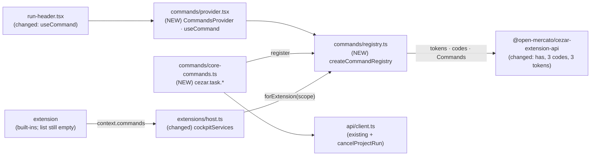

# Command API — typed business actions behind one registry

> Slug: `command-api` · Status: **designed, awaiting implementation** · Epic 1 (Extension
> Runtime), item 3. Builds on item 1, `2026-09-18-extension-api-package.md` (the `Commands`
> contract and `CommandToken`, merged in #3), and item 2, `2026-09-18-extension-registry.md`
> (the lifecycle and the `services(scope)` seam, merged in #6). This spec covers **the command
> registry, the first core commands and the extension-facing `commands` service**. Events,
> storage, components, the command palette and the remaining UI call sites are later items.
> Delivery: one PR to `main`.

## 📝 TLDR

Today every business action in the cockpit is wired straight into the component that shows its
button: the run header builds its own `useMutation` around `continueRun`, `cancelRun` and
`archiveRun`, knows which HTTP errors mean "refetch", and decides which cache keys to
invalidate. Extensions have a typed `context.commands` in their API, but the cockpit answers
every call with "not available in this Cezar version yet".

The proposal adds a **command registry** to the cockpit (`packages/web/src/commands/`) with
`register`, `execute` and `has`. Each command has an id, a typed input, a typed result and a
handler. Core registers three **public** commands — `cezar.task.continue`, `cezar.task.stop`
and `cezar.task.archive` — whose handlers own the HTTP call and the cache invalidation. The
run header runs them through a `useCommand(token)` hook and no longer imports the API client
for those actions. Extensions get the same registry through `context.commands`: they can run
public commands and register their own. Every failure — an unknown or malformed command, bad
input, a failing or hung handler — rejects with a coded error that `isExtensionError`
recognises.

## Resolved assumptions (autonomous defaults)

The brief left these open. Each default is the most reversible choice; all are safe to override
before merge — the extension API package is private and experimental, the registry is
cockpit-internal, and no HTTP route, state file or published surface changes.

| # | Question | Applied default | Why |
|---|---|---|---|
| Q1 | Split into separate specs — the command capability (registry, core commands, `context.commands`) vs. the UI's adoption of it? | **One spec.** Phases 1–2 are the capability and meet the brief's four DoD checks; Phase 3 moves one component onto it and can be split into the follow-up UI-migration spec without changing Phases 1–2. | `BUILTIN_EXTENSIONS` ships empty, so without Phase 3 the core commands have no caller in production — a contract nobody exercises (item 1, Q6). The header is the first real caller, and its existing tests prove the handlers reproduce today's behaviour. |
| Q2 | Which UI call sites move to commands in this item? | **The run header's Continue, Cancel (stop) and Archive buttons only.** The other sites stay on their current code until the follow-ups listed under § Architecture. | Smallest change that proves the goal. The other sites carry extra behaviour (a prompt and attachments, optimistic cross-project patches) that needs more command input. |
| Q3 | Command ids: the brief's `task.continue` or namespaced? | **`cezar.task.continue`, `cezar.task.stop`, `cezar.task.archive`.** | Item 1 reserves the `cezar` publisher for core and requires two or more segments; every id an extension creates starts with its own id. |
| Q4 | "Input type": one input object, or keep item 1's variadic `CommandToken<Args, Result>`? | **Keep the variadic token.** Core commands take exactly one JSON input object (`[input: TaskArchiveInput]`), and `useCommand` targets such single-input commands. | No breaking change to the merged contract or its example; a single input is the one-element case. |
| Q5 | What makes a command "public"? | **Core picks `visibility: 'public' \| 'internal'` explicitly at registration (no default).** An internal command is invisible to extensions: `has` is `false` and `execute` rejects `command-not-found`. Commands registered by extensions stay visible to every extension, as item 1's contract already says. The three task commands are public. | The brief's DoD speaks of *public* commands, so "public" needs a meaning. Exposing a core action becomes a deliberate one-word choice, so the follow-up migrations (delete, rename, …) can keep a command internal without a contract change. Adding visibility to the extension-facing `register` is additive later. |
| Q6 | Is input validated at runtime? | **Yes for core:** core registration requires a `validate(args)` function; a throw rejects `invalid-input` before the handler runs. Extension handlers validate their own input (documented). | Types vanish at runtime and an extension is JavaScript; a core handler must never send a malformed request. Making `validate` part of the extension-facing API can come later, additively. |
| Q7 | What is a "controlled error"? | **`execute` never throws synchronously and only ever rejects with a coded error.** Three codes join `ExtensionErrorCode`: `invalid-input`, `command-failed` (anything the handler throws, with the original as `cause`), `command-timeout`. | One rule callers can rely on; the code names what went wrong with *the call you made*, not with something the handler called. The union was documented as growing additively. |
| Q8 | Is there a time limit on handlers? | **Extension-provided handlers: 30 s (`timeoutMs`), then `command-timeout`. Core handlers: no limit.** | AGENTS.md bounds every call into extension code. A core handler is one HTTP request that already has its own failure modes; a limit there would turn a slow success into a reported failure. |

## 📝 Problem Statement

- **Components own business rules.** `useRunActions` in
  `packages/web/src/routes/task-thread/run-header.tsx` calls `continueRun`, `cancelRun` and
  `archiveRun` from `@/api/client`, invalidates `queryKeys.runs.all` on success, and refetches
  on a 409 ("the record these buttons were drawn from is not the run the server has"). The same
  actions are rebuilt elsewhere with different rules — `useContinueRun` in `api/queries.ts`,
  `useArchiveIndexedRun` in `routes/global-tasks.tsx`, direct `continueRun` calls in
  `review-panel.tsx` and `follow-up-engine.tsx`. A rule change means finding every copy.
- **Nothing else can trigger an action.** A command palette entry, a keyboard shortcut or an
  extension that wants to "archive this task" must import a component's hook or the API client
  itself — exactly the coupling item 1's single API package exists to prevent.
- **The extension contract is written but not honoured.** `Commands.register`/`execute` exist
  in `packages/extension-api/src/commands.ts` with documented host semantics
  (`duplicate-registration`, `namespace-violation`, `command-not-found`, isolated handlers).
  The cockpit's `unavailableServices` (`packages/web/src/extensions/host.ts`) fails every call.

## 📝 Proposed Solution

1. **One registry per cockpit**, `createCommandRegistry()`, a pure module (like
   `extensions/registry.ts`: only the extension API is imported, no React, no DOM, no module
   state). It maps a command id to one handler plus who registered it.
2. **Two views of one registry.** Core code uses the registry directly: it registers only
   `cezar.*` ids, must give `visibility` and `validate`, and can execute everything. Each
   extension activation gets `registry.forExtension(scope)` — the `Commands` it sees as
   `context.commands`: registration in its own namespace, tracked for disposal, and execution
   limited to public core commands and extension commands.
3. **Core task commands** in `commands/core-commands.ts`: handlers that validate input, call the
   existing API-client functions, invalidate the same cache keys the cockpit invalidates today,
   and return narrow JSON results. Their tokens live in the extension API package so extensions
   execute them with compile-time types.
4. **React bindings.** `CommandsProvider` hands the registry to the tree; `useCommand(token)`
   wraps `execute` in a TanStack `useMutation`, so a button keeps `isPending` and `onError`
   without knowing the endpoint.
5. **A controlled-error pipeline** in `execute` (§ API Contracts, *Execution, precisely*).

### Prior art

- **VS Code** (`commands.registerCommand` / `executeCommand`): one global string-keyed registry;
  an unknown id rejects "command 'x' not found"; internal commands are hidden by convention
  (a leading `_`, filtered from `getCommands(true)`). We adopt the rejection and the idea of
  hidden commands, but make visibility an explicit registration field instead of a naming
  convention, and keep item 1's typed tokens instead of `any` arguments.
- **JupyterLab / Lumino** (`CommandRegistry.addCommand`, `hasCommand`, `execute`): the closest
  match to the brief — `hasCommand` is the brief's `has`, `execute` returns a promise, and
  JupyterLab 4 describes arguments with a JSON schema (`describedBy`). We adopt `has` and
  JSON-only arguments, and use a validator function instead of a schema so the registry keeps
  zero dependencies.
- **Eclipse Theia** (`CommandRegistry` with separate handlers and `isEnabled`/`isVisible`): we
  skip enablement and palette visibility; the palette item can add them as `CommandOptions`
  fields.

### Alternatives considered

- **Keep TanStack hooks as the action layer** (`useArchiveRun()` in `api/queries.ts`). Rejected:
  hooks only run inside React, so an extension, a shortcut or non-React code still cannot
  trigger the action, and the hook still exposes mutation details to its caller.
- **Put the registry in `packages/extension-api`.** Rejected: that package is a contract with no
  host code by design (its README and `test/boundary.test.ts`), and the handlers need the API
  client.
- **Wrap only extension calls; let core call API functions directly.** Rejected: that makes two
  paths to the same action permanent. This item adds the command path and its first component
  user; the remaining copies move onto it in the follow-ups listed under § Architecture, after
  which each action has one implementation.
- **Change `CommandToken` to a single `Input` type parameter.** Rejected for now (Q4): a breaking
  edit of a merged contract for no behavioural gain.

## 📝 Architecture



Components and extensions reach business actions through one registry; only core handlers
know the API client.

- **Placement.** `packages/web/src/commands/{registry,core-commands,provider}.ts(x)` plus
  tests. `registry.ts` is pure: its only runtime import is `@open-mercato/cezar-extension-api`
  (and a type-only import of `ExtensionScope` from `../extensions/registry`).
- **Boot order.** `main.tsx` creates the query client and the command registry, registers the
  core commands, then starts the extension host with `cockpitServices({ commands })`, and
  renders `<App queryClient={…} commands={…} />`. Core commands therefore exist before any
  extension activates. `App` keeps its current behaviour when rendered without those props
  (tests): it creates its own client, and `CommandsProvider` creates a registry with the core
  commands bound to it.
- **Extension host.** `host.ts` gains `cockpitServices({ commands })`: the real `commands`
  service from `commands.forExtension(scope)`, with events, storage and components still the
  placeholders. `startExtensionHost`'s default stays `unavailableServices`, so its tests are
  unchanged. `BUILTIN_EXTENSIONS` still ships empty.
- **API client.** One new twin, `cancelProjectRun(projectId, id)`, beside `archiveProjectRun`
  and `continueProjectRun`, for the existing `POST /api/v1/p/:projectId/runs/:id/cancel` route.
  No route, contract or server change.
- **Extension API package.** `Commands.has`, three error codes, and the three task tokens with
  their input/result types (AGENTS.md: core tokens land in the same PR as the host code that
  honours them). `test/surface.test.ts` and `test/fake-context.ts` are updated deliberately.
- **Not in this item:** the command palette (it can list `title`d public commands later), key
  bindings, enablement (`isEnabled`), the edit-mode interaction guard (a DOM-level guard that
  stops the click before `useCommand` is reached, so it needs nothing from this item).

### Follow-ups: the remaining copies of these actions

> **Update:** item 4, `2026-09-19-migrate-task-actions-to-command-api.md`, owns these sites.
> It keeps the 409-driven paths on commands through a cockpit-internal `apiErrorOf(error)`,
> not through new `CommandError` fields (§ Risks, "Errors are wrapped"), and keeps the global
> Tasks optimistic write in the page instead of adding an optimistic hook to `useCommand`.

Until these move, the same action exists twice — once as a command, once in the code below —
and the 409/invalidate rule lives in both the core handlers and these sites. Each is a small,
separate change on top of this item; together they make up the UI-migration follow-up spec.

| Site | Action | What the command needs first |
|---|---|---|
| `routes/task-thread/follow-up-engine.tsx` | continue with prompt, attachments, model | `text`, `images`, `model`, `agentProfile` on `TaskContinueInput` |
| `routes/task-thread/review-panel.tsx` | continue with a review prompt | `text` |
| `api/queries.ts` `useContinueRun` (used by `ask-answer.ts`) | continue with an answer | `text` |
| `routes/global-tasks.tsx` `useArchiveIndexedRun` | archive in another project, optimistic | an optimistic-update hook on `useCommand` (`projectId` already exists) |

## 📝 API Contracts

### Extension API additions (`packages/extension-api`)

```ts
// commands.ts — one method joins the interface
export interface Commands {
  register<A extends readonly unknown[], R>(
    command: CommandToken<A, R>, handler: (...args: A) => R | Promise<R>, options?: CommandOptions,
  ): Disposable
  execute<A extends readonly unknown[], R>(command: CommandToken<A, R>, ...args: A): Promise<R>
  /**
   * `true` when `execute(command)` would reach a handler this caller may run right now. A
   * snapshot: the provider may go away before the next call. Accepts a token or a bare id;
   * returns `false` for a malformed one. Throws only `disposed`, after deactivation.
   */
  has<A extends readonly unknown[], R>(command: CommandToken<A, R> | ContributionId): boolean
}

// errors.ts — the union grows additively (and ERROR_CODES with it)
export type ExtensionErrorCode =
  | /* existing */ 'invalid-manifest' | 'invalid-id' | 'namespace-violation' | 'duplicate-registration'
  | 'command-not-found' | 'contract-version-mismatch' | 'storage-quota' | 'disposed'
  | 'invalid-input'    // arguments a core command's validator refused; a non-function handler
  | 'command-failed'   // the handler threw or rejected; the original is the error's `cause`
  | 'command-timeout'  // an extension-provided handler exceeded the host's limit
```

`invalid-id`'s TSDoc also names the host: `register`, `execute` and `has` treat a value that is
not `{ kind: 'command', id: <valid ContributionId> }` as malformed.

```ts
// core-commands.ts (NEW) — the first cezar.* tokens
/** One task. `projectId` omitted → the project the cockpit is currently showing. */
export interface TaskRef {
  readonly taskId: string
  readonly projectId?: string
}
export interface TaskContinueInput extends TaskRef {
  /** A backend this Cezar knows (`claude`, `codex`, …); omitted → the task's own. */
  readonly runner?: string
}
export interface TaskArchiveInput extends TaskRef {
  /** `false` restores the task to the live list. Default `true`. */
  readonly archived?: boolean
}
export interface TaskContinueResult { readonly taskId: string; readonly continued: true }
export interface TaskStopResult { readonly taskId: string; readonly stopped: boolean }
export interface TaskArchiveResult { readonly taskId: string; readonly archived: boolean }

export const TaskContinue = defineCommand<[input: TaskContinueInput], TaskContinueResult>('cezar.task.continue')
export const TaskStop = defineCommand<[input: TaskRef], TaskStopResult>('cezar.task.stop')
export const TaskArchive = defineCommand<[input: TaskArchiveInput], TaskArchiveResult>('cezar.task.archive')
```

The results are narrow view models declared here, not the contract's `RunRecord`: this package
never imports the contract (item 1, `test/boundary.test.ts`). `runner` is a `string` for the
same reason; the core validator checks it against the contract's `runnerSchema`.

The inputs carry only what the run header sends today. The continue prompt (`text`),
`model`, attachments and agent account are the follow-up composer's needs and join
`TaskContinueInput` as optional fields with its migration. `projectId` is the exception, kept
on purpose: a task id alone is resolved against whatever project the cockpit shows, and
`api/client.ts` documents where that goes wrong (on the global Tasks page it "would either 404
or (with a colliding id) land on the wrong task"). A public command should be able to address
a task unambiguously from its first version.

### Host registry (`packages/web/src/commands/registry.ts`, cockpit-internal)

```ts
import type {
  CommandOptions, CommandToken, Commands, ContributionId, Disposable,
} from '@open-mercato/cezar-extension-api'
import type { ExtensionScope } from '../extensions/registry'

export type CommandVisibility = 'public' | 'internal'

export interface CoreCommandOptions<A extends readonly unknown[]> extends CommandOptions {
  /** `internal`: invisible to extensions (`has` false, `execute` → `command-not-found`). No default. */
  readonly visibility: CommandVisibility
  /** Turns untrusted arguments into typed ones; throw to refuse (→ `invalid-input` with that message). */
  readonly validate: (args: readonly unknown[]) => A
}

export interface CommandRegistry {
  /** Core registration: `cezar.*` ids only. Throws `invalid-id`, `namespace-violation`,
   *  `duplicate-registration`, or `invalid-input` for a non-function handler/validator. */
  register<A extends readonly unknown[], R>(
    command: CommandToken<A, R>, handler: (...args: A) => R | Promise<R>, options: CoreCommandOptions<A>,
  ): Disposable
  /** Core execution: sees every command. Never throws; rejects only with a `CommandError`. */
  execute<A extends readonly unknown[], R>(command: CommandToken<A, R>, ...args: A): Promise<R>
  /** Core view: every registered command. Never throws. */
  has<A extends readonly unknown[], R>(command: CommandToken<A, R> | ContributionId): boolean
  /** The `Commands` one extension activation sees as `context.commands`. */
  forExtension(scope: ExtensionScope): Commands
}

export interface CommandRegistryOptions {
  /** Limit on each call into an extension-provided handler. Default 30_000 ms. */
  readonly timeoutMs?: number
}
export function createCommandRegistry(options?: CommandRegistryOptions): CommandRegistry

/** Recognised by `isExtensionError` (duck-typed on `code`). */
export class CommandError extends Error {
  override readonly name: 'CommandError'
  readonly code: ExtensionErrorCode
  /** The id that was addressed, when there was a well-formed one. */
  readonly commandId?: ContributionId
}
```

**The extension view** (`forExtension(scope)`): every method first calls `scope.assertLive()`
(`execute` turns that throw into a rejection), so a call after deactivation fails with
`disposed`. `register` accepts only ids under `${scope.extension.id}.` (`namespace-violation`
otherwise), rejects a taken id with `duplicate-registration`, records `options.title`, and goes
through `scope.track()` so deactivation unregisters it. `execute` and `has` see public core
commands plus every extension's commands; an internal core command answers as if it did not
exist.

A `Disposable` from `register` removes exactly that registration and is idempotent: disposing
it after the id was re-registered by someone else leaves the new registration alone.

### Execution, precisely

`execute(token, ...args)` for either view:

1. **Resolve.** `token` is not an object with `kind === 'command'` and a valid `id` →
   `invalid-id`.
2. **Find.** No registration visible to this caller → `command-not-found`.
3. **Validate** (core commands). `validate(args)` throws → `invalid-input`, message
   `Invalid input for <id>: <thrown message>`. Validator messages name the field and the rule,
   never the value — inputs will carry user content (a prompt) once the composer migrates. The
   handler receives the validator's return value, not the caller's objects.
4. **Run.** The handler is called with the arguments; a synchronous throw becomes a rejection.
   An extension-provided handler races `timeoutMs` → `command-timeout`; it keeps running and its
   late result is ignored.
5. **Settle.** Any rejection from the handler → `command-failed`: `message` is the thrown
   error's message (a non-`Error` value is stringified), `cause` is the thrown value. A
   handler's own coded error is wrapped too, so the code always describes the call the caller
   made. Otherwise resolve with the handler's result.

`execute` is `async`: an error never escapes synchronously, and a registry with nothing
registered yet answers `command-not-found`, never a `TypeError`.

### Core task commands (`packages/web/src/commands/core-commands.ts`)

```ts
/** Registers the cezar.task.* commands; returns one Disposable for all of them. */
export function registerCoreCommands(
  registry: CommandRegistry,
  deps: { readonly queryClient: QueryClient },
): Disposable
```

| Command | Validates | Calls | Result |
|---|---|---|---|
| `cezar.task.continue` (public) | one object; `taskId` non-empty string; optional string `projectId`; `runner` optional and accepted by `runnerSchema` | `continueRun(taskId, { runner })` or `continueProjectRun(projectId, taskId, { runner })` | `{ taskId, continued: true }` |
| `cezar.task.stop` (public) | one object; `taskId`; optional `projectId` | `cancelRun(taskId)` or `cancelProjectRun(projectId, taskId)` | `{ taskId, stopped: response.cancelled }` |
| `cezar.task.archive` (public) | one object; `taskId`; optional `projectId`; optional boolean `archived` (default `true`) | `archiveRun(taskId, archived)` or `archiveProjectRun(projectId, taskId, archived)` | `{ taskId, archived: record.archived }` |

Unknown keys are ignored, so an extension built against a later input shape still runs.

Cache rules, moved out of the components into one helper `invalidateTaskKeys(queryClient,
projectId?)`: without `projectId`, invalidate `queryKeys.runs.all` — exactly what the run header
invalidates today; with `projectId`, the three keys `useIndexedRunMutation` settles
(`workspaceQueryKeys.runsIndex`, `queryKeys.runs.all`, `[projectId, 'runs', 'list']`). Each
handler invalidates on success and, when the API answers 409, invalidates before rethrowing
(the rule the header applies today, `run-header.tsx` `onError`).

### React bindings (`packages/web/src/commands/provider.tsx`)

```tsx
/** `registry` omitted → one registry per provider, with the core commands bound to the nearest QueryClient. */
export function CommandsProvider(props: { registry?: CommandRegistry; children: ReactNode }): ReactNode
/** Throws when rendered outside CommandsProvider. */
export function useCommands(): Pick<CommandRegistry, 'execute' | 'has'>
/** A mutation over one single-input command: `mutate(input)`, `isPending`, `onError`. */
export function useCommand<I, R>(command: CommandToken<[input: I], R>): UseMutationResult<R, Error, I>
```

`useCommand` adds no cache logic of its own — that lives in the handler — so a component that
switches to it keeps only presentation: pending state, confirmation dialogs, toasts.

## 📝 UI/UX

No visible change. The run header's Continue, Cancel and Archive buttons behave exactly as
today: same requests, same disabled-while-pending state, the same danger toast carrying the
server's own words, the same refetch after a 409, the same cancel confirmation dialog. The
existing fetch-level tests in `run-header.test.tsx` are the proof (§ Implementation Plan,
Step 7).

## 📝 Edge Cases & Failure Scenarios

| Scenario | Behaviour |
|---|---|
| Unknown id (core or extension caller) | Rejects `command-not-found`; nothing runs. |
| Internal core command executed by an extension | Rejects `command-not-found`; `has` is `false` — the same answer as for an unknown id. |
| Malformed token (`null`, a string, wrong `kind`, invalid id) | `execute` rejects `invalid-id`; `has` returns `false`; `register` throws `invalid-id`. |
| Bad input (missing `taskId`, unknown `runner`, `archived: 'yes'`) | Rejects `invalid-input` before any request is sent. |
| Server refuses (409 "run is still active") | Rejects `command-failed` with the server's message; the task caches are invalidated, so the header redraws to the truth. |
| Offline / network error | Rejects `command-failed` ("Failed to fetch"); nothing is invalidated. |
| Extension handler throws | Rejects the caller with `command-failed`; the providing extension stays `active`. |
| Extension handler never settles | After 30 s, `command-timeout`; a late result is ignored. |
| Calling extension was deactivated | `execute` rejects and `has` throws `disposed`. |
| Providing extension deactivates during an execute | The running call still settles; later calls get `command-not-found`. |
| Extension registers an id outside its namespace, or a taken id | Throws `namespace-violation` / `duplicate-registration`; the first registration wins. |
| Core registers a non-`cezar.*` id | Throws `namespace-violation` — a cockpit bug caught by tests. |
| A handler executes itself | Not detected. An extension loop is cut by the timeout; core handlers do not call commands in this item. |
| Rendered outside `CommandsProvider` | `useCommands` throws with a message naming the provider. |
| StrictMode double-invokes the provider's initializer | Harmless: a registry and its core registrations have no side effects outside the object. |
| Extension runs a public task command in remote mode | Same HTTP functions as the UI, so the same authentication and scope. |

## 📝 Risks & Impact Review

- **Changing a mechanism that works (AGENTS.md).** The header's local mutations were
  load-bearing for: buttons disabled while pending (double-click protection), the toast with the
  server's words, the 409 refetch, `continuation.canContinue` sending nothing when no engine is
  available, archive toggling on `!run.archived`, and the cancel confirmation. `useCommand`
  keeps `isPending`/`onError`; the 409 rule moves into the handlers; `canContinue`, the toggle
  and the dialog stay in the component. The terminal's `ApiError.command` clipboard fallback is
  not a command and is untouched. The existing tests, which assert on requests and toasts, must
  pass with only the provider added to their harness.
- **Errors are wrapped.** A component that ran a command no longer sees `ApiError` (status,
  `command`, `manual`). That is intended for the migrated actions; any action that needs those
  fields keeps its current code until a command can carry them (additive `CommandError` fields).
- **Contract growth.** The private extension API gains one interface method, three codes and
  three tokens. `has` is a breaking change only for implementers of `Commands` — the cockpit and
  the package's test fake — and both change in this PR. An older bundled copy of the package
  does not recognise the new codes in `isExtensionError`; harmless while every extension is
  built into the cockpit.
- **Security.** Public task commands let extension code continue, stop and archive tasks, and
  continuing starts an agent session (with unrestricted `Bash` by default, #430). That is no
  new capability: extension code runs in the cockpit's origin and can already call those routes
  (item 1 § Risks). The loader item's trust model must cover command access before third-party
  code runs.
- **Compatibility surfaces.** None of the surfaces in `BACKWARD_COMPATIBILITY.md` change: no
  CLI, route, state file, workflow/skill format, protocol or `@open-mercato/cezar` manifest
  change. `cancelProjectRun` uses an existing route.
- **Rollback.** Revert the header to its local mutations, remove the `main.tsx` wiring and the
  `commands/` directory, and revert the extension API additions (with the surface snapshot).
  Nothing is persisted.

## 📋 Phasing

Each phase leaves the app working; only Phase 3 changes what runs in production today.

1. **Phase 1 — The registry.** The pure module and the extension API additions (`has`, the three
   codes), fully unit-tested. Nothing is wired in yet.
2. **Phase 2 — Core commands and the extension service.** The three task commands and their
   tokens, `cancelProjectRun`, `cockpitServices`, and the `main.tsx` boot order. This meets the
   brief's four Definition-of-Done checks.
3. **Phase 3 — React bindings, the first component, docs.** `CommandsProvider`, `useCommand`,
   the run header migration, README and `AGENTS.md`. This delivers the brief's goal — a
   component that no longer knows the mutation or the endpoint — for its first component (Q1).

## 📋 Implementation Plan

Every step keeps `npm run typecheck`, `npm test`, `npm run test:unit`, `npm run build` and
`npm run test:package` green. Registry tests are vitest tests in the `web` project; they use
tokens from `defineCommand` imported by package name, a recording `ExtensionScope` fake, and
`vi.useFakeTimers()` or a small `timeoutMs` for timeouts.

### Phase 1 — The registry

1. **Extension API: `has` and the codes.** Add `Commands.has`, the three codes to
   `ExtensionErrorCode` and `ERROR_CODES`, the TSDoc updates, `has` on `test/fake-context.ts`,
   and `has: fails('commands')` on `unavailableServices`. *Test:* `errors.test.ts` —
   `isExtensionError` recognises each new code; a type test — `has` accepts a token or a string
   and rejects a number; `surface.test.ts` unchanged (no runtime export yet).
2. **Core registration and execution.** `createCommandRegistry`, `register`, `execute`, `has`,
   `CommandError`, following § Execution, precisely. *Test* (`commands/registry.test.ts`):
   - A core command registers and executes with a typed result; `has` is `true`, and `false`
     after its `Disposable` is disposed (brief DoD: core registers a command).
   - Unknown id → `command-not-found`; `null`, a string, `{ kind: 'event' }` and an invalid id →
     `invalid-id`; a `has` on each → `false`; no rejection is ever anything but
     `isExtensionError(e) === true` (brief DoD: controlled error).
   - A throwing validator → `invalid-input` and the handler never runs; the handler receives the
     validator's value.
   - A sync throw, a rejection and a thrown coded error in the handler each → `command-failed`
     with the original as `cause`.
   - Non-`cezar.*` core id → `namespace-violation`; duplicate → `duplicate-registration`, first
     registration untouched; a stale `Disposable` leaves a newer registration alone.
   - Type tests: wrong input or result type for a token is a compile error
     (`@ts-expect-error`); `validate` must return the token's argument tuple (brief DoD: typed
     input/output).
3. **The extension view.** `forExtension(scope)`. *Test:*
   - Namespace enforcement; registrations go through `scope.track()` and disappear when the
     scope is disposed.
   - An extension executes a public core command, gets `command-not-found` for an internal one,
     and executes another extension's command.
   - After the scope ends, `execute` rejects and `has`/`register` throw `disposed`.
   - An extension handler that never settles → `command-timeout` at `timeoutMs`; a late result
     is ignored; a core handler slower than `timeoutMs` still resolves.

### Phase 2 — Core commands and the extension service

4. **Tokens and handlers.** Add `src/core-commands.ts` to the extension API (tokens and types,
   exported from the barrel; the surface snapshot gains `TaskArchive`, `TaskContinue`,
   `TaskStop`), `cancelProjectRun` in `api/client.ts`, and `commands/core-commands.ts` with
   `registerCoreCommands` and `invalidateTaskKeys`. *Test* (`core-commands.test.ts`, stubbed
   `fetch` as in `run-header.test.tsx`): each command sends the same request the header sends
   today, scoped and with an explicit `projectId`; results match § Core task commands; bad
   input sends nothing; a 409 invalidates and rejects `command-failed` with the server's
   message; the right keys are invalidated on success (spy on `invalidateQueries`).
5. **Boot wiring and the extension service.** `cockpitServices` in `extensions/host.ts`; in
   `main.tsx`, the query client and registry are created and core commands registered before
   `startExtensionHost({ extensions: BUILTIN_EXTENSIONS, services: cockpitServices({ commands })
   })`; `App` accepts optional `queryClient` and `commands` props. *Test* (`host.test.ts`): a
   fixture extension activated through `startExtensionHost` with `cockpitServices` executes
   `TaskArchive` against the stubbed API and gets `{ taskId, archived: true }` (brief DoD:
   extension executes a public command); an internal fixture command answers
   `command-not-found` to it; the existing `unavailableServices` tests still pass. `main.tsx`
   has no unit test (as in item 2); the order is checked in review.

### Phase 3 — React bindings, the first component, docs

6. **Provider and hooks.** `CommandsProvider`, `useCommands`, `useCommand`; `App` mounts the
   provider inside `QueryClientProvider`. *Test:* `useCommand` exposes `isPending` while the
   handler runs and the `CommandError` on failure; `useCommands` outside a provider throws;
   `routes.test.tsx` still passes.
7. **Migrate the run header.** `useRunActions` runs `TaskContinue`, `TaskStop` and
   `TaskArchive` through `useCommand`; `run-header.tsx` no longer imports `continueRun`,
   `cancelRun` or `archiveRun`. *Test:* the existing `run-header.test.tsx` cases (Continue →
   `POST /continue`, the 409 case, Archive with the flipped flag, Cancel after confirmation)
   pass with only `CommandsProvider` added to `renderHeader`; a source check asserts the three
   client functions are not imported by `run-header.tsx`.
8. **Docs.** `packages/extension-api/README.md`: `has`, the error codes and the "controlled
   error" rule, visibility, the core task commands. `AGENTS.md`: a task-routing row for
   `packages/web/src/commands/` — the registry is pure; core ids are `cezar.*` with explicit
   visibility and a validator; handlers own the HTTP call and the cache rules; a component runs
   a migrated action through `useCommand`, never the API client. *Test:* the validation gate.
