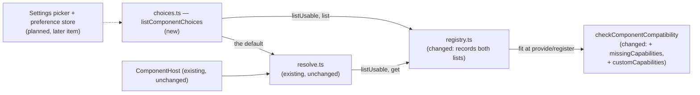

# Component Capability Validation — only complete implementations are offered as overrides, and the rest say which capability they lack

> Slug: `component-capability-validation` · Status: **designed, awaiting implementation** · Epic 2
> (Component Platform), item 18: "Implement Component Capability validation". Builds on
> `2026-09-19-component-contract-api.md` (capabilities and `checkComponentCompatibility`, #19/#22),
> `2026-09-19-component-registry.md` (the recorded fit, `list`, `listUsable`, #26/#28),
> `2026-09-19-component-resolver.md` (`resolveComponent`, #29/#30) and
> `2026-09-19-component-host.md` (#31/#32). The stored preference and the Settings picker stay later
> items. Delivery: one PR to `main`, touching `packages/extension-api` (two additive fields on the
> check's result, README) and `packages/web/src/component-registry/` (the registration and one new
> pure module), plus one AGENTS.md row.

## 📝 TLDR

Most of this item already shipped with its neighbours. The check compares required and declared
capabilities (#22), the registry records every misfit and keeps it out of `listUsable` (#28), and
the resolver never renders one (#30). What is still missing is small but real:

1. **Nothing defines "the possible overrides" of a contract.** The picker (a later item), the
   layout menu and any diagnostics screen would each compose `listUsable`, `list` and the core
   default on their own, and each could disagree with what the resolver accepts.
2. **The missing capability is only reachable by filtering `issues` by code**, and an extension's
   own (custom) capabilities are not distinguishable from contract ones at all: they sit in
   `declaredCapabilities` next to everything else.

The proposal: `checkComponentCompatibility` will also return `missingCapabilities` and
`customCapabilities`; the registry will record both on every registration; and one new pure
function, `listComponentChoices(registry, contract)`, will return core's default, the overrides a
user may choose, and the unavailable implementations with the capabilities each lacks. It is
defined through `resolveComponent`, and a test pins that the two never disagree. No screen changes.

## Resolved assumptions (autonomous defaults)

The brief left these open. Each default is the most reversible choice: the extension API is private
and experimental, `CORE_COMPONENT_CONTRACTS` is empty on `main` (its first entry is in the open
PR #37), and no preference store exists, so nothing in production can select an implementation yet.
The brief names one capability (validation), so it was not split.

| # | Question | Applied default | Why | Confirm? |
|---|---|---|---|---|
| Q1 | Scope: the validation and its read model only, or also the Settings picker and the stored preference, which is where a user would actually "see" overrides? | **The read model only.** `listComponentChoices` is what the picker will render. This item stores nothing and adds no screen. | The resolver (Q1, Q2) and host (Q5) specs, all owner-confirmed, give the store and the picker to their own item. "No / defer" for "should it also do X?". The picker needs storage decisions (per user or per project) that this item does not. | reversible |
| Q2 | Where are "missing" and "custom" computed: in `checkComponentCompatibility`, or in `packages/web` from the registration's lists? | **In the check**, as two additive result fields. No new runtime export. | AGENTS.md (Extensions row): fit "is answered by `checkComponentCompatibility`, never a hand-rolled id, version or capability comparison". A set difference written in `packages/web` is exactly that. In the check, an extension author's own test sees the same lists the host does. | reversible |
| Q3 | Custom capabilities: enforce a namespace (`${extension.id}.…`) or a grammar on declared names at `provide`? | **No enforcement.** Any declared name the served contract does not list is custom and is never an issue. The README recommends the `${extension.id}.` prefix, which keeps a custom name clear of anything core would name. A hard guarantee (a cap on the shape of core's capability names) is a naming policy for core contracts and is left to its own item. | A throw in `provide` fails the whole activation, which is too harsh for a name the host ignores anyway. Rejecting unknown names would also break the contract-api rule that lets an implementation built against a newer revision of the same major run on an older host (`compatibility.ts:53`). The brief's own example (`jira.issue.create`) is not prefixed, and it stays legal. | reversible |
| Q4 | Should a stored preference that *became* incompatible (the extension updated and dropped a capability) raise a user-visible notice? | **No, defer to the picker item.** The resolver already falls back to core's default and reports `rejected: { reason: 'incompatible', componentId, issues }`, and `registry.get(componentId)` then has `missingCapabilities`. The registry already logs one `[cezar:extensions]` line naming the capability at `provide`. | Without a preference store the path is unreachable in production. The notice's wording and place belong with the screen that lets the user fix it. | reversible |

## 📝 Problem Statement

The brief's goal is that a user can never choose an implementation that does not provide the
required functionality. Its example: a contract requires `task.status` and `task.continue`; an
implementation that declares `task.status`, `task.continue` and `jira.issue.create` fits, and one
that declares only `task.status` does not.

What `main` already does, measured against the brief's Definition of Done:

| Definition of Done | On `main` today | Gap |
|---|---|---|
| An incomplete implementation does not appear as a possible override. | `checkComponentCompatibility` reports `missing-capability` (`compatibility.ts:146`). The registry records `compatible: false`; `listUsable` omits it (`registry.ts:275`); `resolveComponent` sets a preference for it aside as `incompatible` (`resolve.ts:154`); `ComponentHost` renders only the resolver's result. | **"Possible override" has no definition.** A reader must combine `listUsable` (which includes core's default), `list` (which includes misfits) and `coreDefaultComponentId`. Nothing guarantees that what a picker offers is what the resolver honours. |
| The system can name the missing capability. | Each `missing-capability` issue carries `capability` and a message naming it; the registry keeps the issues, logs them once, and the resolver passes them on in `rejected.issues`. | Reachable only by filtering `issues` on `code`. No list a caller can show directly, and the "not available" half of a picker has no read. |
| An extension's custom capabilities are allowed. | Declared names that are neither required nor optional are ignored and never an issue (`compatibility.ts:53`); the registry keeps them in `declaredCapabilities`. | **Not identifiable.** Separating custom names from contract names needs the contract's two lists, which is a capability comparison outside the check. Tests pin that over-declaring is compatible (`compatibility.test.ts`, `registry.test.ts`), but nothing protects a custom name from colliding with an optional capability that core adds later within the same major (the bump table allows that without a new major). |

So the validation itself exists. What this item adds is its **read side**: one definition of the
choices and the two lists, with a naming recommendation for custom capabilities.

## 📝 Proposed Solution

1. **The check returns the two lists.** `ComponentCompatibility` gains `missingCapabilities` (the
   `capability` of every `missing-capability` issue, in the contract's order) and
   `customCapabilities` (declared names the contract neither requires nor lists as optional,
   de-duplicated, in the implementation's order). Both come from the sets the function already
   builds. The rules, their order and every issue stay as they are.
2. **The registry records them.** `ComponentRegistration` gains the same two fields, copied from
   the fit like `capabilities` is. `unknown-contract` registrations get `[]` for both: without a
   served contract nothing can be classified, and `declaredCapabilities` still holds the raw list.
3. **One read model: `listComponentChoices(registry, contract)`** in a new pure module,
   `packages/web/src/component-registry/choices.ts`. It returns core's default, the `overrides` a
   user may choose, and the `unavailable` registrations. It finds the default by calling
   `resolveComponent`, so the default's id is still spelled in one place.
4. **The agreement is tested, not assumed.** For every entry the read model offers,
   `resolveComponent` with that id as the preference renders it; for every unavailable entry, it is
   set aside as `incompatible` with that entry's own `issues`. `resolve.ts` does not change: a
   rejection already carries the `componentId`, and `registry.get` returns the registration with
   its `missingCapabilities`.
5. **A naming recommendation for custom capabilities** (Q3), in the README: prefix them with the
   extension's id.

### Prior art

- **OSGi resolver** (`Require-Capability`). An unresolved bundle reports each missing requirement
  by name, and it is never wired. We already took the matching model (#19); here we take the
  reporting: the unmet requirement is data, not only a message.
- **Language Server Protocol capabilities.** Each side ignores capabilities it does not know, and
  vendor-specific ones live under a reserved `experimental` key so they cannot collide with later
  protocol versions. We take the first idea as a rule (unknown names are never an error) and the second
  as a recommendation: the extension id is already a unique prefix, so no literal `experimental.`
  key is needed.
- **Kubernetes scheduler.** Nodes that fail a filter are not candidates, and the event says why per
  reason ("0/3 nodes are available: 2 insufficient cpu"). We take the split between the candidate
  list and the per-item reasons for the rest, which is `overrides` and `unavailable`.
- **Home Assistant `supported_features`.** The UI shows a control only for a feature the entity
  declares. That is the existing rule for *optional* capabilities (`capabilities` on the
  registration), unchanged here.

### Alternatives considered

- **Compute the lists in `packages/web`.** Rejected (Q2): a second capability comparison, which
  AGENTS.md forbids, and one an extension author's test could not reuse.
- **Registry methods (`listOverrides`, `listUnavailable`).** Rejected. The registry does not know
  which registration is core's default: that rule lives in `resolve.ts`
  (`coreDefaultComponentId`). A module above both keeps the dependency one-way, as `resolve.ts` does.
- **Throw on a missing capability at `provide`.** Rejected long ago (registry spec Q3) and still
  wrong: it would fail the whole activation, and the picker needs the misfit on record to explain it.
- **Reject or strip unknown declared names.** Rejected (Q3): it breaks forward compatibility within
  a major and contradicts the brief's third Definition of Done bullet.
- **`missingCapabilities` on the resolver's `incompatible` rejection.** Rejected. It has no reader
  (Q4 defers the notice), and the rejection's `componentId` already leads to the registration, which
  stays the one place the lists are read from.
- **A two-segment cap on core's capability names, pinned by a test**, so that a prefixed custom
  name (three or more segments, since an extension id has exactly two) could never collide.
  Left out: it is a policy for future core contracts, nothing here depends on it, and the catalog
  it would check is empty on `main`. It belongs with the core tokens in `packages/extension-api`.
- **A `needs` argument, so a call site can demand optional capabilities.** Still deferred
  (resolver spec Q4). No call site needs it.

## 📝 Architecture



Takeaway: the comparison stays in one function, the default rule stays in one function, and the new
module only arranges what those two already decided. `choices.ts` is pure on the same terms as
`resolve.ts`: `import type` only, apart from `resolveComponent`; no React, no DOM, no module state,
no logging, never throws.

**Current consumers.** None of the changed types has a production reader that breaks: the new
fields are additive. `ComponentHost` ignores `rejected`. Only tests notice: the one hand-built `ComponentRegistration`
literal (`registry.test.ts:199`) needs the two fields, and the whole-object assertions need them
named: the registration's (`registry.test.ts:258`) and the check result's (`compatibility.test.ts`,
`example.test.ts:85`).

**Construction sites** (AGENTS.md, "grep the TYPE"). `ComponentCompatibility` is built only in
`result()` (`compatibility.ts:164`). `ComponentRegistration` is built only in `registrationOf`
(`registry.ts:386`), from a `Fit` that has two sources: the check, and the `unknown-contract` branch
of `fitOf` (`registry.ts:212`), which must set both lists to a frozen `[]`.

**Open PRs.** #37 and #38 (task header contract) add `cezar.task.header.main@1` to the catalog and
do not touch `compatibility.ts`, `registry.ts` or `resolve.ts`. #37 does edit three files that
step 4 also edits (`extensions/host.test.ts`, `AGENTS.md`, `packages/extension-api/README.md`), so
the second one to land may have textual conflicts there, with no design conflict behind them. #37
also adds `component-registry/boundary.test.ts`, an import scan: if it is on `main` first,
`choices.ts` must pass it, which its `import type`-only rule is expected to do.

## 📝 Data Model

No stored data: no file, no schema, no migration. In-memory only, rebuilt on every page load.

## 📝 API Contracts

Signatures are normative.

### `@open-mercato/cezar-extension-api` (types only; `surface.test.ts` does not change)

```ts
export interface ComponentCompatibility {
  readonly compatible: boolean
  readonly issues: readonly ComponentCompatibilityIssue[]
  readonly capabilities: readonly ComponentCapability[]
  /** Every required capability the implementation does not declare, in the contract's order: the
   *  `capability` of each `missing-capability` issue. `[]` when there is none, and when an earlier
   *  rule stopped the check (`malformed`, another contract id, another major). */
  readonly missingCapabilities: readonly ComponentCapability[]
  /** Declared names the contract neither requires nor lists as optional, de-duplicated, in the
   *  implementation's order: the extension's own capabilities, or ones from a newer revision of
   *  this major. Never an issue, and the host never relies on one. Filled whenever rule 4 ran,
   *  compatible or not; `[]` when an earlier rule stopped the check. */
  readonly customCapabilities: readonly ComponentCapability[]
}
```

Both arrays are frozen. `compatible` stays `issues.length === 0`; a custom capability never
changes it. Two TSDoc passages that say such names "are ignored" are reworded to "are kept as
custom capabilities and never affect the fit": `ComponentImplementation.capabilities`
(`components.ts`), which also names the prefix recommendation, and the function's own comment
(`compatibility.ts:53`).

### `packages/web/src/component-registry/registry.ts`

```ts
export interface ComponentRegistration {
  // …existing fields
  /** The check's `missingCapabilities`. `[]` when compatible, and for every other kind of misfit. */
  readonly missingCapabilities: readonly ComponentCapability[]
  /** The check's `customCapabilities`. `[]` for `unknown-contract`. */
  readonly customCapabilities: readonly ComponentCapability[]
}

export interface UsableComponent<Props> /* …existing */ {
  readonly missingCapabilities: readonly []
}
```

`logComponentDiagnostic` and core `register`'s errors do not change: their messages already name
each missing capability.

### `packages/web/src/component-registry/choices.ts` (new)

```ts
/** The reads the choices need. `get` is here only so the value also fits `ResolverRegistry`:
 *  listing passes no preference, so the resolver never calls it. The cockpit's registry is one. */
export type ChoicesRegistry = Pick<CockpitComponentRegistry, 'listUsable' | 'list' | 'get'>

export interface ComponentChoices<P> {
  readonly status: 'resolved'
  /** Core's default: what renders with no preference. Always offered. */
  readonly default: UsableComponent<P>
  /** Every other usable implementation of the contract, core's own alternatives included, sorted
   *  by `componentId`. Exactly the ids `resolveComponent` honours as a preference. */
  readonly overrides: readonly UsableComponent<P>[]
  /** Every registration of this contract id that cannot render, sorted by `componentId`, each
   *  with its `issues` and `missingCapabilities`. To explain, never to select. */
  readonly unavailable: readonly ComponentRegistration[]
}

export type ComponentChoiceList<P> = ComponentChoices<P> | { readonly status: 'unresolved' }

export function listComponentChoices<P>(
  registry: ChoicesRegistry,
  contract: ComponentContract<P>,
): ComponentChoiceList<P>
```

### Listing, precisely

1. `resolution = resolveComponent(registry, contract)`. `unresolved` (a malformed token, a major the
   cockpit does not serve, or no core default) returns a frozen `{ status: 'unresolved' }`: with
   nothing to fall back to, nothing may be offered.
2. `default = resolution.fallback`.
3. `overrides` = `registry.listUsable(contract)` without the entry whose `componentId` is the
   default's, sorted by `componentId` in code-unit order.
4. `unavailable` = `registry.list(default.contractId)` filtered to `compatible === false`, sorted the
   same way. It holds every kind of misfit (another major as well as a missing capability), because
   the picker explains them all; `missingCapabilities` is non-empty only for the capability kind.
5. The result and both arrays are frozen, and new on every call. The entries are the registry's own
   frozen registrations.

Sorted rather than in registration order, because extensions activate asynchronously and a list that
reshuffles between page loads reads as a bug. Invariant: `default`, `overrides` and `unavailable`
are disjoint, and together they are `registry.list(contract.id)`.

## 📝 UI/UX

None in this item: no screen, route, setting or user-visible string (Q1). The console diagnostic is
unchanged. `overrides[].customCapabilities`, `capabilities` and `unavailable[].missingCapabilities`
are shaped for the picker, which is a later item.

## 📝 Edge Cases & Failure Scenarios

- **The brief's example.** Required `task.status`, `task.continue`; declared `task.status`,
  `task.continue`, `jira.issue.create`: compatible, in `overrides`, `customCapabilities` is
  `['jira.issue.create']`. Declared `task.status` only: `compatible: false`, in `unavailable` with
  `missingCapabilities: ['task.continue']`, never in `overrides`, and a preference for it renders
  core's default.
- **A custom name that matches a capability core adds later.** Adding an optional capability does
  not bump the major, so a custom name could start to mean something to the host. A name under
  `${extension.id}.` is one core has no reason to pick, which is why the README recommends it. An
  unprefixed one (the brief's `jira.issue.create`) stays allowed and carries that risk, which the
  README states. A hard guarantee is left to its own item (§ Alternatives considered).
- **A newer revision's optional capability on an older host.** It lands in `customCapabilities`.
  That is accurate from this host's view: it does not know the name and does not rely on it.
- **Several capabilities missing.** All are listed, in the contract's order, as the issues already are.
- **Another major, another contract id, malformed lists.** The check stops before rule 4, so both
  new lists are `[]`. The entry is in `unavailable` with its issues.
- **`unknown-contract`.** Both lists `[]`. `listComponentChoices` is `unresolved` for a contract the
  cockpit does not serve, so such a registration is never listed as unavailable *for* a served one.
- **An extension deactivates.** Its registrations leave the registry, and the next call no longer
  lists them. The read model keeps no cache; a reactive reader follows `registry.subscribe`, as
  `ComponentHost` does.
- **Core's default is missing.** `unresolved`: no overrides are offered, because there would be no
  fallback. `missingCoreDefaults` already gates this in tests.
- **A capability declared but not honoured.** Unchanged: the check compares declarations. A
  replacement that throws falls back to core's default (#32).
- **Hostile input.** The check stays total. `customCapabilities` is built from the same copied,
  bounded list (at most 256 names) the check already walks, so it adds no new read of the input.
- **An extension bundling an older copy of the API.** Its own call to the check returns no new
  fields; the host always uses its own copy, so registrations always carry them.

## 📝 Risks & Impact Review

- **Result shape grows.** Assertions on the check's whole result (`compatibility.test.ts`,
  `example.test.ts:85`, the README example at `README.md:304`) and on a whole registration
  (`registry.test.ts:258`) must name the two new fields. The
  package is private and experimental, and is not in `BACKWARD_COMPATIBILITY.md`.
- **The word "custom" over-claims.** The list also holds a newer revision's names. The TSDoc says
  so; a picker should label it "also declares", not "extension features".
- **The prefix is advice, not a guarantee.** A collision between a custom name and a later core
  capability stays possible for an extension that ignores the advice. The consequence is bounded:
  the host would rely on a behaviour the implementation did not promise, the same position as a
  capability declared but not honoured.
- **A read model without a production reader.** As with the resolver before the host, only tests use
  it until the picker item. The agreement test (step 3) is what keeps it honest meanwhile.
- **Default path.** With no preference store, core's default renders everywhere before and after
  this change. No mechanism is removed and no knob is added.
- **Rollback.** Revert the PR. Nothing outside the two packages references the new names.

## 📋 Phasing

One phase, one PR. The steps are ordered so that each one compiles and passes on its own.

## 📋 Implementation Plan

Every step keeps the validation gate in `.ai/agentic.config.json` green: typecheck, `npm test`,
`test:unit`, `build` and `test:package`.

### Phase 1: Capability validation's read side

1. **The check's two lists** (`packages/extension-api/src/compatibility.ts` and its TSDoc,
   `components.ts` TSDoc, README). `result()` takes and freezes both lists.
   *Tests* (`compatibility.test.ts`):
   - the brief's example: compatible, `missingCapabilities: []`,
     `customCapabilities: ['jira.issue.create']`;
   - declared `task.status` only: `missingCapabilities: ['task.continue']`, equal to the issues'
     `capability` values; two missing come back in the contract's order;
   - custom names are de-duplicated, keep the implementation's order, and exclude required and
     optional names; they are listed on an incompatible (missing-capability) result too;
   - both lists are `[]` for `malformed`, `contract-id-mismatch` and `contract-version-mismatch`;
   - both are frozen; a custom capability alone never makes `compatible` false;
   - existing whole-result assertions updated, in `compatibility.test.ts` and `example.test.ts:85`.
     `surface.test.ts` passes unchanged.

2. **The registration records them** (`registry.ts`: `Fit`, the `unknown-contract` branch of
   `fitOf`, `registrationOf`, `UsableComponent`).
   *Tests* (`registry.test.ts`):
   - an extension missing a required capability is recorded with `missingCapabilities`, and the
     diagnostic fires once, as today;
   - an over-declaring extension is `compatible`, with `customCapabilities` set and
     `declaredCapabilities` unchanged;
   - `unknown-contract`: both `[]` and frozen;
   - core `register` with a missing capability still throws `invalid-input` naming it;
   - the existing registration literal (`:199`) and whole-registration assertion (`:258`) updated.

3. **`choices.ts`**, per § Listing, precisely.
   *Tests* (`choices.test.ts`), on the resolver tests' fixture registry:
   - core's default is `default` and is not in `overrides`; core's compact implementation and the
     usable extensions are, sorted by `componentId`;
   - the implementation missing a capability and the one built for `@2` are in `unavailable` only;
   - **agreement:** for every id in `default` and `overrides`, `resolveComponent` with that
     preference has `source: 'preference'` and renders it; for every `unavailable` entry it has
     `rejected.reason === 'incompatible'`, `rejected.issues` is the entry's own `issues`, and
     `registry.get(rejected.componentId)` is the entry;
   - the three groups are disjoint and together equal `registry.list(contract.id)`;
   - two registries filled in opposite orders give equal results;
   - `unresolved` for a malformed token, another major, and a registry without core's default, even
     with usable extensions registered;
   - a disposed registration disappears from the next call;
   - frozen result and arrays; against a fake `ChoicesRegistry` only `listUsable`, `list` and `get`
     are called, and nothing is written to `console`;
   - type tests: `overrides[0].component` accepts the contract's props, and a usable entry's
     `missingCapabilities` is `readonly []`.

4. **The Definition of Done proof and the docs.**
   *Tests* (`host.test.ts`, block "the components service"): a fixture contract requiring
   `task.status` and `task.continue`; `acme.jira` provides the brief's three names and `acme.partial`
   only `task.status`, both through the extension host. `listComponentChoices` offers `acme.jira`'s
   implementation with `customCapabilities: ['jira.issue.create']`, lists `acme.partial`'s as
   unavailable with `missingCapabilities: ['task.continue']`, a preference for the partial one
   renders core's default, and both extensions stay `active`.
   *Docs:* the extension-api README (the check's result, custom capabilities and the prefix
   recommendation with its reason); AGENTS.md, "Component implementations" row: a list of choices
   comes from `listComponentChoices` and is never composed from `list` and `listUsable` by the
   caller, and missing and custom capabilities are read from the registration and never recomputed.
