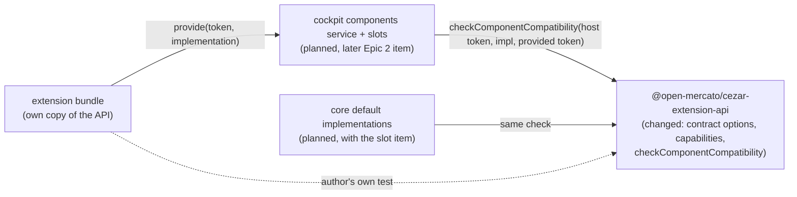

# Component Contract API — capabilities, layout metadata and a compatibility check

> Slug: `component-contract-api` · Status: **designed, awaiting implementation** · Epic 2
> (Component Platform), item 7. Builds on Epic 1 item 1, `2026-09-18-extension-api-package.md`
> (`defineComponentContract`, `ComponentImplementation` and `ComponentRegistry`, merged in #3).
> This spec covers **the contract itself**: what a contract declares, how an implementation
> claims it, and how anyone checks the claim. The host's `context.components` service, the slots
> that render a chosen implementation, the core task contracts and the picker are later items.
> Delivery: one PR to `main`. Code changes are confined to `packages/extension-api`, plus one
> AGENTS.md clause.

## 📝 TLDR

Today a replaceable component is declared with `defineComponentContract<Props>(id, { version })`,
which records an id and a major version and nothing else. A contract cannot say which behaviours
an implementation must honour, or what box the host will render it in. Nothing can answer "does
this implementation fit this contract?" beyond comparing two numbers by hand, so core and
extensions have no shared way to prove they implement the same thing.

The proposal extends the same helper, without breaking its callers. A contract will also declare
**required capabilities**: named behaviours that every implementation must say it honours. It
will also declare **optional capabilities**: behaviours an implementation may offer, which the
host relies on only when the implementation declares them. It can also carry **optional layout
metadata** describing the box the host gives every implementation. An implementation lists the
capabilities it honours. A new pure function,
`checkComponentCompatibility(contract, implementation, implemented?)`, returns
`{ compatible, issues, capabilities }` from data alone. It never touches React, so core's default
implementation and an extension's replacement go through the same check. The contract version
stays a public major number, written `id@version` (`cezar.task.header@1`), with its bump rules
documented beside it.

## Resolved assumptions (autonomous defaults)

The brief left these open. Each default was the most reversible choice. The package is private
and experimental, and nothing outside this repository can depend on it yet. **The owner reviewed
all six on 2026-09-19**: Q1–Q3, Q5 and Q6 are confirmed as written, and Q4 was changed to
required **and** optional capabilities. The last column records each decision.

| # | Question | Decision | Why | Owner (2026-09-19) |
|---|---|---|---|---|
| Q1 | Ship the three task contracts (`task.header@1`, `task.timeline@1`, `task.composer@1`) in this item, or only the mechanism? | **Mechanism only.** The three appear below as illustrative declarations under their core ids (`cezar.task.header`, …) and land with the slot item that renders them. | AGENTS.md (Task routing → Extensions): "Core tokens (`cezar.*`) are added in the same PR as the host code that honours them." Item 1 (Q6) made the same call. Designing three prop models is three separate reviews. | ✅ confirmed |
| Q2 | Evolve the merged `defineComponentContract`, or replace it? | **Evolve it additively.** Same name, same `(id, options)` call; `requiredCapabilities` and `layout` are new optional options. `ComponentImplementation` gains an optional `capabilities`. `provide(contract, implementation)` is unchanged. | The example extension and every existing call keep compiling. A second helper would leave two ways to declare the same thing. Binding stays explicit in `provide(contract, implementation)`. A separate implementation helper earns its place only once implementations carry metadata of their own (see § Alternatives considered). | ✅ confirmed |
| Q3 | What are "required capabilities"? | **Behaviours of the contract** that types cannot prove (for example "restores the draft when `onSubmit` rejects"). Each implementation declares the capabilities it honours, and the check requires every required one. Host features and permissions an implementation needs are **not** in this item. | This reading is what makes an implementation checkable against a contract. Host-granted permissions belong to the loading and trust-model item and can be added later as a separate, optional field. | ✅ confirmed |
| Q4 | Optional capabilities in v1? | **Yes: required and optional.** A contract lists `optionalCapabilities` beside `requiredCapabilities`. The check returns `capabilities`: every required one plus the optional ones the implementation declares. The host relies on an optional capability only when it appears there. Names that are neither required nor optional are ignored. | The picker can show what each implementation supports, and the host knows which optional behaviours it may count on. The autonomous default was "required only" to keep surface small; the owner chose the fuller model. | 🔁 changed (was: required only) |
| Q5 | Layout metadata: an open record, or a small typed vocabulary? | **A typed vocabulary of three optional fields**: `sizing`, `sticky`, `minBlockSize`. They are advisory until the slot item applies them, and the host keeps control of breakpoints. The helper rejects unknown keys, and hosts ignore them. | The brief makes layout metadata part of the contract. An open record gives no shared meaning to validate or document. Three fields describe the main shape of the task view's header, timeline and composer. Responsive rules, such as the header pinning only from `md` up, stay the host's. New fields can be added later. | ✅ confirmed |
| Q6 | How does compatibility get checked, and how strictly? | **A pure, total function** that never throws and returns `{ compatible, issues }`. The major version must match exactly: no ranges, and a host serves one major per contract id. | It matches `validateManifest` (data in, issues out). The host decides what an issue means (for example `contract-version-mismatch`). Ranges and multi-major hosting need adapters that nobody has asked for. | ✅ confirmed |

## 📝 Problem Statement

The platform's goal is that an extension can offer an alternative implementation of a core
component while keeping core's functional contract, and the user picks which one renders (item 1,
§ Problem Statement). Item 1 shipped the token for that. What the token carries today
(`packages/extension-api/src/components.ts`):

```ts
{ kind: 'component', id: 'acme.hello.greeting', version: 1 }   // + a type-only props phantom
```

That leaves four gaps. Each blocks a later Component Platform item:

- **No behaviour beyond types.** "Props are the contract" (item 1) covers shapes. It cannot express
  the obligations a replacement must keep: that the composer restores the draft when delivery
  fails, or that the header still offers Stop while a task runs. Today these live only in TSDoc,
  so no one can ask whether an implementation claims to keep them.
- **No layout promise.** The task view has three parts:
  - a header that sticks to the top from `md` upward (`packages/web/src/routes/task-thread/run-header.tsx:190`);
  - a transcript that takes the remaining height (`flex-1`, `…/task-thread/task-thread.tsx:329`);
  - a composer dock pinned to the bottom (`sticky bottom-[var(--kb,0px)]`,
    `task-thread.tsx:432`).

  A replacement that sizes or pins itself fights that layout. A host that does not know a slot's
  minimum height shifts the page while it swaps implementations or falls back to the default.
- **No compatibility check.** Item 1 documents `contract-version-mismatch`, but no code computes
  it. The host item would have to invent the comparison, the extension author could not run it in
  their own tests, and core's default implementation would be trusted without any check at all.
- **Version as a number without rules.** `version` is "the major version of the functional
  contract", but nothing says which changes bump it. A public version without bump rules is a
  number nobody can rely on.

## 📝 Proposed Solution

1. **A richer contract, same helper.** `defineComponentContract<Props>(id, { version,
   requiredCapabilities?, optionalCapabilities?, layout? })` validates everything at module load,
   as today, and returns a deeply frozen token:
   `{ kind: 'component', id, version, requiredCapabilities: [...], optionalCapabilities: [...], layout? }`.
   The helper always sets both capability lists (empty when none was given). The type keeps it optional, so a
   structurally built token, or one from an older copy of the package, still fits. The props
   type stays the contract's type parameter, and the token never references a React component.
2. **Implementations declare their capabilities.** `ComponentImplementation` gains
   `capabilities?: readonly ComponentCapability[]`. It is the same shape for a core default
   (`cezar.task.header.default`) and for an extension replacement (`acme.compact.header`). The
   only difference is the id prefix the host already enforces.
3. **One check, no React.** `checkComponentCompatibility(contract, implementation, implemented =
   contract)` reads only ids, versions and capability lists:
   - `contract` is the contract as the checker knows it (the host's own copy);
   - `implementation` is the implementation's `id` and `capabilities` (a full
     `ComponentImplementation` fits);
   - `implemented` is the token the implementation was compiled against (the one `provide`
     received). It defaults to `contract` for an author checking their own implementation; a
     host always passes it.

   It reports the first blocking problem (malformed input, then a different contract id, then a
   different major), or else every missing capability at once. When the implementation is
   compatible, it also returns `capabilities`: what the host may rely on (every required one plus
   the declared optional ones). It never throws, whatever it is given.
4. **Version rules are part of the API.** TSDoc on `version` and a README section state which
   changes bump the major. Contracts are named `id@version` in docs, messages and issues.

### Prior art

- **OSGi `Require-Capability` / `Provide-Capability`** (OSGi Core, the resolver). A bundle is
  wired only when every mandatory requirement is met by a declared capability. We take the model:
  declared capabilities, matched by name, checked before use. We skip namespaces, filter
  expressions and version ranges.
- **Salesforce Lightning Web Components** (`*.js-meta.xml`). Placement targets, per-target
  configuration and platform `capabilities` are declarative data beside the component, not code
  inside it. We take the idea that layout metadata is data on the contract that the host reads.
- **Backstage's new frontend system** (extension blueprints and typed data refs). Definitions are
  plain data that reference types by id, and the app wires them together. That matches our tokens
  compared by id and version rather than identity. We skip its attachment graph.
- **VS Code `engines.vscode`**. Compatibility is a semver range per *extension*. Cezar already
  has that (`engines.cezar`), but one release can move one contract's major and keep the others,
  so contracts carry their own major.

### Alternatives considered

- **Compile-time capability names** (`defineComponentContract<Props, const Caps>`). Rejected for
  now. TypeScript cannot infer `Caps` when `Props` is written explicitly (partial type-argument
  inference), so authors would spell the capabilities twice. The runtime check catches a typo on
  the same test run. A typed overload can be added later.
- **Separate `Model` (JSON) and `Actions` (callbacks) type parameters.** Rejected for now. This
  would make a non-React implementation (an iframe or worker) possible, but no one needs one yet.
  Instead, a documented convention says that data props are JSON view models declared in this
  package, never service types.
- **A `defineComponentImplementation(…)` helper, or a one-argument `provide(implementation)`.**
  Not now (owner, Q2). `provide(contract, implementation)` already keeps the binding explicit,
  and a new concept only to wrap an implementation would churn the example and tests. It becomes
  worth adding once implementations carry metadata of their own, independent of the contract (for
  example allowed zones or a settings schema). It can then arrive as an additive overload.
- **Host permissions as capabilities** (the implementation asks for, say, `commands`). Deferred
  to the loading and trust-model item. It is the opposite direction (implementation → host) and
  needs the trust decision first.
- **Throwing on incompatibility.** Rejected. The host needs every issue for its diagnostic and
  the picker, and an author's test wants to assert on them. `validateManifest` set the precedent.

## 📝 Architecture



The only package that changes is `packages/extension-api`. It keeps every rule in its README: no
runtime dependencies, Node-free and DOM-free, one entry point, and no imports from `packages/web`.
`checkComponentCompatibility` joins the pure helpers. `packages/web` does not change: the
`components` service stays the `unavailableServices` placeholder
(`packages/web/src/extensions/host.ts`) until its own item lands. The takeaway: this item
settles the vocabulary that the host, core and extensions will each check against, without
running any of them.

### Planned consumers (named so the types fit them, out of scope here)

| Later item | What it takes from this one |
|---|---|
| Components service (`context.components.provide`) | Calls the check with the host's token, the implementation and the token `provide` received. It rejects version issues as `contract-version-mismatch` and chooses a code for the rest in its own PR. |
| Slot rendering with fallback (`cezar.task.*` contracts) | Adds the core tokens and their default implementations, checks each default with the same function, and applies `layout` to the slot's box. Relies on an optional capability only when the check's `capabilities` lists it. |
| Implementation picker (Settings) | Lists only compatible implementations, shows which optional capabilities each supports, and shows the issues for the rest. |

## 📝 API Contracts

The new public surface, exported from `src/index.ts`. Signatures are normative. Every symbol
carries TSDoc, since for extension authors the TSDoc is the documentation.

### Contract

```ts
/**
 * A named behaviour of a contract that its props' types cannot prove, e.g. `restores-draft` or
 * `task.continue`. The contract's TSDoc defines each one. One or more dot-separated segments of
 * `[a-z0-9][a-z0-9-]*`, at most 64 characters, and local to its contract.
 */
export type ComponentCapability = string

/**
 * The box the host gives every implementation of a contract. Advisory data: the host applies it
 * to the slot, and the implementation is written for it.
 */
export interface ComponentLayout {
  /** `content` (default): the implementation's own block size. `fill`: the slot grows into the
   *  remaining space of its container, and the implementation must stretch to it. */
  readonly sizing?: 'content' | 'fill'
  /** The edge the host pins the slot to while its container scrolls. */
  readonly sticky?: 'top' | 'bottom'
  /** CSS pixels the host reserves while an implementation loads, fails or is swapped, so the
   *  page does not shift. An integer from 0 to 2048. */
  readonly minBlockSize?: number
}

export interface ComponentContractOptions {
  /** Major version of the functional contract. See "When `version` changes". */
  readonly version: number
  /** Behaviours every implementation must declare. Unique. Default `[]`. */
  readonly requiredCapabilities?: readonly ComponentCapability[]
  /** Behaviours an implementation may declare. The host relies on one only for an implementation
   *  that declares it; for the others it must not depend on that behaviour (e.g. it hides the
   *  feature). Unique, and none may also be required. Default `[]`. */
  readonly optionalCapabilities?: readonly ComponentCapability[]
  readonly layout?: ComponentLayout
}

export interface ComponentContract<Props> {
  readonly kind: 'component'
  readonly id: ContributionId
  readonly version: number
  /** Both lists are always set by the helper (`[]` when none). Optional in the type so a
   *  structurally built token still fits; readers treat a missing list as `[]`. */
  readonly requiredCapabilities?: readonly ComponentCapability[]
  readonly optionalCapabilities?: readonly ComponentCapability[]
  readonly layout?: ComponentLayout
  readonly __props?: (props: Props) => Props
}

export function defineComponentContract<Props>(
  id: ContributionId,
  options: ComponentContractOptions,
): ComponentContract<Props>
```

The helper throws `ExtensionDefinitionError` with code `invalid-id`, listing every issue, for any
of the following. This is the code a bad `version` already uses, so the union does not grow:

- an invalid id or version (unchanged);
- `requiredCapabilities` or `optionalCapabilities` that is not an array;
- a capability that breaks the grammar, or appears twice in its list (`requiredCapabilities[2]`);
- an optional capability that is also required (`optionalCapabilities[0]`);
- more than 32 capabilities in the two lists together;
- `layout` that is not an object, or has an unknown key (`layout.align`);
- a `sizing` or `sticky` value outside its union;
- a `minBlockSize` that is not an integer from 0 to 2048.

The returned token and its nested arrays and object are frozen.

### Implementation

```ts
export interface ComponentImplementation<Props> {
  readonly id: ContributionId          // core: `cezar.…`; an extension: `${extension.id}.…`
  readonly title: string
  readonly description?: string
  /** The capabilities this implementation honours. Must include every one its contract requires,
   *  may include any of its optional ones; other names are ignored. */
  readonly capabilities?: readonly ComponentCapability[]
  readonly component: ComponentType<Props>
}
```

### Compatibility check

```ts
export type ComponentCompatibilityIssue =
  | { readonly code: 'contract-id-mismatch'; readonly message: string; readonly expected: string; readonly actual: string }
  | { readonly code: 'contract-version-mismatch'; readonly message: string; readonly expected: number; readonly actual: number }
  | { readonly code: 'missing-capability'; readonly message: string; readonly capability: ComponentCapability }
  | { readonly code: 'malformed'; readonly message: string; readonly path: string }

export interface ComponentCompatibility {
  /** `true` exactly when `issues` is empty. */
  readonly compatible: boolean
  readonly issues: readonly ComponentCompatibilityIssue[]
  /** What the host may rely on for this implementation: every required capability, then the
   *  contract's optional ones the implementation declares, in the contract's order. `[]` when
   *  not compatible. */
  readonly capabilities: readonly ComponentCapability[]
}

/**
 * Does an implementation fit a contract? Compares declarations only — it cannot prove that the
 * implementation behaves as its capabilities claim. Pure and total: never throws.
 *
 * @param contract       the contract as the checker knows it (a host passes its own token)
 * @param implementation its `id` and `capabilities` — a `ComponentImplementation` fits
 * @param implemented    the token the implementation was compiled against. Defaults to
 *                       `contract`, which suits an author checking their own implementation's
 *                       capabilities. A host MUST pass the token `provide` received: without it,
 *                       the id and version rules cannot fire.
 */
export function checkComponentCompatibility(
  contract: {
    readonly id: ContributionId
    readonly version: number
    readonly requiredCapabilities?: readonly ComponentCapability[]
    readonly optionalCapabilities?: readonly ComponentCapability[]
  },
  implementation: { readonly id: ContributionId; readonly capabilities?: readonly ComponentCapability[] },
  implemented?: { readonly id: ContributionId; readonly version: number },
): ComponentCompatibility
```

The parameters are structural on purpose. A token from another copy of the package, or one built
without the helper, fits them, and the `__props` phantom is not needed. `implementation.id` is
required, which does two things. It keeps the parameter from being a TypeScript "weak type"
(all-optional), so an implementation typed without `capabilities` still compiles. It also lets
messages name the implementation.

The rules run in order, and each gates the next. Rules 2 and 3 skip the capability comparison
because it is meaningless across different contracts, and a new major is expected to change the
required set. Without the gate, a single mismatch would bury the one real issue under spurious
`missing-capability` entries.

1. **Read.** Each field is read once, in its own `try`:
   - `contract.id`, `contract.version`, `contract.requiredCapabilities` and
     `contract.optionalCapabilities`;
   - `implementation.id` and `implementation.capabilities`;
   - `implemented.id` and `implemented.version`.

   A value that is not an object, a field that throws when read (a getter or a revoked proxy), or
   a list that is not an array of strings produces `malformed` at that field's own path (for
   example `implementation.capabilities[1]`, or `contract` for a non-object). A list is read up to
   256 names: a longer one, or a `length` that lies, is `malformed` at the list's path without
   being walked, and a list reports at most one `malformed`. Any `malformed` issue ends the check;
   nothing else is compared.
2. `implemented.id !== contract.id` → `contract-id-mismatch`, and stop.
3. `implemented.version !== contract.version` → `contract-version-mismatch` with both numbers,
   and stop.
4. Each name in `contract.requiredCapabilities` that is missing from
   `implementation.capabilities` → one `missing-capability`. A missing capability list, on
   either side, counts as `[]`.
5. No issues → `compatible: true` and `capabilities` = the required list, then each optional
   capability the implementation declares, in the contract's order. Declared names that are
   neither required nor optional are ignored, never an issue.

`malformed` is deliberately not called `invalid-input`: that name is already an
`ExtensionErrorCode` with another meaning. `contract-version-mismatch` deliberately *is* the
error code's name, so a host maps that issue to it one to one.

Messages name contracts as `id@version`, for example
`implements cezar.task.header@1, but this Cezar serves cezar.task.header@2` or
`does not declare "restores-draft", required by cezar.task.composer@1`.

### When `version` changes

A contract's major version is part of the public API. Once the package is published, it is listed
next to the token in `BACKWARD_COMPATIBILITY.md`. Until then, the release notes are the only notice.

| Change to a contract | Bump the major? |
|---|---|
| Remove, rename or narrow a prop; make an optional prop required; add a required prop | **Yes** |
| Change when a callback is called, or what it promises | **Yes** |
| Add a required capability, or promote an optional one to required | **Yes**: existing implementations may not declare it |
| Change `layout.sizing` | **Yes**: an implementation built for its own size must now stretch, or the reverse |
| Add an optional prop; add or remove an optional capability; demote a required capability to optional; change `sticky` or `minBlockSize`; clarify TSDoc | No |

### Illustrative declarations (land with the slot item, not here)

These show the brief's `task.header@1`, `task.timeline@1` and `task.composer@1` under the ids the
grammar requires (the `cezar` publisher is core's). Their props and capability names are only a
sketch. Each is designed and reviewed in the item that renders it, next to the component it
replaces (`run-header.tsx`, `thread-scroller.tsx`, `components/composer/composer.tsx`).

```ts
export const TaskHeader = defineComponentContract<TaskHeaderProps>('cezar.task.header', {
  version: 1, requiredCapabilities: ['task-actions'], layout: { sticky: 'top', minBlockSize: 56 },
})
export const TaskTimeline = defineComponentContract<TaskTimelineProps>('cezar.task.timeline', {
  version: 1, requiredCapabilities: ['live-updates'], layout: { sizing: 'fill' },
})
export const TaskComposer = defineComponentContract<TaskComposerProps>('cezar.task.composer', {
  version: 1,
  requiredCapabilities: ['restores-draft'],
  optionalCapabilities: ['attachments', 'dictation'],
  layout: { sticky: 'bottom', minBlockSize: 96 },
})

// Core's default and an extension's replacement implement the same contract, the same way:
const coreDefault = { id: 'cezar.task.composer.default', title: 'Cezar', capabilities: ['restores-draft', 'attachments', 'dictation'], component: ComposerAdapter }
const zen = { id: 'acme.zen.composer', title: 'Zen', capabilities: ['restores-draft'], component: ZenComposer }
checkComponentCompatibility(TaskComposer, coreDefault).compatible // true: core checks its default
checkComponentCompatibility(TaskComposer, zen).compatible         // true: zen's author, in their tests
// The host, when an extension calls provide(zenToken, zen): its own token, then the one it received.
checkComponentCompatibility(TaskComposer, zen, zenToken).compatible
// What the host may count on: Zen honours no optional capability, so the host must not rely on
// attachments or dictation while Zen is the chosen composer (the picker says so too).
checkComponentCompatibility(TaskComposer, zen, zenToken).capabilities // ['restores-draft']
```

The props are view models declared in `packages/extension-api`. The package must not import the
contract (`test/boundary.test.ts`), so they cannot be `ApiRun`. Data props should be JSON
(`IsJson`), and only callbacks may be functions. The props must not contain `ReactNode` slots
that expose cockpit internals.

## 📝 UI/UX

None in this item: no screen, route, setting or string changes. `layout` metadata becomes visible
only when the slot item applies it.

## 📝 Edge Cases & Failure Scenarios

- **Token from an older copy of the package** (no capability lists). As `contract`, it
  requires nothing and offers no optional capabilities. As `implemented`, only its id and version are read. Nothing throws.
- **Implementation from an older copy** (no `capabilities`) against a contract that requires some.
  The check reports `missing-capability` for each, so the host never renders it. Every core token
  with required capabilities ships after this item, so no real extension is in this state.
- **Implementation that over-declares.** Names that are neither required nor optional are
  ignored and are not an issue. This is also what lets an implementation built against a newer
  revision of the same major (one more optional capability) run on an older host: the older host
  simply does not know that name.
- **Implementation that declares an optional capability it does not honour.** Same as a false
  required claim below: the check trusts declarations, and the host relies on the behaviour.
- **Newer layout keys reaching an older host.** A token built by a newer copy may carry a layout
  key this copy does not know. The host reads only the keys it knows. The strictness is at
  definition time, where the helper and the data are the same version.
- **A capability claimed but not honoured.** The check passes, because it compares declarations.
  The safety net stays as item 1 defines it: a replacement that throws while rendering falls back
  to core's default. A behaviour that is wrong without throwing is on the implementation's author,
  and the check does not claim otherwise.
- **Hostile input from extension code** (proxies, getters, cycles). The check is total. It reads
  each field once, inside its own `try`, and never calls a method on the input. Reading a getter
  or a proxy trap does run the input's code; a throw there becomes `malformed` at that field's
  path (rule 1).

## 📝 Risks & Impact Review

- **Compatibility.** The only observable change to existing code: tokens made by
  `defineComponentContract` gain `requiredCapabilities: []` and `optionalCapabilities: []` keys. `components-storage.test.ts`
  asserts `toEqual({ kind, id, version })` and is updated. `example.test.ts:65` compares the
  example's recorded contract with the test's own copy of `Greeting`, so step 7 changes both
  copies together. The example extension and `provide` compile unchanged. The package is private and not in `BACKWARD_COMPATIBILITY.md` (it gains a
  section only at publication, per item 1).
- **Freezing the wrong vocabulary.** "Required capability" is fixed here, before any host reads
  it. The mitigation is item 1's: the package is private, `0.x` and marked experimental, and the
  components-service item may revise these types in the PR that implements them. The owner
  confirmed this reading (Q3) on 2026-09-19.
- **Layout metadata ships before its reader.** The brief puts layout in the contract, but no host
  applies it until the slot item. That is the same position as the rest of this mechanism. The
  cost is a vocabulary the slot item might want to reshape (for example, responsive pinning). It
  may, since the package is private.
- **Self-attestation reads as verification.** The TSDoc, the README and the issue messages all say
  "declares", never "verifies". A conformance kit that renders an implementation against a
  contract's behaviours would be a separate, later item.
- **A mechanism without a production caller.** Until the components service lands, only tests and
  the example use the check, as with item 1's tokens. Q1 keeps the core tokens out, per the
  AGENTS.md rule, rather than shipping promises nothing renders.
- **Rollback.** Revert the PR. No other package references the new exports.

## 📋 Phasing

1. **Phase 1 — The richer contract.** `ComponentCapability`, `ComponentLayout`,
   `ComponentContractOptions`, the new token fields (both capability lists and `layout`) and
   their validation. The package works on its
   own, and existing callers are unchanged.
2. **Phase 2 — Implementations and the check.** `ComponentImplementation.capabilities`,
   `checkComponentCompatibility` and its result types, with the core-and-extension proof.
3. **Phase 3 — Public surface and documentation.** The export snapshot, the example extension,
   the README's versioning and capability rules, and the AGENTS.md routing row.

## 📋 Implementation Plan

Every step keeps the validation gate in `.ai/agentic.config.json` green: typecheck, `npm test`,
`test:unit`, `build`, `test:package`.

### Phase 1 — The richer contract

1. **Types and validation.** In `src/components.ts`, add `ComponentCapability`, `ComponentLayout`
   and `ComponentContractOptions`. Extend `ComponentContract` and `defineComponentContract` per
   § Contract. Collect capability and layout issues next to the existing version issue, so one
   throw names everything. Freeze copies of the capability array and the layout object.
   *Test* (`components-storage.test.ts`):
   - a token with and without the new options, deeply frozen, with both capability lists `[]`
     by default;
   - dotted capability names (`task.continue`) are accepted; an optional capability that is also
     required is rejected at `optionalCapabilities[i]`;
   - each invalid case from § Contract throws `invalid-id` at the exact issue path;
   - a bad id, a bad version and a bad capability are reported together in one message.
2. **Type tests.**
   - `ComponentProps<typeof C>` is unchanged by the new options;
   - a contract with `layout: { sizing: 'grow' }` is a compile error;
   - a structurally built `{ kind: 'component', id, version }` object still fits
     `ComponentContract<P>` and the check's `contract` parameter.

### Phase 2 — Implementations and the check

3. **`capabilities` on implementations.** Add the optional field to `ComponentImplementation`,
   with TSDoc. *Test:* `provide(contract, { …, capabilities: ['x'] })` typechecks. An
   implementation without it still typechecks.
4. **`checkComponentCompatibility`.** Add it in a new `src/compatibility.ts`, with its result
   types, implementing § Compatibility check rules 1–4. *Tests* (new `compatibility.test.ts`):
   - compatible: the full set declared; over-declared names; no requirements and no declarations;
   - each issue code, with its fields and its `id@version` message;
   - several `missing-capability` issues returned together;
   - `capabilities` on a compatible result: required ones first, then only the declared optional
     ones in contract order; unknown declared names left out; `[]` on every incompatible result;
   - gating: an id mismatch returns exactly one issue, a version mismatch returns exactly one issue
     (no `missing-capability` alongside it), and a `malformed` field ends the check;
   - an implementation typed without `capabilities` compiles as the `implementation` argument
     (type test);
   - `implemented` defaults to `contract`;
   - older-copy shapes: no capability lists on the contract, no `capabilities` on the
     implementation;
   - hostile inputs (`null`, a number, a throwing getter, a revoked proxy, a non-string
     capability), each returning `malformed` at the field's own path and never throwing.
5. **Core and extension on one contract** (the definition-of-done proof). *Test:*
   - one fixture contract, a `cezar.test.greeting.default` implementation and an
     `acme.hello.loud` implementation both pass the check through the same three-argument call
     (host token, implementation, the token each was "provided" with);
   - an implementation compiled against `@1` fails against the same id at `@2` with exactly one
     `contract-version-mismatch`;
   - the check never reads `component`: it passes when `component` is a getter that throws.

### Phase 3 — Public surface and documentation

6. **Export and pin.**
   - Re-export the new types and `checkComponentCompatibility` from `src/index.ts`;
   - add `checkComponentCompatibility` to `test/surface.test.ts`'s runtime list, which is the one
     deliberate surface edit;
   - `test/boundary.test.ts` stays green, since there are no new imports.
7. **Example extension.**
   - give `examples/hello-extension`'s `Greeting` a `requiredCapabilities: ['greets-by-name']`,
     and give the implementation object passed to `provide` (`id: 'example.hello.loud'`) the
     matching `capabilities`;
   - in `example.test.ts`, give the test's own copy of `Greeting` the same
     `requiredCapabilities`, so the existing `toEqual` at line 65 still holds;
   - assert that the recorded implementation passes `checkComponentCompatibility` with that copy
     and the recorded token. Then assert that it fails with `missing-capability` once its
     `capabilities` are removed, so the check is not vacuous.
8. **Docs.**
   - README "Replacing a component": required and optional capabilities, layout metadata, and the "When
     `version` changes" table. The check's example is quoted from the checked-in example
     extension, not written separately, so the gate compiles it;
   - update the status paragraph to say contracts are checkable while `context.components` is
     still unimplemented;
   - AGENTS.md's Extensions routing row gains one clause: component compatibility goes through
     `checkComponentCompatibility`, never a hand-rolled comparison.

   *Test:* the validation gate.
