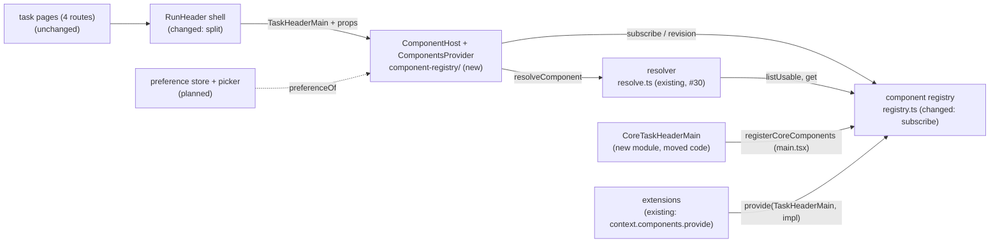

# Component Host — render a contract's resolved implementation, isolated, with core's default as the fallback

> Slug: `component-host` · Status: **designed, awaiting implementation** · Epic 2 (Component
> Platform), item 10: the slot item that the earlier specs keep deferring to. Builds on
> `2026-09-19-component-resolver.md` (`resolveComponent`, `missingCoreDefaults`, #29/#30),
> `2026-09-19-component-registry.md` (the registry, #26/#28) and
> `2026-09-19-component-contract-api.md` (capabilities, `layout`, #19/#22). The stored preference
> and the Settings picker stay later items. Delivery: two stacked PRs to `main`. Phase 1 (the
> host) touches only `packages/web`. Phase 2 (the first slot) adds one file to
> `packages/extension-api`, splits `RunHeader`, and edits AGENTS.md.

## 📝 TLDR

Today the four task pages each render `RunHeader`, and every part of it is fixed. An extension can
already `provide` an implementation of a component contract, and the resolver can already say which
one should render. But nothing renders the answer, and a component that throws takes the whole
page down, because the cockpit has no error boundary.

The proposal adds **`ComponentHost`**, the runtime layer between core and a replaceable component:
`<ComponentHost contract={TaskHeaderMain} props={main} />`. It will ask the resolver which
implementation renders, pass it the contract's props, and isolate it in its own error boundary,
inside a box sized by the contract's `layout`. If an extension's implementation throws, core's
default takes its place and the user sees a short notice. The rest of the page keeps working.

The first real contract ships with it: **`cezar.task.header.main@1`**, the presentational part of
the task header (title, status, basic meta). `RunHeader` becomes core's shell around it. The task's
actions, the tabs, the monitoring and dispatch lines and the step rail stay core's, beside the
slot, so no replacement can take away control of a task. Until the picker item stores a choice,
nobody has a preference, so core's header renders everywhere, exactly as it does today.

## Resolved assumptions (autonomous defaults)

The brief left these open. The owner decided Q4a–Q4c on 2026-09-19, and those rows record the
decisions. The other rows are still autonomous defaults, each the most reversible choice that meets
the brief's Definition of Done.

| # | Question | Answer | Why | Status |
|---|---|---|---|---|
| Q1 | The brief bundles the generic host and its first real slot (a core contract, core's default, a page rendering it). Split them into two specs? | **One spec, two phases, two stacked PRs.** Phase 1 (the host, proven on fixtures) ships first; phase 2 adds the task header slot. | They are not independent: the slot needs the host, and the host has no production caller without the slot. AGENTS.md (Task routing → Component implementations): "A core contract joins `CORE_COMPONENT_CONTRACTS` … in the same PR as the slot that renders it". | default, reversible |
| Q2 | Which contracts does this item add? | **Only `cezar.task.header.main@1`.** The timeline and composer are later items, and so are the header's other parts (Q4b). | "No / defer" for "should it also do X?". The contract-api spec wants each contract "designed and reviewed in the item that renders it". One contract is enough to prove the host. | default, reversible |
| Q3 | The brief writes `contract="task.header@1"` (a string) and `value={model}`. Keep that shape? | **The served token and a `props` object:** `<ComponentHost contract={TaskHeaderMain} props={…} />`. | The token carries the props' type, so a page cannot pass the wrong model, and `listUsable` needs the host's token anyway. A string would need a runtime lookup and a cast. `useCommand(TaskContinue)` set the precedent. | default, reversible |
| Q4a | May an extension's header get the task's title? | **Yes.** The title is part of the contract's props. | Events and component contracts have different jobs. An event only signals a change, so its payload stays minimal (`core-events.ts`: "ids, statuses and versions"). A component contract carries what its UI renders, and a header that cannot show the task's name makes the contract too weak from the start. The events' rule does not bind component contracts. | ✅ owner, 2026-09-19 |
| Q4b | A replacement of the whole `RunHeader` would drop rename, Notes, Pin, Open in, Finish, Mark unread, Delete, the meta row, the monitoring and dispatch lines and the step rail. What does an extension replace? | **Only the presentational part.** `RunHeader` is split. The replaceable part, `cezar.task.header.main@1`, holds the title, the status and the basic meta. The task actions (the desktop action bar and the phone menu), the tabs, the monitoring and dispatch lines, the step rail, the resume hint and the notes panel stay core's, beside the slot. Any of them can become its own contract later (`cezar.task.header.actions`, `.tabs`, `.monitoring`, `.dispatch`, `.steps`) when a real need appears. | One contract for the whole header would grow into a public copy of a large piece of Cezar's internals, and every action in it would have to be kept stable across versions. Separate extension points compose: one extension can style the header, another can replace the actions later, and the user can mix them. Splitting now costs about half a day to a day, and it saves a bigger refactor later. | ✅ owner, 2026-09-19 |
| Q4c | Which capabilities must every replacement declare? | **Only what the main part owns:** `shows-title` and `shows-status` are required, and `shows-meta` is optional. Tabs and task actions are not capabilities of this contract, because core renders them beside it. | A replacement is responsible only for what it replaces. The owner's example names (`task.title`, `task.status`, `task.primary-meta`) are mapped to this repository's capability naming (`shows-title`, as in the registry fixtures). Capability names are local to their contract, so no `task.` prefix is needed. | ✅ owner, 2026-09-19 |
| Q5 | Where does the preference come from, while no store exists? | **A provider seam that answers "no preference".** `ComponentsProvider` takes an optional `preferenceOf(contractId)`. Production passes none, so core's default renders everywhere. Tests pass one to render extension implementations. | The resolver spec (Q2, confirmed) gave the store to the picker item, which writes it. | default, reversible |
| Q6 | What does the user see when an implementation throws? | **Core's default in its place, plus one toast** naming the implementation ("Jira header stopped working. Showing Cezar's default task header.") once per failed registration per page load, and one `[cezar:extensions]` console line. If core's default throws, the box shows a short inline error with **Try again**. | The extension API already promises "falls back to core's default, with a visible notice" (`ComponentRegistry` TSDoc). A toast reuses the cockpit's existing `toast` and does not shift the layout. | default, reversible |

Two points look open but were decided earlier. The host **applies `layout`** to its box (contract-api
spec, § Planned consumers: the slot "applies `layout` to the slot's box"). The registry **gains
change notification** here (registry spec, Q4: `subscribe` is deferred "to the slot and picker
item, its first reader").

## 📝 Problem Statement

The platform's promise: an extension can offer another implementation of a core component, the
user picks one, and a broken replacement never breaks the cockpit. The extension API states it on
`ComponentRegistry` (`packages/extension-api/src/components.ts`): opt-in selection, a guaranteed
fallback "with a visible notice", and versioned implementations. Three of the four pieces exist:

- **The contract and fit check** (#22): `defineComponentContract`, `checkComponentCompatibility`.
- **The registry** (#28): every implementation with its provenance and recorded fit.
- **The resolver** (#30): the user's usable choice, otherwise core's default, and always core's
  default as `fallback`.

The missing piece is the one a user would notice:

- **Nothing renders the resolution.** `resolveComponent` has no caller outside tests, and
  `CORE_COMPONENT_CONTRACTS` is empty, so every extension `provide` is recorded as
  `unknown-contract`.
- **The header is one fixed block.** `task-thread.tsx`, `task-changes.tsx`, `task-commits.tsx` and
  `task-files.tsx` each render `RunHeader` (`run-header.tsx`, about 1,270 lines). The title, the
  meta, the actions and the tabs are one component, so there is no part another implementation
  could take over without taking over everything.
- **One throw ends the page.** `packages/web/src` has no error boundary: no
  `getDerivedStateFromError`, and no route `errorElement` under the declarative `BrowserRouter`.
  A component that throws while rendering unmounts the whole cockpit.
- **Nothing reacts to the registry.** Extensions activate after the first paint and can deactivate
  at any time. The registry has no change notification, so a slot would keep rendering a removed
  implementation.

The brief's Definition of Done, and where this item proves each point:

| Definition of Done | How this item meets it | Proven by |
|---|---|---|
| The host renders core's and an extension's implementation. | `ComponentHost` renders `resolution.component`: core's default without a preference, the extension's implementation when the preference names it. In production nobody has a preference until the picker item (Q5). | `component-host.test.tsx`, `run-header.test.tsx` |
| An extension's runtime error does not crash the page. | The main part renders inside its own error boundary. A throw while rendering, or in an effect, stays inside the host's box. The actions, the tabs and the thread keep working. | `component-host.test.tsx`, `task-thread.test.tsx` |
| The fallback works automatically. | The boundary that caught the throw renders `resolution.fallback` (core's default) straight away, without resolving again. The provider records the failure and reports it once. A removed extension re-resolves to core's default through the registry's change notification. | `component-host.test.tsx` |
| The page no longer imports the concrete implementation. | The task routes render core's shell (`RunHeader`), which renders the replaceable part only through `<ComponentHost contract={TaskHeaderMain}>`. Core's implementation of that part, `CoreTaskHeaderMain`, is imported only by `core-components.ts`, and a boundary test fails on any other import. | `component-registry/boundary.test.ts` |

## 📝 Proposed Solution

1. **`ComponentHost`, one generic component.** `packages/web/src/component-registry/component-host.tsx`
   renders one contract. It subscribes to the registry, reads the preference for the contract,
   calls `resolveComponent`, and renders the result inside an error boundary and a `Suspense`, in a
   box built from the contract's `layout`. It never picks from `listUsable` itself (AGENTS.md).
2. **`ComponentsProvider`, one for the app.** `component-registry/provider.tsx` hands the tree the
   registry `main.tsx` builds (the extension host's own), the preference seam (Q5) and the failure
   reporter (Q6), and records which registrations failed for which subject. It follows
   `CommandsProvider`: omitted in a test's props, it builds its own registry with core's defaults.
3. **Registry change notification.** `registry.ts` gains `subscribe(listener)` and `revision()`,
   so the host can use `useSyncExternalStore`. The module stays pure.
4. **The first core contract.** `packages/extension-api/src/core-components.ts` declares
   `TaskHeaderMain` (`cezar.task.header.main@1`) and its props (Q4a–Q4c), beside
   `core-commands.ts` and `core-events.ts`. It joins `CORE_COMPONENT_CONTRACTS` in the same PR.
5. **`RunHeader` is split into a shell and a main part (Q4b).** Today's title row and meta row (the
   editable title, the plan mirror, the status pill, the phone-width details toggle and the meta
   row with its chips and engine badge) move out of `run-header.tsx`, unchanged, into
   `CoreTaskHeaderMain` (`routes/task-thread/core-task-header-main.tsx`). That is core's default
   for the contract, registered as `cezar.task.header.main.default` by `registerCoreComponents`,
   which `main.tsx` calls before `startExtensionHost`. `RunHeader` stays the sticky shell: it
   renders the host where the two rows were, the phone actions menu beside it, and everything else
   as today.
6. **Core's default gets what the contract cannot carry through a core-only context.** The shell
   hands `CoreTaskHeaderMain` the page's `run` and the Session tab's engine picker (a `ReactNode`).
   An extension's implementation gets the contract's props only.

The brief's example, with the ids the extension API enforces:

```text
RunHeader (core shell, sticky)
├── <ComponentHost contract={TaskHeaderMain /* cezar.task.header.main@1 */} subject={run.id} props={main} />
│     resolved → box(layout) › boundary › Suspense › <component {...main} />
│        throws → boundary renders <fallback {...main} />; the provider records it and toasts once
│           fallback throws → box › inline error + Try again
├── phone actions menu        core
├── monitoring, dispatch      core
├── tabs + action bar         core
└── step rail, resume hint    core
```

### Prior art

- **React error boundaries** and the `react-error-boundary` package: a class component with
  `getDerivedStateFromError`, reset when a `resetKeys` value changes. We take the reset rule and
  skip the dependency; the boundary is about thirty lines.
- **Backstage's new frontend system** wraps every extension's output in `ExtensionBoundary`, an
  error boundary plus `Suspense`, so one plugin cannot blank the app. We take the same shape per
  host.
- **Grafana plugin extensions** give plugins small, named extension points (a link here, a
  component there) rather than whole pages, and render each inside its own error boundary. We
  take both: a small extension point (Q4b) and one boundary per host.
- **Shopify UI extensions and Figma plugins** run extension UI in a sandbox, which also contains
  infinite loops and hostile code. We skip it: Cezar's extensions are compiled in and trusted, and
  a sandbox needs a different rendering model. The trust model is a later item.

### Alternatives considered

- **One contract for the whole `RunHeader`.** Rejected by the owner (Q4b). It would make the
  contract a public copy of the header's internals, and a replacement could remove the controls a
  user needs to run a task.
- **A per-contract slot component instead of a generic host.** Rejected. Every slot would repeat
  the host's resolution, boundary and fallback logic.
- **Let the page pass the full `ApiRun` through the contract.** Rejected. The package cannot import
  the service's contract (`test/boundary.test.ts`), and a public contract must not freeze the run
  record.
- **Have core's default read the run from the query cache (`useRun(taskId)`).** Rejected.
  `ThreadView` and its tests pass fixture runs as props without seeding the cache, so the header
  would lose its data. The shell already holds the run and passes it on.
- **Register core's default lazily.** Not needed. The main part moves into its own module, which
  holds the two rows and not `run-header.tsx`'s markdown stack, so an eager import keeps the entry
  bundle small. A build check guards it (step 4). `lazy` stays the fallback if the module grows.
- **Re-resolve on every render, without a subscription.** Rejected. An extension that deactivates
  would keep rendering.
- **Retry a failed implementation on the next mount.** Rejected. Moving between tabs remounts the
  header, so a broken replacement would flash, fail and toast on every tab change. **Setting it
  aside for the whole session** was rejected too: one throw on one unusual task would disable it
  on every task. A failure is set aside per registration and subject (the task id).
- **Catch everything with a window `error` handler.** Rejected. It cannot tell whose code threw or
  swap an implementation.

## 📝 Architecture



- **New in `packages/web/src/component-registry/`:** `component-host.tsx`, `provider.tsx`,
  `core-components.ts` (`registerCoreComponents`), `boundary.ts` and `boundary.test.ts`, and their
  tests.
- **New in `packages/web/src/routes/task-thread/`:** `core-task-header-main.tsx`
  (`CoreTaskHeaderMain` with the moved title row and meta row) and `task-header-main.ts`
  (`useTaskHeaderMainProps` and the core-only context).
- **Changed:** `registry.ts` (`subscribe`, `revision`), `core-contracts.ts` (`[TaskHeaderMain]`),
  `main.tsx` and `app.tsx` (register core's defaults, provide the registry), `run-header.tsx`
  (becomes the shell), and every test that renders `RunHeader` or one of the four routes (they add
  `ComponentsProvider`). `commands/boundary.ts` gives its import parser to a shared helper.
- **Unchanged:** the four task routes, which keep rendering `RunHeader` with the same props.
- **New in `packages/extension-api`:** `src/core-components.ts`, re-exported from `src/index.ts`,
  with `test/surface.test.ts` and the README's "Replacing a component" section updated.
- **Not touched:** `resolve.ts`, the extension registry, the command registry, the event bus, the
  HTTP contract, the service and the api-client. No `BACKWARD_COMPATIBILITY.md` surface moves.

In short, core keeps the frame and the controls of a task, and the host fills one named part of
it with whatever the resolver answers, with core's default one boundary away.

## 📝 Data Model

Nothing is persisted. The registry holds one more counter (`revision`) and a set of listeners. The
provider holds the failures of this page load in React state: registration → the subjects it failed
for, plus a revision, so every host that reads it re-renders when it grows. It also holds the
registrations already reported. Both are keyed by the registration object, so a disposed
registration drops out and a re-provided one is tried again.

## 📝 API Contracts

Signatures are normative.

### `packages/extension-api/src/core-components.ts` (public, new)

```ts
/** The task a header shows. JSON. */
export interface TaskHeaderTask {
  readonly taskId: string
  /** The registered project that owns the task. Pass it as `TaskRef.projectId`. */
  readonly projectId: string
  /** The title the cockpit shows for the task: the user's, or the generated one. */
  readonly title: string
  /** `queued`, `running`, `waiting`, `review`, `done`, `failed` or `cancelled` today (the union may grow). */
  readonly status: string
}

/** The basic facts core's header shows under the title. JSON. */
export interface TaskHeaderMeta {
  /** The workflow's display name, e.g. `quick-task`. */
  readonly workflow: string
  /** The task's branch, once it has one. */
  readonly branch?: string
  /** Lines added and removed on the task's branch, once known. */
  readonly diff?: { readonly added: number; readonly removed: number }
}

export interface TaskHeaderMainProps {
  readonly task: TaskHeaderTask
  readonly meta: TaskHeaderMeta
  /** Plan progress, on the Session tab of a task that has a plan. */
  readonly plan?: { readonly done: number; readonly total: number }
}

/**
 * The presentational part of the task header: title, status and basic meta. Core renders the
 * task's actions, tabs, monitoring and dispatch lines and step rail around it, so an
 * implementation neither provides nor can remove them.
 * - `shows-title` (required): shows `task.title`.
 * - `shows-status` (required): shows `task.status`.
 * - `shows-meta` (optional): shows `meta`. The picker says which implementations do.
 * - Layout: 30 CSS pixels (one title row) are reserved while an implementation loads, fails or
 *   is swapped. The shell around it is sticky; this part is not.
 */
export const TaskHeaderMain = defineComponentContract<TaskHeaderMainProps>('cezar.task.header.main', {
  version: 1,
  requiredCapabilities: ['shows-title', 'shows-status'],
  optionalCapabilities: ['shows-meta'],
  layout: { minBlockSize: 30 },
})
```

### `packages/web/src/component-registry/registry.ts` (additive)

```ts
export interface CockpitComponentRegistry {
  // … list, listUsable, get, register, forExtension, unchanged …
  /** Calls `listener` synchronously after every change: a `register`, a `provide`, and a dispose
   *  that removed a registration. Returns the unsubscribe, which is idempotent. A throwing listener
   *  is swallowed and does not stop the others. */
  subscribe(listener: () => void): () => void
  /** A number that grows with every change `subscribe` reports: the snapshot for
   *  `useSyncExternalStore`. */
  revision(): number
}
```

### `packages/web/src/component-registry/provider.tsx` (new)

```ts
/** One implementation that threw, as the reporter receives it. */
export interface ImplementationFailure {
  /** `ComponentRegistration`, not `UsableComponent<unknown>`: a component typed with its
   *  contract's props does not fit a wider props type. */
  readonly registration: ComponentRegistration
  /** Core's default, which now renders in its place. */
  readonly fallback: ComponentRegistration
  readonly error: unknown
}

export function ComponentsProvider(props: {
  /** `main.tsx`'s registry, shared with the extension host. Omitted (tests): a registry of its
   *  own over `CORE_COMPONENT_CONTRACTS`, with `registerCoreComponents` applied. Read once. */
  readonly registry?: CockpitComponentRegistry
  /** The implementation the user chose for a contract. Omitted: no choice for any contract (Q5).
   *  Hosts re-resolve when this function's identity changes. */
  readonly preferenceOf?: (contractId: ContributionId) => ContributionId | null
  /** Called once per failed registration per provider. Default: one toast and one
   *  `[cezar:extensions]` `console.error` line (Q6). */
  readonly onImplementationError?: (failure: ImplementationFailure) => void
  readonly children: ReactNode
}): ReactElement

/** The registry the pages render from. Throws outside `ComponentsProvider`, like `useCommands`. */
export function useComponentRegistry(): CockpitComponentRegistry
```

### `packages/web/src/component-registry/component-host.tsx` (new)

```ts
export interface ComponentHostProps<P> {
  /** A served token from `CORE_COMPONENT_CONTRACTS`, e.g. `TaskHeaderMain`. */
  readonly contract: ComponentContract<P>
  /** What this host shows, e.g. the task id. A failure sets the implementation aside for this
   *  subject only. Default `''`: one subject per contract. */
  readonly subject?: string
  /** The contract's props, passed to the implementation as they are. */
  readonly props: P
}

export function ComponentHost<P>(props: ComponentHostProps<P>): ReactElement
```

### Hosting, precisely

1. **Subscribe.** `revision = useSyncExternalStore(registry.subscribe, registry.revision)`.
2. **Resolve.** `preference = preferenceOf(contract.id)`, then
   `resolution = useMemo(() => resolveComponent(registry, contract, preference), [registry, revision, contract, preference])`.
3. **Unresolved.** Render the box empty with `data-state="unresolved"`. The provider writes one
   `console.error` line per contract per page load, so StrictMode and remounts do not repeat it.
   This is a core bug that the gate test forbids. The host never renders an extension instead.
4. **Choose.** `current` is `resolution.component`, unless the provider records it as failed for
   this `subject`. Then `current` is `resolution.fallback`.
5. **Render.** The box, then `<ImplementationBoundary key={current.componentId + ':' + retry}
   fallback={…}>`, then `<Suspense fallback={null}>`, then `createElement(current.component,
   props)`. `retry` is the host's own counter (step 7). The box keeps its reserved size while the
   implementation suspends.
6. **An implementation throws** while rendering, or in an effect or lifecycle method.
   `getDerivedStateFromError` only flips the boundary to its failed state, because React may call
   it during render. When `current` is not `resolution.fallback`, the failed boundary renders the
   fallback at once, inside a nested boundary of its own. Then `componentDidCatch` tells the
   provider, which records the registration as failed for this subject and bumps its failure
   revision (so a later mount starts at step 4 with the fallback). On the registration's first
   failure in this page load, the provider also calls `onImplementationError`. A toast is never
   raised during render.
7. **The fallback throws.** The box renders an inline error, "This part of the page could not be
   displayed.", with a **Try again** button, which increments `retry` and so remounts the
   boundary. The provider writes one `console.error` line and raises no toast, because the user
   did not choose anything that broke.
8. **The resolution changes** (a preference, or an extension activating or deactivating). A new
   `componentId` changes the key, so the boundary resets. A removed implementation is replaced by
   core's default without a notice, because removal is not a failure.

The box is `<div data-slot="component-host" data-contract={contract.id}
data-component={current.componentId} data-state="resolved | fallback | failed | unresolved">`. The
host applies `layout` with its own responsive rules. `sticky: 'top'` becomes `relative z-20
md:sticky md:top-0`, `sticky: 'bottom'` becomes `md:sticky md:bottom-0`, `sizing: 'fill'` becomes
`flex min-h-0 flex-1 flex-col`, and `minBlockSize` becomes the inline style
`min-block-size: <n>px`. Unknown keys are ignored. `TaskHeaderMain` uses only `minBlockSize`,
because its shell is the sticky element.

### The split (`routes/task-thread/`)

```ts
// task-header-main.ts (new)
/** The contract's props for a run: memoized, with `task`, `meta` and `plan` frozen. `title` from
 *  `runTitle(run)`, `workflow` from `workflowLabel(run)`, `projectId` from `useActiveProjectId()`,
 *  which also answers for the boot project (its scope context is `null`, but its URL is
 *  `/p/<boot>/…`). */
export function useTaskHeaderMainProps(run: ApiRun, planTally?: { done: number; total: number }): TaskHeaderMainProps

// core-task-header-main.tsx (new): today's title row and meta row, moved unchanged.
export function CoreTaskHeaderMain(props: TaskHeaderMainProps): ReactElement
```

`RunHeader` (the shell) keeps its props and its sticky `<header>`. Where the title row and the
details disclosure were, it renders one row: the host
(`<ComponentHost contract={TaskHeaderMain} subject={run.id} props={…} />`, growing to fill) and,
beside it, the phone-width actions menu. Around the host it provides the core-only context
`{ run, continuationEngine }`, which `CoreTaskHeaderMain` reads, together with `plan` from the
props, to render the moved code exactly as today. It throws outside that context. The details
disclosure (`detailsOpenByRun`) moves with the meta row. `useRunActions`, the action bar, the phone
menu, the confirm dialog, the tabs, the monitoring and dispatch lines, the step rail, the resume
hint and the notes panel stay in the shell.

## 📝 UI/UX

**Nothing changes on the happy path.** With no preference, core's default renders, and it is
today's title row and meta row: same markup, same phone-width details toggle. The shell keeps
today's sticky behavior.

The new states, all inside the host's box. The actions, the tabs and the step rail stay visible in
every one of them:

| State | When | What the user sees |
|---|---|---|
| Extension implementation | A preference names a usable one (tests only until the picker item) | The extension's title and status, with core's actions and tabs below. Core-only extras in the main part (inline rename, reference chips, tokens and cost, the engine badge, the queue position) are not shown unless a later contract version adds them. |
| Fallback after a failure | The chosen implementation threw | Cezar's own title row and meta row, plus one toast: "Jira header stopped working. Showing Cezar's default task header." |
| Core failure | Core's default threw | An inline message, "This part of the page could not be displayed.", with **Try again**. The actions, the tabs, the thread and the composer keep working. |
| Loading | The implementation suspended | The box at its reserved 30 px, empty |

Accessibility: the inline message uses `role="alert"`, and **Try again** is a regular `Button`.
The toast uses the cockpit's existing `toast`, which already announces itself.

Prototype: `.ai/specs/assets/component-host/`. `current-01-task-header.png` is today's task page.
`mockup-01-fallback-toast.png` and `mockup-02-core-failure.png` are static mockups of the two
failure states (their `.html` sources sit beside them). The dashed outline marks the host's box.

## 📝 Edge Cases & Failure Scenarios

- **An extension's implementation throws during render or in an effect.** Its host shows core's
  default and one toast. It stays set aside for that task for the rest of the page load, so
  changing tabs does not retry it. Another task tries it again, without a second toast. If the
  extension provides it again (after a reactivation), the new registration is tried everywhere.
- **It throws in an event handler or a promise.** React unmounts nothing for those, so the page
  stays up, and the error reaches the console as an uncaught error. The host does not claim to
  catch it.
- **It loops forever, blocks the main thread or suspends forever.** A same-page component cannot be
  stopped, and a boundary does not help. A sandbox is the later trust-model item. A suspension
  leaves the reserved box empty; timing it out is deferred.
- **The chosen extension deactivates while it renders.** The registry notifies, the resolver
  answers `not-found`, and core's default renders in the same box, without a toast.
- **The chosen extension activates after the first paint.** Core's default renders first and is
  swapped when the registration arrives. Nobody has a preference in production yet (Q5).
- **Core's default throws.** The inline message replaces the title and meta, and the task stays
  controllable through core's actions and tabs. Today the same bug unmounts the whole cockpit.
- **Core forgets its default.** `missingCoreDefaults` fails the gate test first. At run time the box
  renders empty, never an extension's implementation.
- **A replacement of another height.** The shell grows or shrinks with it. Changes and Files pin
  their tree pane at a fixed offset under today's header (`[--diff-sticky-top:10rem]`, `top-40`,
  `task-changes.tsx`), so a much taller replacement would misalign it. Nothing moves in this item,
  because core's default keeps today's height. Publishing the shell's measured height as a CSS
  variable is deferred to the picker item, which makes replacements reachable.
- **An implementation mutates its props.** React copies the top level. The nested `task`, `meta`
  and `plan` are frozen by `useTaskHeaderMainProps`, so a mutation throws in strict-mode code and
  counts as a render failure.
- **StrictMode double rendering.** The boundary's render-phase code is pure, and recording and
  reporting run in `componentDidCatch`, where the provider ignores a repeat for the same
  registration and subject. One failure makes one toast.
- **A component renders `ComponentHost` outside `ComponentsProvider`.** It throws, like
  `useCommands`. `App` always provides it, and tests add it to their wrappers.

## 📝 Risks & Impact Review

- **The first public component contract.** `TaskHeaderMain` fixes `cezar.task.header.main@1`. Once
  an extension implements it, removing or narrowing a prop means a new major. Keeping it to the
  presentational part (Q4b) keeps that surface small. The package is private and experimental,
  and `BUILTIN_EXTENSIONS` is empty, so nobody implements it yet.
- **Task content reaches extension code (Q4a, decided).** The title, the workflow and the branch
  are in the props. Core events still carry ids and statuses only.
- **Splitting a working 1,270-line component.** Code moves from `run-header.tsx` into
  `core-task-header-main.tsx`, and a moved piece can lose an input on the way (the engine picker,
  the details toggle's state, `planTally`). AGENTS.md § Changing a mechanism that already works
  applies. `run-header.test.tsx` (about 1,600 lines) is the guard, and it must pass with only its
  wrapper changed. A QA pass compares the task page at phone and desktop widths with
  `current-01-task-header.png`. On phones, the actions menu now sits beside the host's box rather
  than inside the title row, which narrows the expanded meta row by one 30 px button. That is the
  only intended visual difference.
- **The entry bundle.** `registerCoreComponents` imports `CoreTaskHeaderMain` eagerly into
  `main.tsx`'s chunk. The module holds only the two rows, so the markdown stack stays in the task
  chunks. A build check guards it (step 4).
- **A core-only side channel.** The context gives core's default the page's `run` and the engine
  picker, which no extension gets. This is deliberate: the run record is not a public contract,
  and the engine picker is a core `ReactNode` that the dock also shows.
- **Test churn.** Every test that renders `RunHeader` or one of the four routes adds
  `ComponentsProvider`. As far as the existing `CommandsProvider` wrappers show, that is
  `run-header.test.tsx`, `task-thread.test.tsx`, `task-changes.test.tsx`, `task-files.test.tsx`,
  `deliver-prompt.test.tsx`, `follow-up-engine.test.tsx`, `review-panel.test.tsx`,
  `cross-project-task-navigation.test.tsx` and `routes.test.tsx`.
- **What a boundary cannot catch** (loops, handlers, async) is written down here and in the README,
  so nobody reads "isolated" as "sandboxed".
- **Rollback.** Revert the phase 2 PR, or both. Nothing is persisted, the HTTP contract does not
  change, and the extension API is private.

## 📋 Phasing

1. **Phase 1: The host** (its own PR). Registry change notification, `ComponentsProvider`,
   `ComponentHost`, proven on the fixture contract. No page uses it yet.
2. **Phase 2: The task header slot** (stacked on phase 1). `TaskHeaderMain` in the extension API,
   the `RunHeader` split, core's default and its registration, the boundary and gate tests,
   AGENTS.md and the README.

## 📋 Implementation Plan

Every step keeps the validation gate in `.ai/agentic.config.json` green: typecheck, `npm test`,
`test:unit`, `build` and `test:package`.

### Phase 1: The host

1. **Registry change notification** (`registry.ts`), per § API Contracts.
   *Tests* (`registry.test.ts`):
   - a listener is called once after `register`, after an extension `provide` (compatible or not),
     and after a dispose that removed a registration;
   - it is not called after a second dispose of the same registration, or after a dispose whose
     id was taken again;
   - `revision()` grows with each of those;
   - unsubscribing twice is harmless, and a throwing listener does not stop the next;
   - the module still imports nothing at run time except the extension API.

2. **`ComponentsProvider` and `ComponentHost`** (`provider.tsx`, `component-host.tsx`), per
   § Hosting, precisely.
   *Tests* (`component-host.test.tsx`), on the fixture contract `cezar.fixture.task-header@1`
   with core's default and two extension implementations, as in `resolve.test.ts`:
   - no preference renders core's default, and `data-component` names it;
   - a preference for `acme.jira.task-header` renders it, with the props passed through;
   - that implementation throwing in render, and in an effect, renders core's default with
     `data-state="fallback"`, and a sibling of the host still renders;
   - `onImplementationError` is called once: under StrictMode, with two hosts of the same subject,
     and across two subjects;
   - the reporter is called from `componentDidCatch`, never during render;
   - remounting the host for the same subject keeps the failed implementation set aside, and
     another subject tries it again;
   - re-providing the implementation (a new registration) renders it again;
   - disposing the chosen extension's registration re-renders core's default, with no report;
   - core's default throwing renders the inline alert, and **Try again** remounts it;
   - an unresolved contract renders the empty box and writes one `console.error` line, even under
     StrictMode;
   - a new `preferenceOf` identity re-resolves;
   - the box's classes and style for `sticky: 'top'`, `'bottom'`, `sizing: 'fill'` and
     `minBlockSize`;
   - `useComponentRegistry` throws outside the provider;
   - the default reporter shows one toast and writes one `[cezar:extensions]` line.

### Phase 2: The task header slot

3. **The contract** (`packages/extension-api/src/core-components.ts`), per § API Contracts,
   re-exported from `src/index.ts`.
   *Tests:*
   - `test/surface.test.ts` lists `TaskHeaderMain`;
   - the token equals `{ kind: 'component', id: 'cezar.task.header.main', version: 1, requiredCapabilities: ['shows-title', 'shows-status'], optionalCapabilities: ['shows-meta'], layout: { minBlockSize: 30 } }`
     and is frozen;
   - a type test shows `TaskHeaderMainProps` is JSON (`IsJson`).

   The README's "Replacing a component" section describes the host, the notice, what a boundary
   cannot catch, and the header's main part with what stays core's around it.

4. **The split, core's default and its registration** (`task-header-main.ts`,
   `core-task-header-main.tsx`, `run-header.tsx`, `core-components.ts`, `core-contracts.ts`,
   `main.tsx`, `app.tsx`). Move the title row and the meta row into `CoreTaskHeaderMain`
   unchanged. `RunHeader` renders the host in their place, with the core-only context around it
   and the phone actions menu beside it. `CORE_COMPONENT_CONTRACTS` becomes `[TaskHeaderMain]`.
   `main.tsx` calls `registerCoreComponents(components)` before `startExtensionHost` and passes
   `components` to `App`, which wraps its tree in `ComponentsProvider`.
   *Tests:*
   - `run-header.test.tsx` passes with only its wrapper changed (it adds `ComponentsProvider`);
   - the gate test (`core-components.test.ts`): `missingCoreDefaults(registry, CORE_COMPONENT_CONTRACTS)`
     is `[]` for a registry filled by `registerCoreComponents`, and `['cezar.task.header.main']`
     without it, so the check is shown to fail;
   - `checkComponentCompatibility(TaskHeaderMain, coreTaskHeaderMain).compatible` is `true`, where
     `coreTaskHeaderMain` is the implementation object `core-components.ts` registers (it declares
     all three capabilities);
   - `useTaskHeaderMainProps`: `task` comes from `runTitle` and `useActiveProjectId`, including for
     the boot project (scope context `null`, URL `/p/<boot>/tasks/…`); `meta` matches what the meta
     row shows; the result is referentially stable for the same inputs, and frozen;
   - `CoreTaskHeaderMain` throws outside the shell's context;
   - with a preference for a fixture extension implementation, `RunHeader` renders it, and the
     action bar and tabs are still there;
   - the build: `main.tsx`'s entry chunk contains `CoreTaskHeaderMain` but not the markdown stack
     (`streamdown`) or `run-header`, checked against the Vite manifest.

5. **The boundary test and the failure path on a real page.**
   *Tests:*
   - `component-registry/boundary.test.ts`: first extract the import parser from
     `commands/boundary.ts` into a shared helper (its existing tests keep passing). Then scan the
     cockpit's sources the way `commands/boundary.test.ts` does. The test fails on any import,
     static or dynamic, of `core-task-header-main.tsx` outside `core-components.ts` and tests, and
     proves it catches an alias, a relative path and a dynamic import;
   - `task-thread.test.tsx`: `ThreadView` with a fixture run renders the main part through the
     host (`data-component="cezar.task.header.main.default"`), and the existing header assertions
     pass unchanged. With a preference for a fixture extension implementation that throws, core's
     title row shows, and the actions, the tabs, the thread and the composer still render;
   - the other route tests listed in § Risks add `ComponentsProvider` and otherwise pass
     unchanged.

6. **AGENTS.md**, the "Component implementations" routing row:
   - a replaceable component renders only through `ComponentHost`, and its core implementation is
     imported only by `core-components.ts` (the boundary test);
   - `registerCoreComponents` is the one place core's defaults are registered, in `main.tsx` before
     `startExtensionHost`;
   - core keeps the task's controls (actions, tabs) outside every replaceable part, and a new
     replaceable part of the header is its own contract;
   - the registry notifies through `subscribe` and `revision`, and stays pure;
   - a test that renders `RunHeader` or a task route needs `ComponentsProvider` inside
     `CommandsProvider`;
   - the host isolates render and effect errors only.
