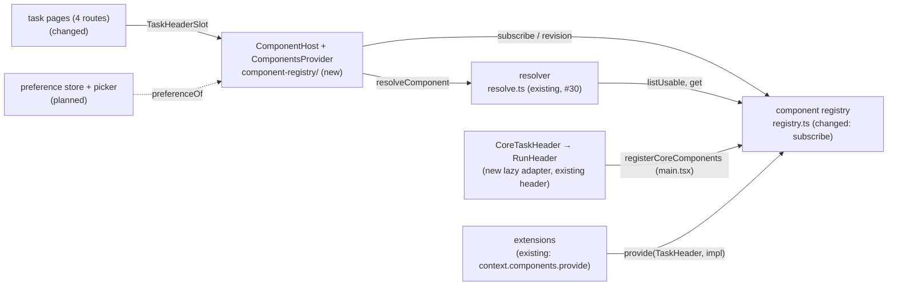

# Component Host — render a contract's resolved implementation, isolated, with core's default as the fallback

> Slug: `component-host` · Status: **designed, awaiting implementation** · Epic 2 (Component
> Platform), item 10: the slot item that the earlier specs keep deferring to. Builds on
> `2026-09-19-component-resolver.md` (`resolveComponent`, `missingCoreDefaults`, #29/#30),
> `2026-09-19-component-registry.md` (the registry, #26/#28) and
> `2026-09-19-component-contract-api.md` (capabilities, `layout`, #19/#22). The stored preference
> and the Settings picker stay later items. Delivery: two stacked PRs to `main`. Phase 1 (the host)
> touches only `packages/web` and can merge on its own. Phase 2 (the task header slot) adds one
> file to `packages/extension-api` and edits AGENTS.md, and waits for Q4 to be confirmed.

## 📝 TLDR

Today the four task pages each import `RunHeader` and render it directly. An extension can already
`provide` an implementation of a component contract, and the resolver can already say which one
should render. But nothing renders the answer, and a component that throws takes the whole page
down, because the cockpit has no error boundary.

The proposal adds **`ComponentHost`**, the runtime layer between a page and a replaceable
component: `<ComponentHost contract={TaskHeader} props={header} />`. It will ask the resolver which
implementation renders, pass it the contract's props, and isolate it in its own error boundary,
inside a box sized by the contract's `layout`. If an extension's implementation throws, core's
default takes its place and the user sees a short notice. The rest of the page keeps working. The
first real contract, `cezar.task.header@1`, ships with it: today's `RunHeader` becomes core's
default implementation, and the four task pages stop importing it. Until the picker item stores a
choice, nobody has a preference, so core's header renders everywhere, exactly as it does today.

## Resolved assumptions (autonomous defaults)

The brief left these open. Each default is the most reversible choice that still meets the brief's
Definition of Done. Q4 needs the owner's confirmation before phase 2 merges.

| # | Question | Default | Why | Confirm? |
|---|---|---|---|---|
| Q1 | The brief bundles the generic host and its first real slot (a core contract, core's default, the pages migrated). Split them into two specs? | **One spec, two phases, two stacked PRs.** Phase 1 (the host, proven on fixtures) can merge before Q4 is settled. Phase 2 adds the task header slot. | They are not independent: the slot needs the host, and the host has no production caller without the slot. AGENTS.md (Task routing → Component implementations) says "A core contract joins `CORE_COMPONENT_CONTRACTS` … in the same PR as the slot that renders it", and the brief's last point ("the page no longer imports the implementation") needs a real page. Two PRs keep the product decision in Q4 from blocking the mechanism. | reversible |
| Q2 | Which contracts does this item migrate? | **Only `cezar.task.header@1`**, the brief's example. `cezar.task.timeline` and `cezar.task.composer` are later items. | "No / defer" for "should it also do X?". The contract-api spec (§ Illustrative declarations) wants each contract "designed and reviewed in the item that renders it, next to the component it replaces". One contract is enough to prove the host. | reversible |
| Q3 | The brief writes `contract="task.header@1"` (a string) and `value={model}`. Keep that shape? | **The served token and a `props` object:** `<ComponentHost contract={TaskHeader} props={…} />`. | The token carries the props' type, so a page cannot pass the wrong model, and `listUsable` needs the host's token anyway. A string would need a runtime lookup and a cast. `useCommand(TaskContinue)` set the precedent. `props` says what the object is: the contract's props, passed on unchanged. | reversible |
| Q4 | What do `cezar.task.header@1`'s props carry, and what must a replacement honour? | **A narrow view model:** `task` (`taskId`, `projectId`, `title`, `status`, `archived`), `actions` (`stop`, `continue`, `archive`: which ones core offers now), `tabs` (`id`, `label`, `href`), the current `tab`, optional `plan`, and `onSelectTab(id)`. Required capabilities: `tabs` and `task-actions`. Layout: `{ sticky: 'top', minBlockSize: 56 }`. The rest of today's header stays core's only: rename, Notes, Open in and Terminal, Finish, Pin, Mark unread, Delete, the meta row (workflow, branch, references, diff, tokens, cost), the monitoring and dispatch lines, the step rail and the resume hint. | A narrow, strict contract is the reversible end. Adding an optional prop later does not bump the major, and demoting a required capability does not either. **Why confirm:** it is the first contract in the public package, and it gives extension code task content (the title). The core events deliberately carry "ids, statuses and versions, never a prompt, a title or a path" (`core-events.ts`). A header cannot be replaced without its title. The dropped list is also a product call: a user who picks a replacement loses those controls on the task page. | ⚠ NEEDS HUMAN CONFIRMATION |
| Q5 | Where does the preference come from, while no store exists? | **A provider seam that answers "no preference".** `ComponentsProvider` takes an optional `preferenceOf(contractId)`. Production passes none, so core's default renders everywhere. Tests pass one to render extension implementations. | The resolver spec (Q2, confirmed) gave the store to the picker item, which writes it. A store here would have to answer questions (per user or per project, browser or `~/.cezar`) that belong to that item. | reversible |
| Q6 | What does the user see when an implementation throws? | **Core's default in its place, plus one toast** naming the implementation ("Jira header stopped working. Showing Cezar's default task header.") once per failed registration per page load, and one `[cezar:extensions]` console line. If core's default throws, the box shows a short inline error with **Try again**. | The extension API already promises "falls back to core's default, with a visible notice" (`ComponentRegistry` TSDoc). A toast reuses the cockpit's existing `toast` and does not shift the layout. A persistent notice belongs with the picker, which will explain a set-aside choice anyway. | reversible |

Two points look open but were decided earlier. The host **applies `layout`** to its box (contract-api
spec, § Planned consumers: the slot "applies `layout` to the slot's box"). The registry **gains
change notification** here (registry spec, Q4: `subscribe` is deferred "to the slot and picker
item, its first reader").

## 📝 Problem Statement

The platform's promise: an extension can offer another implementation of a core component, the
user picks one, and a broken replacement never breaks the cockpit. The extension API states it on
`ComponentRegistry` (`packages/extension-api/src/components.ts`): opt-in selection, a guaranteed
fallback "with a visible notice", and versioned implementations. Three of the four pieces exist:

- **The contract and fit check** (#22): `defineComponentContract`, `checkComponentCompatibility`.
- **The registry** (#28): every implementation with its provenance and recorded fit.
- **The resolver** (#30): the user's usable choice, otherwise core's default, and always core's
  default as `fallback`.

The missing piece is the one a user would notice:

- **Nothing renders the resolution.** `resolveComponent` has no caller outside tests, and
  `CORE_COMPONENT_CONTRACTS` is empty, so every extension `provide` is recorded as
  `unknown-contract`.
- **Pages hard-wire their implementation.** `task-thread.tsx`, `task-changes.tsx`,
  `task-commits.tsx` and `task-files.tsx` each import `RunHeader` from `run-header.tsx`. No other
  implementation has a place to render.
- **One throw ends the page.** `packages/web/src` has no error boundary: no
  `getDerivedStateFromError`, and no route `errorElement` under the declarative `BrowserRouter`.
  A component that throws while rendering unmounts the whole cockpit. That is survivable for core
  code the gate tests. It is not survivable for code an extension author wrote against an older
  Cezar.
- **Nothing reacts to the registry.** Extensions activate after the first paint and can deactivate
  at any time. The registry has no change notification, so a slot would keep rendering a removed
  implementation until something else re-rendered it.

The brief's Definition of Done, and where this item proves each point:

| Definition of Done | How this item meets it | Proven by |
|---|---|---|
| The host renders core's and an extension's implementation. | `ComponentHost` renders `resolution.component`: core's default without a preference, and the extension's implementation when the preference names it. In production nobody has a preference until the picker item (Q5). | `component-host.test.tsx`, `task-thread.test.tsx` |
| An extension's runtime error does not crash the page. | Each host renders its implementation inside its own error boundary. A throw while rendering, or in an effect, stays inside the host's box, and siblings keep rendering. | `component-host.test.tsx`, `task-thread.test.tsx` |
| The fallback works automatically. | The boundary that caught the throw renders `resolution.fallback` (core's default) straight away, without resolving again. The provider records the failure and reports it once. A removed extension re-resolves to core's default through the registry's change notification. | `component-host.test.tsx` |
| The page no longer imports the concrete implementation. | The four task routes render `TaskHeaderSlot`, a thin helper over `<ComponentHost contract={TaskHeader} …>`. `RunHeader` is imported only by core's default adapter, and a boundary test fails on any other import. | `component-registry/boundary.test.ts` |

## 📝 Proposed Solution

1. **`ComponentHost`, one generic component.** `packages/web/src/component-registry/component-host.tsx`
   renders one contract. It subscribes to the registry, reads the preference for the contract,
   calls `resolveComponent`, and renders the result inside an error boundary and a `Suspense`, in a
   box built from the contract's `layout`. It never picks from `listUsable` itself (AGENTS.md).
2. **`ComponentsProvider`, one for the app.** `component-registry/provider.tsx` hands the tree
   three things: the registry `main.tsx` builds (the extension host's own, so extension
   registrations reach the pages), the preference seam (Q5) and the failure reporter (Q6). It
   also records which registrations failed, and for which subject. It follows `CommandsProvider`:
   when a test omits the registry, the provider builds its own, with core's defaults registered.
3. **Registry change notification.** `registry.ts` gains `subscribe(listener)` and `revision()`,
   so the host can use `useSyncExternalStore`. The module stays pure: no React, no DOM, no module
   state.
4. **The first core contract.** `packages/extension-api/src/core-components.ts` declares
   `TaskHeader` (`cezar.task.header@1`) and its props (Q4), beside `core-commands.ts` and
   `core-events.ts`. It joins `CORE_COMPONENT_CONTRACTS` in the same PR.
5. **Core's default is today's header, behind an adapter.** `CoreTaskHeader` takes the contract's
   props and renders `RunHeader` unchanged. It gets the page's own `run` and the Session tab's two
   extras (the engine picker, a `ReactNode`, and the mark-unread hook) from a core-only context,
   because none of them can cross a public contract. `registerCoreComponents` registers it as
   `cezar.task.header.default`, through `React.lazy`, so the header's code stays in the task
   chunk. `main.tsx` calls it before `startExtensionHost`.
6. **The four task routes render the slot.** `TaskHeaderSlot` (`task-header-slot.tsx`) builds the
   props, provides the core-only context and renders `<ComponentHost contract={TaskHeader}
   subject={run.id} props={…} />`. `RunHeader`'s sticky positioning moves to the host's box, which
   now owns `layout`.

The brief's example, with the ids the extension API enforces:

```text
<ComponentHost contract={TaskHeader /* cezar.task.header@1 */} subject={run.id} props={header} />

registry.revision()                   → re-render on every register, provide or dispose
preferenceOf('cezar.task.header')     → null (no store yet) | 'acme.jira.task-header' (tests)
resolveComponent(registry, TaskHeader, preference)
  resolved → box(layout) › boundary › Suspense › <component {...header} />
     throws → boundary renders <fallback {...header} /> in its own boundary; provider records it
        fallback throws → box › inline error + Try again
  unresolved (core bug; the gate test forbids it) → empty box, one console line
```

### Prior art

- **React error boundaries** and the `react-error-boundary` package: a class component with
  `getDerivedStateFromError`, reset when a `resetKeys` value changes. We take the reset rule and
  skip the dependency, because the boundary is about thirty lines.
- **Backstage's new frontend system** wraps every extension's output in `ExtensionBoundary`, an
  error boundary plus `Suspense` per extension, so one plugin cannot blank the app. We take the
  same shape: one boundary and one `Suspense` per host.
- **Grafana plugin extensions** render each plugin component inside its own error boundary and
  treat "the plugin is absent" as a normal state. We take both, and go one step further: the
  fallback is core's working implementation, not an empty space.
- **Shopify UI extensions and Figma plugins** run extension UI in a sandbox (a worker or an
  iframe), which also contains infinite loops and hostile code. We skip it. Cezar's extensions are
  compiled into the cockpit and trusted, and a sandbox needs a different rendering model. The
  loader and trust model are a later item.

### Alternatives considered

- **A per-contract slot instead of a generic host.** Rejected. Every slot would repeat the host's
  resolution, boundary and fallback logic. `TaskHeaderSlot` is kept as a thin helper over the host.
  It builds the props and provides core's context, and it contains no hosting logic.
- **Let the page pass the full `ApiRun` through the contract.** Rejected. The package cannot import
  the contract (`test/boundary.test.ts`), and a public contract must not freeze the service's run
  record.
- **Have core's default read the run from the query cache (`useRun(taskId)`).** Rejected.
  `ThreadView` and its 50-odd tests pass fixture runs as props without seeding the cache, so the
  header would lose its data. The page already holds the run, so it hands it to core through the
  core-only context.
- **Register core's default eagerly.** Rejected. The task routes are lazy chunks (`routes.tsx`),
  and an eager import in `main.tsx` would pull `run-header.tsx` and its imports into the entry
  bundle every visitor pays for.
- **Re-resolve on every render, without a subscription.** Rejected. An extension that deactivates
  would keep rendering until something unrelated re-rendered the page.
- **Retry a failed implementation on the next mount.** Rejected. Moving between the Session and
  Changes tabs remounts the header, so a broken replacement would flash, fail and toast on every
  tab change. **Set it aside for the whole session** was rejected too: one throw on one unusual
  task would disable the chosen header on every task. A failure is set aside per registration and
  subject (the task id).
- **Catch everything with a window `error` handler.** Rejected. It cannot tell whose code threw,
  and cannot swap an implementation. Errors outside render (event handlers, promises) already leave
  the page mounted.

## 📝 Architecture



- **New in `packages/web/src/component-registry/`:** `component-host.tsx`, `provider.tsx`,
  `core-components.ts` (`registerCoreComponents`), `boundary.ts` and `boundary.test.ts`, and their
  tests.
- **New in `packages/web/src/routes/task-thread/`:** `task-header-slot.tsx` (`TaskHeaderSlot`,
  `useTaskHeaderProps`, `taskTabPath`, the core-only context) and `core-task-header.tsx`
  (`CoreTaskHeader`).
- **Changed:** `registry.ts` (`subscribe`, `revision`), `core-contracts.ts` (`[TaskHeader]`),
  `main.tsx` and `app.tsx` (register core's defaults, provide the registry), `routes.tsx` (the
  task routes' lazy loaders also call `preloadCoreComponents()`), the four task routes, `run-header.tsx`
  (its sticky classes move to the host's box, and its tab links use `taskTabPath`), and every test
  that renders one of the four routes (they add `ComponentsProvider`). `commands/boundary.ts`
  gives up its import parser to a shared helper.
- **New in `packages/extension-api`:** `src/core-components.ts`, re-exported from `src/index.ts`,
  with `test/surface.test.ts` and the README's "Replacing a component" section updated.
- **Not touched:** `resolve.ts`, the extension registry and its lifecycle, the command registry,
  the event bus, the HTTP contract, the service and the api-client. No `BACKWARD_COMPATIBILITY.md`
  surface moves.

In short, the pages stop choosing: they name a contract, and the host renders whatever the
resolver answers, with core's default one boundary away.

## 📝 Data Model

Nothing is persisted. The registry holds one more counter (`revision`) and a set of listeners. The
provider holds, in React state, the failures of this page load: a map from a registration to the
subjects it failed for, plus a revision number, so every host that reads it re-renders when it
grows. It also holds the set of registrations already reported. Both are keyed by the
registration object. A disposed registration drops out with its entry, and a re-provided one is a
new object, so it is tried again.

## 📝 API Contracts

Signatures are normative.

### `packages/extension-api/src/core-components.ts` (public, new)

```ts
/** A run-detail tab. The union may grow; implementations render the `tabs` they are given, so a
 *  new tab is additive. */
export type TaskTab = 'session' | 'changes' | 'commits' | 'files'

/** The task a header shows. JSON. */
export interface TaskHeaderTask {
  readonly taskId: string
  /** The registered project that owns the task. Pass it as `TaskRef.projectId`. */
  readonly projectId: string
  /** The title the cockpit shows for the task: the user's, or the generated one. */
  readonly title: string
  /** `queued`, `running`, `waiting`, `review`, `done`, `failed` or `cancelled` today (the union may grow). */
  readonly status: string
  readonly archived: boolean
}

/** Which task actions core offers right now. Each is the answer core's own header acts on. */
export interface TaskHeaderActions {
  /** `TaskStop` would be accepted: the task is active. */
  readonly stop: boolean
  /** `TaskContinue` would be accepted: the task has stopped and has a session to reopen. */
  readonly continue: boolean
  /** `TaskArchive` would be accepted: the task has stopped. When `task.archived`, it is offered as
   *  Restore (`archived: false`). */
  readonly archive: boolean
}

/** One tab, in the order to show it. */
export interface TaskHeaderTab {
  readonly id: TaskTab
  readonly label: string
  /** The tab's address in the cockpit, for a real link (open in a new tab). */
  readonly href: string
}

export interface TaskHeaderProps {
  readonly task: TaskHeaderTask
  readonly actions: TaskHeaderActions
  readonly tabs: readonly TaskHeaderTab[]
  /** The tab on screen. */
  readonly tab: TaskTab
  /** Plan progress, on the Session tab of a task that has a plan. */
  readonly plan?: { readonly done: number; readonly total: number }
  /** Switches the page to the tab with this id, without a reload. An id not in `tabs` is ignored. */
  readonly onSelectTab: (tab: TaskTab) => void
}

/**
 * The header above a task's tabs.
 * - `tabs` (required): shows a control for each entry of `tabs`, in order, marks `tab` as
 *   current, and calls `onSelectTab(id)` when the user picks one.
 * - `task-actions` (required): offers Stop, Continue and Archive (Restore when archived) exactly
 *   when `actions` says so, through `context.commands` (`TaskStop`, `TaskContinue`,
 *   `TaskArchive`) with `{ taskId, projectId }` from `task`.
 * - Layout: pinned to the top of the page from the `md` breakpoint up; 56 CSS pixels are reserved
 *   while an implementation loads, fails or is swapped.
 */
export const TaskHeader = defineComponentContract<TaskHeaderProps>('cezar.task.header', {
  version: 1,
  requiredCapabilities: ['tabs', 'task-actions'],
  layout: { sticky: 'top', minBlockSize: 56 },
})
```

### `packages/web/src/component-registry/registry.ts` (additive)

```ts
export interface CockpitComponentRegistry {
  // … list, listUsable, get, register, forExtension, unchanged …
  /** Calls `listener` synchronously after every change: a `register`, a `provide`, and a dispose
   *  that removed a registration. Returns the unsubscribe, which is idempotent. A throwing listener
   *  is swallowed and does not stop the others. */
  subscribe(listener: () => void): () => void
  /** A number that grows with every change `subscribe` reports: the snapshot for
   *  `useSyncExternalStore`. */
  revision(): number
}
```

### `packages/web/src/component-registry/provider.tsx` (new)

```ts
/** One implementation that threw, as the reporter receives it. */
export interface ImplementationFailure {
  /** The registration that threw. `ComponentRegistration`, not `UsableComponent<unknown>`: a
   *  component typed with its contract's props does not fit a wider props type. */
  readonly registration: ComponentRegistration
  /** Core's default, which now renders in its place. */
  readonly fallback: ComponentRegistration
  readonly error: unknown
}

export function ComponentsProvider(props: {
  /** `main.tsx`'s registry, shared with the extension host. Omitted (tests): a registry of its
   *  own over `CORE_COMPONENT_CONTRACTS`, with `registerCoreComponents` applied. Read once. */
  readonly registry?: CockpitComponentRegistry
  /** The implementation the user chose for a contract. Omitted: no choice for any contract (Q5).
   *  Hosts re-resolve when this function's identity changes, so a store hands the provider a
   *  new function when a choice changes. */
  readonly preferenceOf?: (contractId: ContributionId) => ContributionId | null
  /** Called once per failed registration per provider. Default: one toast and one
   *  `[cezar:extensions]` `console.error` line (Q6). */
  readonly onImplementationError?: (failure: ImplementationFailure) => void
  readonly children: ReactNode
}): ReactElement

/** The registry the pages render from. Throws outside `ComponentsProvider`, like `useCommands`. */
export function useComponentRegistry(): CockpitComponentRegistry
```

### `packages/web/src/component-registry/component-host.tsx` (new)

```ts
export interface ComponentHostProps<P> {
  /** A served token from `CORE_COMPONENT_CONTRACTS`, e.g. `TaskHeader`. */
  readonly contract: ComponentContract<P>
  /** What this host shows, e.g. the task id. A failure sets the implementation aside for this
   *  subject only. Default `''`: one subject per contract. */
  readonly subject?: string
  /** The contract's props, passed to the implementation as they are. */
  readonly props: P
}

export function ComponentHost<P>(props: ComponentHostProps<P>): ReactElement
```

### Hosting, precisely

1. **Subscribe.** `revision = useSyncExternalStore(registry.subscribe, registry.revision)`.
2. **Resolve.** `preference = preferenceOf(contract.id)`, then
   `resolution = useMemo(() => resolveComponent(registry, contract, preference), [registry, revision, contract, preference])`.
3. **Unresolved.** Render the box empty with `data-state="unresolved"`. The provider writes one
   `console.error` line per contract per page load, so StrictMode and remounts do not repeat it.
   This is a core bug that the gate test forbids. The host never renders an extension instead.
4. **Choose.** `current` is `resolution.component`, unless the provider records it as failed for
   this `subject`. Then `current` is `resolution.fallback`.
5. **Render.** The box, then `<ImplementationBoundary key={current.componentId + ':' + retry}
   fallback={…}>`, then `<Suspense fallback={null}>`, then `createElement(current.component,
   props)`. `retry` is the host's own counter (step 7). The box keeps its reserved size while the
   implementation suspends.
6. **An implementation throws** while rendering, or in an effect or lifecycle method.
   `getDerivedStateFromError` only flips the boundary to its failed state. It is pure, because
   React may call it during render. When `current` is not `resolution.fallback`, the failed
   boundary renders the fallback at once, inside a nested boundary of its own. Then
   `componentDidCatch` tells the provider, which records the registration as failed for this
   subject and bumps its failure revision (so a later mount starts at step 4 with the fallback).
   If this is the registration's first failure in this page load, the provider also calls
   `onImplementationError`. A toast is never raised during render.
7. **The fallback throws.** The box renders an inline error, "This part of the page could not be
   displayed.", with a **Try again** button. The button increments `retry`, which changes the
   boundary's key and remounts it. The provider writes one `console.error` line and raises no
   toast, because the user did not choose anything that broke.
8. **The resolution changes** (a preference, or an extension activating or deactivating). A new
   `componentId` changes the key, so the boundary resets. A removed implementation is replaced by
   core's default without a notice, because removal is not a failure.

The box is `<div data-slot="component-host" data-contract={contract.id}
data-component={current.componentId} data-state="resolved | fallback | failed | unresolved">`. The
host applies `layout` with its own responsive rules. `sticky: 'top'` becomes `relative z-20
md:sticky md:top-0`, because the header scrolls away on phones today (#764). `sticky: 'bottom'`
becomes `md:sticky md:bottom-0`. `sizing: 'fill'` becomes `flex min-h-0 flex-1 flex-col`.
`minBlockSize` becomes the inline style `min-block-size: <n>px`. Unknown keys are ignored.

### The task header slot (`routes/task-thread/task-header-slot.tsx`, new)

```ts
/** What the four task routes render in place of `RunHeader`. */
export function TaskHeaderSlot(props: {
  run: ApiRun
  tab: TaskTab
  planTally?: { done: number; total: number }
  /** Session tab only, as on `RunHeader` today. */
  onMarkedUnread?: () => void
  continuationEngine?: ReactNode
}): ReactElement

/** The contract's props for a run: memoized, with `task`, `actions`, `tabs` and `plan` frozen.
 *  `actions` comes from `runActionFlags(run)` (`stop` = `cancel`, `continue` = `continueRun`,
 *  `archive` = `archive`), `title` from `runTitle(run)`, and `projectId` from
 *  `useActiveProjectId()`, which also answers for the boot project (its scope context is `null`,
 *  but its URL is `/p/<boot>/…`). `onSelectTab` navigates to `taskTabPath` within the project. */
export function useTaskHeaderProps(run: ApiRun, tab: TaskTab, planTally?: { done: number; total: number }): TaskHeaderProps

/** `/tasks/:id`, `/tasks/:id/changes`, `/tasks/:id/commits` or `/tasks/:id/files`, before the
 *  project prefix. `RunHeader`'s tab links use it too, so there is one spelling. */
export function taskTabPath(taskId: string, tab: TaskTab): string
```

A core-only context in the same module carries `{ run, onMarkedUnread?, continuationEngine? }`
from `TaskHeaderSlot` to `CoreTaskHeader`, which renders `RunHeader` with them. Outside the
context, `CoreTaskHeader` throws, and the host shows its inline error. An extension's
implementation never sees the context.

## 📝 UI/UX

**Nothing changes on the happy path.** With no preference, core's default renders, and it is
today's `RunHeader`: same markup, same sticky behavior from `md` up, same scrolling away on phones.
The host's box is a plain `div` that takes over the header's `relative z-20 md:sticky md:top-0`
classes.

The new states, all inside the box the contract reserves:

| State | When | What the user sees |
|---|---|---|
| Extension implementation | A preference names a usable one (tests only until the picker item) | The extension's header, in the same sticky box. None of the controls Q4 keeps core-only. |
| Fallback after a failure | The chosen implementation threw | Cezar's own header, plus one toast: "Jira header stopped working. Showing Cezar's default task header." |
| Core failure | Core's default threw | An inline message, "This part of the page could not be displayed.", and **Try again**. The thread, the composer and the sidebar keep working. |
| Loading | The implementation suspended | The box at its reserved 56 px, empty |

Accessibility: the inline message uses `role="alert"`, and **Try again** is a regular `Button`.
The toast uses the cockpit's existing `toast`, which already announces itself.

Prototype: `.ai/specs/assets/component-host/`. `current-01-task-header.png` is today's task page.
`mockup-01-fallback-toast.png` and `mockup-02-core-failure.png` are static mockups of the two
failure states (their `.html` sources sit beside them).

## 📝 Edge Cases & Failure Scenarios

- **An extension's implementation throws during render or in an effect.** Its host shows core's
  default and one toast. It stays set aside for that task for the rest of the page load, so
  changing tabs does not retry it. Another task tries it again, without a second toast. If the
  extension provides it again (after a reactivation), the new registration is tried everywhere.
- **It throws in an event handler or a promise.** React does not unmount anything for those
  errors, so the page stays up. The error reaches the browser's console as an uncaught error. The
  host does not claim to catch it.
- **It loops forever, blocks the main thread or suspends forever.** A same-page component cannot be
  stopped, and an error boundary does not help. A sandbox is the later trust-model item. A
  suspension leaves the reserved box empty; timing it out is deferred.
- **The chosen extension deactivates while its header renders.** The registry notifies, the
  resolver answers `not-found`, and core's default renders in the same box, without a toast.
- **The chosen extension activates after the first paint.** Core's default renders first and is
  swapped when the registration arrives. Nobody has a preference in production yet (Q5). Holding
  the first paint belongs with the picker item, which creates preferences.
- **Core's default loads for the first time.** It is a lazy component. The task routes' lazy
  loaders start its chunk together with their own, so it is normally ready at first render. If it
  is not, the box holds its 56 px until it is.
- **Core's default throws.** The inline message replaces the header. Today the same bug unmounts
  the whole cockpit.
- **Core forgets its default.** `missingCoreDefaults` fails the gate test first. At run time the box
  renders empty, never an extension's implementation.
- **An implementation mutates its props.** React copies the top level into a new props object.
  The nested `task`, `actions`, `tabs` and `plan` are frozen by `useTaskHeaderProps`, so a
  mutation of them throws in strict-mode code and is treated as a render failure.
- **`onSelectTab` gets an id not in `tabs`.** It is ignored.
- **StrictMode double rendering.** The boundary's render-phase code is pure, and recording and
  reporting a failure run in `componentDidCatch`, where the provider ignores a repeat for the same
  registration and subject. A double-invoked failure still produces one toast.
- **A page renders `ComponentHost` outside `ComponentsProvider`.** It throws, like `useCommands`.
  `App` always provides it, and tests that render a task route add it to their wrappers.

## 📝 Risks & Impact Review

- **The first public component contract (Q4, ⚠ needs the owner's confirmation).** `TaskHeader`
  fixes `cezar.task.header@1`. Once an extension implements it, removing or narrowing a prop means
  a new major. It also gives extension code the task's title, where core events so far give only
  ids and statuses. And a user who picks a replacement header loses every control Q4 keeps
  core-only. The package is private and experimental, and `BUILTIN_EXTENSIONS` is empty, so
  nobody implements the contract yet. Until someone does, reshaping it is cheap.
- **The sticky header moves to the host's box.** The same classes go on the element that takes
  the header's place, so the rendering should be identical. But a sticky element is sensitive to
  its parent. `run-header.test.tsx`'s "scrolls on phones, sticky on desktop" test moves to the
  host's box, and a QA pass checks the task page at phone and desktop widths.
- **Sub-panes are pinned under a fixed header height.** Changes and Files pin their tree pane at a
  fixed offset under today's header (`[--diff-sticky-top:10rem]`, `top-40`, `task-changes.tsx`).
  Core's header does not change, so nothing moves now. A replacement header of another height
  would misalign those panes. Publishing the box's measured height as a CSS variable is deferred
  to the picker item, which is what makes replacements reachable.
- **A core-only side channel.** The context gives core's default the page's `run` and two
  Session extras that no extension gets. That is deliberate: the run record is not a public
  contract, the engine picker is a core `ReactNode` that the dock also shows, and mark-unread
  suppression concerns core's own action.
- **Test churn.** Every test that renders one of the four routes adds `ComponentsProvider`. As
  far as the existing `CommandsProvider` wrappers show, that is `task-thread.test.tsx`,
  `task-changes.test.tsx`, `task-files.test.tsx`, `deliver-prompt.test.tsx`,
  `follow-up-engine.test.tsx`, `review-panel.test.tsx`, `cross-project-task-navigation.test.tsx`
  and `routes.test.tsx`. Tests that render `ThreadView` with a fixture run keep working, because
  the slot passes that same run to core's default. AGENTS.md gets the rule.
- **What an error boundary cannot catch** (loops, handlers, async) is written down above and in
  the README, so nobody reads "isolated" as "sandboxed".
- **Nothing that works is replaced.** `RunHeader` keeps its code and tests. It loses two classes,
  uses `taskTabPath`, and is mounted through an adapter.
- **Rollback.** Revert the PR, or the phase 2 PR alone. Nothing is persisted, the HTTP contract
  does not change, and the extension API is private.

## 📋 Phasing

1. **Phase 1: The host** (its own PR). Registry change notification, `ComponentsProvider`,
   `ComponentHost`, proven on the fixture contract. It can merge before Q4 is confirmed. No page
   uses it yet.
2. **Phase 2: The task header slot** (stacked on phase 1, merged once Q4 is confirmed).
   `TaskHeader` in the extension API, core's default and its registration, the four routes
   migrated, the boundary and gate tests, AGENTS.md and the README.

## 📋 Implementation Plan

Every step keeps the validation gate in `.ai/agentic.config.json` green: typecheck, `npm test`,
`test:unit`, `build` and `test:package`.

### Phase 1: The host

1. **Registry change notification** (`registry.ts`), per § API Contracts.
   *Tests* (`registry.test.ts`):
   - a listener is called once after `register`, after an extension `provide` (compatible or not),
     and after a dispose that removed a registration;
   - it is not called after a second dispose of the same registration, or after a dispose whose
     id was taken again;
   - `revision()` grows with each of those;
   - unsubscribing twice is harmless, and a throwing listener does not stop the next;
   - the module still imports nothing at run time except the extension API.

2. **`ComponentsProvider` and `ComponentHost`** (`provider.tsx`, `component-host.tsx`), per
   § Hosting, precisely.
   *Tests* (`component-host.test.tsx`), on the fixture contract `cezar.fixture.task-header@1`
   with core's default and two extension implementations, as in `resolve.test.ts`:
   - no preference renders core's default, and `data-component` names it;
   - a preference for `acme.jira.task-header` renders it, with the props passed through;
   - that implementation throwing in render, and in an effect, renders core's default with
     `data-state="fallback"`, and a sibling of the host still renders;
   - `onImplementationError` is called once: under StrictMode, with two hosts of the same subject,
     and across two subjects;
   - no toast is raised during render (the reporter is called from `componentDidCatch`);
   - remounting the host for the same subject keeps the failed implementation set aside;
   - another subject tries the implementation again;
   - re-providing the implementation (a new registration) renders it again;
   - disposing the chosen extension's registration re-renders core's default, with no report;
   - core's default throwing renders the inline alert, and **Try again** remounts it: a second
     render that succeeds shows the header;
   - an unresolved contract renders the empty box and writes one `console.error` line, even under
     StrictMode;
   - a new `preferenceOf` identity re-resolves;
   - the box's classes and style for `sticky: 'top'`, `'bottom'`, `sizing: 'fill'` and
     `minBlockSize`;
   - `useComponentRegistry` throws outside the provider;
   - the default reporter shows one toast and writes one `[cezar:extensions]` line.

### Phase 2: The task header slot

3. **The contract** (`packages/extension-api/src/core-components.ts`), per § API Contracts,
   re-exported from `src/index.ts`.
   *Tests:*
   - `test/surface.test.ts` lists `TaskHeader`;
   - the token equals `{ kind: 'component', id: 'cezar.task.header', version: 1, requiredCapabilities: ['tabs', 'task-actions'], optionalCapabilities: [], layout: { sticky: 'top', minBlockSize: 56 } }`
     and is frozen;
   - a type test shows that `TaskHeaderProps` without `onSelectTab` is JSON (`IsJson`).

   The README's "Replacing a component" section describes the host, the notice, what a boundary
   cannot catch, and the header contract with its core-only controls.

4. **Core's default and its registration** (`task-header-slot.tsx`, `core-task-header.tsx`,
   `core-components.ts`, `core-contracts.ts`, `main.tsx`, `app.tsx`, `routes.tsx`).
   `CORE_COMPONENT_CONTRACTS` becomes `[TaskHeader]`. `registerCoreComponents` registers
   `lazy(loadCoreTaskHeader)`, where `loadCoreTaskHeader` is the module's one
   `import('../routes/task-thread/core-task-header')`. `preloadCoreComponents()` calls the same
   loader, and the task routes' lazy loaders call it beside their own import, so `routes.tsx`
   never names the implementation. `main.tsx` calls `registerCoreComponents` before
   `startExtensionHost` and passes `components` to `App`, which wraps its tree in
   `ComponentsProvider`. The pages
   still import `RunHeader` at this step, so the app keeps working.
   *Tests:*
   - the gate test (`core-components.test.ts`): `missingCoreDefaults(registry, CORE_COMPONENT_CONTRACTS)`
     is `[]` for a registry filled by `registerCoreComponents`, and `['cezar.task.header']`
     without it, so the check is shown to fail;
   - `checkComponentCompatibility(TaskHeader, coreTaskHeader).compatible` is `true`, where
     `coreTaskHeader` is the implementation object `core-components.ts` registers;
   - `useTaskHeaderProps`: `task` comes from `runTitle` and `useActiveProjectId`, including for
     the boot project (scope context `null`, URL `/p/<boot>/tasks/…`); `actions` matches
     `runActionFlags` for an active task, a stopped task with a session, one without a session,
     and an archived one; `tabs` lists the four in order with project-scoped `href`s; the result
     is referentially stable for the same inputs and frozen; `onSelectTab` navigates to
     `taskTabPath` and ignores an unknown id;
   - `CoreTaskHeader` renders `RunHeader` with the context's run, and with the Session extras when
     they are given. Outside the context it throws.
   - the build: `main.tsx`'s entry chunk does not contain `run-header` (a check on the Vite
     manifest, or the chunk list the build prints).

5. **The four routes render the slot.** `task-thread.tsx`, `task-changes.tsx`, `task-commits.tsx`
   and `task-files.tsx` render `TaskHeaderSlot` in place of `RunHeader`. `RunHeader`'s `relative
   z-20 md:sticky md:top-0` move to the host's box, and its tab links use `taskTabPath`.
   *Tests:*
   - `component-registry/boundary.test.ts`: first extract the import parser from
     `commands/boundary.ts` into a shared helper (its existing tests keep passing), then scan the
     cockpit's sources the way `commands/boundary.test.ts` does. The test fails on any import of
     `RunHeader` outside `core-task-header.tsx`, and of `core-task-header.tsx` (static or dynamic)
     outside `core-components.ts`, and proves it catches an alias, a relative path and a dynamic import;
   - `task-thread.test.tsx`: `ThreadView` with a fixture run renders the header through the host
     (`data-component="cezar.task.header.default"`), and the existing header assertions (Continue,
     status changes through `rerender`) pass unchanged. With a preference for a fixture extension
     header that throws, the thread and the composer still render and core's header is shown;
   - the phone/desktop sticky test moves from `run-header.test.tsx` to the host's box;
   - the route tests listed in § Risks add `ComponentsProvider` and otherwise pass unchanged.

6. **AGENTS.md**, the "Component implementations" routing row:
   - a replaceable component renders only through `ComponentHost`, and pages never import a
     concrete implementation (the boundary test);
   - `registerCoreComponents` is the one place core's defaults are registered, lazily, in
     `main.tsx` before `startExtensionHost`;
   - the registry notifies through `subscribe` and `revision`, and stays pure;
   - a test that renders a task route needs `ComponentsProvider` inside `CommandsProvider`;
   - the host isolates render and effect errors only.
