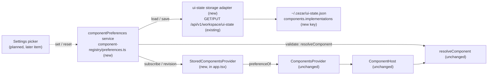

# Component Implementation Preferences — the user's choice per contract, stored and read back

> Slug: `component-implementation-preferences` · Status: **designed, awaiting implementation** ·
> Epic 2 (Component Platform), item 14: "Implement component implementation preferences". Builds on
> `2026-09-19-component-resolver.md` (`resolveComponent`, `coreDefaultComponentId`, #30),
> `2026-09-19-component-host.md` (`ComponentHost`, `ComponentsProvider`'s `preferenceOf` seam,
> #32) and `2026-09-19-task-header-contract.md` (`cezar.task.header.main@1`, the first served
> contract, #37). It fills the seam the host spec left empty on purpose (its Q5: "Production
> passes none"). The Settings picker stays a later item (Q1). **The owner answered Q1, Q2, Q5 and
> Q6 on 2026-09-19/20** (PR #44); Q3 and Q4 keep their autonomous defaults, which the owner's own
> examples match. Delivery: one PR to `main`, in `packages/contract` (one key) and `packages/web`,
> plus tests in `packages/cezar` and one line each in AGENTS.md and BACKWARD_COMPATIBILITY.md.

## 📝 TLDR

The resolver and the host can already render an extension's implementation of a contract, but only
when someone gives them a preference. In production nobody does: `ComponentsProvider` gets no
`preferenceOf`, so core's default renders everywhere, whatever the user wanted. The proposal adds
**one service that owns the user's choice**, `componentPreferences`, over a new `components` key in
`~/.cezar/ui-state.json`:

```json
{ "components": { "implementations": { "cezar.task.header.main": "acme.jira.task-header" } } }
```

Nothing writes that key directly. `set(contractId, componentId)` validates the choice against the
registry and persists it; `reset(contractId)` removes the entry, which returns the contract to
core's default; `get` and `subscribe` are what the cockpit renders from. The choice would survive
a refresh, a restart, another browser and another port. A missing or misfit extension would fall
back to core's default without the choice being erased. With no entry, which is every install
today, the page renders exactly what it renders now.

## Resolved questions

Q1, Q2, Q5 and Q6 were answered by the owner on the spec PR (#44) and are recorded here as
decided. Q3 and Q4 keep the autonomous defaults this spec proposed; the owner's own examples use
the same key shape (Q3) and state the fallback rule this spec relies on (Q4).

| # | Question | Decision | Why | Owner |
|---|---|---|---|---|
| Q1 | Scope: the store only, or also the Settings picker? | **The store, its read path, and `set`/`reset`.** No screen. The picker is its own later item and is the first caller of `set` and `reset`, together with `listComponentChoices` (#39). The Definition of Done is met at the **mechanism level**: tests make, keep and reset a choice; until the picker ships, a user can do the same only by editing `~/.cezar/ui-state.json`. | The brief (item 14) names storage, the default, a user choice and a reset, and no screen. With `BUILTIN_EXTENSIONS` empty, a picker would offer one option per contract. The store works without the picker, but not the other way round. | ✅ confirmed 2026-09-20 |
| Q2 | Where does the choice live? | **The existing per-user settings store**, namespaced: `components.implementations` in `~/.cezar/ui-state.json`, through `GET/PUT /api/v1/workspace/ui-state`. One answer per user, for every project. Not localStorage, not React state, not the registry's memory, and not an extension's own config. The service's API takes no scope, and a scope can be added later without moving the data. | The owner's call. It is also the repository's store for prefs that describe the user rather than a repo (`appearance`, `notifications`, `importedSkills`, `sidebar.projectOrder`), and it needs no new route, file or migration. The component registry is one per page, not per project. localStorage would fork silently per port (`pickPort` scans upward from 4321) and per remote browser, which the owner already ruled out for saved layout structure. The `components` namespace leaves room for the per-implementation settings the layout program expects, without a second top-level key. | ✅ owner 2026-09-19 |
| Q3 | What is the key? | **The contract id without its major** (`cezar.task.header.main`), mapped to a **component id** (`acme.jira.task-header`). The owner's `"task.header": "jira.task-header"` is the illustrative spelling of the same pair. | These are the ids the resolver already takes (`preferenceOf(contract.id)`). Without the major, a choice outlives a contract bump: the resolver sets it aside as `incompatible` until the extension ships a fitting version under the same id, and then it renders again with no second choice. | default, reversible |
| Q4 | What happens to a stored choice whose extension is missing or no longer fits? | **It is kept, and core's default renders.** Nothing rewrites or clears a stored choice except `set` and `reset`. | Extensions activate after the boot, so every preference is `not-found` for a moment on every page load; clearing on `not-found` would wipe the choice on each refresh. The owner's answer to Q5 states the same requirement from the other side: validation at write time does not remove the resolver's fallback, "because an implementation that was valid when it was saved can become unavailable later". | default, reversible |
| Q5 | What is the write path? | **A service, `componentPreferences`, with `get`, `set`, `reset` and `subscribe`.** No UI and no extension writes the store directly. `set` validates before persisting: the contract is served, the implementation is registered, it implements this contract, and it is compatible. It is async and rejects with a coded error. A change notifies subscribers, the resolver recomputes, and the host re-renders. The resolver keeps its fallback regardless. | The owner's call, and the shape of the repository's other seams (`commands/registry.ts`, `events/bus.ts`, `component-registry/registry.ts`): a pure module with `subscribe`, wired into React once at the root. Validation is delegated to `resolveComponent`, so what `set` accepts is exactly what the resolver honours and what `listComponentChoices` (#39) offers — no second, drifting comparison (AGENTS.md: fit is answered by `checkComponentCompatibility`, never by hand). | ✅ owner 2026-09-19 |
| Q6 | What does "default configuration" mean? | **Core's own implementation, named at registration and never copied into the user's preferences.** A contract with no entry, and an absent `components` key, both mean "render the default". For this version, default implementation = core implementation, so "reset to default" and "reset to core" are the same operation: remove the user's override. Core's default id is never stored. | The owner's call. Cezar names that implementation by convention rather than by a contract field: core registers it as `coreDefaultComponentId(contract.id)` (`${contract.id}.default`), which the resolver, the registry's gate test and `missingCoreDefaults` all read (resolver Q3, ✅ owner). An explicit `defaultImplementationId` on the contract is the reversible extension the resolver spec already names; it would change `packages/extension-api`, which this item does not. | ✅ owner 2026-09-19 |

## 📝 Problem Statement

The platform's promise is that an extension offers an alternative implementation of a core
component and the **user** picks which one renders (`ComponentRegistry` TSDoc,
`packages/extension-api/src/components.ts`). The pieces for the render side are on `main`:

- `resolveComponent(registry, contract, preference)` returns the preferred implementation when it
  is usable, and core's default otherwise, with the reason (#30).
- `ComponentHost` resolves on every render with `runtime.preferenceOf(contract.id)` (#32).
- `cezar.task.header.main@1` is served, with core's default registered in `main.tsx` (#37).

What is missing is the user's side. `app.tsx` mounts `<ComponentsProvider registry={…}>` with no
`preferenceOf`, so `NO_PREFERENCE` answers `null` for every contract. A choice cannot be made,
kept or undone, and the resolver's `source: 'preference'` path is reachable only from tests.

The brief's Definition of Done, and where this item proves each point. It is met at the mechanism
level (Q1): the picker that lets a user choose and reset from a screen is a later item.

| Definition of Done | How this item meets it | Proven by |
|---|---|---|
| The choice survives a refresh. | `set` persists `components.implementations` to `~/.cezar/ui-state.json`. A new page hydrates from `GET /api/v1/workspace/ui-state` and passes the choice to every host. | `workspace-api.test.ts` (file round-trip), `preferences.test.ts` (hydrate), `stored-components-provider.test.tsx` (a new page over the same fake server renders the choice) |
| The resolver uses the preference. | `StoredComponentsProvider` subscribes to the service and hands `ComponentsProvider` a `preferenceOf`. `ComponentHost` passes it to `resolveComponent` unchanged. `app.tsx` mounts that provider. | `stored-components-provider.test.tsx`, `component-registry/boundary.test.ts` |
| A missing extension falls back. | A stored choice whose extension is not registered resolves to core's default (`rejected: not-found`). The stored entry is not touched, and nothing is written. | `stored-components-provider.test.tsx` |
| The default can be restored. | `reset(contractId)` removes the entry, and core's default renders. `set` refuses core's default id with `is-default`, so "core" has exactly one spelling (Q6). | `preferences.test.ts`, `stored-components-provider.test.tsx` |

## 📝 Proposed Solution

1. **One namespaced key in the workspace ui-state.** `components.implementations` maps a contract
   id (no major) to a component id. The read schema names it and the write schema bounds it: at
   most 200 entries, and every key and value from 1 to 128 characters
   (`MAX_CONTRIBUTION_ID_LENGTH`). `components` itself stays an open object, so the
   per-implementation settings the layout program expects can join it without a second top-level
   key. The server code does not change: the route already parses with
   `setWorkspaceUiStateInputSchema`, merges shallowly and writes atomically.
2. **One service owns the choice.** `createComponentPreferences({ registry, contracts, storage })`
   in `component-registry/preferences.ts` returns the `ComponentPreferences` service: `get`,
   `set`, `reset`, `subscribe` and `revision`. It holds the map in memory, hydrated once from
   storage, and is the only writer. No React, no DOM, no module state; its runtime imports are the
   extension API and `./resolve`.
3. **`set` validates through the resolver.** It calls
   `resolveComponent(registry, contract, componentId)` and accepts only a result with
   `source: 'preference'`. Anything else rejects with the resolver's own reason, so what `set`
   accepts is exactly what the resolver renders and what the picker's `listComponentChoices` (#39)
   offers. Cezar has no user-permission model, so there is nothing further to check (§ Risks).
4. **A write is optimistic, serialized and whole-key.** `set` and `reset` apply the change to the
   snapshot, notify subscribers, then persist. Writes run through one chain, each composed from
   the current snapshot, and a failed write restores the previous snapshot, notifies again, and
   rejects. The whole `components` object is sent — the service keeps unknown sibling keys and
   unknown entries by reference — because the server merges top-level keys only.
5. **Nothing is written before the read.** The service persists only after hydration succeeded.
   Before that, `set` and `reset` await hydration; if it failed, they reject with `not-ready` and
   write nothing. Persisting from an empty snapshot would replace the stored map with a one-entry
   map and erase every other choice (AGENTS.md: "a fail-open helper needs a populated-input
   guarantee"). Hydration never throws and never blocks the boot: a failed read leaves the service
   readable, empty and unwritable, and the page renders core's defaults.
6. **The app feeds the provider.** `main.tsx` creates the service next to the registry and passes
   it to `App`, as it does for the command registry and the event bus. `StoredComponentsProvider`
   subscribes with `useSyncExternalStore(preferences.subscribe, preferences.revision)` — the
   pattern `ComponentHost` already uses for the registry — and renders `ComponentsProvider` with a
   `preferenceOf` built from the snapshot. `ComponentsProvider` itself does not change, so tests
   keep passing `preferenceOf` directly.

### Prior art

- **VS Code, `workbench.editorAssociations`.** A user setting maps a file pattern to a custom
  editor's `viewType`. "Reopen With… → Configure default editor" writes it, and removing the entry
  restores the built-in editor. A `viewType` whose extension is uninstalled is ignored, and the
  entry stays in `settings.json`. We take all three rules: an id-to-id map in the user's settings,
  removal as the reset, and a missing contributor as a silent fallback that keeps the entry. We
  skip patterns and settings scopes (user, workspace, folder): one contract has one slot, and the
  per-project layer is deferred (Q2).
- **JupyterLab, `defaultViewers`** (document manager settings). A file type maps to a widget
  factory name in the user's settings, and an unknown factory falls back to the default viewer. It
  confirms the same shape. We skip its JSON-schema settings editor: the picker is our editor.
- **Backstage, app-config overrides.** An operator swaps a component at build or deploy time. We
  skip that: here the choice is the user's, at run time, and an operator default would be the
  second layer Q2 and Q6 defer.

### Alternatives considered

- **Writing the key from a React hook** (the ui-state writer pattern: `useTaskTableColumns`,
  `useProjectOrder`). Rejected by Q5. A service keeps one writer, can validate, and gives the
  picker an API that does not depend on React. It also keeps the preference out of the shared
  ui-state query cache, where two existing writers seed a partial object before the read answers
  (§ Risks) — the service composes from its own hydrated snapshot instead.
- **localStorage.** Rejected by Q2. It is per origin, so a second cezar instance on the next port,
  or the same cockpit opened remotely, silently starts from core's default.
- **The per-repo `.ai/cezar/ui-state.json`, or a `scope` argument now.** Deferred (Q2). The API is
  shaped so a scope can be added without moving the data.
- **A new file (`~/.cezar/components.json`) with its own routes.** Rejected. It means new routes, a
  contract, parity tests, a `BACKWARD_COMPATIBILITY.md` §2 inventory entry and a data-gitignore
  line, for one map the open ui-state bag already carries.
- **The extension storage API** (`2026-09-19-extension-storage-api.md`). Rejected. It is designed
  for extensions' own data and is not implemented. The choice is core's record of the user.
- **A flat `components` map** (`components: { "task.header": … }`). Rejected by Q2's namespacing:
  per-implementation settings would then need a second top-level key.
- **An explicit `defaultImplementationId` on the contract.** Deferred (Q6). Core's default is
  already named at registration, by the `${contract.id}.default` convention the resolver owns, and
  a contract field would change `packages/extension-api`.
- **Clearing a stale choice automatically.** Rejected (Q4). It would erase the choice on every
  refresh, before extensions activate.
- **Storing core's default explicitly.** Rejected (Q6). `set` refuses it, so "default" has one
  representation: no entry.
- **A `cezar.component.preference.changed` event on the extension bus.** Deferred. `subscribe` is
  what the cockpit needs, and a core token lands "in the same PR as the host code that honours it"
  (AGENTS.md). The picker item can add it.

## 📝 Architecture



- **New:** `packages/web/src/component-registry/preferences.ts` (the service, pure),
  `stored-components-provider.tsx` (the storage adapter, the provider and
  `useComponentPreferences`), and their tests.
- **Changed:** `packages/contract/src/workspace.ts` (the `components` key, read and write),
  `packages/web/src/main.tsx` (creates the service) and `app.tsx` (one provider swapped, one prop),
  `component-registry/boundary.test.ts`, server tests (`workspace-api.test.ts`,
  `contract-parity.workspace.test.ts`), the AGENTS.md "Component implementations" row, and the
  `ui-state.json` lines of BACKWARD_COMPATIBILITY.md (§2 and §9).
- **Not touched:** `resolve.ts`, `registry.ts`, `provider.tsx`, `component-host.tsx`, the server
  route and `workspace/ui-state.ts`, the per-repo `/api/v1/ui-state`, and `packages/extension-api`.
  Extensions get no way to read or write the choice.

In short, the host already asks "what did the user choose?"; this item gives the answer an owner.

## 📝 Data Model

`~/.cezar/ui-state.json`, workspace level, `0600`, written atomically by
`mergeWriteWorkspaceUiState`:

```json
{
  "appearance": { "accent": "violet" },
  "components": {
    "implementations": {
      "cezar.task.header.main": "acme.jira.task-header"
    }
  }
}
```

- **Key:** a served contract's id without its major. **Value:** the chosen implementation's
  component id.
- **Absent `components`, absent `implementations`, or a contract missing from it:** core's default
  for that contract. Nothing is written on first run, and no migration is needed.
- **Never stored:** core's default id. `set` refuses it (`is-default`), and `reset` removes the
  entry (Q6).
- **Unknown entries and unknown sibling keys are kept.** An entry for a contract this cockpit does
  not serve (written by a newer cockpit, or for a contract since removed), and any future key
  beside `implementations`, round-trip through every write. Entries that are malformed (a
  non-string value, an id that fails `isValidContributionId`) are ignored on read; the next write
  drops only what the write schema would reject, so a malformed entry cannot block later writes. A
  map over the 200-entry cap can, and only a hand edit makes one (§ Edge Cases).
- **No sensitive data:** ids only.

## 📝 API Contracts

### HTTP (`packages/contract/src/workspace.ts`)

No new route. `GET/PUT /api/v1/workspace/ui-state` gains one named key:

```ts
/** Settings → Components (spec 2026-09-19-component-implementation-preferences): the user's
 *  chosen implementation per component contract, contract id (no major) → component id. An open
 *  object: per-implementation settings may join `implementations` later. A contract missing from
 *  the map, like an absent key, means core's default; core's default id is never stored. */
const componentPreferencesSchema = z.looseObject({
  implementations: z.record(z.string(), z.string()).optional(),
})

export const workspaceUiStateSchema = z.looseObject({
  // …existing keys…
  components: componentPreferencesSchema.optional(),
})

// Write side, inside setWorkspaceUiStateInputSchema:
components: z
  .looseObject({
    implementations: z
      .record(z.string().min(1).max(128), z.string().min(1).max(128))
      .refine((map) => Object.keys(map).length <= WORKSPACE_UI_STATE_MAX_KEYS, {
        message: `components.implementations must have at most ${WORKSPACE_UI_STATE_MAX_KEYS} entries`,
      })
      .optional(),
  })
  .optional(),
```

A bad `components` value is `400 { error }` and never a partial write, like every other key. The
PUT replaces the whole `components` object (the merge is top-level), and a PUT without it leaves
it alone.

### The service (`packages/web/src/component-registry/preferences.ts`)

```ts
import { isValidContributionId, type ContributionId } from '@open-mercato/cezar-extension-api'
import { coreDefaultComponentId, resolveComponent, type ResolverRegistry } from './resolve'
import type { AnyComponentContract } from './registry'

/** Why `set` refused. `invalid`, `unknown-contract` and `is-default` are the caller's mistakes;
 *  the rest are the resolver's own reasons for setting a preference aside (`resolve.ts`). */
export type ComponentPreferenceErrorCode =
  | 'invalid'
  | 'unknown-contract'
  | 'is-default'
  | 'not-found'
  | 'other-contract'
  | 'incompatible'
  | 'not-ready'
  | 'write-failed'

export class ComponentPreferenceError extends Error {
  readonly code: ComponentPreferenceErrorCode
  /** The registration's issues, for `incompatible`; the write's cause, for `write-failed`. */
  readonly cause?: unknown
}

export interface ComponentPreferenceChange {
  /** The contracts whose choice changed. */
  readonly changed: readonly ContributionId[]
  readonly reason: 'set' | 'reset' | 'hydrated' | 'write-failed'
}

export interface ComponentPreferences {
  /** The chosen implementation, or `undefined` for "core's default". Synchronous: it reads the
   *  snapshot, which is `{}` until hydration answers. */
  get(contractId: ContributionId): ContributionId | undefined
  /** Chooses `componentId` for `contractId` and persists it. Rejects with a
   *  `ComponentPreferenceError` and writes nothing when the contract is not served, the
   *  implementation is not registered, implements another contract or does not fit, when
   *  `componentId` is core's default for the contract (`reset` expresses that), or when the store
   *  has not hydrated. A failed write restores the previous choice before rejecting. */
  set(contractId: ContributionId, componentId: ContributionId): Promise<void>
  /** Removes the choice: core's default renders again. A no-op, with no write, when there is
   *  none. */
  reset(contractId: ContributionId): Promise<void>
  /** Called after every change, with what changed. Returns the unsubscribe. */
  subscribe(listener: (change: ComponentPreferenceChange) => void): () => void
  /** Increments on every change, for `useSyncExternalStore` (the registry's pattern). */
  revision(): number
  /** Resolves when the first read has answered, successfully or not. Never rejects. */
  readonly ready: Promise<void>
}

/** The persistence seam, so the service stays testable and free of HTTP. */
export interface ComponentPreferencesStorage {
  /** The stored `components` object, in whatever shape the file holds. Never throws: a failure
   *  resolves to `undefined`, which leaves the service empty and unwritable. */
  load(): Promise<unknown>
  /** Persists the whole `components` object (unknown sibling keys included). Rejects on failure. */
  save(components: Record<string, unknown>): Promise<void>
}

export function createComponentPreferences(options: {
  readonly registry: ResolverRegistry
  /** The served catalog, so `set` can find a contract by id: `CORE_COMPONENT_CONTRACTS`. */
  readonly contracts: readonly AnyComponentContract[]
  readonly storage: ComponentPreferencesStorage
}): ComponentPreferences
```

`set`, precisely — the first step that fails ends the call:

1. `contractId` or `componentId` fails `isValidContributionId` → `invalid`.
2. No contract in `contracts` has that id → `unknown-contract`.
3. `componentId === coreDefaultComponentId(contractId)` → `is-default` (Q6).
4. `await ready`; hydration failed → `not-ready`.
5. `resolveComponent(registry, contract, componentId)`. `source: 'preference'` → accept.
   Otherwise the result's `rejected.reason` is the error code (`not-found`, `other-contract`,
   `incompatible`, with the registration's `issues` as `cause`); `unresolved` → `unknown-contract`.
6. Apply to the snapshot, notify (`reason: 'set'`), then persist. A rejected write restores the
   previous snapshot, notifies (`reason: 'write-failed'`) and rejects with `write-failed`.

### The React binding (`packages/web/src/component-registry/stored-components-provider.tsx`)

```tsx
/** The storage adapter over the workspace ui-state: `load` reads through the shared query (no
 *  second request — `AppearanceProvider` asks for the same key), `save` PUTs `{ components }` and
 *  writes the answer back into the query cache. */
export function uiStateComponentStorage(queryClient: QueryClient): ComponentPreferencesStorage

/** `ComponentsProvider` fed by the service: it subscribes with `useSyncExternalStore` and passes
 *  `preferenceOf`. Omitted `preferences` (tests): one of its own, over an in-memory storage. */
export function StoredComponentsProvider(props: {
  readonly registry?: CockpitComponentRegistry
  readonly preferences?: ComponentPreferences
  readonly children: ReactNode
}): ReactElement

/** The page's service, for the picker. Throws outside `StoredComponentsProvider`, like
 *  `useCommands`. */
export function useComponentPreferences(): ComponentPreferences
```

## 📝 UI/UX

No screen, route or string changes in this item. The picker (a later item) is the surface that
calls `set` and `reset`, lists choices with `listComponentChoices` (#39), and explains a set-aside
choice with the resolver's `rejected`.

What a user can see:

- **No choice stored** (every install today): unchanged. Core's header renders.
- **A choice stored** (by the picker later, or by editing `~/.cezar/ui-state.json` by hand): after
  a refresh the chosen implementation renders in the header's box, with core's actions and tabs
  around it, exactly as the host spec describes for a preference.
- **The chosen extension is missing or no longer fits:** core's header renders, silently, as it
  does today. The entry stays in the file.
- **A write fails** (read-only home): the choice reverts on screen and `set` rejects, so the
  picker can show the server's message. This item shows nothing by itself.

Mockups: none. The item has no user-facing surface of its own.

## 📝 Edge Cases & Failure Scenarios

- **First paint after a refresh.** Hydration shares the ui-state read the cockpit already makes.
  Until it answers, `get` returns `undefined` and core's default renders; the host re-resolves
  when the service notifies. For a user with a stored choice that is one swap per page load, in
  the box the contract's `minBlockSize` already reserves. A localStorage mirror would not remove
  it, because the extension also activates asynchronously. Holding the host's box until hydration
  settles is an additive follow-up if it shows in practice.
- **Hydration fails** (server error, read-only home, a remote server that is down). The service
  stays empty and unwritable: core's defaults render, `set`/`reset` reject with `not-ready`, and
  nothing can overwrite the stored map. Nothing retries in this item; the next page load hydrates
  again.
- **The extension activates after the first resolve.** The host is subscribed to the registry and
  re-resolves on activation, so the stored choice renders then (#30's not-found-then-found path).
  A `set` issued in that window is rejected as `not-found` — the picker offers only registered
  implementations.
- **The extension is removed, disabled or fails to activate.** The resolver returns core's default
  with `rejected: not-found`. The entry is kept, and re-enabling the extension brings the choice
  back (Q4).
- **A Cezar upgrade bumps the contract's major.** The stored id is set aside as `incompatible`
  until the extension ships a fitting version under the same component id. A new `set` for it is
  refused with the same reason, and the registration's issues as `cause`.
- **A hand edit with a typo** (`"cezar.task.header.main": "acme.jira.task-headr"`). Core's default
  renders (`not-found`). Nothing reports it until the picker, which reads `rejected`.
- **A hand edit with garbage** (`"components": 5`, `"implementations": { "x": 1 }`). The read
  ignores what is not a well-formed entry, and the next write drops what the server would reject.
- **More than 200 entries** (only a hand edit makes one). Every write rejects with `write-failed`
  carrying the server's `400` message. Removing entries by hand fixes it. No cockpit path adds an
  entry per render, so the cap cannot be reached through the UI.
- **Two tabs.** Each page hydrates once and keeps its snapshot. A choice made in one tab reaches
  the other on its next load, as appearance and project order do today. Both send the whole
  `components` object, so the last writer wins at map granularity.
- **Rapid choices in one tab.** One service, one write chain: each write is composed from the
  current snapshot, so the final state carries every change.
- **Another writer of ui-state** (appearance, task table, project order). It sends only its own
  top-level key, and the shallow merge keeps `components`. The service never composes from their
  cache, so a partial ui-state cache cannot reach the file through this path (§ Risks). An older
  cockpit never sends `components`, so it keeps the choice too, and renders core's default because
  it does not read it.
- **A future sibling key under `components`.** A newer cockpit's `components.settings` survives
  every write this service makes: it saves the object it hydrated, with `implementations`
  replaced.

## 📝 Risks & Impact Review

- **The zero-config path is unchanged.** With no stored entry, `preferenceOf` answers `null` for
  every contract, as `NO_PREFERENCE` does today. A guard test pins it, and nothing is written at
  boot. Hydration failing is the same path. (AGENTS.md § Changing a mechanism that already works:
  the default path is diffed, not the feature.)
- **A new named key in a protected file.** `~/.cezar/ui-state.json` is a BACKWARD_COMPATIBILITY.md
  surface (§2 and §9). The change is additive: the bag stays open, unknown keys round-trip, and an
  older server accepts and keeps `components` through its loose write schema. Both documents name
  the key in the same PR.
- **The write API has no production caller yet (Q1).** `set` and `reset` are exercised by tests
  and by the later picker. The read path has one: `app.tsx`. Until the picker ships, a user
  changes the choice only by editing the file. This follows the epic's order — the mechanism
  first, as the resolver and the host did.
- **Validation lives in two places on purpose.** `set` refuses a choice the resolver would set
  aside, and the resolver still falls back at render time, because an implementation that was
  valid when it was saved can disappear later (Q4, Q5). They cannot drift: `set` calls the
  resolver.
- **No user-permission model exists.** Q5 asks `set` to check "whether the user may choose it".
  Cezar is a single-user local cockpit: a ui-state write needs the same authority as any other
  cockpit request (the loopback/CSRF guard, #426), and there is nothing finer to enforce. If
  permissions arrive, the extension permission model (#40) is where they land.
- **The opt-in rule depends on a boundary that is not enforced by types.** Extensions get no
  preference API, and the service is not part of `cockpitServices`. A compiled-in extension could
  still call the ui-state route itself, as it could for any other key. That stays within the
  current trust model (extensions are compiled in and trusted).
- **An existing bug, deliberately not fixed here.** `skills-import-panel.tsx` and
  `provider-banner-container.tsx` write an optimistic ui-state cache before the authoritative GET
  answers (`{ ...current, … }` with `current` undefined), which lets the next writer — a task-table
  toggle, say — persist a partial object and erase stored siblings. `useTaskTableColumns` and
  `useProjectOrder` already guard against it. This item's service cannot be corrupted that way,
  because it composes from its own hydrated snapshot, so the fix belongs to its own issue rather
  than to this PR.
- **The first-paint swap** (§ Edge Cases) is accepted rather than engineered away. It affects only
  users with a stored choice, and at most once per page load.
- **Rollback.** Revert the PR. A stored `components` key stays in the file, and the reverted
  cockpit ignores it and renders core's default. Nothing needs cleaning up.

## 📋 Phasing

1. **Phase 1: The stored key.** The contract names and bounds `components.implementations`, and
   the server round-trips it. It works alone: the file accepts and keeps the map.
2. **Phase 2: The service and the cockpit.** `componentPreferences`, its storage adapter, the
   provider in `app.tsx`, the Definition of Done proof and the documents.

## 📋 Implementation Plan

Every step keeps the validation gate in `.ai/agentic.config.json` green: `typecheck`, `npm test`,
`test:unit`, `build` and `test:package`.

### Phase 1: The stored key

1. **`components` in the contract.** Add `componentPreferencesSchema` to `workspaceUiStateSchema`
   and the bounded `components` to `setWorkspaceUiStateInputSchema` (§ API Contracts).
   *Tests* (`packages/cezar/src/server/workspace-api.test.ts`, on the `CEZ_HOME` sandbox):
   - a PUT of `{ components: { implementations: { 'cezar.task.header.main': 'acme.jira.task-header' } } }`
     then a GET returns it, and `~/.cezar/ui-state.json` on disk contains it;
   - a PUT of `{ appearance: … }` afterwards keeps `components` (shallow merge);
   - a PUT carrying an unknown sibling (`components: { implementations: {}, settings: { a: 1 } }`)
     round-trips both;
   - `400` and no write for 201 entries, an empty key, a 129-character value and a non-string
     value; the file is unchanged after each.
   *Guard* (`contract-parity.workspace.test.ts`): the `components` key in the GET and PUT response
   types. It passes both ways by construction, because `readWorkspaceUiState` is typed by the
   contract, so it pins the name and is not a regression test.

### Phase 2: The service and the cockpit

2. **`preferences.ts`**, per § API Contracts.
   *Tests* (`preferences.test.ts`), against a fake storage and a registry serving the fixture
   `cezar.fixture.task-header@1` with core's default, core's compact implementation and extension
   implementations through `fakeScope` (`extensions/registry.fixtures.ts`):
   - hydration: the stored map is readable after `ready`; a `load` that resolves `undefined`, a
     non-object, a non-object `implementations`, or entries with an invalid id or a non-string
     value all leave a `{}` snapshot, and one `hydrated` notification is sent either way;
   - `get` returns the entry, `undefined` for a contract with none;
   - `set` persists, notifies once with `{ changed: [contractId], reason: 'set' }`, bumps
     `revision`, and sends the whole `components` object, keeping an unknown sibling key and an
     unknown contract's entry;
   - `set` rejects, writing nothing, with: `invalid` (`''`, `42`, `'Not An Id'`),
     `unknown-contract` (a contract not in `contracts`), `is-default` (core's default id),
     `not-found` (never registered, and disposed), `other-contract`, `incompatible` (built for
     `@2`, and missing a required capability — `cause` carries the registration's issues),
     `not-ready` (hydration failed);
   - a core implementation that is not the default (the compact one) is accepted;
   - `reset` removes the entry and persists; with no entry it resolves without writing;
   - a failing `save` restores the previous choice, notifies with `reason: 'write-failed'`, and
     rejects with `write-failed` carrying the cause; `get` shows the old value afterwards;
   - two `set` calls in flight are persisted in order, and the final stored map carries both;
   - `subscribe` returns an unsubscribe that stops delivery; a throwing listener does not break
     the call (it is reported, not propagated);
   - purity: a source scan like `registry.test.ts`'s finds no React, DOM or module-level state, and
     no runtime import other than the extension API and `./resolve`;
   - the contract's bound agrees with the id rule: a 128-character id passes
     `isValidContributionId` and a 129-character one fails (`MAX_CONTRIBUTION_ID_LENGTH` is not
     exported, and the contract cannot import the extension API).

3. **`stored-components-provider.tsx`**: the ui-state storage adapter, the provider and
   `useComponentPreferences`.
   *Tests* (`stored-components-provider.test.tsx`). A fake fetch serves `GET` and
   `PUT /api/v1/workspace/ui-state` from one in-memory object, merging top-level keys as the server
   does. On one `QueryClient`, the tree is `StoredComponentsProvider` (registry:
   `createCoreComponentRegistry()` plus a fixture extension providing `acme.jira.task-header` for
   `TaskHeaderMain` through `fakeScope`), a `ComponentHost contract={TaskHeaderMain}` with fixture
   props, and a probe that calls `useComponentPreferences()`. A **refresh** is: unmount, a new
   `QueryClient`, render again over the same fake server.
   - **zero-config guard:** with no stored key, the host has
     `data-component="cezar.task.header.main.default"`, and no PUT is sent;
   - **survives a refresh:** `set(TaskHeaderMain.id, 'acme.jira.task-header')` re-renders the host
     to `data-component="acme.jira.task-header"` and sends one PUT; after a refresh the host still
     shows it;
   - **fallback:** with the choice stored and the fixture extension not registered, the host
     renders core's default and no PUT is sent;
   - **restore default:** `reset` re-renders core's default at once and keeps it after a refresh;
   - the adapter issues no second ui-state request when the cockpit already read that key, and a
     successful `save` leaves the query cache holding the server's answer;
   - a failed PUT leaves the host on the stored choice and `set` rejects;
   - `useComponentPreferences()` outside the provider throws.

4. **`main.tsx` creates the service and `app.tsx` mounts `StoredComponentsProvider`**, where
   `ComponentsProvider` is today, with the service passed down as `commands`, `events` and
   `components` already are.
   *Test* (`component-registry/boundary.test.ts`): outside tests, only
   `stored-components-provider.tsx` imports `ComponentsProvider`, and `app.tsx` imports
   `StoredComponentsProvider`. This is the regression test for the wiring, which is the one line a
   test that builds its own tree cannot see. Prove it is red with `app.tsx` reverted to the plain
   `ComponentsProvider` (a temporary WIP commit, not the shared stash).

5. **Documents.** AGENTS.md, the "Component implementations" row: the user's choice lives in
   `~/.cezar/ui-state.json` under `components.implementations` (contract id without major →
   component id) and is read and written only through the `componentPreferences` service, which
   validates every `set` by calling `resolveComponent`; core's default is never stored, and
   `reset` is how a contract returns to it; a stored choice is never cleared by anything else;
   extensions get no API for it. BACKWARD_COMPATIBILITY.md: name `components` in the workspace
   `ui-state.json` lines of §2 and §9, with its bounds and "absent means core's default".
