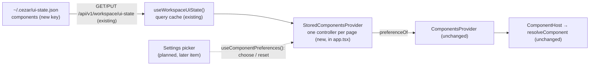

# Component Implementation Preferences — the user's choice per contract, stored and read back

> Slug: `component-implementation-preferences` · Status: **designed, awaiting implementation** ·
> Epic 2 (Component Platform), item 14: "Implement component implementation preferences". Builds on
> `2026-09-19-component-resolver.md` (`resolveComponent`, `coreDefaultComponentId`, #30),
> `2026-09-19-component-host.md` (`ComponentHost`, `ComponentsProvider`'s `preferenceOf` seam,
> #32) and `2026-09-19-task-header-contract.md` (`cezar.task.header.main@1`, the first served
> contract, #37). It fills the seam the host spec left empty on purpose (its Q5: "Production
> passes none"). The Settings picker stays a later item, which departs from the owner-confirmed
> resolver Q2 and is gated on the owner's confirmation (Q1). Delivery: one PR to `main`, in
> `packages/contract` (one key) and `packages/web`, plus tests in `packages/cezar` and one line
> each in AGENTS.md and BACKWARD_COMPATIBILITY.md.

## 📝 TLDR

The resolver and the host can already render an extension's implementation of a contract, but only
when someone gives them a preference. In production nobody does: `ComponentsProvider` gets no
`preferenceOf`, so core's default renders everywhere, whatever the user wanted. The proposal
stores the user's choice per contract in `~/.cezar/ui-state.json`, under a new `components` key,
and feeds it to the provider:

```json
{ "components": { "cezar.task.header.main": "acme.jira.task-header" } }
```

The choice would survive a refresh, a restart, another browser and another port. A missing or
misfit extension would fall back to core's default without the choice being erased, and a reset
would remove the entry, which returns the contract to core's default. With no entry, which is
every install today, the page renders exactly what it renders now.

## Resolved assumptions (autonomous defaults)

The brief left these open. Each default is the most reversible choice with the least new surface.
The extension API is private and experimental, `BUILTIN_EXTENSIONS` is empty, and nothing outside
this repository reads the new key.

| # | Question | Default | Why | Confirm? |
|---|---|---|---|---|
| Q1 | Scope: the store, its read path and its write API only, or also the Settings picker? | **The store, the read path and the write API (`choose`, `reset`).** No screen. The picker is a later item and will call `choose` and `reset`. The Definition of Done is met **at the mechanism level**: tests make, keep and reset a choice, and a user can do the same only by editing `~/.cezar/ui-state.json` until the picker ships. | The brief (item 14) names storage, the default, a user choice and a reset, and no screen. The picker's list, `listComponentChoices`, is still in review (#39), and with `BUILTIN_EXTENSIONS` empty a picker would offer one option. The store works without the picker, but not the other way round. **This departs from confirmed records.** The resolver spec's Q2 (✅ owner) says the store's questions "belong with the picker, which writes it", and the host spec's Q5 and the capability-validation spec's Q1 treat "the Settings picker and the preference store" as one later item. Once confirmed, both records get a note that the store shipped alone as item 14 (step 6). | ⚠ NEEDS HUMAN CONFIRMATION |
| Q2 | Where does the choice live? | **`~/.cezar/ui-state.json`, a new `components` key**, through the existing `GET/PUT /api/v1/workspace/ui-state`. One answer per user, for every project. | It is the repository's store for "prefs that describe the user, not a repo" (`appearance`, `notifications`, `importedSkills`, `sidebar.projectOrder`). No new route, file or migration. The component registry is one per page, not per project, and extensions are compiled into the cockpit, so the choice has no project to belong to. localStorage would fork silently per port (`pickPort` scans upward from 4321) and per remote browser, which the owner already ruled out for saved layout structure (layout-readiness overview, 2026-09-19). | reversible |
| Q3 | What is the key? | **The contract id without its major** (`cezar.task.header.main`), mapped to a **component id** (`acme.jira.task-header`). The brief's `"task.header": "jira.task-header"` is the illustrative spelling of the same pair. | These are the ids the resolver already takes (`preferenceOf(contract.id)`). Without the major, a choice outlives a contract bump: the resolver sets it aside as `incompatible` until the extension ships a fitting version under the same id, and then it renders again with no second choice. | reversible |
| Q4 | What happens to a stored choice whose extension is missing or no longer fits? | **It is kept, and core's default renders.** Nothing in the cockpit rewrites or clears a stored choice except `choose` and `reset`. | Extensions activate after the boot, so every preference is `not-found` for a moment on every page load. Clearing on `not-found` would wipe the choice on each refresh. Reinstalling or re-enabling the extension brings the choice back. The resolver already renders core's default and says why (`rejected`). | reversible |
| Q5 | What is the write path? | **One controller per page**, created by `StoredComponentsProvider` and read with `useComponentPreferences()`. It follows the pattern of `useTaskTableColumns`: optimistic cache, whole-key writes, serialized. No core command, and nothing in the extension API. | It reuses the pattern of the other ui-state writers. Created once at the root, it has one write chain for the page, so the picker and the provider cannot race each other (AGENTS.md: session-global state is owned once at the root). A `cezar.*` command would add a token to `packages/extension-api`. It would have to be `internal`, because a public one would let an extension select itself, which breaks the opt-in rule on `ComponentRegistry` ("`provide` only makes an implementation available; the user selects"). The command can come later if the picker needs one. | reversible |
| Q6 | What does "default configuration" mean? | **No entry.** A contract missing from `components`, or no `components` key at all, renders core's default. No project-level layer and no shipped default layer. Choosing core's default removes the entry, so "core" has one spelling. | Zero config (AGENTS.md): the working default needs nothing written. A per-project override (repo `ui-state.json` first, then the user's) is additive later, as the layout program's project → global → default fallback plans for layouts. | reversible |

## 📝 Problem Statement

The platform's promise is that an extension offers an alternative implementation of a core
component and the **user** picks which one renders (`ComponentRegistry` TSDoc,
`packages/extension-api/src/components.ts`). The pieces for the render side are on `main`:

- `resolveComponent(registry, contract, preference)` returns the preferred implementation when it
  is usable, and core's default otherwise, with the reason (#30).
- `ComponentHost` resolves on every render with `runtime.preferenceOf(contract.id)` (#32).
- `cezar.task.header.main@1` is served, with core's default registered in `main.tsx` (#37).

What is missing is the user's side. `app.tsx` mounts `<ComponentsProvider registry={…}>` with no
`preferenceOf`, so `NO_PREFERENCE` answers `null` for every contract. A choice cannot be made,
kept or undone, and the resolver's `source: 'preference'` path is reachable only from tests.

The brief's Definition of Done, and where this item proves each point. It is met at the mechanism
level (Q1): the picker that lets a user choose and reset from the page is a later item.

| Definition of Done | How this item meets it | Proven by |
|---|---|---|
| The choice survives a refresh. | `choose` writes `components` to `~/.cezar/ui-state.json`. A new page reads it with the first `GET /api/v1/workspace/ui-state` and passes it to every host. | `workspace-api.test.ts` (file round-trip), `stored-components-provider.test.tsx` (a new query client over the same fake server renders the choice) |
| The resolver uses the preference. | `StoredComponentsProvider` hands `ComponentsProvider` a `preferenceOf` built from the stored map. `ComponentHost` passes it to `resolveComponent` unchanged. `app.tsx` mounts `StoredComponentsProvider`. | `stored-components-provider.test.tsx`, `component-registry/boundary.test.ts` |
| A missing extension falls back. | A stored choice whose extension is not registered resolves to core's default (`rejected: not-found`). The stored entry is not touched, and no write is sent. | `stored-components-provider.test.tsx` |
| The default can be restored. | `reset(contractId)` removes the entry, and core's default renders. Choosing core's default removes it too. | `stored-components-provider.test.tsx` |

## 📝 Proposed Solution

1. **One key in the workspace ui-state.** `components` is a map from contract id (no major) to
   component id. The read schema names it and the write schema bounds it: at most 200 entries,
   and every key and value from 1 to 128 characters (`MAX_CONTRIBUTION_ID_LENGTH`). The server
   code does not change. The route already parses with `setWorkspaceUiStateInputSchema`, merges
   shallowly and writes atomically.
2. **A pure module reads and composes the map.** `component-registry/preferences.ts` turns
   whatever the file holds into a frozen map of well-formed entries, and composes the next map
   for a choice or a reset. It follows the purity rule of its neighbours: no React, no DOM, no
   module state. Its runtime imports are the extension API and `./resolve`.
3. **One controller owns the cache and the writes.** `StoredComponentsProvider` creates it once
   per page, over the shared `useWorkspaceUiState()` query, and `useComponentPreferences()` reads
   it from context: `preferences`, `preferenceOf`, `choose` and `reset`. It writes the whole
   `components` object every time, because the server merges top-level keys only, and applies it
   to the cache first. Writes are serialized, and only the newest response is applied
   (`useTaskTableColumns`' write chain). A failed write shows a toast and refetches, so an unsaved
   choice does not stay on screen.
4. **The app feeds the provider.** `StoredComponentsProvider` renders `ComponentsProvider` with
   the controller's `preferenceOf`. `app.tsx` mounts it where `ComponentsProvider` is today.
   `ComponentsProvider` itself does not change, so tests keep passing `preferenceOf` directly.
5. **No write before the read.** `choose` and `reset` return `false` and write nothing until the
   ui-state query has data. A write composed from an empty cache would replace the stored map
   with a one-entry map and erase every other choice (AGENTS.md: "a fail-open helper needs a
   populated-input guarantee"). The guard reads the cache, so it holds only if **every optimistic
   writer of `workspaceQueryKeys.uiState` leaves the cache empty until the GET has answered**.
   `useTaskTableColumns` and `useProjectOrder` already return early on an empty cache. Two writers
   do not: `skills-import-panel.tsx` (`{ ...current, importedSkills }`) and
   `provider-banner-container.tsx` (`{ ...previous, dismissedProviderAuthFailures }`) seed a partial
   object before the read answers. After that, a `choose` would compose from `components: undefined`
   and erase every stored choice, and a task-table toggle already erases the stored
   `expandedColumns` the same way. This item gives both writers the same early return, so the
   invariant holds for every writer.

### Prior art

- **VS Code, `workbench.editorAssociations`.** A user setting maps a file pattern to a custom
  editor's `viewType`. "Reopen With… → Configure default editor" writes it, and removing the entry
  restores the built-in editor. A `viewType` whose extension is uninstalled is ignored, and the
  entry stays in `settings.json`. We take all three rules: a flat id-to-id map in the user's
  settings, removal as the reset, and a missing contributor as a silent fallback that keeps the
  entry. We skip patterns and settings scopes (user, workspace, folder): one contract has one
  slot, and the per-project layer is deferred (Q6).
- **JupyterLab, `defaultViewers`** (document manager settings). A file type maps to a widget
  factory name in the user's settings, and an unknown factory falls back to the default viewer. It
  confirms the same shape. We skip its JSON-schema settings editor: the picker is our editor.
- **Backstage, app-config overrides.** An operator swaps a component at build or deploy time. We
  skip that: here the choice is the user's, at run time, and an operator default would be the
  second layer Q6 defers.

### Alternatives considered

- **localStorage.** Rejected. It is per origin, so a second cezar instance on the next port, or the
  same cockpit opened remotely, silently starts from core's default. That fork is the reason the
  owner put saved layout structure on the server. Width-like prefs that describe the screen stay
  in localStorage; a choice of implementation describes the user.
- **The per-repo `.ai/cezar/ui-state.json`.** Deferred (Q6). The component registry is one per
  page, so a per-project choice would need the project from the router, above which the provider
  sits today.
- **A new file (`~/.cezar/components.json`) with its own routes.** Rejected. It means new routes, a
  contract, parity tests, a `BACKWARD_COMPATIBILITY.md` §2 inventory entry and a data-gitignore
  line, for one map the open ui-state bag already carries.
- **The extension storage API** (`2026-09-19-extension-storage-api.md`). Rejected. It is designed
  for extensions' own data and is not implemented yet. The choice is core's record of the user.
- **Clear a stale choice automatically.** Rejected (Q4). It would erase the choice on every
  refresh, before extensions activate.
- **Store core's default explicitly.** Rejected (Q6). Two spellings of "core" would disagree the
  day a second default layer exists. One spelling, the missing entry, cannot.
- **A mirror in localStorage to avoid the first-paint swap** (as appearance does). Deferred. See
  § Edge Cases: the swap needs the ui-state read to lose a race with the run read, and a mirror
  would not help while the extension itself activates asynchronously.

## 📝 Architecture



- **New:** `packages/web/src/component-registry/preferences.ts` (pure),
  `stored-components-provider.tsx` (the controller, its context and `useComponentPreferences`),
  and their tests.
- **Changed:** `packages/contract/src/workspace.ts` (the `components` key, read and write),
  `packages/web/src/app.tsx` (one provider swapped), the early return in
  `components/skills-import-panel.tsx` and `components/provider-banner-container.tsx`,
  `component-registry/boundary.test.ts`, server tests (`workspace-api.test.ts`,
  `contract-parity.workspace.test.ts`), the AGENTS.md "Component implementations" row, and the
  `ui-state.json` lines of BACKWARD_COMPATIBILITY.md (§2 and §9).
- **Not touched:** `resolve.ts`, `registry.ts`, `provider.tsx`, `component-host.tsx`, the server
  route and `workspace/ui-state.ts`, the per-repo `/api/v1/ui-state`, and `packages/extension-api`.
  Extensions get no way to read or write the choice.

In short, the host already asks "what did the user choose?"; this item makes the answer come from
a file the user owns instead of a constant `null`.

## 📝 Data Model

`~/.cezar/ui-state.json`, workspace level, `0600`, written atomically by
`mergeWriteWorkspaceUiState`:

```json
{
  "appearance": { "accent": "violet" },
  "components": {
    "cezar.task.header.main": "acme.jira.task-header"
  }
}
```

- **Key:** a served contract's id without its major. **Value:** the chosen implementation's
  component id, core's or an extension's.
- **Absent key, or a contract missing from the map:** core's default for that contract. Nothing is
  written on first run, and no migration is needed.
- **Never stored:** core's default id. Choosing it removes the entry.
- **Unknown entries are kept.** An entry for a contract this cockpit does not serve (written by a
  newer cockpit, or for a contract that was removed) round-trips through every write. Entries that
  are malformed (a non-string value, an id that fails `isValidContributionId`) are ignored on read.
  The next write drops only the ones the write schema would reject, so a malformed entry cannot
  block later writes. A map over the 200-entry cap can (only a hand edit makes one; § Edge Cases).
- **No sensitive data:** ids only.

## 📝 API Contracts

### HTTP (`packages/contract/src/workspace.ts`)

No new route. `GET/PUT /api/v1/workspace/ui-state` gains one named key:

```ts
/** Settings → Components (spec 2026-09-19-component-implementation-preferences): the user's
 *  chosen implementation per component contract, contract id (no major) → component id. Absent,
 *  or a contract missing from the map, means core's default. Core's default is never stored. */
const componentPreferencesSchema = z.record(z.string(), z.string())

export const workspaceUiStateSchema = z.looseObject({
  // …existing keys…
  components: componentPreferencesSchema.optional(),
})

// Write side, inside setWorkspaceUiStateInputSchema:
components: z
  .record(z.string().min(1).max(128), z.string().min(1).max(128))
  .refine((map) => Object.keys(map).length <= WORKSPACE_UI_STATE_MAX_KEYS, {
    message: `components must have at most ${WORKSPACE_UI_STATE_MAX_KEYS} entries`,
  })
  .optional(),
```

A bad `components` value is `400 { error }` and never a partial write, like every other key. The
PUT replaces the whole `components` object (shallow merge), and a PUT without it leaves it alone.

### Cockpit (`packages/web/src/component-registry/`)

```ts
// preferences.ts: pure. Runtime imports: the extension API and './resolve'.
import { isValidContributionId, type ContributionId } from '@open-mercato/cezar-extension-api'
import { coreDefaultComponentId } from './resolve'

/** Contract id (no major) → component id. Well-formed entries only, frozen. */
export type ComponentPreferences = Readonly<Record<ContributionId, ContributionId>>

/** The `components` value of a ui-state payload as a frozen map. Never throws: anything that is not
 *  a plain object is `{}`, and an entry whose key or value fails `isValidContributionId` is
 *  ignored. */
export function readComponentPreferences(raw: unknown): ComponentPreferences

/** `ComponentsProvider`'s `preferenceOf` over a map: the entry, or `null`. */
export function preferenceLookup(
  preferences: ComponentPreferences,
): (contractId: ContributionId) => ContributionId | null

/**
 * The `components` object to PUT after the user chooses `componentId` for `contractId`, where
 * `null` means reset. Starts from the STORED value, not the normalized one, so unknown entries
 * survive. It drops only entries the write schema would reject, and removes the entry when
 * `componentId` is `null` or `coreDefaultComponentId(contractId)`. `null` (write nothing) when
 * either id fails `isValidContributionId`.
 */
export function nextComponentPreferences(
  stored: unknown,
  contractId: ContributionId,
  componentId: ContributionId | null,
): Record<string, string> | null
```

```tsx
// stored-components-provider.tsx
export interface ComponentPreferencesController {
  /** The stored choices. `{}` until the ui-state read answers, and when it fails. Memoized by
   *  content, so a write to another ui-state key keeps the same object. */
  readonly preferences: ComponentPreferences
  /** For `ComponentsProvider`. A new function only when `preferences` changes. */
  readonly preferenceOf: (contractId: ContributionId) => ContributionId | null
  /** Stores `componentId` as the choice for `contractId`. Core's default id resets. `false`, with
   *  nothing written, for an invalid id or before the ui-state read has data. */
  readonly choose: (contractId: ContributionId, componentId: ContributionId) => boolean
  /** Removes the choice for `contractId`: core's default renders. The same `false` rule. */
  readonly reset: (contractId: ContributionId) => boolean
  /** True until the ui-state read answers. */
  readonly isPending: boolean
}

/** `ComponentsProvider` fed with the user's stored choices. It creates the page's one
 *  controller and provides it. Must sit inside `QueryClientProvider`. */
export function StoredComponentsProvider(props: {
  readonly registry?: CockpitComponentRegistry
  readonly children: ReactNode
}): ReactElement

/** The page's controller. Throws outside `StoredComponentsProvider`, like `useCommands`. */
export function useComponentPreferences(): ComponentPreferencesController
```

`choose` does not check that `componentId` implements `contractId`, or that it is registered. The
store records the user's choice; the resolver judges it on every render (`other-contract`,
`not-found`, `incompatible`). The picker offers only the ids `listComponentChoices` returns (#39).

## 📝 UI/UX

No screen, route or string changes in this item. The picker (a later item) is the surface that
calls `choose` and `reset` and explains a set-aside choice with the resolver's `rejected`.

What a user can see:

- **No choice stored** (every install today): unchanged. Core's header renders.
- **A choice stored** (by the picker later, or by editing `~/.cezar/ui-state.json` by hand): after
  a refresh, the chosen implementation renders in the header's box, with core's actions and tabs
  around it, exactly as the host spec describes for a preference.
- **The chosen extension is missing or no longer fits:** core's header renders, silently, as it
  does today. The entry stays in the file.
- **A write fails** (read-only home): one toast with the server's message, and the page shows the
  stored state again.

Mockups: none. The item has no user-facing surface of its own.

## 📝 Edge Cases & Failure Scenarios

- **First paint after a refresh.** The ui-state read and the task's run read start together. If the
  run answers first, the header renders core's default, and the host swaps to the chosen
  implementation when the ui-state answer lands, once per page load. The box keeps its
  `minBlockSize`, and the swap is the host's normal re-resolve (a new key, one remount). A
  localStorage mirror would not remove the swap, because the extension also activates
  asynchronously. If it shows in practice, holding the host's reserved box until the ui-state
  read settles is an additive follow-up to `ComponentsRuntime`.
- **The ui-state read fails** (server error, or a remote server that is down). `preferences` stays
  `{}`, and core's default renders everywhere. `choose` and `reset` return `false`, so no write can
  replace the stored map. The next successful refetch restores the choice.
- **The extension activates after the first resolve.** The host is subscribed to the registry and
  re-resolves on activation. The stored choice renders then (the resolver's not-found-then-found
  path, #30).
- **The extension is removed, disabled or fails to activate.** The resolver returns core's default
  with `rejected: not-found`. The entry is kept, and re-enabling the extension brings the choice
  back.
- **A Cezar upgrade bumps the contract's major.** The stored id is set aside as `incompatible`
  until the extension ships a fitting version under the same component id.
- **A hand edit with a typo** (`"cezar.task.header.main": "acme.jira.task-headr"`). Core's default
  renders (`not-found`). Nothing reports it until the picker, which reads `rejected`.
- **A hand edit with garbage** (`"components": 5`, `"components": { "x": 1 }`). The read ignores
  what is not a well-formed entry, and the next write drops what the server would reject.
- **More than 200 entries** (only possible by hand). Every write returns `400` with the server's
  message, which the toast shows. Removing entries by hand fixes it. No cockpit path adds an entry
  per render, so the cap cannot be reached through the UI.
- **Two tabs.** Each tab reads the file once and keeps its cache (no polling, `refetchOnWindowFocus`
  off). A choice made in one tab shows in the other after its next ui-state refetch or reload, as
  with appearance and project order today. Both write the whole `components` object, so the last
  writer wins at map granularity.
- **Rapid choices in one tab.** The page has one controller, so every choice goes through one write
  chain. Each write is composed from the optimistic cache, and only the newest response is
  applied, so the final state carries every change.
- **Another writer of ui-state** (appearance, task table, project order). It sends only its own key,
  and the shallow merge keeps `components`. An older cockpit never sends `components`, so it keeps
  the choice too, and renders core's default because it does not read it.
- **Another writer's late response.** Each writer applies its own newest response to the shared
  cache as a whole object. A task-table response that the server produced before a `components`
  write, but that lands after it, briefly puts the old map back in the cache. The `components`
  write's own response then restores the new map. A `choose` made in that window composes from the
  old map. This race already exists between every pair of ui-state writers, and this item does
  not fix it. Fixing it (writers merging only their own key into the cache) is a follow-up for
  all of them.
- **A writer before the read.** Before the ui-state GET answers, `choose`, `reset`, a task-table
  toggle, a project reorder, a skills toggle and a provider-banner dismissal all write nothing
  (Proposed Solution, point 5). Today the last two write, and then the next writer erases stored
  keys.
- **Content memo.** A write to another ui-state key returns a new response object. `preferences`
  keeps its identity when the content is unchanged, so hosts do not re-render for it.

## 📝 Risks & Impact Review

- **The zero-config path is unchanged.** With no `components` key, `preferenceOf` answers `null`
  for every contract, as `NO_PREFERENCE` does today. A guard test pins it. Nothing is written at
  boot. (AGENTS.md § Changing a mechanism that already works: the default path is diffed, not the
  feature.)
- **A new named key in a protected file.** `~/.cezar/ui-state.json` is a BACKWARD_COMPATIBILITY.md
  surface (§2 and §9). The change is additive: the bag stays open, unknown keys round-trip, and an
  older server accepts and keeps `components` through its loose write schema. Both documents name
  the key in the same PR.
- **The Definition of Done is met at the mechanism level (Q1, ⚠ NEEDS HUMAN CONFIRMATION).**
  `choose` and `reset` have no production caller until the picker. The read path has one:
  `app.tsx`. Until the picker ships, a user can make or undo a choice only by editing
  `~/.cezar/ui-state.json`. This splits a store and picker that the owner-confirmed resolver Q2
  kept together. The alternative is to add the picker to this item, which also takes in #39's
  `listComponentChoices`.
- **Two working writers change.** `skills-import-panel.tsx` and `provider-banner-container.tsx`
  stop writing before the ui-state read answers. What that guard was protecting: the stored
  siblings, which a partial cache lets the next writer erase. What the old behaviour did that
  users might notice: a skills toggle or banner dismissal made in the first moments of a page load
  took effect. Now it is ignored until the read answers, as a task-table toggle already is. Each
  writer gets a test for the empty-cache case.
- **The opt-in rule depends on a boundary that is not enforced by types.** Extensions get no
  preference API. A compiled-in extension could still `fetch` the ui-state route itself, as it
  could for any other key. That stays within the current trust model (extensions are compiled in
  and trusted), and the permission model (#40) is where a guard would land.
- **The first-paint swap** (§ Edge Cases) is accepted rather than engineered away. It affects only
  users with a stored choice, and at most once per page load.
- **Rollback.** Revert the PR. A stored `components` key stays in the file, and the reverted
  cockpit ignores it and renders core's default. Nothing needs cleaning up.

## 📋 Phasing

1. **Phase 1: The stored key.** The contract names and bounds `components`, and the server
   round-trips it. It works alone: the file accepts and keeps the map, and nothing reads it yet.
2. **Phase 2: The cockpit.** The pure module, the writer guards, the controller and its provider in
   `app.tsx`, the Definition of Done proof and the documents.

## 📋 Implementation Plan

Every step keeps the validation gate in `.ai/agentic.config.json` green: `typecheck`, `npm test`,
`test:unit`, `build` and `test:package`.

### Phase 1: The stored key

1. **`components` in the contract.** Add `componentPreferencesSchema` to `workspaceUiStateSchema`
   and the bounded `components` to `setWorkspaceUiStateInputSchema` (§ API Contracts).
   *Tests* (`packages/cezar/src/server/workspace-api.test.ts`, on the `CEZ_HOME` sandbox):
   - a PUT of `{ components: { 'cezar.task.header.main': 'acme.jira.task-header' } }` then a GET
     returns it, and `~/.cezar/ui-state.json` on disk contains it;
   - a PUT of `{ appearance: … }` afterwards keeps `components` (shallow merge);
   - a PUT of `{ components: {} }` replaces the map with `{}`;
   - `400` and no write for 201 entries, an empty key, a 129-character value and a non-string
     value; the file is unchanged after each.
   *Guard* (`contract-parity.workspace.test.ts`): the `components` key in the GET and PUT response
   types. It passes both ways by construction, because `readWorkspaceUiState` is typed by the
   contract, so it pins the name and is not a regression test.

### Phase 2: The cockpit

2. **`preferences.ts`**, per § API Contracts.
   *Tests* (`preferences.test.ts`):
   - `readComponentPreferences`: `undefined`, `null`, `5`, `[]` and a string give `{}`; entries with
     a non-string value or an invalid id on either side are ignored; the result is frozen;
   - `preferenceLookup`: the entry, `null` for a missing contract;
   - `nextComponentPreferences`: sets an entry; replaces one; `null` removes it;
     `coreDefaultComponentId(contractId)` removes it; an entry for an unknown contract survives;
     a non-string or over-long entry is dropped; an invalid `contractId` or `componentId` gives
     `null`; the input is never mutated;
   - the contract's bound agrees with the id rule: a 128-character id passes
     `isValidContributionId` and a 129-character one fails (`MAX_CONTRIBUTION_ID_LENGTH` is not
     exported, and the contract cannot import the extension API);
   - purity: a source scan like `registry.test.ts`'s finds no React, DOM or module-level state,
     and no runtime import other than the extension API and `./resolve`.

3. **Every ui-state writer waits for the read.** `skills-import-panel.tsx` and
   `provider-banner-container.tsx` return without writing while
   `queryClient.getQueryData(workspaceQueryKeys.uiState)` is `undefined`, as
   `useTaskTableColumns` and `useProjectOrder` do.
   *Tests* (`provider-banner-container.test.tsx`, and a new `skills-import-panel.test.tsx`): with the
   GET pending, the dismissal or toggle sends no PUT and leaves the cache `undefined`. Both are
   regression tests: red before the guard.

4. **The controller, `StoredComponentsProvider` and `useComponentPreferences()`**, per
   § API Contracts and points 3 to 5 of § Proposed Solution.
   *Tests* (`stored-components-provider.test.tsx`). A fake fetch serves `GET` and `PUT
   /api/v1/workspace/ui-state` from one in-memory object, and the PUT merges top-level keys as the
   server does. On one `QueryClient`, the tree is `StoredComponentsProvider` (registry:
   `createCoreComponentRegistry()`, plus a fixture extension that provides
   `acme.jira.task-header` for `TaskHeaderMain` through `fakeScope`), a
   `ComponentHost contract={TaskHeaderMain}` with fixture props, and a probe that calls
   `useComponentPreferences()`. A **refresh** is: unmount, a new `QueryClient`, and render again
   over the same fake server.
   - **zero-config guard:** with no `components` key, the host has
     `data-component="cezar.task.header.main.default"`, and no PUT is sent;
   - **before the read:** `isPending` is `true`, `preferences` is `{}`, and `choose` and `reset`
     return `false` with no PUT;
   - **the read failed:** `choose` returns `false` and sends nothing, and core's default renders;
   - **survives a refresh:** `choose(TaskHeaderMain.id, 'acme.jira.task-header')` renders it at
     once, sends one PUT whose body is `{ components: <the whole map> }` (with a stored
     unknown-contract entry kept), and after a refresh the host still has
     `data-component="acme.jira.task-header"`;
   - **fallback:** with the choice stored and the fixture extension not registered, the host
     renders core's default, and no PUT is sent;
   - **restore default:** `reset`, and separately choosing core's default, each render core's
     default at once, send a map without the entry, and keep core's after a refresh;
   - two quick choices are sent in order, and a slow first response does not overwrite the second;
   - a failed PUT shows one toast and refetches, and the host returns to the stored choice;
   - `preferences` and `preferenceOf` keep their identity when the cache is replaced with an equal
     `components` value (another key's write);
   - `useComponentPreferences()` outside the provider throws.

5. **`app.tsx` mounts `StoredComponentsProvider`**, where `ComponentsProvider` is today.
   *Test* (`component-registry/boundary.test.ts`): outside tests, only
   `stored-components-provider.tsx` imports `ComponentsProvider`, and `app.tsx` imports
   `StoredComponentsProvider`. This is the regression test for the wiring, which is the one line a
   test that builds its own tree cannot see. Prove it is red with `app.tsx` reverted to the plain
   `ComponentsProvider` (a temporary WIP commit, not the shared stash).

6. **Documents.** AGENTS.md, the "Component implementations" row: the user's choice lives in
   `~/.cezar/ui-state.json` `components` (contract id without major → component id). It is read
   and written only through the page's one controller (`StoredComponentsProvider`,
   `useComponentPreferences`). Core's default is never stored. A stored choice is never cleared
   except by `choose` or `reset`. Extensions get no API for it. Every optimistic writer of
   `workspaceQueryKeys.uiState` returns early until the read has answered.
   BACKWARD_COMPATIBILITY.md: name `components` in the workspace `ui-state.json` lines of §2 and
   §9, with its bounds and "absent means core's default". Once Q1 is confirmed, add a dated note
   under the resolver spec's Q2 and the host spec's Q5 saying the store shipped alone as item 14.
