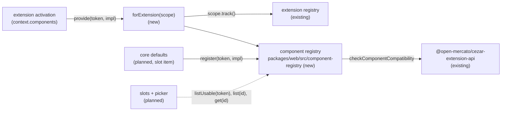

# Component Registry — several implementations of one UI contract, with their provenance

> Slug: `component-registry` · Status: **designed, awaiting implementation** · Epic 2
> (Component Platform), the "components service" item named in
> `2026-09-19-component-contract-api.md` § Planned consumers. Builds on
> `2026-09-18-extension-api-package.md` (`ComponentRegistry`, `ComponentImplementation`),
> `2026-09-18-extension-registry.md` (the host, `services(scope)`, `scope.track()`) and
> `2026-09-19-component-contract-api.md` (capabilities, `checkComponentCompatibility`). Slots that
> render a chosen implementation, the core `cezar.task.*` contracts and the Settings picker are
> later items. Delivery: one PR to `main`, confined to `packages/web`, TSDoc and README in
> `packages/extension-api`, and one AGENTS.md row.

## 📝 TLDR

An extension can already call `context.components.provide(contract, implementation)`, but the
cockpit answers every call with "context.components is not available in this Cezar version yet"
(`packages/web/src/extensions/host.ts:40`). Nothing stores an implementation, so core cannot ask
which implementations of `cezar.task.header@1` exist, or who provided them.

The proposal adds the cockpit's **component registry**. It is a pure module in
`packages/web/src/component-registry/`, like the command registry and the event bus. It will
record every implementation, from core and from extensions, as one registration:
`componentId`, `extensionId` (`null` for core), `contractId`, `contractVersion`, the React
component, its capabilities and its metadata (`title`, `description`). A contract can have any
number of implementations. `list(contractId)` returns them in registration order, and a second
registration with a taken `componentId` fails with `duplicate-registration`. The registry becomes
the real `context.components`, so an extension's implementation carries its extension id from
the activation scope, not from anything the extension claims. Nothing renders an implementation
yet: slot rendering and the picker are separate items.

## Resolved assumptions (autonomous defaults)

The brief left these open. Each default is the most reversible choice. The extension API is
private and experimental, `BUILTIN_EXTENSIONS` is empty, and no extension exists outside this
repository, so every default can change before an extension depends on it.

| # | Question | Applied default | Why |
|---|---|---|---|
| Q1 | Ship the real `cezar.task.header@1` contract with core's default implementation (the brief's example), or only the registry? | **Only the registry.** The brief's example is the definition-of-done test, run on a fixture contract (`cezar.fixture.task-header@1`) with one core and two extension implementations. The production registry serves no contract yet. | AGENTS.md (Task routing → Extensions): "Core tokens (`cezar.*`) are added in the same PR as the host code that honours them." Nothing renders a contract until the slot item. Item 7 (Q1) made the same call. |
| Q2 | "metadata": a new open `metadata` field on `ComponentImplementation`, or the fields it already has? | **The existing fields.** The registration's `metadata` is `{ title, description? }`, copied from the implementation. The public `ComponentImplementation` type does not change. | This adds no public surface. An open record would have no documented meaning, and nothing reads it yet. A typed field (an icon, allowed zones, a settings schema) can be added later without breaking anything, which item 7 also anticipated (§ Alternatives considered). |
| Q3 | An implementation that does not fit (another major, a missing required capability, or a contract this Cezar does not serve): should `provide` throw, or record it as unusable? | **Record it, never render it.** `provide` returns normally. The registration is listed with `compatible: false` and its issues, and the host reports one diagnostic. Mistakes the author controls (a malformed token, a bad or foreign id, a taken `componentId`, a field of the wrong type) still throw, as `context.commands.register` does. | This is what the package already promises: the host "ignores it with a `contract-version-mismatch` diagnostic instead of rendering it" (`components.ts`, `ComponentRegistry`). Item 7's planned-consumers row says the service "rejects" version issues, and this default reads that as not rendering them. A mismatch comes from Cezar and the extension drifting apart, which the author cannot prevent. Throwing would fail the whole activation, commands included, for one outdated component. The picker needs the issues to explain why an implementation is missing (item 7). |
| Q4 | Should readers get change notifications (`subscribe`) in this item? | **No, defer it** to the slot and picker item, its first reader. `list`, `listUsable` and `get` are plain reads. | No code reads the registry reactively yet. The reader that needs it will design the notification together with its React binding. Adding it later is additive. |

## 📝 Problem Statement

The Component Platform lets an extension offer an alternative implementation of a core component,
while the user picks which one renders (item 1, § Problem Statement). The pieces merged so far:

- **The token and the call.** `defineComponentContract` and
  `ComponentRegistry.provide(contract, implementation)` (`packages/extension-api/src/components.ts`).
- **The fit check.** `checkComponentCompatibility(contract, implementation, implemented)`
  (item 7, `compatibility.ts`). It compares declarations and never renders anything.
- **The host.** The extension registry runs `activate()` and gives each activation a scope with
  `track()` and `assertLive()` (`packages/web/src/extensions/registry.ts`). `context.commands`
  and `context.events` are real. `context.components` is still the placeholder, which throws
  (`host.ts:40`, pinned by `host.test.ts:353`).

Every later item needs the same missing piece: a place where implementations are kept, grouped by
contract, and attributed to whoever provided them.

- **The slot** needs the implementations of its contract, to render the chosen one and fall back
  to core's default.
- **The picker** needs every implementation of a contract with a title, its provenance, and, for
  one it cannot offer, the reason.
- **Diagnostics** need to say which extension provided an implementation that does not fit.

Without a registry, the brief's example cannot be expressed: `task.header@1` with a core, a Jira
and a compact implementation side by side.

## 📝 Proposed Solution

1. **One registry per page, pure.** `createComponentRegistry(options)` returns the cockpit's
   registry. Its only runtime import is the extension API: no React (only `import type`), no DOM,
   no module state. That is the rule `commands/registry.ts` and `events/bus.ts` already follow.
   `main.tsx` creates it next to the command registry and the event bus, before the extension host
   starts.
2. **The contracts this cockpit serves are declared up front.** `options.contracts` is the host's
   own list of contract tokens, with one major per id (item 7, Q6). It is empty in production
   until the slot item adds `cezar.task.*`. The registry checks every implementation against the
   host's token for that id, never against the token the implementation brought along.
3. **Two ways in, one record.** Core registers with `register(contract, implementation)`
   (`cezar.*` ids only). An extension provides through `forExtension(scope).provide(…)`, which is
   its `context.components`: ids only under `${extension.id}.`, and every registration goes through
   `scope.track()`. Both produce the same frozen `ComponentRegistration`. The only difference is
   `extensionId`: `null` for core, and the scope's `extension.id` for an extension.
4. **Duplicates are detected on `componentId`, across the whole registry.** A component id is a
   `ContributionId`, unique like a command id. A taken id throws `duplicate-registration` and names
   its owner. Disposing a registration frees its id.
5. **Fit is recorded, not thrown (Q3).** A registration's `compatible`, `issues` and `capabilities`
   come from `checkComponentCompatibility(hostToken, implementation, providedToken)`, plus one host
   issue, `unknown-contract`, for a contract the host does not serve. An unusable registration is
   listed and reported once through `onDiagnostic`. It is never rendered, because the slot item
   renders only `compatible` registrations.
6. **Reading.** `list(contractId)` returns every registration of a contract id, compatible or
   not, in registration order. That is the brief's list, and what the picker reads.
   `listUsable(contract)` returns only the compatible ones, typed with the contract's props, and
   only for the token the host serves. That is what a slot may render, so the rule "render only a
   compatible registration" is enforced by the types, not only stated in prose.
   `get(componentId)` returns one registration. All three are core-only: extensions keep
   `provide` alone, so the public API gains no method.

In the brief's example, the ids follow the grammar that the extension API enforces (the `cezar`
publisher is core's, and an extension id is `publisher.name`):

```text
cezar.task.header@1                      (the brief's task.header@1)
  ├─ cezar.task.header.default           core                   (core.task-header)
  ├─ acme.jira.task-header               extension acme.jira    (jira.task-header)
  └─ acme.compact.task-header            extension acme.compact (compact.task-header)
```

### Prior art

- **Grafana plugin extensions.** A plugin registers React components with `title`, `description`
  and an id under its own plugin id (`exposeComponent`, `addComponent`). Consumers read them back
  per id or per extension point (`usePluginComponent`, `usePluginComponents`), and the registry
  keeps which plugin contributed each one. An exposed component's major sits in its id
  (`<plugin>/reusable-component/v1`). We take the model: a list per contract, provenance kept by
  the host, and title and description as the display metadata. We skip extension points that
  plugins declare themselves, because contracts here are core's. We also keep the major as a
  separate `version` (item 7) instead of a suffix in the id.
- **Eclipse extension registry.** Every contribution to an extension point exposes its contributor
  (`IExtension.getContributor()`), so a consumer knows who contributed each element. We keep
  provenance as data on the record, set by the host.
- **VS Code contribution points.** A contribution is attributed to the extension that declared it,
  and its id is unique across the host. We keep host-wide id uniqueness. We throw on a duplicate
  instead of logging and skipping it, as our command registry already does, because a namespaced
  id can only collide by the author's own mistake.
- **Backstage's new frontend system.** Extension overrides replace a default by id at app
  assembly. We skip replacement by id: providing never replaces anything, and the user selects
  (item 1).

### Alternatives considered

- **Check fit at read time, against a token the reader passes** (no `contracts` option). Rejected.
  Nothing could report a version mismatch until a slot reads the contract, so an extension author
  would get no feedback from `provide`. It also lets two readers disagree about which major the host
  serves.
- **Core declares a contract by registering its default** (no separate catalog). Rejected. Disposing
  the default would undeclare the contract, and a contract with no default could not exist, even
  briefly during the slot item's migration.
- **Keep incompatible implementations out of the registry** (drop them with a log line). Rejected,
  because the picker must explain why an implementation is missing (item 7, planned consumers).
- **Give extensions `list` and `get` too.** Not now. No use case names one, and every added
  extension-facing method is public API. Item 1 kept `ComponentRegistry` to `provide`.
- **Key registrations by `(contractId, componentId)`.** Rejected. `componentId` is a contribution
  id, and those are unique across the host (commands and events work the same way). A
  per-contract key would let one id name two components, and the user's stored selection
  (`componentId`) would become ambiguous.

## 📝 Architecture



- **New:** `packages/web/src/component-registry/registry.ts` and its tests.
  `component-registry/core-contracts.ts` holds `CORE_COMPONENT_CONTRACTS`, the production
  catalog. It ships empty, like `BUILTIN_EXTENSIONS`, and a unit test builds a registry from it,
  so a bad token fails the gate instead of the boot.
- **Changed:** `extensions/host.ts`, where `cockpitServices` takes the registry and serves
  `components: deps.components.forExtension(scope)`. `main.tsx` creates the registry from
  `CORE_COMPONENT_CONTRACTS` and passes it in. `unavailableServices` keeps its `components`
  placeholder for callers that pass no services.
- **Docs only:** in `packages/extension-api`, the TSDoc of `ComponentRegistry` and
  `ExtensionErrorCode`, and the README status. No runtime export changes, so
  `test/surface.test.ts` and `test/boundary.test.ts` do not move.
- **Not touched:** the HTTP contract, the service and the api-client. The registry lives in the
  browser only. Nothing crosses `BACKWARD_COMPATIBILITY.md` surfaces.

In short, the registry is the store that item 7's check was written for. It gives the later slot
and picker items one list per contract, with provenance, and gives extensions nothing new to call.

## 📝 Data Model

In memory only, per page, rebuilt on every load. Nothing is persisted, and the user's selection
belongs to the picker item.

```ts
/** One implementation of a contract, as the registry holds it. Deeply frozen; never mutated. */
export interface ComponentRegistration {
  /** The implementation's id: `cezar.…` for core, `${extensionId}.…` for an extension. Unique
   *  across the registry. */
  readonly componentId: ContributionId
  /** The extension that provided it, taken from the activation scope. `null`: core's own. */
  readonly extensionId: ExtensionId | null
  /** The contract the implementation was compiled against: the id and major of the token passed
   *  to `provide`/`register`, which may differ from the major the host serves. */
  readonly contractId: ContributionId
  readonly contractVersion: number
  /** Kept by reference, never called by the registry. Typed so that no props fit it: only
   *  `listUsable` hands out a component typed with its contract's props. */
  readonly component: ComponentType<never>
  /** The capabilities the implementation declared, de-duplicated, in its own order. */
  readonly declaredCapabilities: readonly ComponentCapability[]
  /** What the host may rely on: the check's `capabilities` (every required one, then the declared
   *  optional ones, in contract order). `[]` when not compatible. */
  readonly capabilities: readonly ComponentCapability[]
  readonly metadata: ComponentMetadata
  /** `true` exactly when `issues` is empty. Only a compatible registration may be rendered. */
  readonly compatible: boolean
  readonly issues: readonly ComponentRegistrationIssue[]
}

/** A compatible registration of the served contract, as `listUsable` returns it. */
export interface UsableComponent<Props> extends Omit<ComponentRegistration, 'component' | 'compatible' | 'issues'> {
  readonly component: ComponentType<Props>
  readonly compatible: true
  readonly issues: readonly []
}

export interface ComponentMetadata {
  /** Shown to the user when they choose an implementation. Non-empty. */
  readonly title: string
  /** Present only when the implementation gave one. */
  readonly description?: string
}

/** The check's issues, plus the one only the host can know. */
export type ComponentRegistrationIssue =
  | ComponentCompatibilityIssue
  | { readonly code: 'unknown-contract'; readonly message: string; readonly contractId: ContributionId }
```

A registration is a snapshot. Each field of the implementation is read once, when it is
registered, so later changes to the extension's object have no effect. `component` is kept by
reference and never called by the registry.

## 📝 API Contracts

Host-side TypeScript, in `packages/web/src/component-registry/registry.ts`. The signatures are
normative.

```ts
export interface ComponentRegistryOptions {
  /** The contracts this cockpit serves: the host's own tokens, one major per id, `cezar.*` ids
   *  only. Default `[]`. */
  readonly contracts?: readonly ComponentContract<unknown>[]
  /** Called once for each registration recorded with `compatible: false`. Default:
   *  {@link logComponentDiagnostic}. Called inside a try/catch: a throwing reporter is swallowed. */
  readonly onDiagnostic?: (registration: ComponentRegistration) => void
}

export interface CockpitComponentRegistry {
  /** Core registration: `cezar.*` implementation ids, for a contract in `options.contracts`, and
   *  it must be compatible. Throws `ComponentError`: `invalid-id`, `namespace-violation`,
   *  `duplicate-registration`, `contract-version-mismatch`, `invalid-input`. */
  register<P>(contract: ComponentContract<P>, implementation: ComponentImplementation<NoInfer<P>>): Disposable
  /** Every registration of this contract id, compatible or not, any major, in registration order:
   *  the brief's list, and the picker's. A new frozen array per call. Never throws; a malformed
   *  argument returns `[]`. */
  list(contractId: ContributionId): readonly ComponentRegistration[]
  /** The compatible registrations of `contract.id`, in registration order, typed with its props.
   *  `[]` unless `contract` is the token the host serves: its id is in `options.contracts` at the
   *  same `version`. That compares the reader's token with the host's, never an implementation
   *  with a contract, which stays `checkComponentCompatibility`'s job. Never throws. */
  listUsable<P>(contract: ComponentContract<P>): readonly UsableComponent<P>[]
  /** The registration with this component id. Never throws. */
  get(componentId: ContributionId): ComponentRegistration | undefined
  /** The `ComponentRegistry` one extension activation sees as `context.components`. */
  forExtension(scope: ExtensionScope): ComponentRegistry
}

export function createComponentRegistry(options?: ComponentRegistryOptions): CockpitComponentRegistry

/** Recognised by `isExtensionError` (duck-typed on `code`), like `CommandError` and `EventError`. */
export class ComponentError extends Error {
  readonly code: ExtensionErrorCode
  /** The component id that was addressed, when there was a well-formed one. */
  readonly componentId?: ContributionId
}

/** One `console.warn` line: `[cezar:extensions] <componentId> (<extensionId | core>) is not used: <issue messages>`. */
export function logComponentDiagnostic(registration: ComponentRegistration): void
```

`createComponentRegistry` validates `contracts` and throws `ComponentError` for host misuse:
`invalid-id` for an entry that is not `{ kind: 'component', id: <valid ContributionId>, version:
<positive integer> }`, `namespace-violation` for an id outside `cezar.`, and
`duplicate-registration` for a second token with the same id (a second major).

### Providing, precisely (`forExtension(scope).provide`)

The steps run in order, and the first failure ends the call. Nothing is recorded when a step
throws.

Every read of a value that came from the caller happens inside a `try`, including
`Array.isArray`, which throws on a revoked proxy. A throw from such a read is mapped to the
step's code, so the caller's own error never escapes unwrapped (the same discipline as
`compatibility.ts`'s field reader).

1. `scope.assertLive()`: an ended activation throws `disposed`.
2. The contract token's `kind`, `id` and `version` are each read once, inside a `try`. The token
   must be an object `{ kind: 'component', id, version }` with a valid `ContributionId` and a
   positive integer version. A failed read or any other shape throws `invalid-id`. Its capability
   lists are not the host's and are never read.
3. Each implementation field is read once, inside its own `try`: `id`, `title`, `description`,
   `capabilities` and `component`. `capabilities` is copied in the same `try`: `Array.isArray`,
   its `length` (at most 256), then each element. A non-object, or a read that throws, throws
   `invalid-input` naming the field. From here on only the copies are used.
4. `id` must be a valid `ContributionId` (`invalid-id`) under `${extension.id}.`
   (`namespace-violation`).
5. `title` must be a non-empty string. `description` must be a string or absent. `component` must
   be a function or a non-null object, which covers `memo`, `forwardRef` and `lazy`.
   `capabilities` must be absent or an array of strings. Any other value throws `invalid-input`
   naming the field and the rule, never the value.
6. A registered `componentId` throws `duplicate-registration`:
   `Component "acme.jira.task-header" is already provided by acme.jira` (or `by core`).
7. **Fit.** A contract id that is not in `options.contracts` gives one `unknown-contract` issue:
   `acme.jira.task-header implements cezar.task.header@1, which this Cezar does not serve`.
   Otherwise the registry calls `checkComponentCompatibility(hostToken, { id, capabilities },
   { id: token.id, version: token.version })` and takes its `issues` and `capabilities`.
8. The frozen registration is added, and `onDiagnostic` runs when it is not compatible. The call
   returns `scope.track(disposable)`. Disposing removes exactly this registration, once, and never
   a newer registration of the same id. Deactivation removes all of the activation's
   registrations.

Core's `register` runs steps 2–7 with `cezar.` as the prefix and `extensionId: null`. A core
mistake is a bug that tests must catch, not drift between versions, so step 7 throws instead of
recording anything:

- a contract id that is not in `options.contracts` throws `invalid-input`;
- otherwise the check decides, with no hand-rolled comparison. Its `contract-version-mismatch`
  issue throws `contract-version-mismatch`, the error code of the same name (`compatibility.ts`
  maps it one to one). Any `missing-capability` throws `invalid-input` with the check's messages.

Its Disposable is not tracked by any scope.

### Changes to the extension API (TSDoc and README only)

- `ComponentRegistry` (`components.ts`): the host semantics gain two sentences. `provide` throws
  `disposed`, `invalid-id`, `namespace-violation`, `duplicate-registration` and `invalid-input` for
  the author's own mistakes. An implementation that does not fit (another major, a missing
  required capability, or a contract this Cezar does not serve) is kept but never rendered, and is
  reported as a diagnostic.
- `ExtensionErrorCode` (`errors.ts`):
  - `invalid-id` names `provide` among the host methods that treat a malformed token as
    malformed, here one that is not `{ kind: 'component', id, version }`;
  - `duplicate-registration` also covers "a second component implementation with an id already
    provided";
  - `invalid-input` also covers "an implementation field of the wrong type";
  - `contract-version-mismatch` says where it surfaces. It is thrown by core registration. For an
    extension's `provide`, it is the code of the registration's issue and of its diagnostic, and
    it is never thrown.
- README:
  - "Replacing a component" gets the same points, and a status update: `context.components` now
    records implementations, while rendering and selection arrive with the slot and picker
    items;
  - the Errors section gets the `invalid-id` change;
  - the example extension provides for its own contract, `example.hello.greeting`, which the
    cockpit does not serve. The README notes that on a real host this registration is recorded
    as `unknown-contract`, and that the example is exercised against the test context only.

## 📝 UI/UX

None in this item: no screen, route, setting or string that a user sees. The only new output is
the diagnostic line in the browser console, under the `[cezar:extensions]` prefix that extension
failures already use. The registry's `metadata`, `extensionId` and `issues` are shaped for the
picker, which is a later item.

## 📝 Edge Cases & Failure Scenarios

- **Two extensions, one component id.** This cannot happen across third-party extensions, because
  ids are namespaced by extension id. It can happen within one extension, or between core and a
  built-in extension whose id starts with `cezar.` (for example extension `cezar.task` providing
  `cezar.task.header.default`). The second registration throws `duplicate-registration`. If the
  extension does not catch the throw, its activation fails with that code, and the extension
  registry's isolation keeps every other extension running. Core registers nothing in this item.
  The slot item that adds core defaults must register them in `main.tsx` before
  `startExtensionHost`, as core commands are, so that core always keeps its own ids.
- **An extension built for a newer Cezar** that provides for `cezar.task.header@2` against a host
  serving `@1`. The registration is recorded with one `contract-version-mismatch` issue and one
  diagnostic. The extension's other contributions keep working.
- **An extension built for a Cezar that serves a contract this one does not.** It gets an
  `unknown-contract` issue and the same handling. In this item every extension provide ends here,
  because the production catalog is empty, and no built-in extension provides anything.
- **Deactivation, or a failed activation.** `scope.track()` disposes each registration, so the
  ids are freed and `list` stops returning them. A later activation can register the same ids
  again.
- **A throwing getter or a revoked proxy** as the implementation or one of its fields. Step 3
  turns it into `invalid-input`, and the call never lets the getter's error escape unwrapped.
- **An implementation object changed after `provide`.** The change has no effect, because the
  registration is a snapshot.
- **A registration removed while a slot renders it.** This is the slot item's case: it falls back
  to core's default (item 1). The registry only removes the registration.
- **Many registrations from one extension.** They are not capped, which matches commands and event
  listeners. The extension trust model (a later item) owns resource limits.

## 📝 Risks & Impact Review

- **Behavior promised to extensions (Q3).** "Record, don't throw" for a non-fitting implementation
  becomes extension-facing behavior. Changing it to throwing later would break extensions that do
  not catch. That is acceptable while the package is private and experimental. It matches the
  TSDoc the package already ships, and it is flagged for override in the assumptions table.
- **A registry with an empty production catalog.** Until the slot item, every real `provide`
  records `unknown-contract`. Users see nothing, because `BUILTIN_EXTENSIONS` is empty. The
  mechanism is proven by tests with a fixture catalog, as items 1 and 7 were.
- **No production reader.** `list`, `listUsable` and `get` have no caller outside tests until the slot and
  picker items. This follows the "mechanism first, core tokens with the host that honours them"
  order already used in this epic (AGENTS.md, Extensions row).
- **A mechanism that already works.** The only behavior replaced is the placeholder's throw, which
  no production code depends on (`BUILTIN_EXTENSIONS` is empty). `host.test.ts:353` pins that
  throw and is rewritten in the same step.
- **Internal signature change.** `cockpitServices` gains a required `components` dependency. Its
  callers are `main.tsx` and `host.test.ts`, both updated in the same commit.
- **Rollback.** Revert the PR. `context.components` goes back to the placeholder. No persisted
  state and no HTTP surface change.

## 📋 Phasing

1. **Phase 1: The registry, core side.** Types, `createComponentRegistry` with its catalog,
   `register`, `list`, `listUsable`, `get`, duplicate detection and disposal. It works alone, driven by core
   calls in tests.
2. **Phase 2: The extension view and its wiring.** `forExtension(scope).provide` with namespace,
   scope tracking and the recorded fit, plus `cockpitServices` and `main.tsx`. This is where the
   brief's example runs end to end through the extension host.
3. **Phase 3: Documentation.** Extension API TSDoc and README, and the AGENTS.md routing row.

## 📋 Implementation Plan

Every step keeps the validation gate in `.ai/agentic.config.json` green: typecheck, `npm test`,
`test:unit`, `build` and `test:package`.

### Phase 1: The registry, core side

Each step adds the `CockpitComponentRegistry` members it implements, so the interface never
declares a method that is not built yet.

1. **Types, catalog and error.** Add `packages/web/src/component-registry/registry.ts`, following
   the purity rule (the extension API is its only runtime import; React through `import type`
   only). Add `ComponentRegistration`, `UsableComponent`, `ComponentMetadata`,
   `ComponentRegistrationIssue`, `ComponentRegistryOptions`, `ComponentError`,
   `logComponentDiagnostic`, and `createComponentRegistry` with catalog validation, returning a
   registry with no members yet. Add `core-contracts.ts` with an empty `CORE_COMPONENT_CONTRACTS`.
   *Tests* (`registry.test.ts`):
   - `createComponentRegistry({ contracts: CORE_COMPONENT_CONTRACTS })` does not throw, so a bad
     production token fails the gate, not the boot;
   - a catalog entry with a malformed token, or one whose fields throw when read, throws
     `invalid-id`;
   - a non-`cezar.` contract id throws `namespace-violation`;
   - two majors of one id throw `duplicate-registration`;
   - `isExtensionError` recognises a `ComponentError`;
   - `logComponentDiagnostic` writes one `console.warn` line in the documented format (spy on
     `console.warn`).
2. **Core `register`, `list`, `listUsable`, `get`, disposal.**
   *Tests:*
   - with the default (empty) catalog, `register` throws `invalid-input` for any contract;
   - a registration carries `componentId`, `extensionId: null`, `contractId`, `contractVersion`,
     `component` (the same reference), `declaredCapabilities`, `capabilities` (required first,
     then the declared optional ones), `metadata` (`description` absent when not given) and
     `compatible: true`;
   - the registration is deeply frozen: `metadata`, `declaredCapabilities`, `capabilities` and
     `issues` included;
   - two core implementations of one contract are both listed, in registration order;
   - a taken id throws `duplicate-registration` naming its owner;
   - a contract that is not served throws `invalid-input`, and the served id at another major
     throws `contract-version-mismatch`;
   - a missing required capability throws `invalid-input`;
   - a non-`cezar.` id throws `namespace-violation`;
   - each field rule from § Providing, step 5, throws at its own field;
   - a throwing getter, and a revoked proxy as `capabilities` and as the token, each throw their
     step's code (`invalid-input`, `invalid-id`) and never a raw `TypeError`;
   - `dispose` removes exactly its registration, is idempotent, and never removes a newer
     registration of the same id;
   - `list` returns a new frozen array on each call, and `[]` for an unknown id or a malformed
     argument;
   - `listUsable` returns `[]` for a token at another major or an unserved id;
   - a type test: `listUsable(Token)[0].component` accepts the contract's props, and
     `list(id)[0].component` accepts none;
   - `get` returns `undefined` for an unknown id.

### Phase 2: The extension view and its wiring

3. **`forExtension(scope).provide`**, per § Providing, precisely. Use `registry.fixtures.ts`'s
   `fakeScope`.
   *Tests:*
   - the registration's `extensionId` is the scope's extension id, whatever the implementation
     object claims;
   - an id outside `${extension.id}.` throws `namespace-violation`;
   - a call after the scope ended throws `disposed`;
   - a built-in `cezar.*` extension that provides an id core already registered throws
     `duplicate-registration`;
   - another major, a missing required capability and an unknown contract are each recorded with
     `compatible: false`, the matching issue and `capabilities: []`. Each reports exactly one
     diagnostic, never throws, and is left out of `listUsable`;
   - a throwing `onDiagnostic` is swallowed;
   - the returned Disposable goes through `scope.track()`, so ending the scope removes the
     registration.
4. **Wire it into the host.** `cockpitServices({ commands, events, components })` serves
   `components: deps.components.forExtension(scope)`. `main.tsx` calls
   `createComponentRegistry({ contracts: CORE_COMPONENT_CONTRACTS })` next to `createEventBus()`,
   with a comment that the catalog stays empty until the slot item.
   *Tests* (`host.test.ts`):
   - `bootCockpit` (`host.test.ts:45`) gains a component-registry parameter, passed to
     `cockpitServices`;
   - replace "keeps storage and components on the placeholders" with a storage-only placeholder
     test;
   - add a "components service" block with the **definition-of-done proof**: a registry serving
     the fixture contract `cezar.fixture.task-header@1`, core's `cezar.fixture.task-header.default`,
     and extensions `acme.jira` and `acme.compact` each providing `<id>.task-header` from
     `activate()`;
   - `list('cezar.fixture.task-header')` returns three registrations in that order, with
     `extensionId` `null`, `acme.jira` and `acme.compact`, and `listUsable` with the fixture token
     returns the same three;
   - deactivating `acme.jira` leaves two;
   - an extension that provides the same id twice fails activation with `duplicate-registration`
     while the other two stay `active`.

### Phase 3: Documentation

5. **Extension API docs and routing.**
   - `components.ts` (`ComponentRegistry` TSDoc), `errors.ts` (`ExtensionErrorCode` TSDoc) and the
     README per § Changes to the extension API. No runtime change, so `surface.test.ts` and
     `boundary.test.ts` stay as they are;
   - AGENTS.md gets a Task routing row for `packages/web/src/component-registry/`: the pure-module
     rule, `componentId` unique across the registry, `extensionId` taken from the scope and never
     from the implementation, fit recorded and never thrown for extensions, a slot renders only
     what `listUsable` returns, and core contracts join `CORE_COMPONENT_CONTRACTS` in the same PR
     as the slot that renders them, with core defaults registered before `startExtensionHost`.

   *Test:* the validation gate.
