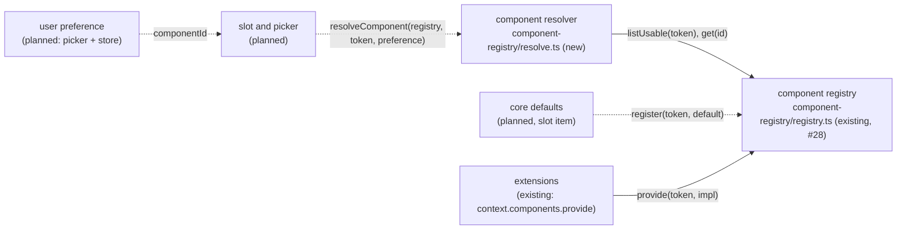

# Component Resolver — which implementation of a contract renders, with core's default as the fallback

> Slug: `component-resolver` · Status: **designed, awaiting implementation** · Epic 2
> (Component Platform), item 9. Builds on `2026-09-19-component-registry.md` (`list`,
> `listUsable`, `get`, provenance and the recorded fit, merged in #28),
> `2026-09-19-component-contract-api.md` (capabilities and `checkComponentCompatibility`, #22)
> and the host semantics the extension API already documents on `ComponentRegistry`
> (`packages/extension-api/src/components.ts:242`). The slot that renders the result, the stored
> preference and the Settings picker are later items. Delivery: one PR to `main`, confined to
> `packages/web` and one AGENTS.md row. `packages/extension-api` does not change.

## 📝 TLDR

The component registry records every implementation of a contract, but nothing decides which one
renders. `listUsable(TaskHeader)` can hold core's `cezar.task.header.default` next to
`acme.jira.task-header`, and today a slot would have to pick one itself, with its own idea of
preference, fallback and fit.

The proposal adds the **component resolver**, a pure function in
`packages/web/src/component-registry/resolve.ts`:
`resolveComponent(registry, contract, preference)`. It will return the implementation to render
and, always beside it, core's default for that contract as the fallback. The user's preferred
implementation wins only when it is registered, implements this contract and fits the major and
required capabilities the cockpit serves. Otherwise core's default renders, and the result says why
the preference was set aside. Providing an implementation never selects it. The result depends only
on the registry's contents, the contract and the preference, never on the order extensions
activated in. Nothing renders the result yet: the slot, the stored preference and the picker are
later items.

## Resolved assumptions (autonomous defaults)

The brief left these open. Each default was the most reversible choice. The extension API is
private and experimental, `BUILTIN_EXTENSIONS` and `CORE_COMPONENT_CONTRACTS` are empty, and
nothing outside this repository depends on the component registry. **The owner reviewed all four
on 2026-09-19 and confirmed each as written.** The last column records each decision.

| # | Question | Decision | Why | Owner (2026-09-19) |
|---|---|---|---|---|
| Q1 | Scope: the resolver only, or also the React slot that renders the result (error boundary, layout box, re-render when the registry changes) and the preference store and picker? | **The resolver only**, plus `missingCoreDefaults`, a named check that the slot item's gate test runs on the production catalog (§ Proposed Solution, point 6). The slot, core's defaults and their registration, the store and the picker are later items. | AGENTS.md (Task routing → Component implementations): "A core contract joins `CORE_COMPONENT_CONTRACTS` … in the same PR as the slot that renders it", so a slot built now has no real contract to render. Earlier specs give core's defaults to the slot item too (`2026-09-19-component-contract-api.md` § Planned consumers). The registry deferred `subscribe` to the slot, its first reactive reader (#26, Q4). The layout clause of the brief's Definition of Done is met at the resolution level here, and its rendering half lands with the slot (§ Problem Statement, the Definition of Done table). | ✅ confirmed |
| Q2 | Where does the user's preference come from in this item? | **An argument.** The caller passes the preferred component id for this contract, or nothing. This item stores nothing. | Storing it raises questions of its own (per user or per project, browser storage or `~/.cezar`) that belong with the picker, which writes it. An argument keeps the resolver pure, so its result is deterministic by construction. The store and the resolver deploy independently, which is also why they are not bundled into one spec. | ✅ confirmed |
| Q3 | Which core implementation is the fallback when core registers several for one contract? | **The core registration whose id is `${contract.id}.default`** (`cezar.task.header.default`), computed by one exported helper, `coreDefaultComponentId`. Other core implementations, such as a core compact header, can be chosen but are never the fallback. | Every earlier spec in this epic already names core's default this way, and so do the registry's fixtures (`cezar.fixture.task-header.default`). An id does not depend on order. "The first core registration" would, and the registry tests already register a second core implementation (`cezar.fixture.task-header.compact`). A default under another id is reported by `missingCoreDefaults`, which the slot item's gate test runs, instead of showing up at render time. | ✅ confirmed |
| Q4 | Capabilities: may a call site demand optional capabilities, and so reject a preferred implementation that lacks them? | **No, defer it.** Capabilities count through fit: a required one is part of `compatible`, which is the registry's recorded `checkComponentCompatibility` result, so a preferred implementation missing one is never used. The result hands back the chosen implementation's `capabilities`, and the call site relies on an optional one only when it is listed there (item 7's rule). | "No / defer" for a "should it also do X?" question. No call site needs it yet. A `needs` argument is additive later, and it must first answer what happens when core's default lacks the capability too, which the slot item will meet first. | ✅ confirmed |

## 📝 Problem Statement

The platform lets an extension offer an alternative implementation of a core component, while the
user picks which one renders. The extension API documents three host rules on `ComponentRegistry`
(`components.ts:242`): **opt-in selection** ("`provide` only makes an implementation available;
the user selects one per contract"), a **guaranteed fallback** to core's default, and
**versioned** implementations that the host ignores after the contract's major moves. The pieces
merged so far:

- **The fit check.** `checkComponentCompatibility` compares an implementation with a contract
  (#22).
- **The registry.** It stores every implementation with its provenance and records its fit against
  the host's own token. `listUsable(contract)` returns only compatible registrations, and
  `get(componentId)` returns one registration, compatible or not (#28).

What is missing is the decision, and every later item needs it made the same way:

- **The slot** would reimplement "the preferred one if it is usable, otherwise core's", and two
  slots of the same contract could disagree.
- **Opt-in selection** would be every caller's own discipline. A slot that renders
  `listUsable(contract)[0]`, or the newest registration, lets the order extensions activate in
  decide what the user sees.
- **The picker** could not explain why the user's choice is not the one rendering: the extension
  was removed, or it no longer fits after a Cezar upgrade.

The brief's Definition of Done, and where this item proves each point:

| Definition of Done | How this item meets it | Proven by |
|---|---|---|
| The resolver can always return core's fallback. | Every resolved result carries `fallback`, core's default for the contract, whatever the preference and whatever extensions are registered. `missingCoreDefaults(registry, contracts)` names every served contract without a core default. This item proves both on fixtures. The slot item, which registers core's first default, asserts `missingCoreDefaults` is `[]` for the production catalog, so from then on a contract without its default fails the gate. | `resolve.test.ts` |
| Removing an extension does not break the layout. | When the extension's registrations are disposed, the same call returns core's default with `rejected: not-found`, never `unresolved`, and `fallback` is the same registration before and after. The box a slot renders in comes from the contract's `layout`, which the resolution never changes. Keeping that box on screen during the swap is the slot's job (Q1). | `host.test.ts` (step 3) |
| An incompatible implementation is not used. | Only an entry of `listUsable(contract)` can be returned: a registration the registry checked against the served token with `checkComponentCompatibility`. A preferred registration with `compatible: false` is set aside as `incompatible`, with its issues. | `resolve.test.ts`, `host.test.ts` |
| The resolver's result is deterministic. | A pure function of the registry's contents, the token and the preference: no time, no randomness, no state and no logging. It selects by id, so the order extensions registered in cannot change the result. | `resolve.test.ts`, `host.test.ts` |

## 📝 Proposed Solution

1. **One pure function.** `resolveComponent(registry, contract, preference)` reads the registry
   through `listUsable` and `get` only. Neither ever throws. The module's only runtime import is
   `isValidContributionId` from the extension API: React through `import type` only, no DOM, no
   module state and no cache. That is the rule `registry.ts`, `commands/registry.ts` and
   `events/bus.ts` already follow.
2. **The candidates are `listUsable(contract)`.** The resolver makes no fit comparison of its own
   (AGENTS.md: fit is answered by `checkComponentCompatibility`, never by a hand-rolled
   comparison). A token the cockpit does not serve at this major has no candidates.
3. **The fallback is core's default** (Q3): the candidate with `extensionId: null` and the id
   `coreDefaultComponentId(contractId)`. When there is none, the result is
   `{ status: 'unresolved' }`. That is a core bug, which `missingCoreDefaults` reports (point 6). The resolver never
   falls back to an extension.
4. **The preference chooses between the fallback and one other candidate.** With no preference,
   the fallback renders. A preference that names a candidate renders that candidate. Any other
   preference renders the fallback, and the result says why in `rejected`: `invalid`, `not-found`,
   `other-contract` or `incompatible`. The resolver never picks an extension's implementation the
   user did not choose: not the only one, not the first and not the newest.
5. **The result is data.** A frozen object that holds the registry's own registrations by
   reference. The resolver reports nothing. The caller decides whether a set-aside preference
   deserves a notice (the slot, once per change) or an explanation (the picker). Calling it on
   every render is safe. Every call returns a new object, so a caller that acts once per change
   keys on `component.componentId` and `rejected?.reason`, never on the result's identity.
6. **A named check for the fallback.** `missingCoreDefaults(registry, contracts)` returns, in
   catalog order, the id of every served contract that resolves to `unresolved` with no
   preference. It calls `resolveComponent` itself, so the check and the resolver cannot disagree.
   This item proves it on fixtures. Core's defaults, their registration in `main.tsx` before
   `startExtensionHost`, and the gate test that asserts
   `missingCoreDefaults(registry, CORE_COMPONENT_CONTRACTS)` is `[]` land with the slot item.
   That gate test runs on a registry filled the way `main.tsx` fills it. Earlier specs already
   give core's defaults to the slot item. Until then the production catalog is empty, and there is
   nothing to check.

The brief's example, with the ids the extension API enforces:

```text
resolveComponent(components, TaskHeader /* cezar.task.header@1 */, 'acme.jira.task-header')

candidates = listUsable(cezar.task.header@1)
fallback   = cezar.task.header.default                        (core)
preference = acme.jira.task-header
  a candidate?  yes → render acme.jira.task-header            source: 'preference'
  a candidate?  no  → get('acme.jira.task-header')
      undefined          → rejected: not-found                (removed, disabled, failed, or not active yet)
      another contract   → rejected: other-contract
      compatible: false  → rejected: incompatible             (built for @2, or missing a required capability)
    → render cezar.task.header.default                        source: 'default'
```

### Prior art

- **VS Code custom editors.** An editor contributed with `"priority": "option"` never opens by
  default. It opens only when the user picks it (Reopen With…, or the `workbench.editorAssociations`
  setting), and the built-in editor is used otherwise. We take that rule as is: an extension's
  implementation renders only when chosen. We skip VS Code's prompt when several default editors
  compete, because core has exactly one default per contract.
- **OSGi service lookup.** `BundleContext.getServiceReference` returns the service with the highest
  `service.ranking` and, on a tie, the lowest `service.id`: the first one registered. That is
  deterministic, but the providers decide it. We skip rankings, so that no provider can promote
  itself. The user's choice is the only selector, and core's default the only tie-breaker.
- **Grafana plugin extensions.** `usePluginComponent(id)` returns `{ component, isLoading }`, with
  `component` null when the plugin is absent, and the consumer renders its own fallback. We take
  the view that "absent" is a normal state, not an error. We make the fallback part of the result,
  so that no caller can forget it.
- **Backstage's new frontend system.** An override replaces a default at app assembly. We skip it,
  as the registry did: providing never replaces anything.

### Alternatives considered

- **A `resolve` method on the registry.** Rejected. The registry is the store, and the resolver is
  one policy over two of its reads. Kept apart, each module reads in one sitting, and the
  resolver's tests use a two-method fake.
- **Fall through to another usable extension before core.** Rejected. It renders something the
  user never chose, and which one it renders would depend on registration order.
- **Throw, or return nothing, when the preference cannot be used.** Rejected. A stale preference
  is normal after an extension is removed or Cezar is upgraded, and the brief wants core's
  implementation to render then.
- **An ordered preference list** (Jira, else compact, else core). Deferred. The brief names one
  preference, and the argument can widen later.
- **Resolve once per contract and cache the result.** Rejected. The registry changes as extensions
  activate and deactivate, and it has no change notification yet, so a cache would need an
  invalidation the resolver cannot observe. A resolve is one scan over the registrations.
- **Let the resolver read the preference store.** Rejected. No store exists (Q2), and the result
  would depend on something outside its arguments.

## 📝 Architecture



- **New:** `packages/web/src/component-registry/resolve.ts` and `resolve.test.ts`.
- **Changed:** the "the components service" block of `extensions/host.test.ts`, and the AGENTS.md
  routing row for `component-registry/`.
- **Not touched:** `registry.ts`, which gains no method and no behavior, and `main.tsx`, which
  registers core's defaults only once the slot item adds them. `packages/extension-api`
  does not change either: the resolver is core-only, and `ComponentRegistry`'s TSDoc already
  promises opt-in selection and the fallback. The HTTP contract, the service and the api-client are
  unaffected, and no `BACKWARD_COMPATIBILITY.md` surface moves.

In short, the resolver is the one place where the rule "the user's usable choice, otherwise
core's default" lives. The slot and the picker will ask it instead of choosing.

## 📝 Data Model

Nothing is persisted, and the registry is unchanged. The resolver's result is computed per call
and holds the registry's frozen registrations by reference. Its types are in § API Contracts.

## 📝 API Contracts

Host-side TypeScript, in `packages/web/src/component-registry/resolve.ts`. The signatures are
normative.

```ts
import { isValidContributionId, type ComponentContract, type ContributionId } from '@open-mercato/cezar-extension-api'
import type { AnyComponentContract, CockpitComponentRegistry, ComponentRegistrationIssue, UsableComponent } from './registry'

/** The reads the resolver needs. The cockpit's registry is one. */
export type ResolverRegistry = Pick<CockpitComponentRegistry, 'listUsable' | 'get'>

/** The id of core's default implementation of a contract:
 *  `cezar.task.header` → `cezar.task.header.default`. */
export function coreDefaultComponentId(contractId: ContributionId): ContributionId

/** Why a preference was set aside. `invalid` never echoes the value it was given. */
export type PreferenceRejection =
  | { readonly reason: 'invalid' }
  | { readonly reason: 'not-found'; readonly componentId: ContributionId }
  | { readonly reason: 'other-contract'; readonly componentId: ContributionId; readonly contractId: ContributionId }
  | {
      readonly reason: 'incompatible'
      readonly componentId: ContributionId
      /** The registration's own issues, by reference: never empty. */
      readonly issues: readonly ComponentRegistrationIssue[]
    }

interface Resolved<P> {
  readonly status: 'resolved'
  /** What to render: the preferred implementation when it is a candidate, otherwise `fallback`. */
  readonly component: UsableComponent<P>
  /** Core's default for this contract. It is always present, and it is what to render when
   *  `component` fails while rendering. It is the same object as `component` when `source` is
   *  `'default'`. */
  readonly fallback: UsableComponent<P>
}

/** `'preference'`: the user's choice renders. `'default'`: there was no preference, or it was set
 *  aside, and then `rejected` says why. Callers narrow on `source`. */
export type ResolvedComponent<P> =
  | (Resolved<P> & { readonly source: 'preference' })
  | (Resolved<P> & { readonly source: 'default'; readonly rejected?: PreferenceRejection })

/** No usable core default for this token: the cockpit does not serve it at this major, or core
 *  registered no default for it. A core bug, which `missingCoreDefaults` reports. */
export interface UnresolvedComponent {
  readonly status: 'unresolved'
}

export type ComponentResolution<P> = ResolvedComponent<P> | UnresolvedComponent

/** Frozen result. Never throws for any contract or preference, given a registry whose `listUsable`
 *  and `get` never throw (the cockpit's never do). */
export function resolveComponent<P>(
  registry: ResolverRegistry,
  contract: ComponentContract<P>,
  /** The component id the user chose for this contract. `undefined` and `null`: no choice. */
  preference?: ContributionId | null,
): ComponentResolution<P>

/**
 * The ids of the served contracts that have no core default: each contract in `contracts` that
 * `resolveComponent(registry, contract)` leaves `unresolved`, in catalog order. `[]` when every
 * one resolves. The slot item's gate test asserts `[]` for `CORE_COMPONENT_CONTRACTS`.
 */
export function missingCoreDefaults(
  registry: ResolverRegistry,
  contracts: readonly AnyComponentContract[],
): readonly ContributionId[]
```

### Resolving, precisely

The steps run in order, and the first one that returns ends the call.

1. **Candidates.** `candidates = registry.listUsable(contract)`. It is `[]` for a malformed token
   and for one the cockpit does not serve at this major (the registry's rule).
2. **Fallback.** `fallback` is the candidate with `extensionId === null` and
   `componentId === coreDefaultComponentId(candidate.contractId)`. The id comes from the
   candidate, so the token is not read a second time. When there is no such candidate, the call
   returns `{ status: 'unresolved' }` without looking at the preference.
3. **No preference.** `undefined` or `null` returns
   `{ status: 'resolved', component: fallback, fallback, source: 'default' }`, with no
   `rejected`.
4. **Invalid preference.** Anything that is not a string passing `isValidContributionId`
   (including `''`) is set aside as `{ reason: 'invalid' }`, and the call goes to step 7.
5. **A candidate.** The candidate whose `componentId` equals the preference is returned as
   `{ status: 'resolved', component: candidate, fallback, source: 'preference' }`. This covers core
   implementations too: the default itself, or a core compact header.
6. **Why not.** `registration = registry.get(preference)`:
   - `undefined` gives `{ reason: 'not-found', componentId }`;
   - a `contractId` other than `fallback.contractId` gives
     `{ reason: 'other-contract', componentId, contractId }`;
   - `compatible === false` gives `{ reason: 'incompatible', componentId, issues: registration.issues }`,
     and those issues are never empty (the registry sets `compatible` exactly when `issues` is
     empty);
   - otherwise it gives `not-found`. The cockpit's registry cannot produce this case, because a
     compatible registration of this contract is a candidate, but a fake registry could.
7. **Set aside.** The call returns
   `{ status: 'resolved', component: fallback, fallback, source: 'default', rejected }`.

The result and its `rejected` are frozen. `component`, `fallback` and `issues` are the registry's
own frozen objects, by reference. The call never throws as long as `listUsable` and `get` do not,
which the cockpit's registry guarantees: step 4 is a `typeof` check and a regular expression. So for a served token with core's default
registered, the call returns a resolved result, whatever the preference.

## 📝 UI/UX

None in this item: no screen, route, setting or string that a user sees, and no console output
(the resolver logs nothing). `source`, `rejected` and `fallback` are shaped for the later slot
(which implementation to render, and what to render if it throws) and picker (why the user's
choice is not the one rendering).

## 📝 Edge Cases & Failure Scenarios

- **The preferred extension is not active yet.** Extensions activate after the boot, and the boot
  never waits for them. Until then the preference is `not-found` and core's default is returned.
  The next resolve after activation returns the extension's implementation. Re-resolving when the
  registry changes, and whether to hold the first paint of a slot whose preference is not active
  yet, is the slot's job. The registry's change notification is deferred to that item (#26, Q4).
- **The extension is removed, disabled, deactivated or fails to activate.** Its scope disposes its
  registrations, so the preference is `not-found` and core's default is returned. `fallback` is
  the same registration before and after.
- **The extension was built for another major**, after a Cezar upgrade. The registry recorded it
  with `compatible: false` and a `contract-version-mismatch` issue. The preference is
  `incompatible` with those issues, and core's default is returned. A missing required capability
  takes the same path with a `missing-capability` issue.
- **The preference names an implementation of another contract.** This happens with a stale or
  corrupted stored choice, or when an extension reused an id for another contract in a later
  version. It is set aside as `other-contract`, and core's default is returned.
- **A malformed preference** (a number, an object, `''`, `'Not An Id'`) is set aside as `invalid`,
  and core's default is returned. The value is never echoed.
- **The preference is core's own default**, or another core implementation. It is honoured, with
  `source: 'preference'`. For the default, `component` and `fallback` are the same object.
- **A built-in extension under `cezar.`** provides `<contract>.default` for a contract that core
  gives no default. Its `extensionId` is not `null`, so it is never the fallback, and the result
  is `unresolved`. When core has registered its default, the extension's provide throws
  `duplicate-registration` (the registry's rule).
- **Core forgets its default**, or registers it under another id. A served contract id longer
  than 120 characters also has no valid `.default` id. The result is `unresolved`, and
  `missingCoreDefaults` names the contract, so the slot item's gate test fails before the change
  ships. If it ever happened at runtime, the slot would render its
  reserved box empty, and never an extension (the slot item).
- **A token at another major, or one the cockpit does not serve.** The result is `unresolved`.
  Core call sites use the served tokens from `CORE_COMPONENT_CONTRACTS`.
- **The chosen implementation throws while rendering.** The slot's error boundary renders
  `fallback` directly, without resolving again. When the one that throws is the fallback itself,
  that is a core bug, and the slot item decides what to show.
- **Many registrations.** Each call is one `listUsable` scan plus at most one `get`, and a page has
  few slots. Nothing is cached (§ Alternatives considered).

## 📝 Risks & Impact Review

- **A naming rule starts to matter (Q3, confirmed by the owner on 2026-09-19).** Core's default
  must be registered as `${contract.id}.default`. `coreDefaultComponentId` is the only place that spells it, and
  `missingCoreDefaults` reports a served contract that has no default under that id. Reversing it later means adding
  an explicit catalog field. Core's ids would not change.
- **The fallback is proven on fixtures only, until the slot item.** Nothing registers a core
  default in production yet, because the production catalog is empty. `missingCoreDefaults` is
  tested on fixture catalogs both ways, one where every contract has its default and one where
  one does not, so it is shown to fail (AGENTS.md: "a fail-open helper needs a populated-input
  guarantee"). The slot item runs it on the production catalog, through the path `main.tsx` uses,
  and the AGENTS.md row makes that a rule.
- **No production caller.** `resolveComponent` has no caller outside tests until the slot and the
  picker. This follows the order the epic already uses: the mechanism first, and core contracts
  with the host code that honours them.
- **The layout clause is half-proven here (Q1).** This item proves that removing an extension
  changes the resolution back to core's default and never leaves a contract unresolved. That the
  slot keeps its box on screen through the swap is the slot's proof. The owner confirmed this split
  on 2026-09-19.
- **Nothing that works is replaced.** No existing mechanism changes (AGENTS.md § Changing a
  mechanism that already works). No existing runtime file is edited: the PR adds one module and
  its tests, extends one test block and edits AGENTS.md.
- **Rollback.** Revert the PR. Nothing is persisted, and no public or HTTP surface changes.

## 📋 Phasing

1. **Phase 1: The resolver.** `resolve.ts` with its types, `coreDefaultComponentId`,
   `resolveComponent` and `missingCoreDefaults`. It works alone, against fixture registries.
2. **Phase 2: The Definition of Done proof.** The brief's example run through the extension host,
   and the AGENTS.md row.

## 📋 Implementation Plan

Every step keeps the validation gate in `.ai/agentic.config.json` green: typecheck, `npm test`,
`test:unit`, `build` and `test:package`.

### Phase 1: The resolver

1. **`resolve.ts`**, per § Resolving, precisely. It follows the purity rule: its only runtime import
   is the extension API, and it imports React and the registry's types with `import type` only.
   *Tests* (`resolve.test.ts`), on a registry serving the fixture `cezar.fixture.task-header@1`
   (required `shows-title`), with core's `cezar.fixture.task-header.default` and
   `cezar.fixture.task-header.compact`, and extensions `acme.jira` and `acme.compact` providing
   through `fakeScope` (`extensions/registry.fixtures.ts`):
   - `coreDefaultComponentId('cezar.task.header')` is `'cezar.task.header.default'`;
   - with no preference (`undefined`, `null`), the result is core's default with
     `source: 'default'`, no `rejected` key, and `component` identical to `fallback` and to
     `registry.get('cezar.fixture.task-header.default')`;
   - **providing never selects:** with both extensions registered and no preference, the result
     is core's default;
   - a preferred, usable extension implementation is returned with `source: 'preference'`, and
     `fallback` is core's default;
   - a preference for core's compact implementation, or for the default itself, is honoured;
   - `not-found`, for an id never registered and for a registration that was disposed;
   - `other-contract`, for an implementation of a second served fixture contract, with its
     `contractId`;
   - `incompatible`: an extension built for `@2` carries a `contract-version-mismatch` issue, and
     one missing `shows-title` carries a `missing-capability` issue; `issues` is the registration's
     own array;
   - `invalid`, for `42`, `{}`, `''`, `'Not An Id'` and a revoked proxy: no `componentId` key, and
     no throw;
   - a fake registry whose `get` returns a compatible registration of this contract that
     `listUsable` omits gives `not-found`, never `incompatible` with empty issues;
   - `unresolved`: core registered only the compact implementation; only extensions registered
     (with a preference for one of them); a `cezar.fixture` built-in extension provided the
     `.default` id; the token is at another major; the token is malformed;
   - **determinism:** the same call twice gives equal results, and two registries whose extensions
     registered in opposite orders give equal results for every preference above;
   - the result and `rejected` are frozen;
   - purity: against a fake `ResolverRegistry`, the resolver calls only `listUsable` and `get`,
     and it writes nothing to `console`;
   - a type test: after narrowing on `status === 'resolved'`, `resolution.component.component`
     accepts the contract's props (a type-only `renderWith` helper like the one in `registry.test.ts`).

2. **`missingCoreDefaults`**, per § API Contracts.
   *Tests* (`resolve.test.ts`):
   - `[]` for a fixture catalog of two contracts that both have core's default registered;
   - the ids, in catalog order, of the contracts left `unresolved`: one where core registered only
     its compact implementation, and one with nothing registered. This is the negative case that
     shows the check can fail;
   - `[]` for an empty catalog.

### Phase 2: The Definition of Done proof

3. **The brief's example through the extension host, and the routing row.**
   *Tests* (`host.test.ts`, block "the components service", on `bootServingHeader`):
   - with `acme.jira` and `acme.compact` active, a preference for `acme.jira.task-header` resolves
     to it, and no preference resolves to `cezar.fixture.task-header.default`;
   - deactivating `acme.jira` makes the same call resolve to core's default with
     `rejected: { reason: 'not-found' }`. The result is never `unresolved`, and `fallback` is the
     same object before and after;
   - `acme.jira` built for `@2` is set aside as `incompatible` with `contract-version-mismatch`,
     and core's default is returned;
   - `acme.jira` throwing in `activate()` after its `provide` is set aside as `not-found`, while
     `acme.compact` stays `active` and can still be chosen;
   - booting with the extensions in the opposite order gives the same resolution for every
     preference.

   AGENTS.md, the "Component implementations" routing row:
   - a slot renders only what `resolveComponent` returns, and never picks from `listUsable`
     itself;
   - the resolver is pure, logs nothing and never throws;
   - providing never selects: with no usable preference, core's default renders, never another
     extension's;
   - core's default of a contract is registered as `coreDefaultComponentId(contract.id)`;
   - the PR that registers core's first default adds a gate test. The test asserts that
     `missingCoreDefaults(registry, CORE_COMPONENT_CONTRACTS)` is `[]` on a registry filled the way
     `main.tsx` fills it.
