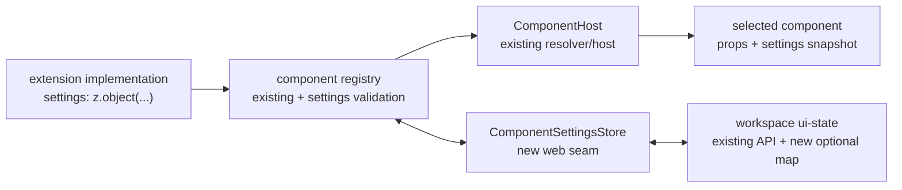

# Component Settings API — implementation-owned schemas with persisted values

> Slug: `component-settings-api` · Status: **designed, awaiting implementation** · Epic 2
> (Component Platform). Builds on `2026-09-19-component-contract-api.md`,
> `2026-09-19-component-registry.md`, `2026-09-19-component-resolver.md`,
> `2026-09-19-component-host.md` and the existing workspace UI-state store. This is an API and
> persistence item, not the settings picker UI.

## 📝 TLDR

Today a component contract describes the props and capabilities shared by every implementation,
but an implementation has no typed place for its own behavior knobs. A Jira header and a compact
header therefore cannot each declare settings without incorrectly adding those fields to the common
contract, and the host has no durable value to pass after a reload.

**Future behavior:** a `ComponentImplementation` may declare a Zod-compatible settings schema. The
component host stores validated JSON under the implementation's exact `componentId` and injects the
validated snapshot as the implementation-only `settings` prop. Two implementations of one contract
remain independent, an implementation can read the settings it owns, and values survive a cockpit
reload.

## 📝 Problem Statement

The component platform already has the right ownership boundary for this feature:

- `ComponentContract<Props>` owns the props and capabilities every implementation must understand.
- `ComponentImplementation` owns the implementation id, display metadata, component and declared
  capabilities.
- The component registry records multiple implementations and the resolver chooses one by
  `componentId`.
- `ComponentHost` is the single place that turns a resolved registration into React output.

The missing boundary is settings. A setting such as `compact` belongs to `acme.jira.task-header`,
not to `cezar.task.header.main@1`; adding it to the contract would force every implementation to
understand a field it does not own. Keeping settings only in a component's closure would make them
unavailable to the host, impossible to validate at the storage boundary, and lost on reload.

The Definition of Done is therefore one capability with three coupled guarantees:

| Requirement | Required behavior | Proof |
|---|---|---|
| Different implementations | Two implementations of the same contract may declare different schemas and values without a collision. | Registry and type tests register two schemas under distinct ids and render each selected implementation with its own value. |
| Own settings are readable | The selected implementation receives only the snapshot parsed by its own schema; another implementation's value is never substituted. | Component-host test captures `props.settings` for both implementations and checks the ids and parsed shapes. |
| Reload persistence | A fresh registry/host reads the values stored by the previous page and passes them after hydration. | Store test writes, disposes, recreates and reads both namespaces. |

## 📝 Proposed Solution

1. Add an optional, structural `ComponentSettingsSchema<Settings>` to the extension API. It exposes
   only `parse(input: unknown): Settings`; a Zod object satisfies this shape, but the node-free,
   zero-runtime-dependency extension package does not import or bundle Zod.
2. Extend `ComponentImplementation<Props, Settings>` with `settings?: schema` and define the
   implementation render props as `Props & { readonly settings: Settings | undefined }`. The
   contract's `Props` stays unchanged. A component without a schema receives `undefined`, preserving
   the existing behavior.
3. Extend the cockpit registry with a host-side settings store. `getSettings(componentId)` reads
   the raw JSON value, parses it with that registration's schema and returns `undefined` when there
   is no value. `setSettings(componentId, input)` parses before writing, persists the canonical
   parsed JSON and leaves the old value untouched on validation failure. The `provide` result becomes
   a scoped registration handle with `getSettings()` and `onSettingsChange()`, so an extension can
   read/listen to the settings of the implementation it just registered; only the host/picker can
   write.
4. Back the store by the existing workspace UI-state API, adding one optional
   `componentSettings` map. The map is keyed directly by `componentId`, not by contract id, title or
   extension display name. It is global user state, so it is available to every project and survives
   a new cockpit process/page.
5. Make `ComponentHost` load settings for the currently resolved implementation and pass them to
   the component. Registry/store changes trigger the existing registry revision subscription; late
   reads for a previous implementation are ignored. A missing or malformed setting never prevents
   the component from rendering: the component receives `undefined` and the host emits one
   diagnostic.

The resulting shape is intentionally close to the brief:

```ts
import { z } from 'zod'
import {
  defineComponentContract,
  type ComponentImplementation,
} from '@open-mercato/cezar-extension-api'

const Header = defineComponentContract<HeaderProps>('cezar.task.header.main', { version: 1 })
const JiraSettings = z.object({
  compact: z.boolean(),
  showToolCalls: z.boolean(),
})
type JiraSettings = z.infer<typeof JiraSettings>

const jiraHeader: ComponentImplementation<HeaderProps, JiraSettings> = {
  id: 'acme.jira.task-header',
  title: 'Jira header',
  settings: JiraSettings,
  component: ({ task, settings }) => (
    <HeaderView task={task} compact={settings?.compact ?? false} showToolCalls={settings?.showToolCalls ?? true} />
  ),
}
```

The extension API accepts Zod structurally, so an extension may use its own Zod version or another
parser with the same `parse` result. Cezar persists only the parser's JSON result; dates, functions,
cycles and other non-JSON outputs are rejected at the host boundary.

### Prior art

- [VS Code configuration](https://code.visualstudio.com/api/references/vscode-api) scopes extension
  settings by a named section. We take the stable owner namespace, but keep the scope at the
  implementation id because one Cezar contract intentionally has several alternatives.
- [Grafana plugin configuration](https://grafana.com/developers/plugin-tools/reference/plugin-json)
  pairs plugin identity with a declared schema/configuration surface. We take the explicit
  declaration and host validation, but avoid a second plugin-wide settings namespace when the
  registry already has a globally unique implementation id.
- [Backstage frontend extension configuration](https://backstage.io/docs/frontend-system/building-apps/configuring-extensions/)
  gives each extension its own config and requires defaults. Cezar keeps defaults in the component
  (`undefined` means use the implementation's safe default) because this item has no settings UI and
  must preserve zero-config boot behavior.

### Alternatives considered

- **Put settings on `ComponentContract`.** Rejected: it couples all implementations to fields owned
  by one implementation and makes adding a Jira-only setting a contract-version decision.
- **Use a single `Record<string, JsonValue>` with no schema.** Rejected: storage would survive
  reload, but the host could pass a stale or malformed shape to a component and the extension would
  have to duplicate validation everywhere.
- **Import Zod from `@open-mercato/cezar-extension-api`.** Rejected: AGENTS.md makes that package
  node-free, DOM-free and zero-runtime-dependency; a type-only structural adapter accepts Zod without
  moving its runtime into the extension contract.
- **Expose one React context for settings.** Rejected: it would couple the public extension API to
  React context and make the host inject settings through an implicit global. The existing host
  already owns the explicit props handoff and can test it without a browser context.
- **Persist through `context.storage.global`.** Deferred: extension storage is independently scoped
  by extension id, while this setting is host-owned and must also support core implementations. The
  shared workspace UI-state map gives core and extensions one persistence path; a later storage item
  can offer extension-owned data for non-component use cases.

## Resolved assumptions (autonomous defaults)

The brief left four design questions. Each choice is the smallest reversible surface that completes
the Definition of Done and preserves the repository's zero-config and package-boundary rules.

| # | Question | Applied default | Why | Confirm? |
|---|---|---|---|---|
| Q1 | Should settings be global or project-scoped? | **Global workspace settings**, keyed only by implementation id. | The resolver preference and the component registry are page/workspace-level; the brief does not name project scope. A future project-specific setting can add a separate store without changing this namespace. | reversible |
| Q2 | Must the extension API import Zod to type `settings: z.object(…)`? | **No. Define a structural `parse` schema interface; accept Zod objects without importing Zod.** | Preserves `packages/extension-api`'s node-free, DOM-free, zero-runtime-dependency boundary while supporting the requested syntax. | reversible |
| Q3 | Who writes settings, and what happens before the first write? | **The host/picker writes through the cockpit registry; a missing setting is `undefined`, and the implementation chooses its safe default.** | This item delivers the durable API and host seam without inventing a UI. No implicit write keeps zero-config boot and makes reset a delete/clear operation. | reversible |
| Q4 | How does an implementation read settings? | **The host injects a validated `settings` prop; the contract's shared props remain unchanged.** | It is explicit, testable and renderer-neutral at the public contract boundary; no React context or hidden global is added. | reversible |

## 📝 Architecture



The public extension package contributes only types and the schema boundary. The cockpit registry
owns registration identity and validation; the persistent store owns transport/cache/write ordering;
the host owns hydration and render timing. No service, CLI runner or project context is involved.

### Modules and ownership

- `packages/extension-api/src/components.ts`: add the structural settings schema, settings render
  props and the second generic on `ComponentImplementation`; keep `ComponentContract<Props>` intact.
- `packages/web/src/component-registry/registry.ts`: snapshot the schema on registration; add the
  injected `ComponentSettingsStore`, parsed reads/writes, settings-change revision bumps and
  diagnostics. Registration id uniqueness remains the namespace guard.
- `packages/web/src/component-registry/settings.ts` (new): implement the store adapter over the
  existing workspace UI-state client. It caches the last successful map, serializes read-modify-write
  operations, and degrades to in-memory `undefined` reads when the server is unavailable.
- `packages/web/src/component-registry/component-host.tsx`: load settings for the current resolved
  registration, pass a fresh props object with `settings`, and ignore stale promises after a
  resolution change or unmount.
- `packages/web/src/main.tsx`: construct the persistent store before starting the extension host and
  pass it to the page's shared component registry. The default main path must remain persisted; tests
  may use the in-memory fallback.
- `packages/contract/src/workspace.ts`: add the optional, bounded `componentSettings` field to the
  workspace UI-state response and PUT schemas. `packages/api-client` consumes the inferred shape;
  no new route is introduced.
- `packages/cezar/src/server/server.ts` and workspace state helpers: preserve/validate the map through
  the existing chained `GET/PUT /api/v1/workspace/ui-state` family and its atomic merge-write.
- `BACKWARD_COMPATIBILITY.md`, `AGENTS.md` and `packages/extension-api/README.md`: document the
  additive persisted field, the implementation-owned schema and the reserved render prop.

## 📝 Data Model

### In-memory registration

`ComponentRegistration` gains the schema by reference, captured once at registration:

```ts
export interface ComponentSettingsSchema<Settings> {
  /** A Zod schema or compatible parser. It may throw for invalid input. */
  readonly parse: (input: unknown) => Settings
}

export type ComponentRenderProps<Props, Settings> = Props & {
  /** `undefined` when no schema/value exists or the stored value is invalid. */
  readonly settings: Settings | undefined
}

export interface ComponentImplementation<Props, Settings = unknown> {
  readonly id: ContributionId
  readonly title: string
  readonly description?: string
  readonly capabilities?: readonly ComponentCapability[]
  readonly settings?: ComponentSettingsSchema<Settings>
  readonly component: ComponentType<ComponentRenderProps<Props, Settings>>
}

export interface ComponentRegistrationHandle<Settings> extends Disposable {
  /** The id supplied in the registration. */
  readonly componentId: ContributionId
  /** Reads this implementation's parsed settings; no other implementation id is accepted. */
  getSettings(): Promise<Settings | undefined>
  /** Receives this implementation's parsed value after a successful host write or reload event. */
  onSettingsChange(listener: (settings: Settings | undefined) => void): Disposable
}
```

The registry does not mutate the schema or call it during `provide`. The registration is compatible
based on the component contract/capabilities as today; settings incompatibility is a value problem,
not a reason to hide an otherwise valid implementation.

### Persisted workspace state

The existing `~/.cezar/ui-state.json` gains one optional map:

```json
{
  "componentSettings": {
    "acme.jira.task-header": { "compact": true, "showToolCalls": false },
    "acme.compact.task-header": { "dense": true }
  }
}
```

Rules:

- The key is the exact `ContributionId` of the implementation. The same contract id may have many
  entries; implementation id collisions are already rejected by the registry.
- Values are JSON objects/arrays/primitives accepted by the existing JSON boundary. A parsed schema
  output must round-trip through JSON before it is stored.
- The map is optional and absent means no settings have been written. An empty map is a valid clear
  result and is not synthesized on read.
- The existing workspace UI-state body cap remains the aggregate limit; each setting value gets an
  explicit serialized-size bound and the map gets a bounded entry count in the contract schema.
- Clearing an implementation's settings deletes only its map entry. Removing an implementation does
  not garbage-collect its entry, so reinstalling it can recover the user's previous choice.
- This is global user preference state, not project data and never a secret store. A settings schema
  must not be used for credentials or tokens.

### Store seam

```ts
export interface ComponentSettingsStore {
  get(componentId: ContributionId): Promise<JsonValue | undefined>
  set(componentId: ContributionId, value: JsonValue): Promise<void>
  delete(componentId: ContributionId): Promise<void>
  subscribe(listener: (componentId: ContributionId) => void): () => void
}
```

The adapter loads the workspace state lazily, uses the existing query/client cache, and serializes
read-modify-write operations so two settings writes in one cockpit do not drop each other. It emits a
component id after a successful local write. An external workspace-state event or a reconnect causes
the adapter to invalidate/re-read and emit affected ids; the setting value never travels in a live
event.

## 📝 API Contracts

### Extension API (`packages/extension-api`)

```ts
export interface ComponentSettingsSchema<Settings> {
  readonly parse: (input: unknown) => Settings
}

export type ComponentRenderProps<Props, Settings> = Props & {
  readonly settings: Settings | undefined
}

export interface ComponentImplementation<Props, Settings = unknown> {
  // …existing fields…
  readonly settings?: ComponentSettingsSchema<Settings>
  readonly component: ComponentType<ComponentRenderProps<Props, Settings>>
}

export interface ComponentRegistrationHandle<Settings> extends Disposable {
  readonly componentId: ContributionId
  getSettings(): Promise<Settings | undefined>
  onSettingsChange(listener: (settings: Settings | undefined) => void): Disposable
}

export interface ComponentRegistry {
  provide<Props, Settings>(
    contract: ComponentContract<Props>,
    implementation: ComponentImplementation<NoInfer<Props>, Settings>,
  ): ComponentRegistrationHandle<Settings>
}
```

`ComponentRegistry.provide` returns `ComponentRegistrationHandle<Settings>` instead of the bare
`Disposable`. Its read and subscription methods are scoped to that one registration and fail with
`disposed` after deactivation. There is no `getSettings(componentId)` method on the extension-facing
registry, so an extension cannot probe another implementation. The implementation reads
`props.settings` when rendered, or the handle's parsed value from activation code; its own parser is
the authority for the value's shape.
The extension API's `index.ts` re-exports the new types; it does not export Zod or add a runtime
dependency. The package's existing single-entry-point, boundary and surface tests remain mandatory.

### Cockpit registry (`packages/web/src/component-registry/registry.ts`)

```ts
export interface ComponentRegistryOptions {
  readonly contracts?: readonly AnyComponentContract[]
  readonly onDiagnostic?: (registration: ComponentRegistration) => void
  readonly settings?: ComponentSettingsStore
}

export interface CockpitComponentRegistry {
  // …existing registration, list, resolve and subscription methods…
  getSettings(componentId: ContributionId): Promise<unknown | undefined>
  setSettings(componentId: ContributionId, input: unknown): Promise<void>
  clearSettings(componentId: ContributionId): Promise<void>
}
```

These three methods are host-side. `getSettings` returns `undefined` for an unknown implementation,
one without a schema, or an absent setting. For a known schema it parses the stored raw JSON and
returns the parsed result. `setSettings` requires a live registration with a schema, parses first,
verifies a JSON round trip and writes only the canonical result. A parse failure is
`ComponentSettingsError('invalid-settings')`; the previous value remains intact. A store failure is
`ComponentSettingsError('settings-unavailable')`; it never breaks boot or unregisters the component.
`clearSettings` is idempotent and emits a registry revision only after the delete succeeds.

`forExtension(scope)` does not expose these host methods. This prevents one extension from reading or
overwriting another implementation's settings. Its implementation gets only the selected value for
its own component when the host renders it.

### Host render behavior

`ComponentHost` keeps the existing resolution and error-boundary semantics, with settings added to
the render step:

1. Resolve the implementation and fallback by contract/preference.
2. Read settings for the implementation currently being rendered.
3. Render a fresh `{ ...props, settings }` object. The caller's contract props are never mutated.
4. On a registry/store revision, repeat for the current implementation. Ignore a read that completes
   after the component id, subject or host instance has changed.
5. If the selected implementation throws, render the fallback with the fallback's own settings. A
   failed implementation's setting value must not leak into its fallback.

The `settings` prop name is reserved for this feature. A future contract that needs a contract-owned
field with that name must use a new contract major or wait for a separate adapter design.

## 📝 UI/UX

None in this item. There is no settings page, picker, form generator or new route. A later picker
item may read registrations, show each implementation's declared schema through an explicit UI
adapter, and call the host-side `setSettings`/`clearSettings` seam. This spec deliberately does not
assume that arbitrary Zod schemas can be rendered automatically as forms.

## 📝 Edge Cases & Failure Scenarios

| Scenario | Behavior |
|---|---|
| Two implementations share one contract but declare different schemas | Both register; each id gets an independent map entry and parser. Selecting A never reads B's value. |
| No stored value | The component receives `settings: undefined` and must use its own safe default. No file key is synthesized. |
| Stored value no longer matches the schema | Read returns `undefined`, one diagnostic is emitted per component/page load, the raw value is preserved for recovery or overwrite, and rendering continues. |
| A schema parser returns a non-JSON value | The host rejects the read/write as invalid settings; no non-JSON value reaches the component or disk. |
| `setSettings` receives invalid input | It rejects with `invalid-settings`; the previous persisted value remains unchanged. |
| Workspace UI-state service is offline/read-only | Existing component behavior continues with `undefined`; writes reject as `settings-unavailable` and do not block cockpit boot. |
| Workspace state is missing/corrupt/newer | Existing UI-state degradation rules apply: read defaults to an empty map with one warning, writes use atomic merge-write, and unknown state is not destructively rewritten. |
| A component is deactivated and later re-provided | The registration is new, but the old `componentId` entry remains and is reused if the new schema accepts it. |
| Selected implementation changes while a read is pending | The pending result is discarded by id/generation; the new implementation is loaded independently. |
| Core fallback renders after an extension failure | Fallback receives only its own parsed settings, not the failed extension's settings. |
| An extension tries to read another id | The extension-facing registry has no id-based reader; a handle can read only the implementation it registered, and component code receives only its own injected prop. |
| A contract has a `settings` prop | The registration is rejected by the contract/host typing rule or requires a new major; the reserved implementation prop must not be silently overwritten. |
| Two tabs write different component ids | The adapter performs serialized read-modify-write and the server's existing merge-write preserves both entries. Cross-process last-writer behavior remains the existing UI-state trade-off and is documented. |
| The value contains a secret | It is rejected by product guidance: component settings are ordinary global UI state, not encrypted secret storage. |

## 📝 Risks & Impact Review

- **Public extension type change.** `ComponentImplementation` gains a second generic and a settings
  prop. It is additive for existing implementations because `settings` is optional and existing
  components may ignore the extra prop. The experimental private package is versioned with the
  release; update its README, surface/type tests and lockstep web range as required by AGENTS.md.
- **Reserved prop.** A contract that already owns `settings` cannot adopt this feature without a
  major. Current core contracts do not use it; a boundary test must pin the reservation.
- **Persisted state surface.** `componentSettings` is a new optional key in the protected workspace
  UI-state file and response. Older Cezar versions must preserve it through the loose UI-state
  schema; the new writer must never drop unknown sibling keys. Add the field to
  `BACKWARD_COMPATIBILITY.md` §2/§9 as appropriate and keep the contract/schema/client parity tests
  green.
- **Schema execution.** A schema is extension code and can throw or be expensive. The registry calls
  it only around a value read/write, catches failures, and never calls it during registration or
  boot. A bad schema affects its implementation's settings, not the whole page.
- **Stale asynchronous reads.** The host must key every read by implementation id and a monotonic
  request generation. Without that guard, switching from Jira to compact could paint Jira settings
  into compact's component.
- **Zero-config path.** The persistent store is used by the normal `main.tsx` path, but the store is
  lazy and optional. With no settings written, no new network request or UI is required to render a
  component. If the store is unavailable, the page still renders with implementation defaults.
- **Rollback.** Reverting the code leaves `componentSettings` as an unknown optional UI-state key for
  older versions; no user task state or runner state changes. A later implementation may read the
  values again without migration.

## 📋 Phasing

1. **Phase 1 — Extension contract and pure registry.** Add the Zod-compatible type, implementation
   generic, registration snapshot and in-memory settings behavior. Prove two schemas under one
   contract and compatibility with old implementations.
2. **Phase 2 — Durable workspace store.** Add the optional `componentSettings` contract field and
   the web adapter over workspace UI-state, with atomic read-modify-write, cache invalidation and
   graceful degradation. The API remains the existing versioned UI-state route family.
3. **Phase 3 — Component host integration.** Hydrate the selected implementation, inject its parsed
   settings, handle changes/races/fallbacks and prove reload behavior through host tests.
4. **Phase 4 — Documentation and handoff.** Update the extension API README, AGENTS routing row,
   compatibility inventory and release notes. Leave the picker/form UI as a separate follow-on item.

## 📋 Implementation Plan

Every step keeps `npm run typecheck`, `npm test`, `npm run test:unit`, `npm run build` and
`npm run test:package` green.

### Phase 1 — Extension contract and pure registry

1. **Add the schema and render-prop types.**
   - Code: `packages/extension-api/src/components.ts`, `src/index.ts`, README and surface/boundary
     tests.
   - Test: the requested `z.object({ compact: z.boolean(), showToolCalls: z.boolean() })` shape
     type-checks through a fixture adapter without importing Zod into `extension-api`; existing
     implementations with no settings still type-check; a component receives its typed settings.
2. **Snapshot and validate settings on registration.**
   - Code: `packages/web/src/component-registry/registry.ts` and its settings error/store seam.
   - Test: schemas are retained per implementation id; malformed registration fields still use the
     existing error behavior; duplicate ids remain rejected; two implementations of one contract can
     have unrelated settings schemas.
3. **Implement host read/write semantics in memory.**
   - Test: missing returns `undefined`, valid values parse and round-trip, invalid writes preserve the
     old value, invalid stored values degrade without throwing from `getSettings`, clear is idempotent,
     and store notifications bump the registry revision.

### Phase 2 — Durable workspace store

4. **Extend the workspace UI-state contract additively.**
   - Code: `packages/contract/src/workspace.ts` and the inferred api-client surface; add bounded
     `componentSettings` keys/values without narrowing unknown sibling fields.
   - Test: old response fixtures parse; the map accepts valid contribution ids and rejects oversized or
     non-JSON values; contract-parity and typed-body tests still cover both workspace UI-state routes.
5. **Persist through the existing workspace UI-state family.**
   - Code: `packages/web/src/component-registry/settings.ts`, `packages/web/src/api/client.ts` only
     if an existing helper needs a typed merge, and server workspace-state merge tests.
   - Test: GET hydrates the cache; set performs a read-modify-write; two ids survive one another; delete
     removes only one id; network, 409/500 and malformed responses degrade reads and map writes to a
     recoverable `settings-unavailable` error; no new unversioned route appears.
6. **Wire the default boot path.**
   - Code: `packages/web/src/main.tsx` passes the persistent adapter into the shared component
     registry; test factories keep the in-memory fallback.
   - Test: the normal boot creates one lazy store before extensions activate, while a fresh store
     instance reads values written by the previous instance; no settings request occurs when no
     component declares a schema.

### Phase 3 — Component host integration

7. **Inject settings into the selected implementation.**
   - Code: `packages/web/src/component-registry/component-host.tsx` and provider/runtime revision
     wiring.
   - Test: selected Jira and compact implementations receive their own parsed settings; a missing
     value is `undefined`; settings updates rerender the selected component; contract props are not
     mutated.
8. **Cover switching, fallback and asynchronous failure paths.**
   - Test: a stale Jira read cannot paint after switching to compact; extension failure renders core
     with core settings; core failure keeps the existing inline retry; parser errors and store errors
     never unmount the surrounding page.
9. **Exercise the Definition of Done end to end at the package boundary.**
   - Test: register two implementations of one fixture contract, write both values, recreate the
     registry/host, select each implementation and assert each renders its own settings after reload.

### Phase 4 — Documentation and compatibility

10. **Document the durable contract.** Update `packages/extension-api/README.md`, the Extensions and
    component-implementation routing row in `AGENTS.md`, `BACKWARD_COMPATIBILITY.md`, and the release
    notes with the reserved prop, global namespace, missing-value default and non-secret warning.
11. **Run the full configured validation gate.** Run the five commands above plus the focused
    extension-api, component-registry, component-host and workspace UI-state suites. Confirm no UI
    mockup or browser screenshot is required: this item adds no screen, route or visible layout.
