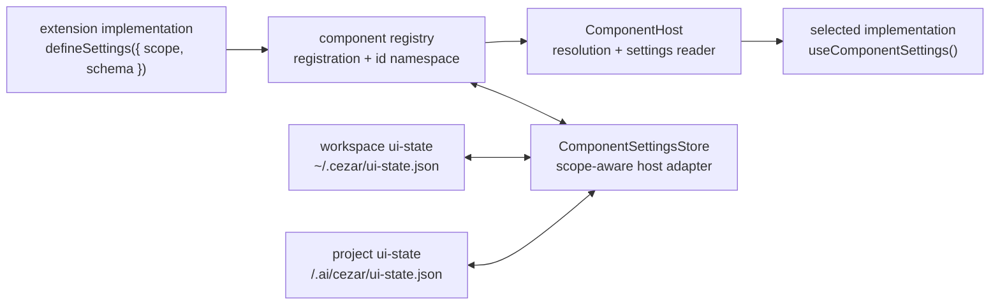

# Component Settings API — implementation-owned, scoped and persisted settings

> Slug: `component-settings-api` · Status: **designed, awaiting implementation** · Epic 2
> (Component Platform). Builds on `2026-09-19-component-contract-api.md`,
> `2026-09-19-component-registry.md`, `2026-09-19-component-resolver.md`,
> `2026-09-19-component-host.md`, `2026-09-19-extension-storage-api.md` and
> `2026-09-19-extension-project-storage.md`. This is an API and persistence item, not the
> settings picker UI.

## 📝 TLDR

Component contracts describe the props and capabilities shared by every implementation, but an
implementation also needs private behavior knobs. A Jira header and a compact header must be able
to define different settings without adding either set of fields to the shared contract.

Each `ComponentImplementation` may declare a Cezar-owned settings definition with:

- an explicit default scope: `global` or `project`;
- a library-independent declarative schema;
- typed defaults used before the first write and after a reset.

Cezar validates, persists, scopes, migrates and resets the values. The persisted namespace is the
implementation's exact id, so two implementations of one contract never share a value. The
implementation reads its resolved settings through the type-safe `useComponentSettings()` surface
provided to its component. Global values live in workspace UI state; project values live in the
existing per-project UI-state path. A fresh registry/host therefore reads the same values after a
reload.

## 📝 Problem Statement

The component platform already has the right ownership boundary:

- `ComponentContract<Props>` owns the props and capabilities every implementation must understand.
- `ComponentImplementation` owns the implementation id, display metadata, component and declared
  capabilities.
- The component registry records multiple implementations and the resolver chooses one by
  `componentId`.
- `ComponentHost` is the single place that turns a resolved registration into React output.

The missing boundary is implementation settings. A setting such as `compact` belongs to
`acme.jira.task-header`, not to `cezar.task.header.main@1`. Keeping settings in a component closure
would make them unavailable to the host, impossible to persist consistently and lost on reload.

The Definition of Done is one capability with three coupled guarantees:

| Requirement | Required behavior | Proof |
|---|---|---|
| Different implementations | Two implementations of one contract may declare different settings definitions, scopes and values without collision. | Registry and type tests register both implementations under distinct ids and assert independent stored entries. |
| Own settings are readable | A selected implementation reads only the resolved value from its own definition and namespace. | Component-host test renders both implementations and checks typed `useComponentSettings()` values. |
| Reload persistence | Global and project values survive a fresh registry/host instance and remain attached to their selected scope. | Store test writes, disposes, recreates and reads both scope targets. |

## 📝 Proposed Solution

1. Add a Cezar-owned, library-independent `defineSettings()` API to the extension contract. The
   definition contains `scope`, a declarative schema and defaults. `booleanSetting()` is the first
   field helper; the format is designed to grow without binding extensions to Zod or another
   validation library.
2. Extend `ComponentImplementation<Props, Settings>` with an optional settings definition. The
   contract props remain unchanged. For an implementation with settings, the host supplies an
   implementation-only `useComponentSettings()` reader; it is not part of `ComponentContract`.
3. Keep writes host-owned. The extension declares field types and defaults but has no settings
   setter. The host/picker calls registry methods for set, partial update and reset; Cezar performs
   validation, canonicalization, persistence, scope resolution and storage migrations.
4. Namespace settings by the exact implementation `componentId` inside the selected scope's UI
   state. `global` uses `~/.cezar/ui-state.json`; `project` uses the existing
   `<repo>/.ai/cezar/ui-state.json` path and project-scoped UI-state route.
5. Make `ComponentHost` hydrate the selected implementation's resolved settings and provide the
   reader. Registry/store changes rerender the current implementation; late reads for a previous
   implementation or project are ignored.

The resulting public shape is intentionally not a Zod API:

```ts
import {
  booleanSetting,
  defineComponentContract,
  defineSettings,
  type ComponentImplementation,
  type SettingsOf,
} from '@open-mercato/cezar-extension-api'

const Header = defineComponentContract<HeaderProps>('cezar.task.header.main', { version: 1 })

const JiraHeaderSettings = defineSettings({
  scope: 'global',
  schema: {
    compact: booleanSetting({ default: false }),
    showToolCalls: booleanSetting({ default: true }),
  },
})
type JiraHeaderSettings = SettingsOf<typeof JiraHeaderSettings>

const jiraHeader: ComponentImplementation<HeaderProps, JiraHeaderSettings> = {
  id: 'acme.jira.task-header',
  title: 'Jira header',
  settings: JiraHeaderSettings,
  component: ({ task, useComponentSettings }) => {
    const settings = useComponentSettings()
    return (
      <HeaderView
        task={task}
        compact={settings.compact}
        showToolCalls={settings.showToolCalls}
      />
    )
  },
}
```

`useComponentSettings()` returns a complete value: stored overrides merged with the definition's
defaults. A component with no settings definition keeps its current props contract and does not
cause a settings read. The host may use Zod internally at a Cezar boundary, but no extension is
required to depend on Zod and Zod is not exported by `@open-mercato/cezar-extension-api`.

### Prior art

- [VS Code configuration](https://code.visualstudio.com/api/references/vscode-api) scopes extension
  settings by a named section. Cezar uses the stable implementation id as the namespace and makes
  the global/project scope an explicit implementation choice.
- [Grafana plugin configuration](https://grafana.com/developers/plugin-tools/reference/plugin-json)
  pairs plugin identity with a declared configuration surface. Cezar keeps that declaration in the
  implementation registration and lets the host own persistence.
- [Backstage frontend extension configuration](https://backstage.io/docs/frontend-system/building-apps/configuring-extensions/)
  gives each extension its own configuration and defaults. Cezar applies the same default-first
  behavior while keeping settings at implementation scope rather than contract scope.

### Alternatives considered

- **Put settings on `ComponentContract`.** Rejected: it couples all implementations to fields owned
  by one implementation and makes a Jira-only setting a contract-version decision.
- **Use `settings: z.object(...)` in the public API.** Rejected: extension developers should not be
  forced to depend on Zod, and `extension-api` must remain zero-runtime-dependency and node/DOM-free.
  Cezar may use Zod internally behind the host boundary.
- **Use one untyped `Record<string, JsonValue>`.** Rejected: the host could persist malformed data,
  defaults would not be discoverable and every extension would duplicate validation.
- **Let extensions write their own settings.** Rejected: Cezar must own validation, persistence,
  scopes, migrations and reset so core and extension implementations follow one lifecycle.
- **Inject a `settings` prop into contract props.** Rejected: settings are implementation-owned, not
  contract-owned. The host instead supplies `useComponentSettings()` in the implementation render
  context.
- **Export a React hook implementation from `extension-api`.** Rejected for this item because the
  package is deliberately React-runtime-free. The public package types the hook-shaped reader and
  `ComponentHost` supplies it; extensions can call it at the top level of their React component.
  A separate React adapter is not needed to meet this item's boundary.
- **Support global defaults plus project overrides immediately.** Deferred: this item supports one
  declared scope per implementation. Layering can be added later without changing the id namespace
  or the two backing files.
- **Persist through `context.storage.global/project`.** Deferred: component settings are host-owned
  and must also work for core implementations. The existing UI-state paths provide one host store;
  extension storage remains the right API for extension data unrelated to component configuration.

## Resolved decisions from PR #46

The owner answered the four open questions in [PR #46](https://github.com/DarrenStasiakDev4You/cezar-hackathon-ale-patryk-nazywa-go-brutusem/pull/46#issuecomment-5745404062).

| # | Question | Decision | Consequence |
|---|---|---|---|
| Q1 | Global or project-scoped? | **Both. Each implementation declares one default scope: `global` or `project`.** | UI preferences such as compactness and appearance can be global; repository integrations can follow one project. Global-default/project-override layering is a follow-on. |
| Q2 | Must the public API import Zod? | **No. Use Cezar's own declarative settings API, starting with `defineSettings()` and `booleanSetting()`.** | The extension contract owns types/defaults without a dependency on a schema library. Cezar may use Zod internally. |
| Q3 | Who writes and migrates values? | **Cezar/host only.** The extension declares fields, types and defaults; the host validates, persists, scopes, migrates and resets. | The extension API exposes no setter. Persisted values are sparse overrides and defaults are resolved by the host. |
| Q4 | How does an implementation read values? | **Through a type-safe implementation-specific `useComponentSettings()` reader.** | The reader is provided in the implementation render context, separate from contract props. The extension package remains React-runtime-free. |

## 📝 Architecture



The public extension package contributes the settings definition and types. The cockpit registry
owns registration identity and host-only writes. The persistent adapter owns transport, cache,
read-modify-write ordering and scope resolution. `ComponentHost` owns hydration and render timing.
No service runner or agent backend is involved.

### Modules and ownership

- `packages/extension-api/src/components.ts`: add setting descriptors, `defineSettings`,
  `SettingsOf`, the scope type and the implementation render context; keep
  `ComponentContract<Props>` unchanged.
- `packages/web/src/component-registry/registry.ts`: capture the immutable definition at
  registration; expose host-only read/write/reset methods and implementation-scoped registration
  reads; emit revision changes after successful writes or external invalidation.
- `packages/web/src/component-registry/settings.ts` (new): implement the scope-aware store adapter
  over the existing workspace and project UI-state clients. It resolves the project from the URL on
  each project operation, serializes read-modify-write operations and degrades to defaults when the
  service is unavailable.
- `packages/web/src/component-registry/component-host.tsx`: hydrate the current implementation,
  supply `useComponentSettings()` and discard stale reads after an implementation, subject, project
  or host instance changes.
- `packages/web/src/main.tsx`: construct one persistent store before extension activation and pass it
  to the shared component registry. Test factories may use an in-memory store.
- `packages/contract/src/workspace.ts`: add the optional bounded `componentSettings` field to both
  workspace and project UI-state schemas, preserving the existing open sibling-key behavior.
- `packages/cezar/src/server/server.ts` and UI-state helpers: preserve/validate both maps through
  the existing chained `GET/PUT /api/v1/workspace/ui-state` and project `/ui-state` families. No new
  route is introduced.
- `packages/extension-api/README.md`, `BACKWARD_COMPATIBILITY.md` and the relevant `AGENTS.md`
  routing row: document scope, defaults, host ownership, the implementation-only reader and the
  non-secret rule.

## 📝 Data Model

### In-memory definition and render context

```ts
export type ComponentSettingsScope = 'global' | 'project'

export interface BooleanSettingDefinition {
  readonly type: 'boolean'
  readonly default: boolean
}

export type ComponentSettingDefinition = BooleanSettingDefinition
export type ComponentSettingsSchema = Readonly<Record<string, ComponentSettingDefinition>>

export type InferSettings<Schema extends ComponentSettingsSchema> = {
  -readonly [Key in keyof Schema]: Schema[Key] extends BooleanSettingDefinition ? boolean : never
}

export interface ComponentSettingsDefinition<Settings> {
  readonly scope: ComponentSettingsScope
  readonly schema: ComponentSettingsSchema
  readonly defaults: Settings
  /** Parses sparse persisted overrides and returns a complete resolved value. */
  readonly parse: (input: unknown) => Settings
}

export type SettingsOf<Definition> = Definition extends ComponentSettingsDefinition<infer Settings>
  ? Settings
  : never

export type ComponentRenderProps<Props, Settings = never> = [Settings] extends [never]
  ? Props
  : Props & { readonly useComponentSettings: () => Settings }

export interface ComponentImplementation<Props, Settings = never> {
  readonly id: ContributionId
  readonly title: string
  readonly description?: string
  readonly capabilities?: readonly ComponentCapability[]
  readonly settings?: ComponentSettingsDefinition<Settings>
  readonly component: ComponentType<ComponentRenderProps<Props, Settings>>
}

export interface ComponentRegistrationHandle<Settings> extends Disposable {
  readonly componentId: ContributionId
  /** Reads this implementation's complete resolved value; no other id is accepted. */
  getSettings(): Promise<Settings | undefined>
  /** Receives the complete value after a successful host write, reset or reload event. */
  onSettingsChange(listener: (settings: Settings | undefined) => void): Disposable
}
```

`defineSettings()` creates the definition and derives `defaults` and `parse` from the declarative
schema. The host may add internal field types later; extensions do not import a validator to use the
public contract. `parse()` accepts a sparse JSON object, applies declared defaults, rejects unknown
or invalid fields and returns a JSON-safe complete value.

`useComponentSettings()` is a reader supplied only when the implementation declares settings. It is
called unconditionally at the top level of the implementation component, like a React hook, and
returns the current render snapshot. The reader has no setter, component-id argument or access to
another implementation. A settings update causes the host to render a new snapshot, so the reader
never exposes a value from a previous implementation or project.

### Persisted state and scope

Each selected scope has its own UI-state file and therefore does not need a scope key inside the
component map:

```json
// ~/.cezar/ui-state.json — global settings
{
  "componentSettings": {
    "acme.jira.task-header": {
      "compact": true
    },
    "acme.compact.task-header": {
      "showToolCalls": false
    }
  }
}
```

```json
// <repo>/.ai/cezar/ui-state.json — project settings
{
  "componentSettings": {
    "acme.jira.integration-header": {
      "projectKey": "ABC"
    }
  }
}
```

Rules:

- The key is the exact `ContributionId` of the implementation. Contract id, title and extension
  display name are never used as namespaces.
- Each map value is a sparse JSON object of explicit overrides. The host resolves it against the
  definition's defaults before exposing it to the implementation.
- An absent map or entry resolves to defaults and is not synthesized on disk. Reset deletes one
  implementation entry; resetting one field removes only that field and falls back to its default.
- `global` values are available on every project and global cockpit page. `project` values resolve
  from the project in the cockpit URL on every operation, following `context.storage.project`.
  A page with no project rejects project reads/writes as `settings-unavailable` instead of guessing
  the boot project.
- The global and project UI-state schemas remain additive and tolerant of unknown sibling keys. The
  existing body cap, per-entry size bound and map entry-count bound apply.
- Cezar owns storage-format migrations. A schema version change that cannot be normalized safely
  clears only that implementation's overrides and returns its declared defaults; this item does not
  add extension-provided migration callbacks.
- These values are ordinary UI/configuration state, never a secret store. Credentials and tokens
  belong in extension storage/secret handling.

### Store seam

```ts
export type ComponentSettingsTarget =
  | { readonly scope: 'global' }
  | { readonly scope: 'project'; readonly projectId: string }

export interface ComponentSettingsStore {
  get(target: ComponentSettingsTarget, componentId: ContributionId): Promise<JsonValue | undefined>
  set(target: ComponentSettingsTarget, componentId: ContributionId, value: JsonValue): Promise<void>
  clear(target: ComponentSettingsTarget, componentId: ContributionId): Promise<void>
  subscribe(listener: (target: ComponentSettingsTarget, componentId: ContributionId) => void): () => void
}
```

The web adapter maps `global` to workspace UI state and `project` to project UI state. It resolves
the current project from the URL, never from a boot-project fallback, and pins the target for one
read-modify-write operation. It serializes writes within a cockpit and uses the existing server
merge-write so two implementation ids do not drop one another. An external UI-state refresh emits
affected ids; the setting value is not sent through a live event bus.

## 📝 API Contracts

### Extension API (`packages/extension-api`)

```ts
export function booleanSetting(options: {
  readonly default: boolean
}): BooleanSettingDefinition

export function defineSettings<const Schema extends ComponentSettingsSchema>(options: {
  readonly scope: ComponentSettingsScope
  readonly schema: Schema
}): ComponentSettingsDefinition<InferSettings<Schema>>

export type SettingsOf<Definition> = Definition extends ComponentSettingsDefinition<infer Settings>
  ? Settings
  : never

export interface ComponentImplementation<Props, Settings = never> {
  // …existing fields…
  readonly settings?: ComponentSettingsDefinition<Settings>
  readonly component: ComponentType<ComponentRenderProps<Props, Settings>>
}

export interface ComponentRegistrationHandle<Settings> extends Disposable {
  readonly componentId: ContributionId
  getSettings(): Promise<Settings | undefined>
  onSettingsChange(listener: (settings: Settings | undefined) => void): Disposable
}

export interface ComponentRegistry {
  provide<P, Settings>(
    contract: ComponentContract<P>,
    implementation: ComponentImplementation<NoInfer<P>, Settings>,
  ): ComponentRegistrationHandle<Settings>
}
```

`defineSettings()` and the descriptors are the public schema contract. `InferSettings` maps a schema
to the corresponding TypeScript object (`booleanSetting` maps to `boolean`). The implementation's
component receives `useComponentSettings()` only when `Settings` is declared. The registration
handle can read and subscribe to the same implementation's value for activation code; it exposes
no setter and accepts no arbitrary component id.

The `index.ts` barrel re-exports the new types and helpers. It does not export Zod, import React as
a runtime dependency or add a second public entry point. The package's node-free, DOM-free boundary,
single-entry-point and surface tests remain mandatory.

### Cockpit registry (`packages/web/src/component-registry/registry.ts`)

```ts
export interface ComponentRegistryOptions {
  readonly contracts?: readonly AnyComponentContract[]
  readonly onDiagnostic?: (registration: ComponentRegistration, error?: unknown) => void
  readonly settings?: ComponentSettingsStore
}

export interface CockpitComponentRegistry {
  // …existing registration, list, resolve and subscription methods…
  getSettings(componentId: ContributionId): Promise<unknown | undefined>
  setSettings(componentId: ContributionId, patch: unknown): Promise<void>
  resetSettings(componentId: ContributionId, key?: string): Promise<void>
}
```

These methods are host/picker methods, not extension-facing methods. `getSettings` returns the
complete resolved value for a live implementation, including defaults. `setSettings` accepts a
sparse patch, merges it with the current sparse value, parses/canonicalizes it with that
implementation's definition and writes only the canonical JSON override. `resetSettings` removes
one field or the whole implementation entry. All methods resolve the definition's declared scope;
project scope without an active project returns `settings-unavailable`.

Invalid input is `ComponentSettingsError('invalid-settings')`; the previous persisted value remains
unchanged. A store/network or missing-project failure is
`ComponentSettingsError('settings-unavailable')`; it never unregisters an implementation or blocks
boot. A disposed registration returns `ComponentSettingsError('disposed')` from its handle methods.

`forExtension(scope)` exposes the registration handle but not these host methods. The extension can
read its own settings and subscribe to changes, but cannot inspect or overwrite another
implementation's namespace.

### Host render behavior

`ComponentHost` keeps the existing resolution and error-boundary semantics, with settings added to
the render step:

1. Resolve the implementation and fallback by contract and preference.
2. Read the selected implementation's sparse value from the definition's declared scope.
3. Parse it with the definition and resolve defaults.
4. Render a fresh implementation context containing `useComponentSettings()`. Contract props are
   passed unchanged and never mutated.
5. On a registry/store revision, repeat for the current implementation. Ignore a read that
   completes after the component id, subject, project or host instance changes.
6. If the selected implementation throws, render the fallback with the fallback's own reader and
   settings. A failed implementation's value must not leak into the fallback.

A missing or malformed value does not prevent rendering: missing values become defaults; malformed
stored overrides produce one diagnostic, are ignored for the current render and remain available for
host reset/recovery. The implementation `settings` definition and `useComponentSettings` context are
reserved names; a future contract that needs either name must use a new contract major or a
separate adapter design.

## 📝 UI/UX

None in this item. There is no settings page, picker, form generator or new route. A later picker
item may inspect the declarative definition, render supported field types and call the host-side
registry methods for partial updates and reset. This spec does not assume that arbitrary extension
code or a schema library can be rendered as a form.

## 📝 Edge Cases & Failure Scenarios

| Scenario | Behavior |
|---|---|
| Two implementations share one contract but declare different schemas | Both register; each exact id has an independent definition, scope and map entry. Selecting A never reads B. |
| One implementation is global and another is project-scoped | Each uses its declared backing UI-state file. The same contract can mix scopes without a special case in the contract. |
| No stored value | The host returns the definition's complete defaults. No file key is synthesized. |
| Only one field is stored | The host merges that sparse override with all other declared defaults. |
| Project implementation on a global/no-project page | Read/write returns `settings-unavailable`; the host renders declared defaults and never guesses a project. |
| Stored value no longer matches the definition | The host emits one diagnostic, ignores the invalid override, renders defaults and preserves the raw entry for reset/recovery. |
| `setSettings` receives an invalid patch | It rejects with `invalid-settings`; the previous persisted value remains intact. |
| A parser/canonicalizer produces a non-JSON value | The host rejects it before persistence or rendering. |
| UI-state service is offline/read-only | Existing component behavior continues with defaults; writes reject as `settings-unavailable` and do not block boot. |
| UI state is missing, corrupt or newer | Existing UI-state degradation rules apply: reads use defaults with one warning, writes use atomic merge-write and unknown sibling state is not destructively rewritten. |
| Cezar changes the storage format | Host-owned migration updates both scope paths. An unnormalizable implementation entry is cleared to defaults without affecting other ids. |
| An implementation is deactivated and later re-provided | Its exact id entry remains and is reused if the new definition accepts it. |
| Selected implementation/project changes while a read is pending | The pending result is discarded by id, scope and generation; the new target loads independently. |
| Core fallback renders after an extension failure | Fallback receives only its own settings reader and resolved value. |
| An extension tries to read another id or write settings | The extension-facing API has no id-based reader or setter; the attempt is impossible at the type and runtime boundary. |
| Existing component contract has a conflicting implementation context name | The registration/contract boundary rejects the conflict or requires a new major; it is never silently overwritten. |
| Two tabs write different ids or scopes | Each operation uses read-modify-write; server merge-write preserves unrelated entries. Existing last-writer behavior for the same key remains documented. |
| Settings contain a secret | Product guidance rejects the use case; secrets belong in extension storage/secret handling. |

## 📝 Risks & Impact Review

- **Public extension type change.** `ComponentImplementation` gains a settings generic and
  implementation render context. It is additive for implementations without settings; the private
  experimental package must update its README, surface/type tests and lockstep web range as required
  by `AGENTS.md`.
- **React boundary.** The public package must not gain a React runtime dependency. The host-supplied
  hook-shaped reader is deliberate: it provides the requested ergonomics while keeping
  `extension-api` type-only with respect to React.
- **Reserved implementation context.** The implementation-only reader must not become part of a
  contract's shared props. A boundary test pins that separation.
- **Persisted state surface.** `componentSettings` is an optional field in both protected UI-state
  shapes. Older Cezar versions must preserve it as unknown state; new writers must never drop
  sibling keys. Contract-parity, typed-body and UI-state merge tests remain required.
- **Scope ambiguity.** Project scope follows the URL, as project storage does. A missing project is
  an explicit unavailable state, not an implicit boot-project fallback.
- **Schema execution.** Definitions are extension code and can throw or be expensive. The registry
  calls parsing only around read/write/hydration, catches failures and isolates diagnostics to that
  implementation.
- **Stale asynchronous reads.** The host must key every read by implementation id, target scope and
  monotonic generation. Without that guard, switching project or implementation could paint the
  previous value into the new component.
- **Zero-config path.** The persistent store is lazy and optional. With no settings definition or no
  stored overrides, no new request or UI is needed to render a component. If storage is unavailable,
  defaults keep the page working.
- **Rollback.** Reverting the code leaves `componentSettings` as an unknown optional UI-state key;
  no task or runner state changes. A later implementation can read the values again without a
  destructive migration.

## 📋 Phasing

1. **Phase 1 — Extension contract and pure registry.** Add the declarative definition, defaults,
   parser, scope type, implementation render context and in-memory host semantics. Prove two
   implementations of one contract can use different settings.
2. **Phase 2 — Scope-aware durable store.** Add the optional `componentSettings` field to both
   project and workspace UI-state contracts and adapt the existing route/client families with
   serialized merge writes and graceful degradation. The API remains the existing versioned routes.
3. **Phase 3 — Component host integration.** Hydrate the selected implementation, expose
   `useComponentSettings()`, handle changes/races/fallbacks and prove both scopes after reload.
4. **Phase 4 — Documentation and handoff.** Update the extension README, AGENTS routing row,
   compatibility inventory and release notes. Leave picker/form UI and layered scopes as separate
   follow-ons.

## 📋 Implementation Plan

Every implementation step keeps `npm run typecheck`, `npm test`, `npm run test:unit`, `npm run build`
and `npm run test:package` green.

### Phase 1 — Extension contract and pure registry

1. **Add the declarative settings API.**
   - Code: `packages/extension-api/src/components.ts`, `src/index.ts`, README and surface/boundary
     tests.
   - Test: `defineSettings({ scope: 'global', schema: { compact: booleanSetting(...) } })` infers
     the settings type and defaults; no Zod import is needed; existing implementations without
     settings still type-check; a settings implementation receives a typed reader.
2. **Snapshot and validate definitions on registration.**
   - Code: `packages/web/src/component-registry/registry.ts` and settings error/store seam.
   - Test: definitions are retained per exact implementation id; invalid definitions use existing
     error behavior; duplicate ids remain rejected; two implementations under one contract can have
     unrelated schemas and scopes.
3. **Implement host read/write/reset semantics in memory.**
   - Test: missing values resolve to defaults, valid sparse patches parse/canonicalize, invalid writes
     preserve old state, reset removes one field/entry, and store notifications bump registry revision.

### Phase 2 — Scope-aware durable store

4. **Extend both UI-state contracts additively.**
   - Code: `packages/contract/src/workspace.ts` and inferred api-client surface; add bounded
     `componentSettings` maps to workspace and project UI-state without narrowing unknown siblings.
   - Test: old response fixtures parse; valid implementation ids and sparse JSON values pass; oversized
     maps/values fail; contract-parity and typed-body tests cover both route families.
5. **Persist global and project targets through existing UI-state routes.**
   - Code: `packages/web/src/component-registry/settings.ts`, existing web client/query helpers only
     where required, and server UI-state merge tests.
   - Test: workspace and project GET hydrate their own caches; set performs a scoped read-modify-write;
     two ids and both scopes survive one another; field/entry reset is selective; network, 409/500,
     malformed responses and no-project project writes become recoverable `settings-unavailable`;
     no new route appears.
6. **Wire the default boot path.**
   - Code: `packages/web/src/main.tsx` passes one lazy persistent adapter into the shared registry;
     project resolution follows the URL and test factories keep the in-memory fallback.
   - Test: a fresh store instance reads values written by the previous instance in both scope files;
     no settings request occurs when no component declares a definition.

### Phase 3 — Component host integration

7. **Expose the implementation-specific reader.**
   - Code: `packages/web/src/component-registry/component-host.tsx` and provider/runtime revision
     wiring.
   - Test: selected Jira and compact implementations read their own typed values through
     `useComponentSettings()`; missing values equal defaults; contract props are not mutated.
8. **Cover switching, projects, fallback and asynchronous failures.**
   - Test: a stale Jira/global read cannot paint after switching to compact/project; extension failure
     renders core with core settings; core failure keeps the existing inline retry; parser/store
     errors never unmount the surrounding page.
9. **Exercise the Definition of Done end to end.**
   - Test: register two implementations of one fixture contract, write one global and one project
     value, recreate registry/host, select each implementation in its corresponding scope and assert
     each renders its own settings after reload.

### Phase 4 — Documentation and compatibility

10. **Document the durable contract.** Update `packages/extension-api/README.md`, the extension and
    component-implementation routing row in `AGENTS.md`, `BACKWARD_COMPATIBILITY.md` and release
    notes with scope, defaults, host ownership, the reader boundary and the non-secret warning.
11. **Run the full configured validation gate.** Run the five commands above plus focused
    extension-api, component-registry, component-host and project/workspace UI-state suites. Confirm
    no UI mockup or browser screenshot is required: this item adds no screen, route or visible layout.
