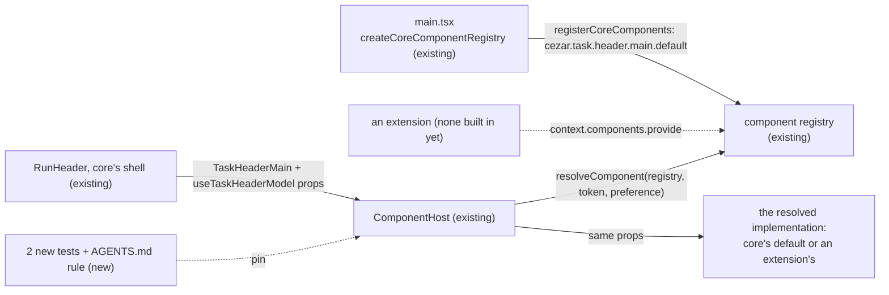

# Core Task Header Registration — core's header part as one registered implementation, with no route to the page but the registry

> Slug: `core-task-header-registration` · Status: **designed. The registration and the hosting are
> on `main` (#37). The proof and the rule await implementation** · Epic 2 (Component Platform), item
> 12: "Register Core Task Header as component implementation". Builds on
> `2026-09-19-task-header-contract.md` (item 11, phase 1 on `main` as #37),
> `2026-09-19-component-host.md`, `2026-09-19-component-resolver.md` and
> `2026-09-19-component-registry.md`. **Starts from `main` at `d298b017` (#37).** Delivery: one PR,
> tests and `AGENTS.md` only. No runtime change.

## 📝 TLDR

The brief asks for three things. Register today's header as `core.task-header`, implementing
`task.header@1`. Render it through `ComponentHost` instead of directly. Leave no special exception
for core's implementation. All three are already on `main`. Item 10's slot (#33) never reached
`main`, so item 11's phase 1 (#37) did item 12's work too. `registerCoreComponents` registers
core's title and meta rows as `cezar.task.header.main.default`, implementing
`cezar.task.header.main@1`. `RunHeader` renders them only through `<ComponentHost>`. Only
`core-components.ts` imports the implementation.

What is missing is proof on the real header that the third point holds, and a rule that keeps it
true. The proposal adds two tests and one `AGENTS.md` rule. The first test shows core's header has
no route to the page without the registry. The second shows an extension's implementation takes
the same box with the same props. The rule separates the differences core's default keeps
because of its **role** (the default and the fallback) from the **bypasses** that are forbidden.
The page does not change.

## Resolved assumptions (autonomous defaults)

The brief left these open. Each answer is the most reversible choice that meets the brief's
Definition of Done. Q1 and Q2 apply owner decisions from earlier items.

| # | Question | Answer | Why | Status |
|---|---|---|---|---|
| Q1 | The brief names `core.task-header` implementing `task.header@1`. On `main`, core's part is `cezar.task.header.main.default` implementing `cezar.task.header.main@1`. Rename? | **No. Keep the repository's ids; the brief's names are illustrative** (the same mapping as item 11's Q2). `core.task-header` → `cezar.task.header.main.default`, and `task.header@1` → `cezar.task.header.main@1`. | Core's default of every contract is registered as `${contract.id}.default` (resolver Q3, confirmed by the owner). Core's ids must start with `cezar.` (`registry.ts`, `CORE_PREFIX`). A second id for the same part would break both rules and add nothing. | follows owner decisions |
| Q2 | "Register the current component": the whole `RunHeader`, or its title and meta rows? | **The title and meta rows**, the part #37 registers. The actions, tabs, monitoring and dispatch lines, step rail and title editor stay in core's shell. | Owner decision in item 10 (component-host Q4b): only the presentational part is replaceable, so no replacement can take a task's controls away. | follows owner decision |
| Q3 | What counts as a "special exception for core implementation"? | **A bypass:** any way core's implementation reaches the page, or gets its input, other than registry → `resolveComponent` → `ComponentHost` with the contract's props. The differences listed under § What core's default keeps are **roles**, and they stay: the default renders when there is no preference, it is every resolution's fallback, and when it throws the page shows the inline notice. Its **provenance** differences also stay: core registers first, its registration lasts for the page, and a misfit throws. | The owner confirmed the fallback role in the resolver spec. Without it, nothing could replace an extension's implementation that throws. A throwing fallback has nothing left to fall back to. A core misfit is a bug for the tests to catch, not drift between versions. | default, reversible |
| Q4 | What is left to build, with #37 on `main`? | **Two tests on the real header and one `AGENTS.md` rule, in one PR.** There is no runtime change, so there is nothing to split. | Every Definition of Done point holds on `main` (§ Problem Statement). Only "no special exception" is inferred rather than tested on the real header: the host's unresolved test uses a fixture contract, and the only test of an extension in `RunHeader` is the throwing one. | default, reversible |
| Q5 | Enforce "nothing outside `component-registry/` branches on whether an implementation is core's" with a static scan? | **No, defer it.** The rule goes into `AGENTS.md`. | A search of `packages/web/src` outside `component-registry/` finds no such branch, except id assertions in tests. `boundary.test.ts` already blocks the import bypass. A scan for id literals or `extensionId === null` would be fragile. Add one when a review finds a branch. | default, reversible |
| Q6 | #38 (item 11's phase 2: the `offers-*` capabilities, the compact example, `external-task-header.test.tsx`) merged into `feat/task-header-contract` 21 s after #37 was squash-merged, so it is not on `main`. Build on it, or re-land it here? | **Neither. This item stands alone on `main`.** Re-landing #38 is a separate recovery and the owner's call. If #38 reaches `main` first, step 2 keeps only the assertions its test does not make: the same props, rename under an extension, and the swap back in the same box. | #38 is unrelated to this item. Bundling a lost 800-line PR into a test-only item would hide it from review. | default, reversible |

## 📝 Problem Statement

The brief's Definition of Done, checked on `main` at `d298b017`:

| Definition of Done | On `main` since #37 | Proven by | Gap |
|---|---|---|---|
| The user sees the same UI as before. | The default page renders what #37 shipped. This item changes no runtime code. | #37's [UI QA evidence](https://github.com/DarrenStasiakDev4You/cezar-hackathon-ale-patryk-nazywa-go-brutusem/pull/37#issuecomment-5743982353) (PASS: "the task header renders through the component host as core's default") | none |
| Core's header goes through the Component Registry. | `main.tsx` builds the page's registry with `createCoreComponentRegistry()`, whose `registerCoreComponents` registers `cezar.task.header.main.default`. `RunHeader` renders `<ComponentHost contract={TaskHeaderMain} subject={run.id} props={props} />`. | `core-components.test.ts` (the gate: `missingCoreDefaults` is `[]`, and `['cezar.task.header.main']` without the registration), `run-header.test.tsx` and `task-thread.test.tsx` (`data-component="cezar.task.header.main.default"`) | Nothing shows that the real header has **no other** route: that without the registration, the title and meta rows are gone. |
| No special exception exists for core's implementation. | `core-components.ts` is the only non-test module that imports `CoreTaskHeaderMain`. The resolver finds core's default among the registry's candidates by id. The host renders whichever implementation it resolves, with the same props. No production module outside `component-registry/` branches on core's identity. | `component-registry/boundary.test.ts` (the import scan), `component-host.test.tsx` and `resolve.test.ts` (on fixture contracts), and the throwing-extension test in `task-thread.test.tsx` | No test on the real header shows a **working** extension implementation in core's place, with the same props and the shell's rename. No rule names which differences are allowed. On the production page nothing sets a preference yet (`app.tsx` passes no `preferenceOf`, so the provider's `NO_PREFERENCE` applies). The store and the picker are a later item (resolver Q2), so today an extension takes core's place only in tests. |

## 📝 Proposed Solution

1. **No route without the registry** (test). `ThreadView` under a `ComponentsProvider` whose
   registry serves `CORE_COMPONENT_CONTRACTS` without `registerCoreComponents` shows no title and
   no meta row. The host's box reads `unresolved`, and the shell's actions and tabs still render.
   A compatible extension implementation does not take core's empty box, even when it is
   preferred.
2. **One box, one set of props, any implementation** (test). With a working fixture extension
   implementation preferred, the same host box renders it in place of core's rows. The
   implementation receives the frozen model and core's status words, and its `onRename()` opens
   core's title editor over it. When the preference is cleared, core's default returns in the same
   box, and the shell does not remount.
3. **The rule** (`AGENTS.md`, the "Component implementations" row). It adds a vocabulary for
   reviewing the next slot, not the facts the row already records. Core's implementation may
   differ from an extension's by its **role** (the default and the fallback) or its **provenance**
   (it registers first, lasts for the page, and a misfit throws). It may never differ by a
   **bypass**: a route to the page, or an input, other than the registry, `ComponentHost` and the
   contract's props. The rule also closes the hand-kept list: each core implementation joins
   `CORE_IMPLEMENTATIONS` in the PR that registers it.

### What core's default keeps, and why

Every difference in how core's implementation is treated on `main`, from a read of
`packages/web/src`:

| Difference | Where | Kind | Stays because |
|---|---|---|---|
| With no usable preference, core's default renders. | `resolve.ts`, steps 3–7 (no choice, or one set aside as invalid, not found, another contract's or incompatible) | role | Providing never selects (resolver spec, confirmed by the owner). |
| Core's default is every resolution's `fallback`, found by `coreDefaultComponentId`. | `resolve.ts`, step 2 | role | Something must replace an extension that throws. The id rule is resolver Q3 (owner). |
| No core default means `unresolved`: an empty box, never an extension. | `resolve.ts`, `component-host.tsx` step 3 | role | A missing default is a core bug, and the gate test catches it. |
| An extension that throws is set aside with a toast. A throwing fallback shows "This part of the page could not be displayed." with **Try again**, and logs one line without a toast. | `component-host.tsx` steps 6–7, `provider.tsx` (`reportCoreFailure`) | role | The fallback is the end of the chain. A core implementation that is **not** the default (none exists yet) is set aside like an extension's, because the host decides by `current === fallback`, not by provenance. |
| Core's `register` throws on a misfit. An extension's misfit is recorded as `compatible: false`. | `registry.ts` | provenance | A core misfit is a bug for the tests. An extension's is version drift. |
| Core's ids must start with `cezar.`, and an extension's with `${extensionId}.`, which may also start with `cezar.`. Core registers first, so it keeps its ids: an extension whose id is `cezar.task` cannot take `cezar.task.header.main.default`. | `registry.ts` (`CORE_PREFIX`, `forExtension`), `main.tsx` (the registry is built before `startExtensionHost`) | provenance | Both sides follow one namespace rule. The order is what makes core's ids its own (`core-components.test.ts`, "keeps core's id"). |
| An extension's registration lives only as long as its activation (`scope.assertLive`, `scope.track`). Core's lasts for the page. | `registry.ts` | provenance | Core is not an extension. Its registration has no activation to end. |
| Core's default is imported by no module except `core-components.ts` (tests aside). | `component-registry/boundary.ts` and `boundary.test.ts` | guard | This guard forbids the route half of a bypass. Its list, `CORE_IMPLEMENTATIONS`, is kept by hand, so each new core implementation joins it in the PR that registers it (step 3's rule). |
| Core's default renders from its props alone. | `core-task-header-boundary.test.ts` (an import scan of core's header), `core-task-header-main.test.tsx` (a render with no providers) | guard | This guard forbids the input half of a bypass: a core-only context would feed core's part something an extension's cannot get. |
| Core's default loads with the first paint, and the build checks its imports. | `vite.config.ts` (`entryChunkGuard`) | build | A bundle-size guard. It does not change what renders. |

None of these is a bypass. Each one either routes through the registry or guards it.

### Alternatives considered

- **Rename core's implementation to `core.task-header`** (Q1). Rejected. It breaks
  `${contract.id}.default` and the `cezar.` prefix. Nothing is persisted, so a rename would be cheap,
  but it would gain nothing.
- **Register the whole `RunHeader`** (Q2). Rejected by the owner in item 10 (Q4b).
- **Drop the fallback role, so core's default is resolved exactly like an extension's.** Rejected
  (Q3). An extension that throws would leave an empty box, and "Providing never selects" would
  need another way to pick what renders without a preference.
- **Close item 12 with no PR.** Rejected. The third Definition of Done point would stay
  inferred, and nothing would stop the next slot from adding a bypass.
- **A static scan for core-identity branches** (Q5). Deferred.
- **Re-land #38 here** (Q6). Rejected. It is a separate recovery.

## 📝 Architecture

Every implementation reaches the page along one route, core's included. This item adds only the
tests and the rule that pin that route.

- **Changed:** `packages/web/src/routes/task-thread/task-thread.test.tsx` (two tests in the
  existing describe "ThreadView — the header's replaceable main part") and `AGENTS.md` (one
  sentence in the "Component implementations" row).
- **Not touched:** every runtime module, the extension API, the HTTP contract and
  `BACKWARD_COMPATIBILITY.md` surfaces. Nothing is persisted, and no API contract changes.

## 📝 UI/UX

**No change.** The page renders what #37 shipped, and #37's QA evidence (linked above) shows it,
at desktop and phone widths. This item proposes no UI, so it has no mockups.

## 📝 Edge Cases & Failure Scenarios

- **Core's default is not registered** (a future slot forgets it). The part's box is empty
  (`data-state="unresolved"`), one `[cezar:extensions]` line is logged, and the shell's actions,
  tabs, thread and composer keep working. Step 1 pins this on the real header. The gate test still
  fails first.
- **An extension implementation is provided and preferred, but core's default is missing.** The
  box stays empty, because the resolver answers `unresolved` before it reads the preference
  (`resolve.ts`, step 2). An extension never fills a box core left empty, and step 1 asserts this.
- **A preferred extension implementation calls `onRename()`.** Core's title editor opens over the
  box, as it does for core's default. Step 2 pins this, so a saved draft never gets stranded under
  a replacement.
- **The preference is cleared while a task is open.** Core's default returns in the same box, and
  the shell is not remounted. Step 2 asserts the same `[data-slot="task-header-main"]` element
  before and after.
- **#38 re-lands on `main` before this PR.** `external-task-header.test.tsx` then covers "an
  extension in core's place" with the `offers-*` capabilities. Step 2 keeps its other assertions,
  and the implementer drops any it duplicates.

## 📝 Risks & Impact Review

- **Low.** Only tests and one documentation sentence change. Rollback is a revert.
- **The rule is prose until a scan exists** (Q5). A reviewer enforces it. Its value is the
  vocabulary: role, provenance and bypass, so the next slot's review can name which one it sees.
- **Test coupling.** Both tests build their own provider tree, as the throwing-extension test
  does, and stub `console.error` where the host logs. They assert `data-*` hooks that the host
  already publishes (`data-contract`, `data-component`, `data-state`) and no private hook.

## 📋 Phasing

1. **One phase, one PR:** the two tests and the rule. The spec PR (this one) is design-only.

## 📋 Implementation Plan

Every step keeps the validation gate in `.ai/agentic.config.json` green: typecheck, `npm test`,
`test:unit`, `build` and `test:package`. Extract the render tree of the existing test "shows
core's title row when a chosen extension header throws" (`task-thread.test.tsx`) into a local
helper that takes `{ registry, preferenceOf, onImplementationError? }`. The existing test passes
its `onImplementationError` and keeps its assertions, and both new tests use the helper. It
creates its query client once and returns `rerender`, so step 2's switch keeps one client and one
tree.

Both new tests pass on `main` as it is, because they guard behavior rather than fix it. So each
must be shown to fail (AGENTS.md, "Prove the regression test fails without the fix"): make a
temporary source edit, run the test, see it red, and revert the edit. Do not use `git stash`,
because the stash stack is shared across worktrees. Record the red runs in the PR.

1. **No route without the registry** (`task-thread.test.tsx`).
   *Tests:*
   - with `createComponentRegistry({ contracts: CORE_COMPONENT_CONTRACTS, onDiagnostic: () => {} })`
     and no `registerCoreComponents`, `ThreadView` for a waiting run renders
     `[data-slot="run-header"] [data-slot="component-host"]` with `data-state="unresolved"`, no
     `data-component`, no `h1` and no `[data-slot="run-meta"]`;
   - `[data-slot="run-actions"]` still contains Notes and `[data-slot="run-tabs"]` still contains
     Changes;
   - the `console.error` lines that start with `[cezar:extensions]` (filtered as `extensionLines`
     does in `component-host.test.tsx`) are exactly
     `['[cezar:extensions] cezar.task.header.main has no core default: nothing renders in its host']`;
   - the same, with a compatible `acme.plain.task-header` provided through
     `forExtension(fakeScope('acme.plain').scope)` **and preferred**: the box is still
     `unresolved`, and the fixture never renders.
   *Shown to fail:* a temporary `<h1>{props.task.title}</h1>` beside the host in `RunHeader`, which
   is a bypass, turns the first case red.
2. **One box, one set of props, any implementation** (`task-thread.test.tsx`).
   A fixture `PlainHeader` (`capabilities: ['shows-title', 'shows-status']`) records the props it
   receives, renders `task.title · attention.label` and has a Rename button that calls
   `props.onRename`.
   *Tests:*
   - with `createCoreComponentRegistry()` and a preference for `acme.plain.task-header`, the box has
     `data-component="acme.plain.task-header"`, `data-state="resolved"` and no core `h1`, and
     shows the run's title and the status words core's pill shows for it;
   - the recorded props are frozen (`Object.isFrozen(props.task)`, `Object.isFrozen(props.actions)`),
     and `props.task.taskId` is the run's id;
   - its Rename button opens `[data-slot="title-editor"]`, and `[data-slot="task-header-main"]`
     becomes `inert`;
   - re-rendered with a new `preferenceOf` that returns `null`, the box shows
     `cezar.task.header.main.default` with the core `h1`, inside the **same**
     `[data-slot="task-header-main"]` element (`toBe`) as before the switch.
   *Shown to fail:* a temporary edit that makes `ComponentHost` resolve with no preference turns
   the first case red.
3. **The rule** (`AGENTS.md`, the "Component implementations" row, after "Core's implementation
   of a replaceable part is imported only by `core-components.ts`"): *"Core's implementation of a
   contract may differ from an extension's by its role (the default and the fallback) or its
   provenance (it registers first, lasts for the page, and a misfit throws), never by a bypass: a
   route to the page, or an input, other than the registry, `ComponentHost` and the contract's
   props (spec `2026-09-19-core-task-header-registration`, § What core's default keeps). No code
   outside `component-registry/` branches on whether an implementation is core's. Each core
   implementation joins `CORE_IMPLEMENTATIONS` (`component-registry/boundary.ts`) in the PR that
   registers it."*
