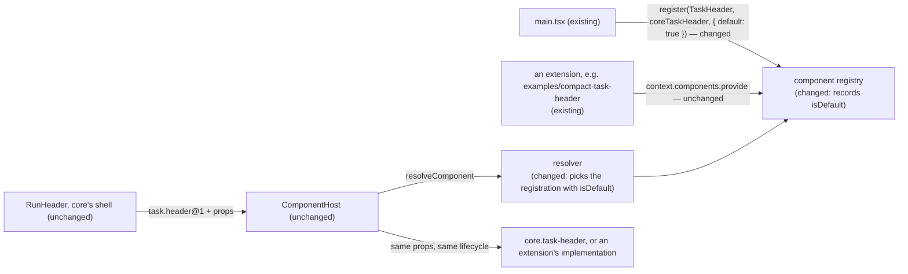

# Core Task Header Registration — `task.header@1` and `core.task-header`, with the default declared instead of inferred

> Slug: `core-task-header-registration` · Status: **designed, awaiting implementation** · Epic 2
> (Component Platform), item 12: "Register Core Task Header as component implementation". Builds on
> `2026-09-19-task-header-contract.md` (items 11–12's code, on `main` as #37 and #49),
> `2026-09-19-component-host.md`, `2026-09-19-component-resolver.md` and
> `2026-09-19-component-registry.md`. **Starts from `main` at `33a64fea`.** Delivery: two stacked
> PRs to `main`, touching `packages/extension-api` and `packages/web`.
> *Revised 2026-09-20 after the owner answered Q1, Q3 and Q6 on [PR #42](https://github.com/DarrenStasiakDev4You/cezar-hackathon-ale-patryk-nazywa-go-brutusem/pull/42#issuecomment-5746089939).*

## 📝 TLDR

The brief asks for core's task header to be a registered implementation of a public contract,
rendered through `ComponentHost`, with no special exception for core. #37 and #49 shipped the
registration and the hosting: `RunHeader` renders the part only through the host, and a header from
a separate package already replaces it on the task page.

Two things are still wrong, and the owner named both. **The ids say core where the contract should
be provider-neutral.** The contract is `cezar.task.header.main@1` and core's implementation is
`cezar.task.header.main.default`. They become **`task.header@1`**, a public contract any provider
may implement, and **`core.task-header`**, one implementation of it. **And the runtime still infers
which implementation is core's.** The resolver finds the fallback by looking for a registration
with no extension whose id is the contract's id plus `.default`. That is the host asking "is this
core?", which the brief forbids. It becomes a declared property: core registers its implementation
as the contract's default, the registry records that, and the resolver picks the registration that
says so. Nothing on the page changes.

## Resolved assumptions (autonomous defaults)

The owner answered Q1, Q3 and Q6 on PR #42 on 2026-09-19, and those rows record the decisions. Q2
follows item 10's owner decision. The rest are autonomous defaults, reversible before
implementation starts.

| # | Question | Answer | Why | Status |
|---|---|---|---|---|
| Q1 | The brief names `core.task-header` implementing `task.header@1`. `main` has `cezar.task.header.main.default` implementing `cezar.task.header.main@1`. Rename? | **Yes, both, and keep the two apart.** The contract is **`task.header@1`**: public, stable, implementable by any provider. Core's implementation is **`core.task-header`**: one implementation among others. The contract's id no longer contains `cezar`, `main` or anything from core's React tree. | The owner: "`task.header@1` oznacza publiczny kontrakt, który może implementować dowolny provider. `core.task-header` to tylko jedna z implementacji tego kontraktu", and the public contract must not be tied to `RunHeader`, an implementation name that may split or disappear. | ✅ owner, 2026-09-19 |
| Q2 | Which component is registered: the whole `RunHeader`, or its title and meta rows? | **The title and meta rows**, as #37 registers them. The actions, tabs, monitoring and dispatch lines, step rail and title editor stay in core's shell. | Owner decision in item 10 (component-host Q4b): no replacement may take a task's controls away. | ✅ owner, 2026-09-19 (item 10) |
| Q3 | What counts as a "special exception for core"? | **Host code may never ask "is this core?" in order to change what the system does.** One contract, one lifecycle, one render path and one capability check, whatever the resolver picks. A default and a fallback are allowed, but only as **a declared property of the registry**, never as a hand-written exception or an id convention. | The owner's own words and examples: `if (component.id === 'core.task-header')`, `if (provider.extensionId === 'core')` and `catch { return <RunHeader /> }` are all wrong; "resolver asks for default implementation" is right. | ✅ owner, 2026-09-19 |
| Q3a | Where is "this is the default" declared: on the contract token, or in the registry? | **In the registry.** `register(contract, implementation, { default: true })` records `isDefault` on the registration, and the resolver picks the registration that carries it. The public token names no implementation. | The owner offered `defineComponentContract({ …, defaultImplementation: 'core.task-header' })` and then said the registry knowing is better. It is: the token lives in the public package and the implementation lives in the cockpit, so naming one inside the other would re-create the coupling Q1 removes. A flag also lets core register a second, non-default implementation later, which the resolver spec (Q3) already anticipated. | default, reversible |
| Q4 | What is left to build? | **Two stacked PRs.** Phase 1 makes the default a declared property and removes every inference about core from the resolver. Phase 2 renames the two ids and pins the rule. | Phase 1 changes behavior nowhere and can ship alone. The rename is mechanical but wide, so it should not hide a semantic change in its diff. | default, reversible |
| Q5 | Enforce "no code outside `component-registry/` branches on whether an implementation is core's" with a static scan? | **No, defer it.** The rule goes into `AGENTS.md`, and phase 1 removes the last branch that exists. | After phase 1 there is nothing left to catch: the resolver reads a flag, and no other module reads `extensionId`. A scan for id literals or `extensionId === null` would be fragile. Add one when a review finds a branch. | default, reversible |
| Q6 | #38 (the `offers-*` capabilities and the compact example) merged into a dead branch. Build on it, or re-land it? | **Neither — it is on `main` already**, re-landed as #49. This item starts from `main` at `33a64fea`, with the example header and `useHostedComponent` in place. | The owner re-landed it: "I already merged changes from 38 to main". | ✅ owner, 2026-09-19 |
| Q7 | Do the TypeScript exports follow the ids? | **Yes, for the public ones**: `TaskHeaderMain` → `TaskHeader`, `TaskHeaderMainProps` → `TaskHeaderProps`, `CoreTaskHeaderMain` → `CoreTaskHeader` (file `core-task-header.tsx`). The cockpit's own adapter keeps its name, in `task-header-model.ts`. | Leaving `Main` on the exports would keep the naming the owner rejected in the one place extension authors read. The renames are mechanical, and the compiler finds every site. | default, reversible |
| Q8 | Do the other core ids follow: the contracts the newer specs name, and core's commands and events (`cezar.task.continue`, `cezar.task.*`)? | **Contracts yes, commands and events no.** A contract that is not implemented yet is born under the new scheme: item 13's becomes `task.metadata@1` with `core.task-metadata`. `AGENTS.md` records the rule. Commands and events keep `cezar.*`, and this item does not touch them. | A component contract is the only one of the three that a third party implements, which is the owner's reason for a provider-neutral id. Renaming the command and event namespaces would be a much wider change with no brief behind it. Merged spec documents keep their text: they record what was decided then, and `AGENTS.md` carries the current rule. | default, reversible |
| Q9 | Reserve the `core.` prefix so no extension can register under it? | **No, defer it.** | An extension id is exactly two segments, and an extension may only register ids under `${extensionId}.`, so no extension can take `core.task-header` itself. Core also registers before the extension host starts, and a taken id throws. The residue is an extension named `core.<something>` registering under its own name, which is honest. | default, reversible |

## 📝 Problem Statement

The brief's Definition of Done, checked on `main` at `33a64fea`:

| Definition of Done | Where it stands | Evidence |
|---|---|---|
| The user sees the same UI as before. | Met, and this item keeps it: no rendered output changes. | #37's [UI QA evidence](https://github.com/DarrenStasiakDev4You/cezar-hackathon-ale-patryk-nazywa-go-brutusem/pull/37#issuecomment-5743982353) (PASS) |
| Core's header goes through the Component Registry. | Met. `main.tsx` builds the registry with `createCoreComponentRegistry()`, `registerCoreComponents` registers core's part, and `RunHeader` renders it only through `<ComponentHost>`. A header from a separate package already takes its place on the task page. | `core-components.test.ts`, `run-header.test.tsx`, `external-task-header.test.tsx` |
| No special exception exists for core's implementation. | **Not met, twice.** The ids name core where the contract should be neutral (Q1). And `resolveComponent` infers the fallback: it looks for a candidate with `extensionId === null` whose `componentId` is `coreDefaultComponentId(contractId)`. That is the host asking "is this core?" to decide what renders — the case the owner rules out. | `resolve.ts` (step 2), `core-components.ts`, `component-host.tsx` |

Two further consequences of the inference, both invisible today:

- **The id convention is load-bearing.** `${contract.id}.default` is how the runtime finds the
  fallback, so core cannot name its implementation anything else — which is exactly why the brief's
  `core.task-header` does not fit today.
- **Core cannot register a second implementation** of one contract without the resolver treating
  the `.default`-named one as privileged by name rather than by intent.

## 📝 Proposed Solution

### Phase 1 — the default is declared, not inferred

1. **The registry records it.** `register(contract, implementation, options?)` takes
   `{ default?: boolean }` and records `isDefault` on the registration. Exactly one default per
   contract id: a second throws `invalid-input`, like core's other mistakes. `forExtension(scope).provide`
   keeps its signature, so an extension can never declare itself the default.
2. **The resolver reads it.** Step 2 becomes "the candidate whose `isDefault` is `true`", with no
   id arithmetic and no `extensionId` check. `coreDefaultComponentId` is deleted, and
   `missingCoreDefaults` becomes `missingDefaults`: the served contracts with no default
   implementation. Everything else about resolving is unchanged, including "providing never
   selects" and "the result always carries the default as `fallback`".
3. **Nothing else moves.** `registerCoreComponents` passes `{ default: true }`. The host, the
   provider, the shell and the page are untouched, and every existing test keeps passing.

### Phase 2 — the two ids, and the rule

4. **The contract becomes `task.header@1`** (`packages/extension-api/src/core-components.ts`), with
   its exports renamed per Q7. Its version stays `1`: the id it had is disappearing, not changing
   meaning, and nothing outside this repository implements it (the package is private and
   `BUILTIN_EXTENSIONS` is empty).
5. **Core's implementation becomes `core.task-header`.** `CORE_PREFIX` in `registry.ts` becomes
   `core.`, so core's ids live in their own namespace rather than in the product's.
6. **The rule** (`AGENTS.md`, the "Component implementations" row) records the owner's criterion,
   the naming scheme and its reach: a component contract is provider-neutral (`task.header@1`),
   core's implementations are `core.*`, core's commands and events stay `cezar.*` (Q8), and no code
   may branch on whether an implementation is core's in order to change what the system does. The
   README's "Replacing a component" section follows.
7. **Two guard tests** keep both true (§ Implementation Plan, steps 3 and 6).

### What still differs between core's implementation and an extension's, afterwards

| Difference | Where | Kind | Stays because |
|---|---|---|---|
| The default renders when there is no usable preference, and is every resolution's `fallback`. | `resolve.ts` | **declared role** | The owner allows a default and a fallback as a property of the registry. After phase 1 it is a flag on the registration, not core's name. |
| A contract with no default implementation resolves to `unresolved`: an empty box, never an extension. | `resolve.ts`, `component-host.tsx` | declared role | A served contract without a default is a core bug, and the gate test catches it. |
| The host reports a failed implementation differently once the failed one **is** the default: an inline notice instead of a toast and a swap. | `component-host.tsx`, `provider.tsx` (`reportDefaultFailure` after step 2) | declared role | The fallback is the end of the chain, so there is nothing to swap in. It asks `current === fallback`, never whether the registration is core's. |
| Core's `register` throws on a misfit; an extension's `provide` records `compatible: false`. | `registry.ts` | provenance | A core misfit is a bug for the tests. An extension's is version drift between two released versions. |
| Core registers under `core.`, an extension under `${extensionId}.`, and core registers first. | `registry.ts`, `main.tsx` | provenance | One namespace rule for both sides; the order is what keeps core's ids its own. |
| An extension's registration lives only as long as its activation (`scope.assertLive`, `scope.track`); core's lasts for the page. | `registry.ts` | provenance | Core is not an extension: its registration has no activation to end. |
| Core's implementation is imported by no module but `core-components.ts`, and renders from its props alone. | `component-registry/boundary.ts`, `core-task-header-boundary.test.ts`, `core-task-header.test.tsx` | guards | These forbid the two halves of a bypass: a second route to the page, and an input an extension could not get. Their hand-kept list (`CORE_IMPLEMENTATIONS`) gains each new core implementation in the PR that registers it. |

None of these asks whether an implementation is core's in order to change the render path.

### Alternatives considered

- **`defineComponentContract({ …, defaultImplementation: 'core.task-header' })`** (Q3a), the
  owner's first option. Not chosen: it puts a cockpit implementation id into the public token, the
  coupling Q1 removes, and the token would have to name an implementation that may not be
  registered at all.
- **"The builtin registration is the default"** — the registry marking every `register` call's
  result as the default. Rejected: that is provenance again (`extensionId === null`) under a new
  name, and it blocks core from registering a second implementation.
- **Keep `cezar.task.header.main@1` and only rename the implementation.** Rejected by the owner
  (Q1): the contract is the public half, and it is the one that must be provider-neutral.
- **Bump to `task.header@2`.** Rejected: nothing outside the repository implements `@1`, and the
  old id is being withdrawn, not redefined. A new major would imply both ids exist.
- **One PR for the whole item.** Rejected: a 20-file rename would hide the resolver change in its
  diff.
- **Rename core's commands and events to `core.*` as well** (Q8). Rejected: no brief asks for it,
  and they are not implemented by third parties.

## 📝 Architecture



The registry gains one recorded fact, and the resolver stops deriving that fact from core's name.
Everything downstream is unchanged.

- **Changed in `packages/web/src/component-registry/`:** `registry.ts` (the `register` option,
  `isDefault` on the registration, `CORE_PREFIX`), `resolve.ts` (step 2, `missingDefaults`,
  `coreDefaultComponentId` deleted), `core-components.ts` (`{ default: true }`, the new ids),
  `core-contracts.ts` and `boundary.ts` (the renamed module path).
- **Changed in `packages/extension-api`:** `src/core-components.ts` (the contract id and the
  renamed exports), `src/index.ts`, `README.md`, `examples/compact-task-header/index.ts` and the
  tests that name the token.
- **Changed in `packages/web/src/routes/task-thread/`:** `core-task-header-main.tsx` →
  `core-task-header.tsx`, `task-header-main.ts` → `task-header-model.ts`, `run-header.tsx` and the
  tests that name the token or the component id.
- **Changed at the root:** `AGENTS.md` (the naming scheme and the rule).
- **Not touched:** the host, the provider, the shell's layout, the model's fields, the commands,
  the events, the HTTP contract and every `BACKWARD_COMPATIBILITY.md` surface. The extension API is
  private and experimental, and its version is bumped by hand in the release PR as usual.

## 📝 API Contracts

Signatures are normative; only the changed parts are shown.

```ts
// packages/web/src/component-registry/registry.ts
export interface CoreRegistrationOptions {
  /** This implementation is the contract's default: it renders when there is no usable
   *  preference, and it is every resolution's fallback. Exactly one per contract id — a second
   *  throws `invalid-input`. Only core registers one; `provide` has no such option. */
  readonly default?: boolean
}

register<P>(
  contract: ComponentContract<P>,
  implementation: ComponentImplementation<NoInfer<P>>,
  options?: CoreRegistrationOptions,
): Disposable

export interface ComponentRegistration {
  // … as today, plus:
  /** The contract's default implementation (see `register`). Always `false` for an extension's. */
  readonly isDefault: boolean
}

// packages/web/src/component-registry/resolve.ts
/** The served contracts with no default implementation, in catalog order. `[]` when every one has
 *  its default. Replaces `missingCoreDefaults`; `coreDefaultComponentId` is gone. */
export function missingDefaults(
  registry: ResolverRegistry,
  contracts: readonly AnyComponentContract[],
): readonly ContributionId[]

// packages/extension-api/src/core-components.ts
export const TaskHeader = defineComponentContract<TaskHeaderProps>('task.header', {
  version: 1,
  requiredCapabilities: ['shows-title', 'shows-status'],
  optionalCapabilities: ['shows-meta', 'offers-continue', 'offers-stop', 'offers-archive'],
  layout: { minBlockSize: 30 },
})
```

Core's registration becomes `{ id: 'core.task-header', title: 'Task header', … }`, registered with
`{ default: true }`. The props, the capabilities, the intents and the layout are unchanged from
`2026-09-19-task-header-contract.md`.

## 📝 UI/UX

**No change.** The task page renders exactly what it renders today, in the same box, with the same
props. The only user-visible strings that move are internal ids in `data-component` attributes,
which no screen shows. There are no mockups: nothing on the page changes.

## 📝 Edge Cases & Failure Scenarios

- **Core registers two defaults for one contract.** The second `register` throws `invalid-input`
  naming the contract, like every other core mistake, so a test catches it rather than the page.
- **Core registers no default for a served contract.** `missingDefaults` reports it, the gate test
  fails, and at run time the part's box is empty (`unresolved`) — never an extension's
  implementation, even a preferred one, because the resolver answers before it reads the
  preference.
- **Core registers a second, non-default implementation.** It is a candidate like any other: a
  preference may select it, and it is never the fallback. Nothing in the resolver reads its name.
- **An extension implements `task.header@1` under an id of its own.** Unchanged: it is compatible
  or not by `checkComponentCompatibility`, and preferred or not by the resolver. The compact
  example on `main` proves the path end to end.
- **A preference stored under an old id** (`cezar.task.header.main.default`). No preference is
  stored anywhere yet: `app.tsx` passes no `preferenceOf`, and the store and picker are a later
  item. A preference naming an unknown id already resolves to the default with
  `rejected: { reason: 'not-found' }`, so the rename cannot strand a user.
- **An extension registered under `cezar.*`** after `CORE_PREFIX` moves to `core.`. Unchanged for
  extensions: their namespace was always `${extensionId}.`. Only core's own ids move.
- **A merged spec that names the old ids.** Those documents keep their text (Q8). `AGENTS.md`
  carries the current scheme, and item 13's contract is born as `task.metadata@1`.

## 📝 Risks & Impact Review

- **The rename is wide and mechanical.** About 21 code sites name `cezar.task.header.main`, plus
  the README, `AGENTS.md` and the test assertions on `data-component`. The compiler and the tests
  find every one. Phase 2 is a rename only: any behavior change in its diff is a review finding.
- **Two ids leave the repository's `cezar.*` convention.** A public contract id and a core
  implementation id no longer start with `cezar.`, while commands and events still do (Q8). Until
  `AGENTS.md` explains the split, a reader may take it for drift. The rule in step 7 is the
  mitigation.
- **Deleting `coreDefaultComponentId` removes a public-looking helper.** It is internal to
  `packages/web` and used by `core-components.ts` and tests only.
- **The resolver's step 2 is the platform's hinge.** Every host renders what it returns. Its tests
  (`resolve.test.ts`, about 540 lines) are rewritten to register fixtures with `{ default: true }`
  rather than by name, which is the point: after this item a fixture can be called anything.
- **Rollback.** Revert phase 2, then phase 1. Nothing is persisted, no HTTP contract or command
  changes, and the extension API is private, so a revert is a code change only.

## 📋 Phasing

1. **Phase 1 — the declared default** (its own PR, from `main`). The registry records `isDefault`,
   the resolver reads it, and the inference disappears. No id changes, no behavior changes.
2. **Phase 2 — the two ids and the rule** (stacked on phase 1). `task.header@1`,
   `core.task-header`, the renamed exports and files, `AGENTS.md` and the README.

## 📋 Implementation Plan

Every step keeps the validation gate in `.ai/agentic.config.json` green: typecheck, `npm test`,
`test:unit`, `build` and `test:package`.

### Phase 1 — the declared default

1. **The registry records the default** (`registry.ts`). `register` takes
   `options?: CoreRegistrationOptions`, and `registrationOf` records `isDefault` (always `false`
   for `provide`). A second default for one contract id throws `invalid-input` naming the contract
   and the component id. `registerCoreComponents` passes `{ default: true }`.
   *Tests* (`registry.test.ts`):
   - a registration made with `{ default: true }` has `isDefault: true`; without the option, and
     through `provide`, it is `false`;
   - a second `{ default: true }` for the same contract throws `invalid-input`, and the first
     registration still stands;
   - a default for another contract is fine;
   - disposing the default frees its id and lets a later `register` declare a default again.
2. **The resolver reads the flag** (`resolve.ts`). Step 2 picks the candidate with `isDefault`;
   `coreDefaultComponentId` is deleted and `missingCoreDefaults` becomes `missingDefaults`. Update
   its callers (`core-components.test.ts` and any other). The provider's two reports lose "core"
   with it (`provider.tsx`): `reportCoreFailure` becomes `reportDefaultFailure` ("the default
   implementation `<id>` failed while rendering"), and `reportUnresolved` says the contract has no
   default implementation. Both keep the `[cezar:extensions]` prefix, which is the log channel's
   name, not a claim about who registered.
   *Tests* (`resolve.test.ts`, rewritten where it registered by name):
   - a fixture default registered under an id that has nothing to do with the contract's id
     (for example `acme.plain.header` registered by core, or `core.fixture`) still resolves and is
     the `fallback` — the convention is gone;
   - a core registration that is **not** the default never becomes the `fallback`, and is selected
     only by preference;
   - with no default registered, the contract is `unresolved`, even with a compatible preferred
     extension implementation;
   - `missingDefaults` is `[]` for the catalog `main.tsx` builds, and names the contract when the
     registration is removed;
   - every existing behavior of steps 3–7 (no preference, invalid, not-found, other-contract,
     incompatible) is unchanged.
   *Shown to fail:* registering the fixture default under `${contract.id}.default` again makes the
   first test pass for the wrong reason, so assert an id that cannot match the old convention.
3. **The page's own guard** (`task-thread.test.tsx`, in the existing describe "ThreadView — the
   header's replaceable main part").
   *Tests:*
   - with a registry built from `CORE_COMPONENT_CONTRACTS` and no core registration, `ThreadView`
     renders `[data-slot="run-header"] [data-slot="component-host"]` with `data-state="unresolved"`,
     no `data-component`, no `h1` and no `[data-slot="run-meta"]`, while `[data-slot="run-actions"]`
     still contains Notes and `[data-slot="run-tabs"]` still contains Changes;
   - the `console.error` lines starting with `[cezar:extensions]` are exactly the one the provider
     writes for a contract with no default (filtered as `extensionLines` does in
     `component-host.test.tsx`);
   - the same with a compatible extension implementation provided **and preferred**: the box stays
     `unresolved` and the fixture never renders.
   *Shown to fail:* a temporary `<h1>{props.task.title}</h1>` beside the host in `RunHeader` — a
   bypass — turns the first case red. Revert it afterwards; do not use `git stash`, because the
   stash stack is shared across worktrees.
4. **`AGENTS.md`**: the "Component implementations" row learns that a contract's default is
   declared at registration (`register(…, { default: true })`, one per contract) and that
   `resolveComponent` reads that flag, with `coreDefaultComponentId` gone.

### Phase 2 — the two ids and the rule

5. **The contract is renamed** (`packages/extension-api/src/core-components.ts`, `src/index.ts`,
   `README.md`, `examples/compact-task-header/index.ts`, `test/surface.test.ts`,
   `test/core-components.test.ts`, `test/compact-task-header.test.ts`): id `task.header`, exports
   `TaskHeader` and `TaskHeaderProps` (Q7). Then the cockpit side: `core-contracts.ts`,
   `core-components.ts` (`id: 'core.task-header'`), `CORE_PREFIX = 'core.'` in `registry.ts`,
   `core-task-header-main.tsx` → `core-task-header.tsx`, `task-header-main.ts` →
   `task-header-model.ts`, `component-registry/boundary.ts`'s `CORE_IMPLEMENTATIONS`,
   `core-task-header-boundary.test.ts`'s forbidden-module list, `run-header.tsx`, and every test
   that names the old token or component id.
   *Tests:*
   - the token equals `{ kind: 'component', id: 'task.header', version: 1, … }` with today's
     capabilities and layout, and is frozen;
   - `test/surface.test.ts` lists `TaskHeader`;
   - core's registration is `core.task-header`, is the default, and fits the contract with
     `['shows-title', 'shows-status', 'shows-meta']`;
   - `register` with an id outside `core.` throws `namespace-violation`, and the message names the
     `core.` prefix;
   - the page's box reads `data-contract="task.header"` and `data-component="core.task-header"`
     (`run-header.test.tsx`, `task-thread.test.tsx`);
   - `external-task-header.test.tsx` and `compact-task-header.test.ts` pass with the renamed token,
     proving a separate package still implements the contract end to end;
   - no source file outside the spec documents mentions `cezar.task.header.main` (a grep assertion
     in the extension-api boundary test, or a review check).
6. **The rule** (`AGENTS.md`, the "Component implementations" row, after "Core's implementation of
   a replaceable part is imported only by `core-components.ts`"): *"A component contract is public
   and provider-neutral: `task.header@1`, never `cezar.*` — any provider may implement it. Core's
   own implementations live under `core.*` (`core.task-header`), and core's commands and events
   keep `cezar.*`. Host code may never ask whether an implementation is core's in order to change
   what the system does: one contract, one lifecycle, one render path and one capability check for
   every implementation. A default and a fallback are allowed only as a declared property — the
   registration made with `{ default: true }`, which `resolveComponent` reads — never an id
   convention or a hand-written exception (spec
   `2026-09-19-core-task-header-registration.md`)."* The README's "Replacing a component" section
   gains the same naming scheme.
   *Tests:* none of its own; steps 3 and 5 are its enforcement.
