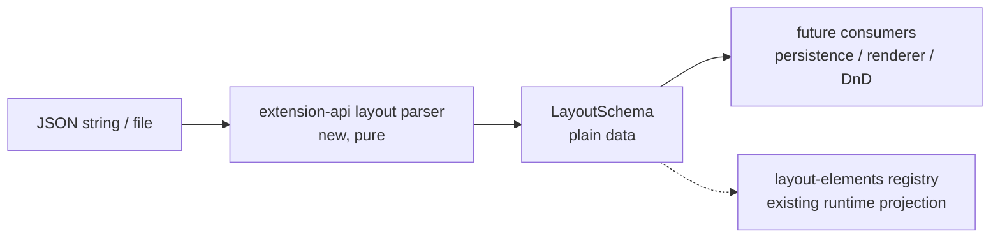

# Create Layout Schema

## 📝 TLDR

Obecny układ replaceable components jest wybierany przez strukturę JSX. To utrudnia zapis
układu, zmianę kolejności i późniejsze przełączanie implementacji component contracts bez
przepisywania drzewa React.

Proponujemy wersjonowany, serializowalny model `LayoutSchema`, w którym strona ma nazwę,
wersję schematu, named zones oraz ordered placements. Placement opisuje rolę przez contract i jego
wersję, a nie konkretną implementację; może też zawierać wyłącznie jawnie opisane dane layoutu.
Nie przechowuje `ReactNode`, `ComponentType`, callbacków, DOM references ani runtime props.
Implementacja dostarczy model `Zone`/`Placement`, walidację, JSON round-trip i domyślny opis Task
Page jako danych. Persystencja, renderer, DnD i wybór implementacji pozostają poza tym ticketem.

## 📝 Problem Statement

Component Platform ma już rozdzielone contract, registry, resolver i host:

- `packages/extension-api` opisuje contract wraz z `id` i `version`;
- `packages/web/src/component-registry/` przechowuje implementacje (`TaskHeaderMain` i
  `TaskComposer`) oraz wybiera preferowaną implementację z core fallbackiem;
- `ComponentHost` renderuje wybraną implementację i używa contract layout hints, ale to przyszły
  konsument Layout Schema, nie część tego modelu;
- `packages/web/src/lib/layout-elements.ts` opisuje bieżące elementy edytowalnego layoutu,
  ale jest rejestrem runtime drzewa DOM, a nie źródłem prawdy, które można zapisać jako JSON.

Brakuje warstwy pomiędzy tymi kontraktami a JSX: danych określających, jakie placementy należą
do której strefy strony i w jakiej kolejności występują. Bez tej warstwy struktura layoutu pozostaje
zakodowana w render function, a późniejszy resolver nie ma stabilnego wejścia opisującego rolę.

## 📝 Proposed Solution

Wprowadzić framework-neutralny model danych w `packages/extension-api`:

```ts
type LayoutPlacementLayout = {
  collapsed?: boolean
  density?: 'comfortable' | 'compact'
  width?: 'auto' | 'small' | 'medium' | 'large'
}

type LayoutPlacement = {
  id: string
  contract: string
  contractVersion: number
  layout?: LayoutPlacementLayout
}

type LayoutZone = LayoutPlacement[]

type LayoutSchema = {
  page: string
  schemaVersion: 1
  zones: Record<string, LayoutZone>
}
```

Przykładowy zapis:

```json
{
  "page": "task",
  "schemaVersion": 1,
  "zones": {
    "header": [
      {
        "id": "task-header",
        "contract": "cezar.task.header.main",
        "contractVersion": 1
      }
    ],
    "main": [
      {
        "id": "task-composer",
        "contract": "cezar.task.composer",
        "contractVersion": 1
      }
    ],
    "sidebar": []
  }
}
```

`id` placementu jest stabilną tożsamością elementu layoutu, niezależną od DOM. `contract` i
`contractVersion` opisują rolę, którą host ma później związać z implementacją. Zone wynika z klucza
`zones`, a order z pozycji w tablicy, więc v1 nie duplikuje tych wartości w placement.

Brak pola `implementation` w v1 jest celowy: jego nieobecność oznacza, że przyszły resolver użyje
globalnej preferencji lub core defaultu. Opcjonalny override implementation może być dodany
addytywnie w późniejszej wersji schematu, bez wiązania obecnego layoutu z konkretnym extension.

Alternatywa polegająca na przechowywaniu `ComponentType`, arbitralnego `props` albo konkretnego
component id w placementach została odrzucona: wiązałaby layout z Reactem lub implementation
selection. Contract-specific props i component settings pozostają osobnym runtime/storage
bindingiem.

## Resolved assumptions (confirmed by owner feedback)

| # | Question | Applied default | Why | Confirm? |
|---|---|---|---|---|
| Q1 | Czy ten etap obejmuje persystencję, renderer, DnD i resolver? | Tylko struktura modelu, versioning, walidacja, JSON round-trip i default layout jako dane. | To zakres ticketu 20; pozostałe mechanizmy będą osobnymi konsumentami tego kontraktu. | ✅ owner confirmed |
| Q2 | Jak placement ma wskazywać contract/component? | Przede wszystkim `contract: string` i `contractVersion: number`; bez konkretnego implementation w v1. | Layout opisuje rolę, a przyszły Component Resolver wybierze user preference lub core/extension implementation. Przyszły override implementation może wejść addytywnie. | ✅ owner confirmed |
| Q3 | Czy placement może mieć dowolne props/config? | Nie dla React props ani component settings. Dopuszczamy tylko typowane, JSON-safe `layout` (`collapsed`, `density`, `width`); settings implementation pozostają osobno. | Rozdziela gdzie komponent leży od tego, jak działa, bez otwartego rekordu i bez runtime objects. | ✅ owner confirmed |
| Q4 | Gdzie ma mieszkać model? | W node-free i DOM-free `packages/extension-api/src/layout`, re-exportowany przez jedyny entry point `src/index.ts`. | Layout jest publicznym contractem host–extension i może być użyty przez web, testy, backend lub CLI bez importu React/Vite. | ✅ owner confirmed |
| Q5 | Co zawiera domyślny Task Page w v1? | Prosty opis istniejących replaceable boundaries: header w `header`, composer w `main`, pusta `sidebar`; timeline, metadata i transcript pozostają core-owned, dopóki nie dostaną własnych contractów. | Nie tworzymy fikcyjnych core tokens. Strefy i ordered placements są gotowe na późniejsze DnD bez udawania, że v1 renderuje cały ekran. | ✅ owner confirmed |

## 📝 Architecture

### Granice modułów

- `packages/extension-api/src/layout/` — node-free i DOM-free typy `LayoutSchema`, `LayoutZone`,
  `LayoutPlacement`, literal `LAYOUT_SCHEMA_VERSION = 1`, walidacja nieznanego JSON,
  `parseLayoutSchema` i `serializeLayoutSchema`. `packages/extension-api/src/index.ts` pozostaje
  jedynym publicznym entry pointem i tylko re-exportuje ten moduł.
- `packages/web/src/routes/task-thread/task-layout-schema.ts` — niezmienny
  `defaultTaskPageLayout`, zbudowany wyłącznie z plain data i referencji do istniejących
  `TaskHeaderMain` oraz `TaskComposer` contract ids. To core-owned data, nie publiczny model.
- Przyszły renderer/adapter — mapuje placement do catalogu `ComponentContract`, resolvera i
  `ComponentHost`; nie należy do parsera, nie jest częścią ticketu 20 i nie może dopisywać runtime
  objects do modelu.
- `packages/web/src/lib/layout-elements.ts` — pozostaje runtime projection dla edit mode,
  drag-and-drop i DOM lifecycle. Nie staje się formatem pliku.



Najważniejsze rozdzielenie: schema opisuje intent, role i kolejność, a wszystkie mechanizmy
wykonawcze pozostają późniejszymi konsumentami. `LayoutRegistry` nie jest źródłem wire format.

### Wersjonowanie i kompatybilność

`schemaVersion` jest wersją struktury całego dokumentu, nie wersją contractu. Parser v1:

1. akceptuje wyłącznie obiekt JSON z `page`, `schemaVersion === 1` i `zones`;
2. wymaga niepustych identyfikatorów `page`, zone, placement i `contract`;
3. wymaga dodatniej integer `contractVersion`;
4. waliduje wyłącznie typowane pola `layout` (`collapsed`, `density`, `width`);
5. odrzuca duplikaty placement ids w obrębie dokumentu;
6. zwraca błąd opisujący ścieżkę, bez częściowo zmienionego modelu;
7. odrzuca nieobsługiwane `schemaVersion` oraz v1-nieznane pola placementu, takie jak
   `component`, `implementation`, `props` i `componentSettings`.

`serializeLayoutSchema` emituje deterministyczny JSON z pełnym dokumentem. Migracje między
wersjami nie są udawane w v1; gdy powstanie v2, zostanie dodany jawny migrator
`v1 -> v2`, a stare dane pozostaną czytelne. Parser nie sprawdza, czy contract jest zarejestrowany,
czy istnieje extension, ani która implementacja powinna zostać wybrana. Te decyzje są poza zakresem
modelu i należą do przyszłego resolvera.

### Granica przyszłych konsumentów

Ten etap nie zmienia `ComponentRegistry`, `ComponentHost` ani `LayoutRegistry`. Przyszły renderer
może:

- rozwiązać `contract + contractVersion` przez host catalog;
- przekazać rolę do istniejącego resolvera, który zastosuje globalną preferencję lub fallback;
- zbudować props z aktualnego page/task contextu, a nie z JSON;
- zastosować `contract.layout` i zarejestrować wynikowy DOM przez istniejący layout-element
  mechanism.

Żaden z tych kroków nie jest częścią ticketu 20. Model tylko zapewnia stabilne dane wejściowe dla
przyszłych decyzji; nie reaguje na brak extensionu i nie zapisuje zmian z edit mode.

## 📝 Data Model

Wersja 1 ma następujące invariants:

| Field | Shape | Meaning |
|---|---|---|
| `page` | non-empty string | stabilny typ strony, w tym spec przypadku `task` |
| `schemaVersion` | literal `1` | wersja parsera dokumentu |
| `zones` | record of arrays | named zones; default Task Page używa `header`, `main`, `sidebar` |
| `placement.id` | non-empty string, unique | tożsamość placementu dla reorder/edit/persistence |
| `placement.contract` | non-empty string | stabilna rola contractu, bez implementacji |
| `placement.contractVersion` | positive integer | major version roli contractu |
| `placement.layout` | optional typed JSON object | konfiguracja położenia/instancji, nie component settings |

Wszystkie wartości są JSON-safe. Model nie zawiera sekretów, danych taska, tokenów, closure,
funkcji ani referencji do DOM. `componentSettings` nie należy do Layout Schema. `Object.freeze`
może chronić domyślną stałą w runtime, ale nie jest częścią wire format.

`layout` ma tylko te znaczenia w v1:

- `collapsed` — czy placement zaczyna w stanie zwiniętym;
- `density` — semantyczna gęstość prezentacji (`comfortable` albo `compact`);
- `width` — logiczna klasa szerokości (`auto`, `small`, `medium` albo `large`).

To są wskazówki layoutu, nie settings konkretnej implementacji. Dodanie kolejnego pola wymaga
zmiany wersji lub jawnej migracji; parser nie przechowuje otwartego rekordu konfiguracyjnego.

### Domyślny Task Page

`defaultTaskPageLayout` opisuje bieżący minimalny contract-backed układ. `main` jest strefą
strony, w której v1 umieszcza dockowany composer; transcript, plan dock i status hints pozostają
core-owned, a kolejność placementów w strefie nie udaje kolejności tych elementów:

```ts
{
  page: 'task',
  schemaVersion: 1,
  zones: {
    header: [{
      id: 'task-header',
      contract: 'cezar.task.header.main',
      contractVersion: 1,
    }],
    main: [{
      id: 'task-composer',
      contract: 'cezar.task.composer',
      contractVersion: 1,
    }],
    sidebar: [],
  },
}
```

Pusta `sidebar` nie usuwa obecnego layoutu; oznacza tylko, że nie ma jeszcze sidebar placementu.
Transcript, action bar, plan/agent docks i fallback capability controls pozostają poza tym
serializowalnym opisem, dopóki nie otrzymają własnych contractów. Timeline i metadata z przyszłego
layoutu mogą wejść dopiero razem z odpowiednimi contractami i osobnym adapterem.

## 📝 API Contracts

Nie ma nowej trasy HTTP ani endpointu. Model jest publicznym, node-free i DOM-free exportem
`@open-mercato/cezar-extension-api`, re-exportowanym wyłącznie z `packages/extension-api/src/index.ts`:

```ts
export type { LayoutPlacement, LayoutPlacementLayout, LayoutSchema, LayoutZone }
export { LAYOUT_SCHEMA_VERSION, parseLayoutSchema, parseLayoutJson, serializeLayoutSchema }
```

`parseLayoutSchema` waliduje wynik `JSON.parse`, a `parseLayoutJson` dodatkowo zamyka błąd
składni JSON w typed `invalid-json`. Żadna z funkcji nie zwraca częściowo zaakceptowanego
modelu. `serializeLayoutSchema` przyjmuje wyłącznie `LayoutSchema`; wynik przechodzi test
`JSON.parse(serializeLayoutSchema(schema))` i zachowuje kolejność zone/placement oraz jawne
`layout`. Błędy są typed/local i nie są odpowiedzią HTTP.

## 📝 UI/UX

Brak zmiany wizualnej w tym etapie. Użytkownik nie dostaje jeszcze edytora, picker UI ani
kontrolki zapisu. Task Page ma nadal renderować się tak jak dziś; schema jest źródłem danych
dla przyszłego adaptera, a nie mockupem nowego ekranu. Dlatego nie dodajemy screenshotów ani
mockupów — nie ma nowego lub materialnie zmienionego ekranu do zweryfikowania.

## 📝 Edge Cases & Failure Scenarios

- **Uszkodzony JSON.** `parseLayoutJson` zwraca `invalid-json`, a walidacja zwraca
  `invalid-schema` z path; parser nie zwraca częściowego modelu. Wybór defaultu przez caller nie
  jest częścią ticketu 20.
- **Nieobsługiwana wersja.** Parser zwraca `unsupported-version`; caller powinien wybrać
  własną strategię, ale migracja nie jest wykonywana niejawnie przez parser.
- **Duplikat placement id.** Dokument jest odrzucony atomowo; nie wolno nadpisać pierwszego
  placementu kolejnością z drugiego.
- **Nieznany zone.** Parser zachowuje poprawną named zone jako dane; v1 nie próbuje jej
  renderować ani rozwiązywać.
- **Nieznany contract lub brak extensionu.** Parser akceptuje niepusty identyfikator contractu i
  nie sprawdza catalogu. Resolver, fallback i reakcja na brak extensionu są poza zakresem.
- **Nieprawidłowe pola runtime.** `component`, `implementation`, `props`, callbacki,
  `componentSettings` i DOM objects są odrzucane jako pola nieobsługiwane w v1.
- **Brak placementu w rejestrze runtime.** Nie jest błędem parsera; `LayoutRegistry` pozostaje
  niezależnym runtime projection i nie jest zasilany w tym ticketu.
- **Ręczna edycja JSON.** Brak niejawnych defaults dla wymaganych pól; błąd wskazuje ścieżkę,
  dzięki czemu użytkownik może naprawić plik bez debugowania React.

## 📝 Risks & Impact Review

- **Schema jako przyszły persisted contract — medium.** `schemaVersion` i stabilne ids będą
  trudne do zmiany po rozpoczęciu zapisu. Ograniczamy ryzyko przez jawne wersjonowanie,
  atomowy parser i brak `props` w v1.
- **Rozjazd contractu z catalogiem — medium.** Layout przechowuje rolę, ale nie zna registry.
  Przyszły resolver będzie właścicielem compatibility, preference i fallbacku; parser nie kopiuje
  tych reguł.
- **Pomieszanie schema z DOM registry — medium.** Spec osobno utrzymuje model danych i runtime
  projection; boundary test extension-api powinien zabronić importu React/DOM/Node w layout module.
- **Publiczny contract extension-api — medium.** Przeniesienie modelu poza `packages/web` zwiększa
  trwałość API. Ograniczamy blast radius przez `schemaVersion`, literalny v1 i brak implementation
  override/config settings w pierwszej wersji.
- **Brak API/persystencji — świadomy non-goal.** Model jest zapisywalny jako JSON, ale ta spec
  nie obiecuje, że zmiany użytkownika przetrwają restart. To osobny design z decyzją o scope,
  storage i migracjach.

### Prior art

- Grafana rozdziela stabilny panel `type` od pozycji/rozmiaru w `gridPos` i wersjonuje dashboard
  JSON; przejmujemy rozdział identity/layout, ale nie kopiujemy dashboardowego gridu, którego
  Task Page nie potrzebuje ([Grafana JSON model](https://grafana.com/docs/grafana-cloud/learn-and-build/visualizations/dashboards/build-dashboards/view-dashboard-json-model/)).
- WordPress używa `block.json` jako kanonicznych, serializowalnych metadanych bloku; przejmujemy
  ideę jawnego metadata contract, ale v1 nie umieszcza ścieżek skryptów ani framework runtime w
  layout document ([WordPress block metadata](https://developer.wordpress.org/block-editor/reference-guides/block-api/block-metadata/)).
- Backstage modeluje frontend jako drzewo extensionów z identyfikatorami i punktami attachment,
  a konfiguracja odwołuje się do extension IDs; przejmujemy referencje zamiast komponentów,
  pozostawiając Cezarowi prostsze, płaskie zones zamiast całego extension tree
  ([Backstage frontend extensions](https://backstage.io/docs/next/frontend-system/architecture/extensions/)).

## 📋 Phasing

### Phase 1 — Public schema i JSON round-trip

Node-free/DOM-free model w `extension-api`, validator, serializer, wersja 1 i testy graniczne.
Po tej fazie każdy poprawny model może być zapisany i odczytany jako JSON bez Reacta.

### Phase 2 — Default Task Page data

Dodać niezmienny default model Task Page oraz test, który potwierdza jego kontrakty, trzy strefy
i JSON round-trip. Nie zmieniać jeszcze wizualnego renderowania.

### Phase 3 — Handoff do renderera

Udokumentować przyszłe punkty integracji z resolverem, rendererem, persistence i DnD. Ta faza nie
wchodzi do ticketu 20 i będzie osobnymi spec/implementation PR-ami.

## 📋 Implementation Plan

### Phase 1: Pure schema

1. Dodać `packages/extension-api/src/layout/` z `LayoutSchema`, `LayoutZone`, `LayoutPlacement`,
   `LayoutPlacementLayout`, `LAYOUT_SCHEMA_VERSION` oraz jawnie typowanymi błędami parsera;
   re-exportować je z `src/index.ts`. *Test:* boundary/typecheck nie dopuszcza React, DOM, Node,
   ComponentType ani funkcji w modelu.
2. Zaimplementować walidację `unknown` dla version 1: required fields, ids, positive
   `contractVersion`, typed `layout`, duplicate placement ids oraz atomowy failure. *Test:*
   fixture'y valid/invalid pinują każdą regułę, zakazane pola i ścieżkę błędu.
3. Zaimplementować deterministyczne `serializeLayoutSchema` i round-trip. *Test:* każdy valid
   fixture przechodzi `parse(JSON.parse(serialize(schema)))` i zachowuje kolejność zone/placement
   oraz layout config.

### Phase 2: Default Task Page

4. Dodać `packages/web/src/routes/task-thread/task-layout-schema.ts` z
   `defaultTaskPageLayout`, używając `cezar.task.header.main@1` w `header` oraz
   `cezar.task.composer@1` w `main`, bez component ids. *Test:* schema ma `page === 'task'`,
   version `1`, dokładnie zones `header`, `main`, `sidebar`, a oba placementy wskazują contracty.
5. Dodać test graniczny, który serializuje default i sprawdza brak wartości funkcyjnych,
   React/DOM objects, component settings oraz implementation selection. *Test:* JSON jest plain
   data i po odczycie jest równy modelowi.
6. Uzupełnić dokumentację modułu o zasadę: `LayoutSchema` jest intent, `LayoutRegistry` jest
   runtime projection, a resolver/persistence/renderer są osobnymi konsumentami. *Test:* review
   checklist potwierdza brak route, storage, DnD i render behavior w tym PR.

### Phase 3: Renderer seam (planned follow-up)

7. Zaprojektować osobny adapter page-specific, który mapuje contract placementów na runtime
   bindings i `ComponentHost`, bez przenoszenia props do JSON. *Test:* osobny implementation spec
   definiuje resolver, fallback i reakcję na brak extensionu.
8. Po dostarczeniu właściwych timeline/sidebar contracts migrować Task Page z kolejności
   replaceable slots w JSX do `defaultTaskPageLayout`; header i composer są już kontraktami v1.
   *Test:* osobny renderer/QA PR potwierdza zachowanie wizualne i fallback.

## 📝 Acceptance Criteria

- [ ] `LayoutSchema` może być bezpiecznie przekazany do `JSON.stringify` i odczytany przez
  `parseLayoutJson(JSON.stringify(schema))`.
- [ ] Każdy placement ma stabilne `id`, `contract` i dodatni `contractVersion`; zone i order wynikają
  z kontenera `zones` i kolejności tablicy.
- [ ] Opcjonalny `layout` jest typowanym JSON i nie zawiera React-specific data, props, callbacków,
  component settings ani DOM references.
- [ ] `schemaVersion: 1` jest jawnie walidowane; nieznana wersja nie jest zgadywana.
- [ ] `defaultTaskPageLayout` opisuje stronę `task` ze strefami `header`, `main`, `sidebar`,
  w tym header placement i composer placement.
- [ ] Obecny Task Page nie zmienia wyglądu ani zachowania w fazie modelu.
- [ ] Model jest re-exportowany z `extension-api`, ale PR nie dodaje tras HTTP, persystencji,
  renderera, DnD ani implementation selection.
