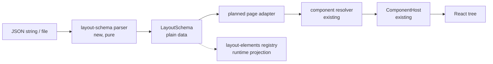

# Create Layout Schema

## 📝 TLDR

Obecny układ replaceable components jest wybierany przez strukturę JSX. To utrudnia zapis
układu, zmianę kolejności i późniejsze przełączanie implementacji component contracts bez
przepisywania drzewa React.

Proponujemy wersjonowany, serializowalny model `LayoutSchema`, w którym strona ma nazwę,
wersję schematu, named zones oraz ordered placements. Placement przechowuje wyłącznie stabilny
identyfikator i referencje do contract/component; nie przechowuje `ReactNode`, `ComponentType`,
callbacków, DOM references ani runtime props. Implementacja dostarczy także domyślny opis Task
Page i czyste `parse`/`serialize`, ale nie dodaje jeszcze mechanizmu zapisu do serwera ani UI
edytora.

## 📝 Problem Statement

Component Platform ma już rozdzielone contract, registry, resolver i host:

- `packages/extension-api` opisuje contract wraz z `id` i `version`;
- `packages/web/src/component-registry/` przechowuje implementacje oraz wybiera preferowaną
  implementację z core fallbackiem;
- `ComponentHost` renderuje wybraną implementację i używa contract layout hints;
- `packages/web/src/lib/layout-elements.ts` opisuje bieżące elementy edytowalnego layoutu,
  ale jest rejestrem runtime drzewa DOM, a nie źródłem prawdy, które można zapisać jako JSON.

Brakuje warstwy pomiędzy tymi kontraktami a JSX: danych określających, jakie placementy należą
do której strefy strony i jaki component implementation ma być dla nich użyty. Bez tej warstwy
zmiana kolejności lub wybór replaceable component pozostaje zakodowany w render function.

## 📝 Proposed Solution

Wprowadzić webowy, framework-neutralny model danych:

```ts
type LayoutContractRef = {
  id: string
  version: number
}

type LayoutComponentRef = {
  id: string
}

type LayoutPlacement = {
  id: string
  contract: LayoutContractRef
  component: LayoutComponentRef
}

type LayoutSchema = {
  page: string
  schemaVersion: 1
  zones: Record<string, LayoutPlacement[]>
}
```

Przykładowy zapis:

```json
{
  "page": "task",
  "schemaVersion": 1,
  "zones": {
    "header": [
      {
        "id": "task-header-main",
        "contract": { "id": "cezar.task.header.main", "version": 1 },
        "component": { "id": "cezar.task.header.main.default" }
      }
    ],
    "main": [],
    "sidebar": []
  }
}
```

`id` placementu jest stabilną tożsamością elementu layoutu, niezależną od DOM. `contract` jest
referencją do publicznego contract tokenu, a `component` do zarejestrowanej implementacji.
Schema nie próbuje ładować ani walidować React component; robi to późniejszy adapter używający
catalogu i `ComponentHost`.

Alternatywa polegająca na przechowywaniu `ComponentType` lub arbitralnego `props` w placementach
została odrzucona: nie jest serializowalna, wiąże model z Reactem i pozwalałaby zapisywać dane,
których contract nie zadeklarował. Contract-specific props pozostają runtime bindingiem strony.

## Resolved assumptions (autonomous defaults)

| # | Question | Applied default | Why | Confirm? |
|---|---|---|---|---|
| Q1 | Czy ten etap obejmuje persystencję i renderer, czy tylko model? | Model, walidację i round-trip JSON; bez API, localStorage i pełnego renderera. | To najmniejszy niezależny seam. Persystencja i renderowanie będą mogły użyć tego samego stabilnego kontraktu bez migracji danych. | reversible |
| Q2 | Jak placement ma wskazywać contract/component? | Stable `id`, `contract: { id, version }` oraz `component: { id }`. | Rozdziela wersję contractu od identyfikatora implementacji i odpowiada istniejącemu `ComponentContract`/`ComponentRegistration`; nie wymaga parsowania stringa `id@version`. | reversible |
| Q3 | Czy placement może mieć dowolne props/config? | Nie w schema v1. | Props są zależne od contractu i powinny być dostarczone przez runtime binding; otwarty rekord w JSON utrudniłby wersjonowanie i walidację. | reversible |
| Q4 | Gdzie ma mieszkać model? | W `packages/web/src/lib/layout-schema.ts`, jako wewnętrzny model cockpit. | Nie rozszerza eksperymentalnego publicznego `extension-api` bez realnego konsumenta zewnętrznego; eksport do extension API pozostaje późniejszą, addytywną decyzją. | reversible |
| Q5 | Co zawiera domyślny Task Page w v1? | `header` zawiera istniejący `cezar.task.header.main@1`; `main` i `sidebar` są jawnie obecne i mogą być puste, dopóki ich własne contract specs nie dołączą implementacji. | Nie tworzymy fikcyjnych publicznych contractów ani nie zmieniamy zakresu specyfikacji Task Header. Puste strefy są ważnym, serializowalnym stanem domyślnym. | reversible |

## 📝 Architecture

### Granice modułów

- `packages/web/src/lib/layout-schema.ts` — typy, literal `LAYOUT_SCHEMA_VERSION = 1`,
  walidacja nieznanego JSON, `parseLayoutSchema` i `serializeLayoutSchema`.
- `packages/web/src/routes/task-thread/task-layout-schema.ts` — niezmienny
  `defaultTaskPageLayout`, zbudowany wyłącznie z plain data i referencji do istniejących lub
  jawnie planowanych contract ids.
- Przyszły adapter strony — mapuje placement do catalogu `ComponentContract`, resolvera i
  `ComponentHost`; nie należy do parsera i nie może dopisywać runtime objects do modelu.
- `packages/web/src/lib/layout-elements.ts` — pozostaje runtime projection dla edit mode,
  drag-and-drop i DOM lifecycle. Nie staje się formatem pliku.



Najważniejsze rozdzielenie: schema opisuje intent i kolejność, registry opisuje aktualnie
zamontowane elementy, a host dopiero na granicy React interpretuje referencje componentu.

### Wersjonowanie i kompatybilność

`schemaVersion` jest wersją struktury całego dokumentu, nie wersją contractu. Parser v1:

1. akceptuje wyłącznie obiekt JSON z `page`, `schemaVersion === 1` i `zones`;
2. wymaga niepustych identyfikatorów `page`, zone, placement, contract id i component id;
3. wymaga dodatniej integer `contract.version`;
4. odrzuca duplikaty placement ids w obrębie dokumentu;
5. zwraca błąd opisujący ścieżkę, bez częściowo zmienionego modelu;
6. odrzuca nieobsługiwane `schemaVersion` zamiast zgadywać migrację.

`serializeLayoutSchema` emituje deterministyczny JSON z pełnym dokumentem. Migracje między
wersjami nie są udawane w v1; gdy powstanie v2, zostanie dodany jawny migrator
`v1 -> v2`, a stare dane pozostaną czytelne. Nieznany component lub contract nie jest błędem
parsera — może pochodzić z później ładowanej extension — ale adapter renderujący musi zgłosić
diagnostic i użyć istniejącego core fallback albo pominąć placement zgodnie z resolverem.

### Rejestr i renderer

Ten etap nie zmienia `ComponentRegistry`, `ComponentHost` ani `LayoutRegistry`. Przyszły adapter
powinien:

- rozwiązać `contract.id + contract.version` przez host catalog;
- przekazać `component.id` jako preference do istniejącego resolvera;
- zbudować props z aktualnego page/task contextu, a nie z JSON;
- zastosować `contract.layout` i zarejestrować wynikowy DOM przez istniejący layout-element
  mechanism;
- zachować core fallback, gdy extension albo stored component zniknie.

To pozwala zmieniać kolejność placementów bez przenoszenia JSX, ale nie obiecuje jeszcze
automatycznego zapisu zmian z edit mode. Taki zapis będzie osobnym konsumentem
`LayoutSchema`.

## 📝 Data Model

Wersja 1 ma następujące invariants:

| Field | Shape | Meaning |
|---|---|---|
| `page` | non-empty string | stabilny typ strony, w tym spec przypadku `task` |
| `schemaVersion` | literal `1` | wersja parsera dokumentu |
| `zones` | record of arrays | ordered named zones; v1 Task Page wymaga `header`, `main`, `sidebar` |
| `placement.id` | non-empty string, unique | tożsamość placementu dla reorder/edit/persistence |
| `placement.contract` | `{id, version}` | referencja do contract tokenu, bez props i bez React |
| `placement.component` | `{id}` | referencja do component registration, bez implementacji |

Wszystkie wartości są JSON-safe. Model nie zawiera sekretów, danych taska, tokenów, closure,
funkcji ani referencji do DOM. `Object.freeze` może chronić domyślną stałą w runtime, ale nie
jest częścią wire format.

### Domyślny Task Page

`defaultTaskPageLayout` opisuje bieżący minimalny contract-backed układ:

```ts
{
  page: 'task',
  schemaVersion: 1,
  zones: {
    header: [{
      id: 'task-header-main',
      contract: { id: 'cezar.task.header.main', version: 1 },
      component: { id: 'cezar.task.header.main.default' },
    }],
    main: [],
    sidebar: [],
  },
}
```

Pusta `main`/`sidebar` nie usuwa obecnego transcriptu ani core-owned actions; oznacza tylko, że
nie są jeszcze replaceable placements w tym contract item. Kolejne specyfikacje mogą dodać
placements dla timeline, composera lub sidebaru przez nowy domyślny dokument albo migrację,
bez zmiany znaczenia wersji 1.

## 📝 API Contracts

Nie ma nowej trasy HTTP, endpointu ani publicznego package exportu. Lokalny moduł udostępnia
czyste funkcje:

```ts
parseLayoutSchema(input: unknown): LayoutSchemaResult
parseLayoutJson(text: string): LayoutSchemaResult
serializeLayoutSchema(schema: LayoutSchema): string
```

`parseLayoutSchema` waliduje wynik `JSON.parse`, a `parseLayoutJson` dodatkowo zamyka błąd
składni JSON w typed `invalid-json`. Żadna z funkcji nie zwraca częściowo zaakceptowanego
modelu. `serializeLayoutSchema` przyjmuje wyłącznie `LayoutSchema`; wynik przechodzi test
`JSON.parse(serializeLayoutSchema(schema))` i jest równy wejściu po normalizacji zamrożonych
tablic/recordów. Błędy są typed/local i nie są odpowiedzią API.

## 📝 UI/UX

Brak zmiany wizualnej w tym etapie. Użytkownik nie dostaje jeszcze edytora, picker UI ani
kontrolki zapisu. Task Page ma nadal renderować się tak jak dziś; schema jest źródłem danych
dla przyszłego adaptera, a nie mockupem nowego ekranu. Dlatego nie dodajemy screenshotów ani
mockupów — nie ma nowego lub materialnie zmienionego ekranu do zweryfikowania.

## 📝 Edge Cases & Failure Scenarios

- **Uszkodzony JSON.** `parseLayoutJson` zwraca `invalid-json`, a walidacja zwraca
  `invalid-schema` z path; caller zachowuje
  `defaultTaskPageLayout` i nie próbuje renderować części dokumentu.
- **Nieobsługiwana wersja.** Parser zwraca `unsupported-version`; caller powinien wybrać
  bezpieczny default i zachować oryginalny zapis do późniejszej migracji.
- **Duplikat placement id.** Dokument jest odrzucony atomowo; nie wolno nadpisać pierwszego
  placementu kolejnością z drugiego.
- **Nieznany zone.** Parser zachowuje poprawną named zone jako dane. Renderer, który nie zna
  zone, pomija ją z diagnostic; parser nie może niszczyć danych extension.
- **Nieznany contract/component.** Parser akceptuje referencję; resolver/adapter stosuje core
  fallback lub pomija placement i raportuje problem. Brak extension nie może wyłączyć całej
  strony.
- **Brak placementu w rejestrze runtime.** Model jest źródłem prawdy, a `LayoutRegistry`
  aktualizuje projection podczas mount/unmount; stale DOM nie może być dopisywany do JSON.
- **Ręczna edycja JSON.** Brak niejawnych defaults dla wymaganych pól; błąd wskazuje ścieżkę,
  dzięki czemu użytkownik może naprawić plik bez debugowania React.

## 📝 Risks & Impact Review

- **Schema jako przyszły persisted contract — medium.** `schemaVersion` i stabilne ids będą
  trudne do zmiany po rozpoczęciu zapisu. Ograniczamy ryzyko przez jawne wersjonowanie,
  atomowy parser i brak `props` w v1.
- **Rozjazd id contract/component — medium.** Opaque refs mogą wskazywać usunięty registration.
  Istniejący resolver i core fallback są jedynym miejscem degradacji; layout parser nie powinien
  kopiować reguł compatibility.
- **Pomieszanie schema z DOM registry — medium.** Spec osobno utrzymuje model danych i runtime
  projection; test graniczny powinien zabronić importu React/DOM w `layout-schema.ts`.
- **Brak API/persystencji — świadomy non-goal.** Model jest zapisywalny jako JSON, ale ta spec
  nie obiecuje, że zmiany użytkownika przetrwają restart. To osobny design z decyzją o scope,
  storage i migracjach.

### Prior art

- Grafana rozdziela stabilny panel `type` od pozycji/rozmiaru w `gridPos` i wersjonuje dashboard
  JSON; przejmujemy rozdział identity/layout, ale nie kopiujemy dashboardowego gridu, którego
  Task Page nie potrzebuje ([Grafana JSON model](https://grafana.com/docs/grafana-cloud/learn-and-build/visualizations/dashboards/build-dashboards/view-dashboard-json-model/)).
- WordPress używa `block.json` jako kanonicznych, serializowalnych metadanych bloku; przejmujemy
  ideę jawnego metadata contract, ale v1 nie umieszcza ścieżek skryptów ani framework runtime w
  layout document ([WordPress block metadata](https://developer.wordpress.org/block-editor/reference-guides/block-api/block-metadata/)).
- Backstage modeluje frontend jako drzewo extensionów z identyfikatorami i punktami attachment,
  a konfiguracja odwołuje się do extension IDs; przejmujemy referencje zamiast komponentów,
  pozostawiając Cezarowi prostsze, płaskie zones zamiast całego extension tree
  ([Backstage frontend extensions](https://backstage.io/docs/next/frontend-system/architecture/extensions/)).

## 📋 Phasing

### Phase 1 — Schema i JSON round-trip

Pure model, validator, serializer, wersja 1 i testy graniczne. Po tej fazie każdy poprawny
model może być zapisany i odczytany jako JSON bez Reacta.

### Phase 2 — Default Task Page data

Dodać niezmienny default model Task Page oraz test, który potwierdza jego kontrakty, trzy strefy
i JSON round-trip. Nie zmieniać jeszcze wizualnego renderowania.

### Phase 3 — Handoff do renderera

Udokumentować seam dla przyszłego adaptera, który wybierze implementation przez resolver i
zarejestruje runtime projection przez `LayoutRegistry`. Ta faza może pozostać jako osobny
implementation PR, jeśli obecny Task Page nie ma jeszcze wszystkich core contracts.

## 📋 Implementation Plan

### Phase 1: Pure schema

1. Dodać `packages/web/src/lib/layout-schema.ts` z `LayoutSchema`, `LayoutPlacement`,
   `LayoutContractRef`, `LayoutComponentRef`, `LAYOUT_SCHEMA_VERSION` oraz jawnie typowanymi
   błędami parsera. *Test:* typecheck nie dopuszcza `ReactNode`, `ComponentType`, DOM ani funkcji
   w modelu.
2. Zaimplementować walidację `unknown` dla version 1: required fields, ids, positive contract
   version, duplicate placement ids oraz atomowy failure. *Test:* fixture'y valid/invalid pinują
   każdą regułę i ścieżkę błędu.
3. Zaimplementować deterministyczne `serializeLayoutSchema` i round-trip. *Test:* każdy valid
   fixture przechodzi `parse(JSON.parse(serialize(schema)))` i zachowuje kolejność zone/placement.

### Phase 2: Default Task Page

4. Dodać `packages/web/src/routes/task-thread/task-layout-schema.ts` z
   `defaultTaskPageLayout`, używając `cezar.task.header.main@1` jako jedynego obecnie
   zarejestrowanego replaceable placementu. *Test:* schema ma `page === 'task'`, version `1`,
   dokładnie zones `header`, `main`, `sidebar`, a header wskazuje core default component.
5. Dodać test graniczny, który serializuje default i sprawdza brak wartości funkcyjnych,
   React/DOM objects oraz brak task-specific runtime props. *Test:* JSON jest plain data i po
   odczycie jest równy modelowi.
6. Uzupełnić dokumentację modułu o zasadę: `LayoutSchema` jest intent, `LayoutRegistry` jest
   runtime projection, a resolver jest jedynym miejscem fallbacku. *Test:* review checklist
   potwierdza, że ta zmiana nie dodaje route, storage ani nowego publicznego package API.

### Phase 3: Renderer seam (planned follow-up)

7. Zaprojektować adapter page-specific, który mapuje placement ids na runtime bindings i
   `ComponentHost`, bez przenoszenia props do JSON. *Test:* contract-specific props powstają z
   page context, a unknown component nie przerywa renderu.
8. Po dostarczeniu właściwych timeline/composer/sidebar contracts migrować Task Page z kolejności
   replaceable slots w JSX do `defaultTaskPageLayout`. *Test:* screenshot/DOM smoke test potwierdza
   ten sam wygląd i fallback po usunięciu extension.

## 📝 Acceptance Criteria

- [ ] `LayoutSchema` może być bezpiecznie przekazany do `JSON.stringify` i odczytany przez
  `parseLayoutJson(JSON.stringify(schema))`.
- [ ] Każdy placement ma `id`, `contract.id + contract.version` oraz `component.id`.
- [ ] Model nie zawiera React-specific data, props, callbacków ani DOM references.
- [ ] `schemaVersion: 1` jest jawnie walidowane; nieznana wersja nie jest zgadywana.
- [ ] `defaultTaskPageLayout` opisuje stronę `task` ze strefami `header`, `main`, `sidebar`.
- [ ] Obecny Task Page nie zmienia wyglądu ani zachowania w fazie modelu.
- [ ] Brak nowych tras HTTP, storage migrations i publicznego exportu extension API w tym PR.
