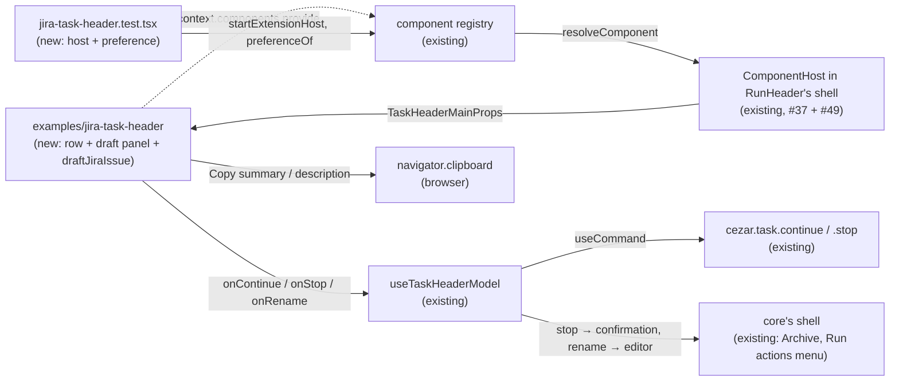

# Custom Task Header Extension — a header part with its own state and logic, owning core's task actions

> Slug: `custom-task-header-extension` · Status: **designed, every question answered, ready to implement** ·
> Epic 2 (Component Platform), item 13: "Create example custom Task Header extension". Builds on
> `2026-09-19-task-header-contract.md` (item 11: `cezar.task.header.main@1`, the intents, the
> `offers-*` capabilities), `2026-09-19-component-host.md`, `2026-09-19-component-resolver.md` and
> `2026-09-18-extension-registry.md`. Sibling contracts, not touched here:
> `2026-09-19-task-metadata-contract.md` (item 16) and `2026-09-19-task-composer-contract.md`
> (item 17, on `main` since #47). **Starts from `main` at `33a64fea` (#49)**, which carried #38's
> diff — the `offers-*` capabilities, `useHostedComponent`, the shell code that honours them, the
> examples' `react` rule and `examples/compact-task-header/` — onto `main` on 2026-09-19, one minute
> after this spec first merged (#45). The prerequisite this spec was written around is therefore
> **done**, and the owner's rule behind it holds: nothing here depends on a branch `main` does not
> contain (Q2). Delivery: **one PR to `main`** — `packages/extension-api` (a new example and its
> tests, README) plus one cockpit test in `packages/web`. **No runtime change.** *Revised
> 2026-09-20, after #49.*

## 📝 TLDR

Item 11 designed a task header an extension can replace, with the task's actions crossing the
boundary as state plus intents. On `main` the slot exists and core's own header renders through it,
but no implementation has ever taken the actions over there, and none has had behaviour of its own.
So nothing shows yet that an override can **add** something core does not have while every core
action keeps working.

Since #49 the mechanism is on `main`, and `examples/compact-task-header/` shows a header from
another package owning all three actions. What it does not show is a header that **adds** anything:
it holds no state, runs no logic of its own, and never fails. The proposal adds a second, richer
worked example, `packages/extension-api/examples/jira-task-header/`, written against
`@open-mercato/cezar-extension-api` and `react` alone. The example implements
`cezar.task.header.main@1` (the brief's `task.header@1`) and takes over **the whole action set** —
Continue, Stop and Archive (`offers-continue`, `offers-stop`, `offers-archive`) — plus the **Choose
engine** intent. Core's `cezar.task.continue`, `cezar.task.stop` and `cezar.task.archive` still do
the work, through the contract's intents and core's confirmation, and when the example throws, core's
default returns and core's own action bar comes back. The example's own **Draft Jira issue** button
opens a draft panel held in its own React state. The panel drafts a Jira summary and description
from the header's model, lets the user edit both, and copies either field to the clipboard. It makes
no network call, needs no credentials and no setting, and persists nothing. It replaces the header
only: the task's reply box stays core's `cezar.task.composer@1` (Q8, owner). A cockpit test
activates the example through the real extension host and drives each Definition of Done point on
the task page, following every action through to the core command it runs.

## Resolved assumptions (autonomous defaults)

The brief left these open. **The owner answered Q2, Q3, Q5, Q8 and Q10 on 2026-09-19** ([PR #45
comment](https://github.com/DarrenStasiakDev4You/cezar-hackathon-ale-patryk-nazywa-go-brutusem/pull/45#issuecomment-5745690055)),
**and Q6 on 2026-09-20**, and those rows record the decisions. **No question is left open.** The
remaining rows are autonomous defaults, each reversible before implementation starts.

| # | Question | Answer | Why | Status |
|---|---|---|---|---|
| Q1 | The brief bundles an example extension, its custom feature and the proof on the task page. Split into several specs? | **One spec, one PR.** They do not stand apart: the example is the proof, its custom feature is what the brief asks the proof to show, and a test without the example proves nothing. (Until #49 this was two PRs, the first one being the prerequisite — Q2.) | default, reversible |
| Q2 | #38 (item 11's phase 2) was merged into `feat/task-header-contract` after #37 had been squash-merged into `main`, so `offers-*`, `useHostedComponent`, the shell code that honours them and the examples' `react` rule are on no branch that reaches `main`. Build on #38, or stand alone? | **Never build on #38's branch — and since #49 there is nothing left to do.** The owner's rule was satisfied on 2026-09-19 by a separate PR: #49 carried #38's diff onto `main` (`33a64fea`), verified equal to it by `git patch-id`. So this item lands no mechanism, opens no prerequisite PR and stacks nothing. It is one PR of example, tests and README, starting from `main` as #49 left it. Step 0 is now a check that the three `offers-*`, `useHostedComponent`, the shell code and the examples' `react` rule are really there. | Owner, 2026-09-19: "nie traktowałbym #38 jako podstawy, jeśli zmiany z niego nie znajdują się na żadnej ścieżce prowadzącej do obecnego main", with the two acceptable shapes — a small prerequisite PR, or the minimal subset inside item 13 — and the explicit worry about testing the extension system "wobec architektury, której faktycznie nie ma w produkcyjnym drzewie". #49 is the first of those, opened and merged independently of this item, so a runtime change stayed reviewable on its own instead of hidden inside an example PR. Stacking is what lost #33 and #38 in the first place. | ✅ owner, 2026-09-19 · **done by #49** |
| Q3 | The brief names `task.header@1`. Which contract? | **`cezar.task.header.main@1`**, unchanged, because it already is what the owner describes: the **functional** contract of the replaceable task header — a view model, action state and intents — and nothing React- or core-specific. The mapping of names: the owner's `task` is `task` + `attention` + `engine` + `meta`; his `intents.continue/stop/archive/chooseEngine` are `onContinue`, `onStop`, `onArchive` and `onChooseEngine`; his `state.canContinue/canStop/canArchive` are `actions.continue/stop/archive`, each `{ available, enabled, pending, reason? }` — `canX` is `available && enabled`, with the reason in words and a `pending` flag the owner's booleans do not carry. `onRename`, `onResolveConflicts` and `onNavigate` are part of the same @1. | Owner, 2026-09-19: the contract is "kontrakt funkcjonalny całego replaceable Task Headera, nie konkretnego komponentu React", holding "wszystko, czego implementacja potrzebuje, żeby być poprawnym Task Headerem", and never a `QueryClient`, mutations, the router, internal hooks or core's DOM refs. That is exactly what #37 shipped (item 11, Q4–Q6): data props are JSON and the only functions are `void` intents. No new contract, and no change to `@1`. | ✅ owner, 2026-09-19 |
| Q4 | "Still use core's `task.continue` command": does the example execute `cezar.task.continue` itself through `context.commands`, or call the `onContinue()` intent? | **The intent.** The example declares `offers-continue` and calls `onContinue()`. Core executes `cezar.task.continue` with `{ taskId }`, plus `runner` when the task's own runner is not connected, and shows the server's words on failure. The same goes for Stop: `onStop()` opens core's confirmation, and only **Cancel the run** executes `cezar.task.stop`. The example never holds a command token. | Item 11 (Q4) routed header actions through intents so that no header can skip Stop's confirmation or Continue's provider check. An example that executed `TaskContinue` itself would teach the path that decision closed. The cockpit test spies on the command registry, so "core's command ran" is asserted, not assumed. | default, reversible |
| Q5 | Which of core's actions does the example take over? | **The whole set: Continue, Stop and Archive** (`offers-continue`, `offers-stop`, `offers-archive`), plus the **Choose engine** intent when it is available. Core's bar then shows none of the three, the example renders them, every one still works, and **after the example throws, core's default returns and core's bar shows all three again** — which this item's test proves, on the real page, with the real example. | Owner, 2026-09-19: "przykładowy header powinien przejąć cały sensowny zestaw: Continue, Stop, Archive", because an example that takes Continue and leaves Stop "nie testujesz faktycznie mechanizmu »header przejmuje actions«", and the crash-and-fallback path is what makes the proof strong. The granular capabilities (item 11, Q3, owner) stay as they are: this example simply declares all three. | ✅ owner, 2026-09-19 |
| Q6 | Does **Create Jira Issue** create an issue in Jira? | **No, and that is decided: for now the content goes to the clipboard only.** The button reads **Draft Jira issue** and opens a draft panel. There the example builds a summary and a plain-text description from the header's props, the user can edit both, and **Copy summary** and **Copy description** put them on the clipboard for Jira's own Create dialog. No request leaves the page, and nothing needs configuring. Owner, 2026-09-20: "na razie tylko treść do schowka" — so drafting-and-copying is the decided shape, not an assumption waiting for review. (His earlier "już jest merge zrobione" on this row was about #49, the merge that put the mechanism on `main` — Q2 — not about Jira.) | A real issue needs a Jira site, a project and a credential. Extensions have nowhere to keep them: `context.storage` is still a placeholder that rejects (`extensions/host.ts`, `unavailableServices`), and there is no secret store or permission model yet (#40 is an open spec). A browser call to Jira's REST API would need a token in the page and a CORS exception. Jira's prefilled create URL needs numeric project and issue-type ids, which is configuration. Each of these breaks "zero config" (AGENTS.md) for an example. The label does not promise a ticket the example does not create. A real integration is its own item, once storage and permissions exist. | ✅ owner, 2026-09-20 |
| Q7 | Where does the example's own state live? | **In React state inside its component** (`useState`, `useRef`, `useEffect`), keyed by `task.taskId`. The state holds whether the draft panel is open, the two edited fields and the copy feedback. Nothing is persisted. | The brief asks for "its own React state". `context.storage` does not work yet (Q6). The host does not remount a healthy implementation when the user moves to another task (`component-host.tsx`, `resetKey`), so keying by task is what keeps task A's draft off task B's header. | default, reversible |
| Q8a | Does the example touch the task's reply box? | **No. It replaces the header and nothing else.** The page composes independent hosts — the header, the thread and the reply box — and the reply box is its own contract, `cezar.task.composer@1` (item 17, on `main` since #47). An implementation of the header contract cannot reach it, and this example does not provide one. The one link between them stays the intent: while `actions.chooseEngine` is available the example offers **Choose engine**, and core moves focus to the reply box's engine picker (item 11, Q7, owner). The word "composer" is reserved for that reply box in this spec; the example's own UI is the **Jira draft panel**. | Owner, 2026-09-19: "Example Task Header nie powinien renderować composera… Override task.header nie powinien zmieniać task.composer. To jest właśnie jedna z głównych zalet całego systemu", with `onChooseEngine()` as the sanctioned way in. | ✅ owner, 2026-09-19 |
| Q8b | How does the Jira draft panel render, given the example may import only the package and `react`? | **As a panel inside the example's own box**, absolutely positioned under the row and never wider than the row, with inline styles. While it is open it covers what lies under it, core's tabs and action bar included, so it closes on **Close**, Escape, its button, and a press anywhere outside it. It is not a portal (`react-dom` is outside the examples' boundary), not core's UI kit (a private import) and not a native `<dialog>` (jsdom 29 has no `showModal`). Colours come from CSS system colours (`Canvas`, `CanvasText`, `ButtonFace`, `GrayText`), which follow the cockpit's `color-scheme` in light and dark. | An absolutely positioned panel does not change the header's height. That height matters because the Changes and Files tabs pin their panes under it (item 11 § Edge Cases). The shell is `relative z-20`, and nothing between it and the host's box clips, so the panel overlays what is below. Bounding it by the row keeps it on screen at 375 px, where core's ⋮ menu sits to the right of the row. Tailwind classes would not exist for a file outside the cockpit's sources, and the cockpit's `--*` tokens are undocumented internals. | default, reversible |
| Q9 | Must the example be reachable in the shipped cockpit? | **No.** It is not added to `BUILTIN_EXTENSIONS`. The proof is a cockpit test that activates it through the real extension host and prefers it through `ComponentsProvider`, the seam the picker item will use. | `BUILTIN_EXTENSIONS` ships to every user, and production has no preference yet (`app.tsx` passes none), so a built-in example would render nowhere and only grow the bundle. #49's compact example set this precedent. The picker item makes any provided header selectable. | default, reversible |
| Q10 | Which core actions are "the required core actions" the Definition of Done says must still work? | **The ones the contract names, not a list in this ticket: `continue`, `stop`, `archive` and the `chooseEngine` intent**, each offered exactly while its own state allows it. The test does not settle for "the button exists". For each action it follows the chain the owner drew — extension control → core intent → core command → the same behaviour core's own button produces — and asserts every link: the executed command token and input, the request the service receives, and Stop's confirmation before any of it. The example also keeps **Rename** (`onRename()` → core's title editor), one button beyond the required set, because rename lives only inside the part and would otherwise leave the page. **The meta row's controls are not required:** the example does not declare `shows-meta`, so the branch chip's copy, the reference chips (with **Resolve conflicts**), the automation link, the agent badge, the diff, usage and the plan mirror do not render while it does. § UI/UX lists each one and where it is still reachable. | Owner, 2026-09-19: "To powinno zostać zdefiniowane przez contract, nie przez prose ticketu" — Continue, Stop, Archive and the Choose Engine intent, gated by `canContinue`/`canStop`/`canArchive` (Q3 maps those onto `actions.*`) — and the test must prove "same core intent → same core command → same behavior". The meta stays optional by the contract's own design (`shows-meta`). | ✅ owner, 2026-09-19 |

## 📝 Problem Statement

The brief's goal: prove that the system supports a real override with additional logic. Since #49,
`main` has the mechanism and one worked example. `examples/compact-task-header/` is a header from
another package that declares all three `offers-*`, renders the task's actions and runs them through
core's intents, and `external-task-header.test.tsx` drives it on the task page. That answers "can a
header live outside the cockpit and still work". It leaves the brief's actual question open:

- **The example adds nothing of its own.** The compact header is a row of props: no state, no
  logic, nothing core does not already do. Its whole body is `createElement` over its props, so
  "obsługuje rzeczywisty override z dodatkową logiką" is still unproven.
- **No hook has ever come from outside `packages/web`.** The compact example uses none, and the
  fixtures that do live in the cockpit's own test files, where they share React by construction.
  Hooks in a component from another package work only when that package resolves the same React
  instance. #49 pins `react` for the examples (one copy, 19.2.7), but nothing exercises it, and the
  README does not tell an extension author about it.
- **Nothing shows what happens after a replacement fails.** `run-header.test.tsx` covers it with a
  throwing fixture, but no real extension has ever failed on the page. That path decides whether a
  user can still stop a task when an extension is broken, so the owner asked for the example itself
  to prove it (Q5).
- **Two of the contract's actions have no real implementation behind them.** Nothing outside the
  cockpit has ever called `onChooseEngine()` or `onRename()`. Rename matters most: it lives only
  inside the part, and the compact example has no pencil, so under it the page loses renaming
  altogether.

The brief's Definition of Done, and where this item proves each point:

| Definition of Done | How this item meets it | Proven by |
|---|---|---|
| The extension header can replace core's header. | Activated through the real extension host and preferred for `cezar.task.header.main`, the example renders in the host's box on `ThreadView`, in place of core's title and meta rows. Core's bar drops Continue, Cancel and Archive, because the example offers all three. (`external-task-header.test.tsx` already shows this for the compact example; this test is where the rest of the table is proven.) | `routes/task-thread/jira-task-header.test.tsx` (`data-component="example.jira-header.row"`) |
| It has functionality core does not have. | **Draft Jira issue**: a draft panel, held in the example's React state, that drafts a Jira summary and description from the header's model and copies them. Core has nothing like it. | `test/jira-task-header.test.ts` (the draft rules), `jira-task-header.test.tsx` (the panel on the page) |
| The required core actions still work (Q10). | Each of the contract's actions is followed through the whole chain: the example's control → the intent → the core command with its input → the request the service receives. Continue runs `cezar.task.continue`; Stop opens core's confirmation first and only **Cancel the run** runs `cezar.task.stop`; Archive runs `cezar.task.archive` with `archived: true`; **Choose engine** moves focus to the reply box's engine picker. Each is offered exactly while its own state allows it. The pencil opens core's title editor. When the example throws, core's default returns and core's bar shows all three actions again. | `jira-task-header.test.tsx` |
| It uses no private Cezar imports. | The example imports only `@open-mercato/cezar-extension-api`, `react` and its own files. | `test/boundary.test.ts` (the examples rule #49 landed, unchanged) |

## 📝 Proposed Solution

1. **The draft logic, as a pure function** (`examples/jira-task-header/draft.ts`).
   `draftJiraIssue(model)` takes the header's `task`, `attention`, `engine` and `meta` and returns
   `{ summary, description }`. It is total, deterministic (no clock, no randomness) and needs no
   DOM, so the package's node tests cover it (§ API Contracts gives the rules).
2. **The header part** (`examples/jira-task-header/index.ts`). It is written with `createElement`,
   so the boundary scanner (which reads `.ts` files) covers it and the package needs no JSX setting.
   It shows one row: the title, the status, a pencil, and on the right **Continue**, **Stop**,
   **Archive**, **Choose engine** and **Draft Jira issue**. Each core control renders from its own
   action state (hidden unless `available`, disabled unless `enabled`, the `reason` as its title)
   and calls its intent: `onContinue()`, `onStop()`, `onArchive()`, `onChooseEngine()`. The pencil
   calls `onRename()`. The draft panel is the example's own (§ UI/UX).
3. **The extension** provides the part as `example.jira-header.row` and declares `shows-title`,
   `shows-status`, `offers-continue`, `offers-stop` and `offers-archive` (Q5). It does not declare
   `shows-meta` and does not show `meta` or `engine`: it uses them only inside the draft. So if the
   task header's meta row later becomes a slot of its own (item 16), core's row renders under this
   header and no fact shows twice. It provides nothing for `cezar.task.composer@1` (Q8a).
4. **The proof on the task page** (`packages/web/src/routes/task-thread/jira-task-header.test.tsx`).
   It builds the page the way `main.tsx` builds it: core commands, the event bus, the core
   component registry, `startExtensionHost` with the example, and a `ComponentsProvider` that
   prefers `example.jira-header.row`. It then drives every Definition of Done point on `ThreadView`.
5. **The README** names the example in its list of worked examples (under "Writing an extension"
   since #49) as the case for a part with its own state and logic. "Replacing a component"
   gains the one rule the example makes visible: React is the cockpit's. An extension imports
   `react` and never bundles its own copy, because a second React makes every hook throw. The host
   then renders core's default in place of that part.

### Prior art

- **Sentry's "Create Jira issue"** needs an installed Jira integration, with OAuth held on the
  server, before it can create anything. That confirms Q6: creating a real issue is a
  credentials-and-permissions feature, not something a header part can do on its own.
- **GitHub's "Reference in new issue"** and the **GitHub Pull Requests and Issues** extension for VS
  Code draft the issue from the context the user is looking at and hand it to the tracker's own
  form. The draft is the valuable part, and the tracker keeps its own create flow. We take the same
  split.
- **Grafana panel plugins** keep their own UI state (a toggled legend, an open menu) and take
  data and callbacks from the host, never querying the data source themselves. That is the shape
  of this example: local state, the host's model, the host's intents.

### Alternatives considered

- **Call Jira's REST API from the example** (Q6). Rejected: it needs a token in the page, a CORS
  exception and a configured site and project. It breaks zero config, and extensions have no secret
  store yet.
- **Open Jira's prefilled create page** (`CreateIssueDetails!init.jspa`). Rejected: it needs the
  site URL plus numeric project and issue-type ids, which is configuration that `context.storage`
  cannot keep yet.
- **Ask the task's agent to write the issue**, through `context.commands.execute(TaskContinue, {
  taskId, text })`. Rejected: it spends tokens on a click, it takes the command token path item 11
  (Q4) closed for header actions, and its result is not something a test can pin.
- **Emit an extension event when a draft is copied** (`example.jira-header.issue-drafted`).
  Deferred: nothing listens to it, and the brief does not ask for it.
- **A native `<dialog>` or a portal for the draft panel** (Q8b). Rejected: `react-dom` is outside the
  examples' boundary, and jsdom 29 does not implement `showModal`.
- **Extend the compact example instead of adding a third.** Rejected: the compact example is the
  minimal "restyle and take over all three" case, which later items can reuse as a baseline.
  Growing it would blur both cases.

## 📝 Architecture



The example reaches the cockpit only through the registry, and reaches core's behaviour only
through the intents. Its own feature ends at the browser's clipboard.

**Already on `main` (#49), and used as it is:** the three `offers-*` capabilities on the token,
`useHostedComponent`, the shell code that leaves out each offered action and keeps the **Run
actions** menu visible, the examples' `react` rule and its devDependency.

**This item.** New in `packages/extension-api`:
`examples/jira-task-header/draft.ts` (`draftJiraIssue`), `examples/jira-task-header/index.ts` (the
extension and its component), and `test/jira-task-header.test.ts`.
- **Changed in `packages/extension-api`:** `README.md`. "Writing an extension" lists the example
  with the other two, and "Replacing a component" gains the React-is-the-cockpit's rule.
- **New in `packages/web`:** `src/routes/task-thread/jira-task-header.test.tsx`. It imports the
  example through a test-only relative path, as `external-task-header.test.tsx` does
  (AGENTS.md: "ugly on purpose").
- **Not touched:** the contract's props and version, the registry, the resolver, the host, the
  provider, the shell, `useTaskHeaderModel`, the commands, `cezar.task.composer@1` and the reply
  box, `BUILTIN_EXTENSIONS`, the service, the HTTP contract and the api-client. No
  `BACKWARD_COMPATIBILITY.md` surface moves. **This item makes no runtime change at all.** If its
  implementation finds it must edit cockpit code to make the example work, that edit is a finding
  about the platform: it is reported in the PR body and belongs in a change of its own.

## 📝 Data Model

Nothing is persisted. The example's state lives in its component and dies with it:

| State | Type | Starts as | Reset when |
|---|---|---|---|
| `open` | `boolean` | `false` | the task changes (the component is keyed by `task.taskId`), **Close**, Escape, the button pressed again, a press outside the panel, or the pencil |
| `openSeq` | `number` | `0` | never; it counts the opens, and it is the draft memo's key |
| `summaryEdit` | `string \| null` | `null` (the draft's summary shows) | each open |
| `descriptionEdit` | `string \| null` | `null` (the draft's description shows) | each open |
| `copied` | `'summary' \| 'description' \| null` | `null` | 2 seconds after a successful copy, or on the next copy |
| `copyFailed` | `boolean` | `false` | the next copy, or the panel closing |

The draft itself is not state. It is `useMemo(() => (open ? draftJiraIssue(model) : null), [open,
openSeq])`, computed **during render**, and each field shows its edit or the draft's value. The memo
deliberately leaves the props out of its dependencies, so a draft does not change under a user who
is editing it; the next open drafts again. Computing it in render is also what makes the owner's
fallback proof possible with the real example (Q5): a `draftJiraIssue` that throws is a render
failure, which the host catches.

The draft includes task content: the title, the prompt, the branch and the references' URLs. All of
it is already in the props that item 10 (Q4a, owner) and item 11 (Q6) let extensions see. It leaves
the page only when the user presses a **Copy** button, and only to the clipboard.

## 📝 API Contracts

No public contract changes: the example uses `cezar.task.header.main@1` exactly as #37 and #49
define it. The example's own module surface is shown below. It is not part of the package's public
API, because `src/index.ts` does not re-export `examples/`.

### `examples/jira-task-header/draft.ts` (new)

```ts
import type { TaskHeaderMainProps } from '@open-mercato/cezar-extension-api'

/** Jira's summary field holds at most 255 characters. */
export const JIRA_SUMMARY_MAX = 255
/** Jira's description field holds 32,767. The draft stays under it with room for the user's own edits. */
export const JIRA_DESCRIPTION_MAX = 32_000

export interface JiraIssueDraft {
  readonly summary: string
  readonly description: string
}

/** The model a draft is made from: the header's props without the intents or the action state. */
export type JiraDraftInput = Pick<TaskHeaderMainProps, 'task' | 'attention' | 'engine' | 'meta'>

/** Drafts a Jira issue from what the task header shows. Total and deterministic: it never throws, reads no clock and touches no DOM. */
export function draftJiraIssue(input: JiraDraftInput): JiraIssueDraft
```

The rules, each one pinned by a test:

- **Summary.** `task.title` with its whitespace collapsed and trimmed. A title that is blank after
  that gives `Cezar task <taskId>`. A summary longer than 255 UTF-16 units (JavaScript's `length`,
  which is how Jira's Java backend counts) is cut to at most 254 units plus `…`, and the cut never
  splits a surrogate pair: a dangling high surrogate at the cut is dropped too.
- **Description.** It is plain text, not Jira wiki markup or Markdown, so it pastes the same into
  Jira Cloud's editor, Jira Data Center and anything else. The lines come in this order, and a line
  whose fact is absent is left out:

  ```text
  Drafted from Cezar task <taskId> in project <projectId>.

  Status: <attention.label>[ #<queuePosition>]
  Agent: <engine.runner> · <engine.model>[ (<engine.identity>)]
  Workflow: <meta.workflow>
  Branch: <meta.branch>
  Changes: +<added> −<removed> across <files> file(s)[, measured against a branch the agent checked out]
  Pull request #<number>[ (<status>)]: <url>
  Issue #<number>: <url>

  Original request:
  <task.prompt>
  ```

  ` in project <projectId>` is left out when `projectId` is `''` (a bare test render). References
  keep `meta.references`' order. A reference without a number reads `Pull request: <url>`, and one
  without a URL reads `Pull request #<number>`. A reference `status` is written only when it is one
  of the values the contract documents today, because the contract says to read an unknown value as
  absent. It is written as `(<status>)` while `lookup` is `ready` or absent, as `(last known:
  <status>)` while `lookup` is `unavailable`, and not at all while `lookup` is `loading` or
  `unknown`. The account and usage are never written: who ran the task and what it cost are not
  facts about the issue.
- **Limit.** The description never passes `JIRA_DESCRIPTION_MAX`. The original request is cut
  first, ending with `… (cut to fit Jira's description limit)`. If the lines above it still do not
  fit (only a task with hundreds of references can get there), the request is left out, and the
  reference lines are cut from the end and replaced by `… and <n> more references`. The status,
  agent, workflow, branch and changes lines are never cut.

### `examples/jira-task-header/index.ts` (new)

```ts
import { createElement as h, useEffect, useRef, useState } from 'react'
import { defineExtension, TaskHeaderMain, type ComponentProps } from '@open-mercato/cezar-extension-api'
import { draftJiraIssue } from './draft.ts'

type Props = ComponentProps<typeof TaskHeaderMain>

/** Keys the row by task, so moving to another task (the host does not remount) drops the draft. */
function JiraTaskHeader(props: Props) {
  return h(JiraTaskHeaderRow, { ...props, key: props.task.taskId })
}

function JiraTaskHeaderRow(props: Props) { /* the row and the draft panel, § UI/UX */ }

export default defineExtension({
  // `>=0.11.2`: the first release after 0.11.1 can ship `cezar.task.header.main@1` with `offers-*`.
  manifest: { id: 'example.jira-header', name: 'Jira task header (example)', version: '1.0.0', engines: { cezar: '>=0.11.2' } },
  activate(context) {
    context.components.provide(TaskHeaderMain, {
      id: 'example.jira-header.row',
      title: 'Row with a Jira draft',
      capabilities: ['shows-title', 'shows-status', 'offers-continue', 'offers-stop', 'offers-archive'],
      component: JiraTaskHeader,
    })
  },
})
```

`./draft.ts` follows the package's own relative-import style (`allowImportingTsExtensions`, as
`src/` imports `./commands.ts`).

**The example compiles under two configurations, and must pass both.**
`packages/extension-api/tsconfig.test.json` typechecks `examples/` with no DOM types (`lib:
["ES2022"]` plus Node's types). There, React's fallback `HTMLInputElement` is an empty interface,
so `event.target.value` does not compile. `npm run typecheck`'s web pass also compiles the example,
because `jira-task-header.test.tsx` imports it, and that pass has the DOM. There, a ref typed
`{ focus(): void; select(): void }` on an `input` that also has an inferred `(event) => …` handler
fails overload resolution (TS2769). The shape that passes both, checked with the repository's `tsc`
during this review:

- the clipboard is read as `(globalThis as { navigator?: { clipboard?: { writeText(text: string):
  Promise<void> } } }).navigator?.clipboard`;
- refs are `useRef<{ focus(): void; select(): void } | null>(null)`;
- every handler's parameter is typed structurally, e.g. `(event: { currentTarget: unknown })`, and
  a field's value is read as `(event.currentTarget as { value: string }).value`. Keys are read
  from `(event: { key: string })`.

The example never widens the package's `lib`, because that would let a DOM global into `src/` as
well.

## 📝 UI/UX

**The row.** Left to right: the title (bold, cut with an ellipsis, the prompt as its hover text),
the status as `attention.label` with `#<queuePosition>` for a queued task and a dot coloured by
`attention.tone` (an unknown tone reads neutral), and a pencil (`aria-label="Rename task"`). On the
right, the task's actions and then the example's own button: **Continue**, **Stop**, **Archive**
(**Unarchive** while `task.archived`), **Choose engine** and **Draft Jira issue**. Every core
control follows its own action state exactly as core's buttons do: hidden while not `available`,
disabled while not `enabled` (so also while `pending`), and `reason` as the hover text. Since no
task is both continuable and stoppable, at most three core controls show at once. The row is at
least 30 px high, the contract's `minBlockSize`. The title shrinks first on a narrow screen, and
the buttons keep their size.

**The shell around it** (core's): Finish, Open in, Notes, Mark unread, Pin and Delete in the desktop
bar — **without Continue, Cancel and Archive**, all three of which the example offers (Q5). The
**Run actions** menu (⋮) is visible at every width while the example renders, and it still lists
every task action, so the task stays controllable whatever the implementation draws. The tabs, the
monitoring and dispatch lines, the step rail, the thread and the reply box are untouched.

**What this header does not show** (Q10). It does not declare `shows-meta`, so none of core's meta
row renders while it does. Each control is still reachable elsewhere, except the branch copy:

| Core's meta-row control | While this header renders |
|---|---|
| Reference chips with live status, and **Resolve conflicts** | The Tasks table (`tasks-overview.tsx`) and the global task list show the same chips and the same conflict action |
| **Choose engine for the next continuation…** (badge menu) | The example's own **Choose engine** button calls the same `onChooseEngine()` intent, and the picker itself is in the reply box (item 11, Q7) |
| Automation link | The Automations page |
| Branch chip (copy) | Not on the task page. The draft's description carries the branch |
| Workflow, diff, tokens and cost, runner · account · model, plan mirror | Facts, not actions. Not on the task page. The draft's description carries the workflow, the diff and the agent |

**The Jira draft panel.** **Draft Jira issue** (`aria-expanded`, `aria-controls`) opens a panel under the
row, anchored to the row's right edge and never wider than the row: `width: min(28rem, 100%)` of
the example's own positioned wrapper. At 375 px core's ⋮ menu sits to the right of the row, so the
row is roughly 300 px wide and the panel fits inside it. The panel is absolutely positioned, so the
header keeps its height. While open it covers what lies under it, core's tabs and action bar
included, so it closes on **Close**, Escape, its button, and a press anywhere outside it. It is
`role="dialog"` with the label "Jira issue draft", and is not modal: nothing traps focus. It is
the example's own UI, not an implementation of `cezar.task.composer@1` — the reply box stays core's
(Q8a). It holds:

- **Summary**, a one-line input seeded with the draft's summary (`maxLength` 255), and **Copy
  summary** beside it;
- **Description**, an eight-row textarea seeded with the draft's description, and **Copy
  description** beside it;
- a line saying what the buttons do, "Copies to the clipboard. Nothing is sent to Jira.", and
  **Close**.

States:

| State | What the user sees |
|---|---|
| Opened | Focus moves to Summary. Both fields show a fresh draft from the header's current props. |
| Copied | The pressed button reads **Copied** for 2 seconds, and an `aria-live="polite"` region says "Summary copied" or "Description copied". |
| Copy failed | The browser refused, or has no clipboard (an insecure origin). The line under the fields reads "Copy failed. Select the text and copy it yourself.", the field's text is selected, and nothing throws. |
| Closed | **Close**, Escape inside the panel, or **Draft Jira issue** pressed again: focus returns to **Draft Jira issue**. A press outside the panel (a `pointerdown` listener on the document, added while the panel is open and removed in the effect's cleanup): focus stays where the user pressed. Either way the edits are dropped, and the next open drafts again from the current props. |

The pencil closes the panel before it calls `onRename()`. Core's editor then covers the row's
top 30 px, and the part is `inert` and hidden until the user saves or cancels (item 11, Proposed
Solution §6).

Accessibility: every control is a native `button`, `input` or `textarea` with a visible label or
an `aria-label`. Escape and focus return are handled as above, and the panel's copy feedback is
announced.

Colours: inline styles only, with CSS system colours (`Canvas` and `CanvasText` for the panel,
`ButtonFace` and `ButtonText` for its buttons, `GrayText` for hints), `font: inherit` everywhere,
and a 1 px `GrayText` border. The cockpit sets `color-scheme: dark` on `:root` and `light` on
`.light`, so the panel follows the theme without reading the cockpit's private tokens. The status
dot's five colours are the example's own constants.

Prototype: `.ai/specs/assets/custom-task-header-extension/`. `current-01-task-header.png` is
today's task page. `mockup-01-jira-header.png` shows the example's row on the task page, owning
Continue, Stop, Archive and Choose engine, with core's bar reduced and the Run actions menu beside
the part. `mockup-02-jira-draft-panel.png`
shows the panel open with a drafted issue. The `.html` sources sit beside them. They are
illustrations, not the implementation's pixels.

## 📝 Edge Cases & Failure Scenarios

- **The user moves from task A to task B.** The host does not remount a healthy implementation
  (`component-host.tsx`, `resetKey`). The example keys its row by `task.taskId`, so B's header opens
  with the panel closed and no trace of A's draft.
- **The props change while the panel is open** (the task finishes, a PR appears). The fields keep
  what was drafted when the panel opened, because the user may have edited them. Closing and
  opening it again drafts from the current props.
- **The clipboard is unavailable or refuses** (a plain-http remote origin, a denied permission). The
  example catches the rejection itself, since an error boundary does not catch handler or promise
  errors (README). It shows the failure line and selects the text, and nothing else changes.
- **An action cannot run** (a running task cannot continue, a finished one cannot stop, a request
  is pending, no provider is connected, or the task is on a Git tab where no engine can be chosen).
  Each control follows its own state: hidden while not `available`, disabled while not `enabled`,
  with core's `reason` as its title. Core checks the state again on every intent (item 11, Q4), so
  a call at the wrong time sends nothing.
- **Stop without the user asking.** `onStop()` only opens core's confirmation, so the task stops
  only on **Cancel the run**.
- **The example throws while rendering.** The host renders core's default (#32), and the shell sees
  the failure through `useHostedComponent`, so core's bar shows Continue, Cancel and Archive again
  and the task stays controllable. The owner asked for this to be proven on the example itself
  (Q5), so the cockpit test forces it: with `draftJiraIssue` mocked to throw, pressing **Draft Jira
  issue** fails the render, because the draft is computed in render (§ Data Model). `draftJiraIssue`
  is otherwise total, so no real task can trigger this.
- **The copy feedback's timer.** The 2-second **Copied** timer is cleared in the effect's cleanup,
  so a task switch, a deactivation or React's development double-mount leaves no timer behind that
  sets state on an unmounted row.
- **The example deactivates while the panel is open.** Core's default takes its place without a
  notice (README), and the unsent draft is gone. Nothing was persisted, so nothing is left behind.
- **A second copy of React.** An extension that bundles its own React breaks on its first hook
  call. The host catches the render error and falls back to core's default. In this repository the
  example resolves the cockpit's single `react` (#49 pins the devDependency to `packages/web`'s
  range), and the cockpit test proves it: the panel only opens if `useState` works. The README
  states the rule for authors outside the repository.
- **A long title or prompt.** The row cuts the title with an ellipsis. The summary is cut at 255
  characters, and the prompt is cut so the description stays under 32,000 (§ API Contracts).
- **Unknown strings in the props** (a new reference status, a new tone). The draft leaves out a
  status it does not know, and the dot reads neutral, as the contract asks.
- **Rename while the panel is open.** The pencil closes the panel first, so core's editor never
  hides an open panel it cannot reach.
- **A `main` without #49's mechanism** (a revert, or an older checkout). The `offers-*` names are
  then unknown to the token, and the registry ignores unknown capability names (README), so core's
  bar would render Continue, Cancel and Archive beside the example's own. Step 0 catches that
  before any code is written (Q2).
- **The intents the example does not use** (`onResolveConflicts`, `onNavigate`). It shows no
  reference chips and no automation link, so it never calls them, and § UI/UX lists where those
  controls stay reachable.
- **The panel covers core's tabs and bar while open.** That is the price of not changing the
  header's height. Any press outside the panel closes it. A press on a tab or a button the panel
  does not cover also reaches that control, because the listener only observes `pointerdown` and
  never cancels it. What the panel covers cannot be pressed until the user closes it.

## 📝 Risks & Impact Review

- **No runtime change to the cockpit.** The example is not in `BUILTIN_EXTENSIONS` (Q9), so no user
  runs it. The whole change is a new example, its tests and a README paragraph. Rollback is deleting
  them.
- **No runtime change, and no prerequisite left.** #49 put the mechanism on `main`, so this item is
  an example, its tests and a README paragraph. What it can still break is the test suite, not the
  product.
- **The example lands beside a very similar one.** `compact-task-header` already owns the three
  actions, so a reviewer should be able to say why both exist: the compact one is the minimal
  "a header can live in another package", this one is "a header can think for itself". The README
  step says exactly that, and the test file asserts only what `external-task-header.test.tsx` does
  not.
- **The meta row leaves the page under this header (Q10).** That is what `shows-meta` being
  optional means, and § UI/UX says where each control stays reachable. The branch copy is the one
  control with no other place. Nobody meets this before the picker item, because nothing in
  production selects the example (Q9). When the picker lists the example, it says the example does
  not show the meta.
- **The first hook in an extension component.** This makes "one React for the cockpit and its
  extensions" a tested fact where it was an assumption. The rule is not enforced for external
  bundles, which do not exist yet (the extension API package is private). The README is where an
  author learns it.
- **"Jira" in an example that never talks to Jira (Q6, owner).** The button's label and the panel's
  line ("Nothing is sent to Jira.") say what it does, and the owner decided that shape on 2026-09-20
  ("na razie tylko treść do schowka"). A real integration is a new item that depends on extension
  storage, secrets and the permission model (#40), not an edit of this example. The wording is what
  keeps the two apart, so a reviewer should hold it to that: no "creates", no "files a ticket".
- **Task content on the clipboard.** The prompt can hold anything the user typed. It reaches the
  clipboard only when the user presses **Copy description**, after seeing it in the textarea. No
  request, event or log carries it.
- **Test weight.** One new cockpit test file boots the page as `external-task-header.test.tsx` does (about 200 lines). It adds
  no new wrapper or fixture to other tests.

## 📋 Phasing

One phase, one PR from `main` at `33a64fea` or later. Step 0 is a check that #49's mechanism is
there, steps 1 to 4 each leave the gate green, and step 5 is visual evidence that is never
committed.

## 📋 Implementation Plan

Every step keeps the validation gate in `.ai/agentic.config.json` green: typecheck, `npm test`,
`test:unit`, `build` and `test:package`.

0. **Check what #49 left on `main`** (no work, just a gate). `TaskHeaderMain.optionalCapabilities`
   is `['shows-meta', 'offers-continue', 'offers-stop', 'offers-archive']`, `useHostedComponent`
   exists in `component-host.tsx`, `run-header.tsx` drops each offered action and keeps the **Run
   actions** menu visible, `boundary.test.ts` lets `examples/` import `react`, and
   `packages/extension-api/package.json` has the `react` devDependency. If any of it is missing,
   `main` is not what this spec assumes: stop and say so rather than bringing it back here (Q2).

1. **The draft** (`examples/jira-task-header/draft.ts`).
   *Tests* (`packages/extension-api/test/jira-task-header.test.ts`, node):
   - a full model gives the description line by line, in the documented order;
   - a minimal model (no branch, diff, references or identity; `projectId: ''`) gives only the lines
     it can, with no blank "Branch:" or "project" fragment;
   - the summary collapses whitespace, falls back to `Cezar task <taskId>` for a blank title, is cut
     to at most 255 UTF-16 units with `…`, and a cut that falls inside an emoji leaves no lone
     surrogate;
   - a reference without a number, one without a URL, a documented status, and an unknown status
     (left out). A status reads `(last known: …)` under `lookup: 'unavailable'` and is left out
     under `loading` and `unknown`;
   - `repointed` adds the caveat, and one file reads `1 file`;
   - a prompt that would push the description past 32,000 characters is cut with the marker, with
     the facts above it intact. With enough references to fill the limit on their own, the request
     is left out and the list ends with `… and <n> more references`. Every result is at most
     32,000 characters;
   - the same input twice gives equal output, and the account and usage never appear.

2. **The extension and its component** (`examples/jira-task-header/index.ts`).
   *Tests* (same file):
   - activated with `createFakeContext`, it provides exactly one implementation,
     `example.jira-header.row`, against `cezar.task.header.main@1`;
   - `checkComponentCompatibility(TaskHeaderMain, impl).capabilities` is
     `['shows-title', 'shows-status', 'offers-continue', 'offers-stop', 'offers-archive']`:
     compatible, and without `shows-meta`;
   - `test/boundary.test.ts` passes unchanged. It finds the example's value import of `react` and
     no other outside import;
   - the example typechecks under both `packages/extension-api/tsconfig.test.json` (no DOM) and the
     web pass of `npm run typecheck` (with the DOM, through step 3's import), with the structural
     handler types § API Contracts gives.

3. **The proof on the task page** (`packages/web/src/routes/task-thread/jira-task-header.test.tsx`).
   It builds the page as `main.tsx` does and prefers the example, like `external-task-header.test.tsx`.
   `navigator.clipboard.writeText` and `fetch` are stubbed, and the command registry is spied on.
   *Tests:*
   - **Replaces core's part:** the host's box has `data-component="example.jira-header.row"`, shows
     the title and the status label, and core's default is not rendered;
   - **Core's bar gives the actions up:** with the example preferred, core's action bar holds no
     Continue, no Cancel and no Archive at either render, and the **Run actions** menu is visible
     without `md:hidden` and still lists every task action;
   - **Each action, the whole chain** (Q10, owner), over two renders as `external-task-header.test.tsx` does. For each
     one the test follows the example's control → the intent → the core command → the service
     request, so "the button exists" is never the assertion:
     - finished run, **Continue** → `execute(TaskContinue, { taskId: 'r1' })` → `POST
       /api/v1/runs/r1/continue`;
     - finished run, **Archive** → `execute(TaskArchive, { taskId: 'r1', archived: true })` →
       `/api/v1/runs/r1/archive` with `{ archived: true }`;
     - running run, **Stop** → core's confirmation first, nothing executed; **Keep it** executes
       nothing; **Cancel the run** → `execute(TaskStop, { taskId: 'r1' })` → the stop request;
     - **Choose engine** on the Session tab → focus moves to the reply box's engine picker
       (`[data-slot="follow-up-engine"]`), and the button is absent on a task that cannot be
       continued;
   - **State gates each control:** on a running run the example shows no Continue, on a finished run
     no Stop, an action that is `pending` renders disabled, and a Continue disabled for want of a
     provider carries core's `reason` as its title. A press on a disabled control executes nothing;
   - **The crash path** (Q5, owner): with `draftJiraIssue` mocked to throw, pressing **Draft Jira
     issue** fails the example's render. The host then shows core's default
     (`data-component="cezar.task.header.main.default"`) with its notice, **core's bar shows
     Continue, Cancel and Archive again**, and those still run their commands. The tabs, thread and
     reply box keep working;
   - **Rename:** the example's pencil calls `onRename()`, core's title editor
     (`data-slot="title-editor"`) opens over the part, and Escape restores the example's row. Item
     12's spec proves the editor under a fixture extension. This case adds only the real
     extension's own pencil. Whichever item lands second keeps just the assertions the other does
     not make;
   - **Its own feature and state:** **Draft Jira issue** opens the panel (`aria-expanded`), with
     Summary focused and seeded with the title, and a Description holding the branch and PR lines.
     An edited summary survives a re-render with the same task. **Copy summary** writes the edited
     summary to the clipboard, and the button reads **Copied**. During the whole draft-and-copy
     flow no command is executed and **no non-GET request is sent**. GETs are not counted: the
     fixture's pull request starts the reference-status look-up, whose failed parse of the stub's
     `{}` is retried about a second later (`query-client.ts`), inside the flow;
   - **Layout, as far as jsdom can see it:** the panel's inline style is `position: absolute` with a
     width bounded by `100%` of the example's wrapper, and the row's wrapper is `position: relative`.
     The visual claims (the header keeps its height, the panel stays on screen at 375 px) are step
     5's;
   - **Failure:** a rejecting clipboard, and a page with no `navigator.clipboard` at all, each show
     the failure line with no unhandled rejection, and the task page keeps working;
   - **Per task:** re-rendering `ThreadView` with another run (no remount) shows the panel closed,
     and opening it drafts from the new run;
   - **Closing:** Escape in the panel closes it and returns focus to **Draft Jira issue**. A
     `pointerdown` outside the panel closes it, and one inside does not. After unmount no
     `pointerdown` listener is left on the document.

   Prove each new test red first, per AGENTS.md: comment out the example's `offers-stop` and the
   "bar has no Cancel" assertion fails; drop the `key` and the per-task test fails; remove the catch
   around the clipboard call and the failure test fails; return a constant from `draftJiraIssue`
   instead of throwing and the crash test fails. Restore each, and record the four results in the
   PR body.

4. **The README** (`packages/extension-api/README.md`). "Writing an extension" names the worked
   examples and what each shows: `hello-extension` is the extension's lifecycle, and
   `jira-task-header` is a task header with its own React state and its own feature that takes over
   the task's actions, beside `compact-task-header`, the minimal one #49 landed. "Replacing a
   component" gains the rule: import `react`, never bundle a copy, because a second React breaks
   every hook and the host then renders core's default. AGENTS.md's extension-api row scopes "React
   through `import type` only" to `src/`, which #49 already did.

5. **Visual evidence, never committed.** jsdom has no layout, so the height and on-screen claims
   are checked in a real browser. On a local, uncommitted patch, list the example in
   `BUILTIN_EXTENSIONS` and pass `ComponentsProvider` a `preferenceOf` that names
   `example.jira-header.row`. Run `CEZ_DRY_RUN=1 npm run dev`, and capture the task page with the
   panel closed and open, at 1280 px and at 375 px, for a finished and for a running dry-run
   task. The screenshots must show that the header's height is the same with the panel open and
   closed, that the panel stays inside the viewport at 375 px, and that it is readable in light and
   dark. Attach them to the implementation PR as evidence, then discard the patch. `git diff
   --stat` must show neither file changed before the commit.
