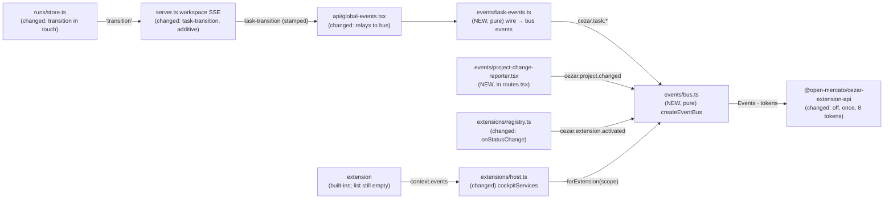

# Extension Event API — `on`, `off`, `once`, `emit` and the first public core events

> Slug: `extension-event-api` · Status: **designed, decisions confirmed by the owner, awaiting
> implementation** · Epic 1 (Extension Runtime), item 5. Builds on:
> - item 1, `2026-09-18-extension-api-package.md`: `EventToken`, `defineEvent` and the `Events`
>   contract, merged in #3;
> - item 2, `2026-09-18-extension-registry.md`: the lifecycle and the `services(scope)` seam,
>   merged in #6;
> - item 3, `2026-09-19-command-api.md`: the pattern this item copies, a pure registry with a
>   core view and `forExtension(scope)`, merged in #11.
>
> It does not depend on item 4 (#17). This spec covers **the event bus, the extension-facing
> `events` service and the first public core events**. Storage, components, a management UI and
> the loader are later items.
>
> Delivery: two PRs to `main`.
> - **PR 1 (Phases 1–2):** the bus, the service and `cezar.extension.activated`.
> - **PR 2 (Phase 3):** the task events (a server-side transition feed on the workspace stream)
>   and `cezar.project.changed`.

## 📝 TLDR

Extensions already have a typed `context.events` (`on`, `emit`), but the cockpit fails every
call with "not available in this Cezar version yet". The contract has no `off` or `once`, and
core emits nothing an extension could react to.

The proposal adds an **event bus** to the cockpit (`packages/web/src/events/`) and completes the
contract with `off` and `once`. Extension events stay in their owner's namespace: only `acme.x`
may emit `acme.x.*`, and only core may emit `cezar.*`. Every listener is registered through the
activation's scope, so deactivating an extension removes all its listeners, including deliveries
already queued.

Core emits these **public events**:

- **every status change**, as `cezar.task.status-changed`;
- **semantic task events:** `cezar.task.started`, `cezar.task.completed`, `cezar.task.failed`,
  `cezar.task.cancelled` and `cezar.task.archived`;
- `cezar.project.changed` and `cezar.extension.activated`.

The server detects task transitions in the run store and sends them on the workspace SSE stream
as one new, additive event.

## Decisions (confirmed by the owner, 2026-09-19)

The brief left these open. PR #21 first proposed autonomous defaults; the owner then answered
each question. Rows marked *changed* differ from the first draft.

| # | Question | Decision | Why |
|---|---|---|---|
| Q1 | Should the bus and the core event sources be separate specs? | **One spec, three phases, two PRs.** Phases 1–2 (PR 1) build the bus, the extension service and `cezar.extension.activated`, and meet all four DoD checks (§ Phasing). Phase 3 (PR 2) adds the task and project events. | The DoD needs at least one public event, and activation depends on neither the stream nor the router. PR 2 touches the server, the SSE protocol and the stream hot path, so it gets its own review. |
| Q2 | What format do core event ids take? | **`cezar.`-prefixed, kebab-case segments**, for example `cezar.task.started` and `cezar.task.status-changed`. | Item 1 reserves the `cezar` publisher for core, and item 3 names commands the same way. The id grammar (`ids.ts`: `[a-z0-9][a-z0-9-]*` segments) has no uppercase, so the owner's `statusChanged` is spelled `status-changed`. |
| Q3 | "Private/namespaced" extension events: may other extensions listen, or only the owner? | **The owner alone emits; any extension may listen.** "Private" means *owned*: nobody else can emit into `acme.x.*`. No extension may emit any `cezar.*` id, not even a built-in whose own id is under `cezar` (registry Q6 allows those), so core events cannot be spoofed. | This is item 1's merged `Events` contract, and it matches command visibility. Every extension shares one origin, so a listen restriction would not be a security boundary. |
| Q4 | Where do task events come from? *(changed)* | **The server.** `RunStore` detects each status or archive transition at its single broadcast point (`touch`). The workspace stream relays it as a new stamped event, `task-transition`, and the cockpit maps that to bus events for **every project**. The change is additive: no existing route or event changes, and `BACKWARD_COMPATIBILITY.md` gains the new name. | The server knows the true previous state, so no event is guessed. The first draft's client-side cache baselines and `archivedAt` recency window are gone. |
| Q5 | What do the task events mean? *(changed)* | **A canonical event plus semantic events.** `cezar.task.status-changed` fires on *every* status change. On top of it:<br>• `cezar.task.started`: into `running` from anything but `running` and `waiting`;<br>• `cezar.task.completed`: into `done` or `review` from outside that pair (successful completion);<br>• `cezar.task.failed`: into `failed`;<br>• `cezar.task.cancelled`: into `cancelled`;<br>• `cezar.task.archived`: `archived` becomes `true`; restoring a task emits nothing. | `status-changed` gives flexibility, and each semantic event lets an extension subscribe to exactly what it means (`on(TaskFailed, …)`) without filtering. The extra tokens cost nothing. `review` counts as success: a finished, successful run with changes waiting for a human (`docs/reference.md`, review gate). |
| Q6 | What does `project.changed` track, and do late subscribers get the current value? | **The registered project the URL shows** (`/p/:projectId` after `default` normalization), and `null` on workspace pages and on the "not registered here" screen. The value starts at `null`, and the event fires on every change. **No replay and no getter.** | That is the switch the user sees. A `cezar.project.current` command can follow additively if extensions need it. |
| Q7 | "Removing an extension clears its listeners": what is removal? | **Deactivation**, whether explicit or the end of a failed or timed-out activation. It disposes every listener through `scope.track()` and drops deliveries not yet made. `unregister` ships with the management-UI or loader item. | The registry has no unregister (registry Q5), and the scope seam already guarantees the cleanup. |
| Q8 | Several open cockpits (tabs, a phone) each receive the same task event. What should happen? | **Every page reacts; this is documented.** The README warns never to trigger a non-idempotent action (for example `TaskContinue`) from a task event. Choosing one leader page is out of scope. | It needs no extra mechanism. The warning covers the one risky use. |

## 📝 Problem Statement

- **The contract exists, but the cockpit does not honour it.** `packages/extension-api/src/events.ts`
  documents asynchronous delivery, isolated listeners and namespace ownership. The cockpit's
  `unavailableServices` (`packages/web/src/extensions/host.ts`) fails `events.on` and
  `events.emit`. The worked example, `examples/hello-extension`, emits `example.hello.greeted`,
  but nothing receives it.
- **There is no `off` or `once`.** The only way to unsubscribe is to keep the `Disposable`. To
  wait for the next completion, an extension must dispose inside its own listener, the
  bookkeeping `once` exists to remove.
- **Nothing to react to.** No code, on the server or in the cockpit, names a task transition.
  The store emits the whole `RunRecord` on every change (`RunStore.touch`), once per step and
  per token update, and the cockpit folds it into its caches (`api/global-events.tsx`). The
  workspace stream sends no snapshot on connect. An extension that wants "a task failed" would
  have to open its own `EventSource` and diff records itself, with no way to know the state
  before its first message.
- **A project switch is equally invisible.** `ProjectScopeRoute` (`routes.tsx`) re-scopes the
  API client when the URL changes, and nothing outside the routed subtree learns about it.

## 📝 Proposed Solution

1. **One bus per cockpit**, `createEventBus()` in `packages/web/src/events/bus.ts`. It is a pure
   module, like `commands/registry.ts`: it imports only the extension API, with no React, no DOM
   and no module state.
2. **Two views of one bus.** Core code uses the bus directly: it emits only `cezar.*` ids and can
   subscribe to anything. Each extension activation gets `bus.forExtension(scope)`, the `Events`
   it sees as `context.events`. Every subscription goes through `scope.track()`. That tracking is
   what makes the DoD's cleanup automatic.
3. **The contract gains `off` and `once`.** § Delivery, precisely pins the host semantics:
   asynchronous FIFO delivery, per-listener isolation, a JSON snapshot taken at emit time, a
   cascade depth limit and a per-macrotask delivery budget.
4. **Public core events.** Their tokens live in `packages/extension-api/src/core-events.ts`, so
   extensions subscribe with compile-time payload types. They come from three points:
   - `RunStore.touch` detects a task transition. The workspace SSE stream relays it as
     `task-transition`, and the cockpit maps it to `cezar.task.*`;
   - a `ProjectChangeReporter` in the router emits `cezar.project.changed`;
   - the registry's new `onStatusChange` callback emits `cezar.extension.activated`.
5. **Two kinds of event, one rule.** Core events are `cezar.*` and only core emits them.
   Extension events are `${extension.id}.*` and only their owner emits them. Anyone may listen.
   Names cannot collide because every id sits under exactly one owner's prefix.

### Prior art

- **Obsidian** (`Events.on/off/offref/trigger`, `Plugin.registerEvent(ref)`): listeners
  registered through the plugin detach automatically on unload. We adopt that, using
  `scope.track()`, and adopt `off` by listener reference.
- **VS Code** (`EventEmitter`, `Event<T>` returning a `Disposable`): no `off`; `fire` is
  synchronous and isolates listener errors. We adopt the `Disposable` return and the isolation,
  but deliver asynchronously (item 1's contract) on one shared, namespaced bus.
- **Node `EventEmitter`** (`on/off/once/emit`): `off` removes the single most recently added
  instance. Our `off` removes *every* subscription of that listener to that event made by the
  caller, so after `off` the listener is never called again.
- **Grafana** (`getAppEvents().subscribe(EventClass, handler)`): typed event classes identify
  events, the closest match to `EventToken`. We keep matching tokens by `id`, because every
  bundle carries its own copy of the package.
- **GitHub webhooks** (`pull_request` with an `action` such as `opened`/`closed`, plus
  `check_suite` and `workflow_run` with a `conclusion`): one canonical event carrying the state
  sits next to narrower named events. That is the owner's `status-changed` plus semantic-events
  model.
- **mitt** (`on('*', …)`): the wildcard handler is deferred. It would let one extension observe
  every other extension's traffic by default, and nothing in the brief needs it.

### Alternatives considered

- **Derive task events in the cockpit from `run` records.** This was the first draft's choice.
  The owner rejected it (Q4). It needed per-task baselines from the query caches, an
  `archivedAt` recency window guarded against clock skew, and it still missed any task whose
  first message was already the transition.
- **Server-side semantic event names on the wire** (`task-completed`, `task-failed`, …). Rejected:
  the wire carries one neutral transition, the minimal protocol addition. Naming what a
  transition *means* is the extension layer's job and can grow there without a protocol change.
- **Use a library** (mitt, eventemitter3). Rejected: the emitter core is a few dozen lines. The
  real work is namespaces, scope tracking, snapshots, isolation and the storm guards, and the
  extension runtime takes no dependencies.
- **Synchronous delivery.** Rejected: item 1 promises asynchronous delivery. Synchronous
  delivery would run extension code inside the SSE message handler.
- **DOM `EventTarget` / `CustomEvent`.** Rejected: it is DOM-bound, has no ownership and no
  per-extension cleanup.

## 📝 Architecture



The server names *that* a task changed state, the cockpit names *what it means*, and extensions
reach it only through `context.events`.

- **Server (PR 2).**
  - `RunStore` keeps a `Map<runId, { status, archived }>` snapshot. It is seeded in `open()`
    from the reconciled records, recorded without an event on a run's first `touch` (creation,
    `queued`), and dropped on delete and prune.
  - `touch(run)` compares against the snapshot. On a status or archive change it emits
    `('transition', { run, previousStatus, previousArchived })` right after `('run', run)`.
  - In `attach()`, the workspace SSE handler (`server.ts`, `GET /workspace/events`) subscribes
    to `'transition'` and writes a stamped `task-transition` event.
  - The per-project streams do not carry it. Widening the boot-project stream is a breaking
    change (`BACKWARD_COMPATIBILITY.md` § 2).
- **Contract (PR 2).** `taskTransitionEventSchema` in `packages/contract/src/runs.ts` (additive)
  is what the cockpit's parser validates against: Zod at the boundary.
- **Cockpit placement.** `packages/web/src/events/`:
  - `bus.ts`, pure;
  - `task-events.ts`, pure: a function from one wire transition to its bus events;
  - `provider.tsx`;
  - `project-change-reporter.tsx`;
  - tests beside each file.

  `api/events.ts` is a different thing: it parses the server's stream. `events/` is the
  in-browser bus.
- **Boot order.** `main.tsx` creates the query client, the command registry and the event bus,
  then registers the core commands. It starts the extension host with
  `cockpitServices({ commands, events })` and `onStatusChange: extensionLifecycleEvents(events)`,
  then renders `<App queryClient commands events />`. Rendered without `events` (tests), `App`
  creates its own bus.
- **Stream (PR 2).** `task-transition` joins the stamped names `global-events.tsx` listens to.
  With a bus present (from `EventBusProvider`, `null` outside it), each parsed transition goes
  through `taskEventsFor()` and onto the bus. That happens *before* the active-project filter,
  and the filter itself does not change, so another project's transitions still reach
  extensions. A `task-transition` never patches a cache: the `run` event that precedes it
  already did.
- **Extension API package.** Adds `Events.off`, `Events.once`, TSDoc updates and
  `core-events.ts`: eight tokens and their payload types, exported from the barrel. No new error
  codes.
- **Not in this item:**
  - wildcard subscriptions, replay or sticky events, and a current-project getter;
  - `task.deleted`, `task.restored` and `extension.deactivated`;
  - listener caps and leak warnings;
  - replay of transitions missed during a disconnect;
  - a leader page;
  - a devtools event log.

## 📝 API Contracts

### Extension API changes (`packages/extension-api`)

```ts
// events.ts — two methods join the interface; TSDoc restated as § Delivery, precisely
export interface Events {
  /** Calls `listener` for every later emit of `event`. The Disposable removes this one subscription. */
  on<P>(event: EventToken<P>, listener: (payload: P) => void): Disposable
  /** Like `on`, for the first later emit only; detached before that emit is delivered. */
  once<P>(event: EventToken<P>, listener: (payload: P) => void): Disposable
  /** Removes every subscription of `listener` to `event` made through this context (`once` included). No-op when there is none. */
  off<P>(event: EventToken<P>, listener: (payload: P) => void): void
  /** Payload-less events are emitted as `emit(token)`. */
  emit<P>(event: EventToken<P>, ...payload: [P] extends [void] ? [] : [payload: P]): void
}
```

`errors.ts` gains no codes. Its TSDoc widens three existing ones:

- `invalid-id`: a value that is not `{ kind: 'event', id: <valid ContributionId> }` passed to
  `on`, `once`, `off` or `emit`;
- `invalid-input`: an event payload that is not JSON, or a listener that is not a function;
- `disposed`: covers the events methods.

`namespace-violation` already names "an extension emitting a core (`cezar.*`) event".

```ts
// core-events.ts (NEW) — the first cezar.* event tokens
/** A task, as core events name it. Assignable to `TaskRef`, so it can be passed to the task commands. */
export interface TaskEvent {
  readonly taskId: string
  /** The registered project that owns the task — always present, unlike `TaskRef.projectId`. */
  readonly projectId: string
  /** The status now: `queued`, `running`, `waiting`, `review`, `done`, `failed` or `cancelled` today (the union may grow). */
  readonly status: string
}
export interface TaskTransition extends TaskEvent {
  /** The status the server held before this change. */
  readonly previousStatus: string
}
export interface ProjectChange {
  /** The project the cockpit now shows; `null` on a page that belongs to no project. */
  readonly projectId: string | null
  readonly previousProjectId: string | null
}
export interface ExtensionActivation {
  readonly extensionId: string
  readonly version: string
}

/** Every status change; the canonical event the semantic ones below refine. */
export const TaskStatusChanged = defineEvent<TaskTransition>('cezar.task.status-changed')
export const TaskStarted = defineEvent<TaskTransition>('cezar.task.started')
export const TaskCompleted = defineEvent<TaskTransition>('cezar.task.completed')
export const TaskFailed = defineEvent<TaskTransition>('cezar.task.failed')
export const TaskCancelled = defineEvent<TaskTransition>('cezar.task.cancelled')
export const TaskArchived = defineEvent<TaskEvent>('cezar.task.archived')
export const ProjectChanged = defineEvent<ProjectChange>('cezar.project.changed')
export const ExtensionActivated = defineEvent<ExtensionActivation>('cezar.extension.activated')
```

The payloads are narrow view models: ids and statuses only, with no prompt, title or path.
`status` is a `string` because this package never imports the contract (item 3's reason for
`runner: string`). A payload works as a task command input:
`events.on(TaskCompleted, (task) => commands.execute(TaskArchive, task))`. That line archives
the task once per open cockpit (Q8). Archiving twice is harmless, but continuing twice starts
two sessions, so the README forbids non-idempotent reactions to task events.

### Host bus (`packages/web/src/events/bus.ts`, cockpit-internal)

```ts
export interface EventBus {
  /** Core emit: `cezar.*` ids only. Throws `invalid-id`, `namespace-violation`, `invalid-input`. */
  emit<P>(event: EventToken<P>, ...payload: [P] extends [void] ? [] : [payload: P]): void
  /** Core subscription (tests, future core consumers). Throws `invalid-id`, `invalid-input`. */
  on<P>(event: EventToken<P>, listener: (payload: P) => void): Disposable
  /** The `Events` one extension activation sees as `context.events`. */
  forExtension(scope: ExtensionScope): Events
}

export interface EventBusOptions {
  /** Every listener failure, dropped cascade and deferred backlog. Default: one `console.error` line. Called inside try/catch. */
  readonly onError?: (report: EventErrorReport) => void
  /** Deepest chain of emits made from inside listeners before an emit is dropped. Default 16. */
  readonly maxCascadeDepth?: number
  /** Listener calls allowed between two macrotasks before the queue yields. Default 1_000. */
  readonly deliveryBudget?: number
}

export interface EventErrorReport {
  /** The listener's (or, for `cascade`, the emitter's) extension; `undefined` for core. */
  readonly extensionId: ExtensionId | undefined
  readonly eventId: ContributionId
  readonly kind: 'listener' | 'cascade' | 'backlog'
  readonly error: unknown
}

/** Recognised by `isExtensionError` (duck-typed on `code`). */
export class EventError extends Error {
  override readonly name: 'EventError'
  readonly code: ExtensionErrorCode
  readonly eventId?: ContributionId
}

export function createEventBus(options?: EventBusOptions): EventBus
```

### Delivery, precisely

`emit(token, payload?)` runs these steps for either view, in order:

1. **Live.** The extension view calls `scope.assertLive()` first, so an emit after
   deactivation throws `disposed`.
2. **Resolve.** If `token` is not an object with `kind === 'event'` and a valid `id`, it throws
   `invalid-id`.
3. **Own.** The extension view refuses every `cezar.*` id first, whatever the extension's own
   id. A built-in extension under the `cezar` publisher emits only through core code. Then it
   requires the id to start with `${extension.id}.`. The core view requires `cezar.`. Anything
   else throws `namespace-violation`.
4. **Snapshot the payload** with `JSON.stringify`. If it throws (a cycle, a `bigint`), the emit
   throws `invalid-input`, naming the event and never the value. If the snapshot is `undefined`
   (a payload-less event, or a top-level function), listeners receive `undefined` and nothing
   is parsed. Otherwise listeners receive exactly this JSON projection: functions and
   `undefined` fields are dropped and a `Date` becomes a string. Item 1's compile-time `IsJson`
   keeps such values out of typed code.
5. **Bound the cascade.** Each queued delivery carries a depth. An emit made while a listener
   runs synchronously is queued at that delivery's depth + 1; any other emit is at depth 0.
   Beyond `maxCascadeDepth`, the emit is dropped and reported (`kind: 'cascade'`), and `emit`
   returns normally.
6. **Snapshot the listeners.** The subscriptions to that id that are live now are captured in
   subscription order. Any `once` subscription among them leaves the event's subscriber list
   now, so a second emit cannot reach it. Until it is delivered, `off`, its `Disposable` or its
   extension's deactivation can still cancel it.
7. **Queue.** Append the delivery to the bus's single FIFO queue and return; `emit` never waits
   on a listener. The queue drains in a microtask. After `deliveryBudget` listener calls
   without a macrotask in between, draining pauses and resumes in the next macrotask (a
   `MessageChannel` post, as React's scheduler does). The first pause of a streak is reported
   (`kind: 'backlog'`).
8. **Deliver.** Each snapshotted subscription that is still live gets its own copy of the
   payload (`JSON.parse` of the snapshot). A subscription is not live when it was disposed or
   `off`-ed, or its extension was deactivated, since the emit. A synchronous throw, or a
   rejection of a returned promise, is reported (`kind: 'listener'`) and delivery continues. A
   delivered `once` subscription is untracked from its scope.

Guarantees:

- Emits are delivered in emit order, and within one emit, in subscription order.
- A listener receives only events emitted after it subscribed.
- No listener failure reaches the emitter or another listener, and the extension that owns a
  failing listener stays `active`.
- Rendering always gets a turn.

**`on(token, listener)` / `once(token, listener)`** (extension view):

1. `scope.assertLive()`;
2. a malformed token throws `invalid-id`;
3. a listener that is not a function throws `invalid-input`;
4. the subscription goes through `scope.track()`, and the returned `Disposable` is the tracked
   handle: idempotent, and it untracks.

Any well-formed id may be subscribed. A subscription to an id nobody emits is inert, so an
extension written for a newer Cezar still activates on an older one.

**`off(token, listener)`** (extension view):

1. `scope.assertLive()`;
2. a malformed token throws `invalid-id`;
3. it disposes every subscription *of the calling extension* whose id is `token.id` and whose
   listener is `===` the given one, `on` and `once` alike. That includes a pending `once`: the
   extension view keeps its own index, so `off` reaches it. Any snapshotted delivery to a
   disposed subscription is skipped.

If nothing matches, `off` does nothing. It never touches another extension's subscriptions.

**Cleanup.** When an activation ends (after `deactivate()` settles or times out, or when
`activate()` fails), the scope disposes every tracked subscription. From that point none of
that extension's listeners runs again, including for events emitted before the end and not yet
delivered. While `deactivate()` itself is running, the extension is still active and its
listeners may still be called.

### Server: the `task-transition` workspace event (PR 2)

```ts
// packages/contract/src/runs.ts (additive)
export const taskTransitionEventSchema = z.object({
  /** The registered project, as on every stamped workspace event. */
  project: z.string(),
  id: z.string(),
  status: runStatusSchema,
  previousStatus: runStatusSchema,
  archived: z.boolean(),
  previousArchived: z.boolean(),
});
```

- **Emitted by** `RunStore.touch` when `status` or `archived` differs from the store's snapshot
  of that run. Other field changes (tokens, steps, titles) produce no transition. Several
  changes made to a run between two `touch` calls produce one transition, from the last
  broadcast state to the current one.
- **Carried by** `GET /api/v1/workspace/events` only, as event `task-transition`. It is written
  right after the `run` event for the same `touch`.
- **Not carried by** the per-project streams, because widening them is breaking.
- **Compatibility.** The name is additive and inert to older cockpits, whose `EventSource`
  never listens for it. `BACKWARD_COMPATIBILITY.md` § 2 lists it among the workspace names. The
  server builds the frame as `z.infer<typeof taskTransitionEventSchema>`, the same schema the
  cockpit parses with, so no api-client mirror (and no `api-types.test.ts` pair) is needed.
- **Not emitted** at boot. The snapshot is seeded *after* `reconcileLoadedRun`, so an
  interrupted run the server rewrites from `running` to `failed` on restart emits nothing, and
  no stream is open yet anyway.
- **Not emitted** for a new run's creation (`queued`). Its first real transition is
  `queued → running`.

### Task events (`packages/web/src/events/task-events.ts`)

```ts
export type TaskBusEvent = { readonly token: EventToken<TaskTransition> | EventToken<TaskEvent>; readonly payload: TaskTransition | TaskEvent }
/** One wire transition → its bus events, in emit order. Pure. */
export function taskEventsFor(transition: TaskTransitionWire): readonly TaskBusEvent[]
```

| Wire change | Bus events, in order |
|---|---|
| `status !== previousStatus` | `cezar.task.status-changed`, always first |
| into `running` from anything but `running`/`waiting` | then `cezar.task.started` |
| into `done` or `review` from outside that pair | then `cezar.task.completed` |
| into `failed` | then `cezar.task.failed` |
| into `cancelled` | then `cezar.task.cancelled` |
| `archived` from `false` to `true` | last, `cezar.task.archived` |

These rules are what they mean in practice:

- **Answering an agent's question** (`waiting` → `running`, a run parked on a `CEZ:ASK`) is a
  status change but not a start.
- **Accepting a review** (`review` → `done`) is a status change but not a second completion.
- **A Continue, a send-back or an auto-resume** (any finished status → `running`) is a start.

### Core events

| Token | Id | Payload | Source |
|---|---|---|---|
| `TaskStatusChanged` | `cezar.task.status-changed` | `TaskTransition` | `task-transition` |
| `TaskStarted` | `cezar.task.started` | `TaskTransition` | `task-transition` |
| `TaskCompleted` | `cezar.task.completed` | `TaskTransition` | `task-transition` |
| `TaskFailed` | `cezar.task.failed` | `TaskTransition` | `task-transition` |
| `TaskCancelled` | `cezar.task.cancelled` | `TaskTransition` | `task-transition` |
| `TaskArchived` | `cezar.task.archived` | `TaskEvent` | `task-transition` |
| `ProjectChanged` | `cezar.project.changed` | `ProjectChange` | `ProjectChangeReporter` |
| `ExtensionActivated` | `cezar.extension.activated` | `ExtensionActivation` | Registry `onStatusChange` |

`cezar.extension.activated` is emitted after the new extension's own listeners are live, so it
also receives its own activation.

### Project change reporter (`packages/web/src/events/project-change-reporter.tsx`)

A component that renders `null`, mounted once inside the router in `routes.tsx`, above both
the `/p/:projectId` tree and the workspace routes. It works out the shown project:

- no `matchPath('/p/:projectId/*')` → `null` (global Tasks, global settings);
- `default` → nothing yet (the route normalizes it with a replace navigation);
- `useProjects()` loaded and the id unknown → `null`;
- registry still loading → nothing yet;
- registry errored → the URL's id, the same stance `ProjectScopeRoute` takes. The exception is
  `/p/default` with no `health.bootProject`: nothing is emitted until the registry or health
  answers.

In an effect, it emits `ProjectChanged { projectId, previousProjectId }` whenever that value
differs from the last one it emitted. The last value is held in a ref and starts as `null`. A
page that loads on a workspace route therefore emits nothing until the user opens a project,
and StrictMode's double effect never emits twice.

### React bindings (`packages/web/src/events/provider.tsx`)

```tsx
/** `bus` omitted → one bus per provider (tests). Read once, at mount. */
export function EventBusProvider(props: { bus?: EventBus; children: ReactNode }): ReactNode
/** The page's bus, or `null` outside EventBusProvider — every core event source is optional. */
export function useEventBus(): EventBus | null
```

`App` mounts `EventBusProvider` beside `CommandsProvider`, above `GlobalEventsProvider` and the
router. `useEventBus` returns `null` instead of throwing. That way every existing test that
renders `useGlobalEvents` or a route without the provider keeps its current behaviour.

## 📝 UI/UX

No visible change. The bus, the mapper and the reporter render nothing, and no screen reads
them. The run list, the global Tasks page and the project switcher behave exactly as today. The
existing `global-events` and `routes` tests are the proof (§ Implementation Plan).

## 📝 Edge Cases & Failure Scenarios

**Bus and listeners**

| Scenario | Behaviour |
|---|---|
| A listener throws or rejects | Reported (`[cezar:extensions] <ext>: listener for <event> failed`). The emitter, the other listeners and the extension's status are unaffected. |
| Emit with a non-JSON payload (a cycle, a `bigint`) | `emit` throws `invalid-input` and nothing is delivered. |
| The emitter mutates the payload after `emit`, or a listener mutates its own | Neither is visible to anyone else: every listener has its own snapshot. |
| An extension emits `cezar.*` (even a built-in with a `cezar.*` id) or another extension's id | `namespace-violation`, thrown synchronously. |
| An extension subscribes to an id nobody emits (a typo, a newer core event) | Allowed and inert. |
| A malformed token, or a listener that is not a function | `invalid-id` / `invalid-input`, thrown. |
| `off` with a different function object (a re-created arrow) | No-op. Keep the reference or use the `Disposable`. |
| The same listener subscribed twice | It is called twice per emit. `off` removes both; each `Disposable` removes one. |
| `once`, then two quick emits | Only the first is delivered. |
| `once`, emit, then `off` before the flush | Not delivered: a pending `once` stays cancellable. |
| `off` or `dispose`, or the extension deactivates, between the emit and the delivery | Not delivered. After `deactivate` resolves, none of its listeners runs again. |
| `activate()` subscribes, then throws or times out | The scope ends and its listeners are disposed. |
| Any events call after deactivation | `on`, `once`, `off` and `emit` throw `disposed`. |
| A synchronous re-emit ping-pong | Delivered up to depth 16. The next emit is dropped and reported once. |
| An async re-emit (after an `await`), or a 2× fan-out | The depth does not follow an `await`. The delivery budget still yields every 1,000 calls, so the page keeps rendering, and the first pause is reported as `backlog`. |
| A listener doing heavy synchronous work | It blocks the main thread like any extension code (a later worker runtime). |

**Task events**

| Scenario | Behaviour |
|---|---|
| A task that was already running when the cockpit loaded finishes | Exact: `status-changed`, then `completed`/`failed`/`cancelled`. The server knows the previous state. |
| The stream drops and reconnects | Transitions during the gap are lost: the workspace stream has no replay. Everything after the reconnect is exact. |
| The server restarts | The snapshot is re-seeded from the reconciled records. Boot-time rewrites (interrupted run → `failed`) emit nothing. |
| An agent's question is answered (`waiting` → `running`) | `status-changed` only. |
| `review` → `done` (a review accepted) | `status-changed` only. `completed` fired when the run entered `review`. |
| `review` → `running` (sent back) → `done` | `status-changed` and `started`, then `status-changed` and `completed` again. |
| A usage-limit parking (spec `2026-08-03-auto-resume-after-usage-limit`) | `failed` when parked, then `started` (previous `failed`) when the resume runs. `autoResumeAt` is not in the payload. |
| `queued` → `cancelled` | `status-changed` and `cancelled`, with no `started` before them. |
| A task archived from anywhere (the UI, the CLI, the sweep, an extension) | `archived`, exactly once per `false → true`. Re-archiving an archived task changes nothing, so nothing is emitted. |
| Status and archive change between two `touch` calls | One transition: the status events, then `archived`. |
| A task is deleted | The store drops its snapshot. No event (`task.deleted` can be added later). |
| Two tabs, or a tab plus a phone | Each page receives the stream and runs its own extensions. A reaction runs once per page (Q8); non-idempotent reactions are documented as unsafe. |
| The mapper or the bus throws inside the SSE handler | Caught and logged. The `run` frames and the caches are unaffected. |
| An older cockpit connected to a newer server | It never listens for `task-transition`, so nothing changes for it. |

**Project events**

| Scenario | Behaviour |
|---|---|
| An extension activates after the first `project.changed` | It misses the current value (Q6) and hears the next change. |
| `/p/default/…` | Only the normalized slug is emitted. With the registry errored and no health answer, nothing is emitted. |
| StrictMode double-invokes effects and initializers | The reporter deduplicates against the last emitted value. The bus is created once per page. |

## 📝 Risks & Impact Review

- **Changing a mechanism that works (AGENTS.md).** PR 2 touches two load-bearing paths:
  - `RunStore.touch` runs on every token update. The addition is one Map lookup and two
    comparisons, and it emits a second store event only on a real transition. Every
    construction site of the snapshot must stay in step: seed in `open()`, record on create,
    drop in `deleteRun` and `pruneOldRuns`, and grep `this.runs.delete` for any other. A
    missing drop leaks a row; a missing seed turns the first post-boot touch of an old run into
    a silent baseline. Neither emits a wrong event.
  - The `useGlobalEvents` message loop gains one more stamped name. The relay runs only with a
    bus present, never patches a cache, and is wrapped so a throw costs nothing. The existing
    `global-events` and store tests must pass without changes.
- **Protocol growth.** The workspace stream gains `task-transition`. It is additive by the
  compatibility doc's own rule ("a new workspace event name is inert to older consumers"), and
  `BACKWARD_COMPATIBILITY.md` § 2 is updated in the same PR. Removing it later would be a
  breaking change for extensions that rely on task events, so it is a durable contract.
- **Contract growth.** `Events` gains `off` and `once`, which breaks only the cockpit
  placeholder and the package's test fake; both change in PR 1. Eight tokens and four payload
  types are added. There are no new error codes.
- **Delivery storms.** The cascade depth stops synchronous chains, and the delivery budget
  guarantees rendering gets a turn. A buggy extension can keep the bus busy, but cannot freeze
  the page.
- **Duplicate reactions across pages (Q8).** Documented, not prevented.
- **Security and privacy.** Payloads carry ids and statuses only. The workspace stream already
  carries full run records to the same origin, so the new event exposes nothing new. Any
  extension can listen to any extension's events (Q3), so no secret belongs in an event
  payload; the README says so.
- **Rollback.** PR 1: revert the bus, the host wiring and the extension API additions. PR 2:
  also revert the store snapshot, the SSE event and its compatibility-doc line. Nothing is
  persisted.

## 📋 Phasing

The brief's Definition of Done, and where each check is proven:

1. **An extension can subscribe to a public event.** Steps 3 and 5.
2. **Unsubscribing works correctly** (`off`, the `Disposable`, a `once` after its delivery,
   and a pending delivery cancelled). Step 3.
3. **Extension event names do not collide.** Every id sits under exactly one owner's prefix,
   and no extension may emit into `cezar.*` or another's prefix. Step 3.
4. **Removing an extension clears its listeners** (removal is deactivation or a failed
   activation, per Q7). Steps 3 and 5.

Each phase leaves the app working.

1. **Phase 1 — The bus and the contract** (PR 1). `off`/`once` in the extension API, and the
   pure bus with its core and extension views, fully unit-tested. Nothing is wired in yet.
2. **Phase 2 — The extension service and `cezar.extension.activated`** (PR 1). Registry
   `onStatusChange`, `cockpitServices({ commands, events })`, the `main.tsx` boot order and the
   PR 1 docs. This meets all four DoD checks end to end.
3. **Phase 3 — Task and project events** (PR 2). The server transition feed, the `task-events`
   mapper and its stream hook-up, the project reporter, their tokens, the compatibility doc and
   the PR 2 docs.

## 📋 Implementation Plan

Every step keeps `npm run typecheck`, `npm test`, `npm run test:unit`, `npm run build` and
`npm run test:package` green. Bus tests are vitest tests in the `web` project. They use tokens
from `defineEvent` imported by package name and a recording `ExtensionScope` fake, the same one
the command registry's tests use (`fakeScope` in `commands/registry.test.ts`). Tests flush
delivery with `await Promise.resolve()` or `await vi.waitFor(…)`.

### Phase 1 — The bus and the contract (PR 1)

1. **Extension API: `off` and `once`.** Add both to `Events`, restate the TSDoc from § Delivery,
   precisely, and widen the `errors.ts` TSDoc. `test/fake-context.ts` records `on` and `once`
   listeners and removes them on `off`; it stays synchronous and semantics-free.
   `unavailableServices.events` gains `once: fails('events')` and `off: fails('events')`.
   *Test:* type tests in `commands-events.test.ts`:
   - `once` returns a `Disposable`;
   - `off` takes the token's listener type;
   - a listener with the wrong payload type is a compile error.

   The `unavailableServices` cases in `host.test.ts` cover the two new methods.
2. **The bus, core view.** `createEventBus`, `emit`, `on`, `EventError` and § Delivery,
   precisely. *Test* (`events/bus.test.ts`):
   - A core listener is not called before `emit` returns and is called after a flush, with the
     payload.
   - Order: subscription order within one emit, emit order across emits, and a listener added
     after an emit does not receive it.
   - Payload isolation: mutating the payload after `emit` changes nothing delivered; two
     listeners get distinct objects; a cycle or a `bigint` throws `invalid-input` and nothing
     is delivered; a payload-less emit delivers `undefined` without a parse error.
   - A throwing listener and a rejecting listener are each reported with `eventId` and
     `kind: 'listener'`, and later listeners still run. A throwing `onError` is swallowed.
   - A core emit outside `cezar.*` throws `namespace-violation`. `null`, a string,
     `{ kind: 'command', … }` and an invalid id throw `invalid-id`. A non-function listener
     throws `invalid-input`. Every error satisfies `isExtensionError`.
   - Cascade: a synchronous re-emit stops at `maxCascadeDepth` with exactly one `cascade`
     report.
   - Budget, with a small `deliveryBudget`:
     - an async ping-pong and a 2× fan-out both let a `setTimeout(0)` scheduled before the
       storm fire while the storm is still running;
     - exactly one `backlog` report per streak;
     - emit order is preserved across the pause.
3. **The extension view.** `forExtension(scope)` with `on`, `once`, `off` and `emit`. *Test:*
   - **DoD 1:** an extension subscribes to a `cezar.*` event and receives a core emit.
   - **DoD 2:**
     - after `off` the listener is never called;
     - `off` removes both of two duplicate subscriptions;
     - emit, `off`, then flush: the listener is not called;
     - the `on` `Disposable` behaves the same;
     - `off` of an unknown listener is a no-op;
     - `off` leaves another extension's subscription alone even when it uses the same
       function;
     - `once` fires once across two emits;
     - a `once` disposed before delivery never fires;
     - `once`, emit, `off`, flush: not called.
   - **DoD 3:**
     - `acme.a` emits `acme.a.ready`;
     - emitting `acme.b.ready` or `cezar.task.started` from `acme.a` throws
       `namespace-violation`;
     - an extension whose id is `cezar.task` emitting `cezar.task.started` throws
       `namespace-violation`;
     - `acme.a` and `acme.b` each emit their own `.ready`, and each listener receives only
       the event it subscribed to.
   - **DoD 4 at the bus level:**
     - subscriptions go through `scope.track()` and are gone after the scope ends;
     - an event emitted just before the scope ends is not delivered after it;
     - every method throws `disposed` afterwards.

### Phase 2 — The extension service and `cezar.extension.activated` (PR 1)

4. **Lifecycle event.** Add `ExtensionActivated` and `ExtensionActivation` to `core-events.ts`,
   the barrel and the surface snapshot. Add `onStatusChange(record, previous)` to
   `createExtensionRegistry`, called after each status change inside a try/catch. Add
   `extensionLifecycleEvents(bus)` to `host.ts`. *Test* (`registry.test.ts`): `onStatusChange`
   sees `registered → active`, `active → registered` and `registered → failed`, and a throwing
   callback leaves the status and the other extensions untouched. The existing registry tests
   pass unchanged.
5. **Boot wiring, the extension service, PR 1 docs.** `cockpitServices({ commands, events })`,
   with both of today's callers updated: `main.tsx` and the `cockpitServices` case in
   `host.test.ts`. `startExtensionHost` accepts `onStatusChange`. In `main.tsx`, the bus is
   created and passed to both before the host starts, and `App` accepts an optional `events`
   prop. Docs:
   - the README Events section: `on`, `once`, `off` and `emit`, delivery and isolation,
     ownership and namespaces, cleanup on deactivation, "no secrets in payloads", and
     `cezar.extension.activated`;
   - the README status note lists `events` as honoured;
   - an `AGENTS.md` task-routing row for `packages/web/src/events/`: the bus is pure; core
     emits `cezar.*` only and extensions emit only under their own id; every subscription goes
     through `scope.track()`; delivery is asynchronous with JSON snapshots and a delivery
     budget; a core token lands in `core-events.ts` in the same PR as its source.

   *Test* (`host.test.ts`, through `startExtensionHost` with `cockpitServices`):
   - **DoD 1, end to end:** fixture B subscribes to `ExtensionActivated` in `activate`, and
     fixture C, registered after it, activates. B receives `{ extensionId: C, version }`.
   - **DoD 4, end to end:** a fixture subscribes to `cezar.extension.activated` and to its own
     event, then `registry.deactivate(id)` resolves. After that, neither a core emit nor
     another extension's emit reaches it. A fixture that subscribes and then throws in
     `activate` is left with no listener. Cancelling a delivery already queued is proven at
     the bus level (Step 3).
   - The existing `unavailableServices` tests still pass. `main.tsx` has no unit test (as in
     items 2 and 3), so the order is checked in review.

### Phase 3 — Task and project events (PR 2)

6. **Server transition feed.**
   - The `RunStore` snapshot: seed in `open()` after reconcile, record on create, drop on
     delete and prune, and emit `'transition'` from `touch`.
   - `taskTransitionEventSchema` in the contract.
   - `task-transition` on the workspace stream only.
   - The `BACKWARD_COMPATIBILITY.md` § 2 line.

   *Test:*
   - Store:
     - `queued → running → done` emits two transitions with the right previous status;
     - a token-only `touch` emits none;
     - `setArchived(id, true)` twice emits one;
     - create emits none;
     - a store re-opened over a `runs.json` holding a `running` run emits nothing at boot, and
       its first later transition carries previous `failed`;
     - delete drops the snapshot.
   - Server (`packages/cezar/src/server/workspace-events.test.ts`): a transition arrives as
     `task-transition` with `project` after its `run` event; the boot-project `/api/v1/events`
     stream does not carry it.
7. **Task events in the cockpit.**
   - Add `TaskStatusChanged`, `TaskStarted`, `TaskCompleted`, `TaskFailed`, `TaskCancelled`,
     `TaskArchived`, `TaskEvent` and `TaskTransition` to `core-events.ts`, the barrel and the
     surface snapshot.
   - Add `events/task-events.ts`.
   - Add `EventBusProvider` / `useEventBus`, mounted by `App`.
   - Parse and relay `task-transition` in `useGlobalEvents`.

   *Test:*
   - `taskEventsFor`, table-driven:
     - `queued → running`: status-changed + started;
     - `waiting → running`: status-changed only;
     - `done → running`: status-changed + started;
     - `running → review`: status-changed + completed;
     - `review → done`: status-changed only;
     - `running → failed`: status-changed + failed;
     - `queued → cancelled`: status-changed + cancelled;
     - archive only: archived only;
     - status and archive together: the status events, then archived.
   - `global-events.test.tsx` (its fake `EventSource`):
     - a `task-transition` for the active project and one for another project both reach the
       bus with the right `projectId`;
     - a malformed frame is dropped;
     - a bus whose `emit` throws leaves the `run` patching intact;
     - every existing test passes unchanged without the provider.
8. **Project reporter.** Add `ProjectChanged` and `ProjectChange` to `core-events.ts`, and mount
   `ProjectChangeReporter` in `routes.tsx`. *Test:*
   - navigating `/p/a` → `/p/b` → `/tasks` emits `a` (previous `null`), `b` (previous `a`),
     then `null` (previous `b`);
   - `/p/default/…` emits only the boot slug;
   - an unknown project gives `null`;
   - StrictMode does not emit twice.
9. **PR 2 docs.**
   - The README core events table, with two notes: a disconnect gap is not replayed, and
     reactions run once per open cockpit, so never trigger a non-idempotent action such as
     `TaskContinue`. The auto-archive example sits beside them.
   - The `AGENTS.md` events row adds: the store is the only source of task transitions (never
     re-derive them in the cockpit), and the relay never patches a cache or throws into the
     message loop.
   - The `Runs store` routing row mentions the transition snapshot and its construction sites.

   *Test:* the validation gate.
