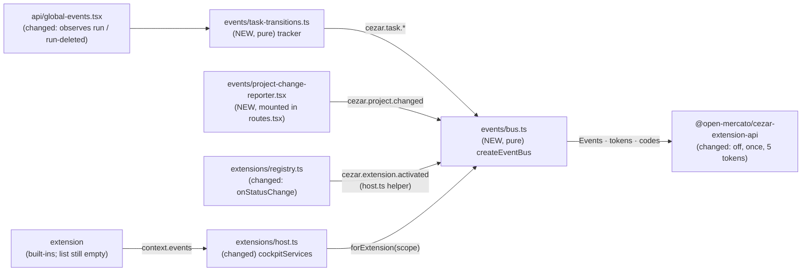

# Extension Event API — `on`, `off`, `once`, `emit` and the first public core events

> Slug: `extension-event-api` · Status: **designed, awaiting implementation** · Epic 1 (Extension
> Runtime), item 5. Builds on item 1, `2026-09-18-extension-api-package.md` (`EventToken`,
> `defineEvent` and the `Events` contract, merged in #3), item 2,
> `2026-09-18-extension-registry.md` (the lifecycle and the `services(scope)` seam, merged in #6),
> and item 3, `2026-09-19-command-api.md` (the pattern this item copies: a pure registry with a
> core view and `forExtension(scope)`, merged in #11). It does not depend on item 4 (#17). This
> spec covers **the event bus, the extension-facing `events` service and five public core
> events**. Storage, components, a management UI and the loader are later items. Delivery: two
> PRs to `main`. The first carries Phases 1–2: the bus, the service and
> `cezar.extension.activated`. The second carries Phase 3: the task and project sources, which
> touch the stream hot path.

## 📝 TLDR

Extensions already have a typed `context.events` (`on`, `emit`), but the cockpit fails every
call with "not available in this Cezar version yet". The contract has no `off` or `once`, and
core emits nothing an extension could react to.

The proposal adds an **event bus** to the cockpit (`packages/web/src/events/`) and completes the
contract with `off` and `once`. Extension events stay in their owner's namespace: only `acme.x`
may emit `acme.x.*`, and only core may emit `cezar.*`. Core emits five **public events**:
`cezar.task.started`, `cezar.task.completed`, `cezar.task.archived`, `cezar.project.changed` and
`cezar.extension.activated`. Every listener is registered through the activation's scope, so
deactivating an extension removes all its listeners, including deliveries already queued.

## Resolved assumptions (autonomous defaults)

The brief left these open. Each default is the most reversible choice, and all are safe to
override before merge. The extension API package is private and experimental, the bus is
internal to the cockpit, and no HTTP route, SSE event, state file or published surface changes.

| # | Question | Applied default | Why |
|---|---|---|---|
| Q1 | Should the bus and the core event sources (task stream, project route) be separate specs? | **One spec, three phases, two PRs.** Phases 1–2 build the bus, the extension service and `cezar.extension.activated`, and already meet all four DoD checks (§ Phasing). Phase 3 adds the task and project events on a second PR. | The DoD says an extension can subscribe to a *public* event, so core must emit at least one. Activation is the only one that needs neither the stream nor the router. The task events are why extensions want a bus, and the brief lists all five. |
| Q2 | Should event ids be the brief's bare `task.started` or namespaced? | **`cezar.task.started`, `cezar.task.completed`, `cezar.task.archived`, `cezar.project.changed`, `cezar.extension.activated`.** | Item 1 reserves the `cezar` publisher for core, and item 3 (Q3) used it for commands. A bare `task.started` would belong to a third-party publisher called `task`. |
| Q3 | "Private/namespaced" extension events: may other extensions listen, or only the owner? | **The owner alone emits; any extension may listen.** "Private" means *owned*: nobody else can emit into `acme.x.*`, so a listener knows where the event came from. No extension may emit any `cezar.*` id, not even a built-in whose own id is under `cezar` (registry Q6 allows those), so core events cannot be spoofed. | This is item 1's merged `Events` contract ("Any extension may listen to any event"). It matches command visibility, where extension commands are visible to all. Every extension shares one origin, so a listen restriction would not be a security boundary. It can still be tightened before any third-party extension exists (the loader item). |
| Q4 | Where do task events come from? | **The cockpit derives them from the existing workspace stream** (`run` / `run-deleted`) for **every project**. The payload carries `projectId`. No server or SSE change. They are **per-page notifications**, best-effort across disconnects (§ Edge Cases). Every open cockpit (each tab, a phone) sees the same transition, and choosing one leader page to act on it is out of scope. | The SSE vocabulary is a protected surface (`BACKWARD_COMPATIBILITY.md` § 2), and the stream already carries every project's records. A server-side source can replace the tracker later behind the same tokens. |
| Q5 | What exactly do the three task events mean? | **started:** the status becomes `running` from `queued` or from a finished status. A Continue, a send-back or an auto-resume counts. Answering an agent's question does not: `waiting` is a run parked on a `CEZ:ASK`, and it goes back to `running`. **completed:** the status becomes finished (`review`, `done`, `failed`, `cancelled`: the cockpit's `TERMINAL_STATUSES`) from `queued`, `running` or `waiting`, and `status` says how the task ended. **archived:** `archived` becomes `true`. Restoring a task emits nothing. | This reuses the cockpit's existing definition of "finished". The payload lets an extension filter. Separate `failed`, `cancelled` or `restored` events can be added later without breaking anything. |
| Q6 | What does `project.changed` track, and do late subscribers get the current value? | **The registered project the URL shows** (`/p/:projectId` after `default` normalization). It is `null` on workspace pages and on the "not registered here" screen. The value starts at `null`, and the event fires on every change, including the first project resolved after load. **No replay and no getter.** | That is the switch the user sees. The API scope is `null` for the boot project, which is an implementation detail. Replay or a getter would add contract surface; a `cezar.project.current` command can follow additively. |
| Q7 | "Removing an extension clears its listeners": the registry has no unregister, so what is removal? | **Deactivation**, whether explicit or the end of a failed or timed-out activation. It is the registry's only removal path. It disposes every listener through `scope.track()` and drops events that were emitted but not yet delivered. Unregister or uninstall ships with the management-UI or loader item. | Registry Q5 deferred runtime removal. The scope seam already guarantees cleanup, so a later `unregister` (deactivate, then delete the entry) gets it for free. |

## 📝 Problem Statement

- **The contract exists, but the cockpit does not honour it.** `packages/extension-api/src/events.ts`
  documents asynchronous delivery, isolated listeners and namespace ownership. The cockpit's
  `unavailableServices` (`packages/web/src/extensions/host.ts`) fails `events.on` and
  `events.emit`. The worked example, `examples/hello-extension`, emits `example.hello.greeted`,
  but nothing receives it.
- **There is no `off` or `once`.** The only way to unsubscribe is to keep the `Disposable`. To
  wait for the next completion, an extension must dispose inside its own listener. That is the
  bookkeeping `once` exists to remove, and every mainstream emitter (Node, Obsidian, mitt)
  offers both.
- **Nothing to react to.** The cockpit sees a task finish only as a cache patch. In
  `api/global-events.tsx`, each `run` SSE message carries the whole `RunRecord`, once per step
  and per token update, and is folded into the query cache. No code ever names the transition.
  An extension that wants to know "a task completed" has to open its own `EventSource` and diff
  records itself. That spends the per-origin connection budget the one-stream design protects
  (`global-events.tsx`, `useGlobalEvents`) and couples the extension to internals.
- **A project switch is equally invisible.** `ProjectScopeRoute` (`routes.tsx`) re-scopes the
  API client when the URL changes, and nothing outside the routed subtree learns about it.

## 📝 Proposed Solution

1. **One bus per cockpit**, `createEventBus()` in `packages/web/src/events/bus.ts`. It is a pure
   module, like `commands/registry.ts`: it imports only the extension API, with no React, no DOM
   and no module state.
2. **Two views of one bus.** Core code uses the bus directly: it emits only `cezar.*` ids and can
   subscribe to anything. Each extension activation gets `bus.forExtension(scope)`, the `Events`
   it sees as `context.events`. Every subscription goes through `scope.track()`. That tracking is
   what makes the DoD's cleanup automatic.
3. **The contract gains `off` and `once`.** § Delivery, precisely pins the host semantics the
   TSDoc promises: asynchronous delivery, per-listener isolation, and a JSON snapshot taken at
   emit time.
4. **Five public core events.** Their tokens live in
   `packages/extension-api/src/core-events.ts`, so extensions subscribe with compile-time
   payload types. They come from three existing points:
   - the registry's new `onStatusChange` callback emits `cezar.extension.activated`;
   - a pure task-transition tracker, fed by the stream `global-events.tsx` already holds, emits
     `cezar.task.*`;
   - a `ProjectChangeReporter` in the router emits `cezar.project.changed`.
5. **Two kinds of event, one rule.** Core events are `cezar.*` and only core emits them.
   Extension events are `${extension.id}.*` and only their owner emits them. Anyone may listen.
   Names cannot collide because every id sits under exactly one owner's prefix. The bus carries
   public events only. Core's internal signals stay where they already are: the SSE layer and
   React state.

### Prior art

- **Obsidian** (`Events.on/off/offref/trigger`, `Plugin.registerEvent(ref)`): listeners
  registered through the plugin detach automatically on unload. We adopt that, using
  `scope.track()`, and adopt `off` by listener reference.
- **VS Code** (`EventEmitter`, `Event<T>` returning a `Disposable`): no `off`; `fire` is
  synchronous and isolates listener errors. Extensions share events only through exported APIs.
  We adopt the `Disposable` return and the isolation. We deliver asynchronously (item 1's
  contract) and use one shared, namespaced bus instead of per-API emitters.
- **Node `EventEmitter`** (`on/off/once/emit`): `off` removes the single most recently added
  instance, and `maxListeners` warns at 10. Our `off` removes *every* subscription of that
  listener to that event made by the caller, so after `off` the listener is never called again.
  A listener-count warning is deferred.
- **Grafana** (`getAppEvents().subscribe(EventClass, handler)`, `BusEventWithPayload`): typed
  event classes identify events. That is the closest match to `EventToken`. We keep matching
  tokens by `id`, because every bundle carries its own copy of the package.
- **mitt** (`on('*', …)`): the wildcard handler is deferred. It would let one extension observe
  every other extension's traffic by default, and nothing in the brief needs it.

### Alternatives considered

- **Use a library** (mitt, eventemitter3). Rejected: the emitter core is a few dozen lines. The
  real work is namespaces, scope tracking, JSON snapshots, isolation and the cascade guard, and
  the extension runtime takes no dependencies (AGENTS.md, `packages/extension-api` row).
- **Synchronous delivery** (VS Code, Node). Rejected: item 1's contract promises asynchronous
  delivery. Synchronous delivery would run extension code inside the emitter's stack, including
  the SSE message handler, where a slow listener would delay cache patching. It would also rule
  out a later worker runtime.
- **Server-side lifecycle events** (a new workspace SSE event name). Deferred (Q4). It is exact,
  but it is a protocol addition and a server change. The tracker can be swapped for it behind
  the same tokens.
- **DOM `EventTarget` / `CustomEvent`.** Rejected: it is DOM-bound (the bus must run under
  vitest's Node environment), has no ownership or namespaces, and has no per-extension cleanup.
- **Put the bus in `packages/extension-api`.** Rejected: that package is a contract with no host
  code, by design (its README and `test/boundary.test.ts`).

## 📝 Architecture



Core facts enter the bus at three points that already exist, and extensions reach the bus only
through `context.events`.

- **Placement.** `packages/web/src/events/`:
  - `bus.ts`, pure; its only runtime import is the extension API, plus a type-only
    `ExtensionScope`;
  - `task-transitions.ts`, pure; it reuses `TERMINAL_STATUSES` from `lib/tasks-table.ts`;
  - `provider.tsx`;
  - `project-change-reporter.tsx`;
  - tests beside each file.

  `api/events.ts` is a different thing: it parses the server's stream. `events/` is the
  in-browser bus.
- **Boot order.** `main.tsx` creates the query client, the command registry and the event bus,
  then registers the core commands. It starts the extension host with
  `cockpitServices({ commands, events })` and `onStatusChange: extensionLifecycleEvents(events)`,
  then renders `<App queryClient commands events />`. The bus exists before any extension
  activates. Rendered without the `events` prop (tests), `App` creates its own bus.
- **Extension host.** `host.ts` gains the real `events` service in `cockpitServices` and a
  helper, `extensionLifecycleEvents(bus)`, which maps `→ active` to `cezar.extension.activated`.
  `startExtensionHost` passes an optional `onStatusChange` through to the registry. Its default
  services stay `unavailableServices`, whose `events` gains `once`/`off` placeholders.
  `BUILTIN_EXTENSIONS` still ships empty.
- **Registry.** One additive option: `onStatusChange(record, previous)`. It is called after
  every status change and isolated like `onError`. Every existing behaviour and test stays as
  it is.
- **Stream.** `useGlobalEvents` reads the bus from `EventBusProvider`, which is `null` outside
  it. Only when a bus is present, it feeds each parsed `run` / `run-deleted` into a per-mount
  tracker *before* the project filter. That way another project's completion is observed even
  though it never patches the active cache. Only this path observes; nothing else in the
  message loop changes.
- **Extension API package.** Adds `Events.off`, `Events.once`, the TSDoc updates and
  `core-events.ts`: five tokens and their payload types, exported from the barrel. It gains no
  new error codes. `test/surface.test.ts` and `test/fake-context.ts` are updated deliberately.
- **Not in this item:** wildcard subscriptions, replay or "sticky" events, a current-project
  getter, `task.deleted` / `task.failed` / `task.restored` / `extension.deactivated`, listener
  caps or leak warnings, server-side lifecycle events, a leader page that alone reacts to task
  events, and a devtools event log.

## 📝 API Contracts

### Extension API changes (`packages/extension-api`)

```ts
// events.ts — two methods join the interface; TSDoc restated as § Delivery, precisely
export interface Events {
  /** Calls `listener` for every later emit of `event`. The Disposable removes this one subscription. */
  on<P>(event: EventToken<P>, listener: (payload: P) => void): Disposable
  /** Like `on`, for the first later emit only; detached before that emit is delivered. */
  once<P>(event: EventToken<P>, listener: (payload: P) => void): Disposable
  /** Removes every subscription of `listener` to `event` made through this context (`once` included). No-op when there is none. */
  off<P>(event: EventToken<P>, listener: (payload: P) => void): void
  /** Payload-less events are emitted as `emit(token)`. */
  emit<P>(event: EventToken<P>, ...payload: [P] extends [void] ? [] : [payload: P]): void
}
```

`errors.ts` gains no codes. Its TSDoc widens three existing ones:

- `invalid-id`: a value that is not `{ kind: 'event', id: <valid ContributionId> }` passed to
  `on`, `once`, `off` or `emit`;
- `invalid-input`: an event payload that is not JSON, or a listener that is not a function;
- `disposed`: covers the events methods.

`namespace-violation` already names "an extension emitting a core (`cezar.*`) event".

```ts
// core-events.ts (NEW) — the first cezar.* event tokens
/** A task, as core events name it. Assignable to `TaskRef`, so it can be passed to the task commands. */
export interface TaskEvent {
  readonly taskId: string
  /** The registered project that owns the task — always present, unlike `TaskRef.projectId`. */
  readonly projectId: string
  /** The task's status after the change: `queued`, `running`, `waiting`, `review`, `done`, `failed` or `cancelled` today (the union may grow). */
  readonly status: string
}
export interface TaskTransition extends TaskEvent {
  /** The status the cockpit last saw before the change. */
  readonly previousStatus: string
}
export interface ProjectChange {
  /** The project the cockpit now shows; `null` on a page that belongs to no project. */
  readonly projectId: string | null
  readonly previousProjectId: string | null
}
export interface ExtensionActivation {
  readonly extensionId: string
  readonly version: string
}

export const TaskStarted = defineEvent<TaskTransition>('cezar.task.started')
export const TaskCompleted = defineEvent<TaskTransition>('cezar.task.completed')
export const TaskArchived = defineEvent<TaskEvent>('cezar.task.archived')
export const ProjectChanged = defineEvent<ProjectChange>('cezar.project.changed')
export const ExtensionActivated = defineEvent<ExtensionActivation>('cezar.extension.activated')
```

The payloads are narrow view models declared here: they carry ids and statuses only, with no
prompt, title or path. `status` is a `string` because this package never imports the contract.
That is the same reason `TaskContinueInput.runner` is a string (item 3). Because `TaskEvent`
includes `taskId` and `projectId`, a payload works as a task command input:
`events.on(TaskCompleted, (task) => commands.execute(TaskArchive, task))` addresses exactly that
task in exactly its project.

Task events are **per-page notifications** (Q4). Each open cockpit derives them and runs its
own extensions, so a listener that acts runs once per open page. Archiving twice is harmless;
continuing twice starts two sessions. The README states this beside the example: an action
that is not idempotent must not be triggered by a task event until a leader-page mechanism
exists.

### Host bus (`packages/web/src/events/bus.ts`, cockpit-internal)

```ts
export interface EventBus {
  /** Core emit: `cezar.*` ids only. Throws `invalid-id`, `namespace-violation`, `invalid-input`. */
  emit<P>(event: EventToken<P>, ...payload: [P] extends [void] ? [] : [payload: P]): void
  /** Core subscription (tests, future core consumers). Throws `invalid-id`, `invalid-input`. */
  on<P>(event: EventToken<P>, listener: (payload: P) => void): Disposable
  /** The `Events` one extension activation sees as `context.events`. */
  forExtension(scope: ExtensionScope): Events
}

export interface EventBusOptions {
  /** Every listener failure, dropped cascade and deferred backlog. Default: one `console.error` line. Called inside try/catch. */
  readonly onError?: (report: EventErrorReport) => void
  /** Deepest chain of emits made from inside listeners before an emit is dropped. Default 16. */
  readonly maxCascadeDepth?: number
  /** Listener calls allowed between two macrotasks before the queue yields. Default 1_000. */
  readonly deliveryBudget?: number
}

export interface EventErrorReport {
  /** The listener's (or, for `cascade`, the emitter's) extension; `undefined` for core. */
  readonly extensionId: ExtensionId | undefined
  readonly eventId: ContributionId
  readonly kind: 'listener' | 'cascade' | 'backlog'
  readonly error: unknown
}

/** Recognised by `isExtensionError` (duck-typed on `code`). */
export class EventError extends Error {
  override readonly name: 'EventError'
  readonly code: ExtensionErrorCode
  readonly eventId?: ContributionId
}

export function createEventBus(options?: EventBusOptions): EventBus
```

### Delivery, precisely

`emit(token, payload?)` runs these steps for either view, in order:

1. **Live.** The extension view calls `scope.assertLive()` first, so an emit after
   deactivation throws `disposed`.
2. **Resolve.** If `token` is not an object with `kind === 'event'` and a valid `id`, it throws
   `invalid-id`.
3. **Own.** The extension view refuses every `cezar.*` id first, whatever the extension's own
   id. A built-in extension under the `cezar` publisher (allowed by registry Q6) emits only
   through core code. Then it requires the id to start with `${extension.id}.`. The core view
   requires `cezar.`. Anything else throws `namespace-violation`.
4. **Snapshot the payload** with `JSON.stringify`. If it throws (a cycle, a `bigint`), the emit
   throws `invalid-input`, naming the event and never the value. If the snapshot is `undefined`
   (a payload-less event, or a top-level function), listeners receive `undefined` and nothing
   is parsed. Otherwise listeners receive exactly this JSON projection: functions and
   `undefined` fields are dropped and a `Date` becomes a string. Item 1's compile-time `IsJson`
   keeps such values out of typed code.
5. **Bound the cascade.** Each queued delivery carries a depth. An emit made while a listener
   runs synchronously is queued at that delivery's depth + 1; any other emit is at depth 0.
   Beyond `maxCascadeDepth`, the emit is dropped and reported (`kind: 'cascade'`), and `emit`
   returns normally.
6. **Snapshot the listeners.** The subscriptions to that id that are live now are captured in
   subscription order. Any `once` subscription among them leaves the event's subscriber list
   now, so a second emit cannot reach it. Until it is delivered, `off`, its `Disposable` or its
   extension's deactivation can still cancel it.
7. **Queue.** Append the delivery to the bus's single FIFO queue and return; `emit` never waits
   on a listener. The queue drains in a microtask. After `deliveryBudget` listener calls
   without a macrotask in between, draining pauses and resumes in the next macrotask (a
   `MessageChannel` post, as React's scheduler does). The first pause of a streak is reported
   (`kind: 'backlog'`). That way a storm of async re-emits or fan-out can slow the bus, but it
   never starves rendering or input.
8. **Deliver.** Each snapshotted subscription that is still live gets its own copy of the
   payload (`JSON.parse` of the snapshot). A subscription is not live when it was disposed or
   `off`-ed, or its extension was deactivated, since the emit. A synchronous throw, or a
   rejection of a returned promise, is reported (`kind: 'listener'`) and delivery continues. A
   delivered `once` subscription is untracked from its scope.

Guarantees: emits are delivered in emit order, and within one emit, in subscription order. A
listener receives only events emitted after it subscribed. No listener failure reaches the
emitter or another listener. The extension that owns a failing listener stays `active`.
Rendering always gets a turn.

**`on(token, listener)` / `once(token, listener)`** (extension view):

1. `scope.assertLive()`;
2. a malformed token throws `invalid-id`;
3. a listener that is not a function throws `invalid-input`;
4. the subscription goes through `scope.track()`, and the returned `Disposable` is the tracked
   handle: idempotent, and it untracks.

Any well-formed id may be subscribed, whether it is core's, another extension's, or one nobody
emits. A subscription to an id nobody emits is inert, so an extension written for a newer
Cezar still activates on an older one.

**`off(token, listener)`** (extension view):

1. `scope.assertLive()`;
2. a malformed token throws `invalid-id`;
3. it disposes every subscription *of the calling extension* whose id is `token.id` and whose
   listener is `===` the given one, `on` and `once` alike. That includes a `once` already taken
   off the subscriber list for a pending delivery. The extension view keeps its own index, so
   `off` reaches it. Any snapshotted delivery to a disposed subscription is skipped.

If nothing matches, `off` does nothing. It never touches another extension's subscriptions.

**Cleanup.** When an activation ends (after `deactivate()` settles or times out, or when
`activate()` fails), the scope disposes every tracked subscription. From that point none of
that extension's listeners runs again, including for events emitted before the deactivation
and not yet delivered. While `deactivate()` itself is running, the extension is still active
and its listeners may still be called.

### Core events

| Token | Id | Payload | Emitted when | Source |
|---|---|---|---|---|
| `TaskStarted` | `cezar.task.started` | `TaskTransition` | The status becomes `running` from `queued` or from a finished status (`review`, `done`, `failed`, `cancelled`). | Task tracker |
| `TaskCompleted` | `cezar.task.completed` | `TaskTransition` | The status becomes finished (`TERMINAL_STATUSES`) from `queued`, `running` or `waiting`. | Task tracker |
| `TaskArchived` | `cezar.task.archived` | `TaskEvent` | `archived` becomes `true`. | Task tracker |
| `ProjectChanged` | `cezar.project.changed` | `ProjectChange` | The project the cockpit shows changes. The value starts at `null`, so the first project resolved after load emits and a workspace page at load does not. | `ProjectChangeReporter` |
| `ExtensionActivated` | `cezar.extension.activated` | `ExtensionActivation` | An extension's `activate()` resolved and it is `active`. | Registry `onStatusChange` |

`cezar.extension.activated` is emitted after the new extension's own listeners are live, so it
also receives its own activation.

### Task tracker (`packages/web/src/events/task-transitions.ts`)

```ts
export interface TaskSnapshot { readonly status: RunStatus; readonly archived: boolean }

export type TaskTransitionEvent =
  | { readonly type: 'started' | 'completed'; readonly payload: TaskTransition }
  | { readonly type: 'archived'; readonly payload: TaskEvent }

export interface TaskTransitionTracker {
  /**
   * One `run` record from the stream, at receipt. `baseline` is read only when the tracker has
   * no memory of this task; `now` is the receipt time. Returns the transitions, in the order
   * started → completed → archived, and remembers the record.
   */
  observe(
    projectId: string,
    run: Pick<RunRecord, 'id' | 'status' | 'archived' | 'archivedAt'>,
    baseline: TaskSnapshot | undefined,
    now: number,
  ): readonly TaskTransitionEvent[]
  /** `run-deleted`: forget the task. */
  forget(projectId: string, taskId: string): void
}
export function createTaskTransitionTracker(): TaskTransitionTracker
```

The tracker keys tasks by `${projectId}:${taskId}`. It takes `previous` from its own memory,
falls back to `baseline`, and treats the task as unknown when neither exists.

- **Previous known:**
  - `started` when the new status is `running` and the previous status was neither `running`
    nor `waiting` (a run parked on a `CEZ:ASK` question that got its answer);
  - `completed` when the new status is in `TERMINAL_STATUSES` and the previous one was not;
  - `archived` when `archived` went from `false` to `true`.
- **Previous unknown:** no `started` and no `completed`, because a mid-life update cannot be
  told apart from a transition. `archived` is emitted only when
  `0 ≤ now − archivedAt ≤ ARCHIVE_RECENCY_MS` (60 s). An idle task that is archived usually
  has no earlier record in this session. The recency test separates the archive itself from a
  later change to an old archived task, such as a worktree reclaim. Two limits:
  - The store stamps `archivedAt` again whenever it archives (`RunStore.setArchived`), so
    archiving an already-archived task the page has not seen emits again.
  - Clock skew between browser and server moves the window, which can miss an archive or
    admit one.

**Baselines.** In `useGlobalEvents`, a small helper reads the task from the query caches the
cockpit already holds, at receipt, before the 50 ms batcher patches them:

- the active project's `queryKeys.runs.list()`, for events of the active project;
- `workspaceQueryKeys.runsIndex`, keyed by `projectId` and `id`.

These caches only give a first-seen task its starting point. The tracker never writes to a
cache.

### Project change reporter (`packages/web/src/events/project-change-reporter.tsx`)

A component that renders `null`, mounted once inside the router in `routes.tsx`, above both
the `/p/:projectId` tree and the workspace routes. It works out the shown project:

- no `matchPath('/p/:projectId/*')` → `null` (global Tasks, global settings);
- `default` → nothing yet (the route normalizes it with a replace navigation);
- `useProjects()` loaded and the id unknown → `null`;
- registry still loading → nothing yet;
- registry errored → the URL's id, the same stance `ProjectScopeRoute` takes. The exception is
  `/p/default` with no `health.bootProject` to name the slug: nothing is emitted until the
  registry or health answers. The route mounts the scope under the alias there, but `default`
  is not a project id.

In an effect, it emits `ProjectChanged { projectId, previousProjectId }` whenever that value
differs from the last one it emitted. The last value is held in a ref and starts as `null`. A
page that loads on a workspace route therefore emits nothing until the user opens a project,
and StrictMode's double effect never emits twice.

### React bindings (`packages/web/src/events/provider.tsx`)

```tsx
/** `bus` omitted → one bus per provider (tests). Read once, at mount. */
export function EventBusProvider(props: { bus?: EventBus; children: ReactNode }): ReactNode
/** The page's bus, or `null` outside EventBusProvider — every core event source is optional. */
export function useEventBus(): EventBus | null
```

`App` mounts `EventBusProvider` beside `CommandsProvider`, above `GlobalEventsProvider` and the
router. `useEventBus` returns `null` instead of throwing. That way every existing test that
renders `useGlobalEvents` or a route without the provider keeps its current behaviour.

## 📝 UI/UX

No visible change. The bus, the tracker and the reporter render nothing, and no screen reads
them. The run list, the global Tasks page and the project switcher behave exactly as today,
with the same requests and the same cache patches. The existing `global-events` and `routes`
tests are the proof (§ Implementation Plan, Steps 7–8).

## 📝 Edge Cases & Failure Scenarios

| Scenario | Behaviour |
|---|---|
| A listener throws or rejects | Reported (`[cezar:extensions] <ext>: listener for <event> failed`). The emitter, the other listeners and the extension's status are unaffected. |
| Emit with a non-JSON payload (a cycle, a `bigint`) | `emit` throws `invalid-input` and nothing is delivered. |
| The emitter mutates the payload after `emit` | Listeners see the value at emit time. |
| A listener mutates its payload | It changes only its own copy. |
| An extension emits `cezar.*` (even a built-in with a `cezar.*` id) or another extension's id | `namespace-violation`, thrown synchronously. |
| An extension subscribes to an id nobody emits (a typo, a newer core event) | Allowed and inert. |
| A malformed token, or a listener that is not a function | `invalid-id` / `invalid-input`, thrown. |
| `off` with a different function object (a re-created arrow) | No-op. Keep the reference or use the `Disposable`. |
| The same listener subscribed twice | It is called twice per emit. `off` removes both; each `Disposable` removes one. |
| `once`, then two quick emits | Only the first is delivered. |
| `once`, emit, then `off` before the flush | Not delivered: a pending `once` stays cancellable. |
| `off`/`dispose` between the emit and the delivery | Not delivered. |
| The extension deactivates between the emit and the delivery | Not delivered. After `deactivate` resolves, none of its listeners runs again. |
| `activate()` subscribes, then throws or times out | The scope ends and its listeners are disposed. The extension is `failed` and hears nothing. |
| Any events call after deactivation | `on`, `once`, `off` and `emit` throw `disposed`. |
| A listener re-emits what it handles synchronously (a ping-pong between two extensions) | Delivered up to depth 16. The next emit is dropped and reported once. |
| A listener re-emits after an `await`, or fans out 2× per event | The depth does not follow an `await` (JavaScript has no async context yet), so an async ping-pong is not stopped. The delivery budget still yields every 1,000 calls, so the page keeps rendering, and the first pause is reported as `backlog`. |
| A listener doing heavy synchronous work | It blocks the main thread like any extension code; in-process code cannot prevent that (a later worker runtime). |
| An agent's question is answered (`waiting` → `running`) | No event: the task never stopped. |
| The cockpit loads while a task is running | The first record seen is the baseline, so `started` is not emitted for that run. `completed` is emitted when it finishes. |
| The stream drops and reconnects | A transition during the gap is reported late, on the next record that differs, or not at all if the task came back to the same status. Nothing is replayed. |
| A usage-limit parking (spec `2026-08-03-auto-resume-after-usage-limit`) | `completed` with `status: 'failed'`, then `started` with `previousStatus: 'failed'` when the resume runs. `autoResumeAt` is not in the payload. |
| `queued` → `cancelled` | `completed` with `previousStatus: 'queued'`, and no `started` before it. |
| `review` → `done` (a review accepted) | No event: both statuses are finished. |
| A task archived from the CLI, another tab or an extension, not seen since load | Emitted when a cache holds its baseline or its `archivedAt` is recent (0–60 s); otherwise missed. |
| An old archived task changes (a worktree reclaim) with no baseline | Not emitted: its `archivedAt` is old. |
| An already-archived task not seen since load is archived again | Emitted again: the store re-stamps `archivedAt`. |
| Browser and server clocks differ by more than 60 s | Only the no-baseline archive case is affected. The window shifts, so an archive can be missed or a re-stamped one admitted. |
| A task is deleted | The tracker forgets it. No event (`cezar.task.deleted` can be added later). |
| An extension activates after the first `project.changed` | It misses the current value (no replay, Q6) and hears the next change. |
| `/p/default/…` | Only the normalized slug is emitted. With the registry errored and no health answer, nothing is emitted. |
| Two tabs, or a tab plus a phone | Each page has its own bus and extension instances, and each derives the same task events. A listener that acts on them acts once per page (Q4); non-idempotent reactions are documented as unsafe. |
| The tracker or the bus throws inside the SSE handler | Caught and logged. The frame is still applied to the cache. |
| StrictMode double-invokes effects and initializers | The reporter deduplicates against the last emitted value. The bus and the tracker are created once per page or per mount, and have no outside side effects. |

## 📝 Risks & Impact Review

- **Changing a mechanism that works (AGENTS.md).** `useGlobalEvents` keeps the caches live, and
  its message loop is the only hot path this item touches. Four constraints protect it:
  - the observer runs only with a bus present;
  - it is `O(1)` per message (one Map lookup and compare);
  - it sits before the project filter without changing it;
  - it is wrapped so a throw costs nothing.

  The existing `global-events` tests must pass without changes. A new test pins that a bus
  whose `emit` throws still lets the frame patch the cache. The registry change is one
  additive, isolated option.
- **Best-effort events.** Task events are derived from the stream, so a transition can be missed
  across a disconnect, or for a task first seen at its transition with no cached baseline. The
  README states that they are notifications, not an audit log. If exactness is ever needed, the
  upgrade is a server-side source behind the same tokens.
- **Contract growth.** `Events` gains `off` and `once`. That breaks only implementers of
  `Events`: the cockpit's placeholder and the package's test fake, and both change in this PR.
  Five tokens and four payload types are added, all JSON view models. There are no new error
  codes, so an older bundled copy of the package still classifies every error the bus raises.
- **Microtask delivery.** Microtasks alone never yield to rendering. The cascade depth stops
  synchronous re-emit chains, and the per-macrotask delivery budget guarantees a yield even
  for async ping-pong and fan-out. A buggy extension can still keep the bus busy forever, but
  not frozen. A single slow listener is unbounded, as for any in-process extension code.
- **Duplicate reactions across pages.** Every open cockpit emits the same task events (Q4). An
  extension that reacts with a non-idempotent action repeats it once per page. The README and
  the example say so. A leader-page election (e.g. `BroadcastChannel` or Web Locks) is left to
  a later item.
- **Security and privacy.** Payloads carry ids and statuses only. Extension code already runs
  in the cockpit's origin and can read the same stream (item 1 § Risks), so observing task
  transitions is no new capability. Any extension can listen to any extension's events (Q3),
  so no secret belongs in an event payload; the README says so. The loader item's trust model
  must cover events before third-party code runs.
- **Compatibility surfaces.** None of the surfaces in `BACKWARD_COMPATIBILITY.md` change: no
  CLI, route, SSE event name, state file, workflow or skill format, or package manifest.
- **Rollback.** Revert the `main.tsx` and `App` wiring, the observer in `global-events.tsx`, the
  reporter in `routes.tsx`, the `onStatusChange` option and the `events/` directory, then
  revert the extension API additions together with the surface snapshot. Nothing is persisted.

## 📋 Phasing

The brief's Definition of Done, and where each check is proven:

1. **An extension can subscribe to a public event.** Steps 3 and 5.
2. **Unsubscribing works correctly** (`off`, the `Disposable`, a `once` after its delivery,
   and a pending delivery cancelled). Step 3.
3. **Extension event names do not collide.** Every id sits under exactly one owner's prefix,
   and no extension may emit into `cezar.*` or another's prefix. Step 3.
4. **Removing an extension clears its listeners** (removal is deactivation or a failed
   activation, per Q7). Steps 3 and 5.

Each phase leaves the app working. Only Phase 3 touches code that runs on every page today.

1. **Phase 1 — The bus and the contract** (PR 1). `off`/`once` in the extension API, and the
   pure bus with its core and extension views, fully unit-tested. Nothing is wired in yet.
2. **Phase 2 — The extension service and `cezar.extension.activated`** (PR 1). Registry
   `onStatusChange`, `cockpitServices({ commands, events })` and the `main.tsx` boot order. This
   meets all four DoD checks end to end.
3. **Phase 3 — Task and project events, docs** (PR 2). The tracker and its stream hook-up, the
   project reporter, their tokens, the README and `AGENTS.md`. PR 1 carries the README's
   `on`/`once`/`off`/`emit` section and the `AGENTS.md` bus row. PR 2 adds the core events
   table.

## 📋 Implementation Plan

Every step keeps `npm run typecheck`, `npm test`, `npm run test:unit`, `npm run build` and
`npm run test:package` green. Bus tests are vitest tests in the `web` project. They use tokens
from `defineEvent` imported by package name and a recording `ExtensionScope` fake, the same one
the command registry's tests use. Tests flush delivery with `await Promise.resolve()` or
`await vi.waitFor(…)`.

### Phase 1 — The bus and the contract

1. **Extension API: `off` and `once`.** Add both to `Events`, restate the TSDoc from § Delivery,
   precisely, and widen the `errors.ts` TSDoc. `test/fake-context.ts` records `on` and `once`
   listeners and removes them on `off`; it stays synchronous and semantics-free, as its header
   says. `unavailableServices.events` gains `once: fails('events')` and `off: fails('events')`.
   *Test:* type tests in `commands-events.test.ts`:
   - `once` returns a `Disposable`;
   - `off` takes the token's listener type;
   - a listener with the wrong payload type is a compile error.

   The `unavailableServices` cases in `host.test.ts` cover the two new methods (`disposed` after
   the scope ends). `surface.test.ts` is unchanged: no runtime export yet.
2. **The bus, core view.** `createEventBus`, `emit`, `on`, `EventError` and § Delivery,
   precisely. *Test* (`events/bus.test.ts`):
   - A core listener is not called before `emit` returns and is called after a flush, with
     the payload.
   - Order: subscription order within one emit, emit order across emits, and a listener added
     after an emit does not receive it.
   - Payload isolation: mutating the payload after `emit` changes nothing delivered; two
     listeners get distinct objects; a cycle or a `bigint` throws `invalid-input` and nothing
     is delivered; a payload-less emit delivers `undefined` without a parse error.
   - A throwing listener and a rejecting listener are each reported with `eventId` and
     `kind: 'listener'`, and later listeners still run. A throwing `onError` is swallowed.
   - A core emit outside `cezar.*` throws `namespace-violation`. `null`, a string,
     `{ kind: 'command', … }` and an invalid id throw `invalid-id`. A non-function listener
     throws `invalid-input`. Every error satisfies `isExtensionError`.
   - Cascade: a listener that re-emits its own event synchronously stops at `maxCascadeDepth`
     with exactly one `cascade` report.
   - Budget, with a small `deliveryBudget`:
     - an async ping-pong (`await` then emit) and a 2× fan-out both let a `setTimeout(0)`
       scheduled before the storm fire while the storm is still running;
     - exactly one `backlog` report per streak;
     - emit order is preserved across the pause.
3. **The extension view.** `forExtension(scope)` with `on`, `once`, `off` and `emit`. *Test:*
   - **DoD 1, subscribe:** an extension subscribes to a `cezar.*` event and receives a core
     emit.
   - **DoD 2, unsubscribe:**
     - after `off` the listener is never called;
     - `off` removes both of two duplicate subscriptions;
     - emit, `off`, then flush: the listener is not called (a cancelled pending delivery);
     - the `on` `Disposable` behaves the same;
     - `off` of an unknown listener is a no-op;
     - `off` leaves another extension's subscription alone even when it uses the same
       function;
     - `once` fires once across two emits, and a `once` disposed before delivery never fires;
     - `once`, emit, `off`, flush: not called.
   - **DoD 3, no collisions:**
     - `acme.a` emits `acme.a.ready`;
     - emitting `acme.b.ready` or `cezar.task.started` from `acme.a` throws
       `namespace-violation`;
     - an extension whose id is `cezar.task` emitting `cezar.task.started` throws
       `namespace-violation`;
     - `acme.a` and `acme.b` each emit their own `.ready`, and each listener receives only
       the event it subscribed to.
   - **DoD 4, cleanup at the bus level:**
     - subscriptions go through `scope.track()` and are gone after the scope ends;
     - an event emitted just before the scope ends is not delivered after it;
     - every method throws `disposed` afterwards.

### Phase 2 — The extension service and `cezar.extension.activated`

4. **Lifecycle event.** Add `ExtensionActivated` and `ExtensionActivation` to `core-events.ts`,
   the barrel and the surface snapshot. Add `onStatusChange(record, previous)` to
   `createExtensionRegistry`, called after each status change inside a try/catch. Add
   `extensionLifecycleEvents(bus)` to `host.ts`. *Test* (`registry.test.ts`): `onStatusChange`
   sees `registered → active`, `active → registered` and `registered → failed`, and a throwing
   callback leaves the status and the other extensions untouched. The existing registry tests
   pass unchanged.
5. **Boot wiring, the extension service, PR 1 docs.** `cockpitServices({ commands, events })`,
   with both of today's callers updated: `main.tsx` and the `cockpitServices` case in
   `host.test.ts`. `startExtensionHost` accepts `onStatusChange`. In `main.tsx`, the bus is
   created and passed to both before the host starts, and `App` accepts an optional `events`
   prop. Docs:
   - the README Events section: `on`, `once`, `off` and `emit`, delivery and isolation,
     ownership and namespaces, cleanup on deactivation, "no secrets in payloads", and
     `cezar.extension.activated`;
   - the README status note lists `events` as honoured;
   - an `AGENTS.md` task-routing row for `packages/web/src/events/`: the bus is pure; core
     emits `cezar.*` only and extensions emit only under their own id; every subscription goes
     through `scope.track()`; delivery is asynchronous with JSON snapshots and a delivery
     budget; a core token lands in `core-events.ts` in the same PR as its source.

   *Test* (`host.test.ts`, through `startExtensionHost` with `cockpitServices`):
   - **DoD 1, end to end:** fixture B subscribes to `ExtensionActivated` in `activate`, and
     fixture C, registered after it, activates. B receives `{ extensionId: C, version }`.
   - **DoD 4, end to end:** a fixture subscribes to `cezar.extension.activated` and to its own
     event, then `registry.deactivate(id)` resolves. After that, neither a core emit nor
     another extension's emit reaches it. A fixture that subscribes and then throws in
     `activate` is left with no listener. Cancelling a delivery already queued is proven at
     the bus level (Step 3): the registry's lifecycle queue may deliver an earlier emit before
     `deactivate` runs, and that is correct.
   - The existing `unavailableServices` tests still pass. `main.tsx` has no unit test (as in
     items 2 and 3), so the order is checked in review.

### Phase 3 — Task and project events, docs

6. **The task tracker** (PR 2 starts here). Add `TaskStarted`, `TaskCompleted`,
   `TaskArchived`, `TaskEvent` and `TaskTransition` to `core-events.ts`, the barrel and the
   surface snapshot, then `events/task-transitions.ts`. *Test* (table-driven):
   - Transitions from a known previous record:
     - `queued → running`: started;
     - `waiting → running`: nothing;
     - `done → running`: started, with previous `done`;
     - `running → waiting`: nothing;
     - `waiting → done`: completed;
     - `queued → cancelled`: completed;
     - `review → done`: nothing;
     - `archived` false → true: archived;
     - one record carrying both completed and archived emits both, in that order.
   - An unknown `running` record emits nothing.
   - An unknown archived record emits archived only when `0 ≤ now − archivedAt ≤ 60 s`: a
     future `archivedAt` and one 61 s old both emit nothing.
   - A `baseline` is used only when memory is empty.
   - After `forget`, the task counts as unknown again.
7. **Stream hook-up.** `EventBusProvider` and `useEventBus`; `App` mounts the provider;
   `useGlobalEvents` observes `run` and `run-deleted` for every project with cache baselines.
   *Test* (`global-events.test.tsx`, with its existing fake `EventSource`):
   - a `queued → running → done` sequence emits started and completed with the right
     `projectId`, for the active project and for another project;
   - an archive of a task that is in the cached list emits archived;
   - a bus whose `emit` throws does not stop the cache patch;
   - every existing test passes unchanged, without the provider.
8. **Project reporter.** Add `ProjectChanged` and `ProjectChange` to `core-events.ts`, and
   mount `ProjectChangeReporter` in `routes.tsx`. *Test* (`routes.test.tsx` or its own file):
   - navigating `/p/a` → `/p/b` → `/tasks` emits `a` (previous `null`), `b` (previous `a`),
     then `null` (previous `b`);
   - `/p/default/…` emits only the boot slug;
   - an unknown project gives `null`;
   - StrictMode does not emit twice.
9. **PR 2 docs.**
   - The README gains the core events table, with two notes: these are "notifications, not an
     audit log", and they are "per-page, so reactions run once per open cockpit; never trigger
     a non-idempotent action such as `TaskContinue`". The auto-archive example sits beside
     them.
   - The `AGENTS.md` events row adds: core event sources never block or throw into their host
     path, and the tracker observes the stream before the project filter without changing it.

   *Test:* the validation gate.
