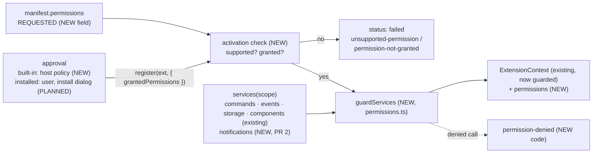

# Extension Permission Model — requested and granted permissions, a guarded `ExtensionContext` and `permission-denied`

> Slug: `extension-permission-model` · Status: **designed, the contested decisions answered by
> the owner (2026-09-19), awaiting implementation** · Extension roadmap, item 19 (A). Builds on:
> - item 1, `2026-09-18-extension-api-package.md`: `ExtensionManifest`, `validateManifest`,
>   `ExtensionContext` and the error codes, merged in #3;
> - item 2, `2026-09-18-extension-registry.md`: the lifecycle, `createContext` and the
>   `services(scope)` seam, merged in #6;
> - the services behind the context: commands (#11), events (#23, #25), components (#28), and
>   the storage specs (`2026-09-19-extension-storage-api.md`, `-project-storage.md`), which are
>   merged as designs and not implemented yet.
>
> This spec covers **the permission vocabulary, the requested → granted model, the guard in
> front of `ExtensionContext`, the error a denied call gets, and the first notification API**
> (`context.notifications`), which gives the `notifications` permission something to protect.
> The install dialog, the privileged permissions' APIs and a sandbox are later items; this spec
> fixes the contract they build on.
>
> Delivery: two PRs to `main`.
> - **PR 1 (Phases 1–3):** the model — the contract, the guard and the docs.
> - **PR 2 (Phase 4):** `context.notifications` and the `notifications` permission.

## 📝 TLDR

Today every extension gets the whole `ExtensionContext`: commands, events, storage and
components. Nothing records what an extension asks for, nothing records what it was allowed,
and nothing can refuse it.

The proposal separates two lists:

- **Requested.** The manifest's new `permissions` field says what the extension asks for.
- **Granted.** Whoever installs the extension approves the request, and the registry receives
  the result when the extension is registered. A user approves an installed extension; host
  policy approves one compiled into the cockpit. The registry never derives a grant from the
  manifest.

An extension activates only when every permission it requests is supported by this Cezar and
has been granted. Otherwise it **fails closed**: it is not activated, no extension code runs,
and the record says why:

```text
Extension "acme.jira" is incompatible with this Cezar. Unknown or unsupported permission: teleport.machine.
```

Inside an active extension, a guard in the registry builds the context from the granted
permissions. A protected call the extension never requested fails with a new error code,
**`permission-denied`**:

```text
Extension "acme.hello" called context.storage.set() without the "storage" permission.
Add "storage" to "permissions" in its manifest.
```

`context.permissions` shows the extension what it was granted. There are no run-time
permission requests.

This is an API guarantee, not a sandbox. Extension code still runs in the cockpit's origin, so
the model makes an extension's reach declared, approved and checked; it does not contain
hostile code. For that reason `network` stays **reserved and not enforceable**.

## Decisions

The brief left nine questions open. PR #40 first proposed autonomous defaults; the owner then
answered Q3, Q5, Q6, Q7 and Q8 on the PR. Rows marked *changed* differ from the first draft.
Q1, Q2 and Q4 keep their defaults, which the owner did not contest. The rows marked *derived*
follow from the owner's answers and are the ones to check.

| # | Question | Decision | Why | Source |
|---|---|---|---|---|
| Q1 | Six standard permissions now and four privileged ones "later": one spec? | **This spec: the model and the standard names.** The privileged names are defined here (§ Vocabulary) so their meaning is fixed, but each becomes *supported* in the spec of the API it gates. | The model works without them, and none of their APIs exist. | default |
| Q2 | Is a denied service absent from the context, or present and failing? | **Present and failing** with `permission-denied`. | The DoD asks for a readable error. An absent property fails as `TypeError: Cannot read properties of undefined`, which names neither the permission nor the fix. | default |
| Q3 | Is a requested permission granted? *(changed)* | **No. Requested and granted are two lists.** The manifest requests. An approval step, by the user or by host policy, produces the grant, and the registry receives it at `register`. For the standard permissions the approval is one step: the install dialog lists what the extension can do, and **Install** approves the whole set. Privileged permissions later get a stronger warning or a separate approval. No run-time prompts in the first version. | The owner's pipeline: `requestedPermissions → user/policy approval → grantedPermissions`. | owner |
| Q3a | Where is the install dialog built? *(derived)* | **In the installer item.** No installer or loader exists yet, so there is no flow to put a dialog in. This spec delivers what the dialog needs: the two lists, the `grantedPermissions` input of `register`, and the dialog's copy for each permission (§ Vocabulary, § UI/UX). | The model can ship and be tested without an install flow. A dialog without an installer would have nothing to open it. | derived |
| Q3b | Who approves a built-in extension? *(derived)* | **Host policy.** `startExtensionHost` grants a compiled-in extension the supported permissions its manifest requests. A built-in still has to request them; there is no bypass of the guard. | Built-ins are first-party code reviewed in this repository. The "policy approval" branch of the owner's pipeline covers them. | derived |
| Q3c | What if the grant does not cover the request? *(derived)* | **The extension is not activated** (`permission-not-granted`). This is the update case: a new version asks for more than the user approved. | The same fail-closed reasoning as Q7. An extension that expects a permission and runs without it is in a state its author never tested. | derived |
| Q4 | What does a manifest without `permissions` get? | **Nothing protected** (deny by default), built-ins included. | Allow-by-default would make the field decorative. The package is private; its example and the test fixtures change in the same PR. | default |
| Q5 | `notifications` and `network` have no API. *(changed)* | **Two separate cases.** `notifications` gets a real host API in this spec: `context.notifications.info / warning / error` (Phase 4). `network` stays in the vocabulary as **reserved / not enforceable yet**: it discloses intent, gates nothing, and is never presented as a security boundary. It gets a meaning when the sandbox is decided (a sandboxed `context.network.fetch`) or as "requests made through Cezar's backend" (`context.network.request`). | A plain front-end extension can call `fetch` directly, and no permission stops that. A notification API is small and makes its permission mean something. | owner |
| Q6 | What does each permission allow? *(changed)* | **The table in § Vocabulary**, from the owner's definitions. Three points: `commands.execute` allows executing public core commands and never intercepting them (`commands.intercept` is separate). `events` allows listening to public core events and emitting the extension's own namespaced events, never a core event. `backend.routes` will mean routes under the extension's own prefix (`/api/v1/extensions/<extensionId>/*`), never a change to a core route. | The owner's table. | owner |
| Q6a | Does an extension need `commands.execute` to run its own commands, or another extension's? *(derived)* | **Its own: no. Anything else: yes.** A command under the extension's own `${extension.id}.` prefix is always executable. Any other id, core's or another extension's, needs `commands.execute`. Internal core commands stay `command-not-found` either way. | The owner defines the permission as reaching Cezar's commands, and an extension's own command reaches nothing it does not already have. Another extension's command runs with that extension's grants, so calling it without a permission would be a way around the model. | derived |
| Q6b | Does `storage` cover `context.secrets`? | **Yes**, when secrets land. | Secrets are the extension's own private data, like storage. The owner's definition ("namespaced extension storage") does not split them. | default |
| Q7 | The manifest requests a name this Cezar does not know. *(changed)* | **Fail closed.** The extension is not activated, and its record says `Unknown or unsupported permission: <name>`. Unknown names are never ignored. If optional permissions are ever needed, they get their own field (`optionalPermissions`) with its own semantics. | The owner: an extension that expects `filesystem.secure` and starts on a Cezar that ignores the name may run in an incorrect or unsafe state. | owner |
| Q8 | Expose the granted set on the context? Allow run-time requests? *(changed)* | **Expose: yes** (`context.permissions`). **Run-time requests: not now.** | The owner. | owner |
| Q9 | One PR or several? *(changed)* | **Two.** PR 1 is the model. PR 2 adds `context.notifications`. | The guard is security-relevant and deserves a review of its own. The notification API touches React and the toaster. The repository's tokens-with-their-host-code rule applies to the `notifications` name: it becomes supported in the PR that adds its API. | derived |

## 📝 Problem Statement

The extension runtime now has four services behind `ExtensionContext`, and the storage specs
add a fifth (`secrets`). Every activation gets all of them:

- **Nothing is requested.** A reviewer reading a manifest cannot tell whether the extension
  executes commands such as `cezar.task.stop`, keeps data or replaces UI.
- **Nothing is approved.** There is no record of what a user or the host allowed, so an
  installer would have nothing to store and an update nothing to compare with.
- **Nothing can be refused.** `createContext` (`packages/web/src/extensions/registry.ts`) hands
  the same services to every extension.
- **The privileged APIs the roadmap names** (`filesystem`, `shell`, `backend.routes`,
  `commands.intercept`) cannot be added responsibly to a context with no notion of access.
  Item 1's spec (§ Risks) and the component-contract spec (Q3) both deferred this to a separate
  item. This is that item.

The Definition of Done: an extension without a permission cannot use the protected API,
permissions are part of the manifest, and a permission failure gives a readable error.

## 📝 Proposed Solution

1. **The manifest requests.** `ExtensionManifest` gains
   `permissions?: readonly ExtensionPermission[]`. `validateManifest` checks the shape and the
   name grammar, and `defineExtension` freezes the list.
2. **Registration carries the grant.** `registry.register(extension, { grantedPermissions })`.
   An omitted grant is empty. `startExtensionHost` applies host policy to the built-in list.
   The installer item will pass what the user approved.
3. **Activation checks compatibility first.** Before any extension code runs, the registry
   checks that every requested name is supported and granted. A failure ends the activation as
   `failed`, with a code and a message a person can act on.
4. **The registry guards the context.** A new pure module,
   `packages/web/src/extensions/permissions.ts`, wraps the services: a granted call reaches
   the real service, and a denied call fails with `permission-denied`. `createContext` applies
   it to whatever the injected `services(scope)` factory returns, so every host and every test
   gets the same enforcement. The services themselves do not change.
5. **The context shows the grant.** `context.permissions` is the frozen list this activation
   runs with.
6. **`context.notifications`** (PR 2) shows a toast through the cockpit's own toaster, under
   the `notifications` permission.

### Prior art

- **Chrome extensions** request `permissions` in the manifest, and the user approves the set at
  install time. An update that asks for more is disabled until the user approves again.
  Adopted: request in the manifest, approval of the whole set at install, and re-approval on
  escalation (Q3c). Without a permission Chrome's API namespace is `undefined`, so authors meet
  `Cannot read properties of undefined (reading 'local')`. Avoided: the absent namespace (Q2).
  Chrome has a separate `optional_permissions` field, which is the shape Q7 keeps for later.
- **Android** refuses to install an app whose manifest uses a feature or SDK level the device
  does not support. Adopted: an unknown requirement means incompatible, not ignored (Q7).
- **Deno** denies by default, and its error names the fix: `Requires net access to "x", run
  again with the --allow-net flag`. Adopted: deny by default and an error that names the
  remedy.
- **Figma plugins** declare `networkAccess.allowedDomains`, which a real sandbox enforces. It
  shows that `network` means something only when the runtime can enforce it (Q5).
- **VS Code and Obsidian** have no permission model: an extension has the user's full rights.
  Those ecosystems show how hard permissions are to add once third-party extensions exist, so
  the model lands before the loader.

### Alternatives considered

- **Derive the grant from the manifest ("declared = granted").** This was the first draft. The
  owner rejected it: a request and an approval are different facts, and merging them leaves
  the installer nothing to record and an update nothing to compare.
- **Ignore unknown permission names.** This was the first draft, for forward compatibility. The
  owner rejected it (Q7): it starts an extension in a state its author did not intend.
- **Reject unknown names in `validateManifest`.** Rejected. Whether a name is supported depends
  on the Cezar release, not on the manifest, in the same way as `engines.cezar`. The extension
  bundles its own copy of the package, which may know more names than the host's copy. The
  manifest stays *valid*, and the extension is *incompatible*: two different messages for two
  different problems.
- **Each service checks its own permission** (`scope.assertPermission(…)`). Rejected:
  enforcement would be spread over every service, and a new service could forget it. One guard
  where the context is assembled is complete by construction.
- **A `Proxy` that denies anything by path.** Rejected: it cannot tell a throwing method from a
  rejecting one, and it hides the context's shape from the type checker.
- **Run-time permission prompts.** Rejected by the owner for the first version.

## 📝 Architecture



Takeaway: a request and an approval meet at activation. If they do not match, nothing runs. If
they match, one module between the service factory and the context is the only code that knows
about permissions.

- **`packages/extension-api`** (the contract): the `ExtensionPermission` type, the manifest
  field and its validation, the `permission-denied` code, `context.permissions`, and in PR 2
  the `Notifications` interface. No new runtime export, so `test/surface.test.ts` does not
  change. The package stays Node-free, DOM-free and dependency-free.
- **`packages/web/src/extensions/permissions.ts`** (new, host): pure like `registry.ts`. It
  imports the extension API, plus `ExtensionScope` and `ExtensionServices` from `registry.ts`
  through `import type`. `verbatimModuleSyntax` erases that import, so there is no runtime
  cycle.
- **`packages/web/src/extensions/registry.ts`**: `register` takes the grant, `activate` runs
  the check, `createContext` applies the guard, and `ExtensionRecord` carries both lists. It
  gains one local import (`./permissions`). Both places that say "its only import is the
  extension API" are updated to name it: the AGENTS.md row and the module's header comment.
- **`packages/web/src/extensions/host.ts`**: `startExtensionHost` applies the built-in policy.
  In PR 2, `cockpitServices` gains the notification service.
- **`packages/web/src/components/ui/toaster.tsx`** (PR 2): a `warning` tone.
- **No server change, no HTTP route, no stored data.** Persisting a user's grant belongs to
  the installer item, which owns the install record.

Dependencies on future work: the storage items add `secrets` to `ExtensionServices`. The guard
returns `ExtensionServices`, so whichever PR lands second fails to compile until its author
gates the new members under `storage`. The installer item builds the dialog, stores the grant
and passes it to `register`. The loader item adds `unregister` and updates, and with them
re-approval.

## 📝 Vocabulary

One table fixes every name's meaning. *Supported* names can be requested today. *Reserved*
names can be requested and protect nothing. *Planned* names are defined here so their meaning
is settled, but requesting one fails closed until its API's item makes it supported.

| Permission | Allows | It never allows | Install dialog copy | Status |
|---|---|---|---|---|
| `ui.components` | registering the extension's own component implementations, overrides and UI contributions (`components.provide` today) | selecting its implementation for the user: providing never selects | Replace UI components | supported (PR 1) |
| `commands.execute` | executing public core commands (`cezar.*`) and other extensions' commands | intercepting a command (`commands.intercept`); reaching an internal core command | Execute Cezar commands | supported (PR 1) |
| `storage` | the extension's own namespaced storage: `context.storage`, and `context.secrets` when it lands | another extension's data | Store extension data | supported (PR 1) |
| `events` | listening to public events and emitting the extension's own namespaced events (`acme.jira.synced`) | emitting a core event: `emit` of `cezar.task.completed` stays `namespace-violation` | React to Cezar events | supported (PR 1) |
| `notifications` | showing a notification through Cezar's UI (`context.notifications`) | markup, actions or persistent notifications | Show notifications | supported from PR 2 |
| `network` | nothing yet. It will mean host-mediated external requests when that mechanism exists | — | Declares network access (Cezar does not enforce this yet) | **reserved / not enforceable** |
| `filesystem` | a host-mediated filesystem API | raw filesystem access | — | planned, privileged |
| `shell` | running processes through a controlled host API | an unrestricted shell | — | planned, privileged |
| `backend.routes` | registering endpoints under the extension's own prefix, `/api/v1/extensions/<extensionId>/*` | changing or shadowing a core route such as `/api/v1/tasks` | — | planned, privileged |
| `commands.intercept` | intercepting the execution of public core commands | — | — | planned, privileged |

Always available, with no permission: `context.extension`, `context.subscriptions`,
`context.permissions`, `commands.register`, and executing the extension's own commands.

A missing `network` request does **not** mean the extension cannot reach the network. The
dialog copy above is worded so that the name is never shown as a guarantee.

## 📝 API Contracts

### Extension API changes (`packages/extension-api`)

```ts
// src/permissions.ts (new; the type is re-exported by index.ts)
/**
 * What an extension may ask for. Requested in the manifest, approved by the user or by host
 * policy, and enforced by the host. `network` is reserved: it protects nothing and is not a
 * security boundary. The union grows additively, each name together with the API it protects.
 */
export type ExtensionPermission =
  | 'ui.components' | 'commands.execute' | 'storage' | 'events' | 'network'
  // PR 2 adds 'notifications'

// src/manifest.ts
export interface ExtensionManifest {
  // …existing fields
  /**
   * The permissions this extension REQUESTS. A request is not a grant: the extension activates
   * only when every name here is supported by the running Cezar and has been approved.
   * Omitted means `[]`. Unique names.
   */
  readonly permissions?: readonly ExtensionPermission[]
}

// src/context.ts
export interface ExtensionContext {
  // …existing members
  /** The permissions this activation runs with: requested, supported and approved. Frozen. */
  readonly permissions: readonly ExtensionPermission[]
}
```

`validateManifest` rules for `permissions`, each reported together with every other issue:

| Input | Issue |
|---|---|
| omitted, or `[]` | none |
| not an array | `permissions` "must be an array of permission names when present" |
| more than 32 entries | `permissions` "must have at most 32 entries" |
| an entry that is not a string, or not one or more dot-separated segments of `[a-z][a-z0-9-]*`, at most 64 characters | `permissions[i]` with that rule |
| a repeated entry | `permissions[i]` "must be unique — it repeats permissions[j]" |
| a well-formed name outside `ExtensionPermission` | none here: the **host** refuses it at activation (Q7) |

The path style (`permissions[i]`) is the one `components.ts` uses for capability lists. The
function stays pure and total. The type is strict: a typo is a compile error for a TypeScript
author. `defineExtension` also freezes `manifest.permissions`.

`ExtensionErrorCode` gains **`permission-denied`**: "a protected context method called without
its permission. The error carries `permission` (the missing name) and `api` (the method, e.g.
`storage.set`)." `ERROR_CODES` gains it, so `isExtensionError(error, 'permission-denied')`
works across package copies.

`ExtensionContext`'s TSDoc gains: every service is always present; which calls each permission
protects; a denied method throws, or rejects when it returns a promise; `commands.has` answers
`false`; `disposed` wins over `permission-denied`.

**PR 2** adds:

```ts
// src/notifications.ts
/**
 * Transient messages in Cezar's own notification UI. Host semantics:
 * - Plain text, shown with the extension's display name in front. Never markup.
 * - `message` is a non-empty string of at most 500 characters, else `invalid-input`.
 * - Shown in this page only, and not stored. Dismissal is the host's.
 * - Rate-limited per extension (5 per 10 seconds in the cockpit). A message over the limit is
 *   dropped and reported by the host; the call does not throw.
 * - Throws `permission-denied` without the `notifications` permission, and `disposed` after
 *   deactivation.
 */
export interface Notifications {
  info(message: string): void
  warning(message: string): void
  error(message: string): void
}
// ExtensionContext gains `readonly notifications: Notifications`.
```

### Registry changes (`packages/web/src/extensions/registry.ts`, cockpit-internal)

```ts
register(extension: Extension, options?: {
  readonly enabled?: boolean
  /** What the user or host policy approved for this extension. Omitted: nothing. */
  readonly grantedPermissions?: readonly string[]
}): ExtensionRecord

export interface ExtensionRecord {
  // …existing fields
  readonly permissions: {
    /** From the manifest. */
    readonly requested: readonly string[]
    /** From `register`. */
    readonly granted: readonly string[]
  }
}
```

The grant is fixed at `register`. Changing it needs `unregister`, which ships with the loader
item (registry Q5), and that is where re-approval after an update belongs.

`activate(id)` runs the **activation check** before `createContext` and before any extension
code:

| Order | Check | On failure: `failed`, with `error.code` and message |
|---|---|---|
| 1 | every requested name is supported by this Cezar (`STANDARD_PERMISSIONS`) | `unsupported-permission`: `Extension "acme.jira" is incompatible with this Cezar. Unknown or unsupported permission: teleport.machine.` |
| 2 | every requested name is in the grant | `permission-not-granted`: `Extension "acme.jira" requests permissions that have not been approved: storage.` |

Both messages list every offending name. Both codes are registry failure codes, like
`activation-timeout`. They are never thrown into an extension, so they do not join
`ExtensionErrorCode`. The failure goes through the existing `onError` (phase `activate`) and
`onStatusChange`. A retry gives the same result, as it should: only a new registration changes
the inputs.

The activation's **effective set** is the requested list. After the check it is a subset of
both the supported names and the grant. A name that was granted and not requested, for example
a grant left over from an older version, is never effective.

### Host module (`packages/web/src/extensions/permissions.ts`, cockpit-internal)

```ts
/** Compile-time exhaustive: a new ExtensionPermission fails here until it is listed. */
export const STANDARD_PERMISSIONS: Record<ExtensionPermission, { readonly reserved: boolean }>

/** The activation check. `null` means compatible. Pure; runs no extension code. */
export function checkPermissions(
  manifest: Readonly<ExtensionManifest>,
  granted: readonly string[],
): { readonly code: 'unsupported-permission' | 'permission-not-granted'; readonly message: string } | null

/** Host policy for a compiled-in extension: the supported names its manifest requests. */
export function builtinGrant(manifest: Readonly<ExtensionManifest>): readonly ExtensionPermission[]

/** The services a context gets: real where permitted, a failing stub where not. */
export function guardServices(
  scope: ExtensionScope,
  services: ExtensionServices,
  effective: ReadonlySet<ExtensionPermission>,
): ExtensionServices

/** Recognised by `isExtensionError(error, 'permission-denied')`. */
export function permissionDeniedError(/* extension id, permission, api */):
  Error & { readonly code: 'permission-denied'; readonly permission: ExtensionPermission; readonly api: string }
```

What the guard does per permission:

| Permission | Protected | Denied behaviour |
|---|---|---|
| `ui.components` | `components.provide` | throws |
| `commands.execute` | `commands.execute` and `commands.has`, for every id outside the extension's own `${extension.id}.` prefix | `execute` rejects; `has` answers `false` (its contract: "a handler this caller may run") |
| `storage` | every method of `context.storage` (flat today; `.global` and `.project` after the storage items, including `onDidChange` and the area `pin()` returns), and of `context.secrets` when it lands | promise methods reject; synchronous ones throw; nested areas are stubbed the same way |
| `events` | `events.on`, `once`, `off`, `emit` | throws |
| `notifications` (PR 2) | `notifications.info`, `warning`, `error` | throws |
| `network` | nothing | — |

Rules the guard keeps:

- **A stub checks liveness first.** It calls `scope.assertLive()`, then fails. After
  deactivation every call still fails with `disposed`, as the context's contract says.
- **A denied call never reaches the service.** No argument validation runs, nothing is
  registered and nothing is tracked.
- **A permitted call is the service's own**, with the same arguments and the same return
  value. Where one permission covers a whole service (events, storage, components,
  notifications), the guard hands over the service object itself, or the whole stub. For
  `commands` it builds a frozen object of arrow wrappers
  (`(...args) => services.commands.execute(...args)`). It never picks a method off a service,
  so a class-based service or test double keeps its `this`.
- **The own-namespace test reads only the token's id.** A token whose `id` is a string that
  starts with `${extension.id}.` passes through. Anything else, a malformed token included,
  needs the permission. With the permission, the service validates the token as it does today.
- **The shape is written out, not reflected.** `guardServices` names each service, as
  `unavailableServices` does, so its return type forces an update when `ExtensionServices`
  grows.
- **The message never contains arguments, keys or values.** It has only the extension id, the
  method and the permission.

`createContext` becomes:

```ts
const effective = new Set(activation.scope.extension.permissions ?? []) // checked before this point
const { commands, events, storage, components } =
  guardServices(activation.scope, services(activation.scope), effective)
// …and the frozen context gains `permissions: Object.freeze([...effective])`
```

`startExtensionHost` registers each entry of its boot list with
`{ grantedPermissions: builtinGrant(extension.manifest) }` (Q3b). An installed extension will
be registered by the installer item with the grant the user approved. That item never calls
`builtinGrant`.

### Notification service (`packages/web/src/extensions/notifications.ts`, PR 2)

`createNotificationService({ notify, onDropped? })` returns `forExtension(scope)`, like the
other services: every method calls `scope.assertLive()` first. `notify` is injected, and the
cockpit passes a function over `toast()` from `components/ui/toaster.tsx`, so the module stays
pure and testable. Tone mapping: `info` → `default`, `warning` → a new `warning` tone, `error`
→ `danger`. The shown text is `${manifest.name}: ${message}`. The rate limit is a sliding
window per extension id. A dropped message is reported once per window through `onDropped`
(default: one `[cezar:extensions]` `console.warn` line).

## 📝 UI/UX

**PR 1 has no UI.** A failed check surfaces through the existing channels: the record is
`failed` with its code and message, and `logExtensionError` writes one `[cezar:extensions]`
console line. A management UI that lists `record.permissions` is a later item.

**PR 2** shows extension notifications in the cockpit's existing toast outlet: one line of
plain text with the extension's display name in front, auto-dismissed after the toaster's
5 seconds. The `warning` tone is new. It follows the existing tones' structure, uses the
design system's warning colour in light and dark themes, and keeps the toaster's live-region
behaviour.

**The install dialog belongs to the installer item.** This spec fixes its contract so that
item does not reopen the decisions:

```text
Install "Jira Sync"?
This extension can:
  ✓ Replace UI components
  ✓ Store extension data
  ✓ Execute Cezar commands
                         [Cancel] [Install]
```

- The list is the manifest's requested permissions, in § Vocabulary's dialog copy.
- **Install** approves the whole standard set. There is no per-permission toggle in the first
  version.
- An extension that requests an unsupported name is shown as incompatible and cannot be
  installed.
- `network` uses its "not enforced" copy and is never shown as a guarantee.
- A privileged permission later gets a stronger warning or a separate approval step.
- There are no run-time prompts.

## 📝 Edge Cases & Failure Scenarios

| Case | Behaviour |
|---|---|
| `permissions: ['ui.components', 'teleport.machine']` | Valid manifest, incompatible extension: `failed` with `unsupported-permission`. No extension code runs, and the other extensions still activate. |
| A planned name (`shell`) is requested today | The same: unsupported until its item lands. |
| A TypeScript author's typo (`'storge'`) | A compile error. For a JavaScript author it is `unsupported-permission`, naming the typo. |
| The request exceeds the grant (an update asks for more) | `failed` with `permission-not-granted`, listing the missing names. |
| The grant exceeds the request | The extra names are ignored. The effective set is the request. |
| `register` without `grantedPermissions`, for a manifest that requests something | `permission-not-granted` at activation: an omitted grant is empty, never "everything". |
| A manifest with no `permissions`, no grant | Activates. Every protected call is denied. |
| `activate()` calls a denied method and does not catch (for a promise method: awaits or returns the call) | The activation fails. The record becomes `failed` with `code: 'permission-denied'`, what it registered before is disposed (existing behaviour), and the other extensions still activate. |
| `activate()` calls a denied promise method without awaiting it | The registry sees only what `activate` returns or throws, so the extension stays `active` and the browser reports an unhandled rejection that carries the same message. Any un-awaited rejection in `activate` behaves this way today. |
| The extension catches the error and carries on | It stays `active` without that capability. `isExtensionError(e, 'permission-denied')` is the supported check, and `context.permissions.includes(…)` avoids the call altogether. |
| A denied call inside a command handler | The caller of that command gets `command-failed` with the denial as its `cause` (existing wrapping). |
| A denied call inside an event listener | Reported by the bus's `onError`; the emitter and the other listeners are unaffected. |
| A denied call after deactivation | `disposed`, not `permission-denied`. |
| `commands.has(token)` for a core command, without `commands.execute` | `false`, never a throw, so feature detection keeps working. |
| `execute` of the extension's own command, without `commands.execute` | Runs (Q6a). |
| `emit` of `cezar.task.completed`, with `events` | `namespace-violation`, as today. The permission never lifts a namespace rule. |
| `permissions: ['network']` | Compatible. It grants nothing and restricts nothing: `fetch` is not gated. |
| An extension bundled with an older package copy (no `permissions` in its types) | It requests nothing, so every protected call is denied with a message that says what to add. |
| The extension mutates `manifest.permissions` after registration | The list is frozen by `defineExtension`, which `register` runs. |
| Storage is permitted but still the placeholder | "context.storage is not available in this Cezar version yet", as today. The guard only decides access. |
| Notifications faster than the limit (PR 2) | The extra messages are dropped, with one report per window. The call does not throw, so a noisy extension cannot fail itself or bury the user's own toasts. |
| A non-string, empty or over-long notification message | `invalid-input`. |
| Several open cockpits | A notification appears only in the page whose extension instance called it. |

## 📝 Risks & Impact Review

- **It is not a sandbox.** Extension code runs in the cockpit's origin. It can call `fetch`,
  reach the HTTP API and, for a compiled-in extension, import cockpit modules. The model
  guarantees what the *context* hands out, as storage's D3 does for data. Containing hostile
  code needs the loader's trust model and an isolated runtime. The README states this in the
  section that introduces permissions.
- **`network` may read as a promise.** That is why it is reserved, why its dialog copy says it
  is not enforced, and why its absence is documented as no guarantee. The alternative, leaving
  the name out, would leave an honest extension no way to disclose that it talks to the
  network.
- **Fail closed makes an extension's permission list part of its compatibility.** An extension
  that requests a new permission does not run on an older Cezar, even if it could have worked
  without it. That is the owner's intent (Q7). The remedy for authors is `engines.cezar`, and
  later `optionalPermissions`.
- **Deny by default breaks every existing extension.** There are none outside the repository:
  `BUILTIN_EXTENSIONS` is empty, and the package is private and experimental. The example and
  the fixtures change in the same PR. The package is not a surface of
  `BACKWARD_COMPATIBILITY.md`.
- **The vocabulary is hard to change once third parties exist.** Names are additive, and
  renaming one needs an alias. The derived rows (Q6a: another extension's command needs
  `commands.execute`; Q6b: `storage` covers secrets) are the ones most worth a second look
  before the loader ships.
- **The grant is not persisted here.** Until the installer item lands, only host policy
  produces a grant, so nothing can drift. The installer item must store the grant beside its
  install record and compare it with the manifest on update.
- **Notification spam.** It is bounded by the rate limit, the length cap and plain text. A
  notification cannot carry an action, so it cannot trick a user into a click that does
  something.
- **Rollback.** Reverting PR 1 restores the unguarded context. Manifests that declare
  `permissions` keep validating, because unknown keys are ignored. Reverting PR 2 removes
  `context.notifications`, and an extension requesting `notifications` becomes incompatible,
  which is the fail-closed result. No data or server state is involved.

## 📋 Phasing

- **PR 1 — the model.** Phases 1–3. It meets all three DoD checks.
  1. **The contract:** the type, the manifest field, the error code, `context.permissions` and
     the example. The host ignores the field, so nothing changes at run time.
  2. **The host:** the grant at `register`, the activation check, the guard and the built-in
     policy.
  3. **Docs.**
- **PR 2 — notifications.** Phase 4, stacked on PR 1: the `Notifications` contract, the
  service, the `warning` tone and the `notifications` permission.

## 📋 Implementation Plan

Gate for every phase: the commands in `.ai/agentic.config.json` (`typecheck`, `test`,
`test:unit`, `build`, `test:package`).

### Phase 1 — The contract (`packages/extension-api`, PR 1)

1. **`src/permissions.ts` and the manifest field.** Add `ExtensionPermission` and an internal
   `isValidPermissionName`. Add `permissions?` to `ExtensionManifest` and the rules above to
   `collectIssues`. Re-export the type from `index.ts`.
   - Tests (`manifest.test.ts`): omitted and `[]` are valid; each supported name is valid; a
     well-formed unknown name is valid *here*; not an array; a non-string entry; a malformed
     name; a duplicate (the issue names both indexes); 33 entries; every issue is reported
     together; an exotic value never throws.
   - Type tests: `permissions: ['storage']` compiles, and `['storge']` is a `@ts-expect-error`.
   - `surface.test.ts` passes unchanged (no new runtime export).
2. **`defineExtension` freezes `manifest.permissions`.**
   - Test (`extension.test.ts`): the list is frozen; a bad list throws `invalid-manifest` with
     the path `manifest.permissions[0]`.
3. **`permission-denied` in `errors.ts`:** the union, `ERROR_CODES` and the TSDoc entry.
   - Tests (`errors.test.ts`): `isExtensionError` accepts a duck-typed
     `{ code: 'permission-denied', message }`, with and without the code filter.
4. **`ExtensionContext`: `permissions` and the TSDoc; the example.** `test/fake-context.ts`
   gains a `permissions` list, because the context type now requires one; it still implements
   no host semantics. `examples/hello-extension` requests
   `permissions: ['storage', 'events', 'ui.components']`. It executes no foreign command.
   - Test: `example.test.ts` still passes. In `packages/web`, `createContext` supplies
     `permissions: []` until Phase 2 so the typecheck stays green.

### Phase 2 — The host (`packages/web/src/extensions`, PR 1)

1. **`permissions.ts`: `STANDARD_PERMISSIONS`, `checkPermissions`, `builtinGrant`,
   `permissionDeniedError`.**
   - Tests (`permissions.test.ts`): compatible → `null`; one and several unsupported names
     (the message lists each, in manifest order); a planned name is unsupported; the
     request exceeds the grant (the message lists each missing name); unsupported is reported
     before not-granted; an omitted request is compatible with any grant; `builtinGrant`
     returns the supported requested names only; the denial error passes `isExtensionError`,
     carries `permission` and `api`, has the exact message and contains no argument.
2. **`guardServices`.**
   - Tests, per row of the guard table: a denied method throws or rejects as its contract says
     and the real service is never called (a spy); a permitted call reaches the real service
     with the same arguments and returns its value; `commands.register` always passes;
     `execute` and `has` of an own-namespace id pass without the permission, and of a core id
     or another extension's id do not; a malformed token without the permission is denied; a
     class-based double keeps its `this`; on an ended scope the stub fails with `disposed`.
3. **The registry: the grant at `register`, `record.permissions`, the activation check, the
   guard in `createContext` and `context.permissions`. Update `registry.fixtures.ts`.**
   `fixtureManifest`, the one manifest source of the host and registry tests, takes an optional
   `permissions` argument that defaults to every supported name. The fixtures' `register`
   helper grants the same list, so the existing assertions (the placeholder messages in
   `host.test.ts` among them) keep passing.
   - Tests (`registry.test.ts`): an unsupported name → `failed` with
     `unsupported-permission`, `activate` is never called (a spy), `onError` and
     `onStatusChange` fire once, and the next extension still activates; a request beyond the
     grant → `permission-not-granted`; `register` without a grant, for a manifest that
     requests something → the same; a retry fails the same way; an extension with no
     permissions whose `activate` awaits `storage.get` ends `failed` with
     `code: 'permission-denied'`, and what it registered before is disposed; one that catches
     the error stays `active`; `context.permissions` equals the request and is frozen;
     `record.permissions` carries both lists; a granted name that was not requested is not
     effective.
4. **`startExtensionHost` applies `builtinGrant`, and the deny-all sweep (`host.test.ts`).**
   - Tests: a built-in that requests supported names activates with them; one that requests an
     unsupported name is `failed` and the boot continues. The sweep activates an extension
     with `permissions: []` on `cockpitServices` with the real registries and walks the context
     recursively. Every function fails with `permission-denied`, except the allow-list:
     `commands.register` and `commands.has` (its denial is covered by the pair below, because
     a bare `has()` answers `false` on the real service too). Because the sweep walks whatever
     the context holds, a future service added without a gate fails this test.
   - With the real services: with `commands.execute`, `has(TaskStop)` is `true`; without it,
     `has` is `false` and `execute` rejects `permission-denied`. With `events`, a listener
     hears `cezar.extension.activated`; without it, `on` throws.

### Phase 3 — Docs (PR 1)

1. **`packages/extension-api/README.md`:** a `### Permissions` section with requested against
   granted, the vocabulary table with its statuses, fail closed, deny by default, `network` as
   reserved, "an API guarantee, not a sandbox", and how to handle the error. Add the
   `permission-denied` entry under `### Errors`, and a new manifest example that includes
   `permissions` (the README has none today).
2. **`AGENTS.md`:** the extension-host row gains the model. A grant arrives only through
   `register`, and is never derived from the manifest outside `builtinGrant`. The activation
   check runs before any extension code. `createContext` applies `guardServices`. A new context
   member must be added to the guard under a permission. A service never checks permissions
   itself. A permission name becomes supported in the same PR as the API it protects.
   `registry.ts` now imports `./permissions`. The header comment of `registry.ts` gets the
   same correction.

### Phase 4 — `context.notifications` (PR 2)

1. **The contract:** `src/notifications.ts`, `ExtensionContext.notifications`, `'notifications'`
   in `ExtensionPermission`, and `test/fake-context.ts`.
   - Tests: type tests for the three methods; `surface.test.ts` unchanged (types only).
2. **The toaster's `warning` tone.**
   - Tests (`toaster.test.tsx`): the tone renders with its class, and the existing tones are
     unchanged.
3. **`extensions/notifications.ts`: the service.**
   - Tests: each method calls `notify` with the mapped tone and the name prefix; an invalid
     message throws `invalid-input` and shows nothing; the sixth message inside 10 seconds is
     dropped and reported once, and the window then reopens (fake timers); the limits are per
     extension; after deactivation every method throws `disposed`.
4. **Wire it:** `ExtensionServices`, `unavailableServices`, `cockpitServices`, `createContext`,
   `STANDARD_PERMISSIONS` and `guardServices`. The compiler forces the last two.
   - Tests: the guard table's `notifications` row; the deny-all sweep passes with the new
     member; an extension requesting `notifications` is compatible.
5. **Docs:** the README gets a `### Notifications` section and the vocabulary status, and the
   AGENTS.md row names the service.
