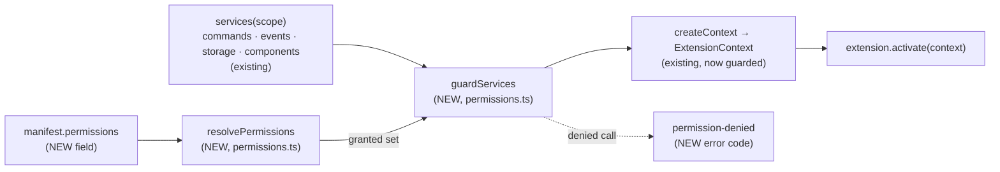

# Extension Permission Model — manifest permissions, a guarded `ExtensionContext` and `permission-denied`

> Slug: `extension-permission-model` · Status: **designed with autonomous defaults, awaiting the
> owner's review** · Extension roadmap, item 19 (A). Builds on:
> - item 1, `2026-09-18-extension-api-package.md`: `ExtensionManifest`, `validateManifest`,
>   `ExtensionContext` and the error codes, merged in #3;
> - item 2, `2026-09-18-extension-registry.md`: the lifecycle, `createContext` and the
>   `services(scope)` seam, merged in #6;
> - the services behind the context: commands (#11), events (#23, #25), components (#28), and
>   the storage specs (`2026-09-19-extension-storage-api.md`, `-project-storage.md`), which are
>   merged as designs and not implemented yet.
>
> This spec covers **the permission vocabulary, the manifest field, the guard in front of
> `ExtensionContext` and the error a denied call gets**. The privileged permissions
> (`filesystem`, `shell`, `backend.routes`, `commands.intercept`), a consent prompt, a
> management UI and a sandbox are later items.
>
> Delivery: one PR to `main`.

## 📝 TLDR

Today every extension gets the whole `ExtensionContext`: commands, events, storage and
components, whatever it needs. Nothing records what an extension uses, and nothing can refuse
it.

The proposal adds an optional **`permissions`** list to the manifest and a **guard** in the
cockpit's extension registry. Each activation's context is built from the permissions its
manifest declares. A protected method whose permission is missing fails with a new error code,
**`permission-denied`**, and a message that names the extension, the call, the missing
permission and the fix:

```text
Extension "acme.hello" called context.storage.set() without the "storage" permission.
Add "storage" to "permissions" in its manifest.
```

A manifest without `permissions` gets no protected API (deny by default). Six standard
permissions ship: `ui.components`, `commands.execute`, `storage`, `events`, `notifications` and
`network`. The last two are reserved names: their APIs do not exist yet, so they gate nothing.

This is an API guarantee, not a sandbox. Extension code still runs in the cockpit's origin, so
the model makes an extension's reach declared, checked and reviewable; it does not contain
hostile code.

## Resolved assumptions (autonomous defaults)

The brief left these open. This run was unattended, so each question got the most reversible
answer. The owner can override any row before merge.

| # | Question | Default chosen | Why |
|---|---|---|---|
| Q1 | The brief lists six standard permissions and four privileged ones "later". One spec? | **This spec: the model and the six standard names.** Each privileged permission (`filesystem`, `shell`, `backend.routes`, `commands.intercept`) ships with the spec of the API it gates. | The model works without them, and none of their APIs exist. A privileged permission also needs a grant decision by the user, which depends on the loader item. |
| Q2 | "`ExtensionContext` exposes only the allowed API": is a denied service absent, or present and failing? | **Present and failing.** Every service stays on the context. A denied method fails with `permission-denied`. | The DoD asks for a readable error. An absent property fails as `TypeError: Cannot read properties of undefined`, which names neither the permission nor the fix (Chrome's known pain, § Prior art). The context's type also stays one shape for every extension. |
| Q3 | Is a declared permission granted, or must the user approve it? | **Declared = granted**, for the six standard names. No prompt and no UI in this item. | Only compiled-in, first-party extensions exist (`BUILTIN_EXTENSIONS`), and there is no loader or management UI to ask from. The granted set comes from one injectable function (`resolvePermissions` in the registry's options), so the loader item can narrow it with the user's decision. Nothing is weaker than today, when everything is allowed. |
| Q4 | What does a manifest without `permissions` get? | **Nothing protected** (`[]`, deny by default). Built-in extensions follow the same rule, with no bypass. | Allow-by-default would make the field decorative. The package is private and has no consumer outside this repository; its example and the test fixtures gain the field in the same PR. |
| Q5 | `notifications` and `network` have no API today. Add the APIs here? | **No.** Both names join the vocabulary as *reserved*: valid in a manifest, gating nothing until their API's item lands. | The brief lists them in scope, and reserving a name costs nothing. A notification or network API is its own capability with its own design. `network` never claims to block `fetch` (§ Risks). |
| Q6 | What exactly does each permission gate? | The table in § API Contracts. In short: `commands.execute` gates `execute` and `has`, **not** `register`; `events` gates the whole events service; `storage` gates all of `context.storage` and, when it lands, `context.secrets`. | `register` adds a handler in the extension's own namespace and reaches nothing of Cezar's. Executing any command needs `commands.execute`, the extension's own included: `execute` does not look at who registered the id. The brief names `events` and `storage` flat, so they gate their whole service. Secrets are the extension's own private data, like storage. Splitting a `secrets` permission off later is possible while the package is private. |
| Q7 | A manifest declares a name this Cezar does not know (a newer permission, a privileged one, a typo). | **A well-formed name is valid and grants nothing.** The denial message lists the unknown names the manifest declared, so a typo is visible where it hurts. A malformed name is a manifest issue. | It matches `validateManifest`'s rule for unknown keys: a manifest written for a newer Cezar still validates. An unknown permission has no API behind it, so ignoring it is safe. |
| Q8 | Does the context expose the granted set (`context.permissions.has(…)`), or can an extension request a permission at run time? | **Neither.** | An extension knows what it declared. Optional and run-time permissions need the consent UI. Both are additive later. |
| Q9 | One PR or several? | **One PR, three phases.** | The contract change is small and useless without the guard; the guard cannot compile without the contract. |

No default carries `⚠ NEEDS HUMAN CONFIRMATION`: none weakens security, data scoping or a
documented compatibility surface, and each can be changed without rewriting the design.

## 📝 Problem Statement

The extension runtime now has four services behind `ExtensionContext`, and the storage specs
add a fifth (`secrets`). Every activation gets all of them:

- **Nothing is declared.** A reviewer reading a manifest cannot tell whether the extension
  executes commands such as `cezar.task.stop`, keeps data or replaces UI. They must read the
  code.
- **Nothing can be refused.** `createContext` (`packages/web/src/extensions/registry.ts`) hands
  the same services to every extension. The loader item, which will run third-party code, has
  no mechanism to build on.
- **The privileged APIs the roadmap names** (`filesystem`, `shell`, `backend.routes`,
  `commands.intercept`) cannot be added responsibly to a context that has no notion of access.
  Item 1's spec (§ Risks) and the component-contract spec (Q3, "host permissions … can be added
  later") both deferred this to a separate item. This is that item.

The Definition of Done: an extension without a permission cannot use the protected API,
permissions are part of the manifest, and a permission failure gives a readable error.

## 📝 Proposed Solution

1. **The manifest declares permissions.** `ExtensionManifest` gains
   `permissions?: readonly ExtensionPermission[]`. `validateManifest` checks the shape and the
   name grammar, and `defineExtension` freezes the list.
2. **The registry guards the context.** A new pure module,
   `packages/web/src/extensions/permissions.ts`, resolves the granted set from the manifest
   and wraps the services: a granted method is the real one, and a denied method is a stub that
   fails. `createContext` applies it to whatever the injected `services(scope)` factory
   returns, so every host and every test gets the same enforcement.
3. **A denied call gets `permission-denied`.** It is a new `ExtensionErrorCode`, recognised by
   `isExtensionError`. The error carries `permission` and `api`, and its message says what to
   add to the manifest. Methods that return a promise reject, the others throw, and
   `commands.has` answers `false`.

The services themselves do not change. Commands, events and components keep their
`forExtension(scope)` views as they are.

### Prior art

- **Chrome extensions** declare `permissions` in the manifest, and the user consents at install
  time. Without a permission the API namespace is `undefined`, so authors meet
  `Cannot read properties of undefined (reading 'local')`, a well-known source of confusion.
  Adopted: declaration in the manifest. Avoided: the absent namespace (Q2). Skipped for now:
  `optional_permissions` and host match patterns.
- **Deno** denies by default, and its error names the fix: `Requires net access to "x", run
  again with the --allow-net flag`. Adopted: deny by default, and an error that names the
  missing permission and the remedy.
- **Figma plugins** declare `networkAccess.allowedDomains`, enforced by a real sandbox. It
  shows that `network` means something only once the runtime can enforce it, which is why
  `network` stays reserved here.
- **VS Code and Obsidian** have no permission model: an extension has the user's full rights,
  and trust is decided per publisher or workspace. Cezar is in that position today. Those
  ecosystems show how hard permissions are to add once third-party extensions exist, so the
  model lands before the loader.

### Alternatives considered

- **Each service checks its own permission** (`scope.assertPermission(…)` next to
  `scope.assertLive()`). Rejected: enforcement would be spread over every service, and a new
  service could forget it. One guard at the point where the context is assembled is complete by
  construction, and the services stay unaware of permissions.
- **A `Proxy` that denies anything by path.** Rejected: it cannot tell a throwing method from a
  rejecting one, and it hides the context's shape from the type checker. A typed stub, like the
  existing `unavailableServices`, fails to compile when the context grows, which is the
  reminder wanted.
- **Omit denied services from the context.** Rejected in Q2.
- **The guard in `cockpitServices` (`host.ts`).** Rejected: a host that passes another factory
  (tests pass `unavailableServices`) would skip it. `createContext` is the one place every
  context goes through.

## 📝 Architecture



Takeaway: the services are untouched; one new module sits between the service factory and the
frozen context, and it is the only code that knows permissions.

- **`packages/extension-api`** (the contract): the `ExtensionPermission` type, the manifest
  field and its validation, the `permission-denied` code, and TSDoc on `ExtensionContext`. No
  new runtime export, so `test/surface.test.ts` does not change. The package stays Node-free,
  DOM-free and dependency-free.
- **`packages/web/src/extensions/permissions.ts`** (new, host): pure like `registry.ts`. Its
  only import is the extension API plus the registry's types, with no React, DOM or module
  state.
- **`packages/web/src/extensions/registry.ts`**: `createContext` calls the guard. It gains one
  local import (`./permissions`). Both places that say "its only import is the extension API"
  are updated to name it: the AGENTS.md row and the module's header comment.
- **No server change, no HTTP route, no stored data, no UI.**

Dependencies on future work: the storage items replace the storage placeholder and add
`secrets` to `ExtensionServices`. The guard returns `ExtensionServices`, so whichever PR lands
second fails to compile until its author adds the new members to the guard, under `storage`.
The loader item narrows the granted set; the management UI item displays it.

## 📝 API Contracts

### Extension API changes (`packages/extension-api`)

```ts
// src/permissions.ts (new; the type is re-exported by index.ts)
/**
 * What an extension may reach through its context. Declared in the manifest; a protected
 * method whose permission is missing fails with `permission-denied`. `notifications` and
 * `network` are reserved: no API stands behind them yet. The union grows additively.
 */
export type ExtensionPermission =
  | 'ui.components' | 'commands.execute' | 'storage' | 'events' | 'notifications' | 'network'

// src/manifest.ts
export interface ExtensionManifest {
  // …existing fields
  /** Omitted means `[]`: no protected API. Unique names. */
  readonly permissions?: readonly ExtensionPermission[]
}
```

`validateManifest` rules for `permissions`, each reported with every other issue:

| Input | Issue |
|---|---|
| omitted, or `[]` | none |
| not an array | `permissions` "must be an array of permission names when present" |
| more than 32 entries | `permissions` "must have at most 32 entries" |
| an entry that is not a string, or not one or more dot-separated segments of `[a-z][a-z0-9-]*`, at most 64 characters | `permissions[i]` with that rule |
| a repeated entry | `permissions[i]` "must be unique — it repeats permissions[j]" |
| a well-formed name outside `ExtensionPermission` | none (Q7) |

The path style (`permissions[i]`) is the one `components.ts` uses for capability lists. The
function stays pure and total. The type is strict while the runtime is lenient: a typo is a
compile error for a TypeScript author, and an extension built against a newer copy of the
package still validates on an older host.

`defineExtension` also freezes `manifest.permissions`.

`ExtensionErrorCode` gains **`permission-denied`**: "a protected context method called without
its permission in the manifest. The error carries `permission` (the missing name) and `api`
(the method, e.g. `storage.set`)." `ERROR_CODES` gains it, so `isExtensionError(error,
'permission-denied')` works across package copies.

`ExtensionContext`'s TSDoc gains: every service is always present; which methods each
permission protects; a denied method throws, or rejects when it returns a promise;
`commands.has` answers `false`; `disposed` wins over `permission-denied`.

### What each permission gates

| Permission | Protected | Denied behaviour |
|---|---|---|
| `ui.components` | `components.provide` | throws |
| `commands.execute` | `commands.execute`, `commands.has` | `execute` rejects; `has` answers `false` (its contract: "a handler this caller may run") |
| `storage` | every method of `context.storage` (flat today; `.global` and `.project` after the storage items, including `onDidChange` and the area `pin()` returns), and every method of `context.secrets` when it lands | promise methods reject; synchronous ones (`onDidChange`, `pin`) throw; nested areas are stubbed the same way |
| `events` | `events.on`, `once`, `off`, `emit` | throws |
| `notifications` | nothing yet (reserved) | — |
| `network` | nothing yet (reserved) | — |

Always available: `context.extension`, `context.subscriptions` and `commands.register` (Q6).

### Host module (`packages/web/src/extensions/permissions.ts`, cockpit-internal)

```ts
/** Compile-time exhaustive: a new ExtensionPermission fails here until it is listed. */
export const STANDARD_PERMISSIONS: Record<ExtensionPermission, { readonly reserved: boolean }>

/** Declared ∩ known, plus the declared names this Cezar does not know. One call per activation. */
export function resolvePermissions(manifest: Readonly<ExtensionManifest>): {
  readonly granted: ReadonlySet<ExtensionPermission>
  readonly unknown: readonly string[]
}

/** The services an activation's context gets: real where granted, a failing stub where not. */
export function guardServices(
  scope: ExtensionScope,
  services: ExtensionServices,
  permissions: ReturnType<typeof resolvePermissions>,
): ExtensionServices

/** Recognised by `isExtensionError(error, 'permission-denied')`. */
export function permissionDeniedError(/* extension id, permission, api, unknown names */):
  Error & { readonly code: 'permission-denied'; readonly permission: ExtensionPermission; readonly api: string }
```

Rules the guard keeps:

- **A stub checks liveness first.** It calls `scope.assertLive()`, then fails. After
  deactivation every call still fails with `disposed`, as the context's contract says.
- **A denied call never reaches the service.** No argument validation runs, nothing is
  registered and nothing is tracked.
- **A granted call is the service's own**, with the same arguments and the same return value.
  Where one permission covers a whole service (events, storage, components), the guard hands
  over the service object itself, or the whole stub. For `commands`, where only some methods
  are gated, it builds a frozen object of arrow wrappers
  (`(...args) => services.commands.execute(...args)`). It never picks a method off a service,
  so a class-based service or test double keeps its `this`.
- **The shape is written out, not reflected.** `guardServices` names each service and method,
  as `unavailableServices` does, so its return type forces an update when `ExtensionServices`
  grows.
- **The message never contains arguments, keys or values.** It has only the extension id, the
  method, the permission and, when there are any, the unknown names the manifest declared:
  `… The manifest also declares names this Cezar does not know: "storge".`

`createContext` becomes:

```ts
const permissions = (options.resolvePermissions ?? resolvePermissions)(activation.scope.extension)
const { commands, events, storage, components } =
  guardServices(activation.scope, services(activation.scope), permissions)
```

`ExtensionRegistryOptions` gains an optional `resolvePermissions`, defaulting to the function
above, and `createContext` calls the injected one. It is the single place where "declared"
becomes "granted" (Q3): the loader item passes its own resolver, which narrows the default's
result with the user's decision, and the guard does not change. Tests use the same seam.

`permissions.ts` imports `ExtensionScope` and `ExtensionServices` from `registry.ts` with
`import type`. `verbatimModuleSyntax` erases it, so the two modules have no runtime cycle.

## 📝 UI/UX

None. No management UI exists to show an extension's permissions. A denial surfaces through
the existing channels: an uncaught one in `activate()` marks the extension `failed` with
`error.code: 'permission-denied'` and the message, and `logExtensionError` writes one
`[cezar:extensions]` console line. Showing permissions to the user and asking for consent
belong to the management-UI and loader items.

## 📝 Edge Cases & Failure Scenarios

| Case | Behaviour |
|---|---|
| `activate()` calls a denied method and does not catch (for a promise method: awaits or returns the call) | The activation fails. The record becomes `failed` with `code: 'permission-denied'`, everything it registered before is disposed (existing behaviour), and the other extensions still activate. |
| `activate()` calls a denied promise method without awaiting it | The registry sees only what `activate` returns or throws, so the extension stays `active` and the browser reports an unhandled rejection that carries the same message. This is how any un-awaited rejection in `activate` behaves today. |
| The extension catches the error and carries on | It stays `active` without that capability. `isExtensionError(e, 'permission-denied')` is the supported check. |
| A denied call inside a command handler | The caller of that command gets `command-failed` with the denial as its `cause` (existing wrapping). |
| A denied call inside an event listener | Reported by the bus's `onError`; the emitter and the other listeners are unaffected (existing isolation). |
| A denied call after deactivation | `disposed`, not `permission-denied`. |
| `commands.has(token)` without `commands.execute` | `false`, never a throw, so feature detection keeps working. |
| `permissions: ['shell']` or a typo | Valid manifest, grants nothing; every denial's message lists the unknown name. |
| `permissions: ['network']` | Valid, grants nothing today, and restricts nothing: `fetch` is not gated (§ Risks). |
| An extension bundled with an older package copy (no `permissions` in its types) | No permissions, so every protected call is denied with a message that says what to add. |
| The extension mutates `manifest.permissions` after registration | The list is frozen by `defineExtension`, which `register` runs; the granted set is computed per activation from that frozen manifest. |
| Storage is granted but still the placeholder | "context.storage is not available in this Cezar version yet", as today. The guard only decides access. |
| An exotic `permissions` value (a throwing getter, a revoked proxy) | `validateManifest` stays total: "must be a readable object". |

## 📝 Risks & Impact Review

- **It is not a sandbox.** Extension code runs in the cockpit's origin. It can call `fetch`,
  reach the HTTP API and, for a compiled-in extension, import cockpit modules. The model
  guarantees what the *context* hands out, as storage's D3 does for data. Containing hostile
  code needs the loader's trust model and an isolated runtime. The README states this in the
  section that introduces permissions.
- **`network` may read as a promise.** A manifest without `network` does not mean "this
  extension cannot reach the network". Nothing displays permissions yet, so the risk is in the
  docs, which say "reserved". The management-UI item must not present an absent `network` as a
  guarantee before a runtime can enforce it.
- **Deny by default breaks every existing extension.** There are none outside the repository:
  `BUILTIN_EXTENSIONS` is empty and the package is private and experimental. The example and
  the fixtures are updated in the same PR. The package is not a surface of
  `BACKWARD_COMPATIBILITY.md`.
- **The vocabulary is hard to change once third parties exist.** Names are additive, and
  renaming one would need an alias. The six names come from the owner's brief; Q6's grouping
  (`storage` covering secrets, `events` covering emit) is the part most worth a second look
  before the loader ships.
- **Rollback.** Reverting the PR restores the unguarded context. Manifests that declare
  `permissions` keep validating, because unknown keys are ignored. No data or server state is
  involved.
- **Direction call, not a defect:** whether `commands.register` should need its own permission.
  Adding one later breaks extensions that lack it; while the package is private that is cheap.

## 📋 Phasing

One PR, three phases, each leaving the app working:

1. **The contract** — the type, the manifest field, the error code and the example. The host
   ignores the field, so nothing changes at run time.
2. **The guard** — `permissions.ts`, wired into `createContext`, with the fixtures updated.
   All three DoD checks are met here.
3. **Docs** — the README and AGENTS.md.

## 📋 Implementation Plan

Gate for every phase: the commands in `.ai/agentic.config.json` (`typecheck`, `test`,
`test:unit`, `build`, `test:package`).

### Phase 1 — The contract (`packages/extension-api`)

1. **`src/permissions.ts` and the manifest field.** Add `ExtensionPermission` and an internal
   `isValidPermissionName`. Add `permissions?` to `ExtensionManifest` and the rules above to
   `collectIssues`. Re-export the type from `index.ts`.
   - Tests (`manifest.test.ts`): omitted and `[]` are valid; each standard name is valid; a
     well-formed unknown name is valid; not an array; a non-string entry; a malformed name; a
     duplicate (the issue names both indexes); 33 entries; every issue is reported together;
     an exotic value never throws.
   - Type tests: `permissions: ['storage']` compiles, and `['storge']` is a `@ts-expect-error`.
   - `surface.test.ts` passes unchanged (no new runtime export).
2. **`defineExtension` freezes `manifest.permissions`.**
   - Test (`extension.test.ts`): the list is frozen; a bad list throws `invalid-manifest` with
     the path `manifest.permissions[0]`.
3. **`permission-denied` in `errors.ts`** — the union, `ERROR_CODES` and the TSDoc entry.
   - Tests (`errors.test.ts`): `isExtensionError` accepts a duck-typed
     `{ code: 'permission-denied', message }`, with and without the code filter.
4. **`ExtensionContext` TSDoc and the example.** `test/fake-context.ts` implements no host
   semantics and does not change. `examples/hello-extension` declares `permissions: ['storage', 'events', 'ui.components']`.
   - Test: `example.test.ts` still passes.

### Phase 2 — The guard (`packages/web/src/extensions`)

1. **`permissions.ts`: `STANDARD_PERMISSIONS`, `resolvePermissions`, `permissionDeniedError`.**
   - Tests (`permissions.test.ts`): declared ∩ known; unknown names are returned in manifest
     order; an omitted list grants nothing; reserved names are granted and gate nothing; the
     error passes `isExtensionError`, carries `permission` and `api`, has the exact message
     (with and without unknown names) and contains no argument.
2. **`guardServices`.**
   - Tests, per row of the gating table: a denied method throws or rejects as its contract
     says and the real service is never called (a spy); a granted method calls the real one
     with the same arguments and returns its value; `commands.register` always passes;
     `commands.has` answers `false`; on an ended scope the stub fails with `disposed`.
3. **Wire it into `createContext`, add the `resolvePermissions` option, and update
   `registry.fixtures.ts`.** `fixtureManifest`, the one manifest source of the host and
   registry tests, takes an optional `permissions` argument that defaults to every standard
   name, so the existing assertions (the placeholder messages in `host.test.ts` among them)
   keep passing.
   - Tests (`registry.test.ts`): an extension with no permissions whose `activate` awaits
     `storage.get` ends `failed` with `code: 'permission-denied'`; what it registered before
     is disposed; the next extension still activates; one that catches the error stays
     `active`; an injected `resolvePermissions` that grants nothing denies an extension whose
     manifest declares everything, and it is called once per activation.
4. **The deny-all sweep (`host.test.ts`).** Activate an extension with `permissions: []` on
   `cockpitServices` with the real registries, and walk the context recursively. Every function
   fails with `permission-denied`, except the allow-list: `commands.register` and
   `commands.has` (its denial is covered by the `has(TaskStop)` pair below, because a bare
   `has()` answers `false` on the real service too). Because the sweep walks whatever the context holds,
   a future service added without a gate fails this test.
   - Also, with the real services: with `commands.execute`, `has(TaskStop)` is `true`; without
     it, `has` is `false` and `execute` rejects `permission-denied`. With `events`, a listener
     hears `cezar.extension.activated`; without it, `on` throws.

### Phase 3 — Docs

1. **`packages/extension-api/README.md`:** a `### Permissions` section (the table, deny by
   default, the reserved names, "an API guarantee, not a sandbox", how to handle the error),
   the `permission-denied` entry under `### Errors`, and a new manifest
   example that includes `permissions` (the README has none today).
2. **`AGENTS.md`:** the extension-host row gains the guard — `createContext` applies
   `guardServices`; a new context member must be added to it under a permission; a service
   never checks permissions itself; `registry.ts` now imports `./permissions`.
