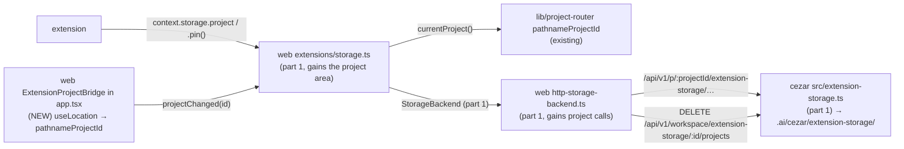

# Extension project storage — `context.storage.project`

> Slug: `extension-project-storage` · Status: **designed, awaiting implementation** · Epic 1
> (Extension Runtime), item 6, part 2 of 2. Builds on part 1,
> `2026-09-19-extension-storage-api.md`: its `StorageArea`, file store, cockpit storage service,
> `extension-storage-change` event and host-only clearing. **Implement part 1 first.** This spec
> covers the project-scoped area, `pin()`, the project-switch notification and clearing
> project data. Delivery: one PR to `main`.

## 📝 TLDR

After part 1, an extension has `context.storage.global`, but most integration data belongs to
one project: the Jira project a repository maps to, a deploy target, a label mapping. Cezar is
a multi-project cockpit, so keeping that data globally forces every extension to build its own
per-project map, and an extension has no reliable way to know the current project.

The proposal adds **`context.storage.project`**, a `StorageArea` whose data lives in the
current project's own `.ai/cezar/extension-storage/<extensionId>.json`:

```ts
await ctx.storage.project.set('jiraProject', 'ABC')
ctx.storage.project.onDidChangeProject(({ projectId }) => reload(projectId))
const area = ctx.storage.project.pin()       // stays on this project across a switch
```

- **Which project.** `project` follows the project in the cockpit's URL, read at each call. On
  a page that shows no project, it rejects instead of guessing.
- **Pinning.** `pin()` returns an area fixed to the current project, for flows that read, wait
  and then write.
- **Switching.** On a project switch, listeners are told which project is now current.
- **Namespacing, persistence and change events** work exactly as in part 1.

## Decisions

The owner answered the open questions on 2026-09-19. Rows marked *author* are follow-on choices
made in this spec. All can be changed before merge.

| # | Question | Decision | By | Why |
|---|---|---|---|---|
| D1 | Where does project data live? | **In the project**: `<repo>/.ai/cezar/extension-storage/<extensionId>.json`, gitignored, same format and store as part 1. | owner | It follows the project to every device and stays with the repository's other Cezar state. |
| D2 | What is "the current project"? | **The project in the cockpit's URL** (`/p/:projectId/…`), read with the existing `pathnameProjectId`. On a page with no project (`/settings/global`, the cross-project `/tasks`), `project` rejects with `storage-unavailable` ("no project is open"). | owner | The API scope (`queryScope()`) cannot tell the boot project from "no project": the boot project mounts with a `null` scope (`routes.tsx`), and so do global pages. The URL is what the cockpit's own links use (`useActiveProjectId`). An async flow that started in project A can therefore never write into the boot project by accident. |
| D3 | Keep `pin()`? | **Yes.** `project.pin()` returns a `StorageArea` fixed to the project that is current when it is called. | owner | Without it, a write that follows a network call (a Jira fetch, say) could land in the project the user switched to in the meantime. |
| D4 | Notify on a project switch? | **Yes**: `project.onDidChangeProject(({ projectId }) => …)`, plus a key-less `onDidChange` on the unpinned area. | owner | This is the owner's "change notifications" decision applied to this area. A switch replaces everything `project` reads. |
| D5 | Clear project data? | **Manual, host-only**, per project or in every registered project. Nothing is deleted automatically. | owner | Same rule as part 1's D8. |
| D6 | Does the project id reach extensions? | **Yes, as the registered project id (slug)** in `onDidChangeProject`, and `null` when no project is open. There is no synchronous getter. | author | An extension that keeps per-project secrets or caches needs a stable id. The slug is already visible in every cockpit URL. |
| D7 | Is the boot project special? | **No.** Its pages live under `/p/<boot id>/`, so `project` addresses it by its registered id, never by the `default` alias. | author | One project, one name, one queue. |

## 📝 Problem Statement

- **One global area is not enough.** Per-project integration settings in `global` need an
  extension-built `projectId → value` map, and the extension cannot even find out which project
  is current: nothing in `ExtensionContext` says so.
- **The cockpit's API scope is ambiguous.** `getApiScope()` is `null` both on the boot project
  (`routes.tsx` passes `null` when the URL names the boot project) and on pages outside any
  project, so a naive "current project" silently becomes the boot project on `/settings/global`.
- **A project switch is invisible.** Extensions are activated once per cockpit, not per project.
  Without a notification, an extension's view of project data goes stale on the first switch.

## 📝 Proposed Solution

1. **`context.storage.project`** is a `ProjectStorageArea`: part 1's `StorageArea` plus `pin()`
   and `onDidChangeProject`.
2. **The project is resolved per call, from the URL.** Every method reads the URL's project id
   synchronously when it is called and uses it for the whole call. `null` → `storage-unavailable`
   with no request made.
3. **`pin()`** captures the current project id (possibly `null`) and returns a plain
   `StorageArea` bound to it, with its own `onDidChange` for that project.
4. **The switch signal.** A small `ExtensionProjectBridge` component inside `BrowserRouter`
   watches the URL's project id and tells the storage service when it changes. The service then
   calls `onDidChangeProject` listeners with the new id, followed by a key-less `onDidChange` on
   every unpinned project area.
5. **Project routes.** The part 1 store is mounted per project, under the project-scoped route
   family. Events carry the project id, and the cockpit delivers a project event only to the
   areas bound to that project.
6. **Clearing.** The host can clear one extension's data in one project, or in every
   registered project.

### Prior art

- **VS Code** `workspaceState` is fixed per window, because a window has one workspace. The
  cockpit switches projects inside one page, hence per-call resolution plus `pin()`.
- **JetBrains** `PropertiesComponent.getInstance(project)` keeps project data with the project,
  as D1 does.
- **Chrome** has no project notion. Its `storage.onChanged` is the model for the change event
  (part 1).

### Alternatives considered

- **Resolve from `queryScope()` with the boot project as the fallback.** Rejected (D2).
- **Fix `project` at activation.** Rejected: the brief requires project storage to follow the
  current project scope.
- **Re-activate every extension on each project switch.** Rejected. It would run every
  extension's `activate` on each click, lose its in-memory state, and turn a storage feature
  into a lifecycle change of the registry.
- **A core event token (`cezar.project.changed`) through `context.events`.** Deferred. The
  events service is still a placeholder. When it lands, it can emit the same signal the bridge
  produces, and `onDidChangeProject` stays as the storage-local convenience.

## 📝 Architecture



Part 1's machinery is reused unchanged. This spec adds a target, a route family, a bridge
component and three methods.

- **Extension API.** `ProjectStorageArea` and `ProjectChangeEvent` types, and
  `ExtensionStorage.project`. There is no new runtime export.
- **Cockpit.**
  - `extensions/storage.ts`: `StorageTarget` gains `{ area: 'project'; projectId: string }`,
    `createExtensionStorageService` gains `currentProject: () => string | null`, and the
    service gains `projectChanged(projectId)` and a project variant of `clearExtensionData`.
  - `extensions/http-storage-backend.ts` gains the project calls and exports
    `cockpitCurrentProject()`, which is `pathnameProjectId(window.location.pathname)`. The
    router has no basename (`app.tsx`), so the window path is the router path.
  - `extensions/project-bridge.tsx` (NEW) is rendered once inside `BrowserRouter` in `app.tsx`,
    beside `LastLocationController`. `App` gains an optional `extensionStorage` prop, following
    the same pattern as its existing `queryClient` and `commands` props. `main.tsx` passes the
    service. When the prop is omitted, as in tests, no bridge is rendered, so `routes.test.tsx`
    and the component tests are untouched.
- **Service.**
  - `server.ts` gains the project-scoped chained family `extensionStorageRoutes`, which reuses
    part 1's store with `dataDir` and is mounted like `uiStateRoutes` under `/api/v1/…` and
    `/api/v1/p/:projectId/…`.
  - `server.ts` also gains one workspace link that clears an extension's data in every
    registered project.
  - `ensureDataGitignore` gains `extension-storage/`.
- **Contract.** The event payload gains `area: 'project'` with a `project` field, and new schemas
  cover the project routes and the clear-everywhere response.

## 📝 Data Model

`<project dataDir>/extension-storage/<extensionId>.json`, i.e.
`<repo>/.ai/cezar/extension-storage/…`, in part 1's format, with part 1's rules for writing,
deleting, versions, corrupt files, the cache and limits (64 KiB per value, 1 MiB and 1,000 keys
per area).

- **Git.** `DATA_GITIGNORE_ENTRIES` gains `extension-storage/`, so the file is never committed.
  The name is deliberately not `extensions/`: a future project-local extension folder might need
  to be committable, like `workflows/` and `skills/`. Once any version writes here, removing
  the entry is breaking (BACKWARD_COMPATIBILITY.md §3).
- **The project's own id** is `ProjectContext.id`, the registered slug, even when the request
  came in through the `default` alias or the unscoped `/api/v1/…` alias. It is what events
  carry.
- **Change event payload:**
  `{ "extensionId": "acme.jira", "area": "project", "project": "cezar", "key": "jiraProject" }`.

## 📝 API Contracts

### Extension API

```ts
export interface ProjectChangeEvent {
  /** The registered id of the project now shown, or `null` when the cockpit shows no project. */
  readonly projectId: string | null
}

/**
 * The project the cockpit is showing, resolved from its URL when each call is made. After the
 * user switches projects, the next call reads and writes the new project's data. On a page that
 * shows no project, calls reject with `storage-unavailable`.
 */
export interface ProjectStorageArea extends StorageArea {
  /**
   * An area fixed to the project that is current now, for a flow that reads, waits and writes
   * back. It never follows a later switch; its `onDidChange` reports changes in that project
   * only. With no project open, its calls reject with `storage-unavailable`.
   */
  pin(): StorageArea
  /** Called after the cockpit switches project (including to or from "no project"). Disposed with the extension. */
  onDidChangeProject(listener: (event: ProjectChangeEvent) => void): Disposable
}

export interface ExtensionStorage {
  readonly global: StorageArea          // part 1
  readonly project: ProjectStorageArea  // this spec
}
```

`onDidChange` on the unpinned `project` area reports changes in the project current at
delivery time, plus one key-less event after each switch.

### Cockpit service (additions to part 1)

```ts
export type StorageTarget =
  | { readonly area: 'global' }
  | { readonly area: 'secrets' }
  | { readonly area: 'project'; readonly projectId: string }   // a registered id, never `default`

export interface StorageChange {
  readonly extensionId: string
  readonly area: 'global' | 'secrets' | 'project'
  readonly project?: string
  readonly key?: string
}

export function createExtensionStorageService(options: {
  readonly backend: StorageBackend
  /** Read synchronously at each project call and at `pin()`. `null`: no project is open. */
  readonly currentProject: () => string | null
}): ExtensionStorageService

export interface ExtensionStorageService {
  // …part 1…
  /** Called by `ExtensionProjectBridge` when the URL's project id changes (not on the first render). */
  projectChanged(projectId: string | null): void
  /** Host-only: one project, or every registered project. */
  clearExtensionData(
    extensionId: ExtensionId,
    area: { readonly project: string } | { readonly allProjects: true },
  ): Promise<void>
}
```

Project calls run part 1's steps, with the target resolved at step 1:

- **Unpinned.** `currentProject()` is read synchronously when the method is called.
- **Pinned.** The area uses the id captured at `pin()`.
- **No project.** `null` → `storage-unavailable` ("no project is open"), with no request made.
- **Queues.** Queues are keyed by `(extensionId, { area: 'project', projectId })`, so each
  project has its own order.

Event delivery:

- A `project` event reaches an extension's unpinned area when its `project` equals
  `currentProject()` at delivery time. It reaches a pinned area when its `project` equals the
  pinned id.
- `projectChanged(id)` is ignored when `id` equals the previous value. Otherwise, for every
  live extension scope, it calls `onDidChangeProject` listeners with `{ projectId: id }`, then
  sends a key-less `onDidChange` to each unpinned project area's listeners. Pinned areas get
  nothing.
- A stream `reconnected()` sends a key-less event to project listeners too (part 1's rule).
- Listener isolation, `scope.track()` registration and `disposed` follow part 1.

`ExtensionProjectBridge` is a component with no output. It reads `useLocation().pathname`,
computes `pathnameProjectId`, and calls `projectChanged` in an effect when the value differs
from the previous render. The first render is not reported, because the service already reads
the URL at each call.

### HTTP routes

Project-scoped routes are registered once in `extensionStorageRoutes`. They answer at
`/api/v1/<path>`, `/api/v1/p/default/<path>` and `/api/v1/p/:projectId/<path>`
(`route-parity.test.ts`), and the cockpit always uses the `/p/:projectId` form with the id from
the URL.

| Method and path | Request | Response |
|---|---|---|
| `GET /extension-storage/:extensionId` | — | `{ keys: string[] }` |
| `GET /extension-storage/:extensionId/entry?key=` | — | `{ found: true, value } \| { found: false }` |
| `PUT /extension-storage/:extensionId/entry?key=` | `{ value: JsonValue }` | `{ ok: true }` |
| `DELETE /extension-storage/:extensionId/entry?key=` | — | `{ ok: true }` |
| `DELETE /extension-storage/:extensionId` | — | `{ ok: true }` (clear in this project) |

A workspace-level link clears everywhere:

| Method and path | Response |
|---|---|
| `DELETE /api/v1/workspace/extension-storage/:extensionId/projects` | `{ cleared: string[], skipped: { project: string, reason: 'missing' \| 'failed' }[] }` |

- **Clear everywhere** walks the project registry. A project whose root is gone is skipped, and
  one failure does not stop the others. Each project cleared emits a key-less event with its
  `project`.
- **Shared with part 1:** the query-string key, the stored value being the parser's own JSON,
  the 96 KiB body limit on `use`, and the status codes, plus 404 for an unknown project and 409
  when its root is gone.
- **Events.** Each successful PUT or DELETE emits `extension-storage-change` with
  `area: 'project'` and `project: <ProjectContext.id>`.
- **Client.** `api/client.ts` gains the project twins, taking `projectId` explicitly (the value
  the call captured, never the ambient scope at send time), with part 1's 15 s abort and error
  mapping. 404 and 409 → `storage-unavailable`.

## 📝 UI/UX

None in this item: no screen, route, setting or string changes. The management-UI item can add
"Clear data in this project / in all projects" on top of `clearExtensionData`.

## 📝 Edge Cases & Failure Scenarios

| Scenario | Behaviour |
|---|---|
| Two extensions write `jiraProject` in the same project | Separate files; each reads its own value. |
| The user switches from A to B between an extension's `get` and `set` | An unpinned `set` goes to B, because the project is read per call. With `pin()` taken in A, it goes to A. |
| An async flow started in A continues on `/settings/global` | Unpinned calls reject `storage-unavailable` ("no project is open"); a pinned area keeps writing to A; nothing reaches the boot project by accident. |
| The boot project | Addressed by its registered id from `/p/<boot>/`, like any other project. |
| Switch A → `/settings/global` → B | `onDidChangeProject` fires with `null`, then with `B`; each is followed by a key-less `onDidChange` on unpinned areas. |
| The same project re-rendered, or a navigation within one project | No `onDidChangeProject`. |
| A change in project A while the user views B | Not delivered to unpinned areas (B is current); delivered to areas pinned to A. |
| The project was deregistered or its folder deleted | 404/409 → `storage-unavailable`; `global` keeps working. |
| Clear everywhere with one project root missing | That project is listed in `skipped` as `missing`; the others are cleared. |
| Another Cezar process serves the same project | Last writer wins for the file in the read → rename window (part 1 § Concurrency); its writes emit no event here. |
| A key-less event right after a reconnect or switch | Listeners re-read; the extension must treat it as "anything may have changed". |
| A call after deactivation, including on a pinned area | `disposed`; switch listeners are gone. |

## 📝 Risks & Impact Review

- **Compatibility surfaces (all additive):**
  - §2: five project-scoped routes and one workspace route, plus the `project` area in the
    `extension-storage-change` payload.
  - §3: `extension-storage/` in `.ai/cezar/` and its `.gitignore` entry.

  `bc-route-inventory.test.ts` fails until the §2 route entries exist, `route-parity.test.ts`
  until the aliases do, and `data-gitignore.test.ts` until the `.gitignore` entry does. The §3
  entry lands with the code and is checked in review.
- **The project id becomes visible to extensions (D6).** Registered ids are slugs already shown
  in every cockpit URL, so this adds no information an extension could not read from
  `location`.
- **A render-time bridge.** `ExtensionProjectBridge` adds one effect per navigation, which
  compares two strings and returns early when nothing changed. No extension listening means no
  listener loop at all.
- **Isolation stays an API property** (part 1, D3): code in the cockpit's origin can call the
  project routes for any extension id.
- **The default path.** With `BUILTIN_EXTENSIONS` empty, the bridge's effect finds no listeners
  and no request is made. Nothing at boot reads `.ai/cezar/extension-storage/`.
- **Rollback.** Revert the PR. `ExtensionStorage.project` disappears, and project files stay on
  disk, unread. The `.gitignore` entry must stay once any version has written project files.

## 📋 Phasing

1. **Phase 1 — Contract.** `ProjectStorageArea`, `ProjectChangeEvent`, `ExtensionStorage.project`
   and the placeholders. Ships alone: `project` rejects "not available yet".
2. **Phase 2 — Service.** Project routes, the gitignore entry, clear-everywhere and events.
3. **Phase 3 — Cockpit.** The project target, URL resolution, `pin()`, the bridge, switch events,
   clearing, wiring and docs.

## 📋 Implementation Plan

Every step keeps `npm run typecheck`, `npm test`, `npm run test:unit`, `npm run build` and
`npm run test:package` green.

### Phase 1 — Contract

1. **Types and placeholders.**
   - Code:
     - `packages/extension-api`: `ProjectChangeEvent`, `ProjectStorageArea` and
       `ExtensionStorage.project`, with TSDoc; exports.
     - `test/fake-context.ts` gains a project map, a `pin()` that returns it, and recorded
       switch listeners.
     - `unavailableServices.storage.project`, including `pin()` and `onDidChangeProject`
       placeholders.
     - README § Storage gains the project area, `pin()` for read–wait–write flows, and the
       "no project" rejection.
   - *Test:*
     - Type tests: `context.storage.project.set('jiraProject', 'ABC')` compiles, and `pin()`
       returns a `StorageArea` without `pin`.
     - The placeholders reject "not available yet", and reject `disposed` after deactivation.
     - The surface snapshot is unchanged.

### Phase 2 — Service

2. **Project routes, gitignore and events.**
   - Code:
     - `extensionStorageRoutes` (project-scoped chained family, five links, middleware
       validation, body limit on `use`), reusing part 1's store with `c.get('project').dataDir`.
     - `DATA_GITIGNORE_ENTRIES` gains `extension-storage/`.
     - Events with `area: 'project'` and `project: ProjectContext.id`.
     - The workspace clear-everywhere link.
     - Contract schemas.
     - BACKWARD_COMPATIBILITY.md §2 and §3.
   - *Test:*
     - Parity, typed bodies, inventory, and `route-parity.test.ts` (`/api/v1/x` equals
       `/p/<boot>/x` equals `/p/default/x`).
     - `data-gitignore.test.ts`.
     - With two registered projects, a PUT under `/p/a/` is absent under `/p/b/`.
     - Persistence through a freshly created app.
     - An event through the `default` alias carries the boot project's real id.
     - Clear-everywhere with one missing root lists it in `skipped` and clears the rest, with
       one event per cleared project.
     - 404/409/413.

### Phase 3 — Cockpit

3. **Project target, `pin()` and URL resolution.**
   - Code:
     - `extensions/storage.ts` additions.
     - `api/client.ts` project twins.
     - `http-storage-backend.ts` project calls and `cockpitCurrentProject()`.
   - *Test* (`storage.test.ts`):
     - **Project follows the URL**: `currentProject` returns `a` and a value is set; then `b`,
       and the value is absent; then back to `a`, and it is present.
     - `null` → `storage-unavailable` with no backend call, while `global` still works.
     - `pin()` on `a` keeps writing to `a` after the URL moves to `b` or to no project, and a
       pin taken with no project rejects every call.
     - Two un-awaited calls around a switch each go to the project read at their call.
     - Per-project queues.
     - Event delivery: to unpinned areas only for the current project, to pinned areas only
       for their project, never across extensions.
     - Two extensions, same key, same project, no collision.
     - `clearExtensionData` for one project and for all projects.
   - *Test* (`http-storage-backend.test.ts`):
     - `cockpitCurrentProject()` returns `a` at `/p/a/tasks`, the boot id at `/p/<boot>/`, and
       `null` at `/settings/global` and `/tasks` (via `history.pushState`).
     - Project URLs use the captured id even when `setApiScope` changes before the request is
       sent.
     - 404/409 → `storage-unavailable`.
4. **Switch notification.**
   - Code: `projectChanged` in the service and `extensions/project-bridge.tsx`.
   - *Test:*
     - The service: A → `null` → B calls `onDidChangeProject` with `null`, then `B`, each
       followed by a key-less `onDidChange` on unpinned areas. The same id twice does nothing.
       Pinned areas get nothing. A throwing listener is isolated. After deactivation, nothing
       is delivered.
     - The bridge, rendered in a `MemoryRouter` with a spy service: navigation across projects
       calls `projectChanged` once per change, not on the first render, and not for navigation
       inside one project.
5. **Wiring and docs.**
   - Code:
     - `main.tsx` passes `currentProject: cockpitCurrentProject`.
     - `App` gains the optional `extensionStorage` prop and, when it is given, renders
       `<ExtensionProjectBridge service={props.extensionStorage} />` inside `BrowserRouter`.
       `main.tsx` passes the same service it gives `cockpitServices`.
     - `cockpitServices` supplies `storage.project`.
     - `AGENTS.md`: the extensions row gains "project storage resolves from the URL per call;
       `pin()` for read–wait–write; `null` project rejects".
   - *Test* (`host.test.ts`): a fixture extension activated through `cockpitServices`, with the
     real backend and `cockpitCurrentProject` over a stubbed `fetch`, writes to `project`. It
     asserts the request paths for `/p/a/…` and `/p/b/…`, that `/settings/global` makes no
     project request, and that a pinned area keeps its project across a `pushState`.
     `npm run build` bundles the code.
