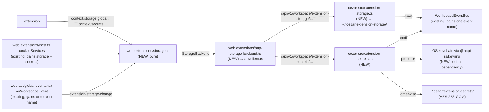

# Extension Storage API — global storage, secrets and change notifications

> Slug: `extension-storage-api` · Status: **designed, awaiting implementation** · Epic 1
> (Extension Runtime), item 6, part 1 of 2. Builds on `2026-09-18-extension-api-package.md`
> (the contract, merged in #3), `2026-09-18-extension-registry.md` (the host and its
> `services(scope)` seam, #6) and `2026-09-19-command-api.md` (the first real service, #11).
> Part 2, `2026-09-19-extension-project-storage.md`, adds `context.storage.project` on top of
> this spec's store, service and events. This spec covers **global storage, secrets, change
> notifications and clearing an extension's data**. Delivery: one PR to `main`, before part 2.

## 📝 TLDR

Today an extension can declare that it uses `context.storage`, but the cockpit hands it a
placeholder that rejects every call with "context.storage is not available in this Cezar
version yet". An extension that needs to remember anything has nowhere to put it except
`localStorage` or Cezar's own files. Both are internals, and neither is a safe place for an API
token.

This spec proposes three things.

**`context.storage.global`** will be a persistent key-value area per extension:

```ts
await ctx.storage.global.set('boardFilter', { mine: true })
const filter = await ctx.storage.global.get<{ mine: boolean }>('boardFilter')
ctx.storage.global.onDidChange(({ key }) => refresh(key))
```

**`context.secrets`** will hold strings such as API tokens. They are stored in the operating
system's keychain, or in an encrypted file where no keychain exists:

```ts
await ctx.secrets.store('jiraToken', token)
const token = await ctx.secrets.get('jiraToken')
```

**Namespacing, notifications and clearing:**

- The host binds both to the calling extension's id. Two extensions can use the same key
  without colliding, and through the API neither can name the other's data.
- The Cezar service keeps the data under `~/.cezar/`, so it survives reloads and restarts and
  is the same on every device that opens the cockpit.
- A change made in any tab or on any device reaches `onDidChange` listeners through the
  cockpit's existing server-sent-events (SSE) stream.
- The host can clear everything an extension stored. Nothing is deleted automatically.
- Nothing changes for users until an extension uses these APIs, because the built-in
  extension list still ships empty.

## Decisions

The owner answered the open questions on 2026-09-19. Rows marked *author* are follow-on choices
this spec makes inside those answers. Each can still be changed before merge.

| # | Question | Decision | By | Why |
|---|---|---|---|---|
| D1 | Where is the data kept? | **Files owned by the Cezar service.** This spec uses `~/.cezar/extension-storage/<extensionId>.json`, and part 2 adds each project's `.ai/cezar/extension-storage/`. Extensions reach them only through the API. The HTTP routes behind it are cockpit plumbing, not an extension contract. | owner | Data follows the user to every device that opens the cockpit, including hosted mode (`CEZ_REMOTE`). `localStorage` would keep a separate copy in each browser and lose it when site data is cleared. |
| D2 | API shape | **`context.storage.global`** replaces the flat `context.storage` methods. The key-value interface is renamed `StorageArea`, and part 2 adds `context.storage.project`. | owner | The brief spells `ctx.storage.project.set`. Keeping flat `storage.get` next to `storage.global.get` would give two names for one thing. The package is private and has no consumer outside this repository. |
| D3 | Isolation | **An API guarantee, not a sandbox.** Through `context.storage` and `context.secrets`, an extension can reach only its own data. Code in the cockpit's origin could still call the HTTP routes directly (item 1's § Risks). Deciding which code may run, and how isolated it is, belongs to the loader item. | owner | Only first-party, built-in extensions exist. A sandbox needs a worker or iframe runtime and the loader's trust model. |
| D4 | Limits | **A value may be up to 64 KiB, and an area up to 1 MiB and 1,000 keys.** A write over a limit rejects with `storage-quota`. | owner | This bounds the synchronous parse and write on the service's single thread. Raising a limit later is not breaking. |
| D5 | Secrets | **Add a secrets API in this spec.** | owner | Extensions need API tokens (the brief's Jira example), and plain JSON is readable by every process running as the user. |
| D6 | Where secrets live | **The OS keychain, with an encrypted file as the fallback.** The keychain is macOS Keychain, Windows Credential Manager or a Linux Secret Service, reached through `@napi-rs/keyring` as an **optional dependency**. Where it is missing or does not work (a VPS, Docker, a headless Linux), secrets go to `~/.cezar/extension-secrets/<extensionId>.json`, encrypted with AES-256-GCM (`node:crypto`) under a random key in `~/.cezar/extension-secrets.key` (`0600`). | owner | Secrets then work everywhere Cezar runs. |
| D7 | Change notifications | **In this spec, across every tab and device.** A new `extension-storage-change` event on the existing workspace SSE stream (`/api/v1/workspace/events`) carries the extension id, the area and the key, never the value. | owner | That stream already reaches every cockpit, including in hosted mode, where the WebSocket bus is not used. |
| D8 | Clearing an extension's data | **Manual, through a host API and `DELETE` routes.** Nothing is deleted automatically. The management-UI item adds the button that calls it. | owner | An extension that is briefly missing from the list (a failed registration, a dev branch) must not lose its data. |
| D9 | One spec or two? | **Two.** This one is global storage, secrets, notifications and clearing. Part 2 is project storage (`pin()`, following the project switch). | owner | Global storage works without project storage. Part 2 reuses this spec's store, service and events. |
| D10 | Scope of secrets | **Per extension, global only.** There are no per-project secrets. | author | Tokens usually belong to the user, which is VS Code's `SecretStorage` model too. An extension can keep a per-project secret under a key it builds from the project id that part 2's `onDidChangeProject` reports. |
| D11 | Size limits for secrets | **A value is a string of up to 1,024 characters, a key is up to 128 characters, and an extension holds at most 100 secrets.** | author | Windows Credential Manager caps a credential at 2,560 bytes of UTF-16, so 1,024 characters fits every keychain. Raising the limit later is not breaking. |
| D12 | What an `onDidChange` event carries | **`{ key?: string }`.** A missing `key` means "anything may have changed": the area was cleared, or the stream reconnected and events may have been missed. Listeners re-read what they need. | author | Values never travel on the stream, and the reconnect case is covered without a replay log. |

## 📝 Problem Statement

- **Extensions have no place to keep data.** `unavailableServices`
  (`packages/web/src/extensions/host.ts`) makes all four storage methods reject, and
  `cockpitServices` replaces only `commands`. The contract's storage paragraph ("private to the
  extension … where the data lives is the host's choice") has no host behind it.
- **The workarounds are internals.** An extension could write `localStorage` under an ad-hoc key
  (as cockpit modules do with their `cez-*` keys) or call a Cezar route such as `ui-state`.
  Either way it would depend on something that changes between releases. The `ui-state` bag
  would also mix one extension's data with every GUI preference and every other extension's
  data, and load all of it on every page load.
- **Integrations need credentials.** A Jira, Linear or deploy extension needs a token. Kept in
  plain storage, the token is readable by every process of the user, including the coding
  agents Cezar starts with unrestricted `Bash` (#430), and it lands in backups.
- **Nothing tells an extension that its data changed.** If a user edits an integration setting
  on their phone, the laptop's cockpit shows the old value until the extension happens to read
  again.

## 📝 Proposed Solution

1. **`context.storage.global`** is a `StorageArea` with `get`, `set`, `delete`, `keys` (item 1's
   signatures) and `onDidChange`.
2. **`context.secrets`** is an `ExtensionSecrets` with `get`, `store`, `delete`, `keys` and
   `onDidChange`. Values are strings.
3. **Namespacing by construction.** The host builds each activation's services from
   `scope.extension.id`, which is the manifest id the registry captured and froze at
   registration. The methods take only a key, so no parameter could name another extension. On
   disk and in the keychain, each extension's data sits under its own validated id.
4. **The service owns persistence.**
   - The cockpit calls new workspace-level routes under `/api/v1/workspace/`. The service
     validates, enforces limits and writes atomically (the existing `atomicWriteJsonSync`:
     tmp file and rename, `0600`).
   - Secrets go to the keychain when a probe shows that it works, and to the encrypted file
     otherwise.
5. **Every write is announced.** After each successful write, delete or clear, the service
   emits `extension-storage-change` on its `WorkspaceEventBus`. Every open cockpit receives it,
   and the cockpit's service calls the matching extension's listeners.
6. **Ordered, coded, bounded.** Within one cockpit tab, calls for one extension and area run in
   call order. Every failure rejects with an `isExtensionError`-recognisable code:
   `invalid-input`, `storage-quota`, `storage-unavailable` (new) or `disposed`. Every request is
   aborted after 15 s.
7. **Clearing is a host capability.** `clearExtensionData(extensionId, 'global' | 'secrets')`
   in the cockpit calls `DELETE` routes. Extensions cannot call it.

### Prior art

- **VS Code**: `globalState` is a `Memento`, and `context.secrets` is a `SecretStorage` backed
  by the OS keychain, with `get`, `store`, `delete`, `keys` and an `onDidChange` that carries
  `{ key }`. We adopt the split, the method names and the key-only event. On Linux without a
  keyring, VS Code falls back to weaker storage and warns. We do the same, with an encrypted
  file.
- **Chrome extensions**: `chrome.storage.local` is a `StorageArea` with quotas and an
  `onChanged` event that carries old and new values. We adopt the area name and quotas. We keep
  values off the event: they would reach every open cockpit.
- **Obsidian**: `loadData()`/`saveData()` keep one JSON file per plugin. We adopt one
  plain-JSON file per extension. We skip the whole-blob API: per-key writes cannot lose another
  tab's update to a different key.
- **Backstage**: `StorageApi.forBucket()` namespaces buckets, and user settings can be stored in
  the backend so they follow the user across devices (the reason for D1).
- **`keyring-rs`** (behind `@napi-rs/keyring`): on Linux, it falls back from Secret Service to
  the kernel keyutils store, which "will not persist across reboots". We pin Linux to Secret
  Service and use our own file fallback instead.

### Alternatives considered

- **Browser `localStorage`**: rejected by D1.
- **Reuse the `ui-state` routes.** Rejected. A whole-map PUT loses concurrent updates, the body
  limit is 128 KiB for all GUI preferences, and the bag loads on every page.
- **One file for all extensions.** Rejected. One corrupt write or one quota would affect every
  extension. With one file per extension, isolation is a property of the path.
- **Keychain only, no fallback, or an encrypted file only**: rejected by D6.
- **The WebSocket bus for notifications.** Rejected. Hosted mode opens no browser WebSocket
  (AGENTS.md § Real-time events), and a WebSocket topic is readable from any loopback origin.
  The workspace SSE stream is same-origin and already reaches every cockpit.
- **Automatic deletion of data for extensions no longer listed**: rejected by D8.

## 📝 Architecture



Extensions see only their own areas. The pure cockpit service binds the extension id and
delivers events, the HTTP backend is the only cockpit code that knows the routes, and the
service is the only code that touches files or the keychain.

- **Extension API (`packages/extension-api`).**
  - New types: `StorageArea`, `StorageChangeEvent`, `ExtensionSecrets`, and the new shape of
    `ExtensionStorage` (`{ global }`).
  - `ExtensionContext` gains `readonly secrets: ExtensionSecrets`.
  - `ExtensionErrorCode` gains `storage-unavailable`.
  - No new runtime export, so the surface snapshot is unchanged.
- **Cockpit (`packages/web`).**
  - `extensions/storage.ts` is a **pure module** like `registry.ts`, and its only import is the
    extension API. It validates, namespaces, orders, applies `assertLive`, maps errors and
    delivers change events. It gets an injected `StorageBackend` and an injected
    `subscribe(listener)` for change events.
  - `extensions/http-storage-backend.ts` adapts the new functions in `api/client.ts`, and wires
    `subscribe` to `onWorkspaceEvent` (`api/global-events.tsx`, whose `WORKSPACE_EVENT_NAMES`
    gains `extension-storage-change`).
  - `extensions/registry.ts`: `ExtensionServices` gains `'secrets'`, and the context assembly
    passes it through.
  - `host.ts`: `cockpitServices` gains `storage` and `secrets`, and `unavailableServices`
    gains a `secrets` placeholder.
  - `main.tsx` creates the service beside the command registry.
- **Service (`packages/cezar`).**
  - `src/extension-storage.ts` owns the generic file store: tolerant read, parse cache,
    synchronous read-modify-write and limits. It takes a directory, so part 2 reuses it.
  - `src/extension-secrets.ts` owns the keychain probe, the encrypted file, the index and the
    secret limits.
  - `server.ts`: routes as links in the workspace family's chain. `WorkspaceEventName` gains
    `'extension-storage-change'`.
  - `paths.ts`: the new home paths.
  - `package.json`: `optionalDependencies: { "@napi-rs/keyring": "^2.1.0" }`.
- **Contract (`packages/contract`).** A new `extension-storage.ts` holds the request and response
  schemas, the SSE payload schema and the limit constants.

## 📝 Data Model

### Global storage — `~/.cezar/extension-storage/<extensionId>.json`

```json
{ "version": 1, "entries": { "boardFilter": { "mine": true }, "lastSync": "2026-09-19T10:00:00Z" } }
```

- **The file name is the extension id**, validated against the id grammar (two
  `[a-z0-9][a-z0-9-]*` segments joined by a dot, ≤ 64 characters) before any path is built. An
  id therefore cannot escape the directory. Keys are property names in the file, never paths.
- **Writes** use `atomicWriteJsonSync` (tmp file and rename, `0600`, directory `0700`,
  pretty-printed and hand-editable). A file is created on the first `set`.
- **Delete rules.** When the last key is deleted and the file has no top-level keys other than
  `version` and `entries`, the file is removed. Otherwise it keeps an empty `entries`, so unknown
  keys survive (BACKWARD_COMPATIBILITY.md §9: never strip keys you do not know).
- **Newer format.** A file whose `version` is greater than 1 is neither read nor written. Calls
  reject with `storage-unavailable` ("written by a newer Cezar"), and the file is never treated
  as corrupt.
- **Corrupt file.** A file is corrupt when it is not JSON, is not an object, or has no object
  `entries` while its `version` is 1 or absent. Reads treat it as empty and log one warning per
  file per process. The next write renames it to `<extensionId>.json.corrupt`, replacing any
  older copy, and then writes a fresh file.
- **Parse cache.** Parsed areas are kept in memory by path, checked against the file's `mtimeMs`
  and `size` before use, and updated by the store's own writes. The cache holds at most 32
  files and evicts the least recently used.
- **Keys are a `Map`** inside the store, so `__proto__` and `constructor` are ordinary keys.

### Secrets — index `~/.cezar/extension-secrets/<extensionId>.json`

```json
{
  "version": 1,
  "entries": {
    "jiraToken": { "store": "keychain" },
    "linearToken": { "store": "file", "iv": "…base64…", "tag": "…base64…", "data": "…base64…" }
  }
}
```

- **The index is the list of keys** and records where each value lives. It never holds a
  plain-text value. It has the same id rule, write path, `version` rule and corrupt-file rule as
  the storage file.
- **Keychain entries** use service `cezar-ext-secrets/<homeId>/<extensionId>` and the secret's
  key as the account. `homeId` is the first 12 hex characters of the SHA-256 of the real path of
  `cezarHomeDir()`, so two Cezar homes (tests, containers, a second install) never share
  entries. On Linux, entries are pinned to `{ linux: { store: 'secret-service' } }`, which is
  never the non-persistent keyutils store.
- **File entries** are AES-256-GCM encrypted with a fresh 12-byte IV per write. The key is in
  `~/.cezar/extension-secrets.key`, 32 random bytes, base64, `0600`, created on the first file
  write. The extension id and secret key are the additional authenticated data (AAD), so an
  encrypted value copied onto another key or extension fails to decrypt.
- **Choosing the store.** At the first secret write, the service probes the keychain once per
  process, with a write, read and delete of a probe entry within 5 s. A missing optional
  dependency, a failed probe or a timeout means the file store for the rest of the process, and
  one warning naming the reason. Each value is read from the store its index entry names, so a
  machine that gains or loses a keychain keeps reading older values. A secret written again goes
  to the store that is current.
- **Losing the key file.** If `extension-secrets.key` is deleted, file entries can no longer be
  decrypted. Reads of those keys resolve `undefined` and log one warning. A new key file is
  created on the next file write, and entries that no longer decrypt are dropped then. This is
  the reset path, consistent with § Zero config.
- **Keychain unreachable later** (an SSH session without D-Bus, a locked keychain, a call over
  5 s). A read or write of a keychain-stored key rejects with `storage-unavailable`. It never
  reports the key as absent: an extension that took "absent" to mean "ask the user for a new
  token" would do the wrong thing.

### Change event — workspace SSE, name `extension-storage-change`

```json
{ "extensionId": "acme.jira", "area": "global", "key": "boardFilter" }
```

- `area` is `global` or `secrets` here, and part 2 adds `project` with a `project` field.
- `key` is absent after a clear.
- The value is never sent.
- The payload schema lives in the contract.

## 📝 API Contracts

### Extension API

```ts
/** `key` absent: anything may have changed (the area was cleared, or events may have been missed). */
export interface StorageChangeEvent { readonly key?: string }

/**
 * One key-value area: JSON values, asynchronous. Keys are non-empty, well-formed strings of at
 * most 128 characters. A value is at most 64 KiB serialized; an area holds at most 1 MiB and
 * 1,000 keys. Over a limit → `storage-quota`. Not for credentials — use `context.secrets`.
 */
export interface StorageArea {
  /** Unchecked cast: data may have been written by an older version of the extension — validate it. */
  get<T = JsonValue>(key: string): Promise<T | undefined>
  /** `undefined` is refused (`invalid-input`) — use `delete`. */
  set<T>(key: string, value: T & (IsJson<T> extends true ? unknown : never)): Promise<void>
  /** Idempotent. */
  delete(key: string): Promise<void>
  /** Sorted. */
  keys(): Promise<string[]>
  /**
   * Called after a change from any tab or device, including this extension's own writes.
   * Asynchronous, at most once per change, never with the value. Disposed with the extension.
   */
  onDidChange(listener: (event: StorageChangeEvent) => void): Disposable
}

/** Namespaced by the host under the extension's id. Part 2 adds `project`. */
export interface ExtensionStorage {
  /** The same in every project. */
  readonly global: StorageArea
}

/**
 * Credentials, kept in the OS keychain or, where there is none, in a file encrypted at rest.
 * Values are strings of at most 1,024 characters; at most 100 secrets per extension.
 * Encryption at rest protects copies and backups, not a process running as the same user.
 */
export interface ExtensionSecrets {
  get(key: string): Promise<string | undefined>
  store(key: string, value: string): Promise<void>
  delete(key: string): Promise<void>
  keys(): Promise<string[]>
  onDidChange(listener: (event: StorageChangeEvent) => void): Disposable
}
```

- `ExtensionContext` gains `readonly secrets: ExtensionSecrets`.
- `index.ts` exports the new types.
- `errors.ts` adds `storage-unavailable`, documented as: *"the storage could not be reached:
  the service is down or did not answer in time, the keychain is unreachable, a file was
  written by a newer Cezar, or the disk refused the write. For a write, the outcome is unknown —
  read before retrying a change that depends on it."*
- The `invalid-input` TSDoc gains "a storage key or value the host refused".

### Cockpit service (`packages/web/src/extensions/storage.ts`, cockpit-internal)

```ts
export type StorageTarget = { readonly area: 'global' } | { readonly area: 'secrets' }  // part 2 adds project

export interface StorageChange {
  readonly extensionId: string
  readonly area: 'global' | 'secrets'
  readonly key?: string
}

export interface StorageBackend {
  get(target: StorageTarget, extensionId: string, key: string): Promise<{ found: true; value: JsonValue } | { found: false }>
  set(target: StorageTarget, extensionId: string, key: string, value: JsonValue): Promise<void>
  delete(target: StorageTarget, extensionId: string, key: string): Promise<void>
  keys(target: StorageTarget, extensionId: string): Promise<string[]>
  clear(target: StorageTarget, extensionId: string): Promise<void>
  /** Change events from the service; `reconnected()` fires when the stream reopens. Returns an unsubscribe. */
  subscribe(listener: { change(event: StorageChange): void; reconnected(): void }): () => void
}

export interface ExtensionStorageService {
  forExtension(scope: ExtensionScope): { storage: ExtensionStorage; secrets: ExtensionSecrets }
  /** Host-only (D8): removes everything an extension stored in that area. Never exposed to extensions. */
  clearExtensionData(extensionId: ExtensionId, area: 'global' | 'secrets'): Promise<void>
}

export function createExtensionStorageService(options: { readonly backend: StorageBackend }): ExtensionStorageService

/** Recognised by `isExtensionError`. */
export class ExtensionStorageError extends Error {
  readonly code: 'invalid-input' | 'storage-quota' | 'storage-unavailable' | 'disposed'
}
```

Every data method, in this order:

1. **Liveness.** `scope.assertLive()`; its `disposed` error becomes the rejection. Methods never
   throw synchronously.
2. **Validation.**
   - The key must be a string of 1–128 characters with no lone surrogate.
   - A storage value must survive a JSON round trip unchanged. An object property whose value
     is `undefined` is omitted, as in JSON. A top-level `undefined`, a non-finite number, a
     function, a symbol, a `bigint`, a class instance (including `Date`), a cycle, or nesting
     deeper than 64 levels is refused.
   - A secret value must be a string of 0–1,024 characters with no lone surrogate.
   - Any failure → `invalid-input`, with no request made. Messages name the rule, never the
     value.
3. **Ordering.** The call joins the queue for `(extensionId, target)`, and calls in one queue run
   one after another. A rejected call does not block the next one.
4. **Backend call and error mapping.** Coded errors pass through. Anything else becomes
   `storage-unavailable`, with the original as `cause`.
5. **Result.** `get` resolves with a freshly parsed value, never a shared reference.

`onDidChange(listener)` calls `assertLive()`, registers the listener through `scope.track()`
(so it is disposed on deactivation) and returns that `Disposable`. Delivery rules:

- The service subscribes to the backend **once**, on the first listener, and unsubscribes when
  the last one goes, so no stream work happens until an extension listens.
- An event reaches a listener only when its `extensionId` and `area` match the listener's own.
- `reconnected()` sends every listener a key-less event.
- Each listener runs in a microtask, inside a `try`. A throw is logged with the
  `[cezar:extensions]` prefix and never reaches the emitter or other listeners, which is the
  events contract from item 1.

### HTTP routes (workspace-level; BACKWARD_COMPATIBILITY.md §2 inventory)

All routes are links in the workspace family's chain. Validation is middleware through the
`validators.ts` trio, and each schema lives in `packages/contract/src/extension-storage.ts`.

| Method and path | Request | Response |
|---|---|---|
| `GET /api/v1/workspace/extension-storage/:extensionId` | — | `{ keys: string[] }` |
| `GET /api/v1/workspace/extension-storage/:extensionId/entry?key=` | — | `{ found: true, value } \| { found: false }` |
| `PUT /api/v1/workspace/extension-storage/:extensionId/entry?key=` | `{ value: JsonValue }` | `{ ok: true }` |
| `DELETE /api/v1/workspace/extension-storage/:extensionId/entry?key=` | — | `{ ok: true }` |
| `DELETE /api/v1/workspace/extension-storage/:extensionId` | — | `{ ok: true }` (clear) |
| `GET /api/v1/workspace/extension-secrets/:extensionId` | — | `{ keys: string[] }` |
| `GET /api/v1/workspace/extension-secrets/:extensionId/entry?key=` | — | `{ found: true, value: string } \| { found: false }` |
| `PUT /api/v1/workspace/extension-secrets/:extensionId/entry?key=` | `{ value: string }` | `{ ok: true }` |
| `DELETE /api/v1/workspace/extension-secrets/:extensionId/entry?key=` | — | `{ ok: true }` |
| `DELETE /api/v1/workspace/extension-secrets/:extensionId` | — | `{ ok: true }` (clear: keychain entries, then the index) |

- **Keys** travel in the query string, so `/`, `%`, `?` and `#` need no path encoding.
- **Stored values** are the request's own JSON, as its parser produced it. The schema validates
  the value but does not replace it, so a nested `__proto__` key round-trips unchanged.
- **Discriminant.** `found` is `true as const` / `false as const`, so it does not widen to
  `boolean`.
- **Body limits.** `bodyLimit` of 96 KiB for storage PUTs and 8 KiB for secret PUTs, on `use`
  (as in the `ui-state` routes).
- **Secret responses** carry `Cache-Control: no-store`. No secret value, request body or
  keychain error text is ever logged or put in an error body.
- **Status codes.** 400 invalid, 413 over a limit, 409 for a file from a newer Cezar, 503 when
  the keychain is unreachable for a keychain-stored key, 500 when a write fails. Error bodies
  are the usual `{ error }`.
- **Events.** Each successful PUT or DELETE, including a DELETE of an absent key, emits
  `extension-storage-change` on the `WorkspaceEventBus`, after the write.

### Cockpit HTTP backend

- **Client functions.** `api/client.ts` adds `get/put/deleteExtensionStorageEntry`,
  `getExtensionStorageKeys`, `clearExtensionStorage` and the five secrets twins.
- **Time limit.** Each request is **aborted** after 15 s, and the queue continues only after the
  abort.
- **Mapping.** 413 → `storage-quota`. 400 → `invalid-input` (a bug: the service validates
  first). 409, 500, 503, a network error or an abort → `storage-unavailable`.
- **`subscribe`** registers an `onWorkspaceEvent` listener for `extension-storage-change` and
  parses the payload with the contract schema, dropping anything that does not parse.
  `global-events.tsx` gains `onWorkspaceStreamReopened(listener)`, fired from its existing
  `open` handler after the first open, which `subscribe` maps to `reconnected()`.

### Concurrency

- **Within one Cezar process**, every write is a synchronous read → modify → atomic write with no
  `await` in between, so two tabs writing different keys both keep their change.
- **Across Cezar processes**, all of them share `~/.cezar/extension-storage/`. The last writer
  wins for the whole file, within the window between one process's read and its rename. The
  file is never torn. This is the trade-off `mergeWriteWorkspaceConfig` accepts.
- **Events.** A write by *another* Cezar process emits no event in this one: each process
  announces its own writes to its own cockpits. The TSDoc says "at most once".

## 📝 UI/UX

None in this item: no screen, route, setting or string changes. The management-UI item adds a
"Clear data" action that calls `clearExtensionData`.

## 📝 Edge Cases & Failure Scenarios

| Scenario | Behaviour |
|---|---|
| Two extensions write `boardFilter` or store `token` | Separate files and keychain services; each reads its own value. |
| A key that names another extension (`../beta.jira`) | An ordinary key inside the caller's own namespace. |
| A setting changed on the phone while the laptop cockpit is open | The laptop's listeners get `{ key }` within the SSE latency and re-read. |
| The SSE stream drops and reconnects | Listeners get one key-less event per reconnect, and changes in the gap are covered by re-reading. |
| A listener throws | Logged; other listeners and the writer are unaffected. |
| No keychain (Docker, VPS, headless Linux) | Probe fails → encrypted file, one warning. Secrets work. |
| The optional dependency did not install (an unsupported platform) | The dynamic `import()` fails → encrypted file, one warning. Cezar installs and boots as before. |
| Linux with no Secret Service but with keyutils | Treated as no keychain: the entry is pinned to Secret Service, so the probe fails. The volatile kernel store is never used. |
| The keychain was used, and later the session has no D-Bus | Keychain-stored keys → `storage-unavailable` (503); file-stored keys still work; `keys()` still works (index). |
| The key file is deleted | File-stored secrets read as `undefined` (one warning); new writes create a new key. |
| The index is deleted but keychain entries remain | Keys read as absent; the entries are orphaned in the keychain until a `store` with the same key overwrites them. The README names the service prefix for a manual clean-up. |
| A secret over 1,024 characters, a 101st secret, a value over 64 KiB, a 1,001st key, an area over 1 MiB | `storage-quota`; nothing changes. |
| A secret or storage file from a newer Cezar | 409 → `storage-unavailable`; the file is left untouched. |
| A corrupt storage file | Reads are empty with one warning; the next write keeps `<id>.json.corrupt`. |
| `__proto__` as a key or as a nested key | Round-trips unchanged (tests). |
| A deeply nested body sent straight to the route (10,000 levels) | 400 or 413, never a crash (test). |
| The service is down or does not answer within 15 s | Aborted → `storage-unavailable`; a write's outcome is unknown (TSDoc). |
| A read-only home | 500 → `storage-unavailable`; never a boot failure (§ Zero config). |
| A clear while listeners are active | One key-less event per listener; later reads are empty. |
| A call after deactivation | `disposed`; listeners are gone. |

## 📝 Risks & Impact Review

- **A new place for state outside `~/.cezar/` (AGENTS.md § Zero config).** Keychain entries live
  in the OS keychain, not in any of the three state directories, so deleting `~/.cezar/` does not
  remove them. The owner approved this on 2026-09-19 (D6). `AGENTS.md` gains an "owner-approved
  exception" bullet naming the service prefix and the reset path, in the same PR as the code.
- **A native optional dependency in the published package (BACKWARD_COMPATIBILITY.md §6).**
  - `@napi-rs/keyring` ships prebuilt binaries as its own optional dependencies.
  - As an `optionalDependencies` entry of `@open-mercato/cezar`, a failed install does not fail
    `npm install`, and the code loads it with a guarded dynamic `import()`.
  - `check:pack` is unaffected (it checks files). `test:package` must still pass from the
    tarball, and a new e2e assertion checks that the CLI boots when the module is absent.
  - Tests never touch a real keychain: the secrets module takes an injected keychain, and a
    vitest guard (like `assertCezarHomeWriteIsSandboxed`) refuses the real one.
- **Secrets reach the browser.** Extensions run in the cockpit, so `get` returns the plain text
  to page code, over loopback locally and over the authenticated proxy in hosted mode. The
  secret is protected at rest, not from code running in the cockpit. The README and TSDoc say
  so.
- **The encrypted-file fallback protects copies, not the user's own processes.** The key sits
  beside the data, readable by the same user. That is enough for backups and a copied
  directory, and it is stated plainly (D6).
- **Compatibility surfaces (all additive):**
  - §2: ten routes, and the SSE event name `extension-storage-change` on the workspace stream.
  - §9: `extension-storage/`, `extension-secrets/`, `extension-secrets.key`, and the keychain
    service prefix.

  `bc-route-inventory.test.ts` fails until the §2 route entries exist. The §9 and event-name
  entries land with the code that creates them and are checked in review.
- **Extension API type change.** Flat `storage.get` becomes `storage.global.get`, and `secrets`
  is added. The package is private, `0.x` and experimental. The users of the old shape are the
  example, `test/fake-context.ts`, `test/components-storage.test.ts`, the web placeholder,
  `registry.fixtures.ts`, `registry.test.ts` and `host.test.ts`, and all of them change in the
  same step.
- **The default path.** With `BUILTIN_EXTENSIONS` empty, `main.tsx` creates one object:
  - no request is made and no SSE listener is added until an extension listens;
  - the keychain is not probed until the first secret write;
  - nothing at boot reads the new files (AGENTS.md § Changing a mechanism).
- **Every call has an exit.** Requests are aborted at 15 s, keychain calls give up at 5 s, and
  the queues cannot deadlock because each call waits only for the calls ahead of it.
- **Rollback.** Revert the PR. The placeholders return, and files and keychain entries already
  written stay, harmless and unread.

## 📋 Phasing

1. **Phase 1 — The contract.** The new types, `secrets` on the context and
   `storage-unavailable`, with the placeholders, fakes, type tests and README updated. Ships
   alone: the services still reject "not available yet".
2. **Phase 2 — Service: global storage.** File store, parse cache, routes and events.
3. **Phase 3 — Service: secrets.** Keychain probe, encrypted fallback, index, routes and events.
4. **Phase 4 — Cockpit.** The pure service, the HTTP backend, event delivery, clearing, wiring and
   docs. With this phase, extensions can use `storage.global` and `secrets`.

## 📋 Implementation Plan

Every step keeps `npm run typecheck`, `npm test`, `npm run test:unit`, `npm run build` and
`npm run test:package` green. Service tests pin `CEZ_HOME` through the existing vitest setup.

### Phase 1 — The contract

1. **Types, placeholders and fakes.**
   - Code:
     - `packages/extension-api`: `StorageArea`, `StorageChangeEvent`, `ExtensionStorage
       { global }`, `ExtensionSecrets` and `ExtensionContext.secrets`, with TSDoc; exports;
       `storage-unavailable` in the union and in `ERROR_CODES`; the example uses
       `context.storage.global`; `test/fake-context.ts` gains a global map, a secrets map and
       recorded listeners.
     - `packages/web`: `ExtensionServices` gains `'secrets'` and the registry passes it into the
       context; `unavailableServices` gains `storage.global.*`, `storage.global.onDidChange` and
       `secrets.*` placeholders; `registry.fixtures.ts`, `registry.test.ts` and `host.test.ts`
       move to the new shape.
     - README § Storage and a new § Secrets.
   - *Test:*
     - Type tests: `context.storage.global.set('k', { a: 1 })` compiles, `context.storage.set`
       is an error, `context.secrets.store('t', 'x')` compiles, `store('t', 1)` is an error.
     - `isExtensionError(e, 'storage-unavailable')`.
     - The example still counts.
     - Every placeholder (including `secrets`) rejects "not available yet" and, after
       deactivation, rejects `disposed`.
     - The registry passes `secrets` into the context.
     - The surface snapshot is unchanged.

### Phase 2 — Service: global storage

2. **The file store.**
   - Code:
     - `packages/cezar/src/extension-storage.ts`, generic over a directory: `readArea` with the
       cache, synchronous `setEntry`/`deleteEntry`/`clearArea`, `listKeys`, the delete, version
       and corrupt rules, and the limits.
     - `paths.ts`: `extensionStorageHomeDir()`.
     - Contract schemas and `EXTENSION_STORAGE_LIMITS`.
     - BACKWARD_COMPATIBILITY.md §9 entry.
   - *Test:*
     - Round trip and sorted keys; delete and file removal versus unknown keys kept.
     - A `version: 2` file is refused and not renamed.
     - Each limit rejects and leaves the file unchanged.
     - A corrupt file reads empty, warns once, and is kept as `.corrupt` on the next write.
     - Cache: no re-parse (spy), an external edit is seen, a deleted file reads empty, LRU
       eviction.
     - `__proto__`/`constructor` keys.
     - Invalid ids are refused before any path is built.
     - Files are `0600`.
3. **Global storage routes and the change event.**
   - Code:
     - The five `/workspace/extension-storage/…` links, the body limit on `use`, and the PUT
       storing the parser's value.
     - `WorkspaceEventName` gains `'extension-storage-change'`, with the payload schema in the
       contract.
     - BACKWARD_COMPATIBILITY.md §2 (routes and event name).
   - *Test:*
     - Contract parity (both directions), `typed-bodies.test.ts` and `bc-route-inventory.test.ts`.
     - 400/409/413 cases, and a 10,000-level body gives 400 or 413.
     - A nested `__proto__` round-trips.
     - Persistence through a freshly created app on the same `CEZ_HOME`.
     - A read-only home gives 500 and the server keeps serving.
     - A `WorkspaceEventBus` spy sees exactly one event per successful PUT and DELETE, and one
       key-less event per clear, never with a value.
     - `/api/v1/workspace/events` relays the event to a connected stream.

### Phase 3 — Service: secrets

4. **The secrets store.**
   - Code:
     - `packages/cezar/src/extension-secrets.ts`: the index (same rules as the storage file), a
       `Keychain` interface (`set/get/delete`, async) with the `@napi-rs/keyring` adapter (a
       guarded dynamic `import()`, `AsyncEntry`, Linux pinned to `secret-service`), the probe
       (once per process, 5 s), the AES-256-GCM file store (per-write IV, extension id and key
       as AAD, key file created on demand, `0600`), the `homeId` service name, and the limits.
     - `packages/cezar/package.json` gains the optional dependency, and `npm install` updates
       the lockfile.
     - A vitest guard makes constructing the real keychain adapter throw under vitest.
     - BACKWARD_COMPATIBILITY.md §9 entries.
     - `AGENTS.md` § Zero config gains the owner-approved keychain exception.
   - *Test* (with a fake `Keychain`):
     - A working keychain stores values there, and the index says `keychain` with no value.
     - A throwing, hanging (5 s, fake timers) or absent keychain → file store, one warning.
     - File round trip; decryption fails when an entry is moved to another key or extension
       (AAD).
     - A deleted key file → `undefined` and a warning, and the next write creates a new key and
       drops the stale entries.
     - A keychain entry whose keychain later fails → `storage-unavailable`, never absent.
     - `homeId` differs for two homes.
     - Limits (1,024 characters, 100 secrets); a lone surrogate is refused.
     - No value appears in any thrown error message or log line (spy).
5. **Secrets routes.**
   - Code: the five `/workspace/extension-secrets/…` links with `Cache-Control: no-store`, the
     8 KiB body limit, events, and the §2 entries.
   - *Test:*
     - Parity, typed bodies and inventory.
     - `no-store` on every secrets response.
     - A 503 when the fake keychain fails on a keychain-stored key.
     - Clear removes the keychain entries and the index, and emits one key-less event.
     - Error bodies never contain the value (assert on a known value).
   - `test:package`: the CLI boots and answers `GET /workspace/extension-secrets/x.y` with the
     optional module hidden (for example, `NODE_PATH` isolation or a stub that throws on
     import).

### Phase 4 — Cockpit

6. **Pure service and HTTP backend.**
   - Code:
     - `extensions/storage.ts` (§ Cockpit service).
     - The `api/client.ts` functions.
     - `extensions/http-storage-backend.ts`.
     - `global-events.tsx`: the event name and `onWorkspaceStreamReopened`.
   - *Test* (`storage.test.ts`, in-memory backend with a controllable `subscribe`):
     - **Two extensions, same key, no collision**, in `global` and in `secrets`.
     - The only parameters are keys; a key naming another id stays in the caller's namespace.
     - Call order and read-your-write within a queue, and a rejected call does not block the
       next.
     - Every `invalid-input` rule rejects with no backend call.
     - Error mapping, including uncoded → `storage-unavailable` with `cause`.
     - `get` returns a fresh copy.
     - Events: a matching event reaches only the matching extension and area; `reconnected()`
       sends every listener a key-less event; a throwing listener is isolated; the backend is
       subscribed on the first listener and unsubscribed after the last.
     - After deactivation, calls reject `disposed` and listeners receive nothing.
     - `clearExtensionData` calls the backend's `clear` and is not reachable from the context
       (type test).
     - The contract's id regex and `isValidExtensionId` agree on a table of ids.
   - *Test* (`client.test.ts`, `http-storage-backend.test.ts`, stubbed `fetch` and event
     source):
     - URLs and key encoding.
     - The status mapping.
     - The 15 s abort (fake timers).
     - Payload parsing drops malformed events.
     - Reopen → `reconnected()`.
7. **Wiring and docs.**
   - Code:
     - `cockpitServices({ commands, storage })` supplies `storage` and `secrets` from
       `forExtension(scope)`.
     - `main.tsx` creates `createExtensionStorageService({ backend: httpStorageBackend })`.
     - `AGENTS.md`: the extensions routing row gains the storage and secrets rules (pure
       service, one file per extension, secrets never logged, API isolation is not a sandbox,
       clearing is host-only).
     - README status line.
   - *Test* (`host.test.ts`):
     - A fixture extension activated through `cockpitServices`, with the real
       `httpStorageBackend` over a stubbed `fetch` and event source, writes and reads
       `global`, stores and reads a secret, and receives an `onDidChange` for an event the stub
       emits.
     - After deactivation, calls reject `disposed`.
     - `npm run build` bundles the code.
