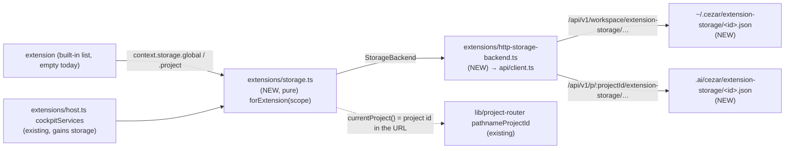

# Extension Storage API — `context.storage.global` and `context.storage.project`

> Slug: `extension-storage-api` · Status: **designed, awaiting implementation** · Epic 1
> (Extension Runtime), item 6. Builds on `2026-09-18-extension-api-package.md` (the contract,
> merged in #3), `2026-09-18-extension-registry.md` (the host and its `services(scope)` seam,
> #6) and `2026-09-19-command-api.md` (the first real service, #11). This spec covers **the
> storage service only**. Change notifications, a secrets API and a "clear this extension's
> data" control are later items. Delivery: one PR to `main`.

## 📝 TLDR

Today an extension can declare that it uses `context.storage`, but the cockpit hands it a
placeholder that rejects every call with "context.storage is not available in this Cezar
version yet". An extension that needs to remember anything, such as which Jira project a repo
maps to, has nowhere to put it except `localStorage` or Cezar's own files. Both are internals.

The proposal is that **each extension will get two persistent key-value areas**:
`context.storage.global` for data that is the same in every project, and
`context.storage.project` for data that belongs to the project the cockpit is showing:

```ts
await ctx.storage.project.set('jiraProject', 'ABC')
const jiraProject = await ctx.storage.project.get<string>('jiraProject')
```

Both areas are bound to the calling extension's id by the host. An extension never passes its
id, and through `context.storage` it has no way to name another extension's data. The Cezar
service keeps the data as plain JSON files (`~/.cezar/extension-storage/` and each project's
`.ai/cezar/extension-storage/`), so it survives reloads and restarts and is the same on every
device that opens the cockpit.

`project` resolves the project in the cockpit's URL **at each call**, so switching projects
switches what `project` reads and writes. On a page outside any project, it rejects rather than
guessing. `project.pin()` gives a multi-step flow an area that stays on one project. Nothing
changes for users until an extension uses storage, because the built-in extension list still
ships empty.

## Resolved assumptions (autonomous defaults)

The brief left these open. Each default is the most reversible choice. All are safe to change
before merge: the extension API package is private, no extension uses storage yet, and nothing
has been written to disk.

| # | Question | Applied default | Why |
|---|---|---|---|
| Q1 | Ship the global and project scopes in one spec, or split them? | **One spec.** | Both scopes use the same interface, the same service and the same file format, and differ only in which directory a file lives in. The brief's Definition of Done needs both. Splitting them would review the same mechanism twice. |
| Q2 | Where is the data kept: the browser's `localStorage`, or files owned by the service? | **Files owned by the service**: `~/.cezar/extension-storage/<extensionId>.json` for `global`, and `<project>/.ai/cezar/extension-storage/<extensionId>.json` for `project`. Extensions reach them only through the API. The HTTP routes behind that API are cockpit plumbing, not an extension contract. | The brief's example (`jiraProject`) is a per-project setting. `localStorage` would keep a separate copy in each browser and device, and lose it when site data is cleared. That is a real split in hosted mode (`CEZ_REMOTE`), where one cockpit is opened from several devices. `.ai/cezar/` is already where Cezar keeps a project's state, and `~/.cezar/` is where it keeps per-user state. `ExtensionStorage` is async, so the backend can change later without an API break. |
| Q3 | Replace the flat `context.storage` with `context.storage.{global,project}`, or keep flat `storage` as the global scope and add `project` beside it? | **Replace.** The key-value interface is renamed `StorageArea` (same four methods). `ExtensionStorage` becomes `{ global: StorageArea; project: ProjectStorageArea }`. | The brief's example spells `ctx.storage.project.set`. Keeping `storage.get` as a second spelling of `storage.global.get` gives two names for one thing. The type is private and has no consumer outside this repository: `BUILTIN_EXTENSIONS` is empty, and only the package's own tests, its example and two web test helpers use it. |
| Q4 | Is "an extension cannot read another's storage" an API guarantee, or a sandbox against hostile code? | **An API guarantee.** Through `context.storage`, an extension can reach only its own two areas. It is not a sandbox: extension code runs in the cockpit's origin and could call the HTTP API directly, which item 1's § Risks already records. Deciding which code may run, and how isolated it is, belongs to the loader item. | Only built-in, first-party extensions exist today, and nothing third-party runs. A sandbox needs a separate runtime (a worker or an iframe). Item 1 kept that possible by making everything that crosses the boundary JSON, and this item keeps it possible too. |
| Q5 | What is "the current project", and what does `project` do on pages without one (global settings, the cross-project Tasks page)? | **The project in the cockpit's URL** (`/p/:projectId/…`), read with the existing `pathnameProjectId`. On a page with no project in its URL, `project` rejects with `storage-unavailable` ("no project is open"). | The API scope (`queryScope()`) cannot tell the boot project from "no project": the boot project mounts with a `null` scope (`routes.tsx`), and so do pages outside any project. The URL is what the cockpit's own links use (`useActiveProjectId`). Rejecting on a global page means an async flow that started in project A cannot quietly write into the boot project after the user leaves. |
| Q6 | Change notifications (`onDidChange`, a project-switch event): now or later? | **Later.** Reads always go to the server, so they are never stale. The events item can add `cezar.project.changed` and a storage-change event. Until then, `project.pin()` covers the one hazard of switching mid-flow. | The events service is still a placeholder. Notifications are additive, and nothing in this item needs them. |
| Q7 | Size limits? | **A value may be up to 64 KiB, and one area (one extension, one scope, one project) up to 1 MiB and 1,000 keys.** A write over a limit rejects with `storage-quota`. | Item 1 reserved `storage-quota` for this. The limits bound the synchronous parse and write on the server's single thread, and an in-process parse cache means repeated reads do not re-parse. Raising a limit later is not breaking. |
| Q8 | Is the storage a place for secrets (API tokens)? | **No.** Values are plain JSON in `0600` files, readable by anything running as the user, including the coding agents Cezar starts. The TSDoc and README say so. A secrets API is a later item. | VS Code keeps `SecretStorage` apart from its key-value `Memento` for the same reason. Encrypting at rest would need a key store, and the house rules forbid a hand-rolled or "TODO encrypt later" answer. |
| Q9 | Is an extension's data purged when the extension is removed, or when its project is deregistered? | **No purge.** Data stays until its file is deleted. Deregistering a project already leaves its `.ai/cezar/` in place. | Extensions come from a static list, so "uninstall" does not exist yet. Leftover data is harmless, and deleting the file is the documented reset. A "clear data" action belongs with the management-UI item. |

## 📝 Problem Statement

- **Extensions have no place to keep data.** `unavailableServices`
  (`packages/web/src/extensions/host.ts`) makes all four storage methods reject, and
  `cockpitServices` replaces only `commands`. The contract's storage paragraph ("private to the
  extension … where the data lives is the host's choice") has no host behind it.
- **The workarounds are internals.** An extension could write `localStorage` under an ad-hoc key
  (as cockpit modules do with their `cez-*` keys) or call a Cezar route such as `ui-state`.
  Either way it would depend on something that changes between releases. The `ui-state` bag
  would also mix one extension's data with every GUI preference and every other extension's
  data, and load all of it on every page load.
- **One scope is not enough.** The contract has one key-value scope per extension, and item 1
  deferred project-scoped storage (item 1, Q8). Most integration data is per project (a Jira
  project, a deploy target, a label mapping), while some is per user (a display preference).
  Cezar is a multi-project cockpit (spec `2026-07-20-multi-project-workspace`), so an extension
  that keeps project data in one global area must build its own `projectId → value` map and has
  no reliable way to know the current project.

## 📝 Proposed Solution

1. **Two areas on the context.** `context.storage.global` and `context.storage.project` are both
   `StorageArea`s with `get`, `set`, `delete` and `keys`. The method signatures are exactly
   item 1's.
2. **Namespacing by construction.** The host builds each activation's storage from
   `scope.extension.id`, which is the manifest id the registry captured and froze at
   registration. The area methods take only a key, so there is no parameter that could name
   another extension. On disk, each extension has its own file per area, and the file name is
   the validated extension id. Two extensions can use the same key without colliding because
   their keys are in different files.
3. **The project is resolved per call, from the URL.** Every `project` method reads the project
   id in the cockpit's URL synchronously, when the method is called, and that call uses that
   project from start to finish. After a project switch, the next call goes to the new project's
   file, and the old project's data stays where it was. On a page with no project in its URL,
   the call rejects.
4. **Pinning for multi-step flows.** `project.pin()` returns a `StorageArea` fixed to the
   project that is current when it is called. An extension that reads a value, waits for a
   network call and writes a result back uses the pinned area, so a project switch in between
   cannot send the write to the wrong project.
5. **The service owns the files.** The cockpit calls new project-scoped and workspace-level
   routes under `/api/v1`. The service validates the id, the key and the value, enforces the
   limits, and writes atomically (tmp file and rename, `0600`, through the existing
   `atomicWriteJsonSync`).
6. **Ordered, coded, bounded.** Within one cockpit tab, calls for the same extension, area and
   project run in call order, so an un-awaited `set` followed by `get` reads the new value. Every
   failure rejects with an `isExtensionError`-recognisable code: `invalid-input`,
   `storage-quota`, `storage-unavailable` (new) or `disposed`. Every request is aborted after a
   time limit, so no call can hang forever.

### Prior art

- **VS Code**: `ExtensionContext.globalState` and `workspaceState` are two `Memento`s
  (`get`/`update`/`keys`), and credentials go in a separate `SecretStorage`. We adopt the two
  scopes, the separation of secrets (Q8) and `keys()`. We skip `setKeysForSync` (settings sync).
  VS Code opens one workspace per window, while the cockpit switches projects inside one page.
  That is why `project` is resolved per call, with `pin()` for flows that must stay on one
  project.
- **Chrome extensions**: `chrome.storage.local`, `sync` and `session` are `StorageArea`s with
  quotas and an `onChanged` event. We adopt the name `StorageArea` and explicit quotas. We defer
  change events (Q6) and have no sync area.
- **JetBrains**: `PropertiesComponent.getInstance()` versus `getInstance(project)` is the same
  application/project split, with project data stored with the project. We store project data
  with the project too, in its gitignored `.ai/cezar/`.
- **Obsidian**: `loadData()`/`saveData()` keep one JSON file per plugin inside the vault. We
  adopt one plain-JSON file per extension, which a user can inspect and delete by hand. We skip
  the "whole blob" API: with per-key writes, two tabs writing different keys cannot lose each
  other's update, because the service applies each change to the current file.
- **Backstage**: `StorageApi.forBucket()` namespaces buckets. Its default web storage uses the
  browser, and user settings can be stored by the backend so they follow the user across
  devices. That is the reason for Q2.

### Alternatives considered

- **Browser `localStorage` behind the same interface.** Rejected for Q2's reasons: one copy per
  browser and device, and it can be lost with site data. Its advantage, no new routes, does not
  outweigh the fact that `project` data would not follow the project.
- **Reuse the `ui-state` routes (`extensions` key in `ui-state.json`).** Rejected. The PUT
  merges only top-level keys, so each write would send the whole map, two tabs would lose each
  other's updates, and the body limit is 128 KiB for all GUI preferences together. The bag is
  loaded on every cockpit load, and every extension's data would share one file.
- **One file per area holding every extension (`extension-storage.json`).** Rejected. One
  corrupt write or one extension over its quota would affect all extensions, and resetting one
  extension would mean editing a shared file. With one file per extension, isolation is a path
  property.
- **Resolve `project` from the API scope (`queryScope()`), with the boot project as the
  fallback.** Rejected: a `null` scope means both "the boot project" and "no project", so on a
  global page `project` would silently target the boot project (Q5).
- **Fix `project` at activation, VS Code style.** Rejected: extensions are activated once per
  cockpit, and the brief requires project storage to follow the current project.
- **A client-side cache with write-through.** Rejected for now. Reads are one localhost request,
  the server caches parsed files, and a client cache could go stale across two tabs. It can be
  added behind the service later.

## 📝 Architecture



The extension sees only the two areas. The pure service binds its id and project, the HTTP
backend is the only code that knows the routes, and the service process is the only code that
touches the files.

- **Extension API (`packages/extension-api`).** Type change plus one new error code (§ API
  Contracts). No new runtime export: `StorageArea` and `ProjectStorageArea` are types, and
  `storage-unavailable` extends the `ExtensionErrorCode` union and the set `isExtensionError`
  recognises. The surface snapshot is therefore unchanged.
- **Cockpit (`packages/web/src/extensions/`).**
  - `storage.ts` is a **pure module**, like `registry.ts` and `commands/registry.ts`. Its only
    import is the extension API. It validates, namespaces, orders, applies `assertLive` and maps
    errors, and it talks to an injected `StorageBackend` and an injected
    `currentProject: () => string | null`.
  - `http-storage-backend.ts` adapts four new functions in `api/client.ts`, where the cockpit's
    typed API calls live. It also exports `cockpitCurrentProject()`: the project id from
    `window.location.pathname`, through `pathnameProjectId` (`lib/project-router.tsx`). The
    cockpit's router has no basename (`app.tsx`), so the URL's path is the router's path.
  - `host.ts`'s `cockpitServices` gains `storage: deps.storage.forExtension(scope)`, and
    `main.tsx` creates the service beside the command registry.
- **Service (`packages/cezar`).**
  - `src/extension-storage.ts` owns the tolerant read, the parse cache, the synchronous
    read-modify-write and the limits.
  - `server.ts` gains one chained project-scoped family (`extensionStorageRoutes`, mounted like
    `uiStateRoutes` under both `/api/v1/…` and `/api/v1/p/:projectId/…`) and four links in the
    workspace family's chain.
  - `paths.ts` gains the home directory, and `ensureDataGitignore` gains `extension-storage/`.
- **Contract (`packages/contract`).** A new `extension-storage.ts` with the schemas and the
  limit constants. The service and the cockpit import the same values.
- **Unchanged.** The extension registry, the command registry, WebSocket topics and SSE events.
  There is no new `CEZ_*` variable and no migration.

## 📝 Data Model

One JSON file per extension per area. It is created on the first `set`. An absent file means
an empty area.

| Area | File |
|---|---|
| `global` | `~/.cezar/extension-storage/<extensionId>.json` (under `cezarHomeDir()`, so `CEZ_HOME` applies) |
| `project` | `<project dataDir>/extension-storage/<extensionId>.json`, i.e. `<repo>/.ai/cezar/extension-storage/…` |

```json
{
  "version": 1,
  "entries": {
    "jiraProject": "ABC",
    "boardFilter": { "labels": ["frontend"], "mine": true }
  }
}
```

- **The file name is the extension id**, validated against the id grammar (two
  `[a-z0-9][a-z0-9-]*` segments joined by a dot, ≤ 64 characters) before any path is built. The
  grammar allows no `/`, no `..` and no leading dot, so an id cannot escape the directory. Keys
  are property names inside the file and never become paths.
- **Written like `~/.cezar/ui-state.json`**: `atomicWriteJsonSync` (per-writer tmp file and
  rename, `0600`, directory `0700`, pretty-printed and hand-editable).
- **Kept tidy without losing data.** When a `delete` leaves `entries` empty and the file has no
  other top-level keys than `version` and `entries`, the file is removed. Otherwise it is
  rewritten with an empty `entries`, so unknown keys survive (BACKWARD_COMPATIBILITY.md §3 and
  §9: never strip keys you do not know).
- **A file from a newer Cezar is left alone.** A file whose `version` is greater than 1 is
  neither read nor written: every call on it rejects with `storage-unavailable` ("written by a
  newer Cezar"). It is never treated as corrupt, so downgrading Cezar cannot move a newer
  version's data aside.
- **A corrupt file is kept, not overwritten.** A file is corrupt when it is not JSON, is not an
  object, or has no object `entries` while its `version` is 1 or absent. Reads treat it as empty
  and log one warning per file per process. The next write first renames it to
  `<extensionId>.json.corrupt`, replacing any older copy, and then writes a fresh file. A broken
  file is therefore never silently overwritten and never blocks the extension.
- **Parse cache.** The service keeps parsed areas in memory, keyed by path, and checks each
  entry against the file's `mtimeMs` and `size` before using it. Its own writes update the
  cache. The cache is bounded to 32 files and evicts the least recently used. A `get` on an
  unchanged 1 MiB area therefore costs one `stat`, not a parse.
- **Keys are handled as a `Map`** in the service. `__proto__`, `constructor` and similar keys are
  ordinary keys and never touch an object prototype.
- **Sensitive data.** None is designed in (Q8). The README and TSDoc tell authors not to store
  credentials. The project file sits in the gitignored `.ai/cezar/`, so it is not committed.
- **Git.** `ensureDataGitignore` gains `extension-storage/`. The name is deliberately not
  `extensions/`: a future project-local extension folder might need to be committable, the way
  `workflows/` and `skills/` are.

## 📝 API Contracts

### Extension API (`packages/extension-api/src/storage.ts`)

```ts
/**
 * One key-value area: JSON values, asynchronous. Keys are non-empty, well-formed strings of at
 * most 128 characters. A value is at most 64 KiB serialized; an area holds at most 1 MiB and
 * 1,000 keys. Over a limit → rejects with `storage-quota`. Not a secret store: values are kept
 * as plain JSON that anything running as the user can read.
 */
export interface StorageArea {
  /** Unchecked cast: data may have been written by an older version of the extension — validate it. */
  get<T = JsonValue>(key: string): Promise<T | undefined>
  /** `undefined` is refused (`invalid-input`) — use `delete`. */
  set<T>(key: string, value: T & (IsJson<T> extends true ? unknown : never)): Promise<void>
  /** Idempotent: deleting an absent key resolves. */
  delete(key: string): Promise<void>
  /** Sorted. */
  keys(): Promise<string[]>
}

/**
 * The project the cockpit is showing, resolved from its URL when each call is made: after the
 * user switches projects, the next call reads and writes the new project's data. On a page that
 * shows no project, calls reject with `storage-unavailable`.
 */
export interface ProjectStorageArea extends StorageArea {
  /**
   * An area fixed to the project that is current now, for a flow that reads, waits and writes
   * back. It never follows a later switch. With no project open, its calls reject with
   * `storage-unavailable`.
   */
  pin(): StorageArea
}

/**
 * The extension's own storage, namespaced by the host under its extension id: through this API
 * no extension can reach another's areas.
 */
export interface ExtensionStorage {
  /** The same in every project. */
  readonly global: StorageArea
  readonly project: ProjectStorageArea
}
```

`ExtensionContext.storage` keeps its type name (`ExtensionStorage`), so `context.ts` does not
change. `index.ts` also exports `type StorageArea` and `type ProjectStorageArea`. `errors.ts`
adds:

```ts
/** `storage-unavailable` — the storage could not be reached: the service is down or did not
 *  answer in time, no project is open, the project is gone, the file was written by a newer
 *  Cezar, or the disk refused the write. For a `set` or `delete`, the outcome is UNKNOWN: the
 *  change may or may not have been applied, so read before retrying a change that depends on it. */
export type ExtensionErrorCode = /* …existing… */ | 'storage-unavailable'
```

In addition, the `invalid-input` TSDoc gains "a storage key or value the host refused".

### Cockpit service (`packages/web/src/extensions/storage.ts`, cockpit-internal)

```ts
/** `projectId` is always a registered project id from the URL, never the `default` alias, so
 *  one project has one name and one queue. */
export type StorageTarget =
  | { readonly scope: 'global' }
  | { readonly scope: 'project'; readonly projectId: string }

/** Rejects with an error carrying `code` `storage-quota`, `storage-unavailable` or `invalid-input`;
 *  anything else is treated as `storage-unavailable`. */
export interface StorageBackend {
  get(target: StorageTarget, extensionId: string, key: string): Promise<{ found: true; value: JsonValue } | { found: false }>
  set(target: StorageTarget, extensionId: string, key: string, value: JsonValue): Promise<void>
  delete(target: StorageTarget, extensionId: string, key: string): Promise<void>
  keys(target: StorageTarget, extensionId: string): Promise<string[]>
}

export interface ExtensionStorageService {
  /** The `context.storage` of one activation. */
  forExtension(scope: ExtensionScope): ExtensionStorage
}

export function createExtensionStorageService(options: {
  readonly backend: StorageBackend
  /** Read synchronously at each `project` call and at `pin()`. `null`: no project is open.
   *  Production: `cockpitCurrentProject` (the project id in the URL). */
  readonly currentProject: () => string | null
}): ExtensionStorageService

/** Recognised by `isExtensionError`. */
export class ExtensionStorageError extends Error {
  readonly code: 'invalid-input' | 'storage-quota' | 'storage-unavailable' | 'disposed'
}
```

Every area method, in this order:

1. **Liveness.** `scope.assertLive()`; its `disposed` error becomes the rejection. Every method
   returns a promise and never throws synchronously. `pin()` itself is synchronous and never
   throws: it captures the current project, which may be `null`, and each call on the pinned
   area runs these same steps.
2. **Target.** For `project`, `currentProject()` is read now; a pinned area uses the value
   captured at `pin()`. `null` → `storage-unavailable` ("no project is open"), with no request
   made.
3. **Validation.**
   - The key must be a string of 1–128 characters with no lone surrogate. Otherwise the call
     rejects with `invalid-input`, so a key that could never be sent is not reported as a
     retryable `storage-unavailable`.
   - For `set`, the value must survive a JSON round trip unchanged. Plain objects, arrays,
     strings, finite numbers, booleans and `null` are accepted, and an object property whose
     value is `undefined` is omitted, as in JSON. A top-level `undefined`, a non-finite number, a
     function, a symbol, a `bigint`, a class instance (including `Date`), a cycle, or nesting
     deeper than 64 levels → `invalid-input`.
   - The value is serialized once, so later changes to the caller's object cannot affect what
     is stored. Messages name the rule, never the value.
4. **Ordering.** The call joins the queue for `(extensionId, target)`, and calls in one queue run
   one after another. A rejected call does not block the next one.
5. **Backend call and error mapping.** Coded backend errors pass through. Anything else becomes
   `storage-unavailable`, with the original as `cause`.
6. **Result.** `get` resolves with a freshly parsed value: the caller never shares a reference
   with the store or with another caller.

Storage registers nothing, so it has nothing to `track()`. A call accepted before deactivation
finishes normally, and a call made after deactivation, including one on a pinned area, rejects
with `disposed`.

### HTTP routes (cockpit plumbing; BACKWARD_COMPATIBILITY.md §2 inventory)

Project-scoped routes are registered once in the chained family `extensionStorageRoutes` and
answer at `/api/v1/<path>` (the boot project), `/api/v1/p/default/<path>` and
`/api/v1/p/:projectId/<path>`. The cockpit always calls the `/p/:projectId` form with the id from
the URL. The workspace-level twins are links in the workspace family's chain, under
`/api/v1/workspace/extension-storage/…`, which the api-client already leaves unscoped
(`WORKSPACE_LEVEL`).

| Method and path | Request | Response |
|---|---|---|
| `GET /extension-storage/:extensionId` | — | `{ keys: string[] }` (sorted) |
| `GET /extension-storage/:extensionId/entry?key=` | — | `{ found: true, value } \| { found: false }` |
| `PUT /extension-storage/:extensionId/entry?key=` | `{ value: JsonValue }` | `{ ok: true }` |
| `DELETE /extension-storage/:extensionId/entry?key=` | — | `{ ok: true }` (also for an absent key) |

- **Where the key goes.** It is sent as a query parameter, not a path segment, so a key
  containing `/`, `%`, `?` or `#` needs no path-encoding rules.
- **Schemas.** They live in `packages/contract/src/extension-storage.ts`: `extensionId` (the
  grammar), `key` (1–128, well-formed), the body (`z.json()`), the three response shapes, and
  `EXTENSION_STORAGE_LIMITS` (`valueBytes: 65_536`, `areaBytes: 1_048_576`, `areaKeys: 1_000`).
  Validation is route middleware through the `validators.ts` trio. The discriminant is
  `found: true as const` / `false as const`, so it does not widen to `boolean` (AGENTS.md § The
  HTTP API).
- **The stored value is the request's own JSON.** The PUT handler stores the value as the
  request's JSON parser produced it. The schema validates it, but the schema's output does not
  replace it, so a nested `__proto__` key or any other key a schema might rebuild round-trips
  unchanged.
- **Size.** Sizes are measured in bytes of compact UTF-8 JSON. A `bodyLimit` of 96 KiB runs on
  `use`, not inline on the PUT, for the reason given in the `ui-state` routes.
- **Status codes.** 400 for invalid input, 404 for an unknown project, 409 when the project's
  root is gone or the file was written by a newer Cezar, 413 over a limit (including the body
  limit), 500 when the write fails (for example, a read-only home). The error body is the usual
  `{ error }`.
- **Client.** `api/client.ts` adds `getExtensionStorageKeys`, `getExtensionStorageEntry`,
  `putExtensionStorageEntry` and `deleteExtensionStorageEntry`. Each takes a `StorageTarget`
  and passes the target's `projectId` explicitly as the `:projectId` param (the value the call
  captured, never the ambient scope at send time). Each request is **aborted** after 15 s, and
  the queue continues only after the abort. `http-storage-backend.ts` maps the outcomes:

| Outcome | Extension sees |
|---|---|
| 413 | `storage-quota` |
| 400 | `invalid-input` (a bug: the service validates first) |
| 404, 409, 500, network error, abort after 15 s | `storage-unavailable` |

**Concurrency.**

- **Within one Cezar process:** each write is a synchronous read → modify → atomic write, with
  no `await` between the read and the write, so two requests cannot interleave. Two tabs writing
  different keys therefore both keep their change.
- **Across Cezar processes:** every Cezar process of the user shares
  `~/.cezar/extension-storage/`, so two processes writing the same extension's `global` file is
  a normal case. Two processes also share a project's file when both serve that project. For
  those writes, the last writer wins for the whole file, within the window between one
  process's read and its rename (microseconds to a few milliseconds for a 1 MiB file). The file
  is never torn. This is the trade-off `mergeWriteWorkspaceConfig` accepts for
  `~/.cezar/config.json`. A cross-process lock can be added behind the store if it proves
  necessary.

## 📝 UI/UX

None in this item: no screen, route, setting or string changes, and the built-in extension list
ships empty. The management-UI item can later show each extension's storage use and offer
"clear data".

## 📝 Edge Cases & Failure Scenarios

| Scenario | Behaviour |
|---|---|
| Two extensions write `jiraProject` | Separate files (`acme.jira.json`, `beta.jira.json`); each reads its own value. |
| A key that looks like a path or another extension (`../beta.jira`, `beta.jira:jiraProject`) | An ordinary key inside the caller's own file. Keys never reach the filesystem. |
| The user switches project between an extension's `get` and its `set` on `project` | The `set` goes to the new project, because the project is read per call. A flow that must stay on one project uses `project.pin()`, which the TSDoc and README recommend for read–wait–write flows. |
| An async flow started in project A continues after the user opens `/settings/global` | Calls on `project` reject with `storage-unavailable` ("no project is open"). A pinned area keeps writing to A. Nothing goes to the boot project by accident. |
| The boot project | Its pages live under `/p/<boot id>/`, so `project` targets it by its registered id, like any other project. |
| The current project was deregistered or its folder deleted | 404/409 → `storage-unavailable`; `global` keeps working. |
| The service is not running, or the network drops (hosted mode) | `storage-unavailable` after at most 15 s; the request is aborted and nothing is queued for retry. A write's outcome is unknown (TSDoc). |
| A value over 64 KiB, the 1,001st key, or an area over 1 MiB | `storage-quota`; the area is unchanged. |
| A read-only home or project folder | 500 → `storage-unavailable`; reads still work. Never a boot failure (§ Zero config). |
| A corrupt file (hand edit, a crash in another tool) | Reads see an empty area and one warning is logged. The next write keeps the broken file as `<id>.json.corrupt` and starts fresh. |
| A file written by a newer Cezar (`version` 2) | Left untouched; calls reject with `storage-unavailable` until that Cezar is used again. |
| The last key is deleted from a file that also has unknown top-level keys | The file stays, with an empty `entries`, and the unknown keys are kept. |
| Keys `__proto__`, `constructor`, `hasOwnProperty` | Stored and read back as ordinary keys (`Map` internally). A test pins it. |
| A value containing a nested `__proto__` key | Round-trips unchanged (the handler stores the parser's value). A test pins it. |
| A key containing a lone surrogate | `invalid-input` before any request is made. |
| A deeply nested body sent straight to the route (10,000 levels) | 400 or 413, never a crash (test). |
| `set(key, undefined)`, `NaN`, a `Date`, a cycle | `invalid-input` before any request is made. |
| Two cockpit tabs write the same key | The last write wins. Two tabs writing different keys both keep their change. |
| Un-awaited `set('k', 1); set('k', 2); get('k')` in one tab | Runs in call order and resolves `2`. |
| An extension reads 50 keys at start-up | One parse of the area file, then 49 cache hits (each a `stat`). |
| A call after the extension is deactivated | Rejects with `disposed`, including on a pinned area; a call already accepted before deactivation completes. |
| The user deletes `~/.cezar/extension-storage/` or `.ai/cezar/extension-storage/` | Areas read as empty (the cache sees the missing file). An extension must work from empty storage (the contract already says so). |
| Two Cezar processes write the same extension's file at the same moment | One of the two writes can be lost (§ API Contracts, concurrency); the file is never torn. |

## 📝 Risks & Impact Review

- **Compatibility surfaces (BACKWARD_COMPATIBILITY.md).** All additions, none breaking:
  - §2: eight routes (four project-scoped, four workspace-level).
  - §3: `extension-storage/` in `.ai/cezar/`, plus its `.gitignore` entry. Removing that entry
    later would be breaking in the worst direction, as the section warns.
  - §9: `~/.cezar/extension-storage/`.

  `bc-route-inventory.test.ts` fails until the §2 entries exist, `route-parity.test.ts` until
  each project route has its aliases, and `data-gitignore.test.ts` until the `.gitignore` entry
  exists. The §3 and §9 entries have no test, so they land in the same step as the files they
  describe and are checked in review.
- **Extension API type change.** `ExtensionContext['storage']` changes shape: flat methods
  become `global`/`project`. The package is private, experimental and version `0.x`, and the
  only users of the old shape are in this repository: the example, `test/fake-context.ts`,
  `test/components-storage.test.ts`, the web placeholder and two web test helpers. All of them
  change in the same step. Publication (item 1's planned consumers table) has not happened, so
  no external extension breaks.
- **Isolation is an API property, not a sandbox (Q4).** Any code in the cockpit's origin can
  call these routes for any extension id. That is no new capability, because the same code can
  already call every other cockpit route. It must not be described as a security boundary. The
  loader item decides trust and isolation before any third-party code runs.
- **Plain-text data (Q8).** An extension that stores a token anyway leaves it readable by any
  process running as the user, including agents started with unrestricted `Bash` (#430). The
  mitigations are the docs, `0600` files and gitignore coverage. A secrets API is the real fix
  and is named as a later item.
- **The server's single thread.** Every write parses and writes at most 1 MiB synchronously,
  and reads hit the parse cache. That is the same order of cost as the existing `ui-state` and
  drafts writes. The limits (Q7) are what keep it bounded.
- **The default path.** With `BUILTIN_EXTENSIONS` empty, `main.tsx` creates one more object and
  no request is made. No route runs until an extension calls storage. There is no timer, no
  flag, no migration, and nothing at boot reads the new directories (AGENTS.md § Changing a
  mechanism).
- **Every call has an exit.** Each call ends resolved or with a coded rejection: the abort
  bounds the backend, and the queues cannot deadlock because each call waits only for the calls
  ahead of it.
- **Rollback.** Revert the PR. The storage placeholder returns, and files already written stay
  on disk, harmless and unread. The gitignore entry must stay (see §3 above) if any cezar
  version wrote project files.

## 📋 Phasing

1. **Phase 1 — The contract.** `StorageArea`, `ProjectStorageArea`, the two-area
   `ExtensionStorage`, `storage-unavailable`, and the example, fake context, type tests and
   README moved to the new shape. The cockpit placeholder follows the new shape. Ships alone:
   storage still rejects "not available yet" in the new shape.
2. **Phase 2 — The service store and routes.** Files, cache, limits and routes, fully tested at
   the HTTP level. Ships alone: additive routes with no caller yet.
3. **Phase 3 — The cockpit service and wiring.** The pure service, the HTTP backend, the
   `cockpitServices` and `main.tsx` wiring, and the docs. With this phase, extensions can use
   storage.

## 📋 Implementation Plan

Every step keeps `npm run typecheck`, `npm test`, `npm run test:unit`, `npm run build` and
`npm run test:package` green. Service tests pin `CEZ_HOME` through the existing vitest setup
and use temp project roots.

### Phase 1 — The contract

1. **Two-area storage in the extension API.**
   - Code:
     - `src/storage.ts`: `StorageArea`, `ProjectStorageArea` and the new `ExtensionStorage`,
       with TSDoc for scopes, limits, per-call project resolution, `pin()`, and "not a secret
       store".
     - `src/index.ts` exports `type StorageArea` and `type ProjectStorageArea`.
     - `src/errors.ts`: `storage-unavailable` in the union, in `ERROR_CODES` and in the TSDoc
       (including "a write's outcome is unknown").
     - The example uses `context.storage.global`.
     - `test/fake-context.ts` keeps two `Map`s, and its `pin()` returns the project area.
     - `packages/web/src/extensions/host.ts`: `unavailableServices.storage` becomes `{ global,
       project }` placeholders, where `project.pin()` returns a placeholder area. The web test
       helpers that build the flat shape move to the new one in the same step:
       `registry.fixtures.ts` (the recording `services`), `registry.test.ts` (the `disposed`
       check) and `host.test.ts` (the placeholder checks). Otherwise `npm run typecheck` goes
       red.
     - README § Storage rewritten (both areas, the `jiraProject` example, per-call resolution,
       `pin()` for read–wait–write flows, limits, no secrets, no sandbox).
   - *Test:*
     - `components-storage.test.ts` type tests: `context.storage.project.set('jiraProject', 'ABC')`
       compiles; `context.storage.set` is a type error; `project.pin()` returns a `StorageArea`
       with no `pin`; both areas accept interface values and reject a `Date` and a function.
     - `errors.test.ts`: `isExtensionError(e, 'storage-unavailable')`.
     - `example.test.ts` still counts 1 and 2.
     - `host.test.ts`: both placeholder areas and a pinned placeholder reject "not available
       yet", and reject `disposed` after deactivation.
     - The surface snapshot is unchanged.

### Phase 2 — The service store and routes

2. **The file store.**
   - Code:
     - `packages/cezar/src/extension-storage.ts`:
       - `extensionStorageFile(dir, id)`;
       - the tolerant `readArea` with the `mtimeMs`/`size`-checked LRU parse cache (32 files);
       - synchronous `setEntry`/`deleteEntry` (read-modify-write through `atomicWriteJsonSync`,
         updating the cache, with the file-removal rule from § Data Model);
       - `listKeys`, the `version` rule, the corrupt-file handling and the limits.
     - `paths.ts`: `extensionStorageHomeDir()`.
     - `DATA_GITIGNORE_ENTRIES` gains `extension-storage/`.
     - `packages/contract/src/extension-storage.ts`: schemas and `EXTENSION_STORAGE_LIMITS`.
     - BACKWARD_COMPATIBILITY.md §3 and §9 entries for the two directories.
   - *Test:*
     - Round trip, sorted keys, and idempotent delete. Deleting the last key removes a plain
       file but keeps a file with unknown top-level keys, and the unknown keys survive every
       write.
     - A `version: 2` file rejects both read and write and is not renamed.
     - Each limit rejects and leaves the file unchanged.
     - Corrupt file: empty read, one warning, `.corrupt` kept on the next write.
     - Cache: a second read of an unchanged file does not parse (spy), an external edit
       (new `mtimeMs`) is seen, a deleted file reads empty, and a 33rd file evicts the oldest.
     - `__proto__`/`constructor` keys.
     - Two ids never share a file, and an invalid id (`../x`, `A.b`, `a`) is refused before any
       path is built.
     - Files are `0600`, and `data-gitignore.test.ts` passes with the new entry.
3. **Routes.**
   - Code: `extensionStorageRoutes` (project-scoped chained family) and the four workspace
     links, each validated as middleware, with the body limit on `use`, the PUT storing the
     parser's value, and the BACKWARD_COMPATIBILITY.md §2 entries.
   - *Test:*
     - Contract parity for every route, in both directions.
     - `typed-bodies.test.ts` sees the PUT bodies.
     - `route-parity.test.ts` (aliases) and `bc-route-inventory.test.ts` pass.
     - 400/404/409/413 cases, and a 10,000-level nested body gives 400 or 413.
     - A nested `__proto__` key round-trips unchanged through PUT and GET.
     - With two registered projects, a PUT under `/p/a/` is absent under `/p/b/`.
     - A value written, then read through a freshly created app on the same directories, comes
       back (persistence across restart).
     - A read-only directory gives 500 and the server keeps serving.

### Phase 3 — The cockpit service and wiring

4. **Pure service and HTTP backend.**
   - Code: `extensions/storage.ts` (§ Cockpit service), the four `api/client.ts` functions,
     and `extensions/http-storage-backend.ts` with `cockpitCurrentProject()`.
   - *Test* (`storage.test.ts`, with an in-memory backend keyed by target, extension id and
     key):
     - **Two extensions, same key, no collision**, in both areas.
     - **The area objects expose no way to name another extension**: the only parameters are
       keys, and a key naming another id stays in the caller's namespace.
     - **Project follows scope**: `currentProject` returns `a`, the extension sets a value, then
       `currentProject` returns `b` and the value is absent, then back to `a` and it is present.
     - `currentProject` returning `null` → `storage-unavailable` with no backend call, while
       `global` still works.
     - `pin()` captured on `a` keeps writing to `a` after `currentProject` moves to `b` or to
       `null`. A pin taken with no project rejects every call.
     - A switch between two un-awaited calls sends each to the project read at its call.
     - Call-order execution and read-your-write within a queue, and a rejected call does not
       block the next.
     - Every `invalid-input` rule (including a lone-surrogate key) rejects without a backend
       call.
     - Backend error mapping, including an uncoded error → `storage-unavailable` with `cause`.
     - `disposed` after deactivation, on both areas and on a pinned area, while an in-flight
       call completes.
     - `get` returns a fresh copy each time.
     - The web `vitest` project also asserts that the contract's id regex and the extension
       API's `isValidExtensionId` agree on a table of ids. The web project can import both: the
       extension API directly, and the contract through the api-client.
   - *Test* (`client.test.ts` and `http-storage-backend.test.ts`, with a stubbed `fetch`):
     - Each function builds `/api/v1/p/<id>/extension-storage/…` or
       `/api/v1/workspace/extension-storage/…`, encodes the key, and passes the captured
       `projectId` even when `setApiScope` changes before the request is sent.
     - 413/404/409/500/network map as in § API Contracts; the 15 s limit aborts the request
       (fake timers) and maps to `storage-unavailable`.
     - `cockpitCurrentProject()` returns `a` at `/p/a/tasks`, the boot id at `/p/<boot>/`, and
       `null` at `/settings/global` (set through `history.pushState`).
5. **Wiring and docs.**
   - Code:
     - `cockpitServices({ commands, storage })`.
     - `main.tsx` creates `createExtensionStorageService({ backend: httpStorageBackend,
       currentProject: cockpitCurrentProject })` beside the command registry.
     - `AGENTS.md`: the extensions routing row gains the storage rules (pure service, per-call
       project resolution from the URL, `pin()`, one file per extension, API isolation is not a
       sandbox), and the extension-api layout row's host sentence names storage.
     - README status line: storage is honoured.
   - *Test* (`host.test.ts`): a fixture extension activated through `cockpitServices` with the
     real `httpStorageBackend` and `cockpitCurrentProject` over a stubbed `fetch` writes to
     `global` and to `project`. The test asserts the request paths for `/p/a/…` and `/p/b/…`,
     checks that `/settings/global` makes no project request, and checks that a storage call
     after deactivation rejects with `disposed`. That covers everything `main.tsx` passes, so
     the one `main.tsx` line needs no test of its own, as in the registry spec. `npm run build`
     bundles the new code.
