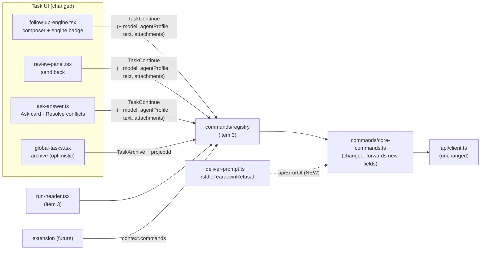

# Migrate the task actions to the Command API

> Slug: `migrate-task-actions-to-command-api` · Status: **implemented in #17** ·
> Epic 1 (Extension Runtime), item 4. Builds on item 3, `2026-09-19-command-api.md` (spec merged
> in #10; implementation complete in #11, awaiting merge). Item 3 adds the command registry, the
> three public `cezar.task.*` commands, `CommandsProvider` / `useCommand` / `useCommands`, and
> moves the **run header's** buttons onto them. This item moves **every other Task UI copy** of
> those actions, including the runner and model pickers. Delivery: one PR to `main`, opened after
> #11 merges. The code references below are to #11 as built (head `fc8db166`).

## 📝 TLDR

After item 3, the run header's Continue, Cancel and Archive buttons go through commands. Other
Task UI code still calls the API client for the same actions:

- the follow-up composer: continue with a prompt, attachments, and the **runner, model and
  account** pickers;
- the review panel's "send back";
- the Ask delivery used by the Ask card and by the "Resolve conflicts" button;
- the global Tasks page's archive.

Extensions can continue a task, but cannot pick the engine or send a prompt.

This proposal adds the composer's fields to `cezar.task.continue` as optional inputs (`model`,
`agentProfile`, `text`, `attachments`; `runner` is already there) and moves these sites onto
the commands. Changing the runner or the model therefore means running `cezar.task.continue`
with those fields, which is the only place the server has ever applied them. The same requests
go out, the same toasts appear, the same recovery paths run, and each site keeps its current
timing. The one exception is the global Tasks archive: `cezar.task.archive` resolves only after
its refetch, so that page's row toggles unlock one request later than today. No Task UI file
imports a continue, stop or archive function from the API client any more, and extensions get
the same continue that the composer uses.

## Resolved assumptions (autonomous defaults)

The brief left these open. Each default is the most reversible choice, and all of them are safe
to override before merge: the extension API package is private and experimental, the registry
is internal to the cockpit, and no HTTP route, state file or published surface changes.

| # | Question | Applied default | Why |
|---|---|---|---|
| Q1 | Split into one spec per call site? | **One spec, one phase per group of sites.** | Every site depends on the same input growth (Phase 1), and together they make up one capability: the Task UI uses commands. Each phase can ship on its own. |
| Q2 | Item 3 already defines `task.continue/stop/archive` and migrates the run header. What does this item own, and what does it depend on? | **The input growth and the remaining sites. It depends on #11**, which is complete: the registry, the core commands, the provider and hooks, and the header migration. Item 3's command ids, visibility and results are reused unchanged. Its code changes in two small, additive places only: `validateContinue` and the continue handler learn the new fields, and `invalidateTaskKeys` gains an optional options argument (Q10). This spec replaces two follow-up notes in item 3 (see Q6 and Q7), and item 3's § Follow-ups now points here. | There is no second definition of the same command, and #11 already ships everything this item builds on. |
| Q3 | Are "change runner" and "change model" commands of their own (`cezar.task.setRunner`, `…setModel`)? | **No. They are optional `runner` and `model` inputs of `cezar.task.continue`.** The picker's selection stays component state, and the pick reaches the server through the command. | The server applies runner and model only when it reopens a session (`POST /runs/:id/continue`, `continueSchema` in `packages/cezar/src/server/server.ts`). The brief rules out backend changes, so a standalone command would need a new route or a new client-side selection store. Dedicated ids can be added later without breaking anything. |
| Q4 | Which fields join `TaskContinueInput`? | **`model`, `agentProfile`, `text`, `attachments`, all optional.** The input field is named `attachments` and maps to the `images` field that `POST /continue` receives. | The composer sends all of them in one request, so leaving any out would keep the composer on the client. The contract's own deprecation note says attachments "are no longer images only". |
| Q5 | Does a **public** command carry user content (a prompt, attachments) to extensions? | **Yes. The continue command stays public**, and validator messages name the field and the rule but never the value. | That is no new capability: extension code already runs in the cockpit's origin and can call the route (item 3 § Risks). A second internal "rich continue" would recreate the duplication this epic removes. |
| Q6 | Two recovery paths decide on `ApiError.status === 409`, but a command rejects with a wrapped `CommandError`. How do they keep working? | **Through a cockpit-internal helper, `apiErrorOf(error)`, which reads the `ApiError` from a `command-failed` error's `cause`.** No extension contract change. This replaces item 3's note that such actions stay on the client "until a command can carry them (additive `CommandError` fields)". | Item 3 already puts the original error in `cause`. An HTTP status on `CommandError` would tie the extension API to HTTP. |
| Q7 | Which layer invalidates the cache for the global Tasks archive, and how does it stay optimistic? | **The handler invalidates on success and on a 409.** The page keeps its optimistic write, rollback and failure reconcile in `useIndexedRunMutation`, which is exactly what #11's `settled` expects ("a caller that patches optimistically keeps that rollback and invalidation itself"). Its request becomes `execute(TaskArchive, { taskId, projectId, archived })`, and for the archive the page's reconcile runs only on failure (a new `reconcile: 'on-error'` option); read receipts keep `'always'`. `useCommand` is not changed. This replaces item 3's "optimistic-update hook on `useCommand`". | One invalidation per successful archive instead of two back-to-back index refetches. The optimistic write is page behaviour, and the helper is shared with read receipts, which are not a command. |
| Q8 | What happens to `useContinueRun` in `api/queries.ts`? | **It is deleted.** Its only consumer, `ask-answer.ts`, moves to `useCommand(TaskContinue)`. | A second continue hook would be a second path to the same action. |
| Q9 | Should other task actions move too: delete, rename, pin, read receipts, bulk archive, PR creation, finish, live messages? | **No, they are deferred** and listed under § Architecture. | The brief sets the minimum. Each of these carries its own rules (navigation on delete, optimistic receipts, `ApiError.manual`) and is a separate, small change. |
| Q10 | When does each migrated site resolve: after the server accepts, or after the refetch? | **Each site keeps today's timing, following #11's own rule** (commit `6ff720cf`: "stop and archive still wait (their old onSuccess awaited the invalidation)"). The composer and the Ask delivery waited for the refetch today, because TanStack awaits a promise returned from `onSuccess`. They keep waiting through a cockpit-internal `useTaskRefetch()` in `useCommand`'s `onSuccess`, which joins the handler's refetch instead of starting a second one. The review panel did not wait, and #11's continue does not wait either. **The one exception is the global Tasks archive.** Today it does not wait, but `cezar.task.archive` does, so the row toggles unlock after the index refetch. | Resolving earlier would let the composer show the closed state (empty draft, enabled Continue) for a moment before the record turns live, which is the kind of lost guarantee AGENTS.md § Changing a mechanism warns about. Keeping the archive exception avoids a per-call timing option on the registry. The row itself still moves the moment it is clicked. |

## 📝 Problem Statement

- **The same action has several implementations.** After item 3, `cezar.task.continue` exists,
  but `follow-up-engine.tsx`, `review-panel.tsx` and `useContinueRun` (for `ask-answer.ts`)
  each still call `continueRun` with their own invalidation rules. `global-tasks.tsx` calls
  `archiveProjectRun` directly. Item 3's follow-up table names these sites and warns that
  "until these move, the same action exists twice".
- **Extensions can continue a task, but cannot steer the engine.** `TaskContinueInput` takes
  only `runner`. The runner, model and account pickers, plus the prompt the reopened session
  starts on, exist only inside the composer's `useMutation`, so an extension cannot express
  "continue this task on codex with model X and tell it Y".
- **The runner and model pickers are UI with a hidden endpoint.** The pickers
  (`useContinueAction`) appear in two places, the composer footer and the header's engine badge.
  Both are rendered by one hook, and that hook posts to the API client itself.

## 📝 Proposed Solution

1. **Extend the continue input additively.** `TaskContinueInput` gains `model`,
   `agentProfile`, `text` and `attachments`. The core validator checks them with the bounds
   that `POST /continue` enforces, and the handler forwards them to `continueRun` or
   `continueProjectRun` exactly as the composer does today. The result type, the command id and
   the visibility do not change.
2. **Move each remaining site onto the registry.** Where a call maps one-to-one onto a command,
   use `useCommand(token)`. Where the call runs inside a presentation step (the draft store's
   `submit`, the optimistic write to the index), keep the component's own `useMutation` for the
   pending and rollback state and call `useCommands().execute(token, input)` inside it. Neither
   way imports the API client for these actions.
3. **Keep the status-driven recovery.** `apiErrorOf(error)` returns the `ApiError` a command
   failed with, so the composer's 409 re-route (`deliver-prompt.ts`) and the Ask delivery's
   idle-teardown retry (`isIdleTeardownRefusal`) decide exactly as they do today.
4. **Keep each site's timing.** A site that waited for the refetch today keeps waiting by
   passing `useTaskRefetch()` as `useCommand`'s `onSuccess`, so it still never names a cache
   key (Q10).
5. **Enforce the boundary with a test.** A unit-tested source scan fails when any file other
   than `commands/core-commands.ts` imports one of the six continue, cancel or archive
   functions from the client module, whatever specifier it uses.

### Prior art

- **VS Code** runs parameterised actions through one command with arguments (for example
  `vscode.open(uri, options)`), not one command per option. We follow that: an engine switch is
  an argument of `continue`, not a sibling command.
- **JupyterLab** keeps widget state, such as a kernel picker's current selection, out of its
  command registry and only runs the command with the chosen arguments. That is the same split
  as keeping the picker state in the component.

### Alternatives considered

- **Dedicated `setRunner` and `setModel` commands backed by a client-side selection store.**
  Rejected for now (Q3). It adds a new public state surface whose value is lost on reload and
  only takes effect on the next continue, and every caller would still have to run `continue`
  afterwards.
- **An internal `cezar.task.continueWithPrompt` command beside the public one.** Rejected (Q5):
  it would give the same action two implementations again, which this epic exists to remove.
- **Put an HTTP status on `CommandError`.** Rejected (Q6): it adds an HTTP concept to the
  extension contract, while only cockpit code needs the status.

## 📝 Architecture



Every Task UI path to continue, stop and archive now goes through the registry. The API client
is reached only from the core handlers.

| Site (today) | Action | After |
|---|---|---|
| `routes/task-thread/follow-up-engine.tsx` `useContinueAction` | continue with prompt, attachments, **runner, model, account** | `useCommand(TaskContinue, { onSuccess: (_r, input) => refetchTask(input) })`, so it still resolves on fresh caches (Q10). The pickers' state and the provider gate (`canContinue`) stay in the hook, which also feeds the header's engine badge. `ContinueAction.continueWith` resolves `TaskContinueResult` instead of `ContinueResponse`; its only caller, `deliver-prompt.ts`, already treats the value as `unknown`. |
| `routes/task-thread/deliver-prompt.ts` | 409 → refetch → re-route | Unchanged logic. The 409 test reads `apiErrorOf(error)?.status`. |
| `routes/task-thread/review-panel.tsx` `ReviewActions.sendBack` | continue with `Review feedback:\n…` | Its own `useMutation` (for `draft.submit`) runs `execute(TaskContinue, …)`, and its local `invalidate` on success is removed because the handler does it. It resolves on acceptance, as it does today. |
| `api/queries.ts` `useContinueRun` → `routes/task-thread/ask-answer.ts` `useAskAnswer` | continue with the answer, optional `projectId` | `useCommand(TaskContinue, { onSuccess: (_r, input) => refetchTask(input) })`, which keeps today's wait for the refetch (Q10). `useContinueRun` is deleted, and `isIdleTeardownRefusal` reads through `apiErrorOf`. |
| ↳ `routes/task-thread/ask-card.tsx` | Ask answer (no `projectId`) | Unchanged: it consumes `useAskAnswer`. |
| ↳ `components/reference-conflict-action.tsx` `ResolveConflictsButton` | "Resolve conflicts" prompt; `ResolveConflictsForRun` passes `projectId` on cross-project surfaces | Unchanged code: it consumes `useAskAnswer`. It is mounted by the run header, the global Tasks page, the tasks overview and the sidebar quick list, so their test harnesses need `CommandsProvider`. |
| `routes/global-tasks.tsx` `useArchiveIndexedRun` | archive or restore in another project | The request inside `useIndexedRunMutation` is `execute(TaskArchive, { taskId, projectId, archived })`, with `reconcile: 'on-error'` (Q7). The optimistic patch and the rollback stay. |
| `routes/task-thread/run-header.tsx` | Continue, Cancel, Archive | Done in #11 (`useCommand(token, { onError: showError })` behind small `{ isPending, mutate }` wrappers). The pattern the sites above follow. |

- **Placement.** `apiErrorOf` lives in `packages/web/src/commands/errors.ts` (NEW, pure; it
  imports only `ApiError` and the extension API's `isExtensionError`). `useTaskRefetch` joins
  `useCommand` in `packages/web/src/commands/provider.tsx`. The boundary scan and its test are
  `packages/web/src/commands/boundary.ts` and `boundary.test.ts`.
- **What #11 provides.** `createCommandRegistry` and `CommandError` (which keeps the handler's
  error as `cause`) in `registry.ts`; `registerCoreCommands`, `invalidateTaskKeys`,
  `settled(…, { awaitRefetch })` and the hand-written validators (`oneInput`, `taskRef`,
  `validateContinue`) in `core-commands.ts`; `CommandsProvider`, `useCommands` and
  `useCommand(token, options)` (options: `onSuccess`, `onError`, `onSettled`) in `provider.tsx`.
  `main.tsx` and `App` already mount the provider, so this item adds no production wiring.
- **Stop.** The run header is the only place in the Task UI that stops a task, and item 3
  covers it.
- **Deferred actions** (Q9), each a candidate for its own command: `deleteRun`
  (`run-header.tsx`), `patchRun` rename (`usePatchRun`, `tasks-overview.tsx`), `pinRun` /
  `pinProjectRun` (`usePinRun`), `markRunSeen` / `markRunUnseen` / `setProjectRunRead`,
  `archiveFinished` (the bulk broom in `tasks-overview.tsx`), `createRunPr` (it needs
  `ApiError.manual`), `finishRun` (`use-finish-run.ts`) and `sendMessage` (the composer's live
  path).

## 📝 API Contracts

### Extension API: `TaskContinueInput` grows (`packages/extension-api/src/core-commands.ts`)

```ts
/** One file sent with a continue prompt. The host refuses media types it cannot pass on. */
export interface TaskAttachment {
  /** `image/*`, `text/plain`, `text/markdown`, `text/x-markdown` or `application/pdf`. */
  readonly mediaType: string
  /** Base64 payload, 1 to 7,000,000 characters. */
  readonly data: string
  /** At most 255 characters. */
  readonly name?: string
}

export interface TaskContinueInput extends TaskRef {
  /** A backend this Cezar knows (`claude`, `codex`, …). Omitted → the task's own. (item 3) */
  readonly runner?: string
  /** A model id of that runner; `''` is "auto" (the runner decides). Omitted → the run keeps
   *  its model, except that a runner switch drops a pinned model that belongs to another runner.
   *  Where models are locked, a non-blank model is refused. */
  readonly model?: string
  /** A login of that runner. Omitted → the run keeps its account. An unknown account is refused.
   *  A different account starts a fresh session: a session id lives inside one account's config
   *  directory. */
  readonly agentProfile?: string
  /** The prompt the reopened session starts on. Omitted or blank → the engine's own "Continue.". */
  readonly text?: string
  /** Up to 4 files sent with `text`. */
  readonly attachments?: readonly TaskAttachment[]
}
```

This change only adds types: no runtime export is added, so `test/surface.test.ts` does not
change. `TaskContinue`'s id, visibility and `TaskContinueResult` stay as item 3 defines them.
The package still never imports the contract. `TaskAttachment` is therefore a hand-written
mirror of the contract's `AttachmentInput`, and a type test in `packages/web` checks that the
two are assignable in both directions, so drift is caught at compile time.

### Core validator and handler (`packages/web/src/commands/core-commands.ts`)

| Field | Rule (mirrors `continueSchema`) | Sent as |
|---|---|---|
| `runner` | optional; accepted by the contract's `runnerSchema` (item 3) | `runner` |
| `model` | optional string, ≤ 200 chars; `''` is kept, because it means "auto" and the composer sends it when that preset is picked | `model` |
| `agentProfile` | optional string, ≤ 64 chars | `agentProfile` |
| `text` | optional string, ≤ 100,000 chars; whitespace-only → omitted, exactly as the composer does | `text` |
| `attachments` | optional array, ≤ 4 items; each item accepted by the contract's `attachmentInputSchema` | `images` (omitted when empty) |

- The contract schemas come from `@open-mercato/cezar-api-client`, as `runnerSchema` already
  does in item 3. They are called through `.safeParse`, so `packages/web` gains no `zod`
  dependency.
- `validateContinue` grows in #11's style: after `oneInput` and `taskRef`, one hand-written
  check per field, each throwing a fixed `<field> must …` message, and a fresh object returned
  that holds only the fields present.
- The handler builds the same `ContinueOptions` object the composer builds today, putting a key
  in only when its field is present (as #11 already does for `runner`), and calls
  `continueRun(taskId, opts)` or `continueProjectRun(projectId, taskId, opts)` through
  `settled(…, { awaitRefetch: false })`. #11's cache rule is unchanged: invalidate on success
  without waiting; on a 409, invalidate and still reject.
- **Messages never echo values.** Inputs now carry prompts and file contents. Zod's messages can
  include the value that was received, so the two schema checks (`runnerSchema`,
  `attachmentInputSchema`) report a fixed message, for example `attachments[1] must be an
  image, text, markdown or PDF attachment of at most 7,000,000 characters`, and never pass
  Zod's text through.
- **The server stays the authority.** A value that passes here but not there fails as
  `command-failed` with the server's own message: a model refused because models are locked
  (409), a model that belongs to another runner (409), an unknown account (400).

### Cockpit-internal error helper (`packages/web/src/commands/errors.ts`)

```ts
/**
 * The `ApiError` behind a failure: the error itself, or the `cause` of a `command-failed`
 * error that a core handler threw. That includes status 0, which is how `api/client.ts`
 * reports an unreachable server. `undefined` for everything else: invalid input, timeouts,
 * an extension handler's own errors, and non-errors.
 */
export function apiErrorOf(error: unknown): ApiError | undefined
```

Only cockpit code uses it. Extensions still receive a coded `CommandError` and nothing more.

### Cockpit-internal refetch hook (`packages/web/src/commands/provider.tsx`)

```ts
/**
 * Waits until one task's caches are fresh, joining a refetch already in flight instead of
 * cancelling it. For a site that must resolve on fresh data (Q10): call it with the command's
 * input from `useCommand`'s `onSuccess`, which TanStack awaits.
 */
export function useTaskRefetch(): (task: TaskRef) => Promise<void>
```

It calls `invalidateTaskKeys(queryClient, task.projectId, { cancelRefetch: false })`, so a
component never names a cache key. `invalidateTaskKeys` gains that optional third argument and
passes it to each `invalidateQueries`. Without it, behaviour is unchanged.

## 📝 UI/UX

There are no new or changed screens, so no mockups are needed. Each migrated site keeps:

- **Composer:** the runner, model and account pills (defaults, the reset when the runner
  changes, the lock when models are locked); an untouched Continue sends neither `runner` nor
  `model`; a disconnected runner makes the fallback runner explicit; an empty draft is still
  the one-click Continue; a refused prompt goes back into the draft; a 409 caused by a stale
  record re-routes to `/messages`.
- **Header engine badge:** it still edits the same selection as the composer, because both
  are rendered by one hook.
- **Review panel:** the `Review feedback:` prefix is kept, the notes stay in the box and in the
  draft store when a send-back is refused, and a refusal still shows the danger toast.
- **Ask card and Resolve conflicts:** they never switch engine (no `runner` is sent), and they
  keep the bounded retry on the "run is still active" refusal and the inline error message.
- **Global Tasks:** the row still moves as soon as it is clicked, and it rolls back with the
  server's reason if the request fails.

Timing is unchanged everywhere except global Tasks: there, the row toggles stay disabled until
the fresh index arrives, not just until the request returns (Q10, § Risks).

The existing fetch-level tests for each site are the proof (§ Implementation Plan).

## 📝 Edge Cases & Failure Scenarios

| Scenario | Behaviour |
|---|---|
| A composer continue is refused because the record was stale (409) | The command rejects with `command-failed`; `apiErrorOf` gives the 409, so `deliver-prompt` refetches and re-routes as it does today. The handler has also invalidated the task caches. |
| The Ask answer or Resolve conflicts arrives during idle teardown (409 "run is still active") | `isIdleTeardownRefusal(apiErrorOf(e))` is true, so the existing bounded retry runs. Every other 409 surfaces as before. |
| Validation refuses the input (5 attachments, an unknown runner, a 201-character `model`) | The command rejects with `invalid-input` and sends no request. The UI cannot build such input today, so only extensions and tests reach this. |
| An extension sends a non-blank `model` while models are locked | The server refuses (409), and the extension gets `command-failed` with the server's message. The UI never sends it. |
| An extension names an unknown `agentProfile` | The server refuses (400), and the extension gets `command-failed`. |
| An extension switches `agentProfile` | The server starts a fresh session, as it does for the composer. This is documented on the field. |
| A global Tasks archive fails | The row rolls back, the toast shows the server's words, and the page's reconcile invalidates, as today. |
| A global Tasks archive succeeds | The handler invalidates the three project keys once and resolves after the refetch. The page does not start a second refetch. |
| The server is unreachable | The client throws `ApiError(0, 'cannot reach the cezar server (…)')`, and the command rejects with `command-failed` with that message. `apiErrorOf` returns the status-0 error, so no 409 path runs, as today (`ask-answer.test.ts` pins the status-0 case). |
| A test harness renders a `useAskAnswer` consumer without `CommandsProvider` | `useCommands` throws and names the provider (item 3). Phase 2 adds the provider to every such harness. |

## 📝 Risks & Impact Review

- **Changing a mechanism that works (AGENTS.md).** Two recovery paths depend on the HTTP status
  of a continue failure. Wrapping hides it, and without `apiErrorOf` both would silently stop
  working: the reply would bounce back into the draft on every stale record, and Ask answers
  would fail during teardown. Each keeps a test that returns a real 409 from the stubbed fetch.
- **Settle timing (Q10).** #11's continue resolves on acceptance, while stop and archive wait
  for their refetch. The composer and the Ask delivery waited for the refetch today, so they
  keep that wait through `useTaskRefetch`. Without it, the composer would briefly show the
  closed state with an enabled Continue before the record turns live, which leaves a
  double-submit window. The review panel keeps resolving on acceptance. The global Tasks
  archive is the one change: every row's Archive and Read toggle stays disabled (`busy`) until
  the cross-project index arrives, one request later than today. The global Tasks test pins
  that change: the toggles re-enable after the one index refetch, and no second refetch
  follows. *Found in review of #17:* Resolve conflicts on a cross-project surface
  (`ResolveConflictsForRun` with `projectId`) now waits for the three project keys, including the
  cross-project index, where `useContinueRun` waited for `runs.all` alone. Its panel stays on
  "Sending…" until that one extra request lands. That is the rule's direct consequence
  (`refetchTask(input)` covers what the handler invalidated), and it is accepted.
- **Repeated 409s join one refetch.** The Ask delivery's idle-teardown retry can meet up to ten
  409s in a few seconds, and each 409 invalidates the task keys. The handler's 409 branch
  therefore passes `{ cancelRefetch: false }`, so a retry joins the refetch already in flight
  instead of cancelling and restarting it.
- **More refetches after some failures.** The handler's rule is broader than two of today's
  copies. The composer, review panel and Ask delivery now also invalidate `runs.all` after a
  409 (today only the header does). Resolve conflicts on cross-project surfaces now
  invalidates the three project keys instead of `runs.all` alone. Both only add refetches, and
  both match the rule the header already follows.
- **The public continue carries user content.** Prompts and attachments reach extension
  handlers only if an extension registers its own command. Core handlers never forward them
  anywhere except `POST /continue`. Validator messages never echo values. The loader item's
  trust model must still cover command access before third-party code runs (item 3).
- **Test-harness ripple.** #11 already gave `CommandsProvider` to six harnesses: `run-header`,
  `task-thread`, `review-panel`, `task-changes`, `task-files` and `routes`. `useAskAnswer`
  backs the Resolve conflicts button, which is mounted in four surfaces, so eight more gain it
  here: `follow-up-engine`, `deliver-prompt`, `ask-card`, `reference-conflict-action`,
  `global-tasks`, `tasks-overview`, `task-quick-list` and `app-shell-container`. There is no
  shared render helper to change once (61 test files set up their own providers), and adding
  one is out of scope.
- **Contract growth.** One interface and four optional fields are added to a private package.
  The change is additive, with no runtime export.
- **Compatibility surfaces.** None of the surfaces listed in `BACKWARD_COMPATIBILITY.md`
  change: no CLI, route, state file, protocol or manifest change.
- **Rollback.** Each phase can be reverted on its own: point the site back at the client call
  (and restore `useContinueRun`), and remove the input fields. Nothing is persisted.

## 📋 Phasing

1. **Phase 1: The continue input and the helpers.** The extension API fields, the core
   validator and handler, `apiErrorOf` and `useTaskRefetch`. No call site changes yet.
2. **Phase 2: The task thread and the Ask delivery.** The composer (including the runner and
   model pickers and the header's engine badge), `deliver-prompt`, the review panel, and
   `useAskAnswer` with both of its consumers. `useContinueRun` is deleted.
3. **Phase 3: Global Tasks, the boundary scan and docs.** This phase closes the brief's
   Definition of Done.

## 📋 Implementation Plan

Every step keeps `npm run typecheck`, `npm test`, `npm run test:unit`, `npm run build` and
`npm run test:package` green. Component tests keep their stubbed `fetch` and only add
`CommandsProvider` to their harness. That the request assertions stay unchanged is the proof
that user-facing behaviour is the same.

### Phase 1: The continue input and the helpers

1. **Extension API fields.** `TaskAttachment` and the four optional fields on
   `TaskContinueInput`, with TSDoc. *Test:* a type test checks that a full input compiles and
   that `attachments: 'x'` and `model: 1` fail with `@ts-expect-error`. A `packages/web` type
   test checks that `TaskAttachment` and the contract's `AttachmentInput` are assignable in
   both directions. `surface.test.ts` does not change.
2. **Core validator and handler.** Implement the validator and forwarding rules from § Core
   validator and handler.
   *Test* (#11's `core-commands.test.ts`, stubbed `fetch`):
   - a full input posts exactly `{ text, images, runner, model, agentProfile }`, to the scoped
     route, or to the explicit one when `projectId` is given;
   - continue still resolves without waiting for the refetch (#11's "when a command resolves"
     case, extended to a full input);
   - blank `text` and empty `attachments` are omitted, and `model: ''` is sent as `''`;
   - each invalid field rejects with `invalid-input` and sends no request, and its message
     contains the field name but not the value;
   - an unknown key is ignored.
3. **`apiErrorOf` and `useTaskRefetch`.**
   - *Test* (`apiErrorOf`): it returns a bare `ApiError`, the cause of a `command-failed`
     error, and the status-0 error an unreachable server produces. It returns `undefined` for
     `invalid-input`, `command-timeout`, a plain `Error` and a non-error value.
   - *Test* (`provider.test.tsx`): `useCommand(TaskContinue, { onSuccess: (_r, input) =>
     refetchTask(input) })` resolves only after the runs refetch settles, and the stubbed `fetch` sees one runs
     request, not two. With a `projectId`, the three project keys are covered.

### Phase 2: The task thread and the Ask delivery

4. **The composer and its pickers.** `useContinueAction` runs `useCommand(TaskContinue)`. The
   pickers, `canContinue` and the rejection when no provider is available stay in the hook.
   `deliver-prompt` decides on `apiErrorOf(error)?.status`. `follow-up-engine.test.tsx` and
   `deliver-prompt.test.tsx` gain `CommandsProvider`.
   *Test:* these pass unchanged apart from the provider:
   - `follow-up-engine.test.tsx`: "sends the chosen runner + model through to /continue", the
     untouched pills, the single backend;
   - `deliver-prompt.test.tsx`: the 409 re-route in both directions, and no retry for an empty
     draft;
   - the 409 case in `task-thread.test.tsx`, which already has the provider from #11;
   - new: `continueWith` resolves only after the runs refetch, as it does today.
5. **The review panel.** `sendBack` calls `execute(TaskContinue, { taskId, text:
   \`Review feedback:\n${text}\`, runner })` inside `draft.submit`, and its local `invalidate`
   is dropped. *Test:* `review-panel.test.tsx` (the request body, notes kept after a refusal, no
   request while blocked) passes unchanged; it already has the provider from #11.
6. **The Ask delivery.** `useAskAnswer` runs
   `useCommand(TaskContinue, { onSuccess: (_r, input) => refetchTask(input) })` with
   `{ taskId, projectId, text }`, `isIdleTeardownRefusal` reads through `apiErrorOf`, and
   `useContinueRun` is removed from `api/queries.ts`.
   - Every harness that renders a `useAskAnswer` consumer and lacks the provider gains it in
     this step: `ask-card`, `reference-conflict-action`, `global-tasks`, `tasks-overview`,
     `task-quick-list` and `app-shell-container`. The run header, task thread and review panel
     harnesses have it from #11.
   - `ask-card.test.tsx` replaces its `useContinueRun` mock with the provider and a stubbed
     `fetch`.
   - *Test:* `ask-answer.test.ts` gains the idle-teardown retry with a wrapped 409 and keeps
     its status-0 case; `reference-conflict-action.test.tsx` keeps its assertions, including
     the explicit `projectId` route. The step is done when the full `npm test` is green.

### Phase 3: Global Tasks, the boundary scan and docs

7. **The global Tasks archive.** `useIndexedRunMutation` gains
   `reconcile: 'always' | 'on-error'` (default `'always'`). `useArchiveIndexedRun` passes
   `'on-error'`, and its request runs `execute(TaskArchive, { taskId, projectId, archived })`.
   Read receipts are untouched.
   *Test* (`global-tasks.test.tsx`):
   - the request to `/api/v1/p/:projectId/runs/:id/archive`, the optimistic move and the
     rollback with the toast pass unchanged;
   - new: a successful archive triggers exactly one runs-index refetch, and the row toggles
     re-enable once it resolves;
   - new: a failed archive rolls back and reconciles.
8. **The boundary scan and the extension check.** `commands/boundary.ts` exports a pure
   `findClientActionImports(files)`. It takes `{ path, source }` pairs and reports each import
   of `continueRun`, `continueProjectRun`, `cancelRun`, `cancelProjectRun`, `archiveRun` or
   `archiveProjectRun` from a specifier that resolves to `src/api/client.ts` (`@/api/client`,
   `./client`, `../api/client`, …), from any file other than `commands/core-commands.ts`.
   Deleting `useContinueRun` removes the last such import from `api/queries.ts`, which the scan
   would otherwise catch through `./client`.
   *Test* (`boundary.test.ts`):
   - fixture sources: each specifier form is caught, aliased imports (`import { cancelRun as
     c }`) are caught, type-only imports and unrelated names pass, and `core-commands.ts` is
     exempt;
   - the real scan over `packages/web/src/**/*.{ts,tsx}` (excluding tests) reports nothing.

   `extensions/host.test.ts` already has #11's fixture extension that runs `TaskArchive`. A
   second case beside it runs `TaskContinue` with
   `{ taskId, projectId, runner: 'codex', model, text }` and checks the request body. This
   covers the DoD point that extensions can use the commands.
9. **Docs.**
   - `packages/extension-api/README.md`: the `TaskContinue` row of #11's core task commands
     table lists the new inputs, and a sentence says that a runner or model switch is a
     continue argument.
   - `AGENTS.md`: #11's "Business actions as commands" routing row gains `apiErrorOf`,
     `useTaskRefetch` and the boundary scan ("Task UI never imports these client
     functions").

   *Test:* the validation gate.
