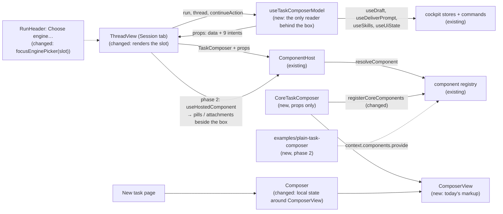

# Task Composer Contract — the reply box's public model, with the draft, the delivery and the engine choice behind it

> Slug: `task-composer-contract` · Status: **designed with autonomous defaults, awaiting the
> owner's review** · Epic 2 (Component Platform), item 17: "Create `task.composer@1` contract".
> Builds on `2026-09-19-task-header-contract.md` (item 11: the model-plus-intents pattern,
> `useTaskHeaderModel`, the header's **Choose engine…** jump), `2026-09-19-component-host.md`
> (`ComponentHost`, `ComponentsProvider`), `2026-09-19-component-contract-api.md` (capabilities,
> `layout`, the bump table), `2026-08-30-thread-composer-draft-persistence.md` (#939, the draft
> store) and `2026-09-19-migrate-task-actions-to-command-api.md` (`cezar.task.continue`). Sibling of
> `2026-09-19-task-metadata-contract.md` (item 16, spec PR #41). **Phase 1 starts from `main` as it
> is (`d298b017`). Phase 2 needs #38's changes re-landed on `main` first** (Q11). Delivery: one PR
> to `main` with two phases, touching `packages/extension-api` and `packages/web`.

## 📝 TLDR

The task page's reply box is the cockpit's most stateful part. It holds a draft that survives
leaving the task (#939), sends through two endpoints with a recovery when the run record is stale,
reopens a closed session on the typed prompt with a runner and model the user picks, completes
`/skills` and `@files`, takes attachments, and answers Alt+A and Alt+C. Today all of that lives
inside one component, `Composer`, and its host, `ThreadView`, which read the query cache, the draft
store, the commands and the router directly. Nothing else could render a reply box.

The proposal serves the box as the second kind of component contract, **`cezar.task.composer@1`**,
and splits it the way the brief asks. **Core's controller** (`useTaskComposerModel`, new) owns every
piece of state and every side effect: the draft, the send and its recovery, the engine choice, the
completion lists, the attachment intake and the quick replies. **The presentation** is any
implementation of the contract. It receives the current input, the mode and the words that go with
it, whether it may send and why not, what the user may do now (send, attach, choose a runner or a
model), the engine choice and the completion lists, all as JSON. It changes things only through
nine intents that return nothing: `onTextChange(text)`, `onSubmit()` and seven others. Core's own
reply box becomes the default implementation and renders from those props alone. The draft lives in
the controller, so it survives an implementation that throws, a swap and a return to the task. A new
example extension, which imports nothing from `packages/web`, replies to a task, continues a closed
one and keeps its draft.

## Resolved assumptions (autonomous defaults)

The brief left these open. This run was unattended, so each question got the most reversible answer
that still meets the brief's Definition of Done. The owner can override any row before
implementation starts.

| # | Question | Answer | Why | Status |
|---|---|---|---|---|
| Q1 | The brief bundles the contract, core's composer moving onto it, and the proof that a composer can be written elsewhere. Split into several specs? | **One spec, two phases, one PR.** Phase 1 ships the contract, the controller, core's default on props only and the slot. Phase 2 adds the two optional capabilities with the shell code that honours them, and the example extension with the cockpit test that uses it. | None of them works alone: a contract that core's box does not use proves nothing, and the proof needs the slot. Item 11's second PR (#38) and item 10's (#33) were both lost to a squash-merge of their parent branch, so a stack is the riskier delivery (item 16 reached the same answer, #41 Q1). Phase 1 can still merge alone: its token requires all five capabilities (Q10), so only a box that shows the attachments and the engine choice itself can render. | default, reversible |
| Q2 | Which id? The brief says `task.composer@1`. | **`cezar.task.composer@1`**: the brief's name with core's `cezar.` prefix. Not `cezar.task.thread.composer`. | Item 16 mapped `task.metadata@1` the same way (#41 Q2), and an id that names the thread would be wrong if the box later moves (the drag-and-drop items). The package is private and `BUILTIN_EXTENSIONS` is empty, so the id can still change. | default, reversible |
| Q3 | Which composer? `Composer` has two hosts: the task thread's dock and the New task page. | **The task thread's reply box only.** The New task page keeps `Composer` with today's API, and both are drawn by one presentational `ComposerView`, so they still look the same. | The New task page has no task yet, and its footer is made of core controls (the project, source and runner pills, the mode segment, the template menu), which a contract may not carry as `ReactNode`s. It is its own contract if a need appears. | default, reversible |
| Q4 | The brief lists "availability/status" and "permissions". What are they in the model? | **Three parts.** `status`: what a send does now (`reply`, `queued`, `continue`, `closed`) and core's words for it (placeholder, send label). `availability`: whether the box takes input at all, why not, and where to fix it. `actions`: what the user may do now, one state per action (`submit`, `attach`, `chooseRunner`, `chooseModel`), with the header's `{ available, enabled, pending, reason? }` shape under a neutral alias, `TaskActionState`. | These are the facts core's box decides today (`task-thread.tsx:490-515`). "Permissions" here means what the user may do in this box, not the extension permission model (#40), which decides whether an extension may provide a component at all (`ui.components`). Reusing the header's action state gives implementations one vocabulary. | default, reversible |
| Q5 | Who owns the text? | **Core's controller. The presentation is fully controlled.** `draft.text` comes in, `onTextChange(text)` goes out, and `onSubmit()` takes **no argument**: core sends the draft it holds. | The text then survives an implementation that throws (the host renders core's default with the same props), a swap of implementation and a return to the task, without any implementation knowing the draft store exists. It also means an implementation cannot send anything other than what the draft holds. assistant-ui's composer runtime draws the same line (`setText`, `send()`), § Prior art. | default, reversible |
| Q6 | Attachments are files, and the extension API is DOM-free (`lib: ["ES2022"]`). How do they cross? | **As a structural file type in, JSON out.** `onAttachFiles(files, source)` takes `TaskComposerFile`: `name`, `type`, `size` and `arrayBuffer()`, which a browser `File` satisfies as it is, so the package names no DOM type. Core screens, encodes, uploads to the draft store and toasts each refusal, exactly as today. The box receives `draft.attachments` as JSON (a key, name, media type and preview) and removes one with `onRemoveAttachment(key)`. | It keeps today's intake whole, the 4 × 5 MB caps and the per-file refusal toasts included, in one place, and an implementation does not encode base64 itself. It is the one intent whose argument is not JSON, and the contract's TSDoc says so. assistant-ui's `addAttachment(file: File)` is the same choice. | default, reversible |
| Q7 | "Runner/model state": core's box shows the runner and model pills while a send reopens the session. They are a core `ReactNode` today (`useContinueAction().pills`). | **Data plus two intents.** `engine` (present in `continue` mode) carries the runner, account and model the continuation will use, the rows each pill offers and the model catalog's note. `onSelectRunner(runner, account?)` and `onSelectModel(model)` change them. The picks stay in `useContinueAction`, which returns the data instead of the pills. Core's default renders the same pills from props. | The picks and the typed prompt must reach `cezar.task.continue` in one request, so they stay beside the draft in core. The header's **Choose engine…** jump (item 11, Q7) keeps working: it now looks for the pills inside the composer slot instead of holding a ref to them. | default, reversible |
| Q8 | The `/` skills and `@` files menus read the skills query and the ui-state store, and a pick writes the usage count. | **Lists as data, loaded on request.** `completions.skills` and `completions.files` start `idle`. `onRequestCompletions(kind)` loads one, and `onUseSkill(name)` counts a pick. The caret math (`detectTrigger`, `applyCompletion`) stays with the presentation. | Skills load on the first `/` today and never on a plain visit (`composer.tsx:182`), and the file list walks the whole thread, so neither may become eager. The ordering rule (most used first, #519) stays core's: the list arrives ordered, with each skill's use count. | default, reversible |
| Q9 | Where do the quick replies (Alt+A, Alt+C) and dictation go? | **Quick replies move into the controller. Dictation stays in core's default.** Quick replies then work under every implementation and still stand down while an editable has focus or the layout is in edit mode. They are delivered **without touching the draft**, which fixes a defect: today a successful quick reply empties an unsent draft (§ Problem Statement). Dictation is the browser's speech API behind the mic button, so it is presentation, and a replacement brings its own or none. | Quick replies are a window-global accelerator of the task, not of a textarea. The fix is what the code already says it does ("Canned replies bypass the draft entirely", `composer.tsx:453`), and what `composer.test.tsx` asserts for the component alone. | default, reversible |
| Q10 | Which capabilities, and what does core do for an implementation that does not declare one? | **Always required: `edits-draft`, `sends`, `shows-availability`. `attaches-files` and `chooses-engine` are required in phase 1 and become optional in phase 2**, in the same commit as the shell code that covers for them. Without `attaches-files`, core shows the attachments the draft holds beside the box, removable, so they are never sent unseen, and the box offers no way to add one. Without `chooses-engine`, core shows its runner and model pills beside the box while a send reopens the session. With an extension's `chooses-engine`, the header's **Choose engine…** item is not offered (core has no picker of its own to focus). No capability for the completion menus in `@1`. | The required three are what keeps a replacement safe: the draft is never lost, sending works, and a blocked box says why. What an implementation does not declare, core renders beside it: item 11's `offers-*` rule. Requiring the two in phase 1 keeps a phase-1-only `main` safe even if a preference could be set: a box that does not show attachments or the engine is recorded as incompatible and never renders. Demoting a required capability needs no bump (`components.ts:40-43`). A completions capability would make the host do nothing different, so it can wait. Adding an optional capability later needs no bump. | default, reversible |
| Q11 | Phase 2 needs `useHostedComponent` (item 11's step 7) and the rule that examples may import `react` (item 11's step 9). Both came with #38, which was merged into `feat/task-header-contract` after that branch had been squash-merged, so neither is on `main`. | **Build on them: #38's changes are re-landed on `main` before phase 2, as their own PR.** Phase 1 does not need them. If the owner drops #38 instead, phase 2 brings the two pieces in its own step 0, as item 16 would (#41 Q10). | Copying reviewed code into this PR would hide a lost merge inside an unrelated change. #41 depends on the same re-land, so one PR serves both. | default, reversible. **Needs the owner's action on #38 before phase 2** |
| Q12 | How is "a custom composer can be written outside `packages/web`" proven? | **A worked example, `packages/extension-api/examples/plain-task-composer/`:** a textarea and a send button, importing only the extension API and `react`, declaring only the three capabilities that stay required after phase 2. A cockpit test activates it through the real extension registry, prefers it, and uses it on the task page. | It follows the header's precedent (`examples/compact-task-header/`) and exercises what a minimal implementation gets for free: core's engine pills and attachment row beside it, the draft store, the stale-record recovery and the quick replies. | default, reversible |
| Q13 | The thread is not remounted between tasks. What does a send do if it settles after the user moved to another task, and what happens to the engine picks? | **A send belongs to the task it was sent from, and so do the picks.** When it lands, it clears that task's stored draft only. When it fails, its text and attachments go back into that task's stored draft, in front of what it holds, and the toast says so. The send button's pending state is per task. The runner, login and model picks reset when the task changes. | Today a send from task A that lands after the user opened task B empties B's box (`draft.submit`'s `clear()` closes over A but sets the shared text state, `thread-draft.ts:297-313`), and one that fails writes A's text into B's draft (the restore goes through `onValueChange`, `composer.tsx:369`). The picks are plain `useState` in `useContinueAction` (`follow-up-engine.tsx:65-67`), so A's runner and model carry over to B. The header already keys its pending state per task (`task-header-main.ts`, `inFlight`). A controller that "acts on the latest task" would otherwise turn these defects into the design. | default, reversible |

No default carries `⚠ NEEDS HUMAN CONFIRMATION`. None weakens security, data scoping or a
`BACKWARD_COMPATIBILITY.md` surface. The behavior fixes (Q9, Q13) remove data loss rather than
adding it, and each answer can be changed without rewriting the design.

## 📝 Problem Statement

The brief's goal is to test the component platform on "a more complex, stateful component". The
task header (item 11) was a read-mostly part: facts in, seven intents out. The reply box is the
opposite. It is where the user's unsent work lives. On `main` (`d298b017`):

- **The state and the view are one component.** `Composer` (`components/composer/composer.tsx`, 791
  lines) owns the busy flag, the optimistic clear and the restore on failure, the attachment intake,
  the `/` and `@` menus, the dictation and the quick replies. It reads `useSkills` and `useUiState`,
  writes `putUiState` and invalidates the query cache (`composer.tsx:189-193`, `:276-279`).
- **The host feeds it core-only values.** `ThreadView` builds the draft (`useDraft(run.id,
  'composer')`), the delivery (`useDeliverPrompt`, with its 409 re-route), the provider gate and the
  Continue path (`useContinueAction`), then passes them in as props. The runner and model pills
  arrive as a `ReactNode` (`footerEnd={continueAction.pills}`, `task-thread.tsx:497-506`), and so
  does the **Configure providers** link. No model exists that another box could render.
- **A replacement would have to re-implement core.** Whoever wrote a second reply box would need
  the draft store (#939: seed once, debounce, serialize, flush on `pagehide`), the two delivery
  paths and their recovery, the provider gate and the continuation engine. All of it is private
  hooks, which the brief rules out.
- **A defect sits exactly on the seam.** The quick replies call the composer's `send(reply, [],
  false)`, which is meant to "bypass the draft entirely" (`composer.tsx:453-454`), and
  `composer.test.tsx` asserts that for the component alone. But the thread's `onSubmit` wraps every
  send in `draft.submit` (`task-thread.tsx:489`), and `draft.submit` clears the draft once the send
  lands (`thread-draft.ts:315-322`). So Alt+A on a task with an unsent draft, pressed while the
  caret is outside the box, sends "Yes, approved." and empties the draft on the server and on
  screen. This is a reading of the code. No thread-level test covers it, and it has not been
  reproduced in a browser. Step 5 adds the test and proves it red first (AGENTS.md § Changing a
  mechanism that already works).
- **So do two more, because the thread is not remounted between tasks.** A send from task A that
  lands after the user opened task B empties B's box, and one that fails writes A's text into B's
  draft. The runner and model picked for A's continuation carry over to B (Q13 has the code
  references). Also a reading of the code, pinned by red-first tests in steps 3 and 5.

The brief's Definition of Done, and where this item proves each point:

| Definition of Done | How this item meets it | Proven by |
|---|---|---|
| A custom composer can be written outside `packages/web`. | `TaskComposerProps` carries everything a reply box needs as JSON, plus nine `void` intents. `examples/plain-task-composer/` implements the contract importing only `@open-mercato/cezar-extension-api` and `react`. On the task page it replies, continues a closed task (with core's pills beside it) and keeps its draft across a return to the task. | `extension-api/test/boundary.test.ts`, `test/plain-task-composer.test.ts`, `web/src/routes/task-thread/external-task-composer.test.tsx` |
| Core's composer keeps its existing functions. | Core's default renders today's box from props: the draft and its restore, Enter, Shift+Enter and ⌘↵, attachments by paperclip, paste and drop, the `/` and `@` menus with the usage order, dictation, the pills, the **Configure providers** link, the placeholders and labels. The quick replies, the delivery with its 409 re-route and the draft store stay core's, in the controller. § UI/UX maps each behavior. The one change is the quick-reply fix (Q9). | `composer.test.tsx` (the New task page's `Composer`, unchanged but for the quick-reply cases that move), `core-task-composer.test.tsx`, `task-composer.test.ts`, `task-thread.test.tsx` |
| An implementation needs no private store or hook. | Data props are JSON (`IsJson`), and the only functions are the nine intents. Core's default imports no query, store, command, router or draft module, and renders with none of their providers above it. | the type test in `packages/extension-api/test`, `core-task-composer.test.tsx`, `core-task-composer-boundary.test.ts` |

## 📝 Proposed Solution

1. **Declare the contract** (`packages/extension-api/src/core-components.ts`, beside
   `TaskHeaderMain`). `TaskComposer` is `cezar.task.composer@1`, with the model in § API Contracts,
   five required capabilities (two of them become optional in phase 2) and
   `layout: { minBlockSize: 88 }`. It also exports
   `TaskActionState`, a neutral alias of `TaskHeaderActionState`.
2. **One controller owns the state** (`routes/task-thread/task-composer.ts`, new).
   `useTaskComposerModel(run, …)` is the only code behind the box that reads the run, the draft
   store, the queries, the commands and the router. It absorbs what `ThreadView` and `Composer`
   hold today: `useDraft(run.id, 'composer')`, `useDeliverPrompt`, the provider gate, the busy
   flag, the optimistic clear and the restore, the attachment intake, the skills and file lists,
   the skill usage count and the quick replies. It returns the contract's props: frozen data, and
   callbacks that keep one identity and act on the task shown now, as `useTaskHeaderModel` does.
3. **`Composer` is split into a view and its local state** (`components/composer/`).
   `ComposerView` (new) is today's markup and keyboard handling: the textarea and its autosize, the
   thumbnails, the footer, the `/` and `@` menu with its caret math, and the dictation bar. It reads
   no query or store, and it takes every value and callback as a prop. `Composer` keeps its public
   API for the New task page and becomes its local state (text, attachments, busy, skills) around
   `ComposerView`. It loses only `quickReplies`, which only the thread passed.
4. **Core's default renders from props** (`routes/task-thread/core-task-composer.tsx`, new).
   `CoreTaskComposer` maps the contract's props onto `ComposerView`, and draws the pills with
   `ContinuationEnginePicker` (new, `components/composer/`), a presentational pair of today's
   `RunnerPill` and `PickerPill` that reads `engine` and calls `onSelectRunner` and
   `onSelectModel`. The pure row logic inside `RunnerPill` moves into a helper both use.
5. **The thread renders the box through the host.** In the dock, `ThreadView` replaces `<Composer>`
   with `<ComponentHost contract={TaskComposer} subject={run.id} props={model.props} />` inside a
   `data-slot="thread-composer"` wrapper. The paused hint, the queued hint, the auto-resume hint and
   the plan and agents docks stay in the shell above it. The header's **Choose engine…** now calls
   `focusEnginePicker(slot)`, which focuses the first control inside the slot's
   `[data-slot="follow-up-engine"]`. `useContinueAction` returns the engine data and two select
   functions instead of `pills` and `focusPicker`.
6. **Core's default is registered.** `registerCoreComponents` registers `CoreTaskComposer` as
   `cezar.task.composer.default`, `CORE_COMPONENT_CONTRACTS` gains `TaskComposer`, and
   `boundary.ts` and `vite.config.ts` list the new core implementation. Nobody has a preference, so
   core's default renders everywhere.
7. **What an implementation does not declare, core renders beside it (phase 2).** `attaches-files`
   and `chooses-engine` become optional together with the shell code
   that reads them through `useHostedComponent(TaskComposer, run.id)` (Q10, Q11).
8. **The proof (phase 2).** `packages/extension-api/examples/plain-task-composer/` and a cockpit
   test that activates, prefers and uses it.

### Prior art

- **assistant-ui** (MIT), `ComposerRuntimeCore`: the draft (`text`, `setText`, `attachments`,
  `addAttachment(file: File)`, `removeAttachment(id)`, `attachmentAccept`) and the submission
  (`send()` with no text, `canSend`, `isEmpty`) sit in a runtime, and `ComposerPrimitive` parts
  render it. The contract takes the same split and the same `send()` without text. It skips the
  runtime's hook and subscription API (`useAui`, `subscribe`): a hook ties an implementation to the
  host's React tree, which the brief rules out. Unlike assistant-ui, it keeps dictation in the view
  (Q9).
- **Vercel AI SDK `useChat`**: `input`, `handleInputChange`, `handleSubmit` and a `status` of
  `submitted`, `streaming`, `ready` or `error`. It is the same controlled input, with a status
  enum close to `status.mode`. It is also a hook, for the same reason skipped.
- **Headless UI kits** (Downshift, React Aria's `useComboBox`) keep the menu's state in a state hook
  and let any markup render it. This item's split is the same idea at the boundary of an extension.
  The caret math of the `/` and `@` menus stays with the view, because it depends on the view's own
  textarea.
- **Item 11** (`cezar.task.header.main@1`): data plus `void` intents, core checks the action's
  state again on every call, frozen data, callbacks with one identity that act on the task shown
  now. This contract uses every one of those rules.

### Alternatives considered

- **An uncontrolled presentation that reports only on send** (`onSubmit(text, attachments)`).
  Rejected. The draft would live in the implementation, so a throw, a swap or a return to the task
  would lose it, and the draft store (#939) would have to be each implementation's job.
- **Hand the implementation the draft store** as intents (`saveDraft`, `loadDraft`). Rejected.
  It exposes a storage protocol (seed once, debounce, flush on `pagehide`) that took a spec to get
  right, and an implementation that ignores it loses the user's work.
- **Carry the engine pills as a `ReactNode` slot.** Rejected by the contract API itself (no
  `ReactNode` in props), and an implementation could not place or restyle them.
- **Leave the engine choice out of `@1`** and always draw core's pills outside the box. Not chosen.
  It would move the pills out of core's own box, a visible change for every user, and the brief
  lists runner and model state in the model.
- **Attachments as base64 JSON from the implementation** (`onAttach({ name, mediaType, data })`).
  Rejected. Every implementation would encode files itself, and core's screening would run after
  the encoding, so a 50 MB file would be read before being refused. The structural file type costs
  one non-JSON argument.
- **Make the New task page's composer a contract too.** Deferred (Q3).
- **A separate contract for the engine picker** (`cezar.task.composer.engine@1`). Rejected for now.
  It would need a second host inside the box's footer, and the picks and the prompt must still
  reach one request.

## 📝 Architecture



The takeaway: the box renders a model, the model is the contract, and every piece of state behind
it has one owner in core. The New task page shares the view, not the model.

- **Changed in `packages/extension-api`:** `src/core-components.ts` (`TaskComposer`, its types and
  `TaskActionState`), `src/index.ts` (re-exports), `test/surface.test.ts`, `test/core-components.test.ts`,
  `README.md` ("Replacing a component": the composer). Phase 2: `examples/plain-task-composer/index.ts`
  and `test/plain-task-composer.test.ts`.
- **New in `packages/web`:** `routes/task-thread/task-composer.ts` (`useTaskComposerModel`),
  `routes/task-thread/core-task-composer.tsx` (`CoreTaskComposer`),
  `components/composer/composer-view.tsx` (`ComposerView`),
  `components/composer/continuation-engine-picker.tsx`. Phase 2:
  `routes/task-thread/external-task-composer.test.tsx`.
- **Changed in `packages/web`:** `components/composer/composer.tsx` (local state around
  `ComposerView`; `quickReplies` removed), `components/composer/composer-attachments.ts` (one intake
  function both hosts use, a local `key` on `PendingAttachment`, `screenFiles` typed against the
  structural file), `components/picker-pill.tsx` (`RunnerPill`'s row logic becomes a helper),
  `lib/skills.ts` (`filterSkills` takes a minimal skill shape), `routes/task-thread/task-thread.tsx`
  (the slot, `focusEnginePicker`), `routes/task-thread/follow-up-engine.tsx` (engine data instead of
  pills), `routes/task-thread/thread-draft.ts` (`submit` settles against its own task,
  `restoreTo`, and a restored attachment's `key`), `component-registry/core-components.ts`,
  `core-contracts.ts`, `boundary.ts`, `vite.config.ts` (the eager list), `AGENTS.md` (the component
  row).
- **Not touched:** the component registry, resolver, host and provider modules (phase 2 only calls
  `useHostedComponent`), the command handlers, the event bus, the HTTP contract, the draft routes,
  the service and the api-client. No `BACKWARD_COMPATIBILITY.md` surface moves.

## 📝 Data Model

Nothing new is persisted. The draft keeps its server record (`PUT /runs/:id/drafts/composer`, #939)
and its format. `PendingAttachment` gains an in-memory `key`, minted at intake and kept by every
spread (`thread-draft.ts` re-files an upload with `{ ...held, id }`, which keeps it). An attachment
restored from the draft store has no intake, so the seed path (`thread-draft.ts:372-380`) gives it
its stored id as its key. The key never reaches the wire (`toAttachmentInput`
already strips everything but `mediaType`, `data` and `name`).

## 📝 API Contracts

Signatures are normative. The contract is new. `ComponentHost`, `ComponentsProvider` and the
registry keep their behavior.

### `packages/extension-api/src/core-components.ts` (public, additions)

```ts
/** Whether an action is offered, and whether it can run now. JSON. The same shape as `TaskHeaderActionState`. */
export type TaskActionState = TaskHeaderActionState

/** A file the user picked, pasted or dropped. A browser `File` fits as it is; core reads nothing else. */
export interface TaskComposerFile {
  readonly name: string
  /** The browser's media type. May be `''`: core then goes by the name's extension. */
  readonly type: string
  /** In bytes, as the file reports it. Core measures the bytes it reads again before taking the file. */
  readonly size: number
  arrayBuffer(): Promise<ArrayBuffer>
}

/** An attachment the draft holds. JSON. */
export interface TaskComposerAttachment {
  /** Stable while the draft holds it. Pass it to `onRemoveAttachment`. */
  readonly key: string
  /** What its chip shows: the file's name, or `pasted image` / `pasted.md` for a paste without one. */
  readonly name: string
  readonly mediaType: string
  readonly isImage: boolean
  /** A `data:` URL for an image's thumbnail. Absent for other files. */
  readonly preview?: string
}

/** What the user has written and not sent yet. Core keeps it across navigation and reloads. JSON. */
export interface TaskComposerDraft {
  readonly text: string
  readonly attachments: readonly TaskComposerAttachment[]
}

/** What a send does now, and core's words for it. JSON. */
export interface TaskComposerStatus {
  /**
   * - `reply`: the session is live. A message to a running task reaches its next turn, and one to a
   *   waiting task answers it.
   * - `queued`: the task has not started. The message is folded into its prompt.
   * - `continue`: the session is closed and can be reopened. The message is the prompt it reopens on,
   *   and an empty send reopens it on the engine's own "Continue.". `availability` says whether a
   *   provider can reopen it now.
   * - `closed`: no send is possible.
   * The set may grow: read an unknown mode as `closed`.
   */
  readonly mode: string
  /** Core's hint for the empty box, e.g. "Reply — / for skills, @ for files…". */
  readonly placeholder: string
  /** Core's name for the send control: `Continue` while a send would reopen the session now, otherwise `Send`. */
  readonly submitLabel: string
}

/** Whether the box takes input at all. JSON. */
export interface TaskComposerAvailability {
  /** `false`: no typing, attaching or sending. Show `reason` instead of the placeholder. */
  readonly enabled: boolean
  /** Why not, in words for the user, e.g. "Codex credentials are unavailable. Authorize it in Settings → Agents → Providers." */
  readonly reason?: string
  /** A cockpit page where the user can fix `reason`. Follow it with `onNavigate(fix.href)`. */
  readonly fix?: { readonly label: string; readonly href: string }
}

/** What the user may do in the box now. */
export interface TaskComposerActions {
  /** Send the draft. Not `enabled` while the draft is empty, except in `continue` mode. */
  readonly submit: TaskActionState
  /** Add files to the draft. `enabled` while the box takes input; core refuses a file that does not fit, with a toast. */
  readonly attach: TaskActionState
  /** Pick the runner (and its login) the continuation runs on. Offered while `engine` is present and there is a choice. */
  readonly chooseRunner: TaskActionState
  /** Pick the model the continuation asks for. Offered while `engine` is present; not `enabled` where models are locked, with the reason. */
  readonly chooseModel: TaskActionState
}

/** One row of the runner choice: a runner, or one login of a runner that has several. JSON. */
export interface TaskComposerRunnerChoice {
  readonly runner: string
  /** The login, when the runner has more than one. Pass it back to `onSelectRunner`. */
  readonly account?: string
  /** e.g. `claude · Klaudiusz`. */
  readonly label: string
  /** e.g. the login's config folder. */
  readonly description?: string
}

/** The engine a send that reopens the session uses, and what the user can change it to. JSON. */
export interface TaskComposerEngine {
  readonly runner: string
  /** The login in force, when the runner has more than one. */
  readonly account?: string
  /** The model id the continuation asks for; `''` lets the runner pick. */
  readonly model: string
  /** e.g. `sonnet`, or `auto`. */
  readonly modelLabel: string
  readonly runnerChoices: readonly TaskComposerRunnerChoice[]
  readonly modelChoices: readonly { readonly id: string; readonly label: string; readonly description?: string }[]
  /** The model catalog's state in words, e.g. "Using cached OpenCode model list". Absent when there is nothing to say. */
  readonly modelNote?: string
}

/** A skill the `/` menu offers. JSON. */
export interface TaskComposerSkill {
  /** Unique in the list. A project skill may shadow a global one of the same name. */
  readonly key: string
  /** What a pick inserts after `/`. */
  readonly name: string
  readonly description?: string
  /** A skill of this project, not a global or team one. Core's menu sets it in bold. */
  readonly project: boolean
  /** How many times the user picked it, in any skill menu. */
  readonly uses: number
}

/** A list loaded on request. `status`: `idle` until requested, then `loading`, `ready` or `unavailable`. The set may grow. JSON. */
export interface TaskComposerCompletionList<T> {
  readonly status: string
  readonly items: readonly T[]
}

export interface TaskComposerCompletions {
  /** Ordered as core's menu offers them before a query: most used first, then project skills. */
  readonly skills: TaskComposerCompletionList<TaskComposerSkill>
  /** Paths the session's tools read or changed, newest first. Kept current once requested. */
  readonly files: TaskComposerCompletionList<string>
}

export interface TaskComposerProps {
  readonly task: { readonly taskId: string; readonly projectId: string }
  readonly draft: TaskComposerDraft
  readonly status: TaskComposerStatus
  readonly availability: TaskComposerAvailability
  readonly actions: TaskComposerActions
  /** Present while a send would reopen the session now: `continue` mode, with a provider that can. */
  readonly engine?: TaskComposerEngine
  readonly completions: TaskComposerCompletions
  /** What core accepts: at most `maxAttachments` files of at most `maxAttachmentBytes` each, of the types in `accept` (an `<input accept>` value). */
  readonly limits: { readonly maxAttachments: number; readonly maxAttachmentBytes: number; readonly accept: string }
  /** The user changed the text. Pass the whole new text on every change. */
  readonly onTextChange: (text: string) => void
  /** The user sent. Core sends the draft it holds, clears it at once and puts it back if the send fails. */
  readonly onSubmit: () => void
  /** The user added files. `source: 'clipboard'` for a paste: core does not keep a pasted image's browser-made name. */
  readonly onAttachFiles: (files: readonly TaskComposerFile[], source: 'file' | 'clipboard') => void
  readonly onRemoveAttachment: (key: string) => void
  /** Pass a row of `engine.runnerChoices`. */
  readonly onSelectRunner: (runner: string, account?: string) => void
  /** Pass an id of `engine.modelChoices`. */
  readonly onSelectModel: (model: string) => void
  /** The user started a `/` or `@` token. Core loads that list into `completions`. */
  readonly onRequestCompletions: (kind: 'skills' | 'files') => void
  /** The user picked a skill from the list. Core counts it for the order. */
  readonly onUseSkill: (name: string) => void
  /** The user followed a link from these props (`availability.fix.href`). */
  readonly onNavigate: (href: string) => void
}

/**
 * The task's reply box: what the user writes to the task's agent. Core owns the draft, the send,
 * the engine choice and the lists; an implementation renders them and reports what the user does.
 * Core renders the plan and agents docks and the hints above it, so an implementation neither
 * provides nor can remove them. The quick replies (Alt+A, Alt+C) are core's and work under every
 * implementation.
 * - `edits-draft` (required): shows `draft.text` and reports every edit through `onTextChange` as
 *   it happens, keeping no text of its own. What the user sees is what `onSubmit()` sends.
 * - `sends` (required): offers a send control while `actions.submit.available`, usable while it is
 *   `enabled`, that calls `onSubmit()`.
 * - `shows-availability` (required): while `availability.enabled` is false, takes no input and
 *   shows `availability.reason`, and `availability.fix` as a link when there is one.
 * - `attaches-files` (required in phase 1): renders `draft.attachments` with a way to remove each,
 *   and offers attaching while `actions.attach.available`.
 * - `chooses-engine` (required in phase 1): while `engine` is present, renders the choices of
 *   `actions.chooseRunner` and `actions.chooseModel` and calls `onSelectRunner` and `onSelectModel`.
 * - Intents: before acting on one, core checks the state again, as it stands at the call. `onSubmit`
 *   does nothing while `actions.submit` is not `available`, the box is not `enabled`, or a send of
 *   this task is `pending`, and it reads whether the draft is empty from the draft as of the last
 *   `onTextChange`, so `onTextChange(t)` then `onSubmit()` in one tick sends `t`. `onAttachFiles`
 *   does nothing unless `actions.attach` is `available` and `enabled`, and refuses each file that
 *   does not fit with a toast. `onSelectRunner` and `onSelectModel` do nothing unless
 *   `actions.chooseRunner` / `chooseModel` are `available` and `enabled`. `onTextChange` does
 *   nothing while `availability.enabled` is false. A key, row, id, kind, name or href that core did
 *   not put in these props does nothing.
 * - `onAttachFiles` is the one intent whose argument is not JSON: pass the browser's `File` objects.
 * - The props follow the task on screen, which can change without a remount. Keep only passing view
 *   state of your own (a caret, an open menu), and reset it when `task.taskId` changes.
 * - Layout: 88 CSS pixels (the box's resting height on a phone) are reserved while an
 *   implementation loads, fails or is swapped. The dock around it is sticky; this part is not.
 */
export const TaskComposer = defineComponentContract<TaskComposerProps>('cezar.task.composer', {
  version: 1,
  // Phase 2 moves 'attaches-files' and 'chooses-engine' to optionalCapabilities, with the shell
  // code that renders them beside an implementation that does not declare them.
  requiredCapabilities: ['edits-draft', 'sends', 'shows-availability', 'attaches-files', 'chooses-engine'],
  optionalCapabilities: [],
  layout: { minBlockSize: 88 },
})
```

In phase 2 the two move to `optionalCapabilities`, and their TSDoc says what core does without them:

- `attaches-files` (optional): for an implementation that does not declare it, core
  shows the attachments the draft holds beside the box, each removable, so nothing is sent unseen,
  and `actions.attach.available` is `false`.
- `chooses-engine` (optional): for an implementation that does not declare it, core shows its own
  runner and model pills beside
  the box. The header's **Choose engine for the next continuation…** reaches only core's pills, so
  it is not offered while an extension's implementation that declares `chooses-engine` renders.

What core does for each intent, and so what the words promise:

| Intent | Core's answer |
|---|---|
| `onTextChange(text)` | Sets the draft's text. The draft store saves it after a typing pause, as today. |
| `onSubmit()` | Takes the draft as of the last `onTextChange`, even one in the same tick, clears the box, and delivers the trimmed text with the attachments. In `reply` and `queued` modes that is `POST /runs/:id/messages`; in `continue` mode it is `cezar.task.continue` with the engine picks. A 409 re-routes once when the refetched record names the other path (`deliver-prompt.ts`). On failure it shows the server's words as a danger toast and puts the text back in front of anything typed since, with the attachments. `actions.submit.pending` is `true` until it settles. The send belongs to its task (Q13): if the user has moved to another task by then, a success clears only that task's stored draft, and a failure puts the text back into that task's stored draft and says so in the toast. |
| `onAttachFiles(files, source)` | Screens each file (type by media type or extension, 5 MB, 4 per message), shows one toast per refused file naming it, reads the rest and refuses one whose bytes exceed 5 MB whatever `size` said, encodes them and adds them to the draft, which uploads them to the draft store. |
| `onRemoveAttachment(key)` | Removes it from the draft, and deletes its stored copy. |
| `onSelectRunner(runner, account?)` | Picks that row for this task's continuation. A different runner also drops the model pick; another login of the same runner keeps it. Moving to another task starts from that task's own engine (Q13). |
| `onSelectModel(model)` | Picks that model for the continuation. |
| `onRequestCompletions(kind)` | `skills`: loads the skill list (cached for the session) with the usage counts. `files`: lists the paths the session's tools touched, and keeps the list current while the thread grows. |
| `onUseSkill(name)` | Adds one to the skill's use count, once the current counts are known (a lost count costs one use, never the map). |
| `onNavigate(href)` | Navigates within the cockpit when `href` is `availability.fix.href`. Any other value does nothing, and one `[cezar:extensions]` warning is logged per value per page load. |

### `packages/web/src/routes/task-thread/task-composer.ts` (new)

```ts
export interface TaskComposerModelOptions {
  /** The thread's Continue: the gate, the engine picks and `continueWith` (`useContinueAction`). */
  readonly continueAction: ContinueAction
  /** The reduced thread, read by the `files` list once it is requested. */
  readonly thread: ThreadState
  /** Phase 2: what the hosted implementation declares. Omitted: core's default, which declares both. */
  readonly hosted?: { readonly attachesFiles: boolean }
}

/**
 * The only reader behind `cezar.task.composer@1`'s props. The data is frozen and recomputed only
 * when one of its inputs changes: the run, the draft, the provider status, the continuation, a
 * list. The callbacks keep one identity for the life of the thread, and each call reads the
 * latest run, draft and state through a ref, so after a switch from task A to task B (the thread
 * is not remounted) a new call acts on B. A send already in flight stays bound to A (Q13).
 */
export function useTaskComposerModel(run: ApiRun, options: TaskComposerModelOptions): { readonly props: TaskComposerProps }
```

Every field comes from the expression that computes it in `ThreadView` today, so there is one rule
per fact: `status.mode` from `sessionOpen`, `queued` and `hasContinuation`; `availability.enabled`
from `providerBlocked || (!sessionOpen && !queued && !continuable)`; `availability.reason` from
`providerReason` or "Session closed — no session to resume."; `availability.fix` while
`providerBlocked && !continueAction.providerPending`, with `href` =
`scopeTo(useActiveProjectId(), '/settings/agents#providers')`, the path the scope-aware `Link`
produces today; `status.placeholder` and `status.submitLabel` from today's two expressions;
`actions.submit.enabled` from today's send-button rule, `allowEmptySubmit` included, with `pending`
kept per task (Q13). `engine`, `actions.chooseRunner` and `actions.chooseModel` follow `continuable`
(`hasContinuation && continueAction.canContinue`), exactly where today's footer shows the pills. So a
closed, resumable task whose provider is blocked reads `mode: 'continue'` with `availability.enabled:
false`, the provider's reason, the fix link once provider status has loaded, `submitLabel: 'Send'`,
no `engine`, and no **Choose engine…** in the header, as today. `task.projectId` is
`useActiveProjectId()`, as in the header model.

`useDraft` (`thread-draft.ts`) gains the one change Q13 needs: `submit(action)` settles against the
run and surface it was called for. A success clears that draft's stored copy, and its local state
only while it is still the one shown. A new `restoreTo(runId, text, images)` writes a failed message
back into a draft that is no longer shown (cache and serialized write, in front of what it holds).

### `packages/web/src/routes/task-thread/follow-up-engine.tsx` (changed)

```ts
export interface ContinueAction {
  readonly available: boolean
  readonly canContinue: boolean
  readonly reason?: string
  readonly providerPending: boolean
  /** The continuation's engine and its choices, for the composer's props. Replaces `pills` in step 5. */
  readonly engine: TaskComposerEngine
  /** Whether the runner pill has a choice to offer (more than one runner, or more than one login). */
  readonly hasRunnerChoice: boolean
  readonly modelsLocked: boolean
  readonly selectRunner: (runner: string, account?: string) => void
  readonly selectModel: (model: string) => void
  readonly continueWith: (text: string, images: AttachmentInput[]) => Promise<TaskContinueResult>
}
// The picks reset when `run.id` changes (Q13), by React's "adjust state while rendering" pattern.

/** Focuses the first enabled control of the `[data-slot="follow-up-engine"]` inside `root`, and scrolls it into view. Replaces `focusPicker`. */
export function focusEnginePicker(root: HTMLElement | null): void
```

### `packages/web/src/components/composer/composer-view.tsx` (new, internal)

`ComposerView` takes today's `Composer` props that describe the view (`value`, `onValueChange`,
`disabled`, `disabledReason`, `placeholder`, `ariaLabel`, `sendAriaLabel`, `autoFocus`,
`footerStart`, `footerEnd`, the `ref` handle), plus explicit ones for what `Composer` used to fetch
or decide: `sendEnabled`, `onSend`, `attachments` with `onFiles(files, source)` and `onRemove(key)`,
`accept`, and `skills` / `mentions` as `{ status, items }` with `onRequest(kind)` and `onSkillPicked`.
It imports no `@/api/` module and no query hook. Being internal, it may take `ReactNode`s: the New
task page still fills the footer with its own controls.

### `packages/extension-api/examples/plain-task-composer/index.ts` (new, phase 2)

```ts
import { createElement as h, useCallback } from 'react'
import { defineExtension, TaskComposer, type ComponentProps } from '@open-mercato/cezar-extension-api'

/** A textarea and a send button. Enter sends; Shift+Enter is a new line. */
function PlainTaskComposer(props: ComponentProps<typeof TaskComposer>) { /* h('form', …) */ }

export default defineExtension({
  manifest: { id: 'example.plain-composer', name: 'Plain task composer', version: '1.0.0', engines: { cezar: '>=<the release that ships this>' } },
  activate(context) {
    context.components.provide(TaskComposer, {
      id: 'example.plain-composer.box',
      title: 'Plain box',
      capabilities: ['edits-draft', 'sends', 'shows-availability'],
      component: PlainTaskComposer,
    })
  },
})
```

A `.ts` file with `createElement`, like the header's example, so the boundary scanner covers it and
the package needs no JSX setting. Once #40 lands, its manifest also declares `ui.components`.

## 📝 UI/UX

**The default page stays as it is, with one fix** (Q9). Core's default draws today's markup through
`ComposerView`, and the dock around it does not move.

Where each of today's behaviors lives after this item:

| Behavior today | After this item |
|---|---|
| Draft kept per task on the server, restored on return, flushed on `pagehide` (#939) | Controller (`useDraft`), for every implementation |
| Auto-growing textarea, Enter sends, Shift+Enter, ⌘↵ and Ctrl+↵, IME guard | Core's default, through `ComposerView` |
| Optimistic clear, restore in front of newer text on failure, danger toast | Controller (`onSubmit`) |
| Delivery to a live, queued or closed session, with the 409 re-route | Controller (`useDeliverPrompt`) |
| Empty send on a closed task is the one-click Continue; the button reads **Continue** | `status.mode`, `actions.submit`, `status.submitLabel`; drawn by core's default |
| Runner and model pills while a send reopens the session; locked models | `engine` and `actions.chooseRunner` / `chooseModel`, drawn by core's default (`ContinuationEnginePicker`). Beside the box for an implementation without `chooses-engine` (phase 2) |
| Header badge **Choose engine for the next continuation…** | Shell: `focusEnginePicker` on the composer slot |
| Blocked by a provider: reason as placeholder, **Configure providers** link | `availability`, drawn by core's default, the link calling `onNavigate` on a plain click |
| Placeholders for queued, continue, waiting and other states | `status.placeholder` |
| Paperclip, paste and drop; the 4 × 5 MB caps; a toast per refused file; thumbnails and file chips | Controller (`onAttachFiles`), drawn by core's default. Beside the box, without adding, for an implementation without `attaches-files` (phase 2) |
| `/` skills menu: lazy load, most used first, project skills bold, a pick counts | `completions.skills`, `onRequestCompletions`, `onUseSkill`; the menu and caret math in core's default |
| `@` file mentions from the session's tools | `completions.files`; the menu in core's default |
| Dictation (mic, overlay, insert, insert and send) | Core's default, through `ComposerView` |
| Alt+A and Alt+C quick replies | Controller, for every implementation, delivered without touching the draft (the fix) |
| Paused, queued and auto-resume hints, plan and agents docks | Shell, unchanged |

The visible differences on the default page are the fixes (Q9, Q13):

1. **A quick reply no longer empties an unsent draft.** Today Alt+A with a draft present (caret
   outside the box) sends "Yes, approved." and the draft disappears from the box and the server.
   After this item the reply is sent and the draft stays.
2. **A send that settles after the user has moved to another task touches only its own task.**
   Today it empties the other task's box on success, or writes its text into the other task's
   draft on failure. After this item a failure's toast says the message is back in its task's
   draft, where the user finds it on return.
3. **Pending state and engine picks are per task.** A send in flight on one task no longer disables
   another task's send button, and a runner or model picked on one task no longer carries over to
   the next.

Everything else stays, including the paperclip, which stays enabled at four attachments and names
the refused fifth file in a toast, as today.

With an implementation that declares only the required capabilities (the example, phase 2): the box
is the implementation's. Above it, inside the slot and right-aligned, core shows its runner and model
pills while a send reopens the session, and a row of the draft's attachments with remove buttons
while the draft holds any. The hints and docks stay where they are.

Accessibility: an implementation's controls are its own. Core's default keeps today's labels (`Reply
to the agent`, the send button named by `status.submitLabel`, `Attach files`, `Start dictation`),
the menu's keyboard handling and the dictation overlay's `role="status"`. Core's pills and
attachment row beside a replacement use the same components and labels as inside core's box.

Prototype: `.ai/specs/assets/task-composer-contract/`. `current-01-task-composer.png` is today's
task page with the reply box in `reply` mode. It is reused from `assets/task-header-contract/`: it
was captured on 2026-09-19, and the box's markup has not changed since. `mockup-01-plain-composer.png`
shows three states: core's default in `continue` mode (unchanged), the example box on the same
closed task with core's pills and the draft's attachments beside it, and the example box while a
provider is blocked. The `.html` source sits beside it, and a dashed outline marks the host's box.

## 📝 Edge Cases & Failure Scenarios

- **An implementation throws while the user is typing.** The host renders core's default with the
  same props. The draft is the controller's, so the text and attachments are all still there. Focus
  is lost once.
- **An implementation keeps its own copy of the text** (it breaks `edits-draft`). What it shows and
  what `onSubmit()` sends can differ. The capability is a declaration, like every capability. Core
  sends only the draft it holds, never text the implementation passes, so nothing hidden is sent.
- **`onTextChange` and `onSubmit()` in the same tick** (a dictation "insert and send"). Core reads
  the draft through a ref updated by `onTextChange`, so the send carries the new text.
- **`onSubmit()` twice, or while blocked or closed.** Core checks `actions.submit` and ignores the
  call. One send at a time, as today.
- **A quick reply while a send is pending.** Ignored, as today (one send at a time).
- **The user moves from task A to task B.** The thread is not remounted. The draft switches with the
  key (`useDraft` already files A's pending write under A), a new call reads the latest run through
  a ref, and a send pending for A never marks B's send button pending.
- **A's send settles while B is shown** (Q13). A success clears A's stored draft and leaves B's box
  alone. A failure writes the message back into A's stored draft, in front of what it holds, and
  the toast says so. The picks shown for B are B's own.
- **A closed, resumable task whose provider is blocked.** `mode` is `continue`, the box is not
  enabled and shows the provider's reason with the fix link, the label is **Send**, and there is no
  `engine`, so no pills show anywhere, as today.
- **A file whose `size` understates it.** Core measures the bytes it read and refuses the file
  above 5 MB, with the same toast.
- **A stale run record.** The 409 re-route is the controller's, so it covers every implementation.
- **A file the browser typed `''`** (a `.md` on Windows). Core goes by the extension, as today.
- **A 5th file, a 6 MB file, an unsupported type.** Refused by core with a toast naming the file,
  whatever the implementation shows.
- **Attachments in the draft under an implementation without `attaches-files`** (added earlier under
  core's default, or restored from the server). Core shows them beside the box, removable, and they
  are sent with the next message. They are never sent unseen.
- **An implementation without `chooses-engine` on a closed task.** Core's pills sit beside it. The
  continuation uses what they say, which is the run's own engine until the user picks.
- **The provider status is loading.** The box stays enabled for a live session, as today
  (`useActiveProviderAvailability` does not strand a task while it loads). For a continuation,
  `availability.reason` reads "Checking agent providers…" and no fix link is offered.
- **`onNavigate` with any other value** (`javascript:…`, another page). Ignored, with one warning per
  value.
- **The skills list fails to load.** `completions.skills.status` is `unavailable`. Core's menu says
  "No matching skills." as today, and the text stays plain.
- **A skill pick before the usage counts are known.** Core does not write, as today (`composer.tsx:276`):
  a write from an unknown map would wipe every count.
- **A huge thread.** The file list is built only after the first `@`, and memoized on the thread.
- **Core's default throws.** The box shows the host's "This part of the page could not be displayed."
  with **Try again**. The draft is kept, the quick replies still work, and the rest of the page
  keeps working.
- **Core forgets to register its default.** The gate test (`missingCoreDefaults` is `[]`) fails
  first.

## 📝 Risks & Impact Review

- **A second public contract, and a large one.** `cezar.task.composer@1` carries ten data
  interfaces, a structural file type and nine intents. Once an extension outside the repository implements it, removing or
  narrowing any of them means `@2`. Every field is something core's own box renders or does today.
  Nothing was added for a hypothetical implementation. The package is private and
  `BUILTIN_EXTENSIONS` is empty, so nobody implements it yet.
- **The user's unsent text reaches extension code.** So do the skill names, the session's file
  paths, the attachments' previews and each agent login's config folder path (the runner row's
  `description`, which core's pill shows today). The header already shows the task's prompt to
  extensions (item 11). Extensions are compiled in and trusted, and #40 will make providing a
  component a declared permission. No credential or file content outside the draft is in the props.
- **Splitting two working components.** `Composer` (791 lines) and the composer half of
  `ThreadView` both change. AGENTS.md § Changing a mechanism that already works applies, in three
  ways. `composer.test.tsx` must pass for the New task page with only its quick-reply cases moved
  to the controller's tests (`task-composer.test.ts`); the fix's regression test is thread-level.
  `task-thread.test.tsx`,
  `thread-draft.test.tsx`, `deliver-prompt.test.tsx` and `follow-up-engine.test.tsx` must pass,
  with only the pills assertions rewritten to read `engine`. And the controller has one
  construction site, so no half-populated copy of the model can exist.
- **The fixes change behavior on purpose** (Q9, Q13). Each regression test is proven red against
  today's code before its fix lands.
- **The header's jump now depends on the slot's DOM.** `focusEnginePicker` looks for
  `[data-slot="follow-up-engine"]` inside the composer slot. A test pins it for core's default (and,
  in phase 2, for the pills beside a replacement). Not offering it while an extension's
  `chooses-engine` renders changes only when `ThreadView` passes `onChooseEngine`, not the header's
  contract.
- **One non-JSON intent argument.** `onAttachFiles` breaks the "intent arguments are JSON" habit of
  item 11. The type is four structural members, and the TSDoc names the exception.
- **Keystroke cost.** The draft already lives in `ThreadView` today, so each keystroke already
  re-renders it. Building the props adds a frozen object per keystroke and no request.
- **The entry bundle.** `CoreTaskComposer` and `ComposerView` join the first paint through
  `registerCoreComponents`. `vite.config.ts`'s check gains the file in `eager`, so it fails if their
  static imports reach `run-header.tsx` or the markdown stack. `cmdk`, the popover and the icons
  are already in the entry.
- **Merge order with #41.** Both add a contract to the same five files (`core-components.ts`, the
  index, `core-contracts.ts`, `boundary.ts`, `vite.config.ts`). The conflicts are list entries.
- **Rollback.** Revert the PR. Nothing is persisted, the draft's server format does not change, and
  the extension API is private.

## 📋 Phasing

1. **Phase 1: The contract, the controller and core's default on props.** Declare
   `cezar.task.composer@1` with five required capabilities, split `Composer` into
   `ComposerView` and its local state, build `useTaskComposerModel`, render core's default from
   props through the host, register it, and fix the quick replies and the cross-task sends (Q9,
   Q13). The default page looks the same, apart from those fixes.
2. **Phase 2: What core renders beside a replacement, and the proof** (after #38's changes are on
   `main`, Q11). `attaches-files` and `chooses-engine` become optional with the shell code that
   renders them beside an implementation that does not declare them, then the example and the
   cockpit test that uses it.

## 📋 Implementation Plan

Every step keeps the validation gate in `.ai/agentic.config.json` green: typecheck, `npm test`,
`test:unit`, `build` and `test:package`.

### Phase 1: The contract, the controller and core's default on props

1. **The contract** (`packages/extension-api/src/core-components.ts`, `src/index.ts`, `README.md`),
   per § API Contracts, with `optionalCapabilities: []`. The README's "Replacing a component"
   section gains the composer: the props, what core does for each intent, the controlled-draft
   rule, the one non-JSON argument, and what stays core's.
   *Tests:*
   - the token equals `{ kind: 'component', id: 'cezar.task.composer', version: 1, requiredCapabilities: ['edits-draft', 'sends', 'shows-availability', 'attaches-files', 'chooses-engine'], optionalCapabilities: [], layout: { minBlockSize: 88 } }` and is frozen;
   - `IsJson<Omit<TaskComposerProps, <the nine intents>>>`;
   - a type test: the nine intents are the only function-typed props and all return `void`, and a
     DOM `File` is assignable to `TaskComposerFile` (checked in the cockpit's tests, which have the
     DOM lib);
   - `TaskActionState` is `TaskHeaderActionState`;
   - `test/surface.test.ts` lists `TaskComposer`.

2. **The view split** (`composer-view.tsx`, `composer.tsx`, `composer-attachments.ts`,
   `picker-pill.tsx`, `lib/skills.ts`). `ComposerView` takes today's markup and keyboard handling;
   `Composer` keeps its whole API, `quickReplies` included, as local state around it. The intake
   (screen, toast, encode, append under the cap) becomes one function, and `PendingAttachment`
   gains its `key`. `RunnerPill`'s rows and selected row come from a helper. Nothing else changes
   yet: the thread still renders `Composer`.
   *Tests:*
   - `composer.test.tsx` passes unchanged, the attachment cases against the one intake function;
   - `composer-view.test.tsx`: the view renders with no `QueryClientProvider`, sends only through
     `onSend` and only while `sendEnabled`, asks for skills once on the first `/`, reports a pick
     through `onSkillPicked`, and hands pasted files over with `source: 'clipboard'`;
   - `picker-pill.test.tsx`: the helper's rows match `RunnerPill`'s menu for one login, two logins
     and a deleted account;
   - `thread-draft.test.tsx`: an attachment restored from the server gets its stored id as its
     `key` (the seed path), and an upload re-filed with its `id` keeps its `key`.

3. **The controller** (`task-composer.ts`, `follow-up-engine.tsx`, `thread-draft.ts`).
   `useTaskComposerModel` per § API Contracts. `useContinueAction` gains `engine`,
   `hasRunnerChoice`, `modelsLocked`, `selectRunner` and `selectModel` **beside** `pills` and
   `focusPicker`, which the thread still uses until step 5, and its picks reset when `run.id`
   changes. `useDraft`'s `submit` settles against its own run and surface, and gains `restoreTo`
   (Q13). The quick replies live in the controller, delivered through `deliverPrompt` without
   `draft.submit`. Nothing renders the controller yet.
   *Tests* (`task-composer.test.ts`, fixture runs, unless named):
   - `status`, `availability` and `actions` for running, waiting, queued, closed with a session,
     closed without one, and each provider state, matching today's `ThreadView` expressions case by
     case (placeholder, label, disabled reason, fix link, empty submit), including a closed,
     resumable task whose provider is blocked: `mode: 'continue'`, not enabled, label **Send**, no
     `engine`;
   - `availability.fix.href` is project-scoped under `/p/<non-boot>/…`;
   - `onSubmit()` delivers the trimmed draft with its attachments, clears at once, and on a
     rejection toasts and restores the text in front of newer text; it does nothing when not
     enabled or while this task's send is pending; from an **empty** draft, `onTextChange('x')` then
     `onSubmit()` in the same tick sends `x`;
   - a send from task A that settles after a re-render with task B: on success B's text is
     untouched and A's stored draft is cleared; on failure A's text is in A's stored draft, not in
     B's, and the toast says so; B's send button is not pending while A's send is
     (`thread-draft.test.tsx` pins `submit` and `restoreTo`, and its success case is proven red
     against `main` first);
   - a 409 on a stale record re-routes once (the existing `deliver-prompt` cases, reached through
     `onSubmit`);
   - `onAttachFiles` refuses a 5th file, a 6 MB file, a file whose `size` says 1 KB but whose bytes
     exceed 5 MB, and an unknown type, with one toast each, and adds the rest; `actions.attach` stays
     enabled at four attachments; a clipboard image carries no name on the wire;
   - `onSelectRunner` with another runner drops the model pick, with another login keeps it, and a
     row not in `engine.runnerChoices` does nothing; `onSelectModel` does nothing while models are
     locked; after a re-render with another run, the picks start from that run's own engine;
   - `onRequestCompletions('skills')` loads the list once, ordered by use; `onUseSkill` writes the
     bumped map only once the counts are known; `onRequestCompletions('files')` lists the thread's
     paths and updates when the thread grows;
   - `onNavigate` navigates for `availability.fix.href` only, with one warning per other value;
   - the quick replies, the cases of `composer.test.tsx`'s quick-reply `describe` restated for the
     controller: Alt+A and Alt+C deliver, one at a time, stand down while an editable has focus, in
     edit mode and while blocked, and leave the draft in place;
   - the data is frozen and stable while its inputs are unchanged, the nine callbacks keep their
     identity, and after a re-render with a second run they act on the second run's id;
   - `follow-up-engine.test.tsx`: `engine` mirrors what the still-rendered pills show (runner,
     account rows, model, locked models, catalog note), and the picks reset on a new `run.id`.

4. **Core's default on props only** (`core-task-composer.tsx`, `continuation-engine-picker.tsx`).
   `CoreTaskComposer` maps the props onto `ComposerView`; the footer shows the fix link or
   `ContinuationEnginePicker`, as today. Nothing renders it yet.
   *Tests:*
   - `core-task-composer.test.tsx` renders fixture props with **no** `QueryClientProvider`, router,
     `CommandsProvider` or `ComponentsProvider`, and shows each mode's placeholder and send label,
     the disabled reason and the fix link, the thumbnails and file chips, the pills with a locked
     model, and the `/` and `@` menus from `completions`;
   - it calls `onTextChange` on typing, `onSubmit()` on Enter and on the button, never while
     `actions.submit.enabled` is false, `onAttachFiles` with `'clipboard'` for a paste,
     `onRemoveAttachment(key)`, `onSelectRunner` and `onSelectModel`, `onRequestCompletions` on the
     first `/` and `@`, `onUseSkill` on a pick, and `onNavigate` on a plain click of the fix link;
   - `core-task-composer-boundary.test.ts` (the shared `lib/import-scan.ts`): the file imports
     nothing from `@/api/`, `@tanstack/react-query`, `@/lib/project-router`, `react-router`,
     `@/commands/`, `@open-mercato/cezar-api-client`, `./task-composer`, `./thread-draft`,
     `./deliver-prompt`, `./follow-up-engine` or `./task-thread`, and the test catches an alias, a
     relative path and a dynamic import.

5. **The slot, registered** (`task-thread.tsx`, `core-components.ts`, `core-contracts.ts`,
   `boundary.ts`, `vite.config.ts`, `composer.tsx`). `ThreadView` renders the host in the
   `data-slot="thread-composer"` wrapper and passes `focusEnginePicker(slot)` as the header's
   `onChooseEngine` while the task can be continued. `useContinueAction` drops `pills` and
   `focusPicker`, and `focusEnginePicker` takes their place. `registerCoreComponents` registers
   `cezar.task.composer.default` with the five capabilities. `Composer` loses `quickReplies`,
   which nothing passes any more, and its quick-reply `describe` leaves `composer.test.tsx` (step 3
   restated it for the controller).
   *Tests:*
   - `follow-up-engine.test.tsx`: `focusEnginePicker` focuses the runner pill when there is a
     choice and the model pill otherwise, inside core's default;
   - the regression test for the fix (Q9), in `task-thread.test.tsx`: with an unsent draft and the
     caret outside the box, Alt+A delivers "Yes, approved." and the draft stays, on screen and in
     the draft store. It is proven red first by running it with this step's source files stashed
     (`git stash push -- <source files>`, AGENTS.md), where the thread still sends quick replies
     through `draft.submit`;
   - the thread-level regression tests for Q13, proven red the same way: a send from task A that
     lands after navigating to task B leaves B's typed text in place; the model picked on A is not
     B's model;
   - `task-thread.test.tsx`: the box renders through the host
     (`data-component="cezar.task.composer.default"`), and every existing composer assertion passes;
     the header's **Choose engine…** focuses the dock's first pill; with a preference for a fixture
     implementation that throws, core's box shows with the draft intact;
   - `core-components.test.ts`: `missingCoreDefaults` is `[]`, and `['cezar.task.composer']`
     without the registration;
   - `checkComponentCompatibility(TaskComposer, coreTaskComposer)` is compatible;
   - `component-registry/boundary.test.ts` lists `core-task-composer` as a core implementation, and
     the build check fails when its static imports reach `run-header.tsx` or `streamdown`.

6. **AGENTS.md**, the "Component implementations" row: `useTaskComposerModel` is the only reader
   behind the composer's props; a composer implementation is controlled (the draft is core's, and
   `onSubmit()` takes no text); `onAttachFiles` is the one non-JSON intent argument; the quick
   replies are the controller's.

### Phase 2: What core renders beside a replacement, and the proof

7. **The optional capabilities, honoured** (`core-components.ts`, `task-thread.tsx`,
   `task-composer.ts`, the README). `attaches-files` and `chooses-engine` move from
   `requiredCapabilities` to `optionalCapabilities` (a demotion, no bump), and core's default still
   declares all five. `ThreadView` reads
   `useHostedComponent(TaskComposer, run.id)`: without `attaches-files` it renders the draft's
   attachments above the box and passes `hosted: { attachesFiles: false }` (so `actions.attach` is
   not available); without `chooses-engine` it renders `ContinuationEnginePicker` above the box
   while `engine` is present; with an extension's `chooses-engine` it passes no `onChooseEngine` to
   the header.
   *Tests* (`task-thread.test.tsx`, fixture implementations under a preference, unless named):
   - the token test in `packages/extension-api`: `requiredCapabilities` is the three,
     `optionalCapabilities` is `['attaches-files', 'chooses-engine']`, and `version` is still `1`;
   - declaring neither: the pills and the attachment row render above the box, removing an
     attachment there updates the draft, and the next send carries what the row showed;
   - declaring both: nothing renders above the box, and the header offers no **Choose engine…**;
   - core's default: nothing above the box, and the jump works;
   - one declaring neither that throws: core's default returns, and the row and pills beside it go.

8. **The example** (`examples/plain-task-composer/index.ts`).
   *Tests:*
   - `test/plain-task-composer.test.ts` activates it with `createFakeContext`, checks that it
     provides `example.plain-composer.box` against `cezar.task.composer@1`, and that
     `checkComponentCompatibility(TaskComposer, impl).capabilities` is the three required ones;
   - `test/boundary.test.ts`: it imports only the package and `react`.

9. **The proof on the task page** (`routes/task-thread/external-task-composer.test.tsx`). Import the
   example through a test-only relative path, activate it through the extension registry the way
   `main.tsx` does, and prefer it through `ComponentsProvider`.
   *Tests:*
   - on a waiting task, typing and pressing Enter posts the message, and the box clears;
   - a rejected send puts the text back;
   - leaving the task and coming back restores the draft (the draft store, through the controller);
   - on a closed task, the box's button reads **Continue**, core's pills sit above it, and an empty
     send executes `cezar.task.continue` with `{ taskId }` alone; after picking another model it
     carries that model;
   - with a blocked provider, the box shows the reason and the fix link;
   - Alt+A delivers "Yes, approved." with the example rendering.

10. **The README and AGENTS.md** cover the two optional capabilities, the "core renders beside it"
    rule for the composer, and the third worked example.
