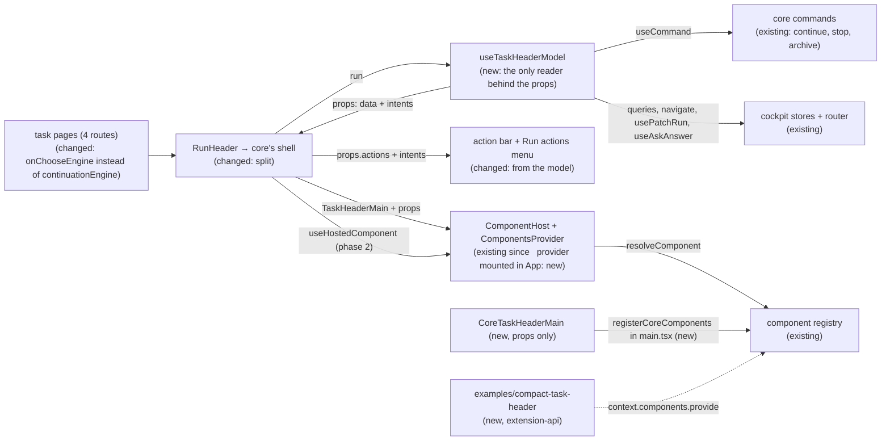

# Task Header Contract — the header's public model, with core's own header rendered from it alone

> Slug: `task-header-contract` · Status: **designed, awaiting implementation** · Epic 2 (Component
> Platform), item 11: "Create `task.header@1` contract". Builds on
> `2026-09-19-component-host.md` (item 10: `ComponentHost` and `ComponentsProvider`, on `main`
> since #32, and the design of the `RunHeader` split), `2026-09-19-component-contract-api.md`
> (capabilities, `layout`, the bump table) and `2026-09-19-migrate-task-actions-to-command-api.md`
> (the `cezar.task.continue`, `.stop` and `.archive` commands). **Starts from `main` as #32 left
> it.** Item 10's task header slot (#33) never reached `main`, and this item does not depend on it
> (Q8). Delivery: two stacked PRs to `main`, touching `packages/extension-api` and
> `packages/web`. *Revised 2026-09-19 after #32 merged.*

## 📝 TLDR

Since #32, `main` has the component host. It renders whichever implementation of a component
contract the resolver picks, inside its own error boundary, with core's default as the fallback.
Nothing uses it yet: `CORE_COMPONENT_CONTRACTS` is empty, the cockpit mounts no
`ComponentsProvider`, and the task header is still one fixed `RunHeader`. Item 10's spec designed
the first slot: a thin `cezar.task.header.main@1` whose core implementation reads the run through a
core-only context. That part (#33) never reached `main`.

The proposal ships the slot directly with the header's **public model**, the brief's
`task.header@1`. It carries the task and its status as the task list shows it, the runner and
model, and the state of Continue, Stop and Archive: whether each is offered, whether it can run
now, and why not. Actions are **intents**: `onContinue()`, `onStop()`, `onArchive()`. Core
answers each one with the same command, confirmation and toast as today. No query client,
mutation, router or private hook crosses the boundary. **Core's default then renders from its
props alone**, and a new example extension, which imports nothing from `packages/web`, renders a
working header on the task page. An implementation may take over any of the three actions,
one by one, through the optional capabilities `offers-continue`, `offers-stop` and
`offers-archive`. Core's own header declares none of them, so the default page keeps today's
layout.

## Resolved assumptions (autonomous defaults)

The brief left these open. Each answer is the most reversible choice that meets the brief's
Definition of Done. The owner decided Q3, Q7 and Q8 on 2026-09-19, and those rows record the
decisions. The other rows are still autonomous defaults, each reversible before implementation
starts. Q8 was rewritten after #32 merged without the slot. Before that, it asked whether to amend
a `@1` that #33 would already have shipped.

| # | Question | Answer | Why | Status |
|---|---|---|---|---|
| Q1 | The brief bundles the contract, core's header moving onto it, and a proof in a separate package. Split into several specs? | **One spec, two phases, two stacked PRs.** Phase 1 ships the slot: the contract with the complete model, the `RunHeader` split, core's default on props only, its registration and the provider in the app. Phase 2 adds the per-action takeover (Q3) and the example extension that proves the Definition of Done. | None of them works alone. A contract that core's header does not use proves nothing, and the proof needs the complete model. The takeover could be its own spec (item 10 named a deferred `.actions` part), but the brief puts the actions in this contract. | default, reversible |
| Q2 | The brief names `task.header@1`. Item 10's spec designed `cezar.task.header.main@1` for the same box. Its owner decisions (Q4a–Q4c) stand, but the contract is not on `main`. Which id and which split? | **Item 10's: `cezar.task.header.main@1`, and item 10's split of `RunHeader` (§ The split).** No second header contract. The brief's `task.header@1` is the illustrative name for this one, mapped to the repository's ids the way the owner's `task.title` became `shows-title` in item 10. The contract is born with the complete model. | The owner already decided what is replaceable (Q4b: the title and meta rows, not the whole header). Item 10 named the header's parts `cezar.task.header.<part>` on purpose, so that later parts can join them. | default, reversible |
| Q3 | Item 10's Q4b kept the task actions in core's shell, "so no replacement can take away control of a task". The brief puts Continue, Stop and Archive in the contract. May a replacement own them? | **Yes, per action, when it declares so explicitly.** There are three optional capabilities, `offers-continue`, `offers-stop` and `offers-archive`. An implementation that declares one renders that action from its props and calls its intent, and core leaves that action out of its action bar. While it offers any of the three, core's **Run actions** menu stays visible at every width, and it still lists every task action. If the implementation throws, core's default returns and the bar shows the actions again. Core's default declares none, so today's page is unchanged. Finish, Open in, Notes, Mark unread, Pin and Delete never leave the shell. The capabilities join the token in phase 2, in the same PR as the shell code that honours them (AGENTS.md: core tokens land "in the same PR as the host code that honours them"). Adding an optional capability needs no bump. The `actions` state and the three intents belong to `@1` from phase 1: core's own bar renders from them. | The owner chose the explicit opt-in and suggested the granular form (`task.continue`, `task.stop`, `task.archive`). Per action, one extension can show Continue inline and leave Stop and Archive to core. The names follow item 10's Q4c rule: capability names are local to their contract, so there is no `task.` prefix, and they use a verb like `shows-title` (`task.continue` → `offers-continue`). A separate `cezar.task.header.actions` contract would need a second host inside the action bar. That reorders the bar and cannot reach into the phone menu. | ✅ owner, 2026-09-19 (granular) |
| Q4 | How do the actions cross the boundary? | **As state plus intents.** Each action has `{ available, enabled, pending, reason? }`. `onContinue()`, `onStop()` and `onArchive()` return nothing. Core binds them to `useCommand(TaskContinue \| TaskStop \| TaskArchive)`, asks for confirmation before Stop, shows the server's words on failure, and checks the state again on every call. | If props carried command tokens, an implementation would call `context.commands.execute(TaskStop)` itself. That skips Stop's confirmation and the provider check that Continue makes today (`useContinuationProvider`). Intents keep one behavior for every header, and the brief rules out exposing mutations. | default, reversible |
| Q5 | How strict is "core header uses only contract props"? | **Strict for task facts and actions.** `CoreTaskHeaderMain` reads no run record, query, query client, router, command or core-only context. Item 10's design gave core's default a core-only context, `{ run, continuationEngine }`; this item never builds one. It may use core's presentational UI kit: buttons, the pill, menus, the reference chip in its explicit-status form, `toast` and the clipboard. A render test proves it: the component renders with no `QueryClientProvider`, router, `CommandsProvider` or `ComponentsProvider` above it. An import boundary test backs this up. | A test can check that rule. A looser reading ("its top-level inputs are props") would let the core-only context back in under another name. | default, reversible |
| Q6 | Core's header shows more than the brief lists: rename, reference chips with live state and **Resolve conflicts**, the automation link, tokens and cost, the account. What must the props carry so that core's default renders them from props? | **The facts, plus three more intents. The rename editor stays core's.** Added to the props: `task.prompt` (the title's hover text), `task.archived`, `attention` (the pill's words, tone, pulse and queue position), `engine` (runner, model, account, identity), `meta.diff.files` and `.repointed` (the diff chip's file count and #751 caveat), `meta.references` (with the forge's `status`, the look-up's `lookup` and `lookupReason`, and `conflicting`), `meta.automation`, `meta.usage`, and the `resolveConflicts` action state. The three intents are `onRename()`, `onResolveConflicts(prNumber)` and `onNavigate(href)`. `onRename()` asks core to open its own title editor over the part, with its saved draft, so the draft store stays private. | Without these fields, core's default could not render today's header (Q5), or the page would lose behaviors (Definition of Done 3). Each field is JSON that core already computes for the same row, and each intent maps to an existing core behavior. A metric hidden by `CEZ_HIDE_TOKEN_METRICS` is left out of the props, so it never reaches an implementation. | default, reversible |
| Q7 | The agent badge's menu holds the Session tab's **Next continuation** picker, a core `ReactNode`. The contract may not carry one (contract-api spec: "must not contain `ReactNode` slots"). What happens to it? | **The badge keeps a way in, through an intent.** Its menu offers **Choose engine for the next continuation…**, which calls `onChooseEngine()`. Core then moves focus to the dock's picker (`[data-slot="follow-up-engine"]`, its first pill), scrolled into view, where the user picks as today. The state `actions.chooseEngine` says when that is possible: on the Session tab, for a task that can be continued. The picker itself, driven by `useContinueAction`, stays in the dock only. | A `ReactNode` prop would bring back the side channel that Q5 removes. Modelling the picker (runners, discovered models, accounts, a change callback) would add about six public fields for a second copy of a control. One intent keeps the shortcut at the cost of one callback and one action state. | ✅ owner, 2026-09-19 |
| Q8 | Item 10's phase 2 (#33: the thin contract, the `RunHeader` split, core's default reading a core-only context) merged into `feat/component-host` 16 seconds after #32 was squash-merged into `main`, so none of it is on `main`. Build on it, or stand alone? | **Stand alone, on `main` as #32 left it, and #33 is abandoned.** This item declares `cezar.task.header.main@1` complete from the start, splits `RunHeader` as item 10's spec designed it, registers core's default, and mounts `ComponentsProvider` in the app. Nothing here depends on #33. #35 ("Revert 33") is closed. | Re-landing #33 first would ship a thin `@1` and a core-only context, and phase 1 would then remove both. That means doing the split twice and facing a version question (amend `@1` or bump to `@2`). Starting from `main` builds the split once, with core's default on props from the start. The cost: phase 1 also carries the provider wiring, the core registration and the test churn #33 carried. | ✅ owner, 2026-09-19 |
| Q9 | How is "a header can be written in a separate package" proven? | **A second worked example: `packages/extension-api/examples/compact-task-header/`.** It imports only the extension API and `react`. A cockpit test activates it through the real extension registry and uses it on the task page. No new workspace. | `examples/hello-extension/` set this precedent, and `test/boundary.test.ts` already keeps examples away from `packages/web`. A sixth workspace would add a root workspace entry, a package manifest and an AGENTS.md layout row just to hold a fixture. The one widening is that examples may now import `react` as a value. `src/` stays type-only, and the README and AGENTS.md say so. `react` becomes an extension-api devDependency pinned to `packages/web`'s range, so the cockpit test loads one React. | default, reversible |

## 📝 Problem Statement

The brief asks for "the first production replaceable component contract", a minimal public model
cut out of today's task header, and names what it must not expose: the query client, mutations,
router internals or Cezar's private hooks. On `main` after #32:

- **The host exists, and nothing uses it.** `ComponentHost` and `ComponentsProvider`
  (`component-registry/`) render a contract's resolved implementation inside an error boundary,
  with core's default as the fallback. But `CORE_COMPONENT_CONTRACTS` is empty, `main.tsx`
  registers no core default, and `App` mounts no `ComponentsProvider`. Every extension `provide`
  is still recorded as `unknown-contract`.
- **The header is one fixed block, and it reads the run everywhere.** `run-header.tsx` (about
  1,270 lines) renders the title, meta, actions and tabs as one component. Every fact it shows is
  derived from the `ApiRun` inside it: `useConfig` for the default runner, `useAgentProfiles` for
  the account, `useRuns` for the queue position, `useHealth` for the token visibility,
  `ReferenceStatusProvider` for PR states, and `usePatchRun` and `useDraft` for rename. No model
  exists that another implementation could render.
- **The actions are welded to the query layer.** `useRunActions` (`run-header.tsx`) builds
  Continue, Archive and Cancel from `useCommand`, `useContinuationProvider`, `runActionFlags` and
  local confirmation state. They have no model a header could render, so "actions: continue, stop,
  archive" from the brief has nothing to point at.
- **Item 10's slot design stops short of the brief.** Its `TaskHeaderMainProps` holds the id,
  project, title, raw status, workflow, branch, diff and plan. It has no status words or colour
  (`deriveAttention`), no runner or model, and no action, so an extension's header could not show
  "needs you", say which agent runs the task, or offer Continue. Its core default reads the run
  through a core-only context, so nothing proves the props are enough. That design (#33) is not on
  `main` (Q8).

The brief's Definition of Done, and where this item proves each point:

| Definition of Done | How this item meets it | Proven by |
|---|---|---|
| A header can be written in a separate package without imports from `packages/web`. | `TaskHeaderMainProps` carries the task, its status as the list shows it, the runner and model, the three actions' state and their intents. `examples/compact-task-header/` implements the contract importing only `@open-mercato/cezar-extension-api` and `react`. On the task page it shows the title, status and engine and runs Continue, Stop (after core's confirmation) and Archive. | `extension-api/test/boundary.test.ts`, `test/compact-task-header.test.ts`, `web/src/routes/task-thread/external-task-header.test.tsx` |
| Core's header uses only the contract's props. | `CoreTaskHeaderMain` takes every task fact and every action from its props. No core-only context exists. The shell's own Continue, Stop and Archive buttons also render from `props.actions` and call the same intents, so one model drives every copy of those three controls. | `core-task-header-main.test.tsx` (renders with no query client, router or command provider), `core-task-header-boundary.test.ts` |
| Every required behavior still exists. | § UI/UX maps each of today's header behaviors to where it lives afterwards, and lists the five visible differences. The one removal is the badge's copy of the Next continuation picker, which stays in the dock (Q7). | `run-header.test.tsx`, `task-thread.test.tsx`, `follow-up-engine.test.tsx` |
| The contract exposes no query client, mutation, router internals or private hook. | Data props are JSON (`IsJson`). The only functions are seven intents that return `void`. `onNavigate` takes only an `href` that core itself put in the props. | the type test in `packages/extension-api/test`, `task-header-main.test.ts` |

## 📝 Proposed Solution

1. **Declare the contract** (`packages/extension-api/src/core-components.ts`, new, re-exported
   from `src/index.ts`). `TaskHeaderMain` is `cezar.task.header.main@1`, with the id, required
   capabilities and layout that item 10 designed and the complete model (§ API Contracts, Q6).
   Phase 2 adds the optional capabilities `offers-continue`, `offers-stop` and `offers-archive`
   (Q3), together with the shell code that honours them.
2. **One adapter reads the run for the part and the three actions.** `useTaskHeaderModel` (new,
   `routes/task-thread/task-header-main.ts`) is the only code that reads the `ApiRun`, the queries,
   the commands and the router to build the part's props and to run Continue, Stop and Archive. The
   shell's other rows (tabs, Finish, Pin, Mark unread, Delete, Terminal, the monitoring and dispatch
   lines, the step rail and the resume hint) keep reading the run as today. It returns the contract's props plus the two
   things only the shell needs: the stop that runs after confirmation, and the title editor. The
   data is frozen. The callbacks keep one identity and always act on the run the header shows now,
   because the header does not remount between tasks (`run-header.tsx`, `detailsOpenByRun`). `useRunActions` keeps Finish, Pin, Mark unread, Delete and
   Terminal.
3. **Core's default renders from its props** (`core-task-header-main.tsx`, new). Today's title
   row and meta row move out of `run-header.tsx` and read props instead of the run. The reference
   chips get their forge status, look-up state and conflict flag as props, and the agent badge
   reads `engine`. While `actions.chooseEngine` is available, the badge's menu offers **Choose
   engine for the next continuation…**, which calls `onChooseEngine()` (Q7).
4. **`RunHeader` becomes core's shell**, as item 10's spec designed it (§ The split). Where the two
   rows were, it renders `<ComponentHost contract={TaskHeaderMain} subject={run.id}
   props={model.props} />`, with the Run actions menu beside it. The actions, tabs, monitoring and
   dispatch lines, step rail, resume hint and notes panel stay in the shell. The desktop bar and the
   Run actions menu draw Continue, Cancel and Archive from `props.actions` and call
   `props.onContinue`, `onStop` and `onArchive`. **Cancel** is the visible label of the Stop intent,
   as today. `onStop` opens core's existing confirmation dialog, and confirming runs the stop.
   `RunHeader` loses its `continuationEngine` node. On the Session tab, the page passes
   `onChooseEngine` instead: `useContinueAction`'s new `focusPicker()`, which moves focus to the
   dock's first engine pill.
5. **Core's default is registered, and the app provides the registry**, as item 10's spec planned.
   `registerCoreComponents` (`component-registry/core-components.ts`, new) registers
   `CoreTaskHeaderMain` as `cezar.task.header.main.default`, and `CORE_COMPONENT_CONTRACTS` becomes
   `[TaskHeaderMain]`. `main.tsx` registers it before `startExtensionHost` and hands the registry
   to `App`, which wraps its tree in `ComponentsProvider`. Nobody has a preference yet, so core's
   default renders everywhere.
6. **Rename stays core's.** The pencil (in core's default, or in any implementation) calls
   `onRename()`. The shell then shows its title editor in the top 30 px of the part's box (the
   contract's `minBlockSize`, which every implementation is built around), keeping the part
   mounted but hidden and `inert`, so the header keeps its height. Enter saves through `usePatchRun`
   and Escape cancels. The saved draft reopens the editor when the user comes back, as today.
7. **Taking over an action (phase 2).** `useHostedComponent(contract, subject)` tells the shell
   which implementation its host renders now. For each action whose capability that
   implementation's checked capabilities include, the bar leaves that action out:
   `offers-continue` removes Continue, `offers-stop` removes Cancel, and `offers-archive` removes
   Archive. While the implementation offers any of them, the Run actions menu loses its
   `md:hidden`. The menu lists every task action, including those three and Terminal. Only the
   Open in targets stay in the bar alone, as today.
8. **The proof (phase 2).** `packages/extension-api/examples/compact-task-header/` is a one-row
   header written against the package alone. A cockpit test activates it, prefers it and uses it.

### Prior art

- **Grafana panel plugins** receive `PanelProps`, which is data plus callbacks such as
  `onChangeTimeRange`, and never query a data source themselves. We take the same split: data and
  intents go in, and the host keeps the side effects.
- **VS Code** contributes a command together with an `enablement` and `when` clause, and the
  workbench decides whether its menu item shows and is enabled. `available`, `enabled` and `reason`
  are that split, computed by core rather than by an expression language.
- **Backstage** entity pages hand their cards a `useEntity()` hook. We skip that: a hook ties an
  implementation to the host's React tree and query layer, which the brief rules out.
- **Container and presentational components**, and "headless" UI kits: one adapter reads the
  stores, one view renders props. Core's default becomes the view, and the adapter is the only
  container.

### Alternatives considered

- **Re-land #33 first, then complete its contract** (Q8). Rejected by the owner: #33 is abandoned. The split would be done twice.
  A thin `@1` and a core-only context would ship only to be removed, and `@1` would need an
  in-place amendment or a bump to `@2`.
- **One capability for all three actions (`task-actions`)** (Q3). Not chosen: the owner preferred
  the granular form, and per-action capabilities let an implementation take over one action while
  core keeps the others.
- **A separate `cezar.task.header.actions@1` contract** (Q3). Rejected for now. Its host would sit
  inside the desktop action bar, which forces Continue, Archive and Cancel into one group and
  reorders the bar. It also cannot put items into the phone menu, a Radix menu that only core's
  components can fill. It stays open as a later part if a real need appears (item 10, Q4b).
- **Put command tokens in the props** (Q4). Rejected. Stop would skip its confirmation, and every
  implementation would need to repeat Continue's provider check.
- **Give core's default a narrower context for the rich widgets** (Q5). Rejected. That is the same
  side channel, under another name, and the Definition of Done forbids it.
- **Let implementations render their own title editor** through a `titleEdit` prop (draft, change,
  save, cancel). Rejected. It adds four public fields, and a saved draft would disappear under any
  implementation that ignores them. Core's editor works under every implementation.
- **Model the Next continuation picker as props** (Q7). Rejected, for its size and because the
  dock already shows the picker. **Drop the badge's way in entirely** was the first default. The
  owner kept it as the `onChooseEngine()` intent instead.
- **Keep both copies of the three actions** (an implementation shows them, and core's bar shows
  them too). Rejected: two Continue buttons on one header.
- **A new workspace for the proof** (Q9). Rejected. An example in `extension-api/examples/` gives
  the same proof without touching the root manifest.

## 📝 Architecture



- **New in `packages/extension-api`:** `src/core-components.ts` (the contract), re-exported from
  `src/index.ts`, with `test/surface.test.ts` listing `TaskHeaderMain`; in phase 2,
  `examples/compact-task-header/index.ts` and `test/compact-task-header.test.ts`.
- **Changed in `packages/extension-api`:** `README.md` ("Replacing a component" → the task
  header). In phase 2: `test/boundary.test.ts` (examples may import `react`) and `package.json`
  (`react` as a devDependency, for the example).
- **New in `packages/web/src/routes/task-thread/`:** `task-header-main.ts`
  (`useTaskHeaderModel`) and `core-task-header-main.tsx` (`CoreTaskHeaderMain`: today's title row
  and meta row, on props only).
- **New in `packages/web/src/component-registry/`:** `core-components.ts`
  (`registerCoreComponents`), `boundary.ts` with `boundary.test.ts` (only `core-components.ts`
  imports core's default), and the gate test (`missingCoreDefaults` is `[]`).
- **New in `packages/web/src/lib/`:** `import-scan.ts`. It holds the import parser from
  `commands/boundary.ts`, so the commands scan and both new scans share one parser.
- **Changed in `packages/web`:** `run-header.tsx` (becomes the shell; actions from the model; the
  title editor; the per-action takeover in phase 2), `task-thread.tsx` (passes `onChooseEngine`
  instead of `continuationEngine`), `follow-up-engine.tsx` (`useContinueAction` returns
  `focusPicker()`),
  `core-contracts.ts` (`[TaskHeaderMain]`), `main.tsx` and `app.tsx` (register core's default and
  provide the registry), `provider.tsx` (a `ComponentsProvider` without a `registry` builds one with
  core's defaults registered; #32's builds it empty), `component-host.tsx` (`useHostedComponent`,
  phase 2),
  `components/reference-status.tsx` (its publish-and-look-up becomes a hook the provider uses too),
  `components/reference-chip.tsx` (it takes an explicit look-up entry, with status, state and
  reason, beside today's explicit `status` and `conflicting`, and reads a status it does not know as
  none, as it already does), `vite.config.ts` (the entry-chunk check, Risks), and every test that
  renders `RunHeader` or a task route (they add `ComponentsProvider`).
- **New tests:** `core-task-header-main.test.tsx`, `core-task-header-boundary.test.ts`,
  `task-header-main.test.ts`, `core-components.test.ts` and `boundary.test.ts` in
  `component-registry/`, and `external-task-header.test.tsx` (phase 2).
- **Not touched:** the component registry and resolver modules, the command handlers, the event
  bus, the HTTP contract, the service and the api-client. No `BACKWARD_COMPATIBILITY.md` surface
  moves. `ComponentHost` and `ComponentsProvider` keep #32's behavior. The two changes are the
  provider's default registry (phase 1) and the host's choose step moving into `useHostedComponent`
  (phase 2).

In short, the replaceable part and the three actions are fed from one place, the part renders a
model, and the model is the contract.

## 📝 Data Model

Nothing is persisted. The adapter adds no state beyond what `useRunActions` and `EditableTitle`
hold today: the stop confirmation and the title editor move with their behavior. The component
provider's failure record (#32) is read, not changed.

## 📝 API Contracts

Signatures are normative. The contract is new on `main`. Its id, required capabilities, layout and
the three item-10 interfaces are item 10's design (§ API Contracts), completed here. `ComponentHost`
and `ComponentsProvider` are as #32 shipped them, except for the two changes listed under
Architecture.

### `packages/extension-api/src/core-components.ts` (public, new)

```ts
/** The task a header shows. JSON. */
export interface TaskHeaderTask {
  readonly taskId: string
  /** The registered project that owns the task. Pass it as `TaskRef.projectId`. */
  readonly projectId: string
  /** The title the cockpit shows for the task: the user's, or the generated one. */
  readonly title: string
  /** The text the task was started with. Core shows it when the pointer rests on the title. */
  readonly prompt: string
  /** `queued`, `running`, `waiting`, `review`, `done`, `failed` or `cancelled` today (the union may grow). */
  readonly status: string
  /** Archived tasks offer Unarchive instead of Archive. */
  readonly archived: boolean
}

/** How the status reads: the words, colour and motion of the task list's dot. JSON. */
export interface TaskHeaderAttention {
  /** A lower-case phrase, e.g. `running`, `needs you`, `queued`. */
  readonly label: string
  /** `success`, `pending`, `danger`, `violet` or `neutral` today. The set may grow: read an unknown tone as `neutral`. */
  readonly tone: string
  /** True while the task is changing state. */
  readonly pulse: boolean
  /** The 1-based place in the project's queue, for a queued task. */
  readonly queuePosition?: number
}

/** The agent the task runs on. JSON. */
export interface TaskHeaderEngine {
  /** `claude`, `codex`, `opencode`, …: the task's runner, or the project's default when the task named none. */
  readonly runner: string
  /** The model the task asked for, or `auto` when the runner picks. */
  readonly model: string
  /** The account the last agent step ran under, when one was recorded. A removed account reads `<id> (removed)`. */
  readonly account?: string
  /** The `provider/model` the run resolved to, when it differs from `model`. */
  readonly identity?: string
}

/** A pull request or issue the task points at. JSON. */
export interface TaskHeaderReference {
  readonly kind: 'pr' | 'issue'
  readonly number?: number
  /** An http(s) URL, when one is known. */
  readonly url?: string
  /**
   * The forge's last known answer about it: `draft`, `review-required`, `changes-requested`,
   * `checks-pending`, `checks-failing`, `ready`, `merged`, `closed`, `open`, `completed` or
   * `not-planned` today. The set may grow: read an unknown value as absent. Absent: nothing known.
   */
  readonly status?: string
  /**
   * How the look-up behind `status` stands: `loading`, `ready`, `unknown` (the forge has no such
   * number) or `unavailable` (the forge could not be reached, so `status` is only the last known
   * answer). Absent: nothing asked, e.g. a reference without a number.
   */
  readonly lookup?: string
  /** Why the look-up is `unavailable`, in words for the user. */
  readonly lookupReason?: string
  /** `true` when the pull request has merge conflicts. Absent means unknown, never "clean". */
  readonly conflicting?: boolean
}

/** The basic facts core's header shows under the title. JSON. */
export interface TaskHeaderMeta {
  /** The workflow's display name, e.g. `quick-task`. */
  readonly workflow: string
  readonly branch?: string
  /**
   * Lines added and removed on the task's branch, and the number of files, once known.
   * `repointed`: measured against another branch the agent checked out into the task's worktree
   * (#751), so the numbers count only what the task did to it.
   */
  readonly diff?: { readonly added: number; readonly removed: number; readonly files: number; readonly repointed?: boolean }
  /** Every pull request, then the issue, in the order the Tasks table shows them. */
  readonly references?: readonly TaskHeaderReference[]
  /** The automation that launched the task. `href` (a project-scoped cockpit path) is set while the automations page is available. */
  readonly automation?: { readonly automationId: string; readonly href?: string }
  /** The usage this server shows. A metric the server hides (`CEZ_HIDE_TOKEN_METRICS`) is absent. */
  readonly usage?: { readonly inputTokens?: number; readonly outputTokens?: number; readonly costUsd?: number }
}

/** Whether an action is offered, and whether it can run now. JSON. */
export interface TaskHeaderActionState {
  /** The task's state allows the action: render its control. */
  readonly available: boolean
  /** It can run now. `false` while `pending`, or for the `reason` given. */
  readonly enabled: boolean
  /** A request for it is in flight. */
  readonly pending: boolean
  /** Why it cannot run, in words for the user, e.g. "Connect an agent provider to continue." */
  readonly reason?: string
}

export interface TaskHeaderActions {
  /** Reopen the task's last agent session. */
  readonly continue: TaskHeaderActionState
  /** Stop an active task. Core labels it **Cancel** and asks the user to confirm. */
  readonly stop: TaskHeaderActionState
  /** Archive the task, or restore it when `task.archived`. */
  readonly archive: TaskHeaderActionState
  /** Ask the task's agent to resolve a pull request's merge conflicts. Offer it on a numbered, `conflicting` reference. */
  readonly resolveConflicts: TaskHeaderActionState
  /** Choose the runner and model the next continuation uses. Available on the Session tab, for a task that can be continued. */
  readonly chooseEngine: TaskHeaderActionState
}

export interface TaskHeaderMainProps {
  readonly task: TaskHeaderTask
  readonly attention: TaskHeaderAttention
  readonly engine: TaskHeaderEngine
  readonly meta: TaskHeaderMeta
  /** Plan progress, on the Session tab of a task that has a plan. */
  readonly plan?: { readonly done: number; readonly total: number }
  readonly actions: TaskHeaderActions
  /** The user asked to continue the task. */
  readonly onContinue: () => void
  /** The user asked to stop the task. Core asks them to confirm first. */
  readonly onStop: () => void
  /** The user asked to archive the task, or to restore it when it is archived. */
  readonly onArchive: () => void
  /** The user asked to rename the task. Core shows its title editor over this part until they save or cancel. */
  readonly onRename: () => void
  /** The user asked the agent to resolve conflicts in pull request `prNumber`, a `conflicting` reference. */
  readonly onResolveConflicts: (prNumber: number) => void
  /** The user followed an in-app link from these props (`meta.automation.href`). */
  readonly onNavigate: (href: string) => void
  /** The user asked to choose the engine for the next continuation. Core moves focus to its engine picker. */
  readonly onChooseEngine: () => void
}

/**
 * The presentational part of the task header, and the header's public model: the task, its status,
 * its engine, its basic facts and the state of its main actions. Core renders the tabs, Finish,
 * Open in, Notes, Mark unread, Pin, Delete, the monitoring and dispatch lines and the step rail
 * around it, so an implementation neither provides nor can remove them.
 * - `shows-title` (required): shows `task.title`.
 * - `shows-status` (required): shows the status, from `attention`.
 * - `shows-meta` (optional): shows `meta` and `engine`. The picker says which implementations do.
 * - `offers-continue`, `offers-stop`, `offers-archive` (optional, phase 2): renders that action
 *   from `actions` and calls its intent (`onContinue`, `onStop`, `onArchive`). Core then leaves
 *   that action out of its action bar, and while any of the three is offered it keeps its Run
 *   actions menu, which lists them too, visible at every width. For an action it does not declare,
 *   core renders the action beside this part, and the implementation should not.
 * - Intents: before acting on `onContinue`, `onStop`, `onArchive`, `onResolveConflicts` or
 *   `onChooseEngine`, core checks the action's current state. A call does nothing unless the action is `available` and
 *   `enabled`, which also rules out a repeat while one is `pending`.
 * - Layout: 30 CSS pixels (one title row) are reserved while an implementation loads, fails or
 *   is swapped. Core's title editor covers this band while the user renames. The shell around it
 *   is sticky; this part is not.
 */
export const TaskHeaderMain = defineComponentContract<TaskHeaderMainProps>('cezar.task.header.main', {
  version: 1,
  requiredCapabilities: ['shows-title', 'shows-status'],
  // Phase 1: ['shows-meta'], as item 10 designed it. Phase 2 adds the three 'offers-*' with the
  // shell code that honours them.
  optionalCapabilities: ['shows-meta', 'offers-continue', 'offers-stop', 'offers-archive'],
  layout: { minBlockSize: 30 },
})
```

What core does for each intent, and so what the words promise to an implementation. The five
tied to an action state act only while it is `available` and `enabled`. Otherwise the call does
nothing.

| Intent | Core's answer |
|---|---|
| `onContinue()` | Executes `cezar.task.continue` with `{ taskId }`, plus `runner` when the task's runner is not connected (`useContinuationProvider`), as the header does today. On failure it shows the server's words as a danger toast. |
| `onStop()` | Opens the "Cancel this task?" confirmation. **Cancel the run** executes `cezar.task.stop`, and **Keep it** does nothing. |
| `onArchive()` | Executes `cezar.task.archive` with `archived: !task.archived`. |
| `onResolveConflicts(n)` | When `n` is the number of a reference with `conflicting: true`, sends `resolveConflictsPrompt(n)` through the task's delivery seam (`useAskAnswer`), with today's toasts. A reference known only by URL is never conflicting (the look-up needs a number), so it never qualifies, as in core's own chip today. |
| `onRename()` | Opens core's title editor over the part, holding the saved draft if there is one. |
| `onNavigate(href)` | Navigates within the cockpit when `href` is one that core put into these props. Any other value does nothing, and one `[cezar:extensions]` warning is logged per value per page load. |
| `onChooseEngine()` | Moves focus to the dock's engine picker (`[data-slot="follow-up-engine"]`, its first pill: the runner pill when there is a choice of runner or login, otherwise the model pill) and scrolls it into view. |

### `packages/web/src/routes/task-thread/task-header-main.ts` (new)

```ts
export interface TaskHeaderModel {
  /**
   * The contract's props. The data is frozen, and recomputed only when one of its inputs changes:
   * the run, the queue, health, the account list or a reference's look-up. The callbacks keep one
   * identity for the life of the header, and each call reads the latest run and state through a
   * ref, so after a switch from task A to task B (the header is not remounted) it acts on B.
   */
  readonly props: TaskHeaderMainProps
  /** Runs the stop. The shell calls it when the user confirms. */
  readonly stopTask: () => void
  /** Core's title editor: today's `useTitleEditor` with the saved draft (`useDraft(taskId, 'title')`) and `usePatchRun`. */
  readonly titleEditor: TitleEditor
}

/** The only reader of the run behind the part's props and the three actions. `requestStopConfirmation` is the shell's dialog opener. */
export function useTaskHeaderModel(
  run: ApiRun,
  options: {
    readonly planTally?: { done: number; total: number }
    readonly requestStopConfirmation: () => void
    /** The Session tab's dock picker focus (`useContinueAction().focusPicker`); absent on the Git tabs. */
    readonly chooseEngine?: () => void
  },
): TaskHeaderModel
```

The fields come from the helpers that feed today's header, so there is one rule per fact.
`task.projectId` is `useActiveProjectId()`, which also answers for the boot project (its URL is
`/p/<boot>/…`). Every task route lives under `/p/:projectId/`, so the fallback `''` is seen only by
a bare test render at an unscoped path. The rest: `runTitle`, `deriveAttention`, `queuePositions` over `useRuns`, `workflowLabel`,
`taskReferences`/`taskPrUrl`/`taskIssueUrl` with `useProjectRepoBase`, the reference states
through the look-up `ReferenceStatusProvider` uses, `usageMetricVisibility(useHealth())`, the
`AgentBadge` resolution (`useConfig().defaultRunner`, the last step's `profileId`,
`useAgentProfiles`, `modelIdentity`), `runActionFlags` and `useContinuationProvider`.
`actions.chooseEngine` is available when the page passed `chooseEngine` and the task can be
continued (`runActionFlags(run).continueRun`, the same gate the dock uses to show the picker). The
automation's `href` is `scopeTo(useActiveProjectId(), '/automations/<id>/log')`
(`@/lib/project-router`), which is exactly the path the scope-aware `Link` produces today. At an
unscoped path, `scopeTo(null, …)` leaves it `/automations/<id>/log`, as the existing header test
expects. It is set only while
`capabilities.automations` is on. A raw `<a href>` must carry the project prefix itself, or a
middle-click on a task from a non-boot project would open the boot project's page.

### `packages/web/src/component-registry/component-host.tsx` (additive, phase 2)

```ts
/**
 * The implementation the host for (`contract`, `subject`) renders now: the resolved component, or
 * core's default once the resolved one has failed for this subject. `null` while unresolved.
 */
export function useHostedComponent<P extends object>(contract: ComponentContract<P>, subject?: string): UsableComponent<P> | null
```

Today `ComponentHost` subscribes, resolves and chooses inline (#32: steps 1, 2 and 4 of item 10's
§ Hosting, precisely). Those steps move into this hook. `ComponentHost` calls it too, so the host
and the shell make one choice from one `hasFailed` record and cannot disagree.

For each action, the shell reads
`useHostedComponent(TaskHeaderMain, run.id)?.capabilities.includes('offers-continue')` (and the
same for `offers-stop` and `offers-archive`).
`capabilities` is the checked list, not the declared one, as everywhere in the registry.

### `packages/extension-api/examples/compact-task-header/index.ts` (new)

```ts
import { createElement as h } from 'react'
import { defineExtension, TaskHeaderMain, type ComponentProps } from '@open-mercato/cezar-extension-api'

/** One row: title · status · runner/model · the task's main actions. */
function CompactTaskHeader(props: ComponentProps<typeof TaskHeaderMain>) { /* h('div', …) */ }

export default defineExtension({
  manifest: { id: 'example.compact-header', name: 'Compact task header', version: '1.0.0', engines: { cezar: '>=<the release that ships this>' } },
  activate(context) {
    context.components.provide(TaskHeaderMain, {
      id: 'example.compact-header.row',
      title: 'Compact row',
      capabilities: ['shows-title', 'shows-status', 'offers-continue', 'offers-stop', 'offers-archive'],
      component: CompactTaskHeader,
    })
  },
})
```

It is a `.ts` file using `createElement`, so the boundary scanner (which reads `.ts` files) covers it
and the package needs no JSX setting.

## 📝 UI/UX

**The default page stays as it is, with the five exceptions listed after the table.** Core's
default keeps today's markup, and the shell keeps its action bar and the Run actions menu.

Where each of today's header behaviors lives after this item:

| Behavior today | After this item |
|---|---|
| Title, full prompt on hover | Core's default, from `task.title` and `task.prompt` |
| Rename (pencil, inline editor, draft kept across navigation) | The pencil calls `onRename()`. Core's editor opens over the part, and the draft behaves as today |
| Plan mirror (desktop) | Core's default, from `plan` |
| Status pill with queue position (`queued #2`) | Core's default, from `attention` |
| Phone-width details toggle | Core's default, as its own state, keyed by `task.taskId` |
| Workflow, branch chip (copy), diff with its file count and the #751 `repointed` caveat | Core's default, from `meta` |
| PR chips with live status, their tooltips ("Checking GitHub…", "Status unavailable", "last known — GitHub is unreachable"), conflict warning, **Resolve conflicts** | Core's default, from `meta.references` (`status`, `lookup`, `lookupReason`, `conflicting`) and `actions.resolveConflicts`, calling `onResolveConflicts` |
| PR link without a number, issue chip | Core's default, from `meta.references` |
| Automation chip (a link while automations are on) | Core's default, from `meta.automation`, calling `onNavigate` on a plain click. Ctrl- or middle-click still opens a new tab through the `href` |
| Tokens and cost (hidden per `CEZ_HIDE_TOKEN_METRICS`) | Core's default, from `meta.usage` |
| Agent badge: runner · account · model, identity in its menu | Core's default, from `engine` |
| Next continuation picker in the badge menu (Session tab) | Badge menu item **Choose engine for the next continuation…** calls `onChooseEngine()`, and core moves focus to the dock's picker. The picker itself stays in the dock only (Q7) |
| Continue (disabled, with the reason, without a provider) | Shell, from `actions.continue`, calling `onContinue`. Or the implementation, with `offers-continue` |
| Cancel with its confirmation | Shell, from `actions.stop`, calling `onStop`. Or the implementation, with `offers-stop`. The confirmation is always core's |
| Archive / Unarchive | Shell, from `actions.archive`, calling `onArchive`. Or the implementation, with `offers-archive` |
| Finish, Open in / Terminal, Notes, Mark unread, Pin, Delete | Shell, unchanged |
| Run actions menu (⋮, phones) | Shell, beside the part's box rather than inside the title row (item 10 § The split) |

The five visible differences on the default page:

1. **The badge menu's inline picker becomes a jump to the dock** (Q7). **Choose engine for the
   next continuation…** closes the menu and moves focus to the dock's first engine pill, where the
   user picks as before. Runner, account, model and identity stay in the badge.
2. **While renaming**, core's editor fills the top 30 px of the part's box (its `minBlockSize`),
   and the rest of the part is hidden until the user saves or cancels. That includes the live
   status pill and the meta row. Today only the title turns into the input. The header keeps its
   height.
3. **Archive and Cancel are disabled while their request is in flight**, like Continue already is
   (`enabled` is `false` while `pending`). Before, a second click could send a second request.
4. **Resolve conflicts closes its card when the request settles, whether it worked or not.** The
   intent returns nothing, so the chip cannot tell success from failure. The toast still says which
   happened, in the server's words on failure. Today the card stays open after a failure.
5. **On phones, the Run actions menu sits beside the part's box**, not inside the title row. This
   is item 10's split, and its one intended difference: the expanded meta row is narrower by one
   30 px button.

With an implementation that declares all three `offers-*` capabilities (tests and the example
only, until the picker item stores a choice), the desktop bar shows Finish, Open in, Notes, Mark
unread, Pin and Delete, and the implementation shows Continue, Cancel/Stop and Archive in its own
box. With only `offers-continue`, the bar keeps Cancel and Archive and drops only Continue. While
any of the three is offered, core's **Run actions** menu (⋮) appears beside the box at every
width and still lists every task action (the Open in targets stay in the bar, as today).

Accessibility: an implementation's controls are its own. Core's controls keep their labels
(`aria-label="Run actions"`, `aria-pressed` on Pin). The title editor keeps today's input and
keyboard handling. While the editor is open, the hidden part is `inert`, so focus cannot reach it.

Prototype: `.ai/specs/assets/task-header-contract/`. `current-01-task-header.png` is today's task
page. It is reused from `assets/component-host/`: it was captured on 2026-09-19, and the header
code has not changed since. `mockup-01-extension-owns-actions.png` shows the compact example header
owning the three actions, with core's bar and menu beside it. `mockup-02-badge-menu.png` shows the
badge menu today and as proposed (Q7). `mockup-03-renaming.png` shows core's editor over the part.
The `.html` sources sit beside them. The dashed outline marks the host's box.

## 📝 Edge Cases & Failure Scenarios

- **An implementation calls an intent at the wrong time** (Continue on a running task, Stop twice,
  Archive during a pending archive). Core checks `actions` first and ignores the call, so nothing is
  sent. An implementation can never do more than the user could with core's own buttons.
- **An implementation calls `onStop()` without the user asking.** It gets the confirmation dialog,
  never a stop. A task stops only when the user presses **Cancel the run**.
- **`onNavigate` with a foreign or crafted value** (`javascript:…`, `//evil`, another task's URL).
  It is ignored, because only an `href` that core put into these props navigates, and one
  `[cezar:extensions]` line is written per value.
- **An implementation declares `offers-stop` but hides Stop, or renders it badly.** A capability
  is a declaration, like every capability. The Run actions menu stays visible at every width while
  that implementation renders, and it lists Cancel, so the task stays controllable.
- **An implementation that offers actions throws.** The host renders core's default (#32), and the
  shell sees the failure through `useHostedComponent`. For one commit, between the fallback's
  render and the failure being recorded, neither the part nor the bar shows the offered actions.
  The Run actions menu is visible during that commit. After it, the bar shows them again.
- **`onChooseEngine()` where there is no picker** (a Git tab, or a task that cannot be continued).
  `actions.chooseEngine` is not available there, so core's badge shows no item and a call does
  nothing. With one runner and one login, the dock shows no runner pill, and focus goes to the
  model pill.
- **The implementation changes while the stop confirmation is open** (an extension deactivates).
  The dialog belongs to the shell, so it stays open, and confirming still runs the stop.
- **A metric hidden by the server.** `meta.usage` leaves it out, so no implementation can show it,
  and `CEZ_HIDE_TOKEN_METRICS` keeps its "everywhere" meaning (spec `2026-07-28-hide-token-metrics`).
- **A reference status, look-up state or tone this bundle does not know.** It reaches
  implementations as a string. Core's chip treats an unknown status as none, and core's pill treats
  an unknown tone as neutral.
- **The user moves from task A to task B.** The header is not remounted
  (`run-header.tsx`, `detailsOpenByRun`). The callbacks keep their identity but read the latest run
  through a ref, so a click on B's header never acts on A.
- **A removed account.** `engine.account` reads `<id> (removed)`, as the badge does today.
- **A long prompt.** `task.prompt` is the same string the record holds. Implementations should
  truncate it, and core's hover title shows it as today.
- **An implementation mutates its props.** Every data object is frozen, so in strict-mode code the
  write throws and counts as a render failure (#32's boundary). The callbacks keep one identity, so a
  memoized implementation does not re-render because of them.
- **The Changes, Commits and Files tabs.** They render the same shell and model. `plan` is absent
  there as today, and nothing else differs.
- **A saved title draft under an extension's implementation.** The shell opens its editor over the
  part, whatever the part is, so the draft is never stranded.
- **Core's default throws.** The box shows #32's inline "This part of the page could not be
  displayed." with **Try again**. The shell's actions, tabs, thread and composer keep working. Today
  the same bug unmounts the whole cockpit, which has no error boundary outside the host.
- **Core forgets to register its default.** The gate test (`missingCoreDefaults` is `[]`) fails
  first. At run time the box renders empty, never an extension's implementation (#32, "unresolved").
- **A replacement of another height.** The shell grows or shrinks with it. Changes and Files pin
  their tree pane at a fixed offset under today's header (`task-changes.tsx`), so a much taller
  replacement would misalign it. Core's default keeps today's height, and item 10 left publishing
  the shell's measured height to the picker item, which makes replacements reachable.

## 📝 Risks & Impact Review

- **The first public component contract.** `cezar.task.header.main@1` ships with seven data
  interfaces and seven intents. Once an extension outside the repository implements it, removing or
  narrowing any of them means `@2`. They are the brief's model plus the facts core's own header
  already shows (Q6). Nothing was added that core's default does not render. The package is
  private and `BUILTIN_EXTENSIONS` is empty, so nobody implements it yet.
- **Task content reaches extension code.** The prompt, branch, references, account label, model
  identity and usage join the title that item 10 (Q4a, owner) already allowed. Extensions are
  compiled in and trusted (item 10 § Prior art), hidden usage metrics stay hidden, and no credential
  or file content is in the props.
- **Item 10's Q4b is refined (Q3, owner).** With an `offers-*` capability, a replacement can take
  that action out of the desktop bar. The Run actions menu is how control stays available.
- **The badge's inline picker becomes a jump (Q7, owner).** The picker is still one click from the
  badge, in the dock rather than in the menu. This costs one public intent, one action state and a
  focus handle in `follow-up-engine.tsx`.
- **Splitting a working 1,270-line component.** The title and meta rows move out of
  `run-header.tsx` and onto props. The actions leave `useRunActions`, rename leaves
  `EditableTitle`, and the badge and chips stop reading queries. AGENTS.md § Changing a mechanism
  that already works applies. `run-header.test.tsx` (about 1,600 lines) must pass with exactly the
  rewrites step 5 lists: the wrapper, the `continuationEngine` argument replaced by
  `onChooseEngine`, the badge picker assertions, and the source check that moves to
  `task-header-main.ts`. In `task-thread.test.tsx`, only the picker test moves to the dock. `commands/boundary.test.ts` must still pass.
  The adapter's per-field tests pin each derivation to the helper it used before. A QA pass
  compares the task page at phone and desktop widths with `current-01-task-header.png`.
- **#33 is abandoned (Q8, owner).** Its reviewed and QA'd split is not reused as a commit. This
  item rebuilds the split from item 10's design, with core's default on props from the start, so
  phase 1 carries the wiring, the registration and the test churn that #33 carried.
- **The entry bundle.** `registerCoreComponents` imports `CoreTaskHeaderMain` eagerly into the first
  paint. A build check (`vite.config.ts`) fails when core's default's own static imports reach
  `run-header.tsx` or the markdown stack (`streamdown`). It checks the default's own graph, because
  other first-paint modules may legitimately import markdown.
- **Test churn.** Every test that renders `RunHeader` or a task route adds `ComponentsProvider`:
  `run-header.test.tsx`, `task-thread.test.tsx`, `task-changes.test.tsx`, `task-files.test.tsx`,
  `review-panel.test.tsx` and the other wrappers item 10's spec lists.
- **Shell–host coupling.** The host and the shell call the same `useHostedComponent`, so the two
  cannot disagree beyond the one commit described in § Edge Cases.
- **Rollback.** Revert phase 2, then phase 1. Nothing is persisted, the HTTP contract and commands
  do not change, and the extension API is private.

## 📋 Phasing

1. **Phase 1: The slot, with the complete model** (its own PR, from `main` after #32). Declare the
   contract, add the adapter, build core's default on props only, split `RunHeader` into the
   shell, register core's default, and mount `ComponentsProvider` in the app. The shell's three
   actions draw from the model. Rename moves to core's editor, and the badge's inline picker
   becomes the `onChooseEngine()` jump (Q7). The token's capabilities are item 10's.
2. **Phase 2: Taking over the actions, and the proof** (stacked on phase 1). `offers-continue`,
   `offers-stop` and `offers-archive` join the token, together with `useHostedComponent` and the
   shell code that honours them. Then come the compact example and the cockpit test that uses it.

## 📋 Implementation Plan

Every step keeps the validation gate in `.ai/agentic.config.json` green: typecheck, `npm test`,
`test:unit`, `build` and `test:package`.

### Phase 1: The slot, with the complete model

1. **The contract** (`packages/extension-api/src/core-components.ts`, re-exported from
   `src/index.ts`), per § API Contracts, without the three `offers-*` capabilities (step 8 adds
   them). The README's
   "Replacing a component" section describes the host, the notice, what a boundary cannot catch,
   the header's props, the intents and what core does for each, and what stays core's.
   *Tests:*
   - the token equals `{ kind: 'component', id: 'cezar.task.header.main', version: 1, requiredCapabilities: ['shows-title', 'shows-status'], optionalCapabilities: ['shows-meta'], layout: { minBlockSize: 30 } }`
     and is frozen;
   - `IsJson<Omit<TaskHeaderMainProps, 'onContinue' | 'onStop' | 'onArchive' | 'onRename' | 'onResolveConflicts' | 'onNavigate' | 'onChooseEngine'>>`;
   - a type test showing that the seven intents are the only function-typed props and all return `void`;
   - `test/surface.test.ts` lists `TaskHeaderMain`.

2. **The adapter** (`task-header-main.ts`: `useTaskHeaderModel`; `reference-status.tsx`: the
   look-up as a hook the provider also uses). Nothing renders it yet.
   *Tests* (`task-header-main.test.ts`, fixture runs):
   - each data field matches the helper that feeds today's header: title and prompt, attention
     and queue position, workflow, branch, the diff with its file count and `repointed`,
     references in the Tasks table's order (including a PR known only by URL, and an issue from the
     `CEZ:ISSUE` marker) with their status, look-up state and reason, and usage without each metric
     the health response hides;
   - the automation `href` is set only while automations are on, and is project-scoped: under
     `/p/<non-boot>/tasks/…` it is `/p/<non-boot>/automations/<id>/log`, and at an unscoped test
     path it stays `/automations/<id>/log` (the existing header test keeps passing);
   - `task.projectId` is the active project under `/p/<id>/…`, the boot project's id under
     `/p/<boot>/…`, and `''` only at an unscoped test path;
   - `engine`: the runner falls back to the project's `defaultRunner`, the model to `auto`, the
     account comes from the last step with a `profileId` (and reads `<id> (removed)` for a
     deleted one), and `identity` is absent when it repeats `model`;
   - `actions` for every status, matching `runActionFlags`; Continue is disabled with the
     provider reason while providers are pending, in error or not connected; `enabled` is `false`
     while pending;
   - `onContinue` executes `cezar.task.continue` with `runner` only when the task's runner is not
     connected;
   - `onStop` calls `requestStopConfirmation`, and `stopTask` executes `cezar.task.stop`;
   - `onArchive` executes `cezar.task.archive` with `archived: !task.archived`;
   - `onResolveConflicts(n)` sends `resolveConflictsPrompt(n)` once, and ignores a number that is
     not a `conflicting` reference;
   - for each of those four and `onChooseEngine`: a call does nothing while the action is not
     available, while it is not enabled, and while it is pending (a repeat);
   - `onNavigate` navigates for the automation `href` and ignores any other value, with one warning
     per value;
   - `actions.chooseEngine` is available only when `chooseEngine` was passed and the task can be
     continued, and `onChooseEngine` calls it then and does nothing otherwise;
   - the data is frozen and referentially stable while its inputs are unchanged, and a new queue
     position or reference look-up produces new data for the same run;
   - the seven callbacks keep their identity across renders. After a re-render with a second run
     (no remount), `onContinue`, `onStop`, `onArchive` and `stopTask` act on the second run's id.

3. **Core's default on props only** (`core-task-header-main.tsx`; `reference-chip.tsx` takes an
   explicit look-up entry). Today's title row and meta row are copied here from `run-header.tsx`
   and read props. The originals stay in `run-header.tsx` until step 5 deletes them, so the page
   keeps working in between. The badge reads `engine`. Its menu has no picker section, and it
   offers **Choose engine for the next continuation…** while `actions.chooseEngine` is available. The chips take `status`, `lookup`,
   `lookupReason` and `conflicting` from the props, and the explicit entry always wins over the
   chip's own `useReferenceStatus` look-up. Their conflict action is a button that calls
   `onResolveConflicts(n)` and closes the card when `actions.resolveConflicts` stops being pending.
   The diff renders through `DiffStatLabel` from `meta.diff`. Nothing renders it yet.
   *Tests:*
   - `core-task-header-main.test.tsx` renders fixture props with **no** `QueryClientProvider`,
     router, `CommandsProvider` or `ComponentsProvider`, and shows: the title with the prompt as its
     hover text, the pill's label and queue position, the plan mirror, workflow, branch, the PR
     chips' status and conflict warning, their "Checking GitHub…" and "last known — GitHub is
     unreachable" tooltips, the issue chip, the diff with "across N files" and the `repointed`
     caveat (`data-repointed`, `aria-label`), usage (and no usage when absent), the automation
     link, and the badge summary and menu;
   - rendered again under a `ReferenceStatusProvider` that answers differently for the same
     references, the chips still show the props' status and conflict flag, so no core context
     can override the props;
   - the pencil calls `onRename`, **Resolve conflicts** calls `onResolveConflicts(n)`, a plain
     click on the automation link calls `onNavigate(href)`, and a modified click does not;
   - the badge menu item calls `onChooseEngine()`, and it is absent while `actions.chooseEngine`
     is not available;
   - `core-task-header-boundary.test.ts`, using the import parser that moves from
     `commands/boundary.ts` into `lib/import-scan.ts` (the commands scan's tests keep passing):
     `core-task-header-main.tsx` imports nothing from `@/api/`, `@tanstack/react-query`,
     `@/lib/project-router`, `react-router`, `@/commands/`, `@open-mercato/cezar-api-client`,
     `./task-header-main`, `./run-header`, `./thread-draft` or `./continuation-provider`. The test
     shows that it catches an alias, a relative path and a dynamic import;

4. **Core's default registered, and the registry provided** (`component-registry/core-components.ts`,
   `core-contracts.ts`, `provider.tsx`, `main.tsx`, `app.tsx`, `vite.config.ts`).
   `registerCoreComponents` registers `CoreTaskHeaderMain` as `cezar.task.header.main.default`,
   declaring `shows-title`, `shows-status` and `shows-meta`. `CORE_COMPONENT_CONTRACTS` becomes
   `[TaskHeaderMain]`. `main.tsx` registers core's defaults before `startExtensionHost` and passes the
   registry to `App`, which wraps its tree in `ComponentsProvider` inside `CommandsProvider`. A
   `ComponentsProvider` without a registry (tests) builds one the same way. The page looks the
   same: no slot renders through the host yet.
   *Tests:*
   - the gate test (`component-registry/core-components.test.ts`):
     `missingCoreDefaults(registry, CORE_COMPONENT_CONTRACTS)` is `[]` for a registry built the way
     `main.tsx` builds it, and `['cezar.task.header.main']` without the registration, so the check
     is shown to fail;
   - `component-registry/boundary.test.ts`: `core-task-header-main.tsx` is imported by
     `core-components.ts` and tests only, and the test catches an alias, a relative path and a
     dynamic import;
   - the build check fails when core's default's own static imports reach `run-header.tsx` or
     `streamdown`, shown against a fixture;
   - `checkComponentCompatibility(TaskHeaderMain, coreTaskHeaderMain)` is compatible, with
     `capabilities` of `['shows-title', 'shows-status', 'shows-meta']`, where `coreTaskHeaderMain`
     is the implementation object `core-components.ts` registers;
   - a `ComponentsProvider` without a registry resolves `TaskHeaderMain` to core's default (the
     existing "builds a registry of its own" test covers only the fixture contract);
   - `extensions/host.test.ts` boots the registry the way `main.tsx` does.

5. **The split: `RunHeader` becomes the shell, on the model** (`run-header.tsx`,
   `task-thread.tsx`). The title row and meta row are replaced by
   `<ComponentHost contract={TaskHeaderMain} subject={run.id} props={model.props} />`, with the Run
   actions menu beside it. The desktop bar and the Run actions menu render Continue, Cancel and
   Archive from `props.actions` and call the intents. The confirmation's **Cancel the run** calls
   `model.stopTask()`. The title editor covers the part while `titleEditor.editing`. `RunHeader`
   loses `continuationEngine` and takes `onChooseEngine`. `task-thread.tsx` passes
   `continueAction.focusPicker` there while the task can be continued, and `useContinueAction`
   (`follow-up-engine.tsx`) gains `focusPicker()`: it focuses the first pill in its
   `[data-slot="follow-up-engine"]` and scrolls it into view. Every test that renders `RunHeader`
   or a task route adds `ComponentsProvider`.
   *Tests:*
   - `run-header.test.tsx` passes with three deliberate rewrites and no others. The wrapper adds
     `ComponentsProvider`, and `renderHeader` takes `onChooseEngine` in place of its
     `continuationEngine` argument. The badge picker assertions become "the badge menu offers
     Choose engine for the next continuation…, which calls `onChooseEngine`". The source check
     "Continue, Cancel and Archive no longer reach for the API client" now reads
     `task-header-main.ts`, where `useCommand` lives after the split, and still asserts that
     neither file imports the continue, cancel or archive client functions;
   - `task-thread.test.tsx`: `ThreadView` renders the part through the host
     (`data-component="cezar.task.header.main.default"`), and the existing header assertions pass.
     The "closed but resumable" test that drives the model pill inside
     `[data-slot="agent-badge-engine-picker"]` drives the dock's pill instead (Q7). A new test:
     the badge's **Choose engine for the next continuation…** moves focus to the dock's first engine
     pill, and on a task that cannot be continued the item is absent;
   - `follow-up-engine.test.tsx`: `focusPicker()` focuses the runner pill when there is a choice of
     runner or login, and the model pill otherwise;
     With a preference for a fixture implementation that throws, core's rows show, and the actions,
     the tabs, the thread and the composer keep working;
   - the dock still offers the picker (`follow-up-engine.test.tsx`, `task-thread.test.tsx`);
   - the meta row still shows the diff with its file count and caveat (the existing meta test at
     `run-header.test.tsx` does not check it, so this assertion is new);
   - rename: the pencil opens the editor in the box's top 30 px, the part is `inert`, Enter saves
     through the patch, Escape restores the part, and a saved draft opens the editor on mount;
   - Cancel in the bar and in the menu opens the confirmation, and **Cancel the run** executes
     `cezar.task.stop`;
   - Archive and Cancel are disabled while their request is pending;
   - the other route tests (`task-changes`, `task-files`, `review-panel`, …) pass with only their
     wrapper changed, and `commands/boundary.test.ts` still passes.

6. **AGENTS.md**, the "Component implementations" routing row. It also records the host rules #32
   left for this slot (item 10's step 6):
   - a replaceable component renders only through `ComponentHost`, and its core implementation is
     imported only by `core-components.ts`;
   - `registerCoreComponents` is the one place core's defaults are registered, in `main.tsx` before
     `startExtensionHost`;
   - a test that renders `RunHeader` or a task route needs `ComponentsProvider` inside
     `CommandsProvider`;
   - the host isolates render and effect errors only;
   - the registry notifies through `subscribe` and `revision`, and stays pure;
   - core keeps the task's controls outside every replaceable part (step 11 amends this for the
     `offers-*` capabilities);
   - core's default of a contract renders from its props alone, and `useTaskHeaderModel` is the
     only reader of the run behind the part's props and the three actions;
   - a task action crosses a component contract as state plus a `void` intent, never as a command
     token or a mutation, and core checks the state again on every call;
   - `onNavigate` accepts only an `href` that core itself put into the props.

### Phase 2: Taking over the actions, and the proof

7. **`useHostedComponent`** (`component-host.tsx`). `ComponentHost`'s inline subscribe, resolve and
   choose steps (#32) move into it, and the host calls it. `component-host.test.tsx` still passes
   unchanged.
   *Tests* (`component-host.test.tsx`, fixture contract):
   - it names core's default without a preference, and the preferred implementation with one;
   - after that implementation throws, it names core's default for that subject only;
   - after a dispose, it names core's default;
   - it is `null` while unresolved;
   - in every case it names the same `componentId` as the box's `data-component`.

8. **The `offers-*` capabilities join the token, and the shell honours them**
   (`core-components.ts`, `run-header.tsx`, the README). Both land in the same PR.
   *Tests* (`run-header.test.tsx`, fixture implementations under `ComponentsProvider` with a
   preference; the token test in `packages/extension-api`):
   - the token's `optionalCapabilities` is
     `['shows-meta', 'offers-continue', 'offers-stop', 'offers-archive']`, and core's default still
     declares none of the three;
   - one declaring all three: the bar has no Continue, Cancel or Archive, and the Run actions menu
     has no `md:hidden` and lists all three;
   - one declaring only `offers-continue`: the bar drops Continue and keeps Cancel and Archive, and
     the Run actions menu has no `md:hidden`;
   - one declaring none: the bar is unchanged, and the menu keeps `md:hidden`;
   - one declaring all three that throws: after the failure, the bar shows the three again.

9. **The example** (`examples/compact-task-header/index.ts`; `react` as an extension-api
   devDependency pinned to `packages/web`'s range, so the cockpit test loads a single React; the
   boundary test lets examples import `react`, while `src/` stays type-only).
   *Tests:*
   - `test/compact-task-header.test.ts` activates it with `createFakeContext`, checks that it
     provides `example.compact-header.row` against `cezar.task.header.main@1`, and that
     `checkComponentCompatibility(TaskHeaderMain, impl).capabilities` is
     `['shows-title', 'shows-status', 'offers-continue', 'offers-stop', 'offers-archive']`;
   - `test/boundary.test.ts`: examples import only the package and `react`, and a value import of
     `react` in `src/` still fails.

10. **The proof on the task page** (`routes/task-thread/external-task-header.test.tsx`).
   Import the example through a test-only relative path (AGENTS.md: "ugly on purpose"), activate it
   through the extension registry the way `main.tsx` does, and prefer it through `ComponentsProvider`.
   *Tests:*
   - `ThreadView` with a finished fixture run renders the example's row
     (`data-component="example.compact-header.row"`) with the title, the status label and
     `runner · model`;
   - its Continue executes `cezar.task.continue` with `{ taskId }`, and its Archive executes
     `cezar.task.archive` with `archived: true`;
   - with an active fixture run, its Stop opens core's confirmation, and only **Cancel the run**
     executes `cezar.task.stop`;
   - the shell's bar has no Continue, Cancel or Archive, and the Run actions menu is visible.

11. **The README and AGENTS.md** cover the `offers-*` capabilities, the Run actions menu guarantee
    and the second example as the worked example for a core contract. The AGENTS.md rule "core
    keeps the task's controls outside every replaceable part" (step 6) gains its exception: an
    implementation that declares `offers-continue`, `offers-stop` or `offers-archive` renders that
    action, and the Run actions menu stays visible. They also record the one widening of the
    boundary. The README's "imports only this package" (and its note that the boundary test
    enforces this for `src/` and `examples/`) becomes "examples import only this package and
    `react`". The AGENTS.md extension-api row's "React through `import type` only" is scoped to
    `src/`.
