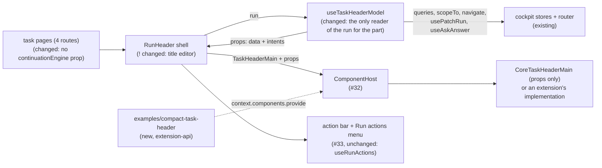

# Task Header Contract — the header's public model, with core's own header rendered from it alone

> Slug: `task-header-contract` · Status: **designed, awaiting implementation** · Epic 2 (Component
> Platform), item 11: "Create `task.header@1` contract". Builds on item 10:
> `2026-09-19-component-host.md` (the spec, #31), `ComponentHost` and `ComponentsProvider` (#32, on
> `main`), and the task header slot: `cezar.task.header.main@1`, `CoreTaskHeaderMain` and
> `RunHeader` as core's shell (#33). Also builds on `2026-09-19-component-contract-api.md`
> (capabilities, `layout`, the bump table). Delivery: two stacked PRs to `main`, touching
> `packages/extension-api` and `packages/web`.
>
> **Dependency check (2026-09-19, `main` at `441fa990`).** #33 was squash-merged into
> `feat/component-host` sixteen seconds after #32 had been squash-merged into `main`. Its changes
> (`core-components.ts` in both packages, `core-task-header-main.tsx`, `task-header-main.ts`, the
> `RunHeader` split, the AGENTS.md and README rows) are on `feat/component-host` (`930b6acf`), not
> on `main`. This spec is written against that code. Phase 1 starts once #33's changes reach `main`.

## 📝 TLDR

Item 10 makes the title and meta part of the task header replaceable
(`cezar.task.header.main@1`), but its contract is thin. The props hold the title, the raw status
and three meta facts. Core's own implementation, `CoreTaskHeaderMain`, reads the whole run record
and the engine picker through a core-only context (`TaskHeaderCoreContext`). An extension author
cannot build a real header from those props, and nothing shows that the contract is enough to
build one.

The proposal completes that contract so it becomes the header's **public model**, the brief's
`task.header@1`. It carries the task, its status as the task list shows it, the runner and model,
the PR and issue references with their live status, usage, and three intents (`onRename`,
`onResolveConflicts`, `onNavigate`). Core answers each intent with today's behavior. No query
client, mutation, router or private hook crosses the boundary. **Core's default then renders from
its props alone**, and the core-only context is deleted. A new example extension, which imports
nothing from `packages/web`, renders a header on the task page.

The brief also lists Continue, Stop and Archive. Since #33, AGENTS.md keeps the task's controls
outside every replaceable part and says a new part of the header "is its own contract, never a
wider `cezar.task.header.main`". This item follows that rule: the three actions stay core's,
unchanged. This spec records their model for the later `cezar.task.header.actions@1`. Q3 asks the
owner to confirm, or to choose another route. Q4 asks the same about Resolve conflicts, the one
task control #33 already put inside the part.

## Resolved assumptions (autonomous defaults)

The brief left these open. Each answer is the most reversible choice that meets the brief's
Definition of Done, and follows the repository's rules as #33 left them. Three rows are marked
⚠ NEEDS HUMAN CONFIRMATION: two touch the repository rule on task controls (the brief's actions,
and Resolve conflicts), and one changes a visible behavior on the default path. The spec PR stays
a draft until the owner confirms or overrides them.

| # | Question | Answer | Why | Status |
|---|---|---|---|---|
| Q1 | The brief bundles the contract, core's header moving onto it, and a proof in a separate package. Split into several specs? | **One spec, two phases, two stacked PRs.** Phase 1 completes the model and puts core's default on it. Phase 2 adds the example extension and the cockpit test that prove the Definition of Done. | The proof needs the complete model, and a contract that core's own header does not use proves nothing. Phase 2 touches the extension API's boundary and dependencies, which deserve their own review. | default, reversible |
| Q2 | The brief names `task.header@1`. Item 10 already serves `cezar.task.header.main@1` for the same box. A new contract, or the existing one? | **Complete `cezar.task.header.main@1`.** No second header contract. The brief's `task.header@1` is the illustrative name for this one, mapped to the repository's ids the way the owner's `task.title` became `shows-title` in item 10. Everything added is data or an intent for the part's own two rows (the title row and the meta row). | Two contracts for one box would compete for the same slot. AGENTS.md (since #33) forbids a *wider* `cezar.task.header.main`, meaning one that covers another part of the header, such as the actions or the tabs. It does not forbid giving the part the data its own rows already show. | default, reversible |
| Q3 | The brief lists Continue, Stop and Archive in the model. AGENTS.md (since #33, from the owner's Q4b) says: "Core keeps the task's controls (the actions, …) outside every replaceable part, so no replacement can take them away; a new replaceable part of the task header is its own contract, never a wider `cezar.task.header.main`." Do the actions join this contract? | **No. They stay core's, unchanged, in this item.** Their model is recorded in § API Contracts ("The actions model"): state `{ available, enabled, pending, reason? }`, `void` intents, core's confirmation before Stop, and one guard for every call. That model is the design input for `cezar.task.header.actions@1`, its own contract and its own item, as the rule requires. The other routes are listed in § Alternatives: (B) supersede the rule, with an optional `task-actions` capability on `cezar.task.header.main`; (C) build the `.actions` contract in this item. | The autonomous defaults may not override an active owner decision, and this one is now a repository rule, repeated in the extension API's README ("a replacement restyles the header, and can never take away control of a task"). Deferring is also the smallest scope, and it leaves working code alone. | ⚠ NEEDS HUMAN CONFIRMATION: the brief and AGENTS.md disagree, and only the owner can pick |
| Q4 | The part already renders one task control: **Resolve conflicts**, inside a conflicting PR chip. It sends the agent a prompt, and on a finished task it reopens the session (`useAskAnswer` in `resume` mode, the toast "Task reopened"). #33 moved it into `CoreTaskHeaderMain` with the rows, so today only core's default can offer it. Does it cross the contract, and how? | **Yes, as state plus an intent:** `resolveConflicts: { available, enabled, pending, reason? }` and `onResolveConflicts(prNumber)`, which returns nothing. Core runs the delivery, shows the toast and checks the state again on every call. AGENTS.md gets the rule's one exception in the same PR (step 5): an action on something the part itself shows. The deferred actions model uses the same shape. Alternative: keep it off the contract and give it a place in core's shell, for example "Resolve conflicts in #123" in the action bar and the Run actions menu, which moves it out of the chip. | Without the intent, core's default cannot offer the button from props (Q5), and every replacement drops it, as #33 already accepts. With command tokens or the delivery seam in the props, an implementation could skip core's checks. An intent keeps one behavior for every header, and the brief rules out exposing mutations. It is still a task control on a public contract, which the rule's current wording does not allow. | ⚠ NEEDS HUMAN CONFIRMATION: an exception to the AGENTS.md rule on task controls |
| Q5 | How strict is "core header uses only contract props"? | **Strict for task facts and actions.** `CoreTaskHeaderMain` reads no run record, query, query client, router, command or core-only context. `TaskHeaderCoreContext` and `useTaskHeaderCore` are deleted. It may use core's presentational UI kit: buttons, the pill, menus, the reference chip with an explicit look-up entry, `toast` and the clipboard. A render test proves it: the component renders with no `QueryClientProvider`, router, `CommandsProvider` or `ComponentsProvider` above it. An import boundary check backs this up. | A test can check that rule. A looser reading ("its top-level inputs are props") would let the core-only context back in under another name. | default, reversible |
| Q6 | Core's header part shows more than the brief lists: rename, reference chips with live status and **Resolve conflicts**, the automation link, tokens and cost, the account. What must the props carry so that core's default renders them from props? | **The facts, plus three intents. The rename editor stays core's.** Added to the props: `task.prompt` (the title's hover text), `attention` (the pill's words, tone, pulse and queue position), `engine` (runner, model, account, identity), `meta.diff.files` and `.repointed` (the diff chip's file count and #751 caveat), `meta.references` (with the forge's `status`, the look-up's `lookup` and `lookupReason`, and `conflicting`), `meta.automation` (with a project-scoped `href`), `meta.usage`, and `resolveConflicts`. The intents are `onRename()`, `onResolveConflicts(prNumber)` and `onNavigate(href)`. `onRename()` asks core to open its own title editor over the part, with its saved draft, so the draft store stays private. | Without these fields, core's default could not render today's rows (Q5), or the page would lose behaviors (Definition of Done 3). Each field is JSON that core already computes for the same rows, and each intent maps to an existing core behavior. A metric hidden by `CEZ_HIDE_TOKEN_METRICS` is left out of the props, so it never reaches an implementation. | default, reversible |
| Q7 | The agent badge's menu holds the Session tab's **Next continuation** picker, which reaches `CoreTaskHeaderMain` today as `continuationEngine`, a core `ReactNode` in the core-only context. The contract may not carry one (contract-api spec: "must not contain `ReactNode` slots"). What happens to it? | **It leaves the header.** The composer dock keeps the same picker, driven by the same hook (`useContinueAction`), so choosing the next engine still works and happens in one place. The badge keeps runner, account, model and identity. | Modelling the picker (runners, discovered models, accounts, a change callback) would add about six public fields for a second copy of a control that is already on screen. A `ReactNode` prop would bring back the side channel that Q5 removes. Alternative, if the owner prefers it: an `onChooseEngine()` intent that moves focus to the dock's picker. | ⚠ NEEDS HUMAN CONFIRMATION: removes a deliberate shortcut (the `task-thread.tsx` comment on `continuationEngine`) from the default page |
| Q8 | The new props are required. The README's bump table says "add a required prop → Yes". Stay at `@1`? | **Amend `@1` in place, with one gate: if a release ships `@1` before this lands, bump to `@2` instead.** The authority is the README's banner: the package is "Experimental and private", and "every host item may still revise these types in the PR that implements them". There are no implementations outside core either. `BUILTIN_EXTENSIONS` is empty, #33's `@1` is not on `main`, and no release carries it. Core's default changes in the same PR. If a built-in extension provides `TaskHeaderMain` by the time this lands, it is in-repo code and is updated in the same PR. | A `@2` right after an unreleased `@1` would only add a version for the resolver and every later reader to skip. Once `@1` ships, or an extension outside the repo can implement the contract, the bump table applies strictly. | default, reversible until `@1` ships |
| Q9 | How is "a header can be written in a separate package" proven? | **A second worked example: `packages/extension-api/examples/compact-task-header/`.** It imports only the extension API and `react`. A cockpit test activates it through the real extension registry and uses it on the task page. No new workspace. | `examples/hello-extension/` set this precedent, and `test/boundary.test.ts` already keeps examples away from `packages/web`. A sixth workspace would add a root workspace entry, a package manifest and an AGENTS.md layout row just to hold a fixture. The one widening is that examples may now import `react` as a value. `src/` stays type-only, and the README and AGENTS.md say so. `react` becomes an extension-api devDependency pinned to `packages/web`'s range, so the cockpit test loads one React. | default, reversible |

## 📝 Problem Statement

The brief asks for "the first production replaceable component contract", a minimal public model
cut out of today's task header, and names what it must not expose: the query client, mutations,
router internals or Cezar's private hooks. Item 10 built the machinery (#32: the host, the
fallback) and the first contract with its slot (#33), but stops short of the brief in two places:

- **The model is too thin to build a header from.** `TaskHeaderMainProps` holds the id, project,
  title, raw status, workflow, branch, diff and plan. It lacks the words and colour the status pill
  shows (`deriveAttention`), the runner and model, the references and the usage. An extension's
  header could not show "needs you", say which agent runs the task, or show its pull request.
- **Core's own header does not use the contract.** `CoreTaskHeaderMain({ plan })` takes only
  `plan` from its props. It reads everything else through `useTaskHeaderCore()`, the core-only
  context `RunHeader` puts around the host (`task-header-main.ts`). It then re-derives every fact
  from the `ApiRun`: `useConfig` for the default runner, `useAgentProfiles` for the account,
  `useRuns` for the queue position, `useHealth` for the token visibility,
  `ReferenceStatusProvider` for PR statuses, `usePatchRun` and `useDraft` for rename, and the
  project router's `Link` for the automation chip. Nothing shows that the props are enough, and
  nothing stops them from drifting behind what core's header shows. `task-header-main.test.tsx`
  even pins that `CoreTaskHeaderMain` "throws outside the shell's context".

The brief's third group, "actions: continue, stop, archive", meets a rule #33 added (Q3). The
actions stay core's here, and their model is recorded for the item that makes them replaceable.

The brief's Definition of Done, and where this item proves each point:

| Definition of Done | How this item meets it | Proven by |
|---|---|---|
| A header can be written in a separate package without imports from `packages/web`. | `TaskHeaderMainProps` carries the task, its status as the list shows it, the runner and model, the references and the usage. `examples/compact-task-header/` implements the contract importing only `@open-mercato/cezar-extension-api` and `react`. On the task page it shows the title, status, engine and pull request, while core's actions stay beside it. | `extension-api/test/boundary.test.ts`, `test/compact-task-header.test.ts`, `web/src/routes/task-thread/external-task-header.test.tsx` |
| Core's header uses only the contract's props. | `CoreTaskHeaderMain` takes every task fact and every intent from its props, and the core-only context is gone. | `core-task-header-main.test.tsx` (renders with no query client, router or command provider), `component-registry/boundary.test.ts` |
| Every required behavior still exists. | § UI/UX maps each of today's header behaviors to where it lives afterwards, and lists the three visible differences. The one removal is the badge's copy of the Next continuation picker, which stays in the dock (Q7). The actions are untouched (Q3). | `run-header.test.tsx`, `task-header-main.test.tsx`, `task-thread.test.tsx`, `follow-up-engine.test.tsx` |
| The contract exposes no query client, mutation, router internals or private hook. | Data props are JSON (`IsJson`). The only functions are three intents that return `void`. `onNavigate` takes only an `href` that core itself put in the props. | `packages/extension-api/test/core-components.test.ts`, `task-header-main.test.tsx` |

## 📝 Proposed Solution

1. **Complete the contract** (`packages/extension-api/src/core-components.ts`).
   `TaskHeaderMainProps` gains `attention`, `engine`, `resolveConflicts` and the three intents.
   `task` gains `prompt`, `meta` gains `references`, `automation` and `usage`, and `meta.diff`
   gains `files` and `repointed` (Q6). The id, version, capabilities and layout stay as #33 set
   them (Q8).
2. **One adapter reads the run.** #33's `useTaskHeaderMainProps` becomes `useTaskHeaderModel`
   (`routes/task-thread/task-header-main.ts`). It is the only code in the header part that reads
   the `ApiRun`, the queries, the delivery seam and the router. It returns the contract's props
   plus core's title editor. The data is frozen. The callbacks keep one identity and always act on
   the task the header shows now, because the header part is not remounted between tasks (the
   `detailsOpenByRun` comment in `core-task-header-main.tsx`). `TaskHeaderCoreContext` and
   `useTaskHeaderCore` are deleted.
3. **Core's default renders from its props** (`core-task-header-main.tsx`). The title row and meta
   row render as today, from props. The reference chips get their forge status, look-up state and
   conflict flag as props. The agent badge reads `engine`. The automation chip is an `<a>` with the
   scoped `href`, and a plain click calls `onNavigate`.
4. **Rename stays core's.** The pencil (in core's default, or in any implementation) calls
   `onRename()`. The shell then shows its title editor in the top 30 px of the part's box (the
   contract's `minBlockSize`, which every implementation is built around). The part stays mounted
   but hidden and `inert`, so the header keeps its height. Enter saves through `usePatchRun` and
   Escape cancels. The saved draft reopens the editor when the user comes back, as today.
5. **The actions do not move** (Q3). `useRunActions`, the desktop action bar and the Run actions
   menu beside the host stay as #33 left them.
6. **The proof (phase 2).** `packages/extension-api/examples/compact-task-header/` is a one-row
   header written against the package alone. A cockpit test activates it, prefers it and uses it.

### Prior art

- **Grafana panel plugins** receive `PanelProps`, which is data plus callbacks such as
  `onChangeTimeRange`, and never query a data source themselves. We take the same split: data and
  intents go in, and the host keeps the side effects.
- **VS Code** contributes a command together with an `enablement` and `when` clause, and the
  workbench decides whether its menu item shows and is enabled. `available`, `enabled` and `reason`
  are that split, computed by core rather than by an expression language.
- **Backstage** entity pages hand their cards a `useEntity()` hook. We skip that: a hook ties an
  implementation to the host's React tree and query layer, which the brief rules out.
- **Container and presentational components**, and "headless" UI kits: one adapter reads the
  stores, one view renders props. Core's default becomes the view, and the adapter is the only
  container.

### Alternatives considered

- **(Q3, route B) Supersede the rule: the actions join `cezar.task.header.main` through an
  optional `task-actions` capability.** An implementation that declares it would render Continue,
  Stop and Archive from `actions`. Core would then leave them out of its bar and show its Run
  actions menu (today `md:hidden`) at every width, where they stay available. The cost: a new
  `useHostedComponent(contract, subject)` in `component-host.tsx`, so the shell knows which
  implementation the host renders now. The capability would join the token in the same PR as that
  code. AGENTS.md's rule and the README's "can never take away control" sentence would change in
  the same PR. `mockup-04-q3-route-b.png` shows it. Not the default, because it overrides an owner
  decision that #33 made a repository rule.
- **(Q3, route C) Build `cezar.task.header.actions@1` in this item.** This is the rule's route, but
  its design is not settled. Its host would sit inside the desktop action bar. It would pull
  Continue, Archive and Cancel out from among Finish, Open in, Notes, Mark unread, Pin and Delete
  into one group, which reorders the bar. It also cannot put items into the
  phone menu, a Radix menu that only core's components can fill. That is its own design problem, so
  it gets its own item. This spec's actions model is its input.
- **Put command tokens in the props** (Q4). Rejected. An implementation could skip core's checks.
- **Give core's default a narrower context for the rich widgets** (Q5). Rejected. That is the same
  side channel, under another name, and the Definition of Done forbids it.
- **Let implementations render their own title editor** through a `titleEdit` prop (draft, change,
  save, cancel). Rejected. It adds four public fields, and a saved draft would disappear under any
  implementation that ignores them. Core's editor works under every implementation.
- **Model the Next continuation picker as props** (Q7). Rejected, for its size and because the
  dock already shows the picker.
- **A new workspace for the proof** (Q9). Rejected. An example in `extension-api/examples/` gives
  the same proof without touching the root manifest.

## 📝 Architecture



- **Changed in `packages/extension-api`:** `src/core-components.ts` (the props), `README.md`
  ("The task header's main part": its props, the intents and what core does for each),
  `test/core-components.test.ts`, `test/boundary.test.ts` (examples may import `react`),
  `package.json` (`react` as a devDependency, for the example).
- **New in `packages/extension-api`:** `examples/compact-task-header/index.ts` and
  `test/compact-task-header.test.ts`.
- **Changed in `packages/web/src/routes/task-thread/`:** `task-header-main.ts`
  (`useTaskHeaderModel`, the context removed), `core-task-header-main.tsx` (props only),
  `run-header.tsx` (the title editor, no context provider, no `continuationEngine`),
  `task-thread.tsx` (no `continuationEngine`), `task-header-main.test.tsx`, `run-header.test.tsx`.
- **Changed elsewhere in `packages/web`:** `component-registry/boundary.ts` (a second scan: what
  core's defaults may import), `components/reference-status.tsx` (its publish-and-look-up becomes a
  hook the provider uses too), `components/reference-chip.tsx` (it takes an explicit look-up entry,
  with status, state and reason as strings, beside today's explicit `conflicting`, and reads an
  unknown status as none, as it already does).
- **New tests:** `core-task-header-main.test.tsx`, `external-task-header.test.tsx`.
- **Not touched:** `useRunActions` and the three task actions, the host, the provider, the
  registry, the resolver, the command handlers, the event bus, the HTTP contract, the service and
  the api-client. No `BACKWARD_COMPATIBILITY.md` surface moves.

In short, the run is read in one place, the header part renders a model, and the model is the
contract.

## 📝 Data Model

Nothing is persisted. The title editor's state moves from `EditableTitle` in
`core-task-header-main.tsx` to the shell, with the same saved draft (`useDraft(taskId, 'title')`).
The component provider's failure record (#32) is untouched.

## 📝 API Contracts

Signatures are normative. They extend #33's `core-components.ts`, and anything not repeated here is
unchanged.

### `packages/extension-api/src/core-components.ts` (public, completed)

```ts
/** The task a header shows. JSON. */
export interface TaskHeaderTask {
  readonly taskId: string
  /** The registered project that owns the task. Pass it as `TaskRef.projectId`. */
  readonly projectId: string
  /** The title the cockpit shows for the task: the user's, or the generated one. */
  readonly title: string
  /** The text the task was started with. Core shows it when the pointer rests on the title. */
  readonly prompt: string
  /** `queued`, `running`, `waiting`, `review`, `done`, `failed` or `cancelled` today (the union may grow). */
  readonly status: string
}

/** How the status reads: the words, colour and motion of the task list's dot. JSON. */
export interface TaskHeaderAttention {
  /** A lower-case phrase, e.g. `running`, `needs you`, `queued`. */
  readonly label: string
  /** `success`, `pending`, `danger`, `violet` or `neutral` today. The set may grow: read an unknown tone as `neutral`. */
  readonly tone: string
  /** True while the task is changing state. */
  readonly pulse: boolean
  /** The 1-based place in the project's queue, for a queued task. */
  readonly queuePosition?: number
}

/** The agent the task runs on. JSON. */
export interface TaskHeaderEngine {
  /** `claude`, `codex`, `opencode`, …: the task's runner, or the project's default when the task named none. */
  readonly runner: string
  /** The model the task asked for, or `auto` when the runner picks. */
  readonly model: string
  /** The account the last agent step ran under, when one was recorded. A removed account reads `<id> (removed)`. */
  readonly account?: string
  /** The `provider/model` the run resolved to, when it differs from `model`. */
  readonly identity?: string
}

/** A pull request or issue the task points at. JSON. */
export interface TaskHeaderReference {
  readonly kind: 'pr' | 'issue'
  readonly number?: number
  /** An http(s) URL, when one is known. */
  readonly url?: string
  /**
   * The forge's last known answer about it: `draft`, `review-required`, `changes-requested`,
   * `checks-pending`, `checks-failing`, `ready`, `merged`, `closed`, `open`, `completed` or
   * `not-planned` today. The set may grow: read an unknown value as absent. Absent: nothing known.
   */
  readonly status?: string
  /**
   * How the look-up behind `status` stands: `loading`, `ready`, `unknown` (the forge has no such
   * number) or `unavailable` (the forge could not be reached, so `status` is only the last known
   * answer). Absent: nothing asked, e.g. a reference without a number.
   */
  readonly lookup?: string
  /** Why the look-up is `unavailable`, in words for the user. */
  readonly lookupReason?: string
  /** `true` when the pull request has merge conflicts. Absent means unknown, never "clean". */
  readonly conflicting?: boolean
}

/** The basic facts core's header shows under the title. JSON. */
export interface TaskHeaderMeta {
  /** The workflow's display name, e.g. `quick-task`. */
  readonly workflow: string
  /** The task's branch, once it has one. */
  readonly branch?: string
  /**
   * Lines added and removed on the task's branch, and the number of files, once known.
   * `repointed`: measured against another branch the agent checked out into the task's worktree
   * (#751), so the numbers count only what the task did to it.
   */
  readonly diff?: { readonly added: number; readonly removed: number; readonly files: number; readonly repointed?: boolean }
  /** Every pull request, then the issue, in the order the Tasks table shows them. */
  readonly references?: readonly TaskHeaderReference[]
  /** The automation that launched the task. `href` (a project-scoped cockpit path) is set while the automations page is available. */
  readonly automation?: { readonly automationId: string; readonly href?: string }
  /** The usage this server shows. A metric the server hides (`CEZ_HIDE_TOKEN_METRICS`) is absent. */
  readonly usage?: { readonly inputTokens?: number; readonly outputTokens?: number; readonly costUsd?: number }
}

/** Whether an action is offered, and whether it can run now. JSON. */
export interface TaskHeaderActionState {
  /** The task's state allows the action: render its control. */
  readonly available: boolean
  /** It can run now. `false` while `pending`, or for the `reason` given. */
  readonly enabled: boolean
  /** A request for it is in flight. */
  readonly pending: boolean
  /** Why it cannot run, in words for the user. */
  readonly reason?: string
}

export interface TaskHeaderMainProps {
  readonly task: TaskHeaderTask
  readonly attention: TaskHeaderAttention
  readonly engine: TaskHeaderEngine
  readonly meta: TaskHeaderMeta
  /** Plan progress, on the Session tab of a task that has a plan. */
  readonly plan?: { readonly done: number; readonly total: number }
  /**
   * Asking the task's agent to resolve a pull request's merge conflicts. `available` when a numbered
   * reference is `conflicting` (offer it on that reference's chip, as core does). `enabled` is
   * `false` while the delivery is blocked, with its words as `reason`, and while `pending`.
   */
  readonly resolveConflicts: TaskHeaderActionState
  /** The user asked to rename the task. Core shows its title editor over this part until they save or cancel. */
  readonly onRename: () => void
  /** The user asked the agent to resolve conflicts in pull request `prNumber`, a `conflicting` reference. */
  readonly onResolveConflicts: (prNumber: number) => void
  /** The user followed an in-app link from these props (`meta.automation.href`). */
  readonly onNavigate: (href: string) => void
}

/**
 * The presentational part of the task header, and the header's public model: the task, its status,
 * its engine and its facts. Core renders the task's actions, tabs, monitoring and dispatch lines
 * and step rail around it, so an implementation neither provides nor can remove them. The one
 * action inside this part is Resolve conflicts, on a pull request the part itself shows: it
 * crosses as `resolveConflicts` and `onResolveConflicts`.
 * - `shows-title` (required): shows `task.title`.
 * - `shows-status` (required): shows the task's status. `task.status` is the raw value, and
 *   `attention` says how core words and colours it.
 * - `shows-meta` (optional): shows `meta` and `engine`. The picker says which implementations do.
 * - Intents: core acts on `onResolveConflicts` only while `resolveConflicts` is `available` and
 *   `enabled` (which also rules out a repeat while it is `pending`), and only for a `conflicting`
 *   reference's number. `onNavigate` acts only on an `href` from these props.
 * - Layout: 30 CSS pixels (one title row) are reserved while an implementation loads, fails or
 *   is swapped. Core's title editor covers this band while the user renames. The shell around it
 *   is sticky; this part is not.
 */
export const TaskHeaderMain = defineComponentContract<TaskHeaderMainProps>('cezar.task.header.main', {
  version: 1,
  requiredCapabilities: ['shows-title', 'shows-status'],
  optionalCapabilities: ['shows-meta'],
  layout: { minBlockSize: 30 },
})
```

What core does for each intent, and so what the words promise to an implementation:

| Intent | Core's answer |
|---|---|
| `onRename()` | Opens core's title editor over the part, holding the saved draft if there is one. |
| `onResolveConflicts(n)` | When `resolveConflicts` is available and enabled and `n` is the number of a reference with `conflicting: true`, sends `resolveConflictsPrompt(n)` through the task's delivery seam (`useAskAnswer`), with today's toasts. A reference known only by URL is never conflicting (the look-up needs a number), so it never qualifies, as in core's own chip today. |
| `onNavigate(href)` | Navigates within the cockpit when `href` is one that core put into these props. Any other value does nothing, and one `[cezar:extensions]` warning is logged per value per page load. |

### `packages/web/src/routes/task-thread/task-header-main.ts` (changed)

```ts
export interface TaskHeaderModel {
  /**
   * The contract's props. The data is frozen, and recomputed only when one of its inputs changes:
   * the run, the plan tally, the active project, the queue, health, the config's default runner,
   * the account list, a reference's look-up, or the delivery state behind `resolveConflicts`
   * (pending, blocked, provider). The callbacks keep one
   * identity for the life of the header, and each call reads the latest run and state through a
   * ref, so after a switch from task A to task B (the part is not remounted) it acts on B.
   */
  readonly props: TaskHeaderMainProps
  /** Core's title editor: today's `useTitleEditor` with the saved draft (`useDraft(taskId, 'title')`) and `usePatchRun`. */
  readonly titleEditor: TitleEditor
}

/** The only reader of the run for the header's replaceable part. Replaces `useTaskHeaderMainProps`. */
export function useTaskHeaderModel(
  run: ApiRun,
  options?: { readonly planTally?: { done: number; total: number } },
): TaskHeaderModel
```

The fields come from the helpers that feed today's rows, so there is one rule per fact: `runTitle`,
`deriveAttention`, `queuePositions` over `useRuns`, `workflowLabel`,
`taskReferences`/`taskPrUrl`/`taskIssueUrl` with `useProjectRepoBase`, the reference look-up that
`ReferenceStatusProvider` uses, `usageMetricVisibility(useHealth())`, and the `AgentBadge`
resolution (`useConfig().defaultRunner`, the last step's `profileId`, `useAgentProfiles`,
`modelIdentity`). `task.projectId` stays `useActiveProjectId() ?? ''`, as #33 has it. The
automation's `href` is `scopeTo(useActiveProjectId(), '/automations/<encodeURIComponent(id)>/log')`
(`@/lib/project-router`), which is the path the scope-aware `Link` produces today. A `null` scope
leaves the path flat, as `Link` does in a bare test render (`run-header.test.tsx` asserts
`/automations/a-1/log` at `/tasks/r1`). It must not be scoped with the `''` fallback, which would
produce `/p//automations/…`. The `href` is set only while `capabilities.automations` is on. A raw
`<a href>` must carry the project prefix itself, or a middle-click on a task from a non-boot
project would open the boot project's page.

### The actions model, for `cezar.task.header.actions@1` (not built in this item)

Recorded so that the item that makes the actions replaceable, or Q3 route B, starts from a reviewed
design. Nothing here is implemented in this item.

```ts
export interface TaskHeaderActions {
  /** Reopen the task's last agent session. */
  readonly continue: TaskHeaderActionState
  /** Stop an active task. Core labels it **Cancel** and asks the user to confirm. */
  readonly stop: TaskHeaderActionState
  /** Archive the task, or restore it when it is archived (a `task.archived` field would join `TaskHeaderTask`). */
  readonly archive: TaskHeaderActionState
}
// Intents: onContinue(): void, onStop(): void, onArchive(): void
```

- Each intent acts only while its action is `available` and `enabled`. Otherwise the call does
  nothing, a repeat while `pending` included.
- `onContinue()` executes `cezar.task.continue` with `{ taskId }`, plus `runner` when the task's
  runner is not connected (`useContinuationProvider`).
- `onStop()` opens core's "Cancel this task?" confirmation, and only **Cancel the run** executes
  `cezar.task.stop`.
- `onArchive()` executes `cezar.task.archive` with `archived: !archived`.
- `available` comes from `runActionFlags`. `enabled` is `false` while pending, and for Continue
  without a usable provider, with the provider's words as `reason`.
- Whatever renders the rest, core keeps every action within reach: in the desktop bar, and on
  phones in the Run actions menu (`md:hidden` today).

### `packages/extension-api/examples/compact-task-header/index.ts` (new)

```ts
import { createElement as h } from 'react'
import { defineExtension, TaskHeaderMain, type ComponentProps } from '@open-mercato/cezar-extension-api'

/** One row: title · status · runner/model · the pull request's number and status. */
function CompactTaskHeader(props: ComponentProps<typeof TaskHeaderMain>) { /* h('div', …) */ }

export default defineExtension({
  manifest: { id: 'example.compact-header', name: 'Compact task header', version: '1.0.0', engines: { cezar: '>=<the release that ships this>' } },
  activate(context) {
    context.components.provide(TaskHeaderMain, {
      id: 'example.compact-header.row',
      title: 'Compact row',
      // Not `shows-meta`: the row shows the engine and the pull request, not the workflow, branch,
      // diff or usage.
      capabilities: ['shows-title', 'shows-status'],
      component: CompactTaskHeader,
    })
  },
})
```

It is a `.ts` file using `createElement`, so the boundary scanner (which reads `.ts` files) covers it
and the package needs no JSX setting.

## 📝 UI/UX

**The default page stays as it is, with the three exceptions listed after the table.** Core's
default keeps today's markup. The shell keeps its desktop action bar, and the phone Run actions menu
stays beside the host as #33 placed it.

Where each of today's header behaviors lives after this item:

| Behavior today | After this item |
|---|---|
| Title, full prompt on hover | Core's default, from `task.title` and `task.prompt` |
| Rename (pencil, inline editor, draft kept across navigation) | The pencil calls `onRename()`. Core's editor opens over the part, and the draft behaves as today |
| Plan mirror (desktop) | Core's default, from `plan` |
| Status pill with queue position (`queued #2`) | Core's default, from `attention` |
| Phone-width details toggle | Core's default, as its own state, keyed by `task.taskId` |
| Workflow, branch chip (copy), diff with its file count and the #751 `repointed` caveat | Core's default, from `meta` |
| PR chips with live status, their tooltips ("Checking GitHub…", "Status unavailable", "last known — GitHub is unreachable"), conflict warning, **Resolve conflicts** | Core's default, from `meta.references` (`status`, `lookup`, `lookupReason`, `conflicting`) and `resolveConflicts`, calling `onResolveConflicts` |
| PR link without a number, issue chip | Core's default, from `meta.references` |
| Automation chip (a link while automations are on) | Core's default, from `meta.automation`, calling `onNavigate` on a plain click. Ctrl- or middle-click still opens a new tab through the scoped `href` |
| Tokens and cost (hidden per `CEZ_HIDE_TOKEN_METRICS`) | Core's default, from `meta.usage` |
| Agent badge: runner · account · model, identity in its menu | Core's default, from `engine` |
| Next continuation picker in the badge menu (Session tab) | **Removed from the header.** The dock keeps it (Q7, ⚠) |
| Continue, Cancel, Archive, Finish, Open in / Terminal, Notes, Mark unread, Pin, Delete | Shell, unchanged (Q3) |

The three visible differences on the default page:

1. **The badge menu loses its Next continuation section** (Q7, ⚠). Runner, account, model and
   identity stay. The dock below the thread keeps the picker.
2. **While renaming**, core's editor fills the top 30 px of the part's box (its `minBlockSize`),
   and the rest of the part is hidden until the user saves or cancels. That includes the live
   status pill and the meta row. Today only the title turns into the input. The header keeps its
   height, and core's actions stay usable (the desktop bar, and the Run actions menu on phones).
3. **Resolve conflicts closes its card when the request settles, whether it worked or not.** The
   intent returns nothing, so the chip cannot tell success from failure. The toast still says which
   happened, in the server's words on failure. Today the card stays open after a failure.

With an extension's implementation (tests and the example only, until the picker item stores a
choice), the part shows whatever that implementation renders, and core's actions, tabs and Run
actions menu stay exactly where they are.

Accessibility: an implementation's controls are its own. The title editor keeps today's input and
keyboard handling. While the editor is open, the hidden part is `inert`, so focus cannot reach it.

Prototype: `.ai/specs/assets/task-header-contract/`.
- `current-01-task-header.png` is today's desktop task page and `current-02-phone-actions-menu.png`
  is the phone header with the Run actions menu open. Both were captured by #33's QA on its merged
  code (the `qa-evidence-pr-33` branch).
- `mockup-01-extension-header.png` shows the compact example header, with core's bar beside it.
- `mockup-02-badge-menu.png` shows the badge menu today and as proposed (Q7).
- `mockup-03-renaming.png` shows core's editor over the part.
- `mockup-04-q3-route-b.png` shows Q3's route B, which is not the default: an implementation owning
  the three actions, with the Run actions menu visible at desktop width.

The `.html` sources sit beside them. The dashed outline marks the host's box.

## 📝 Edge Cases & Failure Scenarios

- **An implementation calls an intent at the wrong time** (Resolve conflicts twice, for a
  reference that is not conflicting, or while the delivery is blocked). Core checks the state first
  and ignores the call, so nothing is sent. An implementation can never do more than the user could
  with core's own chip.
- **`onNavigate` with a foreign or crafted value** (`javascript:…`, `//evil`, another task's URL).
  It is ignored, because only an `href` that core put into these props navigates, and one
  `[cezar:extensions]` line is written per value.
- **A metric hidden by the server.** `meta.usage` leaves it out, so no implementation can show it,
  and `CEZ_HIDE_TOKEN_METRICS` keeps its "everywhere" meaning (spec `2026-07-28-hide-token-metrics`).
- **A reference status, look-up state or tone this bundle does not know.** It reaches
  implementations as a string. Core's chip already treats an unknown status as none. Core's pill
  does not handle an unknown tone today: `Pill`'s `dot` is typed `StatusDotTone`, and an unknown
  value would get no colour class, so the dot would vanish. Core's default therefore maps an
  unknown tone to `neutral` before it reaches `Pill` (new in step 3, with a test).
- **The user moves from task A to task B.** The part is not remounted (the `detailsOpenByRun`
  comment in `core-task-header-main.tsx`). The callbacks keep their identity but read the latest
  run through a ref, so a click on B's header never acts on A.
- **A removed account.** `engine.account` reads `<id> (removed)`, as the badge does today.
- **A long prompt.** `task.prompt` is the same string the record holds. Implementations should
  truncate it, and core's hover title shows it as today.
- **An implementation mutates its props.** Every data object is frozen, so in strict-mode code the
  write throws and counts as a render failure (#32's fallback). The callbacks keep one identity, so
  a memoized implementation does not re-render because of them.
- **The Changes, Commits and Files tabs.** They render the same shell and model. `plan` is absent
  there as today, and nothing else differs.
- **A saved title draft under an extension's implementation.** The shell opens its editor over the
  part, whatever the part is, so the draft is never stranded.
- **Core's default throws.** #32's inline alert with **Try again** takes the box, as today. Core's
  actions stay usable around it (#33).

## 📝 Risks & Impact Review

- **The public surface grows, and stays.** `cezar.task.header.main@1` gains four data interfaces
  (`TaskHeaderAttention`, `TaskHeaderEngine`, `TaskHeaderReference`, `TaskHeaderActionState`),
  new fields on `task` and `meta`, and three intents. Once an extension outside the repository
  implements it, removing or narrowing any of them means `@2`. Everything added is something core's
  own rows already show (Q6).
- **Task content reaches extension code.** The prompt, branch, references, account label, model
  identity and usage join the title that item 10 (Q4a, owner) already allowed. Extensions are
  compiled in and trusted (item 10 § Prior art), hidden usage metrics stay hidden, and no credential
  or file content is in the props.
- **A task control on a public contract (Q4, ⚠).** Resolve conflicts can reopen a finished task.
  An implementation can call the intent only when the user could press core's own button, but the
  rule on task controls gains an exception, and the owner decides whether it may.
- **The brief is only partly delivered (Q3, ⚠).** Continue, Stop and Archive are not in the public
  model. They wait for `cezar.task.header.actions@1`, or for the owner to choose route B.
- **A visible shortcut goes away (Q7, ⚠).** The badge's picker copy was a deliberate addition. If
  the owner keeps it, the fallback is an `onChooseEngine()` intent that moves focus to the dock's
  picker: one more public callback and a focus handle in `follow-up-engine.tsx`. Either answer fits
  into phase 1 without changing the rest of it.
- **Moving working code, again.** #33 moved the rows into `CoreTaskHeaderMain` unchanged; this item
  changes how they get their data. Rename moves to the shell, and the badge and chips stop reading
  queries. AGENTS.md § Changing a mechanism that already works applies: `run-header.test.tsx` must
  pass, with only its harness's `continuationEngine` argument and the badge picker assertions
  changed. The adapter's per-field tests pin each
  derivation to the helper it used before.
- **Amending `@1` (Q8).** It is right only while `@1` is unreleased and no external implementation
  exists. The implementing PR checks both: whether a release tag contains #33's `core-components.ts`,
  and whether `BUILTIN_EXTENSIONS` has a `TaskHeaderMain` provider. If a release already ships `@1`,
  this item becomes `@2`.
- **The dependency on #33 reaching `main`.** Until it does, phase 1 has no code to change on
  `main`. A PR that brings `feat/component-host` into `main` comes first. That PR is not part of
  this spec.
- **Rollback.** Revert phase 2, then phase 1. Nothing is persisted, the HTTP contract and commands
  do not change, and the extension API is private.

## 📋 Phasing

1. **Phase 1: The model** (its own PR, once #33's changes are on `main`). Complete the contract,
   add the adapter, put core's default on props only, and move rename to core's editor. The badge's
   picker copy goes (Q7). The actions do not move. Waits on Q7.
2. **Phase 2: The proof** (stacked on phase 1). The compact example, the cockpit test that uses
   it, and the documentation of the widened example boundary.

If the owner chooses Q3's route B, phase 2 grows by the `task-actions` capability,
`useHostedComponent`, the shell code that honours it, and the AGENTS.md and README rule change, all
in one PR (§ Alternatives). If they choose route C, the actions contract gets its own spec, starting
from § The actions model.

## 📋 Implementation Plan

Every step keeps the validation gate in `.ai/agentic.config.json` green: typecheck, `npm test`,
`test:unit`, `build` and `test:package`.

### Phase 1: The model

1. **The contract** (`packages/extension-api/src/core-components.ts`), per § API Contracts. The
   README's "The task header's main part" section lists the new props, the intents and what core
   does for each.
   *Tests* (`test/core-components.test.ts`):
   - the token is unchanged, and frozen;
   - `IsJson<Omit<TaskHeaderMainProps, 'onRename' | 'onResolveConflicts' | 'onNavigate'>>`;
   - a type test showing that the three intents are the only function-typed props and all return
     `void`;
   - `test/surface.test.ts` is unchanged (no new runtime export).

2. **The adapter** (`task-header-main.ts`: `useTaskHeaderModel` replaces `useTaskHeaderMainProps`;
   `TaskHeaderCoreContext` and `useTaskHeaderCore` are deleted; `reference-status.tsx`: the look-up
   as a hook the provider also uses).
   *Tests* (`task-header-main.test.tsx`, extending #33's):
   - each data field matches the helper that feeds today's rows: title and prompt, attention and
     queue position, workflow, branch, the diff with its file count and `repointed`, references in
     the Tasks table's order (including a PR known only by URL, and an issue from the `CEZ:ISSUE`
     marker) with their status, look-up state and reason, and usage without each metric the health
     response hides;
   - `projectId` keeps #33's cases (the boot project's URL with a `null` scope context, and a scope
     context);
   - the automation `href` is set only while automations are on, and is project-scoped: under
     `/p/<non-boot>/tasks/…` it is `/p/<non-boot>/automations/<id>/log`, and in a render with no
     scope it stays `/automations/<id>/log`;
   - `engine`: the runner falls back to the project's `defaultRunner`, the model to `auto`, the
     account comes from the last step with a `profileId` (and reads `<id> (removed)` for a
     deleted one), and `identity` is absent when it repeats `model`;
   - `resolveConflicts.available` is `true` exactly when a numbered reference is `conflicting`, and
     `false` with none, or with only a PR known by URL;
   - `resolveConflicts` is disabled with the delivery's words while the delivery is blocked, and
     while pending;
   - `onResolveConflicts(n)` sends `resolveConflictsPrompt(n)` once, and does nothing while not
     available, while not enabled, while pending, or for a number that is not a `conflicting`
     reference;
   - `onNavigate` navigates for the automation `href` and ignores any other value, with one
     warning per value;
   - `onRename` opens the title editor;
   - the data is frozen and referentially stable while its inputs are unchanged, and a new queue
     position, reference look-up, default runner or delivery state produces new data for the same
     run. In particular, `resolveConflicts.pending` going from `true` to `false` produces new props,
     which is what closes the chip's card (step 3);
   - the three callbacks keep their identity across renders, and after a re-render with a second
     run (no remount) they act on the second run.

3. **Core's default on props only** (`core-task-header-main.tsx`; `reference-chip.tsx` takes an
   explicit look-up entry; `component-registry/boundary.ts` gains the second scan). The badge reads
   `engine` and has no picker section. The chips take `status`, `lookup`, `lookupReason` and
   `conflicting` from the props. Their conflict action is a button that calls
   `onResolveConflicts(n)` and closes the card when `resolveConflicts` stops being pending. The
   diff renders through `DiffStatLabel` from `meta.diff`.
   *Tests:*
   - `core-task-header-main.test.tsx` renders fixture props with **no** `QueryClientProvider`,
     router, `CommandsProvider` or `ComponentsProvider`, and shows: the title with the prompt as its
     hover text, the pill's label and queue position, the plan mirror, workflow, branch, the PR
     chips' status and conflict warning, their "Checking GitHub…" and "last known — GitHub is
     unreachable" tooltips, the issue chip, the diff with "across N files" and the `repointed`
     caveat (`data-repointed`, `aria-label`), usage (and no usage when absent), the automation
     link, and the badge summary and menu;
   - the pencil calls `onRename`, **Resolve conflicts** calls `onResolveConflicts(n)`, a plain
     click on the automation link calls `onNavigate(href)`, and a modified click does not;
   - an `attention.tone` of `'mauve'` renders the pill with the neutral dot;
   - #33's "throws outside the shell's context" test is replaced by the provider-less render above;
   - `component-registry/boundary.test.ts`: the new scan (through `lib/import-scan.ts`) fails when
     a core default has a value import (static, re-export or dynamic) from `@/api/`,
     `@tanstack/react-query`, `@/lib/project-router`, `react-router`, `@/commands/`,
     `@open-mercato/cezar-api-client`, `./task-header-main`, `./run-header`, `./thread-draft` or
     `./continuation-provider`. Like the existing scan (`boundary.ts`), it ignores `import type`,
     which is erased at run time. The provider-less render test above catches any reach at run
     time. The scan shows that it catches an alias, a relative path and a dynamic import;
   - `core-components.test.ts` still finds core's default compatible, with `capabilities` of
     `['shows-title', 'shows-status', 'shows-meta']`.

4. **The shell on the model** (`run-header.tsx`, `task-thread.tsx`). The host gets `model.props`,
   and the context provider goes. The title editor covers the part's top band while
   `titleEditor.editing`. `RunHeader` loses `continuationEngine` (prop and comparator), and
   `task-thread.tsx` stops passing it. `useRunActions` does not change.
   *Tests:*
   - `run-header.test.tsx` passes. Its `renderHeader` harness stops passing `continuationEngine`,
     and the badge picker assertions are replaced by "the badge menu has no Next continuation
     section". Everything else, the flat automation `href` included, stays as it is;
   - the dock still offers the picker (`follow-up-engine.test.tsx`, `task-thread.test.tsx`);
   - the meta row still shows the diff with its file count and caveat (the existing meta test does
     not check it, so this assertion is new);
   - rename: the pencil opens the editor in the box's top 30 px, the part is `inert`, Enter saves
     through the patch, Escape restores the part, and a saved draft opens the editor on mount;
   - #33's "RunHeader with an extension's implementation" test still finds the actions and the
     tabs, and now also finds the editor over that implementation after `onRename`.

5. **AGENTS.md**, the "Component implementations" routing row:
   - core's default of a contract renders from its props alone, and `useTaskHeaderModel` is the
     only reader of the run for the header's replaceable part;
   - the sentence "Core keeps the task's controls (the actions, the tabs, …) outside every
     replaceable part" gains its one exception, stated in the row: an action on something the part
     itself shows (Resolve conflicts on a PR chip) may sit inside the part. It crosses the contract
     as state plus a `void` intent, never as a command token or a mutation, and core checks the
     state again on every call. The README's "can never take away control of a task" gets the same
     exception;
   - `onNavigate` accepts only an `href` that core itself put into the props.

### Phase 2: The proof

6. **The example** (`examples/compact-task-header/index.ts`; `react` as an extension-api
   devDependency pinned to `packages/web`'s range, so the cockpit test loads a single React; the
   boundary test lets examples import `react`, while `src/` stays type-only).
   *Tests:*
   - `test/compact-task-header.test.ts` activates it with `createFakeContext`, checks that it
     provides `example.compact-header.row` against `cezar.task.header.main@1`, and that
     `checkComponentCompatibility(TaskHeaderMain, impl).capabilities` is
     `['shows-title', 'shows-status']`;
   - `test/boundary.test.ts`: examples import only the package and `react`, and a value import of
     `react` in `src/` still fails.

7. **The proof on the task page** (`routes/task-thread/external-task-header.test.tsx`).
   Import the example through a test-only relative path (AGENTS.md: "ugly on purpose"), activate it
   through the extension registry the way `main.tsx` does, and prefer it through `ComponentsProvider`.
   *Tests:*
   - `ThreadView` with a fixture run renders the example's row
     (`data-component="example.compact-header.row"`) with the title, the status label,
     `runner · model` and the pull request's number and status;
   - core's action bar, tabs and Run actions menu are still there, and Continue still executes
     `cezar.task.continue`;
   - a saved title draft opens core's editor over the example's row.

8. **The README and AGENTS.md** name the second example as the worked example for a core contract,
   and record the one widening of the boundary:
   - the README's rule 2 ("React is referenced through `import type` only") is scoped to `src/`;
   - "Writing an extension" says the examples import only this package and `react`, instead of
     "it imports only this package";
   - rule 4 (never import the cockpit, the service or their contract; enforced for `src/` and
     `examples/`) does not change;
   - the AGENTS.md extension-api row's "React through `import type` only" is scoped to `src/`.
