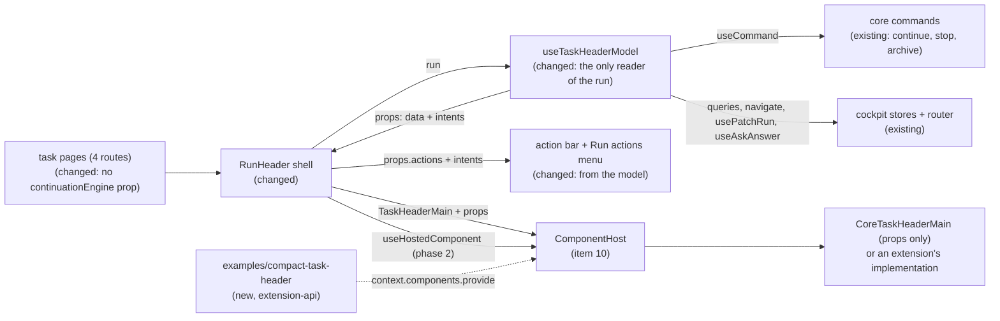

# Task Header Contract — the header's public model, with core's own header rendered from it alone

> Slug: `task-header-contract` · Status: **designed, awaiting implementation** · Epic 2 (Component
> Platform), item 11: "Create `task.header@1` contract". Builds on
> `2026-09-19-component-host.md` (item 10: `ComponentHost`, the `RunHeader` split and
> `cezar.task.header.main@1`, #31/#32), `2026-09-19-component-contract-api.md` (capabilities,
> `layout`, the bump table) and `2026-09-19-migrate-task-actions-to-command-api.md` (the
> `cezar.task.continue`, `.stop` and `.archive` commands). **Starts after item 10's phase 2 has
> merged.** Delivery: two stacked PRs to `main`, touching `packages/extension-api` and
> `packages/web`.

## 📝 TLDR

Item 10 makes the title and meta part of the task header replaceable
(`cezar.task.header.main@1`), but its contract is thin. The props hold the title, the status and
three meta facts. Core's own implementation still reads the whole run record through a core-only
context. An extension author cannot build a real header from those props, and nothing shows that
the contract is enough to build one.

The proposal completes that contract so it becomes the header's **public model**, the brief's
`task.header@1`. It carries the task and its status as the task list shows it, the runner and
model, and the state of Continue, Stop and Archive: whether each is offered, whether it can run
now, and why not. Actions are **intents**: `onContinue()`, `onStop()`, `onArchive()`. Core
answers each one with the same command, confirmation and toast as today. No query client,
mutation, router or private hook crosses the boundary. **Core's default then renders from its
props alone**, and a new example extension, which imports nothing from `packages/web`, renders a
working header on the task page. An implementation may take over the three actions through the
optional capability `task-actions`. Core's own header does not, so the default page keeps
today's layout.

## Resolved assumptions (autonomous defaults)

The brief left these open. Each answer is the most reversible choice that meets the brief's
Definition of Done. Two rows are marked ⚠ NEEDS HUMAN CONFIRMATION: they change an owner
decision or a visible behavior on the default path, and the spec PR stays a draft until the owner
confirms or overrides them.

| # | Question | Answer | Why | Status |
|---|---|---|---|---|
| Q1 | The brief bundles the contract, core's header moving onto it, and a proof in a separate package. Split into several specs? | **One spec, two phases, two stacked PRs.** Phase 1 completes the model and puts core's default on it. Phase 2 adds the `task-actions` takeover and the example extension that proves the Definition of Done. Each phase waits on one decision only: phase 1 on Q7, phase 2 on Q3. If the owner rejects Q3, phase 2 shrinks to the proof: the example shows title, status and engine, and the actions stay core's. | None of them works alone. A contract that core's header does not use proves nothing, and the proof needs the complete model. The takeover could be its own spec (item 10 named a deferred `.actions` part), but the brief puts the actions in this contract. Keeping it as a phase with a fallback shape gives the owner the same choice without a second spec. | default, reversible |
| Q2 | The brief names `task.header@1`. Item 10 already declares `cezar.task.header.main@1` for the same box. A new contract, or the existing one? | **Complete `cezar.task.header.main@1`.** No second header contract. The brief's `task.header@1` is the illustrative name for this one, mapped to the repository's ids the way the owner's `task.title` became `shows-title` in item 10. | Two contracts for one box would compete for the same slot. Item 10 named the header's parts `cezar.task.header.<part>` on purpose, so that later parts can join them. | default, reversible |
| Q3 | Item 10's Q4b kept the task actions in core's shell, "so no replacement can take away control of a task". The brief puts Continue, Stop and Archive in the contract. May a replacement own them? | **Yes, opt-in, with the optional capability `task-actions`.** An implementation that declares it renders the three actions from its props. Core then leaves them out of its action bar and keeps its **Run actions** menu visible at every width, where they stay available. If the implementation throws, core's default returns and the bar shows them again. Core's default does not declare it, so today's page is unchanged. Finish, Open in, Notes, Mark unread, Pin and Delete never leave the shell. The capability joins the token in phase 2, in the same PR as the shell code that honours it (AGENTS.md: core tokens land "in the same PR as the host code that honours them"). Adding an optional capability needs no bump. | This is what optional capabilities are for: "the host relies on one only for an implementation that declares it" (`ComponentContractOptions`). A separate `cezar.task.header.actions` contract would need a second host inside the action bar, which reorders the bar and cannot reach into the phone menu. The Run actions menu gives Q4b's guarantee at every width. | ⚠ NEEDS HUMAN CONFIRMATION: refines the owner's Q4b decision of 2026-09-19 |
| Q4 | How do the actions cross the boundary? | **As state plus intents.** Each action has `{ available, enabled, pending, reason? }`. `onContinue()`, `onStop()` and `onArchive()` return nothing. Core binds them to `useCommand(TaskContinue \| TaskStop \| TaskArchive)`, asks for confirmation before Stop, shows the server's words on failure, and checks the state again on every call. | If props carried command tokens, an implementation would call `context.commands.execute(TaskStop)` itself. That skips Stop's confirmation and the provider check that Continue makes today (`useContinuationProvider`). Intents keep one behavior for every header, and the brief rules out exposing mutations. | default, reversible |
| Q5 | How strict is "core header uses only contract props"? | **Strict for task facts and actions.** `CoreTaskHeaderMain` reads no run record, query, query client, router, command or core-only context. Item 10's `{ run, continuationEngine }` context is removed. It may use core's presentational UI kit: buttons, the pill, menus, the reference chip in its explicit-status form, `toast` and the clipboard. A render test proves it: the component renders with no `QueryClientProvider`, router, `CommandsProvider` or `ComponentsProvider` above it. An import boundary test backs this up. | A test can check that rule. A looser reading ("its top-level inputs are props") would let the core-only context back in under another name. | default, reversible |
| Q6 | Core's header shows more than the brief lists: rename, reference chips with live state and **Resolve conflicts**, the automation link, tokens and cost, the account. What must the props carry so that core's default renders them from props? | **The facts, plus three more intents. The rename editor stays core's.** Added to the props: `task.prompt` (the title's hover text), `task.archived`, `attention` (the pill's words, tone, pulse and queue position), `engine` (runner, model, account, identity), `meta.diff.files` and `.repointed` (the diff chip's file count and #751 caveat), `meta.references` (with the forge's `status`, the look-up's `lookup` and `lookupReason`, and `conflicting`), `meta.automation`, `meta.usage`, and the `resolveConflicts` action state. The three intents are `onRename()`, `onResolveConflicts(prNumber)` and `onNavigate(href)`. `onRename()` asks core to open its own title editor over the part, with its saved draft, so the draft store stays private. | Without these fields, core's default could not render today's header (Q5), or the page would lose behaviors (Definition of Done 3). Each field is JSON that core already computes for the same row, and each intent maps to an existing core behavior. A metric hidden by `CEZ_HIDE_TOKEN_METRICS` is left out of the props, so it never reaches an implementation. | default, reversible |
| Q7 | The agent badge's menu holds the Session tab's **Next continuation** picker, a core `ReactNode`. The contract may not carry one (contract-api spec: "must not contain `ReactNode` slots"). What happens to it? | **It leaves the header.** The composer dock keeps the same picker, driven by the same hook (`useContinueAction`), so choosing the next engine still works and happens in one place. The badge keeps runner, account, model and identity. | Modelling the picker (runners, discovered models, accounts, a change callback) would add about six public fields for a second copy of a control that is already on screen. A `ReactNode` prop would bring back the side channel that Q5 removes. Alternative, if the owner prefers it: an `onChooseEngine()` intent that moves focus to the dock's picker. | ⚠ NEEDS HUMAN CONFIRMATION: removes a deliberate shortcut (the `task-thread.tsx` comment on `continuationEngine`) from the default page |
| Q8 | The new props are required. That normally bumps the major. Stay at `@1`? | **Amend `@1` in place.** The version rule protects existing implementations. There are none outside core: the package is `private`, `BUILTIN_EXTENSIONS` is empty, and item 10's phase 2 has only just landed. Core's default changes in the same PR. If a built-in extension provides `TaskHeaderMain` by the time this lands, it is in-repo code and is updated in the same PR. | A `@2` right after `@1`, with no implementation of `@1` anywhere, would only add a version for the resolver and every later reader to skip. Once an extension outside the repo can implement the contract, the bump table applies strictly. | default, reversible until the first external implementation |
| Q9 | How is "a header can be written in a separate package" proven? | **A second worked example: `packages/extension-api/examples/compact-task-header/`.** It imports only the extension API and `react`. A cockpit test activates it through the real extension registry and uses it on the task page. No new workspace. | `examples/hello-extension/` set this precedent, and `test/boundary.test.ts` already keeps examples away from `packages/web`. A sixth workspace would add a root workspace entry, a package manifest and an AGENTS.md layout row just to hold a fixture. The one widening is that examples may now import `react` as a value. `src/` stays type-only, and the README and AGENTS.md say so. `react` becomes an extension-api devDependency pinned to `packages/web`'s range, so the cockpit test loads one React. | default, reversible |

## 📝 Problem Statement

The brief asks for "the first production replaceable component contract", a minimal public model
cut out of today's task header, and names what it must not expose: the query client, mutations,
router internals or Cezar's private hooks. Item 10 builds the machinery (the host, the fallback,
the `RunHeader` split) and a first contract, but stops short of the brief in three places:

- **The model is too thin to build a header from.** `TaskHeaderMainProps` holds the id, project,
  title, raw status, workflow, branch, diff and plan. It lacks the words and colour the status pill
  shows (`deriveAttention`), the runner and model, and any action. An extension's header could not
  show "needs you", say which agent runs the task, or offer Continue.
- **Core's own header does not use the contract.** Item 10 gives `CoreTaskHeaderMain` the page's
  `run` and the engine picker through a core-only context (item 10 § The split). Every fact it
  shows is re-derived from the `ApiRun` inside it: `useConfig` for the default runner,
  `useAgentProfiles` for the account, `useRuns` for the queue position, `useHealth` for the token
  visibility, `ReferenceStatusProvider` for PR states, `usePatchRun` and `useDraft` for rename.
  Nothing shows that the props are enough, and nothing stops them from drifting behind what core's
  header shows.
- **The actions are welded to the query layer.** `useRunActions` (`run-header.tsx`) builds
  Continue, Archive and Cancel from `useCommand`, `useContinuationProvider`, `runActionFlags` and
  local confirmation state. They have no model a header could render, so "actions: continue, stop,
  archive" from the brief has nothing to point at.

The brief's Definition of Done, and where this item proves each point:

| Definition of Done | How this item meets it | Proven by |
|---|---|---|
| A header can be written in a separate package without imports from `packages/web`. | `TaskHeaderMainProps` carries the task, its status as the list shows it, the runner and model, the three actions' state and their intents. `examples/compact-task-header/` implements the contract importing only `@open-mercato/cezar-extension-api` and `react`. On the task page it shows the title, status and engine and runs Continue, Stop (after core's confirmation) and Archive. Without Q3, it shows the title, status and engine only. | `extension-api/test/boundary.test.ts`, `test/compact-task-header.test.ts`, `web/src/routes/task-thread/external-task-header.test.tsx` |
| Core's header uses only the contract's props. | `CoreTaskHeaderMain` takes every task fact and every action from its props, and the core-only context is gone. The shell's own Continue, Stop and Archive buttons also render from `props.actions` and call the same intents, so one model drives every copy of those three controls. | `core-task-header-main.test.tsx` (renders with no query client, router or command provider), `core-task-header-boundary.test.ts` |
| Every required behavior still exists. | § UI/UX maps each of today's header behaviors to where it lives afterwards, and lists the four visible differences. The one removal is the badge's copy of the Next continuation picker, which stays in the dock (Q7). | `run-header.test.tsx`, `task-thread.test.tsx`, `follow-up-engine.test.tsx` |
| The contract exposes no query client, mutation, router internals or private hook. | Data props are JSON (`IsJson`). The only functions are six intents that return `void`. `onNavigate` takes only an `href` that core itself put in the props. | the type test in `packages/extension-api/test`, `task-header-main.test.ts` |

## 📝 Proposed Solution

1. **Complete the contract** (`packages/extension-api/src/core-components.ts`). `TaskHeaderMainProps`
   gains `attention`, `engine`, `actions` and the intents. `task` gains `prompt` and `archived`, and
   `meta` gains `references`, `automation` and `usage`, and `meta.diff` gains `files` and
   `repointed` (Q6). The id, version, capabilities and layout stay as item 10 set them (Q8).
   Phase 2 adds the optional capability `task-actions` (Q3), together with the shell code that
   honours it.
2. **One adapter reads the run.** Item 10's `useTaskHeaderMainProps` becomes `useTaskHeaderModel`
   (`routes/task-thread/task-header-main.ts`). It is the only code in the header that reads the
   `ApiRun`, the queries, the commands and the router. It returns the contract's props plus the two
   things only the shell needs: the stop that runs after confirmation, and the title editor. The
   data is frozen. The callbacks keep one identity and always act on the run the header shows now,
   because the header does not remount between tasks (`run-header.tsx`, `detailsOpenByRun`). `useRunActions` keeps Finish, Pin, Mark unread, Delete and
   Terminal.
3. **Core's default renders from its props** (`core-task-header-main.tsx`). The title row and meta
   row render as today, from props. The item-10 context is deleted. The reference chips get
   their forge status, look-up state and conflict flag as props, and the agent badge reads
   `engine`.
4. **The shell renders the three actions from the same model.** The desktop bar and the Run actions
   menu draw Continue, Cancel and Archive from `props.actions` and call `props.onContinue`,
   `onStop` and `onArchive`. **Cancel** is the visible label of the Stop intent, as today.
   `onStop` opens core's existing confirmation dialog, and confirming runs the stop.
5. **Rename stays core's.** The pencil (in core's default, or in any implementation) calls
   `onRename()`. The shell then shows its title editor in the top 30 px of the part's box (the
   contract's `minBlockSize`, which every implementation is built around), keeping the part
   mounted but hidden and `inert`, so the header keeps its height. Enter saves through `usePatchRun`
   and Escape cancels. The saved draft reopens the editor when the user comes back, as today.
6. **`task-actions` (phase 2).** `useHostedComponent(contract, subject)` tells the shell which
   implementation its host renders now. When that implementation's checked capabilities include
   `task-actions`, the bar leaves out Continue, Cancel and Archive, and the Run actions menu, which
   still lists every action, loses its `md:hidden`.
7. **The proof (phase 2).** `packages/extension-api/examples/compact-task-header/` is a one-row
   header written against the package alone. A cockpit test activates it, prefers it and uses it.

### Prior art

- **Grafana panel plugins** receive `PanelProps`, which is data plus callbacks such as
  `onChangeTimeRange`, and never query a data source themselves. We take the same split: data and
  intents go in, and the host keeps the side effects.
- **VS Code** contributes a command together with an `enablement` and `when` clause, and the
  workbench decides whether its menu item shows and is enabled. `available`, `enabled` and `reason`
  are that split, computed by core rather than by an expression language.
- **Backstage** entity pages hand their cards a `useEntity()` hook. We skip that: a hook ties an
  implementation to the host's React tree and query layer, which the brief rules out.
- **Container and presentational components**, and "headless" UI kits: one adapter reads the
  stores, one view renders props. Core's default becomes the view, and the adapter is the only
  container.

### Alternatives considered

- **A separate `cezar.task.header.actions@1` contract** (Q3). Rejected for now. Its host would sit
  inside the desktop action bar, which forces Continue, Archive and Cancel into one group and
  reorders the bar. It also cannot put items into the phone menu, a Radix menu that only core's
  components can fill. It stays open as a later part if a real need appears (item 10, Q4b).
- **Put command tokens in the props** (Q4). Rejected. Stop would skip its confirmation, and every
  implementation would need to repeat Continue's provider check.
- **Give core's default a narrower context for the rich widgets** (Q5). Rejected. That is the same
  side channel, under another name, and the Definition of Done forbids it.
- **Let implementations render their own title editor** through a `titleEdit` prop (draft, change,
  save, cancel). Rejected. It adds four public fields, and a saved draft would disappear under any
  implementation that ignores them. Core's editor works under every implementation.
- **Model the Next continuation picker as props** (Q7). Rejected, for its size and because the
  dock already shows the picker.
- **Keep both copies of the three actions** (an implementation shows them, and core's bar shows
  them too). Rejected: two Continue buttons on one header.
- **A new workspace for the proof** (Q9). Rejected. An example in `extension-api/examples/` gives
  the same proof without touching the root manifest.

## 📝 Architecture



- **Changed in `packages/extension-api`:** `src/core-components.ts` (the props, the capability),
  `README.md` ("Replacing a component" → the task header), `test/boundary.test.ts` (examples may
  import `react`), `package.json` (`react` as a devDependency, for the example).
- **New in `packages/extension-api`:** `examples/compact-task-header/index.ts` and
  `test/compact-task-header.test.ts`.
- **Changed in `packages/web/src/routes/task-thread/`:** `task-header-main.ts`
  (`useTaskHeaderModel`, context removed), `core-task-header-main.tsx` (props only),
  `run-header.tsx` (actions from the model, the title editor, `task-actions`), `task-thread.tsx`
  (no `continuationEngine`).
- **Changed elsewhere in `packages/web`:** `component-registry/component-host.tsx`
  (`useHostedComponent`), `components/reference-status.tsx` (its publish-and-look-up becomes a hook
  the provider uses too), `components/reference-chip.tsx` (it takes an explicit look-up entry, with
  status, state and reason, beside today's explicit `status` and `conflicting`, and reads a status
  it does not know as none, as it already does), `components/diff-stat.tsx` (unchanged, fed from
  `meta.diff`).
- **New tests:** `core-task-header-main.test.tsx`, `core-task-header-boundary.test.ts`,
  `task-header-main.test.ts`, `external-task-header.test.tsx`.
- **Not touched:** the command handlers, the registry, the resolver, the event bus, the HTTP
  contract, the service and the api-client. No `BACKWARD_COMPATIBILITY.md` surface moves.

In short, the run is read in one place, the header renders a model, and the model is the contract.

## 📝 Data Model

Nothing is persisted. The adapter adds no state beyond what `useRunActions` and `EditableTitle`
hold today: the stop confirmation and the title editor move with their behavior. The component
provider's failure record (item 10) is read, not changed.

## 📝 API Contracts

Signatures are normative. They extend item 10's § API Contracts, and anything not repeated here is
unchanged.

### `packages/extension-api/src/core-components.ts` (public, completed)

```ts
/** The task a header shows. JSON. */
export interface TaskHeaderTask {
  readonly taskId: string
  /** The registered project that owns the task. Pass it as `TaskRef.projectId`. */
  readonly projectId: string
  /** The title the cockpit shows for the task: the user's, or the generated one. */
  readonly title: string
  /** The text the task was started with. Core shows it when the pointer rests on the title. */
  readonly prompt: string
  /** `queued`, `running`, `waiting`, `review`, `done`, `failed` or `cancelled` today (the union may grow). */
  readonly status: string
  /** Archived tasks offer Unarchive instead of Archive. */
  readonly archived: boolean
}

/** How the status reads: the words, colour and motion of the task list's dot. JSON. */
export interface TaskHeaderAttention {
  /** A lower-case phrase, e.g. `running`, `needs you`, `queued`. */
  readonly label: string
  /** `success`, `pending`, `danger`, `violet` or `neutral` today. The set may grow: read an unknown tone as `neutral`. */
  readonly tone: string
  /** True while the task is changing state. */
  readonly pulse: boolean
  /** The 1-based place in the project's queue, for a queued task. */
  readonly queuePosition?: number
}

/** The agent the task runs on. JSON. */
export interface TaskHeaderEngine {
  /** `claude`, `codex`, `opencode`, …: the task's runner, or the project's default when the task named none. */
  readonly runner: string
  /** The model the task asked for, or `auto` when the runner picks. */
  readonly model: string
  /** The account the last agent step ran under, when one was recorded. A removed account reads `<id> (removed)`. */
  readonly account?: string
  /** The `provider/model` the run resolved to, when it differs from `model`. */
  readonly identity?: string
}

/** A pull request or issue the task points at. JSON. */
export interface TaskHeaderReference {
  readonly kind: 'pr' | 'issue'
  readonly number?: number
  /** An http(s) URL, when one is known. */
  readonly url?: string
  /**
   * The forge's last known answer about it: `draft`, `review-required`, `changes-requested`,
   * `checks-pending`, `checks-failing`, `ready`, `merged`, `closed`, `open`, `completed` or
   * `not-planned` today. The set may grow: read an unknown value as absent. Absent: nothing known.
   */
  readonly status?: string
  /**
   * How the look-up behind `status` stands: `loading`, `ready`, `unknown` (the forge has no such
   * number) or `unavailable` (the forge could not be reached, so `status` is only the last known
   * answer). Absent: nothing asked, e.g. a reference without a number.
   */
  readonly lookup?: string
  /** Why the look-up is `unavailable`, in words for the user. */
  readonly lookupReason?: string
  /** `true` when the pull request has merge conflicts. Absent means unknown, never "clean". */
  readonly conflicting?: boolean
}

/** The basic facts core's header shows under the title. JSON. */
export interface TaskHeaderMeta {
  /** The workflow's display name, e.g. `quick-task`. */
  readonly workflow: string
  readonly branch?: string
  /**
   * Lines added and removed on the task's branch, and the number of files, once known.
   * `repointed`: measured against another branch the agent checked out into the task's worktree
   * (#751), so the numbers count only what the task did to it.
   */
  readonly diff?: { readonly added: number; readonly removed: number; readonly files: number; readonly repointed?: boolean }
  /** Every pull request, then the issue, in the order the Tasks table shows them. */
  readonly references?: readonly TaskHeaderReference[]
  /** The automation that launched the task. `href` (a project-scoped cockpit path) is set while the automations page is available. */
  readonly automation?: { readonly automationId: string; readonly href?: string }
  /** The usage this server shows. A metric the server hides (`CEZ_HIDE_TOKEN_METRICS`) is absent. */
  readonly usage?: { readonly inputTokens?: number; readonly outputTokens?: number; readonly costUsd?: number }
}

/** Whether an action is offered, and whether it can run now. JSON. */
export interface TaskHeaderActionState {
  /** The task's state allows the action: render its control. */
  readonly available: boolean
  /** It can run now. `false` while `pending`, or for the `reason` given. */
  readonly enabled: boolean
  /** A request for it is in flight. */
  readonly pending: boolean
  /** Why it cannot run, in words for the user, e.g. "Connect an agent provider to continue." */
  readonly reason?: string
}

export interface TaskHeaderActions {
  /** Reopen the task's last agent session. */
  readonly continue: TaskHeaderActionState
  /** Stop an active task. Core labels it **Cancel** and asks the user to confirm. */
  readonly stop: TaskHeaderActionState
  /** Archive the task, or restore it when `task.archived`. */
  readonly archive: TaskHeaderActionState
  /** Ask the task's agent to resolve a pull request's merge conflicts. Offer it on a numbered, `conflicting` reference. */
  readonly resolveConflicts: TaskHeaderActionState
}

export interface TaskHeaderMainProps {
  readonly task: TaskHeaderTask
  readonly attention: TaskHeaderAttention
  readonly engine: TaskHeaderEngine
  readonly meta: TaskHeaderMeta
  /** Plan progress, on the Session tab of a task that has a plan. */
  readonly plan?: { readonly done: number; readonly total: number }
  readonly actions: TaskHeaderActions
  /** The user asked to continue the task. */
  readonly onContinue: () => void
  /** The user asked to stop the task. Core asks them to confirm first. */
  readonly onStop: () => void
  /** The user asked to archive the task, or to restore it when it is archived. */
  readonly onArchive: () => void
  /** The user asked to rename the task. Core shows its title editor over this part until they save or cancel. */
  readonly onRename: () => void
  /** The user asked the agent to resolve conflicts in pull request `prNumber`, a `conflicting` reference. */
  readonly onResolveConflicts: (prNumber: number) => void
  /** The user followed an in-app link from these props (`meta.automation.href`). */
  readonly onNavigate: (href: string) => void
}

/**
 * The presentational part of the task header, and the header's public model: the task, its status,
 * its engine, its basic facts and the state of its main actions. Core renders the tabs, Finish,
 * Open in, Notes, Mark unread, Pin, Delete, the monitoring and dispatch lines and the step rail
 * around it, so an implementation neither provides nor can remove them.
 * - `shows-title` (required): shows `task.title`.
 * - `shows-status` (required): shows the status, from `attention`.
 * - `shows-meta` (optional): shows `meta` and `engine`. The picker says which implementations do.
 * - `task-actions` (optional, phase 2): renders Continue, Stop and Archive from `actions`, and
 *   calls `onContinue`, `onStop` and `onArchive`. Core then leaves them out of its action bar and
 *   keeps its Run actions menu, which lists them too, visible at every width. Without it, core
 *   renders them beside this part, and the implementation should not.
 * - Intents: before acting on `onContinue`, `onStop`, `onArchive` or `onResolveConflicts`, core
 *   checks the action's current state. A call does nothing unless the action is `available` and
 *   `enabled`, which also rules out a repeat while one is `pending`.
 * - Layout: 30 CSS pixels (one title row) are reserved while an implementation loads, fails or
 *   is swapped. Core's title editor covers this band while the user renames. The shell around it
 *   is sticky; this part is not.
 */
export const TaskHeaderMain = defineComponentContract<TaskHeaderMainProps>('cezar.task.header.main', {
  version: 1,
  requiredCapabilities: ['shows-title', 'shows-status'],
  // Phase 1: ['shows-meta'] as item 10 set it. Phase 2 adds 'task-actions' with the shell code
  // that honours it.
  optionalCapabilities: ['shows-meta', 'task-actions'],
  layout: { minBlockSize: 30 },
})
```

What core does for each intent, and so what the words promise to an implementation. The first
four act only while their action is `available` and `enabled`. Otherwise the call does nothing.

| Intent | Core's answer |
|---|---|
| `onContinue()` | Executes `cezar.task.continue` with `{ taskId }`, plus `runner` when the task's runner is not connected (`useContinuationProvider`), as the header does today. On failure it shows the server's words as a danger toast. |
| `onStop()` | Opens the "Cancel this task?" confirmation. **Cancel the run** executes `cezar.task.stop`, and **Keep it** does nothing. |
| `onArchive()` | Executes `cezar.task.archive` with `archived: !task.archived`. |
| `onResolveConflicts(n)` | When `n` is the number of a reference with `conflicting: true`, sends `resolveConflictsPrompt(n)` through the task's delivery seam (`useAskAnswer`), with today's toasts. A reference known only by URL is never conflicting (the look-up needs a number), so it never qualifies, as in core's own chip today. |
| `onRename()` | Opens core's title editor over the part, holding the saved draft if there is one. |
| `onNavigate(href)` | Navigates within the cockpit when `href` is one that core put into these props. Any other value does nothing, and one `[cezar:extensions]` warning is logged per value per page load. |

### `packages/web/src/routes/task-thread/task-header-main.ts` (changed)

```ts
export interface TaskHeaderModel {
  /**
   * The contract's props. The data is frozen, and recomputed only when one of its inputs changes:
   * the run, the queue, health, the account list or a reference's look-up. The callbacks keep one
   * identity for the life of the header, and each call reads the latest run and state through a
   * ref, so after a switch from task A to task B (the header is not remounted) it acts on B.
   */
  readonly props: TaskHeaderMainProps
  /** Runs the stop. The shell calls it when the user confirms. */
  readonly stopTask: () => void
  /** Core's title editor: today's `useTitleEditor` with the saved draft (`useDraft(taskId, 'title')`) and `usePatchRun`. */
  readonly titleEditor: TitleEditor
}

/** The only reader of the run for the header. `requestStopConfirmation` is the shell's dialog opener. */
export function useTaskHeaderModel(
  run: ApiRun,
  options: { readonly planTally?: { done: number; total: number }; readonly requestStopConfirmation: () => void },
): TaskHeaderModel
```

The fields come from the helpers that feed today's header, so there is one rule per fact:
`runTitle`, `deriveAttention`, `queuePositions` over `useRuns`, `workflowLabel`,
`taskReferences`/`taskPrUrl`/`taskIssueUrl` with `useProjectRepoBase`, the reference states
through the look-up `ReferenceStatusProvider` uses, `usageMetricVisibility(useHealth())`, the
`AgentBadge` resolution (`useConfig().defaultRunner`, the last step's `profileId`,
`useAgentProfiles`, `modelIdentity`), `runActionFlags` and `useContinuationProvider`. The
automation's `href` is `scopeTo(projectId, '/automations/<id>/log')` (`@/lib/project-router`),
which is the path the scope-aware `Link` produces today. It is set only while
`capabilities.automations` is on. A raw `<a href>` must carry the project prefix itself, or a
middle-click on a task from a non-boot project would open the boot project's page.

### `packages/web/src/component-registry/component-host.tsx` (additive, phase 2)

```ts
/**
 * The implementation the host for (`contract`, `subject`) renders now: the resolved component, or
 * core's default once the resolved one has failed for this subject. `null` while unresolved. Uses
 * the same inputs as `ComponentHost`'s "choose" step and makes the same choice.
 */
export function useHostedComponent<P>(contract: ComponentContract<P>, subject?: string): UsableComponent<P> | null
```

The shell reads `useHostedComponent(TaskHeaderMain, run.id)?.capabilities.includes('task-actions')`.
`capabilities` is the checked list, not the declared one, as everywhere in the registry.

### `packages/extension-api/examples/compact-task-header/index.ts` (new)

```ts
import { createElement as h } from 'react'
import { defineExtension, TaskHeaderMain, type ComponentProps } from '@open-mercato/cezar-extension-api'

/** One row: title · status · runner/model · the task's main actions. */
function CompactTaskHeader(props: ComponentProps<typeof TaskHeaderMain>) { /* h('div', …) */ }

export default defineExtension({
  manifest: { id: 'example.compact-header', name: 'Compact task header', version: '1.0.0', engines: { cezar: '>=<the release that ships this>' } },
  activate(context) {
    context.components.provide(TaskHeaderMain, {
      id: 'example.compact-header.row',
      title: 'Compact row',
      capabilities: ['shows-title', 'shows-status', 'task-actions'],
      component: CompactTaskHeader,
    })
  },
})
```

It is a `.ts` file using `createElement`, so the boundary scanner (which reads `.ts` files) covers it
and the package needs no JSX setting.

## 📝 UI/UX

**The default page stays as it is, with the four exceptions listed after the table.** Core's
default keeps today's markup, and the shell keeps its action bar and the Run actions menu.

Where each of today's header behaviors lives after this item:

| Behavior today | After this item |
|---|---|
| Title, full prompt on hover | Core's default, from `task.title` and `task.prompt` |
| Rename (pencil, inline editor, draft kept across navigation) | The pencil calls `onRename()`. Core's editor opens over the part, and the draft behaves as today |
| Plan mirror (desktop) | Core's default, from `plan` |
| Status pill with queue position (`queued #2`) | Core's default, from `attention` |
| Phone-width details toggle | Core's default, as its own state, keyed by `task.taskId` |
| Workflow, branch chip (copy), diff with its file count and the #751 `repointed` caveat | Core's default, from `meta` |
| PR chips with live status, their tooltips ("Checking GitHub…", "Status unavailable", "last known — GitHub is unreachable"), conflict warning, **Resolve conflicts** | Core's default, from `meta.references` (`status`, `lookup`, `lookupReason`, `conflicting`) and `actions.resolveConflicts`, calling `onResolveConflicts` |
| PR link without a number, issue chip | Core's default, from `meta.references` |
| Automation chip (a link while automations are on) | Core's default, from `meta.automation`, calling `onNavigate` on a plain click. Ctrl- or middle-click still opens a new tab through the `href` |
| Tokens and cost (hidden per `CEZ_HIDE_TOKEN_METRICS`) | Core's default, from `meta.usage` |
| Agent badge: runner · account · model, identity in its menu | Core's default, from `engine` |
| Next continuation picker in the badge menu (Session tab) | **Removed from the header.** The dock keeps it (Q7, ⚠) |
| Continue (disabled, with the reason, without a provider) | Shell, from `actions.continue`, calling `onContinue`. Or the implementation, with `task-actions` |
| Cancel with its confirmation | Shell, from `actions.stop`, calling `onStop`. Or the implementation, with `task-actions`. The confirmation is always core's |
| Archive / Unarchive | Shell, from `actions.archive`, calling `onArchive`. Or the implementation, with `task-actions` |
| Finish, Open in / Terminal, Notes, Mark unread, Pin, Delete | Shell, unchanged |

The four visible differences on the default page:

1. **The badge menu loses its Next continuation section** (Q7, ⚠). Runner, account, model and
   identity stay. The dock below the thread keeps the picker.
2. **While renaming**, core's editor fills the top 30 px of the part's box (its `minBlockSize`),
   and the rest of the part is hidden until the user saves or cancels. That includes the live
   status pill and the meta row. Today only the title turns into the input. The header keeps its
   height.
3. **Archive and Cancel are disabled while their request is in flight**, like Continue already is
   (`enabled` is `false` while `pending`). Before, a second click could send a second request.
4. **Resolve conflicts closes its card when the request settles, whether it worked or not.** The
   intent returns nothing, so the chip cannot tell success from failure. The toast still says which
   happened, in the server's words on failure. Today the card stays open after a failure.

With an implementation that declares `task-actions` (tests and the example only, until the picker
item stores a choice), the desktop bar shows Finish, Open in, Notes, Mark unread, Pin and Delete,
and the implementation shows Continue, Cancel/Stop and Archive in its own box. Core's **Run
actions** menu (⋮) appears beside the box at every width and still lists every action.

Accessibility: an implementation's controls are its own. Core's controls keep their labels
(`aria-label="Run actions"`, `aria-pressed` on Pin). The title editor keeps today's input and
keyboard handling. While the editor is open, the hidden part is `inert`, so focus cannot reach it.

Prototype: `.ai/specs/assets/task-header-contract/`. `current-01-task-header.png` is today's task
page. It is reused from `assets/component-host/`: it was captured on 2026-09-19, and the header
code has not changed since. `mockup-01-extension-owns-actions.png` shows the compact example header
owning the three actions, with core's bar and menu beside it. `mockup-02-badge-menu.png` shows the
badge menu today and as proposed (Q7). `mockup-03-renaming.png` shows core's editor over the part.
The `.html` sources sit beside them. The dashed outline marks the host's box.

## 📝 Edge Cases & Failure Scenarios

- **An implementation calls an intent at the wrong time** (Continue on a running task, Stop twice,
  Archive during a pending archive). Core checks `actions` first and ignores the call, so nothing is
  sent. An implementation can never do more than the user could with core's own buttons.
- **An implementation calls `onStop()` without the user asking.** It gets the confirmation dialog,
  never a stop. A task stops only when the user presses **Cancel the run**.
- **`onNavigate` with a foreign or crafted value** (`javascript:…`, `//evil`, another task's URL).
  It is ignored, because only an `href` that core put into these props navigates, and one
  `[cezar:extensions]` line is written per value.
- **A `task-actions` implementation hides Stop, or renders it badly.** The capability is a
  declaration, like every capability. The Run actions menu stays visible at every width while that
  implementation renders, and it lists Cancel, so the task stays controllable.
- **A `task-actions` implementation throws.** The host renders core's default (item 10), and the
  shell sees the failure through `useHostedComponent`. For one commit, between the fallback's
  render and the failure being recorded, neither the part nor the bar shows the three actions. The
  Run actions menu is visible during that commit. After it, the bar shows them again.
- **The implementation changes while the stop confirmation is open** (an extension deactivates).
  The dialog belongs to the shell, so it stays open, and confirming still runs the stop.
- **A metric hidden by the server.** `meta.usage` leaves it out, so no implementation can show it,
  and `CEZ_HIDE_TOKEN_METRICS` keeps its "everywhere" meaning (spec `2026-07-28-hide-token-metrics`).
- **A reference status, look-up state or tone this bundle does not know.** It reaches
  implementations as a string. Core's chip treats an unknown status as none, and core's pill treats
  an unknown tone as neutral.
- **The user moves from task A to task B.** The header is not remounted
  (`run-header.tsx`, `detailsOpenByRun`). The callbacks keep their identity but read the latest run
  through a ref, so a click on B's header never acts on A.
- **A removed account.** `engine.account` reads `<id> (removed)`, as the badge does today.
- **A long prompt.** `task.prompt` is the same string the record holds. Implementations should
  truncate it, and core's hover title shows it as today.
- **An implementation mutates its props.** Every data object is frozen, so in strict-mode code the
  write throws and counts as a render failure (item 10). The callbacks keep one identity, so a
  memoized implementation does not re-render because of them.
- **The Changes, Commits and Files tabs.** They render the same shell and model. `plan` is absent
  there as today, and nothing else differs.
- **A saved title draft under an extension's implementation.** The shell opens its editor over the
  part, whatever the part is, so the draft is never stranded.

## 📝 Risks & Impact Review

- **The public surface grows, and stays.** `cezar.task.header.main@1` goes from three data
  interfaces to seven (and `diff` gains two fields), plus six intents. Once an extension outside the repository implements it,
  removing or narrowing any of them means `@2`. The additions are the brief's model, plus the facts
  core's own header already shows (Q6). Nothing was added that core's default does not render.
- **Task content reaches extension code.** The prompt, branch, references, account label, model
  identity and usage join the title that item 10 (Q4a, owner) already allowed. Extensions are
  compiled in and trusted (item 10 § Prior art), hidden usage metrics stay hidden, and no credential
  or file content is in the props.
- **An owner decision is refined (Q3, ⚠).** With `task-actions`, a replacement can take the three
  main actions out of the desktop bar. The Run actions menu is how control stays available. If the
  owner rejects it, phase 2 keeps only the proof (Q1), and the capability never joins the token.
- **A visible shortcut goes away (Q7, ⚠).** The badge's picker copy was a deliberate addition. If
  the owner keeps it, the fallback is an `onChooseEngine()` intent that moves focus to the dock's
  picker: one more public callback and a focus handle in `follow-up-engine.tsx`. Either answer
  fits into phase 1 without changing the rest of it.
- **Moving working code, again.** The actions leave `useRunActions`, rename leaves
  `EditableTitle`, and the badge and chips stop reading queries. AGENTS.md § Changing a mechanism
  that already works applies: `run-header.test.tsx` must pass, with only its wrapper and the badge
  picker assertions changed, and `commands/boundary.test.ts` must still pass. The adapter's
  per-field tests pin each derivation to the helper it used before.
- **Amending `@1` (Q8).** It is right only while no external implementation exists. The
  implementing PR checks `BUILTIN_EXTENSIONS` for a `TaskHeaderMain` provider. From the first
  external implementation on, the bump table applies strictly.
- **Shell–host coupling.** `useHostedComponent` shares the host's choose step, so the two cannot
  disagree beyond the one commit described in § Edge Cases.
- **Rollback.** Revert phase 2, then phase 1. Nothing is persisted, the HTTP contract and commands
  do not change, and the extension API is private.

## 📋 Phasing

1. **Phase 1: The model** (its own PR, after item 10's phase 2). Complete the contract, add the
   adapter, put core's default on props only, and draw the shell's three actions from the model.
   Rename moves to core's editor, and the badge's picker copy goes (Q7). The token's capabilities
   stay as item 10 set them. Waits on Q7 only.
2. **Phase 2: Taking over the actions, and the proof** (stacked on phase 1). `task-actions` joins
   the token together with `useHostedComponent` and the shell code that honours it. Then come the
   compact example and the cockpit test that uses it. Waits on Q3 only. If Q3 is rejected, steps 6
   and 7 are dropped, and the example (steps 8 and 9) shows title, status and engine without
   actions.

## 📋 Implementation Plan

Every step keeps the validation gate in `.ai/agentic.config.json` green: typecheck, `npm test`,
`test:unit`, `build` and `test:package`.

### Phase 1: The model

1. **The contract** (`packages/extension-api/src/core-components.ts`), per § API Contracts, without
   `task-actions` (step 7 adds it). The README's "Replacing a component" section describes the
   header's props, the intents and what core does for each, and what stays core's.
   *Tests:*
   - the token equals item 10's, unchanged, and is frozen;
   - `IsJson<Omit<TaskHeaderMainProps, 'onContinue' | 'onStop' | 'onArchive' | 'onRename' | 'onResolveConflicts' | 'onNavigate'>>`;
   - a type test showing that the six intents are the only function-typed props and all return `void`;
   - `test/surface.test.ts` is unchanged (no new runtime export).

2. **The adapter** (`task-header-main.ts`: `useTaskHeaderModel`; `reference-status.tsx`: the
   look-up as a hook the provider also uses). The core-only context is deleted.
   *Tests* (`task-header-main.test.ts`, fixture runs):
   - each data field matches the helper that feeds today's header: title and prompt, attention
     and queue position, workflow, branch, the diff with its file count and `repointed`,
     references in the Tasks table's order (including a PR known only by URL, and an issue from the
     `CEZ:ISSUE` marker) with their status, look-up state and reason, and usage without each metric
     the health response hides;
   - the automation `href` is set only while automations are on, and is project-scoped: under
     `/p/<non-boot>/tasks/…` it is `/p/<non-boot>/automations/<id>/log`;
   - `engine`: the runner falls back to the project's `defaultRunner`, the model to `auto`, the
     account comes from the last step with a `profileId` (and reads `<id> (removed)` for a
     deleted one), and `identity` is absent when it repeats `model`;
   - `actions` for every status, matching `runActionFlags`; Continue is disabled with the
     provider reason while providers are pending, in error or not connected; `enabled` is `false`
     while pending;
   - `onContinue` executes `cezar.task.continue` with `runner` only when the task's runner is not
     connected;
   - `onStop` calls `requestStopConfirmation`, and `stopTask` executes `cezar.task.stop`;
   - `onArchive` executes `cezar.task.archive` with `archived: !task.archived`;
   - `onResolveConflicts(n)` sends `resolveConflictsPrompt(n)` once, and ignores a number that is
     not a `conflicting` reference;
   - for each of those four: a call does nothing while the action is not available, while it is
     not enabled, and while it is pending (a repeat);
   - `onNavigate` navigates for the automation `href` and ignores any other value, with one warning
     per value;
   - the data is frozen and referentially stable while its inputs are unchanged, and a new queue
     position or reference look-up produces new data for the same run;
   - the six callbacks keep their identity across renders. After a re-render with a second run
     (no remount), `onContinue`, `onStop`, `onArchive` and `stopTask` act on the second run's id.

3. **Core's default on props only** (`core-task-header-main.tsx`; `reference-chip.tsx` takes an
   explicit look-up entry). The badge reads `engine` and has no picker section. The chips take
   `status`, `lookup`, `lookupReason` and `conflicting` from the props. Their conflict action is a
   button that calls `onResolveConflicts(n)` and closes the card when `actions.resolveConflicts`
   stops being pending. The diff renders through `DiffStatLabel` from `meta.diff`.
   *Tests:*
   - `core-task-header-main.test.tsx` renders fixture props with **no** `QueryClientProvider`,
     router, `CommandsProvider` or `ComponentsProvider`, and shows: the title with the prompt as its
     hover text, the pill's label and queue position, the plan mirror, workflow, branch, the PR
     chips' status and conflict warning, their "Checking GitHub…" and "last known — GitHub is
     unreachable" tooltips, the issue chip, the diff with "across N files" and the `repointed`
     caveat (`data-repointed`, `aria-label`), usage (and no usage when absent), the automation
     link, and the badge summary and menu;
   - the pencil calls `onRename`, **Resolve conflicts** calls `onResolveConflicts(n)`, a plain
     click on the automation link calls `onNavigate(href)`, and a modified click does not;
   - `core-task-header-boundary.test.ts`, using item 10's shared import parser:
     `core-task-header-main.tsx` imports nothing from `@/api/`, `@tanstack/react-query`,
     `@/lib/project-router`, `react-router`, `@/commands/`, `@open-mercato/cezar-api-client`,
     `./task-header-main`, `./run-header`, `./thread-draft` or `./continuation-provider`. The test
     shows that it catches an alias, a relative path and a dynamic import;
   - `checkComponentCompatibility(TaskHeaderMain, coreTaskHeaderMain)` is still compatible, with
     `capabilities` of `['shows-title', 'shows-status', 'shows-meta']`.

4. **The shell on the model** (`run-header.tsx`, `task-thread.tsx`). The host gets `model.props`.
   The desktop bar and the Run actions menu render Continue, Cancel and Archive from
   `props.actions` and call the intents. The confirmation's **Cancel the run** calls
   `model.stopTask()`. The title editor covers the part while `titleEditor.editing`. `RunHeader`
   loses `continuationEngine`, and `task-thread.tsx` stops passing it.
   *Tests:*
   - `run-header.test.tsx` passes, with only its wrapper changed and the badge picker assertions
     replaced by "the badge menu has no Next continuation section";
   - the dock still offers the picker (`follow-up-engine.test.tsx`, `task-thread.test.tsx`);
   - the meta row still shows the diff with its file count and caveat (the existing meta test at
     `run-header.test.tsx` does not check it, so this assertion is new);
   - rename: the pencil opens the editor in the box's top 30 px, the part is `inert`, Enter saves
     through the patch, Escape restores the part, and a saved draft opens the editor on mount;
   - Cancel in the bar and in the menu opens the confirmation, and **Cancel the run** executes
     `cezar.task.stop`;
   - Archive and Cancel are disabled while their request is pending;
   - `commands/boundary.test.ts` still passes.

5. **AGENTS.md**, the "Component implementations" routing row:
   - core's default of a contract renders from its props alone, and `useTaskHeaderModel` is the
     header's only reader of the run;
   - a task action crosses a component contract as state plus a `void` intent, never as a command
     token or a mutation, and core checks the state again on every call;
   - `onNavigate` accepts only an `href` that core itself put into the props.

### Phase 2: Taking over the actions, and the proof

6. **`useHostedComponent`** (`component-host.tsx`), sharing the host's choose step.
   *Tests* (`component-host.test.tsx`, fixture contract):
   - it names core's default without a preference, and the preferred implementation with one;
   - after that implementation throws, it names core's default for that subject only;
   - after a dispose, it names core's default;
   - it is `null` while unresolved;
   - in every case it names the same `componentId` as the box's `data-component`.

7. **`task-actions` joins the token, and the shell honours it** (`core-components.ts`,
   `run-header.tsx`, the README). Both land in the same PR.
   *Tests* (`run-header.test.tsx`, fixture implementations under `ComponentsProvider` with a
   preference; the token test in `packages/extension-api`):
   - the token's `optionalCapabilities` is `['shows-meta', 'task-actions']`, and core's default
     still does not declare `task-actions`;
   - one declaring `task-actions`: the bar has no Continue, Cancel or Archive, and the Run actions
     menu has no `md:hidden` and lists all three;
   - one without it: the bar is unchanged;
   - one declaring it that throws: after the failure, the bar shows the three again.

8. **The example** (`examples/compact-task-header/index.ts`; `react` as an extension-api
   devDependency pinned to `packages/web`'s range, so the cockpit test loads a single React; the
   boundary test lets examples import `react`, while `src/` stays type-only).
   *Tests:*
   - `test/compact-task-header.test.ts` activates it with `createFakeContext`, checks that it
     provides `example.compact-header.row` against `cezar.task.header.main@1`, and that
     `checkComponentCompatibility(TaskHeaderMain, impl).capabilities` is
     `['shows-title', 'shows-status', 'task-actions']`;
   - `test/boundary.test.ts`: examples import only the package and `react`, and a value import of
     `react` in `src/` still fails.

9. **The proof on the task page** (`routes/task-thread/external-task-header.test.tsx`).
   Import the example through a test-only relative path (AGENTS.md: "ugly on purpose"), activate it
   through the extension registry the way `main.tsx` does, and prefer it through `ComponentsProvider`.
   *Tests:*
   - `ThreadView` with a finished fixture run renders the example's row
     (`data-component="example.compact-header.row"`) with the title, the status label and
     `runner · model`;
   - its Continue executes `cezar.task.continue` with `{ taskId }`, and its Archive executes
     `cezar.task.archive` with `archived: true`;
   - with an active fixture run, its Stop opens core's confirmation, and only **Cancel the run**
     executes `cezar.task.stop`;
   - the shell's bar has no Continue, Cancel or Archive, and the Run actions menu is visible.

10. **The README and AGENTS.md** cover `task-actions`, the Run actions menu guarantee and the second
    example as the worked example for a core contract. They also record the one widening of the
    boundary. The README's "imports only this package" (and its note that the boundary test
    enforces this for `src/` and `examples/`) becomes "examples import only this package and
    `react`". The AGENTS.md extension-api row's "React through `import type` only" is scoped to
    `src/`.
