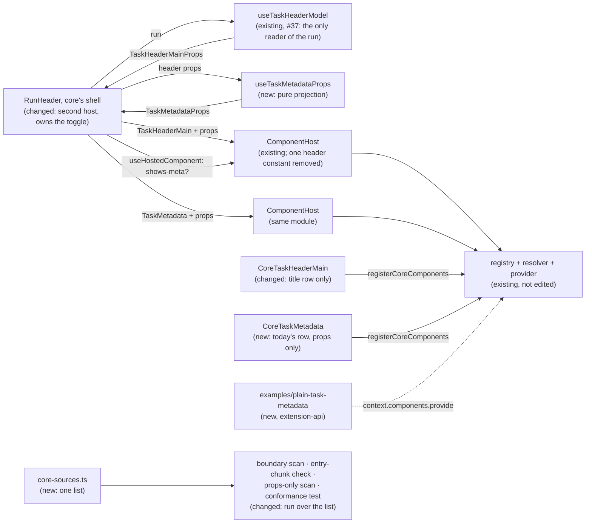

# Task Metadata Contract — the header's meta row as a second public contract, on a platform shown to be generic

> Slug: `task-metadata-contract` · Status: **designed, awaiting implementation** · Epic 2 (Component
> Platform), item 16: "Create `task.metadata@1` contract". Builds on
> `2026-09-19-task-header-contract.md` (item 11: `cezar.task.header.main@1`, `useTaskHeaderModel`,
> `CoreTaskHeaderMain`, `useHostedComponent`), `2026-09-19-component-host.md` (`ComponentHost`,
> `ComponentsProvider`) and `2026-09-19-component-contract-api.md` (capabilities, `layout`, the bump
> table). **Starts from `main` once #38's changes are on it** (Q10). #37 is on `main`. #38 (the
> `offers-*` capabilities, `useHostedComponent`, `examples/compact-task-header/`) was merged into
> its parent branch 21 seconds after that branch was squash-merged, so none of it is on `main`.
> Re-landing it is a prerequisite and not part of this item. Delivery: one PR to `main`, touching
> `packages/extension-api` and `packages/web`.

## 📝 TLDR

After item 11, the cockpit serves one component contract, `cezar.task.header.main@1`. One contract
cannot show whether the contract, registry, resolver and host are a platform, or a mechanism that
happens to fit the task header. The brief asks for a second, simpler component to find out.
(#38's part of item 11 still has to be re-landed on `main`: Q10.)

The proposal carves the task header's **meta row** out of core's header part and serves it as its
own public contract, `cezar.task.metadata@1`. The row is the line under the title: workflow,
branch, pull requests and issue, diff, automation, tokens and cost, and the agent badge. Core's
shell renders it in a second `ComponentHost`, under the title part. Core's default renders from
its props alone, and a new example extension, which imports nothing from `packages/web`, replaces
the row while core's title part stays. The registry, the resolver, the host and the provider are
**not edited, with one exception**: the host's failure notice carries the header's 30 px as a
constant, which is the kind of thing the brief's check is for. The second component also exposes
five hand-kept places that know the header by name. This item turns them into lists the gate
checks, and adds one conformance test that runs over every served contract. The part is built so
that a later item can make it a drag-and-drop element: it owns no spacing, reads no header
context, and renders at any width.

## Resolved assumptions (autonomous defaults)

The brief left these open. Each answer is the most reversible choice that meets the brief's
Definition of Done. All are autonomous defaults, each reversible before implementation starts.

| # | Question | Answer | Why | Status |
|---|---|---|---|---|
| Q1 | The brief bundles the contract, core's row moving onto it, the proof that another implementation works, and the check that the platform is generic. Split into several specs? | **One spec, two phases, one PR.** Phase 1 ships the slot and the platform checks. Phase 2 adds the example extension and the cockpit test that uses it. | None of them works alone: a contract core does not render proves nothing, and the proof needs the slot. Item 11 used two stacked PRs, and item 10's second PR (#33) was lost to a squash-merge of its parent. This item is about a third of item 11's size (one row moves, no action changes hands), so one PR with two phases as commits is cheaper and safer. #38 then met the same fate as #33, a second reason to avoid a stack. Splitting at implementation time stays possible: step 3 (the source list) changes no behavior and can merge on its own first. | default, reversible |
| Q2 | Which id? The brief says `task.metadata@1`. Item 10 named the header's parts `cezar.task.header.<part>`. | **`cezar.task.metadata@1`.** The brief's name with core's `cezar.` prefix. Not `cezar.task.header.meta`. | The brief wants the part to become a drag-and-drop element later, so it may leave the header, and an id that says `header` would then be wrong. Item 11 mapped the brief's `task.header@1` onto an id that already existed. No id exists for this part. The package is private and `BUILTIN_EXTENSIONS` is empty, so the id can still change before an extension outside the repository uses it. | default, reversible |
| Q3 | What is "Task Metadata"? | **The header's meta row, exactly as core renders it after #37:** workflow, branch chip, reference chips (with live state and **Resolve conflicts**), diff, automation chip, tokens and cost, and the agent badge with its menu. Not the status pill, the plan mirror, the monitoring line or the dispatch lines. | It is the block #37 already models as `meta` plus `engine`, and the code already draws this line: `run-header.tsx` keeps the monitoring and dispatch lines outside the part because they are "status, not metadata". | default, reversible |
| Q4 | `cezar.task.header.main@1` already carries `meta` and `engine`, and its optional capability `shows-meta` says an implementation shows them. How do the two contracts relate? | **The header contract does not change. Core's header default stops rendering the row and stops declaring `shows-meta`. The shell renders the metadata slot unless the header implementation it hosts declares `shows-meta`.** A header that shows the meta itself keeps doing so, and core then leaves its slot out, so the row never appears twice. `shows-meta` stays all-or-nothing: it means the whole of `meta` and `engine`. A header that shows one fact without declaring it (the compact example's `runner · model`) gets core's row under it, and that fact shows twice. | This is the `offers-*` rule from item 11 applied to the meta row: what the part declares, the part renders, and core renders the rest beside it. It needs no bump (a default may declare fewer optional capabilities), it keeps item 10's owner decision on `shows-meta`, and it reuses `useHostedComponent`. Removing `shows-meta` from the token was the alternative: simpler, but it edits an owner-decided contract and lets no header own its meta. | default, reversible |
| Q5 | What do the props carry, and under which type names? | **The same facts and intents core's row uses today, under the types #37 already exports:** `meta: TaskHeaderMeta`, `engine: TaskHeaderEngine`, two action states (`resolveConflicts`, `chooseEngine`) and the intents `onResolveConflicts`, `onNavigate` and `onChooseEngine`, plus a three-field `task` (`taskId`, `projectId`, `title`). No new name for an existing shape. | Without the three intents, core's row would lose **Resolve conflicts**, the automation link and the badge's **Choose engine…** (AGENTS.md § Changing a mechanism that already works). One shape per fact means an extension that implements both contracts reads one set of types. `TaskHeader…` in a metadata contract's types is a naming wart, not a coupling: neutral aliases can be added later without a bump. | default, reversible |
| Q6 | Which capabilities does the contract declare? | **None, required or optional.** | Nothing about the row protects control of a task: **Resolve conflicts** is also offered in the Tasks table, the engine picker lives in the dock, and the rest are facts. An implementation that shows three facts is a valid one. Optional capabilities can be added later without a bump, when the picker item needs words for them. A contract with no capabilities is also a useful second case for the platform: item 11's has three on `main`, and six with #38. | default, reversible |
| Q7 | The phone-width toggle that shows and hides the row sits in the title row, inside the header part. Who owns it once the row is another part? | **Core's shell.** The chevron moves out of `CoreTaskHeaderMain` to the shell, between the title part's box and the Run actions menu, with its per-task state. It is rendered whenever the shell renders the metadata slot. | State shared between two replaceable parts would need a side channel between contracts. The shell already decides whether the slot renders (Q4), so it also decides whether it is collapsed. On screen the chevron stays where it is: last in the title line, left of the ⋮ menu. | default, reversible |
| Q8 | How is "the system is not written specially for Task Header" proven? | **Three ways.** (1) The PR does not edit `registry.ts`, `resolve.ts`, `provider.tsx` or `component-host.tsx`, except for the one finding this spec already made: `FailedNotice` in `component-host.tsx` has `min-h-[30px]`, the header's row height, inside a box that already reserves the contract's own `minBlockSize`. The constant goes. Any further edit there is reported in the PR body as a finding. (2) The five places that know the header by name (§ Problem Statement) become lists, and the gate fails when the lists disagree. (3) A conformance test runs the same checks over every contract in `CORE_COMPONENT_CONTRACTS`, and fails when a served contract has no fixture. | "Generic" is a claim about the next component, so it has to be something the gate can check when component three arrives, not a sentence in a spec. | default, reversible |
| Q9 | The brief says the component "is later also a candidate for drag-and-drop". Does this item register it as a layout element? | **No. This item only keeps the part ready for it** (§ Ready for drag-and-drop): one box, no spacing of its own, props only, no position assumptions. No `LayoutElement`, no drop target, no persistence. | The brief says "later". The layout editor covers the sidebar only, and its order lives in memory (spec `2026-09-19-przesuwanie-elementow`, Q2). A drop target on the task page and building the props outside `RunHeader` are their own capability. | default, reversible |
| Q10 | #37 is on `main` (`d298b017`). #38 was merged into `feat/task-header-contract` 21 seconds after #37's squash, so its changes are on no branch that reaches `main`. Build on #38, or stand alone? | **Build on it: #38's changes are re-landed on `main` first, as their own PR, and this item starts after that.** This item does not re-land them. If the owner drops #38 instead, this item brings `useHostedComponent` (item 11's step 7) and the examples' `react` rule (the boundary part of its step 9) in its own step 0, and the proof loses its two-extension case. | Q4 needs `useHostedComponent`, the example needs the `react` devDependency and boundary rule, and the two-extension proof needs the compact header. All three are reviewed, QA'd code that the owner already merged. Copying them into this PR would hide a lost merge inside an unrelated change. | default, reversible. **Needs the owner's action on #38 before implementation** |
| Q11 | How is "an alternative implementation can be created" proven? | **A third worked example, `packages/extension-api/examples/plain-task-metadata/`:** one line of plain text, importing only the extension API and `react`. A cockpit test activates it through the real extension registry and prefers it for `cezar.task.metadata`. | It is item 11's precedent (`examples/compact-task-header/`, Q9 there), including the `react` devDependency and the boundary rule that #38 already put in place. | default, reversible |

## 📝 Problem Statement

The brief's goal is to "check whether the architecture works for a simpler, second component".
With #37 on `main` and #38's changes re-landed (Q10), this is what one served contract leaves
unproven:

- **Every generic module has been exercised by one real contract.** `registry.ts`, `resolve.ts`,
  `component-host.tsx` and `provider.tsx` take any contract, and their tests use fixture contracts.
  In production they have only ever held `cezar.task.header.main`: one host per page, one core
  default, one subject. Two hosts on one page, each with its own error boundary and failure record,
  have never run together.
- **The generic host carries one header constant.** `FailedNotice` (`component-host.tsx`) has
  `min-h-[30px]`: the title row's height, written into the module every contract shares. In a
  20 px slot the notice would reserve another contract's row.
- **Five more places know the header by name**, each as a hand-kept single entry. A second component
  has to find and edit all five, and nothing fails when it misses one of the last three:

  | Place | What it holds today | What goes wrong if component two skips it |
  |---|---|---|
  | `component-registry/core-contracts.ts` | `[TaskHeaderMain]` | Caught: the registration throws `unknown-contract`. |
  | `component-registry/core-components.ts` | one hand-written registration | Caught: the gate test (`missingCoreDefaults`). |
  | `component-registry/boundary.ts`, `CORE_IMPLEMENTATIONS` | one source path | **Nothing.** Any page may import the new default directly and bypass the host. |
  | `vite.config.ts`, `entryChunkRules.eager` | one path pattern | **Nothing.** The new default may drag the markdown stack into the first paint. |
  | `routes/task-thread/core-task-header-boundary.test.ts` | a props-only import scan of one file, with the header's adapter in its forbidden list | **Nothing.** The new default may read queries, and no test says so. |

- **The meta row cannot be replaced on its own.** It lives inside `CoreTaskHeaderMain`. An
  extension that wants a different row has to replace the title and status too, and declare
  `shows-meta`. A header that does not declare it (the compact example) drops the row from the
  page altogether: branch, references, diff and cost disappear.
- **The row could not move.** It carries its own top margin, and its phone-width visibility is
  state inside the title row. A layout editor could not pick it up as one element.

The brief's Definition of Done, and where this item proves each point:

| Definition of Done | How this item meets it | Proven by |
|---|---|---|
| Core metadata works through `ComponentHost`. | The shell renders `<ComponentHost contract={TaskMetadata} …>`. `CoreTaskMetadata`, registered as `cezar.task.metadata.default`, renders today's row from its props alone. | `run-header.test.tsx` (the row is inside `data-component="cezar.task.metadata.default"`), `core-task-metadata.test.tsx` (renders with no provider above it), the conformance test |
| An alternative implementation can be created. | `examples/plain-task-metadata/` implements the contract importing only the extension API and `react`. Preferred on the task page, it replaces the row while core's title part stays. | `extension-api/test/plain-task-metadata.test.ts`, `test/boundary.test.ts`, `web/src/routes/task-thread/external-task-metadata.test.tsx` |
| The system is not written specially for Task Header. | The four generic modules are not edited, beyond removing the one header constant. The five single entries become checked lists. One conformance test covers every served contract. Both contracts can be replaced on one page by two extensions, and one failing does not touch the other. | the PR's diff (Q8), `core-sources.test.ts`, `core-conformance.test.tsx`, `external-task-metadata.test.tsx` |

## 📝 Proposed Solution

1. **Declare the contract** (`packages/extension-api/src/core-components.ts`). `TaskMetadata` is
   `cezar.task.metadata@1`: no capabilities, `layout: { minBlockSize: 20 }`, and
   `TaskMetadataProps` (§ API Contracts). It reuses #37's `TaskHeaderMeta`, `TaskHeaderEngine` and
   `TaskHeaderActionState` (Q5).
2. **Project the props from the header's model** (`routes/task-thread/task-metadata.ts`, new).
   `useTaskMetadataProps(header)` takes the props `useTaskHeaderModel` built and returns the
   metadata props: the header's `meta`, `engine` and two action states, its three callbacks, and a
   `task` of three fields. It reads no run, query or router, so `useTaskHeaderModel` stays the only
   reader of the run behind both parts, and one fact has one derivation. The header's data is
   re-frozen as a whole whenever any of it changes (`useFrozenJson`), so the projection keeps its
   own result by the JSON of its own data, the same way: a status change alone gives the row the
   same props object.
3. **Core's row becomes its own default** (`routes/task-thread/core-task-metadata.tsx`, new).
   `MetaRow`, `CopyBranchChip`, `AgentBadge`, `ResolveConflictsAction` and `conflictActionFor`
   move out of `core-task-header-main.tsx`, unchanged except that they read `TaskMetadataProps`
   and that the row's top margin stays behind with the shell. `CoreTaskHeaderMain` keeps the title
   row and declares `['shows-title', 'shows-status']`.
4. **The shell hosts the slot and owns its visibility** (`run-header.tsx`). Under the title part's
   box, in the same column left of the ⋮ menu, it renders
   `<ComponentHost contract={TaskMetadata} subject={run.id} props={…} />` inside a
   `data-slot="run-details"` wrapper, which carries the margin. The wrapper, its `useId`, the
   phone-width chevron, the per-task map (`detailsOpenByTask`) and the re-render bump all move from
   `CoreTaskHeaderMain` to the shell (Q7). The bump is local state of `RunHeaderView`, so
   `RunHeader`'s `memo` comparator does not stand in its way. When
   `useHostedComponent(TaskHeaderMain, run.id)` names an implementation whose checked capabilities
   include `shows-meta`, the shell renders neither the slot nor the chevron (Q4).
5. **One list per fact about core's defaults** (Q8). `component-registry/core-sources.ts` (new,
   pure data) names, per served contract id, the source file of core's default. `boundary.ts`
   derives `CORE_IMPLEMENTATIONS` from it, `vite.config.ts` derives `entryChunkRules.eager` from
   it, and the props-only import scan becomes one test over every source in it. A test fails when
   its contract ids differ from `CORE_COMPONENT_CONTRACTS`. `FailedNotice` loses `min-h-[30px]`:
   the host's box already reserves the contract's `minBlockSize`.
6. **One conformance test for every served contract** (`component-registry/core-conformance.test.tsx`,
   new). For each entry of `CORE_COMPONENT_CONTRACTS`, with fixture props per contract id: core's
   default renders through the host with no other provider, the box reserves the contract's
   `minBlockSize`, a preferred implementation that throws is replaced by core's default and
   reported once, an implementation of another major is never rendered, and a disposed
   implementation gives way to core's default. A served contract without fixture props fails the
   test, so component three cannot skip it.
7. **The proof (phase 2).** `examples/plain-task-metadata/` renders the facts as one line of text
   and calls `onChooseEngine()` from its engine label. A cockpit test activates it, prefers it and
   uses it, alone and together with the compact header.

### Prior art

- **VS Code views.** A view can be dragged between the side bar, the panel and the secondary bar
  because it owns nothing about its position: the workbench owns the container, the title bar and
  the collapsed state, and the view renders into whatever box it is given. We take that split for
  the part (§ Ready for drag-and-drop) and for the phone-width toggle (Q7). We skip `when` clauses
  and per-view persisted state.
- **Grafana dashboards.** The dashboard owns each panel's grid position and size, and the panel
  plugin receives data and callbacks (`PanelProps`). Position is never the plugin's concern. We
  skip passing `width` and `height`: the row wraps with CSS.
- **Backstage entity cards.** Cards are extensions, and the app (not the card) decides the grid
  they sit in. Its cards read `useEntity()` from context. We keep props instead, for the reason
  item 11 gave: a hook ties an implementation to the host's React tree.
- **Plugin-API conformance suites** (Terraform's provider acceptance tests, the Language Server
  Protocol's test harnesses): one suite that every implementation of an interface runs. Our
  conformance test is the small version: every served contract, the same five checks.

### Alternatives considered

- **`cezar.task.header.meta@1`, a part of the header** (Q2). Not chosen: the id would be wrong the
  day the part is dropped outside the header.
- **Remove `shows-meta` from the header contract** (Q4). Simpler: the slot always renders and no
  header shows meta. Not chosen as the default, because it edits an owner-decided contract the day
  it merges, and it removes a header's option to lay the facts out its own way.
- **Always render the slot, whatever the header declares.** Rejected: a header that declares
  `shows-meta` would show the row twice.
- **Let core's header default render a nested `ComponentHost` for the row.** Rejected. Core's
  default must render from its props alone (item 11, Q5), and an extension's header could not do
  the same: it cannot import the host.
- **A second adapter that reads the run for the metadata.** Rejected: two readers mean two
  derivations of the same fact, and they drift. The projection keeps one.
- **A facts-only contract, with no intents.** It would be the simplest contract. Rejected: core's
  row would lose Resolve conflicts, the automation link and Choose engine on the default page.
- **New neutral type names** (`TaskMeta`, `TaskEngine`) with the `TaskHeader…` names as aliases
  (Q5). Not chosen now: it doubles the public type names for no behavior. It stays possible.
- **Derive `CORE_COMPONENT_CONTRACTS` and the registrations from one table.** Rejected.
  `core-contracts.ts` must stay free of React so that `registry.test.ts` and `resolve.ts` can use
  it, and `core-components.ts` must stay the one importer of the implementations. Two lists with a
  test that they agree keep both rules.
- **Prove genericity with a fixture contract only.** That is what the host's tests already do. The
  brief asks for a second real component.

## 📝 Architecture



- **New in `packages/extension-api`:** the `TaskMetadata` token and its three interfaces in
  `src/core-components.ts`, re-exported from `src/index.ts`, with `test/surface.test.ts` listing
  `TaskMetadata`; in phase 2, `examples/plain-task-metadata/index.ts` and
  `test/plain-task-metadata.test.ts`.
- **Changed in `packages/extension-api`:** `README.md` ("Replacing a component" gains the metadata
  row and the rule for `shows-meta`), `test/core-components.test.ts`.
- **New in `packages/web/src/routes/task-thread/`:** `task-metadata.ts` (`useTaskMetadataProps`),
  `core-task-metadata.tsx` (`CoreTaskMetadata`).
- **New in `packages/web/src/component-registry/`:** `core-sources.ts`, `core-sources.test.ts`,
  `core-conformance.test.tsx` with `core-conformance-fixtures.ts`, and `core-props-only.test.ts`
  (the props-only scan over every source; it replaces
  `routes/task-thread/core-task-header-boundary.test.ts`, keeping its cases).
- **Changed in `packages/web`:** `core-task-header-main.tsx` (loses the row and the toggle),
  `run-header.tsx` (the second host, the toggle, the `shows-meta` rule), `core-contracts.ts`
  (`[TaskHeaderMain, TaskMetadata]`), `core-components.ts` (the second registration; the header
  default's capabilities), `boundary.ts` and `vite.config.ts` (derive from `core-sources.ts`),
  `component-host.tsx` (`FailedNotice` loses `min-h-[30px]`, nothing else), and the tests that
  place the meta row inside the header's box or expect `shows-meta` on core's header default
  (§ Implementation Plan, step 4).
- **Not touched:** `registry.ts`, `resolve.ts`, `provider.tsx`, and `component-host.tsx` beyond
  that one class name (Q8),
  `task-header-main.ts` (`useTaskHeaderModel` keeps building `meta` and `engine`, which the header
  contract still carries), the `TaskHeaderMain` token, the extension host, the commands, the event
  bus, the HTTP contract, the service and the api-client. No `BACKWARD_COMPATIBILITY.md` surface
  moves.

In short: the second component arrives as data (a token, a registration, a source path) plus its
own two files, and the platform's code does not change.

### Ready for drag-and-drop

A later item makes this part a layout element. This item guarantees what that needs, and a review
checks each line:

| Rule | How it is kept |
|---|---|
| The part is one box. | `ComponentHost` renders one element per host (`data-contract="cezar.task.metadata"`), so a `LayoutElement` can wrap it without reaching inside. |
| The part owns no outer spacing. | The row's `mt-1 md:mt-1.5` moves to the shell's wrapper. `CoreTaskMetadata`'s root has no margin. |
| The part does not know where it is. | Props only: no header context, no sibling state, no `sticky`. `sizing` stays `content`. The phone-width toggle is the shell's (Q7). |
| The part renders at any width. | Core's row keeps `flex-wrap`. The contract's TSDoc tells implementations to wrap or truncate instead of assuming the header's width. |
| The part's identity is stable. | The host's `subject` is the run id, as for the title part. |

Left to that item: wrapping the host in a `LayoutElement`, a drop target on the task page,
persisting the position (the layout order is in memory today), and building the two parts' props
above `RunHeader` once the row can leave it. `useTaskMetadataProps` takes the header's props as its
only input, so it moves with them.

## 📝 Data Model

Nothing is persisted. The toggle's per-task state is the in-memory map #37 keeps in
`core-task-header-main.tsx` (`detailsOpenByTask`), moved to `run-header.tsx`.

## 📝 API Contracts

Signatures are normative. `TaskHeaderMeta`, `TaskHeaderEngine`, `TaskHeaderReference` and
`TaskHeaderActionState` are #37's, unchanged.

### `packages/extension-api/src/core-components.ts` (public, additive)

```ts
/** The task a metadata row belongs to. JSON. */
export interface TaskMetadataTask {
  readonly taskId: string
  /** The registered project that owns the task. Pass it as `TaskRef.projectId`. */
  readonly projectId: string
  /** The title the cockpit shows for the task. Core uses it in its chips' accessible names. */
  readonly title: string
}

export interface TaskMetadataActions {
  /** Ask the task's agent to resolve a pull request's merge conflicts. Offer it on a numbered, `conflicting` reference. */
  readonly resolveConflicts: TaskHeaderActionState
  /** Choose the runner and model the next continuation uses. Available on the Session tab, for a task that can be continued. */
  readonly chooseEngine: TaskHeaderActionState
}

export interface TaskMetadataProps {
  readonly task: TaskMetadataTask
  /** Workflow, branch, diff, references, automation and usage. A metric the server hides is absent. */
  readonly meta: TaskHeaderMeta
  /** The agent the task runs on. */
  readonly engine: TaskHeaderEngine
  readonly actions: TaskMetadataActions
  /** The user asked the agent to resolve conflicts in pull request `prNumber`, a `conflicting` reference. */
  readonly onResolveConflicts: (prNumber: number) => void
  /** The user followed an in-app link from these props (`meta.automation.href`). */
  readonly onNavigate: (href: string) => void
  /** The user asked to choose the engine for the next continuation. Core moves focus to its engine picker. */
  readonly onChooseEngine: () => void
}

/**
 * The task's basic facts: workflow, branch, references, diff, automation, usage and engine. On the
 * task page core renders it under the title part, unless the hosted `cezar.task.header.main`
 * implementation declares `shows-meta` and so shows these facts itself.
 * - No capabilities: an implementation may show any subset of the facts.
 * - Intents: before acting on `onResolveConflicts` or `onChooseEngine`, core checks the action's
 *   current state. A call does nothing unless the action is `available` and `enabled`.
 *   `onNavigate` follows only an `href` core put into these props.
 * - Layout: 20 CSS pixels (one row) are reserved while an implementation loads, fails or is
 *   swapped. Core places the box and owns the space around it. Do not assume its width or its
 *   position on the page: wrap or truncate. On a phone core may keep the box hidden until the user
 *   asks for the details, with the implementation mounted.
 */
export const TaskMetadata = defineComponentContract<TaskMetadataProps>('cezar.task.metadata', {
  version: 1,
  layout: { minBlockSize: 20 },
})
```

The three intents are the same functions the header's props carry, so what core does for each is
item 11's table, unchanged: the state check, the delivery seam and toasts for
`onResolveConflicts`, the `href` allow-list and the one warning per foreign value for
`onNavigate`, and the focus move for `onChooseEngine`.

`TaskHeaderMain`'s TSDoc for `shows-meta` gains one sentence: "Core then leaves its
`cezar.task.metadata` slot out of the task page." The token does not change.

### `packages/web/src/routes/task-thread/task-metadata.ts` (new)

```ts
/** `header`'s metadata, as `cezar.task.metadata@1` props. Pure: the header's `meta`, `engine`, two
 *  action states and three callbacks, and a `task` of three fields. */
export function taskMetadataPropsOf(header: TaskHeaderMainProps): TaskMetadataProps

/**
 * {@link taskMetadataPropsOf}, frozen, keeping the previous object while the JSON of its data is
 * the same and the callbacks are the same functions (they keep one identity for the life of the
 * header). The header's own data is re-frozen as a whole on any change, so this compares by JSON,
 * as `useFrozenJson` does: a status or prompt change alone does not re-render a memoized row.
 */
export function useTaskMetadataProps(header: TaskHeaderMainProps): TaskMetadataProps
```

### `packages/web/src/component-registry/core-sources.ts` (new)

```ts
/** Where core's default of each served contract lives, relative to `packages/web`, without an
 *  extension. Pure data: `boundary.ts`, `vite.config.ts` (by relative path) and the props-only
 *  scan all read it. `core-sources.test.ts` holds it to `CORE_COMPONENT_CONTRACTS`. */
export const CORE_IMPLEMENTATION_SOURCES: readonly { readonly contractId: string; readonly source: string }[] = [
  { contractId: 'cezar.task.header.main', source: 'src/routes/task-thread/core-task-header-main' },
  { contractId: 'cezar.task.metadata', source: 'src/routes/task-thread/core-task-metadata' },
]
```

### `packages/web/src/component-registry/core-components.ts` (changed)

`registerCoreComponents` registers both defaults. The header default's `capabilities` become
`['shows-title', 'shows-status']` and its description "Cezar's own title and status row". The new
one:

```ts
const coreTaskMetadata: ComponentImplementation<TaskMetadataProps> = Object.freeze({
  id: coreDefaultComponentId(TaskMetadata.id), // cezar.task.metadata.default
  title: 'Task metadata',
  description: 'Cezar’s own meta row: workflow, branch, references, diff, usage and agent',
  capabilities: Object.freeze([]),
  component: CoreTaskMetadata,
})
```

### `packages/extension-api/examples/plain-task-metadata/index.ts` (new, phase 2)

```ts
import { createElement as h } from 'react'
import { defineExtension, TaskMetadata, type ComponentProps } from '@open-mercato/cezar-extension-api'

/** One line of text: workflow · branch · +added −removed · #references · runner/model. */
function PlainTaskMetadata(props: ComponentProps<typeof TaskMetadata>) { /* h('div', …) */ }

export default defineExtension({
  manifest: { id: 'example.plain-metadata', name: 'Plain task metadata', version: '1.0.0', engines: { cezar: '>=<the release that ships this>' } },
  activate(context) {
    context.components.provide(TaskMetadata, {
      id: 'example.plain-metadata.line',
      title: 'Plain line',
      capabilities: [],
      component: PlainTaskMetadata,
    })
  },
})
```

The engine label is a button while `actions.chooseEngine.available`, and it calls
`onChooseEngine()`. That is the one intent the example uses, so the proof covers a callback
crossing the second contract too.

## 📝 UI/UX

**The default page looks as it does on `main` after #37, with two differences:**

1. **While renaming, the meta row stays visible.** After #37, core's title editor covers the top
   of the header part and the rest of the part, the row included, is hidden until the user saves
   or cancels. The row is now another part, so only the title row is hidden. This is the behavior
   from before #37, including its blur rule: a click on the row commits the rename, as a click
   anywhere else does (`editable-title.tsx`).
2. **On phones, the details chevron belongs to the shell.** It keeps its place (last in the title
   line, left of the ⋮ menu), its labels (**Show run details** / **Hide run details**),
   `aria-expanded` and `aria-controls`. It moves from inside the title part's box to beside it, so
   on a phone the title part's box is narrower by that one button.

Where each of the row's behaviors lives after this item:

| Behavior after #37 | After this item |
|---|---|
| Workflow, branch chip (copy), diff with file count and the `repointed` caveat | `CoreTaskMetadata`, from `meta` |
| PR and issue chips with live status, tooltips, conflict warning, **Resolve conflicts** | `CoreTaskMetadata`, from `meta.references` and `actions.resolveConflicts`, calling `onResolveConflicts` |
| Automation chip, a link while automations are on | `CoreTaskMetadata`, from `meta.automation`, calling `onNavigate` |
| Tokens and cost (hidden per `CEZ_HIDE_TOKEN_METRICS`) | `CoreTaskMetadata`, from `meta.usage` |
| Agent badge, its menu, **Choose engine for the next continuation…** | `CoreTaskMetadata`, from `engine` and `actions.chooseEngine`, calling `onChooseEngine` |
| Phone-width details toggle, collapsed by default, remembered per task | Shell (Q7) |
| The row is hidden from the accessibility tree while collapsed | Shell: the wrapper keeps `hidden` |
| Title, rename, status pill, plan mirror | `CoreTaskHeaderMain`, unchanged |

With an extension's header that does not declare `shows-meta` (the compact example), the page now
shows core's meta row under it. Before this item that page had no meta row at all. The compact
example prints `runner · model` itself, so the engine shows twice there, once in each part (Q4). With a header
that declares `shows-meta`, the page shows that header alone, without the slot or the chevron.

Accessibility: the row keeps its markup, labels and keyboard behavior, because the code moves
unchanged. The chevron's `aria-controls` points at the wrapper, as today. Both now live in the shell.

Prototype: `.ai/specs/assets/task-metadata-contract/`. `current-01-task-header.png` is today's
task page, reused from `assets/task-header-contract/` (captured on 2026-09-19; `run-header.tsx` on
`main` has not changed since). `mockup-01-two-parts.png` shows the default page with the two
hosts' boxes outlined, at desktop and phone width. `mockup-02-plain-metadata.png` shows the plain
example under core's title part, and under the compact header. The `.html` sources sit beside
them. The dashed outlines mark the hosts' boxes and are not part of the design.

## 📝 Edge Cases & Failure Scenarios

- **The metadata implementation throws.** Its host renders core's row and the provider reports it
  once (#32). The title part is another host with its own boundary, so it does not re-render or
  fall back.
- **The header implementation throws while the metadata one is fine**, and the other way round.
  Each host falls back alone. The failure record is per (implementation, subject), so neither
  marks the other.
- **A header that declares `shows-meta` throws.** Its host falls back to core's title part, which
  does not declare `shows-meta`. `useHostedComponent` names core's default, so the shell renders
  the slot and the chevron again. For one commit, between the fallback's render and the failure
  being recorded, neither shows the meta (item 11 describes the same commit for the actions).
- **A header declares `shows-meta` and shows nothing.** A capability is a declaration, as
  everywhere. The facts are missing from that page and no control of the task is lost (Q6). The
  picker item shows the declared capabilities, so the user can see what they chose.
- **The user prefers a metadata implementation, and the hosted header declares `shows-meta`.**
  The slot is not rendered, so the preferred row is not either. Nothing is logged: it is what the
  header declared. Nobody stores a preference yet. The picker item, which will, shows each
  implementation's capabilities and can say so.
- **Core's row fails while collapsed on a phone.** The notice and **Try again** are inside the
  `hidden` wrapper, so the user sees them when they open the details. The provider's one report is
  not affected.
- **Two extensions, one per contract.** Each is resolved by its own contract id and preference.
  Deactivating one re-resolves both hosts (one registry revision), and only its host changes.
- **One extension provides both contracts.** Nothing special: two registrations under one
  activation scope, dropped together when it deactivates.
- **Collapsed on a phone.** The host stays mounted inside a `hidden` wrapper, as the row is today,
  so an implementation's effects run while it is not visible. The contract's TSDoc says so.
- **A narrow or wide box.** Core's row wraps. An implementation that overflows is clipped by the
  header's own `min-w-0` column and never pushes the ⋮ menu off screen.
- **Core's metadata default throws.** The box shows #32's inline notice with **Try again**. The
  title part, the actions, the tabs and the thread keep working.
- **Core forgets to register the default, or to list its source.** The gate test and
  `core-sources.test.ts` fail first. At run time an unregistered default renders an empty box,
  never an extension's implementation (#32, "unresolved").
- **A third contract is served without conformance fixtures.** `core-conformance.test.tsx` fails
  with the contract's id.
- **The user moves from task A to task B.** The header is not remounted. The callbacks are
  #37's, which read the latest run through a ref. The toggle's state is read per task id.
- **A metric hidden by the server, an unknown reference status or tone, a removed account.** The
  props are the header's own frozen objects, so item 11's answers hold word for word.
- **An implementation mutates its props.** They are frozen: in strict-mode code the write throws
  and counts as a render failure.
- **The Changes, Commits and Files tabs.** They render the same shell, so the same two hosts.
  `actions.chooseEngine` is not available there, as today.

## 📝 Risks & Impact Review

- **A second public contract.** `cezar.task.metadata@1` adds one token and three small interfaces,
  and it makes #37's `TaskHeaderMeta`, `TaskHeaderEngine` and `TaskHeaderActionState` shared by two
  contracts: narrowing one of them later bumps both. Nothing is added that core's row does not
  render. The package is private and `BUILTIN_EXTENSIONS` is empty, so nobody implements it yet.
- **The meta row moves twice in a short time** (#37, then this item). AGENTS.md § Changing a
  mechanism that already works applies. What the in-part toggle was load-bearing for: the row
  leaving the accessibility tree while collapsed, per-task memory, and `aria-controls`. All three
  move to the shell and keep their tests. The row's own tests move file without being rewritten
  (step 4 lists them), and `run-header.test.tsx`'s meta assertions must pass with no change beyond
  the container they are found in.
- **Core's header default declares one capability fewer.** No runtime code reads `shows-meta`
  before this item's shell rule, and no preference is stored anywhere yet. Two tests and the
  README name it on core's default (`extension-api/test/core-components.test.ts`,
  `web/src/component-registry/core-components.test.ts`, the README's "Replacing a component") and
  change with it.
- **Two visible changes to a page that has just shipped** (§ UI/UX: the row stays during rename,
  and a header without `shows-meta` gains core's row). Each has a named test in step 4 or 7, and
  both are listed for the owner on the PR that carries this spec.
- **A page with an extension header gains a row** (the compact example, § UI/UX). This is
  intended: facts no longer vanish because a header chose not to show them.
- **Task content reaches a second kind of extension code.** The same facts item 11 already gives
  a header implementation, minus the prompt and the status. Extensions are compiled in and
  trusted, hidden usage metrics stay hidden, and no credential or file content is in the props.
- **The entry bundle.** Both defaults load with the first paint. The entry-chunk check now covers
  every source in `core-sources.ts`, so the row's imports (`ReferenceChip`, the badge menu) are
  held to the same rule as the title part's. They already load with the first paint today, inside
  the header default.
- **`vite.config.ts` imports a source file.** `core-sources.ts` is pure data with no alias and no
  React, imported by relative path. If the config's TypeScript project cannot include it, the
  fallback is to keep the patterns in the config and let `core-sources.test.ts` assert they match.
- **Depends on a lost merge being repaired** (Q10). Until #38's changes are on `main`,
  implementation cannot start as written. The design does not depend on how they are re-landed,
  and Q10 names the fallback if they are dropped.
- **Rollback.** Revert the PR. Nothing is persisted, the header contract is untouched, and the
  extension API is private.

## 📋 Phasing

1. **Phase 1: The slot, and the platform checks.** Declare the contract, add the projection, move
   the row into its own default, host it in the shell with the toggle and the `shows-meta` rule,
   register it, replace the single entries with `core-sources.ts`, and add the conformance test.
2. **Phase 2: The proof.** The plain example, its package test, and the cockpit test that uses it
   alone and beside the compact header. Then the README and AGENTS.md.

Both phases ship in one PR (Q1). Phase 1 alone leaves a working cockpit and can merge first if the
PR is split.

## 📋 Implementation Plan

Every step keeps the validation gate in `.ai/agentic.config.json` green: typecheck, `npm test`,
`test:unit`, `build` and `test:package`.

### Phase 1: The slot, and the platform checks

1. **The contract** (`packages/extension-api/src/core-components.ts`, re-exported from
   `src/index.ts`), per § API Contracts, with the added sentence on `TaskHeaderMain`'s
   `shows-meta`.
   *Tests:*
   - the token equals `{ kind: 'component', id: 'cezar.task.metadata', version: 1, requiredCapabilities: [], optionalCapabilities: [], layout: { minBlockSize: 20 } }`
     and is frozen;
   - `IsJson<Omit<TaskMetadataProps, 'onResolveConflicts' | 'onNavigate' | 'onChooseEngine'>>`;
   - a type test: the three intents are the only function-typed props and all return `void`;
   - a type test: `TaskMetadataProps['meta']`, `['engine']` and both action states are the header
     contract's own types, so one object satisfies both;
   - `test/surface.test.ts` lists `TaskMetadata`.

2. **The projection** (`routes/task-thread/task-metadata.ts`). Nothing renders it yet.
   *Tests* (`task-metadata.test.ts`):
   - `meta`, `engine` and both action states equal the header props' (`toEqual`), and the three
     callbacks are the header props' own functions (`toBe`);
   - `task` has exactly `taskId`, `projectId` and `title`;
   - the result is frozen, and is the same object (`toBe`) across a re-render where only
     `task.status`, `task.prompt` or `attention` changed, although the header's `meta` object is a
     new one then;
   - it is a new object when `meta`, `engine`, an action state or the title changes.

3. **One list of core's sources, and the host's header constant** (`core-sources.ts`;
   `boundary.ts`, `vite.config.ts`, `core-props-only.test.ts`; `component-host.tsx`). A refactor
   with the header as the only entry. The one visible effect: the failure notice is no taller than
   its content inside a box that still reserves the contract's `minBlockSize` (30 px for the
   header, so the header's notice keeps its height).
   *Tests:*
   - `core-sources.test.ts`: the list's contract ids equal `CORE_COMPONENT_CONTRACTS`' ids as
     sets, no id or source repeats, and every source resolves to a file;
   - `boundary.test.ts` passes unchanged, with `CORE_IMPLEMENTATIONS` derived from the list;
   - the entry-chunk check's fixture tests pass unchanged, with `eager` derived from the list
     (each source path escaped, with `\.tsx$` appended), and `vite-config.test.ts` pins the
     generated patterns;
   - `core-props-only.test.ts` runs today's forbidden-import scan over every listed source and
     keeps every "catches …" and "lets through" case of `core-task-header-boundary.test.ts`, which
     it replaces. The forbidden list is shared by all sources, and it gains one rule: no listed
     source imports another listed source. Step 4 adds `src/routes/task-thread/task-metadata`;
   - `component-host.test.tsx`: the failure notice has no fixed minimum height of its own, and the
     box around it still reserves the fixture contract's `minBlockSize`.

4. **The split** (`core-task-metadata.tsx`, `core-task-header-main.tsx`, `core-contracts.ts`,
   `core-components.ts`, `core-sources.ts`, `run-header.tsx`). One step, so the row is never
   missing from the page: the row moves into `CoreTaskMetadata`, the token joins
   `CORE_COMPONENT_CONTRACTS`, the default is registered and listed, the header default drops the
   row, the toggle and `shows-meta`, and the shell renders the second host, the toggle and the
   `shows-meta` rule.
   *Tests:*
   - `core-task-metadata.test.tsx`: every meta-row case of `core-task-header-main.test.tsx` moves
     here with only its props type and render target changed; the component renders with no
     `QueryClientProvider`, router, `CommandsProvider` or `ComponentsProvider` above it; its root
     element has no margin class;
   - `core-task-header-main.test.tsx` keeps its title, rename, pill and plan cases, and asserts
     the part renders no `data-slot="run-meta"` and no details toggle;
   - the gate test: `missingCoreDefaults` is `[]`, and `['cezar.task.metadata']` without the new
     registration, so the check is shown to fail;
   - `checkComponentCompatibility(TaskMetadata, coreTaskMetadata)` is compatible with
     `capabilities` of `[]`, and the header default's are `['shows-title', 'shows-status']`;
   - `run-header.test.tsx`: the existing meta assertions pass, found inside
     `data-component="cezar.task.metadata.default"`; the title is inside
     `data-component="cezar.task.header.main.default"`; neither host box contains the other, and
     both sit in the column left of the ⋮ menu;
   - `task-thread.test.tsx`: the assertion that finds `run-meta` inside the
     `cezar.task.header.main` box looks in the `cezar.task.metadata` box instead, the one rewrite
     in that file. `e2e/task-thread.e2e.ts` finds `run-meta` from the document and passes
     unchanged;
   - `extension-api/test/core-components.test.ts` and `component-registry/core-components.test.ts`
     expect `['shows-title', 'shows-status']` on core's header default;
   - the toggle: at phone width the wrapper is `hidden` until **Show run details** is pressed,
     `aria-expanded` and `aria-controls` match the wrapper, and the answer is kept per task across
     a switch from task A to task B and back;
   - rename: while the editor is open the title part is `inert` and the meta row is not, and a
     click on the row commits the rename;
   - `shows-meta`: with a preferred fixture header that declares it, the page has no
     `data-contract="cezar.task.metadata"` box and no toggle; after that fixture throws, both
     return; with a fixture header that does not declare it, both are present;
   - the metadata fixture that throws: core's row returns, the failure is reported once, and the
     title part's box keeps its `data-component`;
   - the other route tests (`task-changes`, `task-files`, `review-panel`) pass unchanged.

5. **The conformance test** (`core-conformance.test.tsx`, `core-conformance-fixtures.ts`).
   *Tests,* once per contract in `CORE_COMPONENT_CONTRACTS`:
   - a fixture exists for the contract id (the test names the id when one is missing, shown by a
     case that adds a fixture contract to a copy of the list);
   - with only `ComponentsProvider` above it, the host renders `${contract.id}.default`;
   - the box's `min-block-size` is the contract's `layout.minBlockSize`;
   - a preferred implementation that throws on render is replaced by core's default, and the
     failure is reported once;
   - an implementation of `version + 1` is recorded `compatible: false` and never rendered, even
     when preferred;
   - a preferred implementation that is disposed gives way to core's default.

### Phase 2: The proof

6. **The example** (`examples/plain-task-metadata/index.ts`).
   *Tests:*
   - `test/plain-task-metadata.test.ts` activates it with `createFakeContext`, checks that it
     provides `example.plain-metadata.line` against `cezar.task.metadata@1`, and that
     `checkComponentCompatibility(TaskMetadata, impl)` is compatible;
   - `test/boundary.test.ts` passes unchanged: the example imports only the package and `react`.

7. **The proof on the task page** (`routes/task-thread/external-task-metadata.test.tsx`). Import
   the example through a test-only relative path (AGENTS.md: "ugly on purpose"), activate it
   through the extension registry the way `main.tsx` does, and prefer it through
   `ComponentsProvider`.
   *Tests:*
   - `ThreadView` with a finished fixture run renders the example's line
     (`data-component="example.plain-metadata.line"`) with the workflow, the branch, the diff and
     `runner/model`, under core's title part (`data-component="cezar.task.header.main.default"`);
   - on a task that can be continued, the example's engine label calls `onChooseEngine()` and
     focus lands on the dock's first engine pill; on one that cannot, the label is plain text;
   - with the compact header preferred too, both examples render, each in its own box, and the
     compact header's Continue still executes `cezar.task.continue`;
   - when the example is made to throw, core's row returns and the compact header stays.

8. **The README and AGENTS.md.** The README's "Replacing a component" section describes the
   metadata contract, the `shows-meta` rule and the plain example. AGENTS.md's "Component
   implementations" routing row records the platform rules this item adds:
   - a new core contract is three entries and two files: the token in
     `CORE_COMPONENT_CONTRACTS`, the registration in `core-components.ts`, the source in
     `core-sources.ts`, plus the default and its conformance fixture;
   - `registry.ts`, `resolve.ts`, `component-host.tsx` and `provider.tsx` hold no knowledge of any
     one contract, and a PR that serves a new contract does not edit them;
   - a replaceable part owns no outer spacing and no state another part reads: the shell that
     places it owns both;
   - props for a second part come from a projection of the model that already reads the run,
     never from a second reader.

   `.ai/specs/2026-09-19-task-header-contract.md` gains one line under its title, marked
   *(Corrected in the implementation PR)*: core's header default no longer renders the meta row or
   declares `shows-meta`; see this spec.
