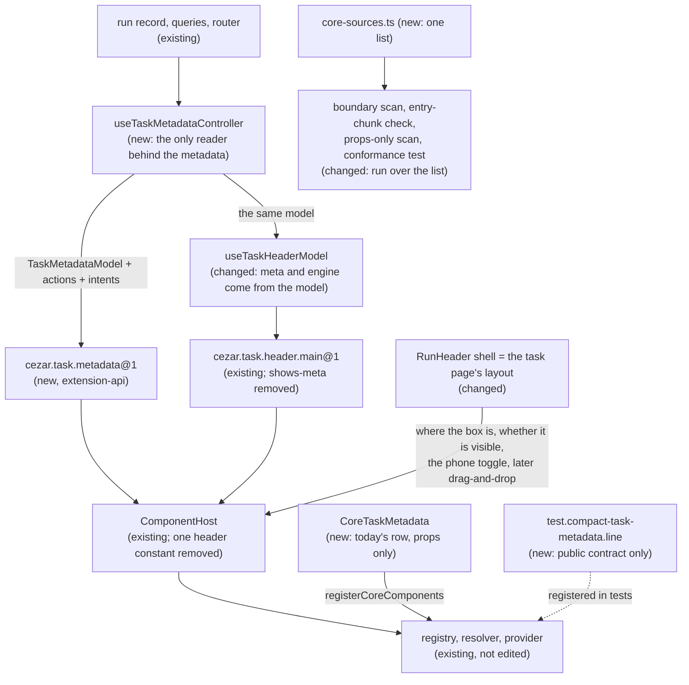

# Task Metadata Contract — the task's metadata as a second public contract, on a platform shown to be generic

> Slug: `task-metadata-contract` · Status: **designed, awaiting implementation** · Epic 2 (Component
> Platform), item 16: "Create `task.metadata@1` contract". Builds on
> `2026-09-19-task-header-contract.md` (item 11: `cezar.task.header.main@1`, `useTaskHeaderModel`,
> `CoreTaskHeaderMain`, on `main` since #37), `2026-09-19-component-host.md` (`ComponentHost`,
> `ComponentsProvider`) and `2026-09-19-component-contract-api.md` (capabilities, `layout`, the bump
> table). **Starts from `main` as #37 left it** and depends on no open PR (Q10). Delivery: one
> spec, three PRs to `main`, one after another (Q1), touching `packages/extension-api` and
> `packages/web`. *Revised 2026-09-20 with the owner's answers on PR #41.*

## 📝 TLDR

After item 11, the cockpit serves one component contract, `cezar.task.header.main@1`. One contract
cannot show whether the contract, registry, resolver and host are a platform, or a mechanism that
happens to fit the task header. The brief asks for a second, simpler component to find out.

The proposal makes the **task's metadata** its own public contract, `cezar.task.metadata@1`. `@1`
is the version of the contract, not of an extension. The metadata is what the header's meta row
shows today: workflow, branch, pull request and issue references, diff summary, automation, usage
and cost, and the agent the task runs on. The status, the plan progress, and the monitoring and
dispatch lines are not metadata. The contract is defined by what those facts mean, not by where
they sit, so it still makes sense the day the component moves to a sidebar.

A new controller builds one shared `TaskMetadataModel` from the run. The metadata contract takes
that model, and the task header reads its own `meta` and `engine` from the same model, so the
metadata contract does not depend on the header. Core's shell renders the metadata in a second
`ComponentHost`. **Where the component sits and whether it is visible belong to the page's layout,
not to either contract**: `shows-meta` leaves the header contract, and the phone-width toggle moves
to the shell. A second, test implementation, written against the public contract alone, renders
through the same host. The registry, the resolver and the provider are not edited, and the host
loses the one header constant it carried.

## Resolved assumptions

The brief left these open. The owner answered Q1–Q6, Q10 and Q11 on PR #41 on 2026-09-19, and
those rows record the decisions, mapped onto this repository's names. Q7–Q9 are still autonomous
defaults, each reversible before implementation starts.

| # | Question | Answer | Why | Status |
|---|---|---|---|---|
| Q1 | The brief bundles the contract, core's row moving onto it, the proof that another implementation works, and the check that the platform is generic. Split? | **One spec, three PRs.** PR 1: the contract, the public types and the controller that prepares the data. PR 2: core's implementation is registered and today's UI moves onto `ComponentHost`. PR 3: the alternative implementation and the conformance tests. Each PR is opened against `main` after the one before it has merged. None is based on another PR's branch. | The owner: each PR has one concrete goal, and a simple feature is not broken into independent tickets. Sequential PRs to `main`, because both stacked children so far (#33, #38) were merged into a parent branch that had already been squashed, and never reached `main`. | ✅ owner, 2026-09-19 (three PRs); the "never stacked" rule is a default |
| Q2 | Which id, and what does `@1` mean? | **`cezar.task.metadata@1`.** `@1` is the major version of the **contract** (`version: 1` on the token). It is not the version of an extension or of an implementation: those carry their own `manifest.version`. | The owner confirmed the reading. The id does not say `header`, because the component may later leave the header (Q9). | ✅ owner, 2026-09-19 |
| Q3 | What is "Task Metadata"? | **The task-detail metadata currently rendered in the header's meta row after #37: workflow, branch, references, diff summary, automation, usage and cost, and agent/engine metadata. It explicitly excludes task status, plan and progress presentation, and the monitoring and dispatch surfaces.** The agent badge is in: it answers "which agent and engine belong to this task?", and its one action crosses the contract as an intent (`chooseEngine`), so core keeps the engine picker's logic. | The owner: the contract defines the task's metadata, not "the elements of the header's second row", so the name and the contract still hold when the component sits in a sidebar. Status is the task's primary state and belongs to its main representation. The plan mirror presents progress. Monitoring and dispatch are runtime surfaces with their own lifecycle, left for later slots. | ✅ owner, 2026-09-19 |
| Q4 | `cezar.task.header.main@1` carries `meta` and `engine`, and its optional capability `shows-meta`. How do the two contracts relate? | **`meta` becomes a shared data model, and `shows-meta` leaves the header contract.** `TaskMetadataModel` is declared once, and both contracts use it: the metadata contract takes the whole model, and the header keeps `meta` and `engine`, now typed as parts of it. Whether the metadata is shown is layout state, so core's shell always decides it, and no header capability can switch the slot off. A header that needs a control for it gets an intent (`onOpenMetadata()`), never the state. This item adds no such intent, because the toggle is the shell's (Q7). | The owner: whether metadata is currently shown is a state of the layout, not a property of the task header. Removing an optional capability needs no bump (contract-api spec, the bump table), and `checkComponentCompatibility` ignores a name the contract no longer lists, so an implementation that still declares `shows-meta` keeps working. | ✅ owner, 2026-09-19 |
| Q5 | What do the props carry, and under which names? | **Data and intents, never UI or internals:** `task` (a `TaskMetadataTaskRef`: `id`, `projectId`, `title`), `metadata` (the `TaskMetadataModel`), `actions` (whether each action can run now) and `intents` (an object of optional callbacks). The public types are neutral (`TaskMetadata…`, `TaskActionState`), and the header's `TaskHeaderMeta`, `TaskHeaderEngine`, `TaskHeaderReference` and `TaskHeaderActionState` become aliases of them. The intents are the three behaviors core's row has today: `resolveConflicts`, `navigate` and `chooseEngine`. | The owner's shape (`task`, `metadata`, `intents`) and rule: no query client, router, mutation, backend task record or layout callback. The owner's example intents (`openBranch`, `copyTaskId`, …) are mapped to what the row really does: copying the branch needs no intent, and dropping one of the three would remove a working behavior from the default page (AGENTS.md § Changing a mechanism that already works). `title` joins the task ref because core's chips name the task in their accessible labels. | ✅ owner, 2026-09-19 (shape and rule); the intent list and `title` are defaults |
| Q6 | Which capabilities? | **One required: `shows-metadata`**, "this implementation presents the mandatory set of metadata" (workflow, branch, references, diff and engine, whenever the model carries them). **Two optional: `offers-links`** (references and the automation open as links) **and `offers-copy`** (the branch name can be copied). No capability per field. | The owner: a capability names a function, not the structure of the props, and the set stays small. Their `task-metadata`, `task-metadata-links` and `task-metadata-copy` are written in the repository's form (item 10, Q4c: names are local to their contract and start with a verb, as `shows-title` does). An extension's own capability (`jira-task-metadata`) needs nothing from the contract: names it does not list are ignored. | ✅ owner, 2026-09-19 |
| Q7 | The phone-width toggle that shows and hides the metadata sits in the title row, inside the header part. Who owns it? | **Core's shell**, which is the task page's layout today. The chevron and its per-task state move out of `CoreTaskHeaderMain`. | It follows from Q4: visibility is layout state. On screen the chevron stays where it is: last in the title line, left of the ⋮ menu. | default, reversible |
| Q8 | How is "the system is not written specially for Task Header" proven? | **Three ways.** (1) The PRs do not edit `registry.ts`, `resolve.ts` or `provider.tsx`, and edit `component-host.tsx` only to remove the header constant this spec found (`FailedNotice`'s `min-h-[30px]`). Any further edit there is reported in the PR body as a finding. (2) The five places that know the header by name (§ Problem Statement) become lists, and the gate fails when they disagree. (3) A conformance test runs the same checks over every contract in `CORE_COMPONENT_CONTRACTS`, and fails when a served contract has no fixture. | "Generic" is a claim about the next component, so it has to be something the gate checks when component three arrives. | default, reversible |
| Q9 | The brief says the component "is later also a candidate for drag-and-drop". Register it as a layout element now? | **No. This item keeps the component ready for it** (§ Contract and layout): one box, no outer spacing, props only, no assumption about its position. | The brief says "later". The layout editor covers the sidebar only, and its order lives in memory (spec `2026-09-19-przesuwanie-elementow`, Q2). | default, reversible |
| Q10 | #38 (item 11's `offers-*` capabilities, `useHostedComponent`, the compact example) never reached `main`. Build on it, or stand alone? | **Stand alone.** Nothing in this design needs #38 any more: `shows-meta` is gone (Q4), so the shell does not ask which header is hosted, and the second implementation is not an example extension (Q11). | The owner answered that #38 is merged to `main`. **Observed on 2026-09-20: it is not.** Its changes are in PR #49 (`feat/task-header-contract-actions` → `main`), which is open, and `main` has no `useHostedComponent` and no `examples/compact-task-header/`. Standing alone makes the order of #49 and this item irrelevant. They touch the same files (`run-header.tsx`, the token's capability list), so the second to land rebases. | ✅ owner's intent; the facts are as observed |
| Q11 | How is "an alternative implementation can be created" proven? | **A second, working implementation of `cezar.task.metadata@1`, not a production extension.** It lives outside core's metadata module, imports only the public contract and `react`, and an import scan holds it to that. A test registers core's default and this one, points the resolver at it, and checks that `ComponentHost` renders it. | The owner: that is enough to show the mechanism is not hard-coded for core. Their `core.task-metadata` and `test.compact-task-metadata` are `cezar.task.metadata.default` (the id `coreDefaultComponentId` gives every core default) and `test.compact-task-metadata.line` (an extension's component id must sit under its extension id). | ✅ owner, 2026-09-19 |

## 📝 Problem Statement

The brief's goal is to "check whether the architecture works for a simpler, second component".
On `main` after #37, this is what one served contract leaves unproven:

- **Every generic module has been exercised by one real contract.** `registry.ts`, `resolve.ts`,
  `component-host.tsx` and `provider.tsx` take any contract, and their tests use fixture contracts.
  In production they have only ever held `cezar.task.header.main`: one host per page, one core
  default, one subject. Two hosts on one page, each with its own error boundary and failure record,
  have never run together.
- **The task's metadata exists only as a piece of the header.** Its facts are declared as
  `TaskHeaderMeta` and `TaskHeaderEngine`, derived inside the header's adapter
  (`task-header-main.ts`: `referencesOf`, `lookupOf`, `engineOf`) and rendered inside
  `CoreTaskHeaderMain`. An extension that wants different metadata has to replace the title and
  status too. Nothing can render the metadata on its own.
- **Layout state sits in a contract.** `shows-meta` is a capability of the header, and the
  phone-width toggle is state inside the header part. Whether metadata is visible is therefore
  decided by whichever header is hosted, and a layout editor could not pick the row up as one
  element: it also carries its own top margin.
- **The generic host carries one header constant.** `FailedNotice` (`component-host.tsx`) has
  `min-h-[30px]`: the title row's height, written into the module every contract shares. In a
  20 px slot the notice would reserve another contract's row.
- **Five more places know the header by name**, each as a hand-kept single entry. A second
  component has to find and edit all five, and nothing fails when it misses one of the last three:

  | Place | What it holds today | What goes wrong if component two skips it |
  |---|---|---|
  | `component-registry/core-contracts.ts` | `[TaskHeaderMain]` | Caught: the registration throws `unknown-contract`. |
  | `component-registry/core-components.ts` | one hand-written registration | Caught: the gate test (`missingCoreDefaults`). |
  | `component-registry/boundary.ts`, `CORE_IMPLEMENTATIONS` | one source path | **Nothing.** Any page may import the new default directly and bypass the host. |
  | `vite.config.ts`, `entryChunkRules.eager` | one path pattern | **Nothing.** The new default may drag the markdown stack into the first paint. |
  | `routes/task-thread/core-task-header-boundary.test.ts` | a props-only import scan of one file, with the header's adapter in its forbidden list | **Nothing.** The new default may read queries, and no test says so. |

The Definition of Done. The first three rows are the brief's. The owner refined them on PR #41
into the rows that follow, and this item is held to all of them:

| Definition of Done | How this item meets it | Proven by |
|---|---|---|
| Core metadata works through `ComponentHost`. | The shell renders `<ComponentHost contract={TaskMetadata} …>`. `CoreTaskMetadata` is registered as `cezar.task.metadata.default`. | `run-header.test.tsx`, the gate test, the conformance test |
| An alternative implementation can be created. | `test.compact-task-metadata.line` implements the same contract outside core's module. With the resolver pointed at it, the host renders it, on its own and on the task page. | `compact-task-metadata.test.tsx`, `external-task-metadata.test.tsx` |
| The system is not written specially for Task Header. | Q8: three generic modules not edited and the host's header constant removed, five single entries turned into checked lists, one conformance test over every served contract. | the PRs' diffs, `core-sources.test.ts`, `core-conformance.test.tsx` |
| The public contract `cezar.task.metadata@1` exists in the Extension API. | The token, `TaskMetadataProps` and the shared model are exported from `packages/extension-api`. | `test/core-components.test.ts`, `test/surface.test.ts` |
| Core's Task Metadata implements only the public contract. | `CoreTaskMetadata` renders from its props alone: no run record, query, router, command or core-only context. | `core-task-metadata.test.tsx` (no provider above it), `core-props-only.test.ts` |
| The contract does not depend on Task Header or its private types and state. | The model and the action state are declared under neutral names, and the header's types become aliases of them. The controller does not import the header's adapter; the header's adapter reads the controller's model. No state is shared between the two parts. | the type tests in `packages/extension-api/test`, `task-metadata.test.ts`, `core-props-only.test.ts` |
| Task Metadata can be rendered on its own. | A host for `TaskMetadata` with fixture props renders under `ComponentsProvider` alone, with no `RunHeader` around it. | `core-conformance.test.tsx`, `compact-task-metadata.test.tsx` |
| The component makes no assumption about its position, so it can later be marked movable. | § Contract and layout: one box, no outer spacing, no `sticky`, wraps at any width, visibility owned by the layout. | `core-task-metadata.test.tsx` (no margin on the root), review against the table in that section |

## 📝 Proposed Solution

1. **Declare the shared model and the contract** (`packages/extension-api/src/core-components.ts`).
   `TaskMetadataModel`, `TaskMetadataReference`, `TaskMetadataEngine` and `TaskActionState` are the
   declarations. `TaskHeaderMeta`, `TaskHeaderEngine`, `TaskHeaderReference` and
   `TaskHeaderActionState` become aliases of them, with the same members, so the header contract
   needs no bump. `TaskMetadata` is `cezar.task.metadata@1` (§ API Contracts).
2. **A controller builds the model** (`routes/task-thread/task-metadata.ts`, new).
   `useTaskMetadataController(run, options)` is the only code that reads the run, the queries and
   the router for the task's metadata, and it returns the contract's props. The derivations move
   here from `task-header-main.ts`, unchanged: the references with their look-ups, the engine, the
   usage the server shows, the automation link, **Resolve conflicts** through the task's delivery
   seam, the `href` allow-list, and the engine picker's focus move. `useTaskHeaderModel` takes the
   controller's result as an option and builds the header's `meta`, `engine`, two action states and
   three callbacks from it. One fact keeps one derivation, and the dependency points from the
   header to the metadata, not the other way.
3. **Core's row becomes its own implementation** (`routes/task-thread/core-task-metadata.tsx`,
   new). `MetaRow`, `CopyBranchChip`, `AgentBadge`, `ResolveConflictsAction` and
   `conflictActionFor` move out of `core-task-header-main.tsx`. They read `TaskMetadataProps`, and
   the row's top margin stays behind with the shell. `CoreTaskHeaderMain` keeps the title row.
4. **The shell hosts the slot and owns its visibility** (`run-header.tsx`). Under the title part's
   box, in the same column left of the ⋮ menu, it renders
   `<ComponentHost contract={TaskMetadata} subject={run.id} props={metadata} />` inside a
   `data-slot="run-details"` wrapper, which carries the margin. The wrapper, its `useId`, the
   phone-width chevron, the per-task map (`detailsOpenByTask`) and the re-render bump all move from
   `CoreTaskHeaderMain` to the shell (Q7). The bump is local state of `RunHeaderView`, so
   `RunHeader`'s `memo` comparator does not stand in its way. The slot always renders: no header
   capability switches it off (Q4).
5. **`shows-meta` leaves the header contract** (Q4). The token's `optionalCapabilities` becomes
   `[]`, core's default declares `['shows-title', 'shows-status']`, and the token's TSDoc says that
   core renders the task's metadata in its own slot, so a header shows at most a summary of it.
6. **One list per fact about core's defaults** (Q8). `component-registry/core-sources.ts` (new,
   pure data) names, per served contract id, the source file of core's default. `boundary.ts`
   derives `CORE_IMPLEMENTATIONS` from it, `vite.config.ts` derives `entryChunkRules.eager` from
   it, and the props-only import scan becomes one test over every source in it. A test fails when
   its contract ids differ from `CORE_COMPONENT_CONTRACTS`. `FailedNotice` loses `min-h-[30px]`:
   the host's box already reserves the contract's `minBlockSize`.
7. **A second implementation, and one conformance test** (PR 3). `compact-task-metadata.tsx`
   renders the metadata as one line of text against the public contract alone. The conformance
   test runs over every entry of `CORE_COMPONENT_CONTRACTS`: core's default renders through the
   host with no other provider, the box reserves the contract's `minBlockSize`, a preferred
   implementation that throws is replaced by core's default and reported once, an implementation
   of another major or without a required capability is never rendered, and a disposed
   implementation gives way to core's default. A served contract without fixture props fails the
   test, so component three cannot skip it.

### Prior art

- **VS Code views.** A view can be dragged between the side bar, the panel and the secondary bar
  because it owns nothing about its position: the workbench owns the container, the title bar and
  the collapsed state, and the view renders into whatever box it is given. That is the owner's
  split between the contract and the layout, and the reason the toggle leaves the header.
- **Grafana dashboards.** The dashboard owns each panel's grid position and size, and the panel
  plugin receives data and callbacks (`PanelProps`). We skip passing `width` and `height`: the row
  wraps with CSS.
- **Backstage entity cards.** Cards are extensions, and the app decides the grid they sit in. Its
  cards read `useEntity()` from context. We keep props, for the reason item 11 gave: a hook ties an
  implementation to the host's React tree.
- **Controller and view (MVC, "headless" UI kits).** One controller turns stores into a model, and
  any number of views render it. `TaskMetadataModel` is that model, with two consumers from day
  one: the metadata contract and the header.
- **Plugin-API conformance suites** (Terraform's provider acceptance tests, Language Server
  Protocol harnesses): one suite that every implementation of an interface runs. Ours is the small
  version: every served contract, the same checks.

### Alternatives considered

- **`cezar.task.header.meta@1`, a part of the header** (Q2). Rejected: the id would be wrong the
  day the component is placed outside the header.
- **Keep `shows-meta`, and let the shell leave the slot out when the hosted header declares it.**
  This was the first default. The owner rejected it: it keeps layout state inside a contract, and
  it made the shell depend on `useHostedComponent` (#38).
- **Project the metadata props from the header's model.** This was the first default. Rejected
  with the owner's diagram: the metadata would depend on the header's adapter, the opposite of
  what the item has to prove.
- **Remove `meta` and `engine` from the header's props.** Not now. It removes props, so it needs
  `cezar.task.header.main@2`, and the compact example (#49) reads `engine` for its one-word
  summary. The owner's "only the summary it needs" is reachable later as `@2`.
- **Add `onOpenMetadata()` to the header contract now** (Q4). Not yet. With the toggle in the
  shell, a second control in the header would need the shell to know about it, which is a
  capability again. It is the named way in, the day a header needs one.
- **Let core's header default render a nested `ComponentHost` for the row.** Rejected. Core's
  default must render from its props alone (item 11, Q5), and an extension's header could not do
  the same.
- **A facts-only contract, with no intents.** Rejected: core's row would lose Resolve conflicts,
  the automation link and Choose engine on the default page.
- **A capability per fact** (`shows-branch`, `shows-usage`, …). Rejected by the owner: a capability
  names a function, not the structure of the props.
- **A production example extension as the proof** (`examples/plain-task-metadata/`, the first
  default). Replaced by the owner's smaller proof (Q11). It also needed the `react` rule for
  examples, which is part of #49.
- **Derive `CORE_COMPONENT_CONTRACTS` and the registrations from one table.** Rejected.
  `core-contracts.ts` must stay free of React so that `registry.test.ts` and `resolve.ts` can use
  it, and `core-components.ts` must stay the one importer of the implementations. Two lists with a
  test that they agree keep both rules.

## 📝 Architecture



The contract says what the component receives and what it must be able to do. The layout says
where the component is and how it is presented. Neither knows the other's half.

- **New in `packages/extension-api`:** in `src/core-components.ts`, the `TaskMetadata` token,
  `TaskMetadataProps`, `TaskMetadataTaskRef`, `TaskMetadataModel`, `TaskMetadataReference`,
  `TaskMetadataEngine`, `TaskMetadataActions`, `TaskMetadataIntents` and `TaskActionState`,
  re-exported from `src/index.ts`, with `test/surface.test.ts` listing `TaskMetadata`.
- **Changed in `packages/extension-api`:** the four `TaskHeader…` types become aliases, the header
  token loses `shows-meta` (PR 2), `README.md` ("Replacing a component"),
  `test/core-components.test.ts`.
- **New in `packages/web/src/routes/task-thread/`:** `task-metadata.ts`
  (`useTaskMetadataController`), `core-task-metadata.tsx` (`CoreTaskMetadata`).
- **New in `packages/web/src/lib/`:** `use-frozen-json.ts`, holding `useFrozenJson` and
  `deepFreeze` from `task-header-main.ts`, so both adapters freeze their data the same way.
- **New in `packages/web/src/component-registry/`:** `core-sources.ts`, `core-sources.test.ts`,
  `core-props-only.test.ts` (it replaces `routes/task-thread/core-task-header-boundary.test.ts`,
  keeping its cases), and in PR 3 `core-conformance.test.tsx` with
  `core-conformance-fixtures.ts`, plus `testing/compact-task-metadata.tsx` with its test.
- **Changed in `packages/web`:** `task-header-main.ts` (reads the controller's result; its
  metadata derivations move out), `core-task-header-main.tsx` (loses the row and the toggle),
  `run-header.tsx` (calls the controller, the second host, the toggle), `core-contracts.ts`
  (`[TaskHeaderMain, TaskMetadata]`), `core-components.ts` (the second registration; the header
  default's capabilities), `boundary.ts` and `vite.config.ts` (derive from `core-sources.ts`),
  `component-host.tsx` (`FailedNotice` loses `min-h-[30px]`, nothing else), and the tests that
  place the meta row inside the header's box or expect `shows-meta` (§ Implementation Plan).
- **Not touched:** `registry.ts`, `resolve.ts`, `provider.tsx`, and `component-host.tsx` beyond
  that one class name (Q8); the header contract's props; the extension host, the commands, the
  event bus, the HTTP contract, the service and the api-client. No `BACKWARD_COMPATIBILITY.md`
  surface moves.

### Contract and layout

The owner's boundary, and how this item keeps each side of it:

| Belongs to the contract | Belongs to the task page's layout (the shell today) |
|---|---|
| The task ref, the `TaskMetadataModel`, the action states and the intents | Where the component's box is |
| What an implementation must be able to do (`shows-metadata`) | Whether the box is visible, and the phone-width toggle with its per-task memory |
| 20 px reserved while an implementation loads, fails or is swapped | The space around the box |
| | Later: a mobile drawer, a desktop sidebar, drag-and-drop |

What this guarantees for the later drag-and-drop item, and how a review checks it:

| Rule | How it is kept |
|---|---|
| The component is one box. | `ComponentHost` renders one element per host (`data-contract="cezar.task.metadata"`), so a `LayoutElement` can wrap it without reaching inside. |
| The component owns no outer spacing. | The row's `mt-1 md:mt-1.5` moves to the shell's wrapper. `CoreTaskMetadata`'s root has no margin. |
| The component does not know where it is. | Props only: no header context, no sibling state, no `sticky`. `sizing` stays `content`. |
| The component renders at any width. | Core's row keeps `flex-wrap`. The contract's TSDoc tells implementations to wrap or truncate instead of assuming the header's width. |
| The component can be built anywhere on the task page. | The controller takes the run and one option. It does not need `RunHeader` or the header's adapter. |

Left to that item: wrapping the host in a `LayoutElement`, a drop target on the task page, and
persisting the position (the layout order is in memory today).

## 📝 Data Model

Nothing is persisted. The toggle's per-task state is the in-memory map #37 keeps in
`core-task-header-main.tsx` (`detailsOpenByTask`), moved to `run-header.tsx`.

## 📝 API Contracts

Signatures are normative.

### `packages/extension-api/src/core-components.ts` (public)

The members of `TaskMetadataReference`, `TaskMetadataEngine` and `TaskActionState` are exactly
those #37 declared as `TaskHeaderReference`, `TaskHeaderEngine` and `TaskHeaderActionState`, with
their TSDoc. They are not repeated here.

```ts
/** A pull request or issue the task points at. JSON. */
export interface TaskMetadataReference { /* #37's TaskHeaderReference, moved */ }
/** The agent the task runs on. JSON. */
export interface TaskMetadataEngine { /* #37's TaskHeaderEngine, moved */ }
/** Whether an action is offered, and whether it can run now. JSON. */
export interface TaskActionState { /* #37's TaskHeaderActionState, moved */ }

/** The task's metadata: the facts about how it was started, where it works and what it cost. JSON. */
export interface TaskMetadataModel {
  /** The workflow's display name, e.g. `quick-task`. */
  readonly workflow: string
  readonly branch?: string
  /** Lines added and removed on the task's branch, and the number of files, once known (#37's TSDoc). */
  readonly diff?: { readonly added: number; readonly removed: number; readonly files: number; readonly repointed?: boolean }
  /** Every pull request, then the issue, in the order the Tasks table shows them. */
  readonly references?: readonly TaskMetadataReference[]
  /** The automation that launched the task. `href` is set while the automations page is available. */
  readonly automation?: { readonly automationId: string; readonly href?: string }
  /** The usage this server shows. A metric the server hides (`CEZ_HIDE_TOKEN_METRICS`) is absent. */
  readonly usage?: { readonly inputTokens?: number; readonly outputTokens?: number; readonly costUsd?: number }
  readonly engine: TaskMetadataEngine
}

// The header's names stay, as parts of the shared model. Same members: no bump.
export type TaskHeaderMeta = Omit<TaskMetadataModel, 'engine'>
export type TaskHeaderEngine = TaskMetadataEngine
export type TaskHeaderReference = TaskMetadataReference
export type TaskHeaderActionState = TaskActionState

/** The task the metadata belongs to. JSON. */
export interface TaskMetadataTaskRef {
  readonly id: string
  /** The registered project that owns the task. Pass it as `TaskRef.projectId`. */
  readonly projectId: string
  /** The title the cockpit shows for the task. Core uses it in its chips' accessible names. */
  readonly title: string
}

/** Whether each action can run now. JSON. */
export interface TaskMetadataActions {
  /** Ask the task's agent to resolve a pull request's merge conflicts. Offer it on a numbered, `conflicting` reference. */
  readonly resolveConflicts: TaskActionState
  /** Choose the runner and model the next continuation uses. */
  readonly chooseEngine: TaskActionState
}

/**
 * What the user can ask core to do. An intent is absent where core does not offer it at all (a page
 * without an engine picker has no `chooseEngine`). When it is present, its state in `actions` says
 * whether it can run now, and core checks that state again on every call.
 */
export interface TaskMetadataIntents {
  /** The user asked the agent to resolve conflicts in pull request `prNumber`, a `conflicting` reference. */
  readonly resolveConflicts?: (prNumber: number) => void
  /** The user followed an in-app link from these props (`metadata.automation.href`). Any other value does nothing. */
  readonly navigate?: (href: string) => void
  /** The user asked to choose the engine for the next continuation. Core moves focus to its engine picker. */
  readonly chooseEngine?: () => void
}

export interface TaskMetadataProps {
  readonly task: TaskMetadataTaskRef
  readonly metadata: TaskMetadataModel
  readonly actions: TaskMetadataActions
  readonly intents: TaskMetadataIntents
}

/**
 * The task's metadata: workflow, branch, references, diff summary, automation, usage and cost, and
 * the agent it runs on. Not the task's status, its plan progress, or its monitoring and dispatch
 * lines. `@1` is the version of this contract.
 * - `shows-metadata` (required): shows workflow, branch, references, diff and engine, whenever the
 *   model carries them.
 * - `offers-links` (optional): references and the automation open as links (`intents.navigate`
 *   for the in-app one).
 * - `offers-copy` (optional): the branch name can be copied.
 * - Layout: 20 CSS pixels (one row) are reserved while an implementation loads, fails or is
 *   swapped. Core places the box, owns the space around it and decides whether it is visible. Do
 *   not assume its width or its position on the page: wrap or truncate. Core may keep the box
 *   hidden with the implementation mounted.
 */
export const TaskMetadata = defineComponentContract<TaskMetadataProps>('cezar.task.metadata', {
  version: 1,
  requiredCapabilities: ['shows-metadata'],
  optionalCapabilities: ['offers-links', 'offers-copy'],
  layout: { minBlockSize: 20 },
})
```

`TaskHeaderMain` (PR 2): `optionalCapabilities` becomes `[]`. Its TSDoc loses the `shows-meta`
line and gains: "Core renders the task's metadata in its own slot (`cezar.task.metadata`), so a
header shows at most a summary of `meta` and `engine`." Its props do not change.

What core does for each intent is what item 11's table says for `onResolveConflicts`, `onNavigate`
and `onChooseEngine`, word for word: they are the same functions.

### `packages/web/src/routes/task-thread/task-metadata.ts` (new)

```ts
/**
 * The only reader of the run behind the task's metadata. Returns `cezar.task.metadata@1` props:
 * the data frozen and kept while its JSON is the same (`useFrozenJson`), and one `intents` object
 * for the life of the caller, whose functions read the latest run through a ref.
 */
export function useTaskMetadataController(
  run: ApiRun,
  options?: {
    /** The Session tab's dock picker focus (`useContinueAction().focusPicker`). Absent on the Git tabs: no `intents.chooseEngine`. */
    readonly chooseEngine?: () => void
  },
): TaskMetadataProps
```

`useTaskHeaderModel`'s options lose `chooseEngine` and gain `metadata: TaskMetadataProps`. The
header's `meta` is the model without `engine`, `engine` is the model's, `actions.resolveConflicts`
and `actions.chooseEngine` are the controller's states, and `onResolveConflicts`, `onNavigate`
and `onChooseEngine` call the controller's intents (an absent intent is a call that does nothing,
as today).

### `packages/web/src/component-registry/core-sources.ts` (new)

```ts
/** Where core's default of each served contract lives, relative to `packages/web`, without an
 *  extension. Pure data: `boundary.ts`, `vite.config.ts` (by relative path) and the props-only
 *  scan all read it. `core-sources.test.ts` holds it to `CORE_COMPONENT_CONTRACTS`. */
export const CORE_IMPLEMENTATION_SOURCES: readonly { readonly contractId: string; readonly source: string }[] = [
  { contractId: 'cezar.task.header.main', source: 'src/routes/task-thread/core-task-header-main' },
  { contractId: 'cezar.task.metadata', source: 'src/routes/task-thread/core-task-metadata' },
]
```

### `packages/web/src/component-registry/core-components.ts` (changed)

`registerCoreComponents` registers both defaults. The header default's `capabilities` become
`['shows-title', 'shows-status']` and its description "Cezar's own title and status row". The new
one:

```ts
const coreTaskMetadata: ComponentImplementation<TaskMetadataProps> = Object.freeze({
  id: coreDefaultComponentId(TaskMetadata.id), // cezar.task.metadata.default
  title: 'Task metadata',
  description: 'Cezar’s own metadata row: workflow, branch, references, diff, usage and agent',
  capabilities: Object.freeze(['shows-metadata', 'offers-links', 'offers-copy']),
  component: CoreTaskMetadata,
})
```

### `packages/web/src/component-registry/testing/compact-task-metadata.tsx` (new, PR 3)

```ts
import type { ComponentImplementation, ComponentProps, TaskMetadata } from '@open-mercato/cezar-extension-api'

/** One line of text: workflow · branch · +added −removed · #references · runner/model. */
function CompactTaskMetadata(props: ComponentProps<typeof TaskMetadata>) { /* … */ }

/** A second implementation of `cezar.task.metadata@1`, for tests. Not registered in the app. */
export const compactTaskMetadata: ComponentImplementation<ComponentProps<typeof TaskMetadata>> = {
  id: 'test.compact-task-metadata.line',
  title: 'Compact line',
  capabilities: ['shows-metadata'],
  component: CompactTaskMetadata,
}
```

Its imports are `react` and `@open-mercato/cezar-extension-api`, and nothing else: a test scans the
file with `lib/import-scan.ts`. The engine label is a button while `intents.chooseEngine` exists
and `actions.chooseEngine.available`, so the proof covers a callback crossing the contract too.
Tests register it through the registry's extension path, as extension `test.compact-task-metadata`.

## 📝 UI/UX

**The default page looks as it does on `main` after #37, with two differences:**

1. **While renaming, the metadata stays visible.** After #37, core's title editor covers the top
   of the header part and the rest of the part, the row included, is hidden until the user saves
   or cancels. The row is now another component, so only the title row is hidden. This is the
   behavior from before #37, including its blur rule: a click on the row commits the rename, as a
   click anywhere else does (`editable-title.tsx`).
2. **On phones, the details chevron belongs to the shell.** It keeps its place (last in the title
   line, left of the ⋮ menu), its labels (**Show run details** / **Hide run details**),
   `aria-expanded` and `aria-controls`. It moves from inside the title part's box to beside it, so
   on a phone the title part's box is narrower by that one button.

Where each behavior lives after this item:

| Behavior after #37 | After this item |
|---|---|
| Workflow, branch chip (copy), diff with file count and the `repointed` caveat | `CoreTaskMetadata`, from `metadata` |
| PR and issue chips with live status, tooltips, conflict warning, **Resolve conflicts** | `CoreTaskMetadata`, from `metadata.references` and `actions.resolveConflicts`, calling `intents.resolveConflicts` |
| Automation chip, a link while automations are on | `CoreTaskMetadata`, from `metadata.automation`, calling `intents.navigate` |
| Tokens and cost (hidden per `CEZ_HIDE_TOKEN_METRICS`) | `CoreTaskMetadata`, from `metadata.usage` |
| Agent badge, its menu, **Choose engine for the next continuation…** | `CoreTaskMetadata`, from `metadata.engine` and `actions.chooseEngine`, calling `intents.chooseEngine` |
| Phone-width details toggle, collapsed by default, remembered per task | Shell (Q7) |
| The row is hidden from the accessibility tree while collapsed | Shell: the wrapper keeps `hidden` |
| Title, rename, status pill, plan mirror | `CoreTaskHeaderMain`, unchanged |
| Monitoring and dispatch lines | Shell, unchanged (not metadata: Q3) |

With an extension's header, the page shows that header and core's metadata under it. Before this
item, a header that did not render the row left the page without branch, references, diff and
cost.

Accessibility: the row keeps its markup, labels and keyboard behavior, because the code moves
unchanged. The chevron's `aria-controls` points at the wrapper, as today. Both now live in the
shell.

Prototype: `.ai/specs/assets/task-metadata-contract/`. `current-01-task-header.png` is the task
page, reused from `assets/task-header-contract/`. It was captured on 2026-09-19 before #37 merged.
#37 kept the default page's title and meta rows as they were (item 11 § UI/UX lists its five
differences, none in these two rows), and no new capture was taken for this spec.
`mockup-01-two-parts.png` shows the default page with the two hosts' boxes outlined, at desktop
and phone width. `mockup-02-compact-metadata.png` shows the test implementation under core's
title part, and core's row returning after it throws. The `.html` sources sit beside them. The
dashed outlines mark the hosts' boxes and are not part of the design.

## 📝 Edge Cases & Failure Scenarios

- **The metadata implementation throws.** Its host renders core's row and the provider reports it
  once (#32). The title part is another host with its own boundary, so it does not re-render or
  fall back.
- **The header implementation throws while the metadata one is fine**, and the other way round.
  Each host falls back alone. The failure record is per (implementation, subject), so neither
  marks the other.
- **A header implementation renders the whole meta row itself.** The page shows the facts twice.
  The header's TSDoc says to show at most a summary, and nothing enforces it: no capability can
  switch the slot off, by the owner's decision (Q4).
- **An implementation still declares `shows-meta` on the header.** The name is no longer in the
  contract, so the compatibility check ignores it and the implementation stays usable.
- **An implementation of the metadata does not declare `shows-metadata`.** The registry records it
  as `compatible: false` with `missing-capability` and reports it once, and it is never rendered,
  even when preferred.
- **An intent is absent.** On the Changes, Commits and Files tabs there is no engine picker, so
  `intents.chooseEngine` is absent and `actions.chooseEngine.available` is `false`. An
  implementation renders no control for it. Core's badge shows no menu item, as today.
- **An implementation calls an intent at the wrong time.** Core checks the action's state first
  and ignores the call, as for the header's intents. `intents.navigate` follows only an `href`
  core put into the props, and logs one `[cezar:extensions]` warning per foreign value.
- **Core's row fails while collapsed on a phone.** The notice and **Try again** are inside the
  `hidden` wrapper, so the user sees them when they open the details. The provider's one report is
  not affected.
- **Two extensions, one per contract.** Each is resolved by its own contract id and preference.
  Deactivating one re-resolves both hosts (one registry revision), and only its host changes.
- **Collapsed on a phone.** The host stays mounted inside a `hidden` wrapper, as the row is today,
  so an implementation's effects run while it is not visible. The contract's TSDoc says so.
- **A narrow or wide box.** Core's row wraps. An implementation that overflows is clipped by the
  header's own `min-w-0` column and never pushes the ⋮ menu off screen.
- **Core's metadata default throws.** The box shows #32's inline notice with **Try again**, at the
  notice's own height inside a box that still reserves 20 px. The title part, the actions, the
  tabs and the thread keep working.
- **Core forgets to register the default, or to list its source.** The gate test and
  `core-sources.test.ts` fail first. At run time an unregistered default renders an empty box,
  never an extension's implementation (#32, "unresolved").
- **A third contract is served without conformance fixtures.** `core-conformance.test.tsx` fails
  with the contract's id.
- **The user moves from task A to task B.** The header is not remounted. The intents keep their
  identity and read the latest run through a ref, as #37's callbacks do. The toggle's state is
  read per task id.
- **A metric hidden by the server, an unknown reference status, a removed account.** The
  derivations move unchanged, so item 11's answers hold word for word.
- **An implementation mutates its props.** They are frozen: in strict-mode code the write throws
  and counts as a render failure.
- **Between PR 1 and PR 2.** The token is exported and no cockpit serves it. An extension that
  provides against it is recorded as `unknown-contract`, as for any contract the cockpit does not
  serve. Nobody ships an extension yet.

## 📝 Risks & Impact Review

- **A second public contract, and a shared model.** `cezar.task.metadata@1` adds one token and
  eight type names. `TaskMetadataModel` is now read by two contracts: narrowing it later bumps
  both. Nothing is added that core's row does not render. The package is private and
  `BUILTIN_EXTENSIONS` is empty, so nobody implements either contract yet.
- **The header contract changes without a bump.** `shows-meta` leaves its optional capabilities,
  and four of its types become aliases with the same members. Both are non-breaking by the bump
  table and by structure, and the type tests in step 1 pin the second. `Omit<…>` is a type alias,
  so an extension cannot re-open `TaskHeaderMeta` by declaration merging; none does.
- **The token is exported one PR before it is served** (Q1). AGENTS.md asks for a core token to
  land with the host code that honours it. The owner's split puts the contract in PR 1 and the
  slot in PR 2, so PR 1's body says so, and `CORE_COMPONENT_CONTRACTS` gains the token only in
  PR 2, with the slot, as that rule's second half requires.
- **The metadata's derivations move twice in a short time** (#37, then this item). AGENTS.md
  § Changing a mechanism that already works applies. PR 1 moves derivations with no visible
  change, and `task-header-main.test.ts` must pass without a rewrite, because the header's props
  do not change. What the in-part toggle was load-bearing for: the row leaving the accessibility
  tree while collapsed, per-task memory, and `aria-controls`. All three move to the shell and keep
  their tests.
- **Two visible changes to a page that has just shipped** (§ UI/UX). Each has a named test in
  step 5.
- **No capability can hide the slot.** A header that renders all the metadata itself duplicates
  it (§ Edge Cases). This is the owner's decision (Q4). The way out, if a real header needs it, is
  layout configuration, not a header capability.
- **Task content reaches a second kind of extension code.** The same facts item 11 already gives
  a header implementation, minus the prompt and the status. Extensions are compiled in and
  trusted, hidden usage metrics stay hidden, and no credential or file content is in the props.
- **The entry bundle.** Both defaults load with the first paint. The entry-chunk check covers
  every source in `core-sources.ts`, so the row's imports are held to the same rule as the title
  part's. They already load with the first paint today, inside the header default.
- **`vite.config.ts` imports a source file.** `core-sources.ts` is pure data with no alias and no
  React, imported by relative path, and `packages/web`'s `tsconfig.json` already includes both
  files.
- **Other open work touches the same files.** PR #49 (#38's changes) edits `run-header.tsx`,
  `component-host.tsx` and the header token's capability list, and several open specs (#39, #42,
  #44, #45) design around the header part. This spec depends on none of them. Whichever lands
  second rebases, and after #49 the header token's optional capabilities are the three `offers-*`.
- **Rollback.** Revert PR 3, then PR 2, then PR 1. Nothing is persisted, the header contract's
  props are untouched, and the extension API is private.

## 📋 Phasing

One spec, three PRs to `main`, each opened after the one before it has merged (Q1). Each leaves a
working cockpit.

1. **PR 1: The contract, the public types and the controller.** The shared model, the token, the
   header's types as aliases, `useTaskMetadataController`, and the header's adapter reading from
   it. No visible change, and nothing is served yet.
2. **PR 2: Core's implementation, registered and rendered through `ComponentHost`.** The source
   list and the host's header constant, `CoreTaskMetadata`, the registration, the slot and the
   toggle in the shell, and `shows-meta` leaving the header contract.
3. **PR 3: The alternative implementation and the conformance tests.** Then the README and
   AGENTS.md.

## 📋 Implementation Plan

Every step keeps the validation gate in `.ai/agentic.config.json` green: typecheck, `npm test`,
`test:unit`, `build` and `test:package`.

### PR 1: The contract, the public types and the controller

1. **The shared model and the contract** (`packages/extension-api/src/core-components.ts`,
   re-exported from `src/index.ts`), per § API Contracts. `TaskHeaderMain` is not touched yet.
   *Tests:*
   - the token equals `{ kind: 'component', id: 'cezar.task.metadata', version: 1, requiredCapabilities: ['shows-metadata'], optionalCapabilities: ['offers-links', 'offers-copy'], layout: { minBlockSize: 20 } }`
     and is frozen;
   - `IsJson<Omit<TaskMetadataProps, 'intents'>>`;
   - a type test: every member of `TaskMetadataIntents` is optional and returns `void`, and
     `intents` is the only place a function appears;
   - type-equality tests: `TaskHeaderMeta`, `TaskHeaderEngine`, `TaskHeaderReference` and
     `TaskHeaderActionState` have exactly the members they had before, and `TaskHeaderMainProps`
     is unchanged;
   - a scan of the contract's declarations: nothing named `TaskMetadata…` refers to a type named
     `TaskHeader…`;
   - `test/surface.test.ts` lists `TaskMetadata`.

2. **The controller, and the header's adapter on top of it** (`task-metadata.ts`,
   `lib/use-frozen-json.ts`, `task-header-main.ts`, `run-header.tsx`). `RunHeader` calls the
   controller and hands its result to `useTaskHeaderModel`. Nothing renders the metadata props
   yet.
   *Tests* (`task-metadata.test.ts`, fixture runs; the per-field cases move here from
   `task-header-main.test.ts`):
   - each model field matches the helper that feeds today's header: workflow, branch, the diff
     with its file count and `repointed`, references in the Tasks table's order with their status,
     look-up state and reason, the project-scoped automation `href`, usage without each hidden
     metric, and the engine (default runner, `auto`, the account, a removed account, `identity`);
   - `task` is `{ id, projectId, title }`;
   - `intents.chooseEngine` is absent without the option, and present with it;
   - `intents.resolveConflicts` sends the prompt only for a numbered, `conflicting` reference
     while the action is available and enabled, and `intents.navigate` follows only the `href`
     from the props;
   - the data keeps its identity while its JSON is the same, and `intents` keeps one identity
     across a switch from task A to task B, acting on B;
   - `task-metadata.ts` does not import `task-header-main` (an import scan), and the controller
     renders in a test with no `RunHeader` around it;
   - `task-header-main.test.ts` passes with no rewrite beyond its wrapper passing the controller's
     result: the header's `meta`, `engine`, action states and intents are what they were;
   - `run-header.test.tsx` and the route tests pass unchanged.

### PR 2: Core's implementation, registered and rendered through `ComponentHost`

3. **One list of core's sources, and the host's header constant** (`core-sources.ts`;
   `boundary.ts`, `vite.config.ts`, `core-props-only.test.ts`; `component-host.tsx`). A refactor
   with the header as the only entry. The one visible effect: the failure notice is no taller than
   its content inside a box that still reserves the contract's `minBlockSize` (30 px for the
   header, so the header's notice keeps its height).
   *Tests:*
   - `core-sources.test.ts`: the list's contract ids equal `CORE_COMPONENT_CONTRACTS`' ids as
     sets, no id or source repeats, and every source resolves to a file;
   - `boundary.test.ts` passes unchanged, with `CORE_IMPLEMENTATIONS` derived from the list;
   - the entry-chunk check's fixture tests pass unchanged, with `eager` derived from the list
     (each source path escaped, with `\.tsx$` appended), and `vite-config.test.ts` pins the
     generated patterns;
   - `core-props-only.test.ts` runs today's forbidden-import scan over every listed source and
     keeps every "catches …" and "lets through" case of `core-task-header-boundary.test.ts`, which
     it replaces. The forbidden list is shared by all sources, and it gains two rules: no listed
     source imports another listed source, and none imports `src/routes/task-thread/task-metadata`;
   - `component-host.test.tsx`: the failure notice has no fixed minimum height of its own, and the
     box around it still reserves the fixture contract's `minBlockSize`.

4. **`shows-meta` leaves the header contract** (`core-components.ts` in both packages, the
   README). The token's `optionalCapabilities` becomes `[]` and core's header default declares two
   capabilities. It lands in the same PR as step 5, which stops the header default rendering the
   row.
   *Tests:*
   - `extension-api/test/core-components.test.ts` and `component-registry/core-components.test.ts`
     expect `optionalCapabilities: []` and `['shows-title', 'shows-status']`;
   - an implementation that still declares `shows-meta` is compatible, and its checked
     capabilities do not include it.

5. **The split** (`core-task-metadata.tsx`, `core-task-header-main.tsx`, `core-contracts.ts`,
   `core-components.ts`, `core-sources.ts`, `run-header.tsx`). One step, so the row is never
   missing from the page: the row moves into `CoreTaskMetadata`, the token joins
   `CORE_COMPONENT_CONTRACTS`, the default is registered and listed, the header default drops the
   row and the toggle, and the shell renders the second host and the toggle.
   *Tests:*
   - `core-task-metadata.test.tsx`: every meta-row case of `core-task-header-main.test.tsx` moves
     here with only its props and render target changed; the component renders with no
     `QueryClientProvider`, router, `CommandsProvider` or `ComponentsProvider` above it; its root
     element has no margin class; without `intents.chooseEngine` the badge offers no menu item;
   - `core-task-header-main.test.tsx` keeps its title, rename, pill and plan cases, and asserts
     the part renders no `data-slot="run-meta"` and no details toggle;
   - the gate test: `missingCoreDefaults` is `[]`, and `['cezar.task.metadata']` without the new
     registration, so the check is shown to fail;
   - `checkComponentCompatibility(TaskMetadata, coreTaskMetadata)` is compatible with
     `capabilities` of `['shows-metadata', 'offers-links', 'offers-copy']`;
   - `run-header.test.tsx`: the existing meta assertions pass, found inside
     `data-component="cezar.task.metadata.default"`; the title is inside
     `data-component="cezar.task.header.main.default"`; neither host box contains the other, and
     both sit in the column left of the ⋮ menu;
   - `task-thread.test.tsx`: the assertion that finds `run-meta` inside the
     `cezar.task.header.main` box looks in the `cezar.task.metadata` box instead, the one rewrite
     in that file. `e2e/task-thread.e2e.ts` finds `run-meta` from the document and passes
     unchanged;
   - the toggle: at phone width the wrapper is `hidden` until **Show run details** is pressed,
     `aria-expanded` and `aria-controls` match the wrapper, and the answer is kept per task across
     a switch from task A to task B and back;
   - rename: while the editor is open the title part is `inert` and the metadata is not, and a
     click on the row commits the rename;
   - with a preferred fixture header, whatever it declares, the metadata box and the toggle are
     present;
   - a preferred metadata fixture that throws: core's row returns, the failure is reported once,
     and the title part's box keeps its `data-component`;
   - the other route tests (`task-changes`, `task-files`, `review-panel`) pass unchanged.

### PR 3: The alternative implementation and the conformance tests

6. **The second implementation** (`component-registry/testing/compact-task-metadata.tsx`).
   *Tests* (`compact-task-metadata.test.tsx`):
   - an import scan of the file finds `react` and `@open-mercato/cezar-extension-api` and nothing
     else, and the scan is shown to catch a `@/…` import;
   - a registry built the way `main.tsx` builds it holds `cezar.task.metadata.default`; the test
     registers `test.compact-task-metadata.line` through the extension path; with no preference
     the host renders core's default, and with the preference set to the test id it renders the
     compact line (`data-component="test.compact-task-metadata.line"`), under
     `ComponentsProvider` alone, with no `RunHeader`;
   - the line shows the workflow, the branch, the diff and `runner/model` from fixture props;
   - disposing the registration brings core's default back.

7. **The proof on the task page** (`routes/task-thread/external-task-metadata.test.tsx`).
   *Tests:*
   - `ThreadView` with a finished fixture run and the preference set renders the compact line
     under core's title part (`data-component="cezar.task.header.main.default"`);
   - on a task that can be continued, the line's engine label calls `intents.chooseEngine` and
     focus lands on the dock's first engine pill; on one that cannot, the label is plain text;
   - when the compact implementation is made to throw, core's row returns and the title part is
     untouched.

8. **The conformance test** (`core-conformance.test.tsx`, `core-conformance-fixtures.ts`).
   *Tests,* once per contract in `CORE_COMPONENT_CONTRACTS`:
   - a fixture exists for the contract id (the test names the id when one is missing, shown by a
     case that adds a fixture contract to a copy of the list);
   - with only `ComponentsProvider` above it, the host renders `${contract.id}.default`;
   - the box's `min-block-size` is the contract's `layout.minBlockSize`;
   - a preferred implementation that throws on render is replaced by core's default, and the
     failure is reported once;
   - an implementation of `version + 1`, and one that lacks a required capability, are recorded
     `compatible: false` and never rendered, even when preferred;
   - a preferred implementation that is disposed gives way to core's default.

9. **The README and AGENTS.md.** The README's "Replacing a component" section describes the
   metadata contract, the shared model, the intents and the capabilities, and says that core
   places and shows the component. AGENTS.md's "Component implementations" routing row records
   the platform rules this item adds:
   - a new core contract is three entries and two files: the token in
     `CORE_COMPONENT_CONTRACTS`, the registration in `core-components.ts`, the source in
     `core-sources.ts`, plus the default and its conformance fixture;
   - `registry.ts`, `resolve.ts`, `component-host.tsx` and `provider.tsx` hold no knowledge of any
     one contract, and a PR that serves a new contract does not edit them;
   - a contract says what a component receives and must be able to do; where it sits and whether
     it is visible belong to the page's layout, never to a capability or a prop;
   - data that two contracts show has one public model and one controller, and the second
     contract reads the model, never the first contract's adapter.

   `.ai/specs/2026-09-19-task-header-contract.md` gains one line under its title, marked
   *(Corrected in the implementation PR)*: the task's metadata is `cezar.task.metadata@1`, core's
   header default no longer renders it, and `shows-meta` is gone; see this spec.
