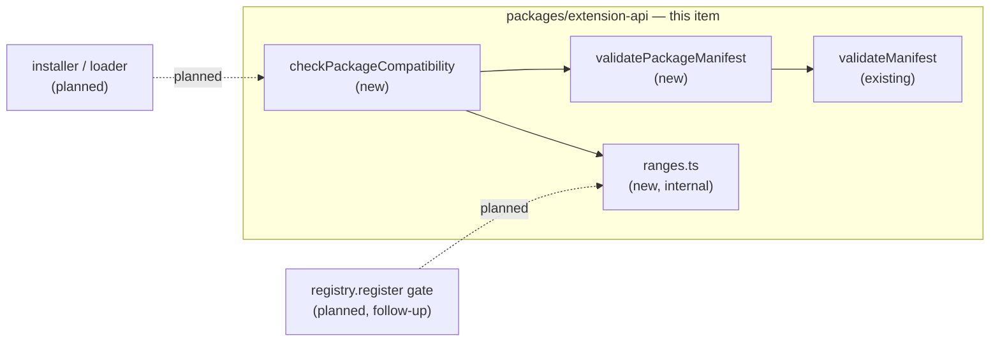

# Extension Package Manifest — the installable package's identity, compatibility and entrypoint

> Slug: `extension-package-manifest` · Status: **designed, awaiting implementation** · Epic 1
> (Extension Runtime). This spec covers **only the manifest document and the pure decision
> function that reads it**. It ships no consumer: the installer, the loader, the trust model and
> the gallery are later items (§ Non-goals), and so is enforcing compatibility on the extensions
> compiled into the cockpit. Delivery: one PR to `main`.

## 📝 TLDR

Every extension Cezar runs today is compiled in: `BUILTIN_EXTENSIONS`
(`packages/web/src/extensions/builtin-extensions.ts`) is a static — and currently empty — array of
`Extension` objects. There is no file format describing an extension as a *thing you install*. The
nearest artifact is `ExtensionManifest` (`packages/extension-api/src/manifest.ts`), a TypeScript
object an extension module builds at load time, so reading it means running the extension's code.

The proposal adds `cezar.extension.json`: a package-root JSON document naming an extension's
identity, the contract generation it was compiled against (`cezar.apiVersion`), the Cezar releases
it supports (`engines.cezar`), its frontend entrypoint path and the permissions it requests — plus
a pure, dependency-free validator and compatibility check in `@open-mercato/cezar-extension-api`
that reads it **without executing a line of the extension**.

It is deliberately a **contract with no consumer yet**, the way the extension API package itself
shipped (spec `2026-09-18-extension-api-package`, Q6). Nothing installs a package, so nothing
rejects one on screen; what this item delivers is the decision — a function that says *no* with a
named reason, unit-tested against real manifest documents — so the installer that follows applies
a reviewed rule instead of inventing one inside a security-sensitive PR.

## Resolved assumptions (autonomous defaults)

The brief left these open. Each is the most reversible choice available; all are safe to override
before merge — `packages/extension-api` is private, has no npm consumers, and no package can be
installed yet, so nothing in the wild depends on the format.

| # | Question | Applied default | Why |
|---|---|---|---|
| Q1 | Is the package manifest a **new** document, or the existing `ExtensionManifest` written down? | **One document, a superset.** `cezar.extension.json` is an `ExtensionManifest` (`id`, `name`, `version`, `description?`, `author?`, `engines`, `permissions?`) plus the package-only keys `cezar`, `entrypoints`, `homepage?`, `repository?`. `validatePackageManifest` calls `validateManifest` and adds the package rules. | AGENTS.md § Task routing makes the extension API the one place manifest rules live; a second document would be a second source of truth that drifts. `validateManifest` already ignores unknown keys, so it accepts the superset unchanged. |
| Q2 | The brief asks for `cezar.apiVersion`; the repo already has `engines.cezar`. One, or both? | **Both, with disjoint jobs.** `cezar.apiVersion` is a required integer naming the extension-contract *generation* the package was compiled against, and is the first gate. `engines.cezar` is the semver range over the Cezar *release*, and the second. | They answer different questions: "can this host call this code at all" (an integer — no semver logic, no knowledge of the product version) versus "did the author bless this release". Chrome ships exactly this pair (`manifest_version` + `minimum_chrome_version`), as does Zed (`schema_version` + a version range). Reversible: no package exists to break. |
| Q3 | What happens when `engines.cezar` uses a range form the checker cannot parse? | **Reject, fail closed** (`unsupported-range`), with a message naming the supported grammar. | The alternative is admitting code the author never blessed. Widening the grammar later is additive; narrowing it later would break installed packages. |
| Q4 | File name and location | **`cezar.extension.json` at the package root**, not a `cezar` field inside `package.json`. `$schema` is accepted and ignored. | A package need not be an npm package — a folder or a zip is enough — and a dedicated file keeps the whole validated document in one read. |
| Q5 | Does this item ship a consumer — the installer, or a gate on the cockpit's registry? | **Neither.** It ships the format and the decision function only. | The installer carries remote code and the trust model, and is its own item. A gate on `registry.register` is a *different capability* with a different subject: that call receives an `ExtensionManifest` from `defineExtension`, which by Q1 has no `cezar.apiVersion` and no `entrypoints`, so this validator would refuse every compiled-in extension as malformed. Enforcing `engines.cezar` there fixes a separate unkept promise and gets its own spec (§ Follow-ups). |
| Q6 | `entrypoints.backend` — validate now, or leave out? | **Leave out.** `entrypoints` requires `frontend` and ignores everything else, as an unknown key. | The brief itself lists a backend entrypoint under *optionally later*, and unknown keys are ignored, so adding it later is additive. Reserving validation now protects an author who cannot publish anything yet. |
| Q7 | A top-level `publisher` field? | **No.** The publisher is the first segment of `id` (`vendor.extension`), which `isValidExtensionId` already enforces. | A separate field would be a second spelling of the same fact, and the two would disagree. |
| Q8 | A `checksum` field? | **No.** Integrity belongs to the install/transport item — a detached signature or a lockfile entry, not a self-attested number inside the file it claims to cover. | A checksum a package writes about itself proves nothing an attacker who rewrote the package cannot rewrite too. Grafana's precedent is a separate, signed `MANIFEST.txt`. |
| Q9 | The Definition of Done asks that "JSON/schema validation exists". Does that mean a JSON Schema *document*? | **No — `validatePackageManifest` is the schema**, and it is the authoritative one. A Draft 2020-12 document for editor completion is deferred to the installer item. | The package has zero runtime dependencies, so a schema library cannot be the validator; a second, explicitly non-authoritative copy of the rules would need a parity test, an `ajv` devDependency and a new published directory to serve authors who cannot install a package yet. Additive later. |
| Q10 | A pre-release host release (`0.12.0-rc.1`) against `^0.12.0` — satisfied? | **Yes: the host release's pre-release tag is stripped before the range test.** | npm's pre-release rule exists to stop a *dependency* pre-release being picked up silently; here the *host* is the pre-release, and applying the rule literally would refuse every extension on every RC build, making RCs untestable. |

## 📝 Problem Statement

The Definition of Done asks for three things Cezar cannot do today.

- **Validate a manifest without executing extension code.** The only manifest that exists is the
  object literal inside `defineExtension({ manifest, activate })`. Reading it means importing the
  extension's module, which runs its top-level code. That is fine for an extension compiled into
  the cockpit and unacceptable for one a user is about to install: the decision to run the code
  must be made *before* the code runs.
- **Have a schema to validate against.** `validateManifest` covers `id`, `name`, `version`,
  `engines.cezar` and `permissions` — it does not describe a package. Nothing says where the code
  is (`entrypoints`), and nothing says which generation of the contract it was built against.
  `packages/contract` solves this class of problem with zod, but the extension API has **zero
  runtime dependencies** by construction (AGENTS.md § Repository layout), so its validator is
  hand-written in the style of `validateManifest` and `checkComponentCompatibility`.
- **Reject an incompatible package.** There is no function that answers "can this Cezar run this
  package", so an installer would have to invent one — inside the PR that also downloads and
  executes third-party code, which is the worst place to review a compatibility rule for the first
  time. Nothing in the repository can evaluate a version range either: the only version logic is
  `packages/cezar/src/update-check.ts`, a Node-side numeric compare that documents itself as
  ignoring pre-release tags.

## 📝 Proposed Solution

### The document

`cezar.extension.json`, UTF-8 JSON, at the package root:

```json
{
  "id": "acme.compact-tasks",
  "name": "Compact Tasks",
  "version": "1.4.0",
  "description": "A one-row task header.",
  "author": "Acme",
  "homepage": "https://acme.example/compact-tasks",
  "repository": "https://github.com/acme/compact-tasks",
  "cezar": { "apiVersion": 1 },
  "engines": { "cezar": "^0.12.0" },
  "entrypoints": { "frontend": "./dist/frontend.js" },
  "permissions": ["ui.components", "commands.execute"]
}
```

`id`, `name`, `version`, `engines`, `description`, `author` and `permissions` keep exactly the
rules `validateManifest` already enforces. The package-only keys:

| Key | Required | Rule |
|---|---|---|
| `cezar` | yes | An object. Its own unknown keys are ignored. |
| `cezar.apiVersion` | yes | An integer `1 ≤ n ≤ 1000`. `"1"`, non-integers, `NaN`, `Infinity` and negatives are rejected. |
| `entrypoints` | yes | An object. Unknown keys — `backend` among them (Q6) — are ignored. |
| `entrypoints.frontend` | yes | A package-relative path (grammar below). |
| `homepage` | no | An absolute `https:` URL, at most 2048 characters. |
| `repository` | no | Same. |

**Entrypoint path grammar.** A value must start `./`, be at most 256 characters, consist of
`/`-joined segments of `[A-Za-z0-9._-]+`, contain no `.` or `..` segment and no empty segment, and
end in `.js` or `.mjs`. Backslashes, a leading `/`, a `~`, a `%` and anything containing `:` are
rejected. This makes path traversal a **format** error — decided in a pure function, before any
filesystem call, in a package that cannot make one. The rule judges the *spelling*, not the
resolved path, so `./a/../b.js` is refused even though it normalizes inside the package: that
keeps the check honest without a path library, which this package may not import.

Unknown top-level keys are ignored, exactly as `validateManifest` ignores them, so a manifest
written for a newer Cezar still validates here and `cezar.apiVersion` alone decides whether it
runs. `$schema` is such a key.

### The decision

`packages/extension-api/src/package-manifest.ts` adds three runtime exports:

```ts
/** The contract generation this package implements. A host's supported set usually contains it. */
export const EXTENSION_API_VERSION = 1

/** `[]` means valid. Pure and total, like `validateManifest`, whose issues it returns first. */
export function validatePackageManifest(value: unknown): ManifestIssue[]

export function checkPackageCompatibility(
  manifest: unknown,
  host: { readonly apiVersions: readonly number[]; readonly release: string },
): PackageCompatibility
```

`PackageCompatibility` mirrors `ComponentCompatibility`: a frozen `{ compatible, issues }` where
`compatible` is `true` exactly when `issues` is empty, and each issue carries a code the caller can
branch on and a message a human can act on.

```ts
export type PackageCompatibilityIssue =
  | { readonly code: 'malformed'; readonly message: string; readonly path: string }
  | { readonly code: 'unsupported-api-version'; readonly message: string
      readonly expected: readonly number[]; readonly actual: number }
  | { readonly code: 'unsupported-range'; readonly message: string; readonly actual: string }
  | { readonly code: 'release-out-of-range'; readonly message: string
      readonly expected: string; readonly actual: string }
```

The rules run in order and each gates the next, the way `checkComponentCompatibility` does:

1. a `host` that is not `{ apiVersions: number[], release: <semver> }` is `malformed` at
   `host.release` / `host.apiVersions`, and nothing is compared;
2. every issue from `validatePackageManifest` becomes one `malformed` issue, and the check stops —
   a manifest whose shape is unknown cannot be reasoned about;
3. `cezar.apiVersion` outside `host.apiVersions` is `unsupported-api-version`, and the check stops,
   because a package built against another generation may mean anything by its other fields;
4. an `engines.cezar` range outside the supported grammar is `unsupported-range`, and stops;
5. a `host.release` the range does not admit is `release-out-of-range`.

Pure, total, never throws, never calls a method on its input — the guarantees the sibling checkers
give, and the reason this function can be the installer's gate without the installer trusting the
package it is reading.

### The range engine

This is the largest and least obvious piece, and the zero-runtime-dependency rule forces it to be
written here: there is no `semver` dependency anywhere in the repository, and
`packages/cezar/src/update-check.ts` is Node-side and deliberately pre-release-blind. It lives in
an internal `src/ranges.ts` — not barrel-exported, since a file is not public until `src/index.ts`
re-exports it — so the follow-up that enforces `engines.cezar` on compiled-in extensions reuses one
implementation rather than growing a second.

Two functions: `parseRange(text): ComparatorSet[] | null` and
`satisfies(version, sets): boolean`. The supported grammar is the subset that covers how this repo
and its extensions pin:

| Form | Example | Meaning |
|---|---|---|
| bare / `=` | `0.12.0` | exactly that version |
| `^` | `^0.12.0` | npm's **0.x rule**: `>=0.12.0 <0.13.0`, not `<1.0.0` |
| `~` | `~0.12.3` | `>=0.12.3 <0.13.0` |
| `>` `>=` `<` `<=` | `>=0.12.0` | ordinary comparison |
| partial / placeholder | `0.12`, `0`, `0.12.x`, `*` | the missing positions are unbounded |
| AND | `>=0.12.0 <0.14.0` | every comparator holds |
| OR | `^0.12.0 \|\| ^0.13.0` | any set holds |

Bounds: the range string is already capped at 64 characters by `validateManifest`, and at most 8
comparator sets are parsed. **Hyphen ranges (`0.12.0 - 0.14.0`) are not supported** — they are legal
npm and produce `unsupported-range` naming the forms that are (Q3). `parseRange` returns `null` for
anything it does not understand rather than guessing, and the candidate version's pre-release tag is
stripped before comparison (Q10); build metadata is ignored, as semver requires. A manifest's own
`version` is untouched by any of this — it is compared to nothing.

### Alternatives considered

- **`engines.cezar` alone, no `apiVersion`.** Fewer fields, but every Cezar minor invalidates every
  published range while the product is 0.x, and a host cannot decide "can I call this code" without
  knowing its own release string — which, in the browser, it learns asynchronously from
  `/api/v1/health`.
- **`apiVersion` alone, `engines.cezar` advisory.** Half the code, and it drops the range engine.
  Rejected because an advisory field is precisely the knob that does nothing AGENTS.md § Zero config
  warns against, and because `ExtensionManifest` already documents `engines.cezar` as a refusal.
- **A `contributes` block (VS Code).** Declarative contributions enable lazy activation, which Cezar
  deliberately does not have: spec `2026-09-18-extension-api-package` Q5 chose imperative
  registration in `activate`. Unchanged here; `contributes` stays additive and unclaimed.
- **A fixed entrypoint filename (Obsidian's `main.js`).** Removes a field, but forecloses the backend
  entrypoint the brief anticipates and fights every bundler's output layout.

## 📝 Architecture



Everything this item ships is pure and inside one package. The dotted edges are the two planned
consumers, and the shape of the diagram is the argument for the split: the installer reads a
**package document** and wants the whole of `checkPackageCompatibility`; the registry follow-up
holds an **`ExtensionManifest`** — no `cezar.apiVersion`, no `entrypoints` — and wants only the
range engine. Handing the registry this validator would refuse every compiled-in extension as
malformed, which is why `ranges.ts` is a module and not an inlined helper.

Nothing here reads the filesystem: the package is Node-free, so the reader that turns bytes into a
value — `readFile`, a size cap, `JSON.parse` — belongs to whichever host does the installing. This
spec fixes only that reader's output and the verdict taken from it.

## 📝 API Contracts

No HTTP route changes and no persisted state: the decision is a pure function, and nothing in
`.ai/cezar/` or `~/.cezar/` gains a file. The contract that changes is the extension API's runtime
surface, which `test/surface.test.ts` pins as an exact list; `EXTENSION_API_VERSION`,
`validatePackageManifest` and `checkPackageCompatibility` join it in the same PR, a deliberate edit
by that test's own rule. Types added to the barrel: `ExtensionPackageManifest`,
`PackageCompatibility`, `PackageCompatibilityIssue`, `HostIdentity`.

Evolution is additive on both sides. An older Cezar reading a newer manifest ignores its unknown
keys and decides on `cezar.apiVersion`; a newer Cezar reading an older manifest sees every field it
knows. A second generation raises `EXTENSION_API_VERSION` to `2`, and a host that still runs
generation-1 packages ships `apiVersions: [1, 2]`.

## 📝 Edge Cases & Failure Scenarios

`validatePackageManifest` delegates to `validateManifest` and inherits its totality guarantees —
non-object inputs, and an object whose fields throw when read, are already specified and tested
(`packages/extension-api/test/manifest.test.ts`). What is new:

| Input | Result |
|---|---|
| `{}` | one issue per missing field — `id`, `name`, `version`, `engines`, `cezar.apiVersion`, `entrypoints.frontend` — all of them, not the first. |
| `{"cezar": {"apiVersion": "1"}}` | rejected: a string is not an integer. So are `1.5`, `0`, `-1`, `NaN` and `Infinity`. |
| `entrypoints.frontend: "../../etc/passwd"`, `"./a/../b.js"`, `"/abs/x.js"`, `"x.js"` | rejected — traversal, traversal, absolute, missing `./`. |
| `entrypoints.frontend: "https://cdn.example/x.js"` | rejected — contains `:` and does not start `./`. Remote code is the loader's decision, not a manifest's. |
| `{"cezar": {"__proto__": {"apiVersion": 1}}}` | `JSON.parse` makes `__proto__` an own property; the validator reads named keys and never spreads, assigns or merges, so it is simply an unknown key and `apiVersion` is still missing. Pinned by a test. |
| `cezar.apiVersion: 2`, host `[1]` | `unsupported-api-version`, message naming what the host supports. |
| `engines.cezar: "0.12.0 - 0.14.0"` | `unsupported-range`, message naming the supported forms. |
| `engines.cezar: "^0.12.0"`, host `0.12.0-rc.1` | compatible — the pre-release tag is stripped first (Q10). |
| `engines.cezar: "^0.12.0"`, host `0.13.0` | `release-out-of-range`. The honest cost of npm's 0.x `^` rule: an extension stops loading on the next minor unless its author widens the range. Reading `^0.x` as `>=0.x` instead would admit extensions into releases their author never saw. |
| `host.apiVersions: []` | everything is `unsupported-api-version`. A legal host that loads nothing. |

## 📝 Risks & Impact Review

- **This manifest establishes identity and compatibility — never trust.** It carries no signature,
  no provenance and (Q8) no checksum, and a package author writes every byte of it. Nothing here
  makes it safe to execute a downloaded extension, and a validated manifest format must not be read
  as approval to load one. The installer item owns the trust model, and that is the gate the
  decision belongs to.
- **Two compatibility fields is the direction call.** If the project wants one, the time to say so
  is before the installer ships: `packages/extension-api` is private, no package can be installed,
  and removing either field costs an afternoon. Afterwards the format is a third-party contract and
  `BACKWARD_COMPATIBILITY.md` gains a section for it.
- **A hand-written range engine is the real risk in this item**, not the field list. It is ~100 lines
  of version comparison that nothing else in the repository can check it against, and a wrong `^` on
  a 0.x product silently admits or refuses whole releases. It is why the plan gives it two steps and
  a table-driven test, and why it is a module the follow-up reuses rather than reimplements.
- **Fail-closed ranges can refuse a valid npm range.** A hyphen range is legal npm and refused here.
  The message names the supported forms, and widening the grammar later is additive; the reverse
  would not be.
- **Rollback.** Everything is new, pure and unreferenced: reverting is deleting two files and four
  lines of the barrel. No state is written, so there is nothing to migrate back.
- **Not checked, and worth saying plainly.** No package has been installed, because nothing can
  install one. The claim this item can prove is that the decision function accepts and refuses the
  right documents, which is unit-testable; the claim it cannot prove is that a real package is
  rejected end to end. Whether `engines.cezar` enforcement is the right default for a 0.x product is
  a direction call, named above, not a defect.

## 📝 Non-goals

The installer and the on-disk package layout; downloading, unpacking or caching; signatures,
provenance or a checksum (Q8); the trust or permission-approval UI; dynamic `import()` of
`entrypoints.frontend`; a backend host or `entrypoints.backend` (Q6); a gallery or registry; a JSON
Schema document (Q9); the `cez ext verify <dir>` author command, a CLI surface under
`BACKWARD_COMPATIBILITY.md` § 1 that belongs with the installer that gives it something to verify;
a `BACKWARD_COMPATIBILITY.md` section for the format, which the installer adds when the format
acquires third-party consumers.

### Follow-ups this item deliberately does not do

- **`enforce-host-compatibility-on-registration`.** `ExtensionManifest` documents `engines.cezar` as
  *"The host refuses to activate outside it"*, and no host code does — a grep for `engines` across
  `packages/web/src` and `packages/cezar/src` finds only test fixtures. Fixing that is a separate
  capability with its own surface: a required host identity on `ExtensionRegistryOptions` (a
  breaking change to the registry's construction API, three call sites), a build-time
  `__CEZAR_RELEASE__` in `packages/web/vite.config.ts`, and migrating `registry.fixtures.ts` off its
  `^0.11.0` pin so the suite is not a per-minor release chore. It reuses `ranges.ts` and none of the
  package rules.
- **The installer**, which is what makes this format observable to a user.

## 📋 Phasing

One phase — the format and its decision — delivered in five steps. The item is a single
independently deployable capability and is inert on merge: new exports that nothing calls.

## 📋 Implementation Plan

1. **`src/ranges.ts`, parsing.** `parseRange(text): ComparatorSet[] | null` over the grammar table
   above, with the 64-character and 8-set caps. `test/ranges.test.ts` drives a table: each
   comparator, partials and placeholders, `||`, both caps, and `null` for hyphen ranges, an empty
   string, and junk.
2. **`src/ranges.ts`, satisfaction.** `satisfies(version, sets)`, including the 0.x `^` rule, `~`,
   pre-release stripping and ignored build metadata. Table-driven tests pair each range with
   versions that must and must not satisfy it; the `^0.12.0` row pins `0.12.9` in and `0.13.0` out,
   which is the rule most likely to be got wrong.
3. **`src/package-manifest.ts`, the format.** `ExtensionPackageManifest`, `EXTENSION_API_VERSION`
   and `validatePackageManifest` — delegating to `validateManifest`, then the `cezar`,
   `entrypoints`, `homepage` and `repository` rules. `test/package-manifest.test.ts` covers the
   key table, every entrypoint-grammar rejection, the `__proto__` case, and that unknown keys
   (`$schema`, `entrypoints.backend`) are ignored.
4. **`src/package-manifest.ts`, the verdict.** `PackageCompatibility`, `PackageCompatibilityIssue`,
   `HostIdentity` and `checkPackageCompatibility` with the five ordered rules. Tests assert the
   gating (a malformed manifest yields no version issues), the frozen result, and that it never
   throws on a throwing getter or a revoked proxy.
5. **Publish the surface.** Re-export the three runtime names and four types from `src/index.ts`,
   extend the exact list in `test/surface.test.ts`, add a README section showing the document and
   the two gates, and add `examples/hello-extension/cezar.extension.json` as the worked example.

Each step leaves the application working, because none of them is reachable from it: steps 1–4 add
unreferenced modules, and step 5 widens a barrel nothing imports yet.

## 🧪 Validation

The repository gate covers every step, and there is no UI, so no browser evidence applies. Each
step above names the test that proves it. Two disciplines matter more than usual here: the range
tests must be written as a table of `(range, version, expected)` rows rather than as assertions
about the parser's internals, so the engine can be rewritten without rewriting its proof; and,
per AGENTS.md, a test written after a diagnosis passes against the bug more often than anyone
expects — each rejection test should be confirmed red against a validator that does not yet know
the rule.
