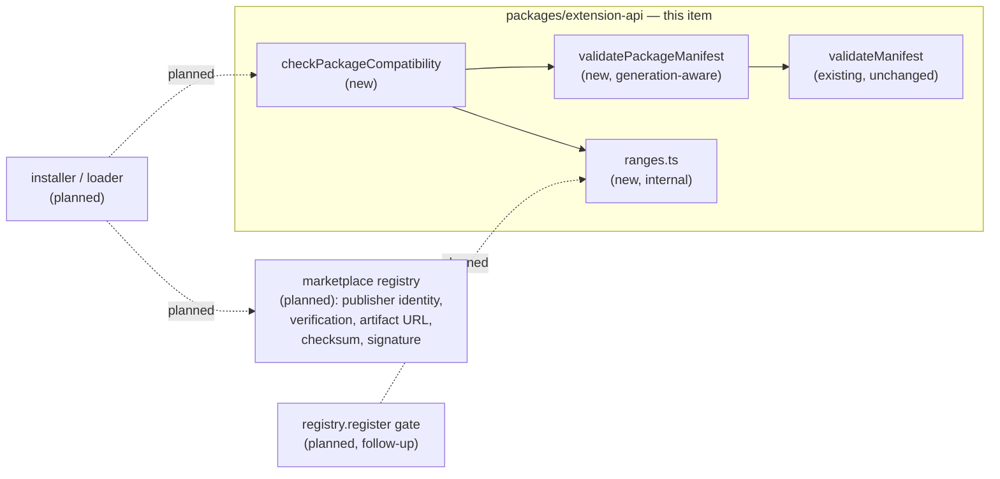

# Extension Package Manifest — the installable package's identity, compatibility and entrypoint

> Slug: `extension-package-manifest` · Status: **designed, awaiting implementation** · Epic 1
> (Extension Runtime). This spec covers **only the manifest document and the pure decision
> function that reads it**. It ships no consumer: the installer, the loader, the trust model and
> the marketplace registry are later items (§ Non-goals), and so is enforcing compatibility on the
> extensions compiled into the cockpit. Delivery: one PR to `main`.

## 📝 TLDR

Every extension Cezar runs today is compiled in: `BUILTIN_EXTENSIONS`
(`packages/web/src/extensions/builtin-extensions.ts`) is a static — and currently empty — array of
`Extension` objects. There is no file format describing an extension as a *thing you install*. The
nearest artifact is `ExtensionManifest` (`packages/extension-api/src/manifest.ts`), a TypeScript
object an extension module builds at load time, so reading it means running the extension's code.

The proposal adds `cezar.extension.json`: the **distribution representation of the same model** —
not a second, independent one — naming an extension's identity, the contract generation it was
compiled against (`cezar.apiVersion`), the Cezar releases it supports (`engines.cezar`), its
entrypoint paths and the permissions it requests, plus a pure, dependency-free validator and
compatibility verdict that read it **without executing a line of the extension**.

Two principles run through every rule below. **Fail closed**: an input the checker does not
understand is a refusal, never a benefit of the doubt. And **the manifest says only what the
extension claims about itself** — what trusted infrastructure knows about it (publisher identity,
verification, artifact URL, checksum, signature) belongs to the marketplace registry, not here.

It is deliberately a **contract with no consumer yet**, the way the extension API package itself
shipped (spec `2026-09-18-extension-api-package`, Q6). Nothing installs a package, so nothing
rejects one on screen; what this item delivers is the decision — a function that says *no* with a
named reason, unit-tested against real manifest documents — so the installer that follows applies
a reviewed rule instead of inventing one inside a security-sensitive PR.

## Resolved assumptions (autonomous defaults)

The brief left ten decisions open; the autonomous run answered them, and the review on PR #63
confirmed Q1–Q5 and Q8 and corrected Q6, Q7, Q9 and Q10. The **Decided by** column says which is
which — a row marked *review* is an owner decision, not an assumption, and the spec below
implements the corrected answer.

| # | Question | Applied answer | Why | Decided by |
|---|---|---|---|---|
| Q1 | New document, or the existing `ExtensionManifest` written down? | **One model, two representations.** `cezar.extension.json` is the distribution form of `ExtensionManifest` (`id`, `name`, `version`, `description?`, `author?`, `engines`, `permissions?`) plus the package-only keys `cezar`, `entrypoints`, `homepage?`, `repository?`. | AGENTS.md § Task routing makes the extension API the one place manifest rules live; a second, independent model would drift from the first. | autonomous, confirmed |
| Q2 | `cezar.apiVersion` **and** `engines.cezar`, or one? | **Both, disjoint jobs.** `apiVersion` is extension-API compatibility — an integer generation gate needing no semver logic and no knowledge of the product version. `engines.cezar` is product-release compatibility. | They answer different questions, and the two failure modes deserve different messages. Chrome ships the pair (`manifest_version` + `minimum_chrome_version`), as does Zed (`schema_version` + a range). | autonomous, confirmed |
| Q3 | An `engines.cezar` range the checker cannot parse? | **Reject, fail closed**, naming the supported grammar. | An unknown range must never be read in the extension's favour. Widening the grammar later is additive; narrowing it would break installed packages. | autonomous, confirmed |
| Q4 | File name and location | **`cezar.extension.json` at the package root**, not a `package.json` field. | A package may ship as a GitHub release, a `.tgz` or a marketplace artifact; tying the format to npm would rule those out. | autonomous, confirmed |
| Q5 | Ship a consumer — the installer, or a registry gate? | **Neither.** Format plus validation and the compatibility decision; no loader, no installer. | Keeps the boundary between items clean. It is also a correctness matter: `registry.register` receives an `ExtensionManifest`, which has no `cezar.apiVersion` and no `entrypoints`, so this validator would refuse every compiled-in extension as malformed. | autonomous, confirmed |
| Q6 | Validate `entrypoints.backend` now, and what happens to unknown keys? | **Corrected — strict where it matters.** `backend` is reserved **and validated** as a path today. `cezar`, `entrypoints` and `permissions` reject unknown members; only top-level metadata stays liberal. A host that cannot run a declared entrypoint says so explicitly. | "Unknown keys are ignored" as a blanket rule lets `{"entrypoints": {"fronted": "./index.js"}}` pass validation with the author's typo intact. Strictness belongs in the sections where a typo is silent and costly. | **review** |
| Q7 | A `publisher` field? | **Corrected — no field, and no claim either.** `id`'s first segment (`acme` in `acme.jira`) is an extension **namespace**. Publisher identity — verification, display name, ownership — is marketplace-registry data and is not modelled here at all. | Not repeating part of `id` was right; calling that segment "the publisher" was not. A self-declared string is not an identity, and treating it as one invites trusting it later. | **review** |
| Q8 | A `checksum` field? | **No.** Integrity comes from the registry: artifact URL + `sha256` → download → compute → compare, with a publisher signature layered on later. | A checksum inside the artifact it claims to protect proves nothing to an attacker who rewrote the artifact. Owned by the marketplace/installer item, not this one. | autonomous, confirmed |
| Q9 | Does the DoD's "JSON/schema validation" mean a JSON Schema document? | **Not in this item** — `validatePackageManifest` is the authority. When a schema document does land it must be **generated** from that definition, never hand-maintained. | Zero runtime dependencies rules out a schema library as the validator, and a hand-written copy would be a second source of truth. A generated artifact serves IDE completion, CI and third-party manifest editors without becoming one. | autonomous, **corrected rationale by review** |
| Q10 | A pre-release host (`0.12.0-rc.1`) against `^0.12.0` — satisfied? | **Corrected — no.** Strict semver, npm's pre-release rule, nothing stripped: `^0.12.0` does not admit `0.12.0-rc.1`. An author who supports release candidates writes `>=0.12.0-rc.1 <0.13.0`. | `^0.12.0` claims "written against the stable 0.12 API"; an RC may still break before `0.12.0`. Normalising the tag away silently converts an explicit opt-in into a default, which is exactly what fail-closed exists to prevent. | **review** |

## 📝 Problem Statement

The Definition of Done asks for three things Cezar cannot do today.

- **Validate a manifest without executing extension code.** The only manifest that exists is the
  object literal inside `defineExtension({ manifest, activate })`. Reading it means importing the
  extension's module, which runs its top-level code. That is fine for an extension compiled into
  the cockpit and unacceptable for one a user is about to install: the decision to run the code
  must be made *before* the code runs.
- **Have a schema to validate against.** `validateManifest` covers `id`, `name`, `version`,
  `engines.cezar` and `permissions` — it does not describe a package. Nothing says where the code
  is (`entrypoints`), and nothing says which generation of the contract it was built against.
  `packages/contract` solves this class of problem with zod, but the extension API has **zero
  runtime dependencies** by construction (AGENTS.md § Repository layout), so its validator is
  hand-written in the style of `validateManifest` and `checkComponentCompatibility`.
- **Reject an incompatible package.** No function answers "can this Cezar run this package", so an
  installer would have to invent one — inside the PR that also downloads and executes third-party
  code, the worst place to review a compatibility rule for the first time. Nothing in the
  repository can evaluate a version range either: the only version logic is
  `packages/cezar/src/update-check.ts`, a Node-side numeric compare that documents itself as
  ignoring pre-release tags — precisely the behaviour Q10 rules out.

## 📝 Proposed Solution

### The document

`cezar.extension.json`, UTF-8 JSON, at the package root:

```json
{
  "id": "acme.jira",
  "name": "Jira Integration",
  "version": "1.3.0",
  "description": "Issues and transitions on the task header.",
  "author": "ACME Corp",
  "homepage": "https://acme.example/jira",
  "repository": "https://github.com/acme/cezar-jira",
  "cezar": { "apiVersion": 1 },
  "engines": { "cezar": "^0.12.0" },
  "entrypoints": { "frontend": "./dist/frontend.js" },
  "permissions": ["ui.components", "commands.execute", "storage", "network"]
}
```

`id`, `name`, `version`, `engines`, `description`, `author` and the permission-name grammar keep
exactly the rules `validateManifest` already enforces. The package-only keys:

| Key | Required | Rule |
|---|---|---|
| `cezar` | yes | An object, **strict**: `apiVersion` and nothing else. |
| `cezar.apiVersion` | yes | An integer `1 ≤ n ≤ 1000`. `"1"`, non-integers, `NaN`, `Infinity` and negatives are rejected. |
| `entrypoints` | yes | An object, **strict**: `frontend` and `backend`, nothing else. |
| `entrypoints.frontend` | yes | A package-relative path (grammar below). |
| `entrypoints.backend` | no | Same grammar, **reserved**: validated today, run by no Cezar yet. |
| `permissions` | no | **Strict**: every entry must be a permission this generation defines. |
| `homepage` | no | An absolute `https:` URL, at most 2048 characters. |
| `repository` | no | Same. |

`id` is an extension **namespace** (`acme.jira`), not an identity claim (Q7). Nothing in the
document is evidence about its author; a marketplace registry is where verification, ownership and
display names live, beside the artifact URL, checksum and signature of Q8.

**Entrypoint path grammar.** A value must start `./`, be at most 256 characters, consist of
`/`-joined segments of `[A-Za-z0-9._-]+`, contain no `.` or `..` segment and no empty segment, and
end in `.js` or `.mjs`. Backslashes, a leading `/`, a `~`, a `%` and anything containing `:` are
rejected. This makes path traversal a **format** error — decided in a pure function, before any
filesystem call, in a package that cannot make one. The rule judges the *spelling*, not the
resolved path, so `./a/../b.js` is refused even though it normalizes inside the package: that keeps
the check honest without a path library, which this package may not import.

### Strictness, and how the format still evolves

Unknown keys are ignored at the **top level** — that is where an older Cezar meets a newer
manifest's metadata, and where `$schema` lives. Inside `cezar`, `entrypoints` and `permissions` an
unknown member is an **error** (Q6): those are the sections where a typo is both easy and silent.
`{"entrypoints": {"fronted": "./index.js"}}` must not validate — under the liberal rule it would
pass, and the author would learn about it from a user.

Strictness and forward compatibility are reconciled by the generation, not by leniency:

> The strict-member rules apply **only when `cezar.apiVersion` equals the generation this validator
> implements** (`EXTENSION_API_VERSION`). For any other generation the validator cannot know the
> member set, so it skips those rules and reports nothing about them; `checkPackageCompatibility`
> then refuses the package with `unsupported-api-version`, which is the accurate message.

So a generation-2 manifest adding `cezar.allowPrerelease` is refused by a generation-1 Cezar for the
right reason — *"this Cezar implements extension API 1"* — rather than for a misleading *"unknown
key `allowPrerelease`"*, and generation-1 authors still get their typos caught. This is also the
mechanism by which the `allowPrerelease` escape hatch Q10 mentions could arrive additively.

One deliberate asymmetry: `validateManifest` keeps checking only the *grammar* of permission names,
because it also governs compiled-in extensions through `defineExtension`, and the registry's policy
for an unsupported permission is to record it and keep booting (AGENTS.md § Extension Permission
Model). `validatePackageManifest` adds the known-name check on top. A package is admitted before its
code has run, so it is held to the stricter bar; nothing about the existing function changes.

### The decision

`packages/extension-api/src/package-manifest.ts` adds three runtime exports:

```ts
/** The contract generation this package implements. A host's supported set usually contains it. */
export const EXTENSION_API_VERSION = 1

/** `[]` means valid. Pure and total, like `validateManifest`, whose issues it returns first. */
export function validatePackageManifest(value: unknown): ManifestIssue[]

export function checkPackageCompatibility(
  manifest: unknown,
  host: {
    readonly apiVersions: readonly number[]
    readonly release: string
    /** Which entrypoint kinds this host can actually run — today `['frontend']`. */
    readonly entrypoints: readonly ('frontend' | 'backend')[]
  },
): PackageCompatibility
```

`PackageCompatibility` mirrors `ComponentCompatibility`: a frozen `{ compatible, issues }` where
`compatible` is `true` exactly when `issues` is empty, and each issue carries a code the caller can
branch on and a message a human can act on.

```ts
export type PackageCompatibilityIssue =
  | { readonly code: 'malformed'; readonly message: string; readonly path: string }
  | { readonly code: 'unsupported-api-version'; readonly message: string
      readonly expected: readonly number[]; readonly actual: number }
  | { readonly code: 'unsupported-range'; readonly message: string; readonly actual: string }
  | { readonly code: 'release-out-of-range'; readonly message: string
      readonly expected: string; readonly actual: string }
  | { readonly code: 'unsupported-entrypoint'; readonly message: string
      readonly kind: 'frontend' | 'backend' }
```

The rules run in order and each gates the next, the way `checkComponentCompatibility` does:

1. a `host` that is not `{ apiVersions: number[], release: <semver>, entrypoints: […] }` is
   `malformed` at the offending path, and nothing is compared;
2. every issue from `validatePackageManifest` becomes one `malformed` issue, and the check stops —
   a manifest whose shape is unknown cannot be reasoned about;
3. `cezar.apiVersion` outside `host.apiVersions` is `unsupported-api-version`, and the check stops,
   because a package built against another generation may mean anything by its other fields;
4. an `engines.cezar` range outside the supported grammar is `unsupported-range`, and stops;
5. a `host.release` the range does not admit is `release-out-of-range`;
6. each declared entrypoint kind outside `host.entrypoints` is `unsupported-entrypoint` — today,
   any package declaring `entrypoints.backend`, with the message *"backend entrypoint is valid, but
   this Cezar version does not support backend extensions"* (Q6).

Rule 6 is a refusal, not a note: fail closed (Q3) means a package that asks for something this host
cannot provide is not run. Whether a backend entrypoint may ever be *optional* — a frontend-only
host activating the frontend half — is a loader policy question, and the loader item owns it.

Pure, total, never throws, never calls a method on its input — the guarantees the sibling checkers
give, and the reason this function can be the installer's gate without the installer trusting the
package it is reading.

### The range engine

This is the largest and least obvious piece, and the zero-runtime-dependency rule forces it to be
written here: there is no `semver` dependency anywhere in the repository. It lives in an internal
`src/ranges.ts` — not barrel-exported, since a file is not public until `src/index.ts` re-exports
it — so the follow-up that enforces `engines.cezar` on compiled-in extensions reuses one
implementation rather than growing a second.

Two functions: `parseRange(text): ComparatorSet[] | null` and `satisfies(version, sets): boolean`.
The supported grammar is the subset that covers how this repo and its extensions pin:

| Form | Example | Meaning |
|---|---|---|
| bare / `=` | `0.12.0` | exactly that version |
| `^` | `^0.12.0` | npm's **0.x rule**: `>=0.12.0 <0.13.0`, not `<1.0.0` |
| `~` | `~0.12.3` | `>=0.12.3 <0.13.0` |
| `>` `>=` `<` `<=` | `>=0.12.0` | ordinary comparison |
| partial / placeholder | `0.12`, `0`, `0.12.x`, `*` | the missing positions are unbounded |
| AND | `>=0.12.0-rc.1 <0.13.0` | every comparator holds |
| OR | `^0.12.0 \|\| ^0.13.0` | any set holds |

Bounds: the range string is already capped at 64 characters by `validateManifest`, and at most 8
comparator sets are parsed. **Hyphen ranges (`0.12.0 - 0.14.0`) are not supported** — they are legal
npm and produce `unsupported-range` naming the forms that are (Q3). `parseRange` returns `null` for
anything it does not understand rather than guessing.

**Pre-releases follow npm's rule exactly, and nothing is normalised away** (Q10). A pre-release
version satisfies a comparator set only when some comparator in that set names the same
`major.minor.patch` *and* itself carries a pre-release tag. So on a `0.12.0-rc.1` host an extension
pinned `^0.12.0` is `release-out-of-range`, and an author who means to support release candidates
opts in explicitly with `>=0.12.0-rc.1 <0.13.0`. Build metadata is ignored, as semver requires. A
manifest's own `version` is compared to nothing.

### Alternatives considered

- **`engines.cezar` alone, no `apiVersion`.** Fewer fields, but every Cezar minor invalidates every
  published range while the product is 0.x, and a host cannot decide "can I call this code" without
  knowing its own release string — which, in the browser, it learns asynchronously from
  `/api/v1/health`.
- **`apiVersion` alone, `engines.cezar` advisory.** Half the code, and it drops the range engine.
  Rejected because an advisory field is precisely the knob that does nothing AGENTS.md § Zero config
  warns against, and because `ExtensionManifest` already documents `engines.cezar` as a refusal.
- **Liberal unknown keys everywhere.** Simpler, additive by default, and the reason it was the
  autonomous answer — but it converts author typos in `entrypoints` and `permissions` into silent
  runtime surprises (Q6). The generation-aware strictness above buys the typo protection without
  giving up forward compatibility.
- **Normalising a pre-release host to its release version.** Keeps release candidates usable with
  ordinary ranges, which is why it was the autonomous answer — but it grants an opt-in nobody wrote
  and contradicts the fail-closed principle the rest of the design rests on (Q10).
- **A `contributes` block (VS Code).** Declarative contributions enable lazy activation, which Cezar
  deliberately does not have: spec `2026-09-18-extension-api-package` Q5 chose imperative
  registration in `activate`. Unchanged here; `contributes` stays additive and unclaimed.

## 📝 Architecture



Everything this item ships is pure and inside one package. The dotted edges are its planned
consumers, and the shape of the diagram carries two arguments. The **split between the manifest and
the registry** is Q7 and Q8 drawn: `cezar.extension.json` is what an extension claims about itself,
and the registry is what trusted infrastructure knows about it — so identity verification and
integrity hang off the installer's other edge, never off the document. The **split between the two
planned consumers** is why `ranges.ts` is a module: the installer reads a package document and wants
all of `checkPackageCompatibility`; the registry follow-up holds an `ExtensionManifest` — no
`cezar.apiVersion`, no `entrypoints` — and wants only the range engine. Handing the registry this
validator would refuse every compiled-in extension as malformed.

Nothing here reads the filesystem: the package is Node-free, so the reader that turns bytes into a
value — `readFile`, a size cap, `JSON.parse` — belongs to whichever host does the installing. This
spec fixes only that reader's output and the verdict taken from it.

## 📝 API Contracts

No HTTP route changes and no persisted state: the decision is a pure function, and nothing in
`.ai/cezar/` or `~/.cezar/` gains a file. The contract that changes is the extension API's runtime
surface, which `test/surface.test.ts` pins as an exact list; `EXTENSION_API_VERSION`,
`validatePackageManifest` and `checkPackageCompatibility` join it in the same PR, a deliberate edit
by that test's own rule. Types added to the barrel: `ExtensionPackageManifest`,
`PackageCompatibility`, `PackageCompatibilityIssue`, `HostIdentity`, `EntrypointKind`.

Evolution stays additive, carried by the generation rather than by leniency (§ Strictness). An older
Cezar reading a newer manifest ignores its unknown top-level metadata and refuses the package with
`unsupported-api-version` if the generation is one it does not implement. A newer Cezar reading an
older manifest sees every field it knows. A second generation raises `EXTENSION_API_VERSION` to `2`,
and a host that still runs generation-1 packages ships `apiVersions: [1, 2]`.

## 📝 Edge Cases & Failure Scenarios

`validatePackageManifest` delegates to `validateManifest` and inherits its totality guarantees —
non-object inputs, and an object whose fields throw when read, are already specified and tested
(`packages/extension-api/test/manifest.test.ts`). What is new:

| Input | Result |
|---|---|
| `{}` | one issue per missing field — `id`, `name`, `version`, `engines`, `cezar.apiVersion`, `entrypoints.frontend` — all of them, not the first. |
| `{"cezar": {"apiVersion": "1"}}` | rejected: a string is not an integer. So are `1.5`, `0`, `-1`, `NaN` and `Infinity`. |
| `{"entrypoints": {"fronted": "./index.js"}}` | rejected twice: `entrypoints.frontend` is missing, and `entrypoints.fronted` is an unknown member (Q6). Under the liberal rule this passed. |
| `{"cezar": {"apiVersion": 1, "allowPrerelease": true}}` | rejected — unknown member of a strict section at this generation. |
| `{"cezar": {"apiVersion": 2, "allowPrerelease": true}}` | **valid document**; the strict rules are skipped for a generation this validator does not implement. `checkPackageCompatibility` then reports `unsupported-api-version`. |
| `permissions: ["ui.componets"]` | rejected — not a permission this generation defines. `validateManifest` alone would have accepted the grammar. |
| `entrypoints.frontend: "../../etc/passwd"`, `"./a/../b.js"`, `"/abs/x.js"`, `"x.js"` | rejected — traversal, traversal, absolute, missing `./`. |
| `entrypoints.frontend: "https://cdn.example/x.js"` | rejected — contains `:` and does not start `./`. Remote code is the loader's decision, not a manifest's. |
| `entrypoints.backend: "./dist/backend.js"`, host `entrypoints: ['frontend']` | valid document, `unsupported-entrypoint`: *backend entrypoint is valid, but this Cezar version does not support backend extensions.* |
| `{"cezar": {"__proto__": {"apiVersion": 1}}}` | `JSON.parse` makes `__proto__` an own property; the validator reads named keys and never spreads, assigns or merges, so it is an unknown member of a strict section and `apiVersion` is still missing. Pinned by a test. |
| `cezar.apiVersion: 2`, host `[1]` | `unsupported-api-version`, message naming what the host supports. |
| `engines.cezar: "0.12.0 - 0.14.0"` | `unsupported-range`, message naming the supported forms. |
| `engines.cezar: "^0.12.0"`, host `0.12.0-rc.1` | **`release-out-of-range`** (Q10). `>=0.12.0-rc.1 <0.13.0` is how an author opts into release candidates. |
| `engines.cezar: "^0.12.0"`, host `0.13.0` | `release-out-of-range`. The honest cost of npm's 0.x `^` rule: an extension stops loading on the next minor unless its author widens the range. Reading `^0.x` as `>=0.x` instead would admit extensions into releases their author never saw. |
| `host.apiVersions: []` | everything is `unsupported-api-version`. A legal host that loads nothing. |

## 📝 Risks & Impact Review

- **This manifest establishes identity and compatibility — never trust.** It carries no signature,
  no provenance and (Q8) no checksum, and a package author writes every byte of it, `id`'s namespace
  segment included (Q7). Nothing here makes it safe to execute a downloaded extension. The installer
  item owns the trust model and the registry comparison — artifact URL + `sha256` → download →
  compute → compare, signature later — and that is the gate the decision belongs to.
- **Strictness is a compatibility decision, not a style one.** Rejecting unknown members of `cezar`,
  `entrypoints` and `permissions` means an additive field in any of those sections is a *generation*
  change, not a free extension. That is the intended trade — it is what makes a typo an error — but
  it does put a real cost on future growth, so the three strict sections should stay a short list.
- **Fail closed is now visible in two places at once.** An unparsable range and a pre-release host
  both refuse. Both are deliberate (Q3, Q10) and both will surprise somebody: a hyphen range is
  legal npm, and testing extensions against a Cezar release candidate now requires an explicit
  `>=x.y.z-rc.n` range. Widening either later is additive; the reverse would not be.
- **A hand-written range engine is the real implementation risk**, not the field list. It is ~120
  lines of version comparison — more since npm's pre-release rule replaced the stripping shortcut —
  and nothing else in the repository can check it. It is why the plan gives it two steps and
  table-driven tests, and why it is a module the follow-up reuses rather than reimplements.
- **Rollback.** Everything is new, pure and unreferenced: reverting is deleting two files and four
  lines of the barrel. No state is written, so there is nothing to migrate back.
- **Not checked, and worth saying plainly.** No package has been installed, because nothing can
  install one. The claim this item can prove is that the decision function accepts and refuses the
  right documents, which is unit-testable; the claim it cannot prove is that a real package is
  rejected end to end.

## 📝 Non-goals

The installer and the on-disk package layout; downloading, unpacking or caching; the marketplace
registry and everything that belongs to it — publisher identity and verification (Q7), artifact
URL, checksum and signature (Q8), moderation metadata; the trust or permission-approval UI; dynamic
`import()` of `entrypoints.frontend`; a backend host for `entrypoints.backend`, which this item
validates but no Cezar runs (Q6); the `cez ext verify <dir>` author command, a CLI surface under
`BACKWARD_COMPATIBILITY.md` § 1 that belongs with the installer that gives it something to verify;
a `BACKWARD_COMPATIBILITY.md` section for the format, which the installer adds when the format
acquires third-party consumers.

### Follow-ups this item deliberately does not do

- **The installer**, which is what makes this format observable to a user, and which pairs it with
  the registry's integrity check (Q8).
- **The marketplace registry**: publisher identity, verification and ownership, kept out of the
  document on purpose (Q7).
- **`enforce-host-compatibility-on-registration`.** `ExtensionManifest` documents `engines.cezar` as
  *"The host refuses to activate outside it"*, and no host code does — a grep for `engines` across
  `packages/web/src` and `packages/cezar/src` finds only test fixtures. Fixing that is a separate
  capability with its own surface: a required host identity on `ExtensionRegistryOptions` (a
  breaking change to the registry's construction API, three call sites), a build-time
  `__CEZAR_RELEASE__` in `packages/web/vite.config.ts`, and migrating `registry.fixtures.ts` off its
  `^0.11.0` pin so the suite is not a per-minor release chore. It reuses `ranges.ts` and none of the
  package rules.
- **A generated `cezar-extension.schema.json`** (Q9): one canonical definition, from which both the
  runtime validator and a machine-readable JSON Schema are produced, for IDE completion, CI and
  third-party manifest editors. Generated, never a second hand-maintained source of truth.

## 📋 Phasing

One phase — the format and its decision — delivered in five steps. The item is a single
independently deployable capability and is inert on merge: new exports that nothing calls.

## 📋 Implementation Plan

1. **`src/ranges.ts`, parsing.** `parseRange(text): ComparatorSet[] | null` over the grammar table
   above, with the 64-character and 8-set caps. `test/ranges.test.ts` drives a table: each
   comparator, partials and placeholders, `||`, both caps, and `null` for hyphen ranges, an empty
   string, and junk.
2. **`src/ranges.ts`, satisfaction.** `satisfies(version, sets)`, including the 0.x `^` rule, `~`,
   ignored build metadata, and **npm's pre-release rule** — a pre-release candidate is admitted only
   by a comparator naming the same `major.minor.patch` with its own pre-release tag. Table-driven
   tests pair each range with versions that must and must not satisfy it; two rows carry the rules
   most likely to be got wrong — `^0.12.0` admits `0.12.9` and refuses `0.13.0`, and `^0.12.0`
   refuses `0.12.0-rc.1` while `>=0.12.0-rc.1 <0.13.0` admits it.
3. **`src/package-manifest.ts`, the format.** `ExtensionPackageManifest`, `EntrypointKind`,
   `EXTENSION_API_VERSION` and `validatePackageManifest` — delegating to `validateManifest`, then
   the `cezar`, `entrypoints`, `permissions`, `homepage` and `repository` rules, with the strict
   member sets gated on the generation. `test/package-manifest.test.ts` covers the key table, every
   entrypoint-grammar rejection, the `fronted` typo, the unknown permission name, the `__proto__`
   case, that `$schema` and other top-level metadata are still ignored, and that a
   generation-2 manifest validates without strict-member complaints.
4. **`src/package-manifest.ts`, the verdict.** `PackageCompatibility`, `PackageCompatibilityIssue`,
   `HostIdentity` and `checkPackageCompatibility` with the six ordered rules. Tests assert the
   gating (a malformed manifest yields no version issues), the frozen result, the
   `unsupported-entrypoint` message for a backend entrypoint on a frontend-only host, and that it
   never throws on a throwing getter or a revoked proxy.
5. **Publish the surface.** Re-export the three runtime names and five types from `src/index.ts`,
   extend the exact list in `test/surface.test.ts`, add a README section showing the document, the
   two compatibility gates and the strict sections, and add
   `examples/hello-extension/cezar.extension.json` as the worked example.

Each step leaves the application working, because none of them is reachable from it: steps 1–4 add
unreferenced modules, and step 5 widens a barrel nothing imports yet.

## 🧪 Validation

The repository gate covers every step, and there is no UI, so no browser evidence applies. Each step
above names the test that proves it. Two disciplines matter more than usual here: the range tests
must be written as a table of `(range, version, expected)` rows rather than as assertions about the
parser's internals, so the engine can be rewritten without rewriting its proof; and, per AGENTS.md,
a test written after a diagnosis passes against the bug more often than anyone expects — each
rejection test, the pre-release rows and the strict-member rows in particular, should be confirmed
red against a validator that does not yet know the rule.
