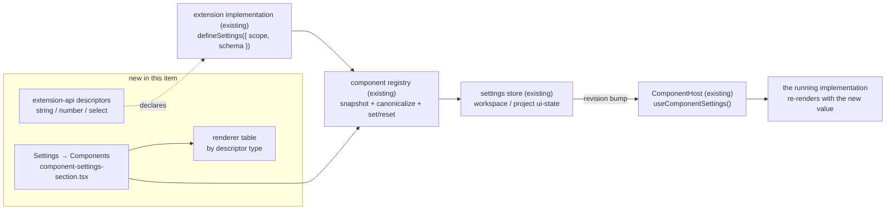

# Generic Component Settings UI — controls generated from an implementation's settings schema

> Slug: `generic-component-settings-ui` · Status: **designed, awaiting implementation** · Epic 2
> (Component Platform). Builds on `2026-09-19-component-settings-api.md` (shipped in PR #50),
> `2026-09-19-component-registry.md`, `2026-09-19-component-resolver.md`,
> `2026-09-19-component-host.md` and `2026-09-19-component-implementation-preferences.md`.
> This is the picker/form item that the settings-API spec deferred: "A later picker item may
> inspect the declarative definition, render supported field types and call the host-side registry
> methods for partial updates and reset."

## 📝 TLDR

An implementation can already declare settings (`defineSettings({ scope, schema })`) and Cezar
already validates, persists, scopes and resets them — but nothing renders them, so a value can only
be changed by editing `ui-state.json` by hand. This item proposes a **Components** section in
Settings that reads each registration's declared schema and generates the controls from it:
a switch for `boolean`, a text field for `string`, a number field for `number` and a dropdown for
`select`. An extension author declares fields; Cezar renders the form, writes through
`registry.setSettings()` and the running component re-renders with the new value. No per-extension
UI code is written on Cezar's side, and no custom renderer API is introduced yet.

## 📝 Problem Statement

Today the component platform can configure nothing. `packages/web/src/component-registry/registry.ts`
exposes `getSettings`/`setSettings`/`resetSettings`, the persistent store writes both scope files,
and `ComponentHost` hydrates `useComponentSettings()` — but the settings-API item deliberately
shipped **"None in this item. There is no settings page, picker, form generator or new route."**
The result is a complete write path with no writer: an extension that declares `compact: false` has
no way for its user to turn it on.

Two gaps follow from that, and both are in scope here:

- **No surface.** `SETTINGS_SECTIONS` (`packages/web/src/routes/settings/registry.tsx`) has no entry
  for components, so `/p/<projectId>/settings/` lists Agents, Agent config, Worktrees, Bookmarklets
  and Prompt templates and nothing that reaches a component.
- **No vocabulary.** The declarative schema is boolean-only end to end — `booleanSetting()` in
  `packages/extension-api/src/components.ts`, `snapshotSettingsDefinition`/`sparseSettings` in the
  registry, `isBooleanMap` in `settings.ts` and `z.record(z.string(), z.boolean())` in
  `packages/contract/src/workspace.ts`. A settings UI with one control type is not a settings UI;
  the brief's four types are the minimum useful vocabulary.

The Definition of Done is one capability with three coupled guarantees:

| Requirement | Required behavior | Proof |
|---|---|---|
| An example implementation declares settings | The `compact-task-header` example declares one field of each supported type, with no Cezar-side code that knows about it. | `packages/extension-api/test/compact-task-header.test.ts` asserts the declared schema; the cockpit test activates the example through the real extension host. |
| The user changes a value in Settings | Settings → Components lists every configurable implementation and renders its controls from the schema alone; changing one persists through `registry.setSettings()` to the declared scope's UI-state file. | Section test flips a switch, edits a text and a number field and picks a select option, and asserts the store received the canonical sparse override. |
| The component reacts | The rendered implementation shows the new value without a reload. | A cockpit test renders the section and the task header together, changes a setting and asserts the header's output changes. |

The third guarantee needs no new mechanism: a store write already calls `changed()` in the registry,
which bumps `revision()`, and `SettingsImplementation` in `component-host.tsx` re-reads on every
revision. This item must not break that chain — it is the DoD.

## Resolved assumptions (autonomous defaults)

This spec was written unattended by `om-auto-write-spec`; the questions that would have gated an
interactive run are answered below. Each is reversible before merge — correct any row and the
design follows.

| # | Question | Applied default | Why | Confirm? |
|---|---|---|---|---|
| Q1 | Where does the form live — a new Settings section, or inside the component-overrides UI (PR #58)? | **One new section, `components`, at project scope** (`/p/:projectId/settings/components`), declared once in `SETTINGS_SECTIONS`. If #58's override picker lands under the same id, the generated form mounts inside its per-implementation card rather than becoming a second section. | `resolveComponentProjectId()` reads the project from a `/p/<id>/` URL, so a **project**-scoped definition can only be written from a project URL; a global-scope section could never edit half the settings it lists. One id keeps "components" a single destination. | reversible |
| Q2 | Which field types ship, and as what public API? | **`boolean` (exists) plus `stringSetting`, `numberSetting`, `selectSetting`**, each an additive descriptor with optional `label`/`description` and its own bounds. No other type, no free-form JSON field. | Exactly the brief's four. Additive to `defineSettings`, so every implementation written against the boolean-only API keeps compiling. | reversible |
| Q3 | Does the persisted value type widen beyond boolean? | **Yes** — `componentSettingsSchema` values become `boolean \| string \| number`, with a 256-character string cap and a 32 KiB cap on the whole map. Existing boolean files parse unchanged. | Storing a string as a boolean is not possible; the schema is an additive widening of an optional UI-state key, and BACKWARD_COMPATIBILITY.md §2 records the new shape in the same PR. | reversible |
| Q4 | Save on change, or an explicit Save button? | **Save on change**: switches and dropdowns write immediately, text and number fields write on blur or after a 500 ms pause, with a per-field error shown inline on rejection. | Every other Settings section (Resources, Appearance, Worktrees) writes immediately and toasts on failure; an explicit Save would be the odd one out and would add draft state to reconcile against external changes. | reversible |
| Q5 | How is "the user changes it and the component reacts" proven, given no extension ships in the cockpit today? | **Through the cockpit's own test of the real extension host** — the `compact-task-header` example is activated, the section is rendered, a control is changed and the header's output is asserted. `BUILTIN_EXTENSIONS` stays empty, so the released cockpit gains no example extension. | Shipping an example extension to every user is a product decision beyond this brief, and the platform's other items (task header, composer, capability validation) all proved themselves this way. Manual verification is documented: add the example to `BUILTIN_EXTENSIONS` locally and run `CEZ_DRY_RUN=1 npm run dev`. | reversible — **override this row if the DoD means clicking it in the shipped cockpit**; the change is then one line in `builtin-extensions.ts` plus a QA pass |
| Q6 | Does this item add the "custom settings renderer" the brief anticipates? | **No.** The renderer is an internal table keyed by descriptor `type`, private to the cockpit. An unknown type renders as a disabled, read-only row naming the type. | Smallest surface that ships something working; a public renderer API would be a second extension contract (component-contract shaped) and deserves its own item. The internal table is where it would attach. | reversible |
| Q7 | Does the section also list implementations with no settings, or offer the override picker? | **No** — only implementations that declare a settings definition, grouped by contract. | Scope cohesion: choosing which implementation renders is `2026-09-19-component-implementation-preferences` / PR #58. Listing unconfigurable rows would make the section's empty state meaningless. | reversible |

## 📝 Proposed Solution

1. **Grow the declarative vocabulary** in `packages/extension-api/src/components.ts`: three new
   descriptor helpers beside `booleanSetting`, one discriminated union
   (`ComponentSettingDefinition`), one value union (`ComponentSettingValue`) and an `InferSettings`
   that maps each descriptor to its TypeScript type. Optional `label` and `description` on every
   descriptor are what make a generated form readable; the UI falls back to a humanized key.
2. **Keep the host the validator.** `snapshotSettingsDefinition` already re-derives the definition
   from untrusted extension input and today rejects anything non-boolean; it grows the same
   re-derivation for the new descriptors, bounds included. A new `canonicalSettings()` replaces
   `sparseSettings()`'s boolean check and validates the parsed value against the **snapshotted**
   schema — an extension-supplied `parse()` that returns a 10 KB string never reaches the wire.
3. **Widen persistence by one union.** `componentSettingsSchema` in `packages/contract/src/workspace.ts`
   accepts `boolean | string(≤256) | number(finite)`, keeps the 64-field and 200-entry caps and adds
   a serialized-size cap; `isBooleanMap` in `settings.ts` becomes a settings-value guard. No new
   route: both scopes keep using the existing UI-state families.
4. **Generate the form.** A new `packages/web/src/routes/settings/component-settings-section.tsx`
   walks `CORE_COMPONENT_CONTRACTS` × `registry.list(contract.id)`, keeps the compatible
   registrations that carry a `settings` definition, and renders one card per implementation with one
   row per field. The control comes from a private renderer table keyed by descriptor `type`; every
   write goes through `registry.setSettings(componentId, { [key]: value })` and every reset through
   `registry.resetSettings(componentId, key?)`. The section knows nothing about any extension.
5. **Prove it on a real extension.** The `compact-task-header` example declares four settings (one
   per type) and renders from them, so the DoD's three guarantees are asserted against extension
   code that Cezar has never special-cased.

### Prior art

- [VS Code's Settings UI](https://code.visualstudio.com/api/references/contribution-points#contributes.configuration)
  renders every extension setting from `contributes.configuration` — `boolean`, `string`, `number`,
  `enum` with `enumDescriptions` — and shows a "modified" marker with a per-setting reset. This item
  copies the four types and the per-field reset, and skips the settings search, the JSON editor and
  the per-language overrides.
- [Grafana plugin configuration pages](https://grafana.com/developers/plugin-tools/how-to-guides/app-plugins/add-configuration-page)
  let a plugin ship its own React config page. Rejected as the default here for the same reason the
  settings-API item rejected extension-owned writes: a generated form keeps validation, persistence
  and reset in one host-owned lifecycle. The plugin-owned page is what a later custom-renderer item
  would add, behind the same table.
- [Backstage configuration](https://backstage.io/docs/frontend-system/building-apps/configuring-extensions/)
  keeps extension config in a YAML file with no UI at all — the state Cezar is in today, and the one
  this item leaves.

### Alternatives considered

- **Put the form behind the override picker only (#58).** Rejected as the *only* home: settings must
  be reachable for the implementation already selected, including core's default, not only while
  choosing a replacement. The two surfaces share one section instead.
- **A global-scope section.** Rejected: project-scoped definitions resolve their project from the
  URL, so `/settings/global/components` could read and write only half of them and would have to
  render the rest as unavailable — a section that is broken by design for one of its two scopes.
- **Let the extension ship a React settings component.** Rejected for this item (see prior art):
  it is a second component contract, a second isolation boundary and a second failure mode, for a
  need the four generated types cover. The renderer table is the seam it would attach to.
- **A JSON textarea per implementation.** Rejected: it is `ui-state.json` with extra steps — no
  labels, no validation before the write, no reset, no discoverability.
- **Explicit Save per card.** Rejected (Q4): every other Settings section saves on change, and a
  draft buffer would have to reconcile with the revision-driven re-read that makes the component
  react in the first place.
- **Add `label`/`description` as a separate metadata map.** Rejected: a field's label belongs on the
  field. Optional properties on the descriptor keep one object to validate and one to render.

## 📝 Architecture



Takeaway: the only new runtime path is *Settings section → `registry.setSettings`*. Everything after
the write — canonicalization, persistence, the revision bump and the re-render — is the machinery
PR #50 already shipped, which is why "the component reacts" costs no new mechanism and why breaking
the revision chain would be the one silent way to fail this item.

### Modules and ownership

- `packages/extension-api/src/components.ts` — the three new descriptors, their helpers, the
  descriptor/value unions and the widened `InferSettings`. `src/index.ts` re-exports them and
  `test/surface.test.ts` is edited deliberately, as a new runtime export must be.
- `packages/web/src/component-registry/registry.ts` — `snapshotSettingsDefinition` re-derives the new
  descriptors and their bounds; `canonicalSettings()` (renamed from `sparseSettings`) validates the
  parsed value against the snapshotted schema before persistence. No change to `getSettings`,
  `setSettings`, `resetSettings` or `forExtension`'s surface.
- `packages/web/src/component-registry/settings.ts` — the map guard accepts the widened value union,
  and reads of one target are deduplicated while one is in flight (see Risks: the section reads once
  per configurable implementation).
- `packages/contract/src/workspace.ts` — `componentSettingsSchema` widens its value type and gains a
  serialized-size bound. Both UI-state shapes keep their open sibling-key behavior.
- `packages/web/src/routes/settings/component-settings-section.tsx` (new) — the section: discovery,
  grouping, per-card state, writes, resets and the unavailable/empty states.
- `packages/web/src/routes/settings/component-settings-field.tsx` (new) — the renderer table and the
  four controls, built from the cockpit's existing `Switch`, `Input`, `Select` and `Label` primitives
  and the `SettingsField` rhythm.
- `packages/web/src/routes/settings/registry.tsx` — one `SETTINGS_SECTIONS` entry (`components`,
  project scope) and one `SettingsSectionId` member. The shell routes and lists it from there.
- `packages/extension-api/examples/compact-task-header/index.ts` — the worked example gains four
  settings and reads them through `useComponentSettings()`.
- Docs: `packages/extension-api/README.md` (the settings paragraph), the component-settings row in
  `AGENTS.md`, and `BACKWARD_COMPATIBILITY.md` §2's `componentSettings` paragraph.

No server module changes: the section writes through the existing
`PUT /api/v1/workspace/ui-state` and `PUT /api/v1/p/:projectId/ui-state` routes that the settings
store already uses. No new route, no new query key family, no new event topic.

## 📝 Data Model

### Descriptors (public, `@open-mercato/cezar-extension-api`)

```ts
export interface SettingFieldMeta {
  /** Shown as the control's label. Absent: the humanized key ("showToolCalls" → "Show tool calls"). */
  readonly label?: string
  /** One line under the label. */
  readonly description?: string
}

export interface BooleanSettingDefinition extends SettingFieldMeta {
  readonly type: 'boolean'
  readonly default: boolean
}

export interface StringSettingDefinition extends SettingFieldMeta {
  readonly type: 'string'
  readonly default: string
  /** 1…256, default 256. The stored value is rejected above it. */
  readonly maxLength?: number
  readonly placeholder?: string
}

export interface NumberSettingDefinition extends SettingFieldMeta {
  readonly type: 'number'
  readonly default: number
  readonly min?: number
  readonly max?: number
  /** The input's step; presentation only. */
  readonly step?: number
  /** `true`: only safe integers are accepted. */
  readonly integer?: boolean
}

export interface SettingOption {
  readonly value: string
  /** Absent: the value itself. */
  readonly label?: string
}

export interface SelectSettingDefinition extends SettingFieldMeta {
  readonly type: 'select'
  /** Must be one of `options[].value`. */
  readonly default: string
  /** 1…64 options, each value 1…64 characters, unique. */
  readonly options: readonly SettingOption[]
}

export type ComponentSettingDefinition =
  | BooleanSettingDefinition
  | StringSettingDefinition
  | NumberSettingDefinition
  | SelectSettingDefinition

export type ComponentSettingValue = boolean | string | number

export type InferSettings<Schema extends ComponentSettingsSchema> = {
  -readonly [Key in keyof Schema]: Schema[Key] extends BooleanSettingDefinition
    ? boolean
    : Schema[Key] extends NumberSettingDefinition
      ? number
      : Schema[Key] extends StringSettingDefinition | SelectSettingDefinition
        ? string
        : never
}
```

`ComponentSettingsScope`, `ComponentSettingsDefinition`, `SettingsOf`, `ComponentRenderProps` and
`ComponentRegistrationHandle` keep their current shapes. A `select` is a `string` at the type level
on purpose: an implementation reads `settings.density` as a string and narrows it itself, which
keeps `InferSettings` free of literal-union inference from a `const` options array.

### Bounds the host enforces

The same numbers apply in `defineSettings()` (author-side, throws `ExtensionDefinitionError`) and in
`snapshotSettingsDefinition()` (host-side, rejects the definition), because the definition crosses a
package boundary and the host trusts nothing that crosses it.

| Bound | Value | Where it bites |
|---|---|---|
| Field key | 1…64 characters, ≤ 64 fields per implementation | unchanged from PR #50 |
| `label` / `description` | ≤ 128 / ≤ 256 characters | truncated in the form, rejected in the definition |
| `string` value and `default` | ≤ `maxLength` ≤ 256 characters | write rejected as `invalid-settings` |
| `number` value and `default` | finite; safe integer when `integer`; within `min`…`max` when declared | write rejected as `invalid-settings` |
| `select` | 1…64 unique options, value 1…64 characters, `default` ∈ options | definition rejected when `default` is not an option |
| Stored map | ≤ 200 implementations, ≤ 64 fields each, ≤ 32 KiB serialized | contract refinement; the UI-state PUT body cap is 128 KiB (`UI_STATE_BODY_LIMIT`) |

### Persisted shape

Unchanged in structure — a sparse map of explicit overrides keyed by the exact implementation id,
in `~/.cezar/ui-state.json` (global) or `<repo>/.ai/cezar/ui-state.json` (project). Only the value
type widens:

```json
{
  "componentSettings": {
    "example.compact-header.row": {
      "showEngine": false,
      "density": "cozy",
      "titleMaxLength": 48,
      "statusPrefix": "•"
    }
  }
}
```

A field whose value equals its declared default is **not** written (canonicalization drops it), so
switching a setting back to its default removes the key and an implementation that changes its
default later picks the new one up. Files written by the boolean-only version parse unchanged.

## 📝 API Contracts

### Extension API additions

```ts
export function stringSetting(options: {
  readonly default: string
  readonly maxLength?: number
  readonly placeholder?: string
  readonly label?: string
  readonly description?: string
}): StringSettingDefinition

export function numberSetting(options: {
  readonly default: number
  readonly min?: number
  readonly max?: number
  readonly step?: number
  readonly integer?: boolean
  readonly label?: string
  readonly description?: string
}): NumberSettingDefinition

export function selectSetting(options: {
  readonly default: string
  readonly options: readonly SettingOption[]
  readonly label?: string
  readonly description?: string
}): SelectSettingDefinition
```

`defineSettings()` keeps its signature and grows per-type validation and parsing: `parse()` still
accepts a sparse object, fills declared defaults, rejects unknown keys and now rejects a value of
the wrong type or outside its declared bounds. The package stays zero-runtime-dependency, node-free,
DOM-free and single-entry-point; Zod is neither imported nor exported.

### Registry (host-side, unchanged surface)

`getSettings`, `setSettings` and `resetSettings` keep their signatures and their error codes
(`invalid-settings`, `settings-unavailable`, `disposed`). Two internals change:

- `snapshotSettingsDefinition()` re-derives every descriptor type with its bounds. A definition it
  cannot re-derive is rejected exactly as today — the registration throws for core, and is recorded
  with its issue for an extension.
- `canonicalSettings(definition, parsed)` replaces `sparseSettings`: it checks each value against the
  **snapshotted** descriptor (type, length, range, option membership) and returns only the fields
  that differ from their default. An extension `parse()` that returns an out-of-bounds value fails
  here with `invalid-settings` and nothing is persisted.

### Contract schema

```ts
const componentSettingValueSchema = z.union([
  z.boolean(),
  z.string().max(256),
  z.number().finite(),
]);

export const componentSettingsSchema = z
  .record(
    z.string().min(1).max(128),
    z.record(z.string().min(1).max(64), componentSettingValueSchema)
      .refine((value) => Object.keys(value).length <= 64),
  )
  .refine((value) => Object.keys(value).length <= 200)
  .refine((value) => JSON.stringify(value).length <= 32 * 1024);
```

Both UI-state shapes keep `componentSettings` optional and both remain open bags. `contract-parity`
and `typed-bodies` tests cover the route families as before; the widening is additive, so a stored
file written by the current release still parses.

## 📝 UI/UX

**Prototype:** `.ai/specs/assets/generic-component-settings-ui/` — illustrative statics, not a build.


*Proposed.* The section as it would render with two configurable implementations. Today the same
place looks like this — the project settings nav has no Components entry:
[current settings index](assets/generic-component-settings-ui/current-01-settings-index.png),
[current Agents section](assets/generic-component-settings-ui/current-02-settings-agents.png), whose
label/hint/control rhythm the generated rows follow.


*Proposed.* Left to right: a rejected value (inline, nothing written), a card whose scope target is
unavailable (defaults, disabled), and the empty state. Below them, the DoD's third guarantee — the
header re-rendering after the setting changed, with no reload.

**Where.** Settings → Components, `/p/:projectId/settings/components`, between "Agent config" and
"Worktrees" in the project nav. Title "Components", description "Settings the installed component
implementations declare."

**The list.** One group per served contract (heading: the implementation's contract, e.g.
`cezar.task.header.main@1`), one card per configurable implementation inside it, sorted by component
id. Each card shows the implementation's `metadata.title`, its provider (the extension id, or
"Cezar" for core), the component id in small monospace, and a scope badge — **All projects** for a
`global` definition, **This project** for a `project` one — so the blast radius of a change is
visible before it is made.

**The rows.** One per declared field, in schema order, following the existing `SettingsField` rhythm
(label, one-line hint, control):

| Descriptor | Control | Write |
|---|---|---|
| `boolean` | `Switch` | on change |
| `select` | `Select` with one item per option | on change |
| `string` | single-line `Input` (`placeholder` honored) | on blur, or 500 ms after the last keystroke |
| `number` | `Input type="number"` (`min`/`max`/`step` honored) | on blur, or 500 ms after the last keystroke |
| unknown `type` | disabled read-only row: "This setting needs a newer Cezar (`type`)" | never |

A row whose value differs from its default shows a **Reset** action; the card shows **Restore
defaults** when any field does. Reset writes through `registry.resetSettings(componentId, key?)`.

**States.**

- *Loading* — the card's rows render skeletons while the first read of that implementation resolves.
- *Empty* — no implementation declares settings: `CenteredState` with "No component has settings to
  configure" and one line explaining that extensions add entries here.
- *Unavailable* — a read or write fails with `settings-unavailable` (UI state offline or read-only):
  the card's controls are disabled with the reason underneath, and the values shown are the declared
  defaults. Nothing else on the page is affected.
- *Rejected* — a write fails with `invalid-settings` (out of range, too long): the control keeps the
  typed value, an inline error names the field and the rule ("Must be 1–120"), and the stored value
  is unchanged. A failure that is not field-specific also raises one `toast(..., { tone: 'danger' })`,
  as the other sections do.

**Accessibility.** Every control has a `<Label htmlFor>`; the hint and any error are wired through
`aria-describedby`, and the error row is a live region. The switch is the cockpit's own primitive, so
keyboard and screen-reader behavior match the rest of Settings. Reset is a real button, reachable in
tab order, labelled "Reset <field> to default".

**What the user sees end to end.** Open Settings → Components, flip "Show engine" off on the compact
task header, return to a task: the header renders without the runner/model chip. No reload, no
restart — the store write bumps the registry revision and the host re-reads.

## 📝 Edge Cases & Failure Scenarios

| Scenario | Behavior |
|---|---|
| No implementation declares settings | The empty state renders; no UI-state request is made. |
| An implementation declares settings but is incompatible (`unknown-contract`, missing capability) | Not listed: it can never render, so its settings are moot. Its diagnostic stays the registry's. |
| A `project`-scoped definition on a page with no project | Unreachable by construction — the section only exists under `/p/:projectId/`. A project that disappears mid-edit fails the write as `settings-unavailable` and the card explains it. |
| A `global`-scoped definition edited from a project page | Written to workspace UI state; the badge says "All projects" before the change is made. |
| Stored value no longer matches the definition (renamed field, changed type) | The registry already reports one diagnostic and resolves to defaults; the form shows defaults and offers Restore defaults, which clears the stale entry. |
| Stored value out of the declared range after the author tightened `max` | Same path: the value is ignored for rendering, the field shows the default, and the next write canonicalizes the entry. |
| The user types a number outside `min`/`max` | The write is not attempted; the inline error names the rule. The previous persisted value is untouched. |
| The user clears a `string` field | An empty string is a legal value when `maxLength ≥ 0`; if it differs from the default it is stored, otherwise the key is dropped. |
| Two fields of one card are edited quickly | Each write is a sparse patch merged by the registry against the current stored value; the store serializes writes per target, so neither drops the other. |
| Two cockpit tabs edit different implementations | Unchanged from PR #50: read-modify-write plus the server's merge-write preserves both entries. |
| The same implementation is edited in two tabs | Last writer wins, as documented for UI state; the other tab reconciles on its next revision-driven read. |
| An extension is deactivated while its card is open | The registry change bumps the revision; the card disappears on the next render. Its stored entry stays and is reused if it is provided again. |
| An extension's `parse()` throws or returns a malformed value on write | `setSettings` rejects with `invalid-settings`; nothing is persisted and the section shows the error on the card. The extension is not unregistered. |
| An extension declares an unknown descriptor type (newer API than this cockpit) | `snapshotSettingsDefinition` rejects the whole definition today, so the implementation registers without settings and the card does not appear; the read-only "needs a newer Cezar" row covers the forward case where a type is snapshotted but not renderable. |
| UI state is offline, read-only or corrupt | Reads resolve to defaults with the existing single warning; writes reject as `settings-unavailable`. The rest of Settings and the cockpit keep working. |
| A settings write happens while a task is running | Nothing in the run path reads component settings; only the rendering implementation re-reads. |
| A setting is used to hold a token | Unchanged product rule: component settings are UI state, never a secret store. The README and the section's own copy say so; secrets belong in extension storage. |

## 📝 Risks & Impact Review

- **Public extension API growth.** Three helpers and four exported types are additive, but they are
  permanent: `@open-mercato/cezar-extension-api` is the only supported contract, so a descriptor
  shipped here is a shape the cockpit must keep reading. The bounds table is deliberately explicit
  for that reason. `test/surface.test.ts` must be edited in the same PR.
- **Protected UI-state shape.** `componentSettings` is listed in BACKWARD_COMPATIBILITY.md §2 as a
  boolean map bounded to 64 fields and 200 implementations. Widening the value type is additive for
  readers (old files parse) but not for *writers*: a cockpit that writes a string against a server
  built before this change is rejected with 400. That pairing only occurs if a bundle is served by a
  different build than the one it shipped with, which the cockpit's build does not do; the paragraph
  is updated in the same PR so the protected shape and the code agree.
- **Host-side re-validation is the security boundary.** The definition is extension code. Every new
  bound must exist in `snapshotSettingsDefinition` and `canonicalSettings`, not only in
  `defineSettings` — an author-side-only check is bypassed by an extension that constructs the
  definition object literally.
- **Read amplification.** The section reads one value per configurable implementation, and the
  persistent store fetches UI state per read, so N implementations mean N GETs per revision bump —
  including the bump the section's own write causes. Mitigation in scope: the store deduplicates
  concurrent reads of the same target behind one in-flight promise, and the form renders from its
  local controlled value rather than re-fetching after its own write. With today's handful of
  implementations the bound is small; a cache with invalidation is the follow-on if it grows.
- **Coordination with the override picker (PR #58).** Both want a `components` section. Whichever
  lands second mounts into the existing one and does not add a second `SettingsSectionId`; the
  generated form is a standalone component precisely so it can be dropped into a card.
- **Zero config.** Nothing is required of the user: no config key, no flag, and no request when no
  implementation declares settings. The section is discovered from the registry, like every other
  capability in this repo.
- **Rollback.** Reverting this item leaves the widened values in `ui-state.json` as entries the
  boolean-only schema would reject on the next write of that map — the affected implementation's
  entry must be cleared, which `resetSettings` already does and which the older code path does on a
  malformed entry. No task or runner state is involved.
- **Not covered here.** A custom renderer API, layered global-defaults-plus-project-override scopes,
  settings search, and import/export of a settings profile. Each is a separate item and none is
  blocked by this design.

## 📋 Phasing

1. **Phase 1 — The vocabulary.** The three descriptors, their helpers, `InferSettings`, and the
   host-side re-derivation and canonicalization. Provable entirely in unit tests; nothing renders
   yet, and a boolean-only implementation behaves identically.
2. **Phase 2 — Persistence.** The widened contract schema, the store's value guard and read
   deduplication, plus the UI-state route tests. After this phase a widened value survives a reload.
3. **Phase 3 — The section.** The renderer table, the Components section, the registry entry and
   every state (loading, empty, unavailable, rejected). After this phase a user can change a value.
4. **Phase 4 — The worked example and the docs.** The example's settings, the end-to-end cockpit
   proof, and the README/AGENTS/BACKWARD_COMPATIBILITY updates.

Each phase leaves the application working and shippable on its own.

## 📋 Implementation Plan

Every step keeps `npm run typecheck`, `npm test`, `npm run test:unit`, `npm run build` and
`npm run test:package` green. For every regression guard below, prove it fails without the change
(`git stash push -- <source files>`, run the test, confirm red, restore) — the repo's rule, and the
only way to know a new test is not green either way.

### Phase 1 — The vocabulary

1. **Add the descriptors and helpers.**
   - Code: `packages/extension-api/src/components.ts`, `src/index.ts`, `test/surface.test.ts`.
   - Test: `defineSettings` with one field of each type infers `{ a: boolean; b: string; c: number; d: string }`;
     a `select` whose `default` is not an option throws; a `string` default above `maxLength` throws;
     a non-finite or non-integer number throws when `integer` is set; an implementation that declares
     only `booleanSetting` still type-checks and parses identically.
2. **Teach `parse()` the new types.**
   - Code: the parser inside `defineSettings`.
   - Test: a sparse object fills defaults per type; an unknown key still throws; a wrong-typed value
     throws naming the field; a string over `maxLength`, a number outside `min`/`max` and a select
     value outside `options` each throw.
3. **Re-derive and canonicalize host-side.**
   - Code: `snapshotSettingsDefinition` and `canonicalSettings` in
     `packages/web/src/component-registry/registry.ts`.
   - Test: a hand-built definition object (not from `defineSettings`) with an over-long string
     default is rejected at registration; a `parse()` that returns an out-of-bounds value makes
     `setSettings` reject with `invalid-settings` and persists nothing; a value equal to its default
     is dropped from the canonical override for every type.

### Phase 2 — Persistence

4. **Widen the contract schema.**
   - Code: `packages/contract/src/workspace.ts`.
   - Test: an old boolean-only fixture parses; mixed boolean/string/number entries parse; a
     257-character string, a 65-field entry, a 201-entry map and a >32 KiB map each fail;
     contract-parity and typed-body suites stay green for both UI-state route families.
5. **Widen the store and deduplicate reads.**
   - Code: `packages/web/src/component-registry/settings.ts`.
   - Test: a string/number map round-trips through both scope targets; a non-scalar value is
     rejected as `invalid-settings`; two concurrent `get`s of one target issue one HTTP read; a
     project change mid-operation still fails as `settings-unavailable`.
6. **Prove reload persistence for the new types.**
   - Test: write one global and one project value of each type, dispose the store, recreate it and
     read both back — the settings-API item's Definition-of-Done test, extended past booleans.

### Phase 3 — The section

7. **Build the renderer table.**
   - Code: `packages/web/src/routes/settings/component-settings-field.tsx`.
   - Test: each descriptor renders its control with label, hint and current value; a missing `label`
     humanizes the key; an unknown type renders the disabled read-only row; a value differing from
     the default shows Reset.
8. **Build the section.**
   - Code: `packages/web/src/routes/settings/component-settings-section.tsx` and the
     `SETTINGS_SECTIONS` entry in `routes/settings/registry.tsx`.
   - Test: only compatible registrations with a definition are listed, grouped by contract and sorted
     by component id; the scope badge follows the definition; the empty state renders with no
     implementation; the section appears in the project nav and at
     `/p/<projectId>/settings/components`.
9. **Wire writes, resets and failures.**
   - Test: a switch writes `{ key: value }` through `setSettings` immediately; a text field writes
     once after the debounce, not per keystroke; an out-of-range number shows the inline error and
     issues no write; `settings-unavailable` disables the card with its reason; Reset and Restore
     defaults call `resetSettings` with and without a key; a failed write leaves the previous value
     visible.

### Phase 4 — The worked example and the docs

10. **Give the example settings.**
    - Code: `packages/extension-api/examples/compact-task-header/index.ts` declares `showEngine`
      (boolean), `density` (select: compact/cozy), `titleMaxLength` (number, 16–120, integer) and
      `statusPrefix` (string, ≤ 8) and renders from them.
    - Test: `packages/extension-api/test/compact-task-header.test.ts` asserts the declared schema and
      that the component reads it; the example still imports only itself, the package and `react`
      (`test/boundary.test.ts`).
11. **Prove the Definition of Done end to end.**
    - Test: a cockpit test activates the example through the real extension host, renders the
      Components section and the task header together, changes `showEngine` and `density`, and
      asserts the store received the canonical override **and** the header re-rendered with the new
      value; a second case asserts core's default is unaffected.
12. **Document the durable contract.**
    - Docs: the settings paragraph in `packages/extension-api/README.md` (the four field types, the
      generated form, the non-secret rule), the component-settings row in `AGENTS.md` (the section,
      the host-side bounds, the renderer table as the seam a custom renderer would attach to), the
      `componentSettings` paragraph in `BACKWARD_COMPATIBILITY.md` §2 (the widened value union and
      its caps), and the release notes.
13. **Run the full gate.** The five configured commands, plus the focused extension-api,
    component-registry, component-host, settings-section and UI-state suites. Manual verification
    (optional, documented in the PR): add the example to `BUILTIN_EXTENSIONS` locally and run
    `CEZ_DRY_RUN=1 npm run dev` to click the flow end to end.
