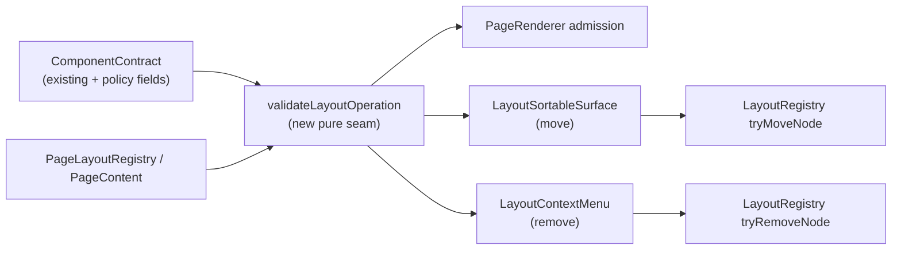

# Layout Constraints

> Slug: `layout-constraints` · Status: **designed, awaiting implementation** · Epic 2
> (Component Platform). Builds on `2026-09-19-component-contract-api.md`,
> `2026-09-20-layout-registry.md`, `2026-09-19-create-layout-schema.md` and the existing
> edit-mode `LayoutRegistry`.

## 📝 TLDR

The component and page-layout contracts can describe where content belongs, but the edit-mode
mutations do not yet consult a component's policy. A drag or Delete action can therefore attempt
to move a component into an unsupported zone or remove the only content of a required zone.

This proposal adds immutable layout-policy fields to component definitions and one pure validator
used by page-content validation, drag/drop and deletion. Invalid operations become no-ops with a
typed reason; valid operations keep the existing in-memory registry and dnd-kit flow. The change
does not add persistence, HTTP routes or a new extension service.

## 📝 Problem Statement

`defineComponentContract` currently describes a component's functional contract, capabilities and
rendering box. `PageLayoutRegistry` validates a page's zones and accepted contract ids, while the
DOM `LayoutRegistry` owns edit-mode tree mutations. Those layers agree on identity but do not share
operation policy:

- `PageRenderer` can accept a contract in a zone without checking whether that contract declares
  the zone as an allowed destination.
- `LayoutSortableSurface` calls `moveNode` after a drop; the registry has no component policy with
  which to reject an otherwise structurally valid move.
- `LayoutElementContextMenu` removes a registered subtree before the layout owner can establish
  whether the element is removable or whether it is the last item in a required zone.
- The current `LayoutSchema` stores contract identity and placement order, but intentionally does
  not store runtime component definitions. Constraints must therefore be resolved from the
  contract catalog at validation time, not copied into user data.

This is a real regression risk, not only a future concern. Commit `0cdd51d2` attempted to constrain
edit-mode movement and was later reverted by `df589b91`; the history shows that movement behavior
has already been a load-bearing surface. The replacement must make the policy explicit and ensure
that every mutation entry point uses the same validator.

## 📝 Proposed Solution

Extend the existing component definition created by `defineComponentContract` with five optional,
direct fields. The public shape is intentionally not a second component-definition model:

```ts
export interface ComponentContractOptions {
  readonly version: number
  readonly requiredCapabilities?: readonly ComponentCapability[]
  readonly optionalCapabilities?: readonly ComponentCapability[]
  readonly layout?: ComponentLayout

  /** Whether edit mode may change this component's zone or sibling position. Default: false. */
  readonly movable?: boolean
  /** Whether edit mode may remove this component's placement. Default: false. */
  readonly removable?: boolean
  /** Whether a layout placement may choose another compatible contract. Default: true. */
  readonly replaceable?: boolean
  /** Exact page-zone ids in which this component may be placed or moved. */
  readonly allowedZones?: readonly ContributionId[]
  /** Stable semantic component category used by catalogues and diagnostics. */
  readonly category?: ContributionId
}
```

The returned `ComponentContract` carries the same frozen fields. `allowedZones` is an exact list of
zone ids, not a wildcard or a CSS selector. A component that sets `movable: true` must provide at
least one allowed zone, so an author cannot accidentally create an unbounded movable component.
The example from the brief is therefore valid:

```ts
export const TaskMetadata = defineComponentContract<TaskMetadataProps>('cezar.task.metadata', {
  version: 1,
  movable: true,
  removable: true,
  allowedZones: ['task.main', 'task.sidebar'],
  category: 'task.metadata',
})
```

`replaceable` governs replacing the layout's contract/placement, not the existing Settings choice
of an implementation for one contract. `ComponentRegistry` preference semantics remain unchanged:
an implementation can still be selected only when it is compatible with its contract. A future
layout replacement UI must check both `replaceable` and the destination zone's acceptance rules.

### One validator for all layout mutations

Add a pure web-side validator next to the page-layout definitions. It reads the immutable contract
policy, the source/destination zone and the current page content, and returns a frozen result:

```ts
export type LayoutOperation =
  | { readonly kind: 'move'; readonly key: string; readonly fromZone: ZoneId; readonly toZone: ZoneId }
  | { readonly kind: 'remove'; readonly key: string; readonly zone: ZoneId }
  | { readonly kind: 'replace'; readonly key: string; readonly zone: ZoneId; readonly contract: PageComponentContract }

export type LayoutConstraintIssue =
  | { readonly code: 'not-movable'; readonly key: string; readonly zone: ZoneId }
  | { readonly code: 'zone-not-allowed'; readonly key: string; readonly zone: ZoneId }
  | { readonly code: 'not-removable'; readonly key: string; readonly zone: ZoneId }
  | { readonly code: 'required-component'; readonly key: string; readonly zone: ZoneId }
  | { readonly code: 'not-replaceable'; readonly key: string; readonly zone: ZoneId }
  | { readonly code: 'contract-not-accepted'; readonly key: string; readonly zone: ZoneId }

export function validateLayoutOperation(input: {
  readonly operation: LayoutOperation
  readonly page: PageDefinition
  readonly content: PageContent
}): readonly LayoutConstraintIssue[]
```

The validator never mutates the registry, throws for a user operation or silently repairs an
invalid destination. The operation is accepted only when the returned issue list is empty. Page
content validation and `PageRenderer` use the same zone-admission predicate, so a component cannot
render in a zone that drag/drop would reject.

Requiredness remains contextual and is not duplicated in the component contract. An item is
required only because the current page/layout gives its zone a structural requirement: for this
item, the last usable content of a `ZoneDefinition.required` zone cannot be removed. Removing
another item from a `many` zone is allowed if the required zone remains populated. A future
per-placement required flag is explicitly out of scope.

The ownership boundary is deliberate:

```text
ComponentContract
  owns: movable, removable, replaceable, allowedZones, category

Page/layout
  owns: requiredness, minimum occupancy and other structural rules
```

For example, `task.metadata` may be globally movable and removable in `task.main` and
`task.sidebar`, while a particular page may require its sidebar to retain one
metadata-capable item. The component is not inherently required; only its placement in that page
and zone is. `allowedZones` remains the sole admission rule in this item. `category` is metadata
for catalogues and diagnostics and must never silently become a second zone-matching rule.

For the existing DOM edit-mode tree, descriptors for contract-backed elements carry their source
zone and normalized policy. Legacy descriptors without a component contract keep their current
behavior until their owner supplies a definition. `LayoutRegistry.tryMoveNode` and
`tryRemoveNode` become the mutation seam returning the typed result; existing boolean
`moveNode`/`removeNode` wrappers remain for compatibility but route through the same checks. Group
operations validate every constrained descendant before changing any node, so a rejected child
cannot leave a partially moved subtree.

## Resolved decisions (confirmed in PR #69)

The following autonomous defaults were explicitly confirmed in the PR discussion. Q4 includes the
additional ownership clarification recorded above.

| # | Question | Confirmed decision | Why | Confirm? |
|---|---|---|---|---|
| Q1 | Should policy be a new layout-only model or fields on the existing component definition? | Add the five fields directly to `ComponentContractOptions` and `ComponentContract`. | `defineComponentContract` is already the public source of truth for a component, and a second policy model would drift from the contract catalog. | reversible |
| Q2 | What are the safe defaults for existing contracts? | `movable: false`, `removable: false`, `replaceable: true`; omitted `allowedZones` means no zone restriction for otherwise permitted placement, and omitted `category` means uncategorized. A newly movable contract still declares a non-empty allowlist. | Movement and deletion are destructive, so they opt in. Existing component-host replacement remains compatible, while the new layout replacement path can opt out explicitly. | reversible |
| Q3 | Does `replaceable` control Settings implementation preferences? | No. It controls replacing a layout placement with another contract; existing implementation preferences remain governed by `ComponentRegistry` compatibility and resolver rules. | Combining two different replacement layers would make an implementation preference unexpectedly depend on page placement. | reversible |
| Q4 | Where does “required component” come from? | Page/layout owns requiredness, minimum occupancy and structural rules; reuse `ZoneDefinition.required` for this item, so the last usable item in that required zone cannot be removed. | A component contract describes reusable capabilities and policy, while a page decides what its current layout requires. | reversible |
| Q5 | Must this add persistence or a live Task Page migration? | No. Constraints are code-owned metadata and runtime validation only; the existing `LayoutSchema` remains unchanged and the live consumer migration stays separate. | Avoids copying policy into user data and preserves the zero-config rollback path. | reversible |
| Q6 | What should the UI do when a user attempts an invalid action? | Do not show an invalid drop target; on a stale or programmatic attempt, reject atomically, keep the old snapshot and announce a concise reason through the existing live region. Required Delete remains visible but disabled with an accessible explanation. | This keeps the editor discoverable while preventing silent layout corruption. | reversible |
| Q7 | Should `category` itself decide zone admission? | No in this item. `allowedZones` is authoritative for placement; `category` is validated metadata for catalogues, diagnostics and a future category-aware zone API. | Existing zones already have placement categories and accepted contract lists; inventing a second category-matching rule now would make the current registry ambiguous. | reversible |

## 📝 Architecture



The contract defines what the component permits; the page/layout defines which zones exist, which
contracts they accept and what structural occupancy they require; the runtime registry performs the
mutation only after the validator passes.
No layer discovers policy by scanning DOM attributes, and no renderer or menu reimplements a
subset of the rules.

### Module boundaries

- **Changed:** `packages/extension-api/src/components.ts` and its surface/validation tests; add
  policy fields, bounded validation, deep freezing and documentation.
- **New or changed in `packages/web/src/page-layout/`:** a pure `constraints.ts` (or equivalent)
  with operation types and shared admission checks; `definitions.ts` and `registry.ts` consume it
  for page content; `renderer.tsx` uses the same predicate before rendering.
- **Changed:** `packages/web/src/lib/layout-elements.ts` to retain normalized policy metadata on
  contract-backed nodes and expose atomic `tryMoveNode`/`tryRemoveNode` results.
- **Changed:** `packages/web/src/components/layout-element.tsx`,
  `layout-sortable-surface.tsx` and `layout-context-menu.tsx` to pass zone/policy metadata and
  route every edit-mode mutation through the validator.
- **Unchanged:** HTTP contracts, server/CLI code, component implementation preference storage,
  `LayoutSchema` wire format, extension permissions/storage, and the existing `ComponentHost`
  fallback path.

The existing separation between `PageLayoutRegistry` and the DOM edit-mode `LayoutRegistry` stays
intact. The shared part is the pure policy/admission helper, not a singleton registry and not a
DOM dependency.

### Prior art

- **VS Code views** declare stable view ids and the containers where they may appear; a view can be
  moved out of its default container while keeping contextual identity. We take explicit allowed
  destinations and stable ids, but skip VS Code's persisted user settings in this item.
  [VS Code contribution points](https://code.visualstudio.com/api/references/contribution-points)
- **Grafana UI extensions** distinguish a producer that adds content to a named extension point from
  a consumer that decides how the content is displayed. We take host-owned zone admission and do
  not let a component choose an arbitrary DOM destination.
  [Grafana UI extensions](https://grafana.com/developers/plugin-tools/how-to-guides/ui-extensions/ui-extensions-concepts)
- **Backstage frontend extensions** use explicit attachment points and typed inputs rather than
  letting an extension reach into arbitrary parents. We take the explicit attachment boundary and
  keep Cezar's local, synchronous validator.
  [Backstage frontend extensions](https://backstage.io/docs/next/frontend-system/architecture/extensions/)

### Alternatives considered

- **Only disable the drag handle and Delete button.** Rejected. Programmatic callers, stale drops
  and future persistence loaders would still bypass the UI and create invalid state.
- **Put policy on `LayoutSchema` placements.** Rejected for this item. It duplicates extension
  metadata in every saved layout and lets stale files disagree with the current component contract.
  The schema keeps stable contract identity; runtime policy is resolved from the catalog.
- **Teach `LayoutRegistry` about every component contract.** Rejected as a direct dependency. The
  DOM tree remains generic; it stores a normalized policy snapshot supplied by its owner and calls
  the shared pure validator.
- **Treat `allowedZones` as a wildcard when absent and default `movable` to true.** Rejected. A
  new component should not become movable or destructive merely because its author omitted a field.
- **Make `category` the only admission rule.** Rejected. Categories are useful taxonomy, but exact
  zone ids are the requirement that prevents a task metadata component from landing in an unrelated
  zone.

## 📝 Data Model

The component contract is immutable runtime metadata:

```ts
interface ComponentContract<Props> {
  // existing fields …
  readonly movable?: boolean
  readonly removable?: boolean
  readonly replaceable?: boolean
  readonly allowedZones?: readonly ContributionId[]
  readonly category?: ContributionId
}
```

`defineComponentContract` validates booleans, contribution ids, duplicate zone ids and a bounded
allowlist (maximum 32 entries, matching the existing capability bound). It rejects
`movable: true` without a non-empty `allowedZones` list and rejects unknown option keys when the
existing definition validation reports them. The returned object, list and nested metadata are
deeply frozen. Adding these optional fields does not require a major component-contract version
bump; a component's host behavior changes only when a page/layout consumer begins honoring them.

The serializable `LayoutSchema` remains:

```ts
{ page, schemaVersion, zones: { [zoneId]: [{ id, contract, contractVersion, layout? }] } }
```

At runtime, the contract catalog resolves `contract` + `contractVersion` to the immutable
definition. If it cannot resolve that identity, the existing invalid-content/missing-zone path
wins and no edit operation is attempted. No function, React component, implementation id or policy
copy is written to JSON.

## 📝 API Contracts

### Extension API

`ComponentContractOptions` and `ComponentContract` gain the five fields shown above. The public
barrel continues to re-export the existing types; no new package entry point is added. Tests pin
that a structurally valid token exposes the fields and that malformed input produces
`ExtensionDefinitionError` with precise paths such as `allowedZones[1]`.

### Web validator

`validateLayoutOperation` is pure, deterministic and returns all applicable issues in stable order:

1. malformed/unknown source or destination;
2. contract or zone admission mismatch;
3. `not-movable` / `not-removable` / `not-replaceable`;
4. `required-component` when removal would empty a required zone.

Move validation checks both the source component and every descendant of a moved group. A same-zone
reorder still requires `movable: true`; moving to another zone additionally requires the destination
zone id in `allowedZones` and the destination zone's normal contract/category admission. Replace
validation requires `replaceable: true`, a compatible target contract and an allowed destination
zone. Remove validation checks the current zone and remaining usable content before any registry
mutation.

### Runtime mutation seam

The layout registry exposes result-returning operations conceptually shaped as:

```ts
type LayoutOperationResult =
  | { readonly applied: true; readonly snapshot: readonly RegisteredLayoutElement[] }
  | { readonly applied: false; readonly issues: readonly LayoutConstraintIssue[] }

tryMoveNode(id: string, newParentId: string | null, index: number): LayoutOperationResult
tryRemoveNode(id: string): LayoutOperationResult
```

The exact overloads may preserve current callers, but `LayoutSortableSurface`,
`LayoutElementContextMenu` and any future layout loader must use the result-returning seam. A failed
operation emits no revision, no partial subtree update and no `onLayoutChange` callback.

## 📝 UI/UX

The feature changes edit-mode affordances but does not redesign the normal cockpit:

- A movable component keeps the existing accessible drag handle. An immovable component has no
  active drag affordance; keyboard and pointer drops into unsupported zones show no drop indicator.
- A failed or stale drop leaves the previous order intact and uses the current polite live region
  for a short reason, such as “This component cannot move to task.sidebar.”
- The Delete action remains discoverable in the context menu. When `removable` is false or the item
  is the last usable content in a required zone, it is disabled and exposes an explanation through
  accessible description text. It never calls `removeNode`.
- Replacement controls are not added to the current context menu or Settings screen. The policy is
  enforced at the shared replacement seam for the future layout picker; implementation preferences
  retain their existing screen and behavior.
- Normal mode, task content, focus order, safe-area behavior and mobile scrolling remain unchanged.

Mockups: skipped — `.ai/qa/test-env.json` is not present in this checkout, so the configured
browser/test environment cannot be attached for current-screen screenshots or rendered mockups.
The implementation should still verify the existing edit-mode surface with focused component tests
and, when the shared environment is available, browser checks for normal/edit mode, keyboard drag,
invalid drop and required Delete states.

## 📝 Edge Cases & Failure Scenarios

- **Unsupported destination:** the operation returns `zone-not-allowed`, does not mutate the
  registry and does not announce a successful move.
- **Unlisted destination with a missing allowlist:** a movable definition cannot be created without
  an allowlist, so this is a definition-time error rather than a permissive runtime move.
- **Same-zone reorder:** still requires `movable`; `allowedZones` must include the current zone if
  the operation is represented as a move.
- **Required zone:** removing its only usable item returns `required-component`; the remaining
  snapshot and DOM projection are unchanged. A group removal is rejected if any required descendant
  would be lost.
- **Non-removable item:** Delete is rejected even when the zone is optional.
- **Group move:** validate the complete subtree before applying one registry update. If one child
  cannot enter the destination, the group stays in its original location.
- **Stale async menu:** re-read the current registry and edit-mode state before applying a delayed
  confirmation; a removed or changed target returns a typed rejection rather than deleting a new
  element with the same visual position.
- **Unknown contract/version:** the existing page-content validator reports invalid content and
  no policy operation is attempted. It never guesses a newer or older contract major.
- **StrictMode/disposal:** registration and unregistration remain idempotent; failed operations do
  not create extra revisions or duplicate diagnostics.
- **Legacy descriptor:** an edit-mode node without contract metadata remains on the legacy path,
  preserving current behavior until its owning consumer declares a policy. New contract-backed
  consumers must not omit metadata silently.
- **Malformed author input:** invalid booleans, ids, duplicate zones, excessive lists and the
  `movable`/allowlist contradiction are reported by `defineComponentContract`; no partially valid
  token is published.

## 📝 Risks & Impact Review

The hard-to-reverse surface is the public component-definition shape. The fields are optional,
bounded and deeply frozen, so old extension code continues to compile. The main behavioral risk is
default drift: the live Task Page is not migrated in this item, and legacy edit-mode descriptors
remain compatible, so shipping this metadata cannot silently remove current default behavior.

The critical correctness risk is validator drift between page rendering, drag/drop and deletion.
The acceptance predicate and operation validator are shared pure functions, with tests proving that
an item rejected by `PageLayoutRegistry.validateContent` is also rejected by the renderer and move
seam. Direct calls to `LayoutRegistry.moveNode`/`removeNode` remain wrappers, not escape hatches.

No HTTP, server state, persistence file, extension permission, account data or user-authored config
changes. Rollback is a code revert; existing serialized layouts remain readable because their wire
shape and schema version do not change. A future persisted layout editor must still validate loaded
placements against the current contract catalog before rendering or mutating.

## 📋 Phasing

### Phase 1 — Public component policy

Add and validate the five immutable fields in the extension API. No consumer behavior changes until
the web validator is available.

### Phase 2 — Shared layout validator and page admission

Add operation/result types and use them in `PageLayoutRegistry`/`PageRenderer`. Prove exact allowed
zones, required-zone protection and replaceability without touching the live Task Page route.

### Phase 3 — Edit-mode mutation guard

Attach normalized policy and zone metadata to contract-backed layout nodes. Route drag/drop and
context-menu deletion through atomic `try*` operations, preserving the current dnd-kit interaction
model and legacy nodes.

### Phase 4 — Core declarations and handoff

Mark the first movable/removable component, including `task.metadata`, with explicit policy and add
focused regression coverage. Do not add persistence or a live page migration; that remains a
separate consumer/QA item.

## 📋 Implementation Plan

Every step is testable and leaves the application working. Run the configured validation gate after
each phase: `npm run typecheck`, `npm test`, `npm run test:unit`, `npm run build` and
`npm run test:package`.

### Phase 1 — Public component policy

1. Extend `ComponentContractOptions` and `ComponentContract` in
   `packages/extension-api/src/components.ts` with `movable`, `removable`, `replaceable`,
   `allowedZones` and `category`; preserve existing capability/layout validation and token
   freezing. *Test:* valid metadata is frozen; invalid booleans, ids, duplicates, overlong lists
   and `movable` without zones fail with precise issues.
2. Update extension-api surface, README and contract tests to document the distinction between
   layout replacement and implementation preferences. *Test:* the public surface and examples
   compile without adding a package entry point or runtime dependency.

### Phase 2 — Shared validator and page admission

3. Add `packages/web/src/page-layout/constraints.ts` with the operation/result unions, policy
   normalization and pure validation. *Test:* move/remove/replace decisions cover allowed,
   forbidden, same-zone, unsupported-zone and required-zone cases with stable issue ordering.
4. Update `PageLayoutRegistry.validateContent` and `PageRenderer` to use the same admission helper
   and report `zone-not-allowed`/invalid content without cross-zone fallback. *Test:* content that
   the validator rejects never renders, while category metadata remains available to diagnostics.
5. Add a gate test for `TaskPage`/fixture contracts: a metadata component may be admitted to
   `task.main` and `task.sidebar`, cannot enter another zone and cannot be removed as the last
   required component. *Test:* registry snapshots remain unchanged after every rejected operation.

### Phase 3 — Edit-mode mutation guard

6. Extend `LayoutElementDescriptor`/`LayoutNode` with the minimal normalized contract policy and
   zone identity; preserve generic legacy descriptors. *Test:* snapshots clone policy data and do
   not expose mutable registry state.
7. Implement `tryMoveNode` and `tryRemoveNode` as atomic operations, keep boolean compatibility
   wrappers, and validate all descendants before a group operation. *Test:* no revision or partial
   subtree change occurs after a rejected cross-zone move, unsupported drop or required deletion.
8. Route `LayoutSortableSurface` and `LayoutElementContextMenu` through the result seam. Filter
   invalid drop targets, keep Delete disabled with an accessible reason, and announce rejected
   stale/programmatic operations. *Test:* pointer/keyboard drag, Escape, context-menu activation,
   async stale target and normal-mode interaction matrix.

### Phase 4 — Core declarations and handoff

9. Add explicit policy to the first core component consumer (`task.metadata` where its contract
   lands), and keep the existing Task Page catalog's zones as the source of allowed zone ids.
   *Test:* a contract fixture with `allowedZones: ['task.main', 'task.sidebar']` passes both zones
   and fails `task.header`; a page-owned required-zone rule rejects removal of its last usable
   item without making the contract itself required.
10. Update `AGENTS.md` and the relevant layout/component specs with the single-validator rule and
    the distinction between contract policy, page zones, implementation preferences and serialized
    layout data. Run the full gate and record browser verification limits; do not claim QA approval
    without the shared environment.

## 📋 Acceptance Criteria

- [ ] Component definitions support `movable`, `removable`, `replaceable`, `allowedZones` and
      `category` as validated, immutable metadata.
- [ ] `movable: true` cannot be declared without an explicit non-empty `allowedZones` list.
- [ ] One pure validator is used by page admission, rendering and edit-mode mutations.
- [ ] A move into a zone absent from `allowedZones` is rejected without a registry revision or
      partial subtree update.
- [ ] A non-movable component cannot be reordered or moved through pointer, keyboard or direct
      registry calls.
- [ ] A non-removable component cannot be deleted.
- [ ] Page/layout-owned requiredness prevents removal of the last usable component in a required
      zone without adding requiredness to the reusable component contract.
- [ ] A non-replaceable component cannot be replaced by another layout contract; existing
      implementation preference behavior remains unchanged.
- [ ] Group operations validate every constrained descendant atomically.
- [ ] Invalid drop targets are not presented as valid UI targets, and rejected stale/programmatic
      actions have an accessible reason.
- [ ] Existing serialized `LayoutSchema` documents remain readable without a version bump or
      duplicated policy data.
- [ ] Legacy layout descriptors without component metadata keep their current behavior until their
      owner migrates them.
- [ ] No HTTP route, server state, persistence file, new extension service, or live Task Page
      migration is added in this item.
