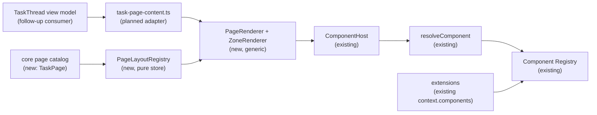

# Layout Registry — declarative pages, zones and component policies

> Slug: `layout-registry` · Status: **designed, awaiting implementation** · Epic 2
> (Component Platform), next item after the component host. Builds on
> `2026-09-19-component-registry.md`, `2026-09-19-component-resolver.md` and
> `2026-09-19-component-host.md`. Delivery is client-only: `packages/web`, with no HTTP,
> server, persistence or extension-api surface. This spec ships the registry foundation and
> declarative `TaskPage` catalog; live Task Page adoption is a separate consumer spec.

## 📝 TLDR

The cockpit can now register and render one component contract at a time: `TaskHeaderMain` and
`TaskComposer` already go through the component registry and `ComponentHost`. The task page itself
is still assembled by `TaskThread` and `RunHeader` with concrete imports and hand-written JSX. A
new component therefore requires editing the page consumer, even when its contract and fallback
are already registered.

This proposal adds a declarative **Page Layout Registry**. A page definition records its zones,
their semantic placement categories and any narrower component-contract constraints, for example
`task.page` with `task.header`, `task.main` and `task.sidebar`. A generic zone renderer walks that
definition and delegates each accepted contribution to the existing `ComponentHost`; it does not
switch on component ids or import all known components. Category-open zones can host future
extension panels whose contract is not known to core, while still resolving every item through the
versioned component registry. The core catalog declares `TaskPage` in this item, but the live route
does not adopt it yet. That consumer migration is deliberately separate so the registry contract
can ship and be tested without changing the working task UI.

## Resolved assumptions (autonomous defaults)

| # | Question | Applied default | Why | Confirm? |
|---|---|---|---|---|
| Q1 | Is this a generic registry for every cockpit page, or a Task Page feature only? | Build a reusable registry and renderer, and register the declarative `task.page` definition, but do not migrate the live Task Page route in this item. | The registry foundation and its first catalog entry can ship independently; wiring a working route is a separate consumer change with its own visual and interaction gate. | reversible |
| Q2 | How does a zone describe the component types it accepts? | Every zone declares a validated semantic `placement` category; it may additionally list exact `ComponentContract` id/version constraints. An omitted allowlist means the category is open to future contracts. Raw React components and arbitrary implementation ids are never accepted. | Placement categories let a sidebar host Jira, GitHub or future panels that core does not know yet, while optional contract constraints preserve typed props and the existing resolver for stricter zones. | reversible |
| Q3 | May a zone contain one component or a collection? | `single` and `many` are cardinality constraints on the same content pipeline, not separate rendering mechanisms. Task Page uses `single` for `task.header` and `many` for extensible `task.main`/`task.sidebar` content. | Validation can reject overflow while the renderer preserves one ordering/key model, leaving later DnD and reordering independent of the renderer's component path. | reversible |
| Q4 | Should extensions register whole pages and zones through the public extension API now? | No. The first registry is host-owned and populated by the core catalog; extension implementations continue to enter through `context.components.provide`. | Publishing page composition, zone ids and cross-extension ordering is a larger compatibility contract. The component host already enables useful replacements without expanding the public API. | reversible |
| Q5 | Where are page definitions and user layout choices stored? | Definitions and the runtime registry are in memory. This item has no server endpoint, browser storage, `~/.cezar` file, drag/drop order or user persistence. | The registry is a runtime composition contract, not user state. Keeping it ephemeral preserves zero-config behavior and makes rollback a code change. | reversible |
| Q6 | What happens when a required zone has no compatible component? | The registry reports a typed missing/invalid-zone state; `PageRenderer` and its fallback policy decide whether to preserve space, show an inline diagnostic or use another host-owned fallback. Optional empty zones render nothing. No content crosses into another zone. | The pure registry should not own React/error UI. Keeping presentation in the renderer preserves provider-specific fallback policy while ensuring missing controls are never silently moved. | reversible |

## 📝 Problem Statement

The component platform has deliberately separated three concerns:

- `packages/web/src/component-registry/registry.ts` stores implementations and their provenance;
- `resolve.ts` chooses the user's preferred compatible implementation or core's default;
- `component-host.tsx` applies the contract's layout and isolates failures while rendering one
  contract.

The page still owns the composition policy. `TaskThread` renders `RunHeader`, transcript content,
status/footer surfaces and the composer in a fixed order. `RunHeader` itself renders a
`ComponentHost` for `TaskHeaderMain`. This works for two slots, but it leaves the page consumer
with knowledge of every component and every future insertion point. A new task panel must modify
the route, decide its DOM position, choose its accepted component type and repeat the same failure
handling rules.

That is the gap in the brief's Definition of Done. A component registry answers *what can be
rendered*; it does not answer *where it may render*. The missing contract is the page tree:

```text
task.page
├── task.header
├── task.main
└── task.sidebar
```

Without a page-level definition:

- zone ids are implicit `data-slot` strings rather than a validated placement contract;
- the renderer can accidentally accept a component that was never designed for that surface, or
  prevent a valid future extension panel because core has not named its contract yet;
- required and optional regions have no shared state reporting or fallback policy;
- core and extensions cannot reason about the available page structure without reading route JSX;
- the next component is hardcoded into the renderer, defeating the component platform.

The existing `LayoutRegistry` in `packages/web/src/lib/layout-elements.ts` is not this mechanism.
It tracks mounted DOM representatives for edit mode, parent/child discovery and future layout
operations. It must remain separate. The new type is named `PageLayoutRegistry` and owns page
definitions, not DOM nodes or user-edited geometry.

## 📝 Proposed Solution

Add `packages/web/src/page-layout/` with three pure/runtime layers:

1. `definitions.ts` declares the immutable page and zone contracts.
2. `registry.ts` validates and stores the available page definitions, exposes snapshots and
   change notifications, and never imports React or concrete components.
3. `renderer.tsx` reads a page definition and generic zone content, then delegates each content
   item to `ComponentHost`. It knows how to render a zone, not which task component belongs there.

The core catalog declares `TaskPage` once, without changing the live route in this PR:

```text
task.page
├── task.header   placement task.header.main, single, required, constrained to TaskHeaderMain
├── task.main     placement task.main.content, many, required
└── task.sidebar  placement task.sidebar.panel, many, optional, category-open
```

The later Task Page consumer migration will register the existing `TaskHeaderMain` and
`TaskComposer` where their current page owners place them. The composer is specified as a final,
bottom-docked item in `task.main`, with its current sticky behavior retained. `task.sidebar` is an
optional category-open extension point: its adapter can accept any valid contract contribution
declaring the `task.sidebar.panel` placement, including a contract introduced after core ships.
This definition does not invent a visible sidebar or alter the current UI.

The renderer receives a page-specific view model adapter, not a list of imported component
implementations:

```text
Page consumer model (follow-up)
  └─ PageRenderer(page=TaskPage, content=taskPageContent(model))
       ├─ generic ZoneRenderer(task.header)
       │    └─ ComponentHost(contract=TaskHeaderMain, props=...)
       ├─ generic ZoneRenderer(task.main)
       │    └─ ComponentHost(placement=task.main.content, contract=..., props=...)
       └─ generic ZoneRenderer(task.sidebar)
            └─ ComponentHost(placement=task.sidebar.panel, contract=..., props=...)
```

The future adapter is the boundary where domain data becomes contract props. It may import the
relevant contract token and build its typed props, but the renderer does not import `TaskHeaderMain`,
`TaskComposer`, `CoreTaskHeaderMain` or any extension implementation. A static boundary test must
fail if the generic renderer gains a component-id switch or a concrete task-component import.

### Prior art

- **Backstage frontend extensions.** Backstage models extensions as instances attached to named
  parent extension points, and blueprints package the attachment point and output together. We
  take the explicit placement category and parent/child composition model, but keep Cezar's local
  registry and optional contract-token constraints.
  [Frontend extension architecture](https://backstage.io/docs/next/frontend-system/architecture/extensions/)
  and [extension blueprints](https://backstage.io/docs/frontend-system/architecture/extension-blueprints/)
  are the relevant references.
- **Grafana dashboard JSON.** Grafana treats panels as data in a dashboard model and keeps panel
  placement separate from the panel implementation. We take the separation between a page model
  and the rendered component; we do not add persisted grid geometry in this item.
  [Grafana dashboard JSON model](https://github.com/grafana/grafana/blob/main/docs/sources/visualizations/dashboards/build-dashboards/view-dashboard-json-model/index.md).
- **React Grid Layout.** Its layout is an explicit list of layout items keyed independently from
  the React element tree. We take stable ids and declarative placement as a future-compatible
  shape, but deliberately defer coordinates, resizing and drag/drop to the existing edit-mode
  work.
  [React Grid Layout README](https://github.com/react-grid-layout/react-grid-layout/blob/master/README.md).

### Alternatives considered

- **Keep adding `ComponentHost` calls directly to each route.** Rejected. It preserves the exact
  coupling this item removes: every new component still requires a route edit and duplicated zone
  policy.
- **Make the existing DOM `LayoutRegistry` also store page definitions.** Rejected. Its lifecycle
  is mount/unmount of DOM nodes in edit mode; page definitions must exist before a component
  mounts, work without a DOM and stay independent of editable layout state.
- **Let a zone accept `React.ComponentType` values.** Rejected. It bypasses the component registry,
  contract versioning, fallback, compatibility checks and extension provenance.
- **Use only string component kinds such as `"task-header"`.** Rejected. A placement category is
  intentionally a validated contribution id, but it is not an implementation selector or a props
  type. Each content item still carries a versioned `ComponentContract`; the category answers
  where it may render and the component registry answers how it renders.
- **Let the renderer choose the first compatible implementation.** Rejected. The resolver's rule
  is opt-in selection with core's default fallback; registration order must never change what a
  user sees.
- **Persist page definitions or user zone order immediately.** Rejected. No user state is required
  to prove declarative rendering, and persistence would create migrations and rollback rules before
  the page model is stable.

## 📝 Architecture



### Module boundaries

- **New:** `packages/web/src/page-layout/definitions.ts`, `registry.ts`, `renderer.tsx`,
  `core-pages.ts` and tests.
- **Changed:** `AGENTS.md` to document the new source of truth. Application bootstrap and the
  task-route consumer are intentionally deferred to the follow-up migration spec.
- **Reused:** `packages/web/src/component-registry/provider.tsx`, `component-host.tsx`, `resolve.ts`
  and `core-components.ts`.
- **Unchanged:** HTTP contracts, server routes, `packages/cezar`, `packages/api-client`, the
  extension API package, the DOM `LayoutRegistry`/`LayoutElement` edit-mode model and persisted
  run/workspace state.

The eventual application bootstrap will create one page registry and pass it through a
`PageLayoutProvider`; this item proves that wiring with isolated providers and fixture trees but
does not mount the provider in the live app. It is not a module singleton: tests and isolated
previews can create their own registry, and a future multi-page shell cannot leak definitions
between app instances. The registry's only runtime dependencies are platform-neutral validation
helpers and the component-contract types.

`PageLayoutRegistry.registerPage` validates a complete definition before publishing it. A failed
registration leaves the previous snapshot untouched. Successful registration/disposal increments
the revision and notifies subscribers; `PageRenderer` uses `useSyncExternalStore`, so a page
definition added or removed during extension/bootstrap work is observed without polling.

The renderer has no `switch (componentId)`, no `if (zone.id === ...)` branch for component
selection and no imports of concrete implementations. It looks up the zone definition, filters
the supplied content by placement category and, when present, the zone's accepted contract
ids/versions, then renders each item through `ComponentHost`. Invalid content is rejected at the
adapter/registry boundary and is never silently rendered in a neighbouring zone. The registry
reports typed state only; the renderer owns the visual fallback policy.

## 📝 Data Model

The model is immutable and in memory:

```ts
type PageId = ContributionId
type ZoneId = ContributionId
type PlacementId = ContributionId

interface ZoneLayout {
  readonly order?: number
  readonly sizing?: 'content' | 'fill'
  readonly sticky?: 'top' | 'bottom'
  readonly minBlockSize?: number
}

interface ZoneDefinition {
  readonly id: ZoneId
  /** Semantic placement category, not an implementation id. */
  readonly placement: PlacementId
  /** Optional narrow contract allowlist; omitted means any contract for this placement. */
  readonly accepts?: readonly ComponentContract<unknown>[]
  readonly cardinality: 'single' | 'many'
  readonly required: boolean
  readonly layout?: ZoneLayout
}

interface PageDefinition {
  readonly id: PageId
  readonly version: number
  readonly zones: readonly ZoneDefinition[]
}

interface ZoneContent {
  readonly key: string
  readonly placement: PlacementId
  readonly contract: ComponentContract<unknown>
  readonly props: unknown
}

interface PageContent {
  readonly pageId: PageId
  readonly zones: Readonly<Record<ZoneId, readonly ZoneContent[]>>
}
```

The production API should use the repository's existing `AnyComponentContract`/`NoInfer`
patterns rather than hand-writing a parallel component type. The pseudotypes above are the
conceptual shape; the implementation must keep the type-safe `ComponentHost` call at the
zone-content boundary.

Validation rules:

- page ids, zone ids, placement ids and contract ids are non-empty, normalized contribution-style ids;
- a page id is unique in one registry, and its zone ids are unique within that page;
- when present, a zone's `accepts` list has no duplicate `(id, version)` pair;
- content placement must match the zone's placement category; a non-empty `accepts` list additionally
  requires an exact `(id, version)` contract match;
- `single` and `many` are cardinality constraints applied by the same content pipeline; single
  zones reject a second item and many zones preserve explicit adapter order;
- a required zone reports an empty/invalid state when it has no usable content, but does not own a
  React error view or fallback policy;
- `content.pageId` must match the rendered page definition;
- every content item carries a valid component contract, even when its zone is category-open;
- unknown or disposed definitions are rejected without mutating the last valid snapshot;
- `order` and layout metadata are advisory placement rules, not persisted user geometry.

The registry stores definitions, not implementation records. The Component Registry remains the
only place that knows whether an implementation is compatible, who provided it and which default
to use. A zone admits content by semantic placement first and can narrow that admission by
contract token identity (`id` + `version`); the component implementation is compatible through
`checkComponentCompatibility` and the existing resolver.

## 📝 API Contracts

The following host-side TypeScript API is normative; exact generic spelling may use the existing
component-registry aliases.

```ts
export interface PageLayoutRegistry {
  registerPage(definition: PageDefinition): Disposable
  getPage(id: PageId): PageDefinition | undefined
  listPages(): readonly PageDefinition[]
  getZone(pageId: PageId, zoneId: ZoneId): ZoneDefinition | undefined
  validateContent(content: PageContent): readonly PageContentIssue[]
  subscribe(listener: () => void): () => void
  revision(): number
}

export type PageContentIssue =
  | { readonly code: 'unknown-page'; readonly pageId: PageId }
  | { readonly code: 'unknown-zone'; readonly pageId: PageId; readonly zoneId: ZoneId }
  | { readonly code: 'placement-not-accepted'; readonly zoneId: ZoneId; readonly placement: PlacementId }
  | { readonly code: 'contract-not-accepted'; readonly zoneId: ZoneId; readonly contractId: string; readonly version: number }
  | { readonly code: 'required-zone-empty'; readonly zoneId: ZoneId }
  | { readonly code: 'cardinality-exceeded'; readonly zoneId: ZoneId }
  | { readonly code: 'invalid-content'; readonly zoneId: ZoneId }

export function createPageLayoutRegistry(): PageLayoutRegistry

export function PageLayoutProvider(props: {
  readonly registry?: PageLayoutRegistry
  readonly children: React.ReactNode
}): React.ReactElement

export function PageRenderer(props: {
  readonly content: PageContent
  readonly fallback?: (issue: PageContentIssue, zone: ZoneDefinition) => React.ReactNode
}): React.ReactElement
```

`registerPage` is core-owned in this item. A future extension-facing `context.pages` service must
define namespace, lifecycle, ordering and security rules before it is added to
`packages/extension-api`; no implementation should smuggle it through `context.components`.

### Rendering semantics

1. `PageRenderer` resolves the page by `content.pageId` and subscribes to registry revision.
2. It walks the immutable zone list in declaration order; it does not derive order from object-key
   enumeration or component registration order.
3. It validates each content item against the zone's placement category and, when present, its
   accepted `(contract id, version)` set.
4. It renders accepted items through `ComponentHost`, passing `key`, `subject` and the adapter's
   typed props. `ComponentHost` owns preference, compatibility, layout metadata, Suspense and
   implementation error-boundary behavior.
5. The registry reports `required-zone-empty` for a required zone without usable content. The
   default renderer policy may preserve the zone's minimum size and show a stable diagnostic box;
   an injected `fallback` may choose another presentation. An empty optional zone returns no DOM.
6. If a selected extension implementation fails, `ComponentHost` falls back to core's default;
   the zone remains the same zone and does not retry a different zone's content.
7. A disposed page definition or an invalid update is ignored by the rendered snapshot after one
   diagnostic; the last valid page remains active until its owner removes it intentionally.

### Task Page declaration

The first core catalog entry is conceptually:

```ts
export const TaskPage: PageDefinition = definePage({
  id: 'task.page',
  version: 1,
  zones: [
    { id: 'task.header', placement: 'task.header.main', accepts: [TaskHeaderMain], cardinality: 'single', required: true },
    { id: 'task.main', placement: 'task.main.content', accepts: [TaskComposer], cardinality: 'many', required: true },
    { id: 'task.sidebar', placement: 'task.sidebar.panel', cardinality: 'many', required: false },
  ],
})
```

`task.sidebar` is deliberately category-open: a future panel contributes the same semantic
placement and brings its own versioned contract token, even if core has never imported that
contract. The foundation tests use fixture contracts to prove both the narrow `task.header` policy
and the open sidebar policy; they are not an untyped component escape hatch. `TaskMain` or a future
metadata contract can be added as a narrow allowlist when its first real host needs typed props.

## 📝 UI/UX

No visual redesign or live route change is proposed. The later Task Page consumer must render the
same header, transcript, task status/footer, review/plan surfaces and bottom composer at the same
responsive breakpoints. The registry changes the future composition contract and extension reach,
not the layout tokens or copy in this item.

The registry foundation adds no user-visible state because it is not mounted in the live route.
The later consumer should preserve the defensive states already implied by `ComponentHost`:

- a required zone with no usable content is reported by the registry; the renderer's default
  fallback policy may keep its reserved space and show a concise inline error;
- an extension implementation failure shows the existing component-host fallback notice while the
  rest of the task page remains usable;
- an optional empty zone contributes no empty panel, border or focus target.

The renderer must preserve keyboard order, landmarks, focus containment and mobile safe-area
behavior from the current task page. Zone wrappers may carry stable `data-page-id` and
`data-zone-id` attributes for testing and future editor discovery, but must not replace the
existing `data-slot` attributes relied on by current tests and automation.

Mockups: skipped — this spec proposes no intentional visual change; browser validation of the
implementation should compare the existing task page at mobile and desktop widths.

## 📝 Edge Cases & Failure Scenarios

- **Duplicate page or zone:** registration fails atomically with a diagnostic; the currently
  active definition keeps rendering.
- **Unknown placement or contract version:** content is rejected for that zone. The renderer does
  not coerce a placement, cast props or fall through to another zone. A category-open zone may
  accept a contract core has never seen, but the item still needs a valid contract token and the
  normal component resolver path.
- **Missing core default:** the existing `missingCoreDefaults` gate catches it; once the consumer
  is mounted, the registry reports the required zone's unusable state and the renderer's fallback
  policy decides whether to preserve the box or show an error rather than blanking the route.
- **Extension activation after first paint:** the page registry is ready to notify its subscribers;
  the later consumer will combine that with component-registry notifications. This item does not
  mount the live route, so no runtime page swap is introduced here.
- **Extension disposal:** once the consumer is mounted, a chosen implementation disappearing
  returns `ComponentHost` to the core default in the same zone. A sidebar contribution disappearing
  does not alter main content.
- **Placement and many-zone order:** the content's semantic placement must match the zone, while
  explicit `ZoneContent.key` and adapter order are authoritative. Registration order, object-key
  order and extension activation order are never used as layout policy.
- **One-zone overflow:** a `single` zone rejects a second item instead of silently replacing the
  first. A `many` zone keeps all accepted items within its declared container.
- **Props mismatch:** a typed adapter/contract failure is a test/build failure; a runtime malformed
  content object becomes `invalid-content` and is handed to the renderer fallback policy, never an
  unhandled throw.
- **React StrictMode:** registering, subscribing and disposing twice is idempotent; no duplicate
  page or zone definitions and no duplicate diagnostics are emitted.
- **Route transition:** page content is scoped to the current route/task subject. No registry state
  leaks from one task to another, and user drafts, transcript scroll and read receipts keep their
  existing owners.
- **Edit mode:** page zones are not `LayoutElement`s. Registering a zone does not make it movable,
  deletable or interactive in edit mode; the existing global interaction guard remains authoritative.

## 📝 Risks & Impact Review

The page definition becomes a compatibility surface. Renaming `task.header`, changing a zone from
single to many, changing its placement category, or removing an accepted major can strand content
adapters and extension choices. Therefore page ids, zone ids, placement categories, cardinality
and accepted contract versions are versioned data. A breaking page change increments
`PageDefinition.version` and keeps an adapter for the prior shape until no persisted choices exist;
this item has no persisted choices, so rollback is deleting the new catalog/renderer integration
and restoring the existing JSX.

The largest follow-up risk is migrating a working task page: `RunHeader`, transcript state,
composer drafts, review controls and mobile scrolling have load-bearing ownership that must not be
lost merely because the outer composition becomes declarative. That migration is intentionally
separate, with its own pixel and interaction gate. This foundation has no shipped route behavior,
so its rollback is deleting the registry/catalog modules and their tests.

The registry must not become a second source of truth for component compatibility, preferences,
edit-mode geometry or persistence. Those remain in the component registry, resolver/host,
`LayoutRegistry`, and existing draft/storage systems respectively. No HTTP or backward-compatible
server surface changes, so `BACKWARD_COMPATIBILITY.md` does not gain a new API entry; the page and
zone contract is still documented in `AGENTS.md` as a protected cockpit convention.

## 📋 Phasing

### Phase 1 — Page definitions and registry

Add the pure immutable definition types, placement validation, snapshot, disposal and subscription.
Prove the registry with fixture pages and zones, including category-open zones, atomic failure and
StrictMode-safe disposal. No route changes yet.

### Phase 2 — Generic zone renderer

Add provider/context and a generic `PageRenderer`/`ZoneRenderer` that consumes page definitions and
delegates placement-matching content to `ComponentHost`. Prove required/optional zones,
single/many cardinality as one constraint, narrow and category-open acceptance, renderer-owned
fallback states and the no-hardcoded-components boundary.

### Phase 3 — Task Page catalog

Declare `task.page` and its initial zones as a core catalog entry. Do not mount it in the live
route. Add fixture content that proves the header/main/sidebar placement policy, admits an unknown
future sidebar contract by category, and keeps missing sidebar content optional. The route
migration is a separate follow-up.

### Follow-up — Task Page consumer migration

Wire `TaskThread` to `PageRenderer` through a typed `task-page-content.ts` adapter, preserving
header/composer ownership, transcript scroll and all current visual states. This is independently
deployable and must be specified/reviewed as a consumer PR. Only after that migration is stable,
decide whether extensions need to register pages or zones. If yes, write a separate extension-api
spec covering namespaces, lifecycle disposal, ordering, security and compatibility.

## 📋 Implementation Plan

Every step is testable and leaves the application working. Run the repository validation gate after
each phase: `npm run typecheck`, `npm test`, `npm run test:unit`, `npm run build` and
`npm run test:package`.

### Phase 1 — Page definitions and registry

1. Add `PageId`, `ZoneId`, `ZoneDefinition`, `PageDefinition`, `PageContent` and issue types in
   `packages/web/src/page-layout/definitions.ts`, reusing existing component-contract aliases.
   Tests reject malformed ids, duplicate accepted contracts, invalid placement ids and invalid
   layout metadata.
2. Implement `createPageLayoutRegistry` with atomic registration, `getPage`, `getZone`, ordered
   snapshots, placement/contract-aware `validateContent`, idempotent disposal and revision
   subscriptions. Tests prove that a failed registration cannot partially replace a working
   definition.
3. Add the development/runtime diagnostic policy for duplicate or invalid definitions. A throwing
   subscriber cannot prevent another subscriber or corrupt the registry.

### Phase 2 — Generic zone renderer

4. Add `PageLayoutProvider`, `usePageLayoutRegistry` and `PageRenderer` using
   `useSyncExternalStore`; isolated tests can inject a registry and the default app creates one
   instance.
5. Add `ZoneRenderer` that walks definitions in declaration order and renders placement-matching
   content only through `ComponentHost`. Tests use fixture contracts to prove core fallback,
   category-open extension content, cardinality validation, renderer-owned required-zone fallback
   state and optional-zone omission.
6. Add a static boundary test that scans `page-layout/` and fails on concrete component imports,
   component-id switches, raw `React.createElement` calls and use of the DOM edit-mode registry.
7. Add stable `data-page-id`/`data-zone-id` attributes while preserving existing `data-slot`
   attributes; test keyboard order, focus behavior and no duplicate diagnostics under StrictMode.

### Phase 3 — Task Page catalog

8. Declare `TaskPage` in `core-pages.ts` with `task.header`, `task.main` and `task.sidebar`, and
   add a gate that every narrow production contract has a core default or an explicit required
   zone fallback; category-open optional zones remain valid extension points without a core import.
9. Add fixture content/tests that prove `task.main` can preserve an explicit bottom-docked
   composer item, that a future contract can enter category-open `task.sidebar`, and that an empty
   sidebar contributes no DOM.

### Follow-up handoff

10. Update `AGENTS.md`'s Web UI/component-registry rows with the `PageLayoutRegistry` source of
    truth, the separation from the editable DOM `LayoutRegistry`, and the no-hardcoded-renderer
    boundary.
11. Run the full gate and document any remaining consumer, contract or extension-API questions in a separate
    follow-up spec rather than expanding this implementation.

## 📋 Acceptance Criteria

- [ ] `PageLayoutRegistry` stores validated page definitions and their zones in memory.
- [ ] `task.page` has declarative `task.header`, `task.main` and `task.sidebar` zone definitions.
- [ ] Each zone records a semantic placement category, optional accepted `ComponentContract`
      ids/versions, cardinality, requiredness and layout metadata.
- [ ] The generic renderer walks page/zone definitions and contains no hardcoded component ids or
      concrete task-component imports.
- [ ] Accepted components render through the existing `ComponentHost` and component resolver.
- [ ] The registry reports a typed required-zone failure and the renderer/fallback policy provides
      the stable fallback/error state; an empty optional zone adds no DOM.
- [ ] A category-open zone can accept a future valid component contract without a core import.
- [ ] Extension implementation failures remain isolated to their zone and fall back as today.
- [ ] Duplicate/invalid definitions fail atomically and do not corrupt the active snapshot.
- [ ] StrictMode, mount/unmount and registry subscription behavior are idempotent and leak-free.
- [ ] A fixture Task Page definition proves the intended header/main/sidebar policy without
      mounting a live route or changing current visual behavior.
- [ ] The new registry is separate from the edit-mode DOM `LayoutRegistry`.
- [ ] No HTTP route, server state, persistence file, live Task Page migration, `context.pages` API
      or user-authored config is added in this item.
