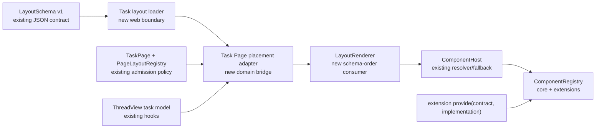

# Layout Renderer — render the Task Page from Layout Schema

## 📝 TLDR

The schema-backed Task Page boundaries are still assembled by `TaskThread` and `RunHeader` with a
hardcoded JSX component list, even though `origin/main` now has a validated v1 `LayoutSchema`, a
declarative `TaskPage` catalog, layout constraints, and a generic `PageRenderer`. **Future behavior**
adds the consumer bridge for this iteration's schema-backed regions, header and composer: their zones
and placements are visited in schema order, and each valid placement is rendered through the existing
`ComponentHost`. Here, “Task Page” means those schema-backed regions, not the transcript or core shell.

This spec is design-only. It does not change the serialized schema, add persistence or migrations,
publish a page-registration API, or move shell-owned task behavior into the renderer.

## Resolved assumptions (autonomous defaults)

| # | Question | Applied default | Why | Confirmation |
|---|---|---|---|---|
| Q1 | Should this replace every DOM region on the Task Page, including transcript, review, actions and edit-mode controls? | Established v1 scope: migrate only the schema-backed Task Page boundaries, currently header and composer. The task shell, transcript, footer/review surfaces, actions, read receipts, scrolling, drafts, and edit-mode interaction remain owned by their current consumers. | The existing schema and catalog define only these contract-backed boundaries. The brief's “Task Page” is interpreted as the regions represented by that schema in this iteration; inventing contracts or expanding the schema would create separate public/API decisions. | Resolved autonomously; no gated assumption |
| Q2 | Should the renderer extend the `LayoutSchema` wire format with props, implementation ids, or a new order field? | No. The renderer receives a validated schema and uses a typed, code-owned placement adapter to derive the served contract token, subject and props from the current Task Page model. | `LayoutSchema` is JSON-only and explicitly rejects `props`, `component` and `implementation`; preserving it avoids a migration and keeps implementation selection in `ComponentHost`. | No |
| Q3 | Which order is authoritative when schema order differs from the `TaskPage` catalog order? | The schema is authoritative for both zone iteration and placement iteration. The catalog remains authoritative for zone admission, cardinality and requiredness. | The Definition of Done requires changing schema order to change UI order, while the catalog must remain the policy source. | No |
| Q4 | How should extension components enter the schema? | A placement names a served contract id/version, not an implementation id. Core and extension implementations of that contract are resolved by `ComponentHost`; an extension-defined contract or whole-page/zone contribution is out of scope. | This reuses resolver preferences, compatibility checks and fallback behavior without adding `context.pages`, extension ordering or a second component selector. | No |
| Q5 | What happens when loading or adapting a layout fails? | The live route always starts with immutable `defaultTaskPageLayout`. An optional normalized schema supplied by the route/test adapter may replace the current Task Page instance snapshot only after complete validation. An invalid replacement retains the current valid snapshot and exposes a bounded diagnostic; individual invalid placements are skipped and do not move zones. | This is reversible, preserves the working zero-config page, and makes failure atomic without an unreachable no-snapshot live state. | No |
| Q6 | What owns layout lifecycle and reset boundaries? | One immutable snapshot belongs to one Task Page route instance. A replacement is applied atomically after validation; the last-valid snapshot and diagnostics are discarded when the route/task identity changes. There is no persistence and no app-global mutable layout singleton. | Route-instance ownership prevents one task's layout/order or diagnostics from leaking into another while keeping tests and previews injectable. | No |

## 📝 Problem Statement

The repository has two related but deliberately separate layout mechanisms:

- `packages/extension-api/src/layout/schema.ts` defines and parses v1 JSON layout intent:
  `{ page, schemaVersion, zones: { [zone]: LayoutPlacement[] } }`. A placement has only a stable
  id, contract id/version and small presentation metadata; it cannot carry React components,
  implementation ids, props or settings.
- `packages/web/src/page-layout/` defines the host-owned `PageLayoutRegistry`, `TaskPage` catalog,
  zone admission and the generic `PageRenderer`. Its current renderer consumes `PageContent`, where
  each item has a runtime contract token and props, not a serialized `LayoutSchema` placement.

The live task route does not use either page-layout registry as its composition source. `ThreadView`
renders `RunHeader`, transcript content, footer/review content and the composer directly. This means
changing layout data cannot change the order of the schema-backed UI, and adding a schema-backed
component requires editing the route rather than supplying a placement and adapter.

The desired behavior is narrow but load-bearing: a valid Task Page layout must determine zone and
placement order, every rendered placement must pass through the same `ComponentHost` used by current
slots, and extension implementations must work without the layout knowing their implementation id.

## 📝 Proposed Solution

Add a web-side layout consumer, tentatively `LayoutRenderer` plus a Task Page placement adapter, on
top of the existing page-layout and component-host primitives:

1. Initialize each live Task Page instance from the immutable code-owned `defaultTaskPageLayout`.
   An optional normalized `LayoutSchema` supplied by a route/test adapter may replace that instance's
   current snapshot. The loader owns raw parsing, diagnostics and atomic last-valid replacement; the
   renderer does not reimplement schema migration or validation.
2. Resolve the schema page (`task`) to the registered `TaskPage` definition. Translate schema zone
   names (`header`, `main`, `sidebar`) to the catalog's zone ids (`task.header`, `task.main`,
   `task.sidebar`) in the Task Page adapter. This mapping is page-specific, not a generic component
   id switch.
3. Walk the schema's zone entries in their serialized/object order, then each zone's placement array
   in array order. For each placement, the adapter resolves the exact served contract token by
   `(contract, contractVersion)` and derives typed props and a stable subject from the current task
   model. The renderer delegates the resulting item to `ComponentHost`.
4. Reuse `PageLayoutRegistry` admission/constraint rules for unknown zones, unsupported placement
   categories, contract/version mismatches, duplicates and cardinality. For a `single` zone, retain
   the first accepted placement in schema order and report/skip each later accepted placement; for a
   `many` zone, retain every accepted placement in schema order. Do not repair invalid items by moving
   them to another zone or selecting the first registered implementation.
5. Mount the schema-backed output in the Task Page consumer while preserving current shell ownership:
   `RunHeader` remains the header shell, and the transcript, review/footer, task actions, scrolling,
   drafts, loading/error route states and edit-mode DOM `LayoutRegistry` remain outside this renderer.

The current `PageRenderer` cannot be the sole schema consumer because it walks the catalog's zone
declaration order, while this feature makes schema order authoritative. The implementation should
extract/reuse its pure admission and zone-box helpers, then let `LayoutRenderer` walk the normalized
schema order and delegate each accepted item through an opaque validated binding whose typed factory
renders `ComponentHost`. Refactoring `PageRenderer` to accept an explicit ordered zone sequence is
also valid, but silently routing the schema through catalog order is not. There must still be one
admission predicate and one component host/error-boundary path.

### Repository research and prior art

The relevant repository specs establish the separation this proposal keeps: `2026-09-20-layout-
registry.md` defines the page catalog and defers live-route adoption; `2026-09-20-layout-
constraints.md` makes page admission and contract policy a shared pure seam; and the component-host,
resolver and contract specs keep implementation selection, layout boxes and fallback behavior out of
page composition. The same layout-registry research cites Backstage attachment points, Grafana's
panel JSON model and React Grid Layout's stable item keys. This feature takes their declarative
identity/order boundary, but not their persisted grid geometry, extension-owned page graph or
automatic provider ordering.

### Alternatives considered

- **Keep hardcoded `ComponentHost` calls in `TaskThread`.** Rejected because schema order would remain
  inert and every new placement would still require route code.
- **Put props or implementation ids in `LayoutSchema`.** Rejected by the existing schema contract;
  it would couple persisted JSON to React/runtime state and bypass `ComponentHost` preferences and
  fallback.
- **Make `PageRenderer` infer props from contract ids.** Rejected. Generic page-layout modules must
  not import task components or switch on component ids. Domain data-to-props mapping belongs in the
  Task Page adapter.
- **Use registry registration order or the first compatible implementation.** Rejected by the
  resolver contract: implementation selection is opt-in and core default fallback is deterministic.
- **Add `context.pages` or extension-owned page/zone registration now.** Deferred. This renderer can
  render extension implementations of served core contracts without widening the extension API.
- **Convert the DOM edit-mode `LayoutRegistry` into the schema renderer.** Rejected. It owns mounted
  DOM representatives and edit-mode mutations; the renderer must work before DOM registration and in
  isolated previews.

## 📝 Architecture



### Module boundaries

- **New or changed in `packages/web/src/page-layout/`:** a loader/adapter and the schema-backed
  renderer, with focused tests. Exact filenames are an implementation choice, but the generic
  renderer must stay free of concrete task component imports and component-id conditionals. Shared
  admission/zone helpers may be extracted from the current `PageRenderer`; do not create a second
  compatibility or host-failure implementation.
- **Changed in `packages/web/src/routes/task-thread/`:** a Task Page adapter that owns the mapping
  from the current `ApiRun`/thread model to contract props and intents, and the consumer migration
  that replaces only schema-represented hardcoded slots.
- **Reused:** `parseLayoutSchema`, `parseLayoutJson`, `defaultTaskPageLayout`, `TaskPage`,
  `PageLayoutRegistry.validateContent`, layout constraints/admission, `ComponentHost`,
  `ComponentsProvider`, `resolveComponent`, and the component registry shared by the extension host.
- **Unchanged:** `packages/extension-api` layout wire format and public surface, HTTP/server/API
  packages, `PageLayoutRegistry` versus the DOM `LayoutRegistry` separation, component preference
  semantics, extension permissions/lifecycle, and task data persistence.

The app must provide the page-layout registry/provider at the same scope as the task route, without
creating a module singleton. The component registry remains the one shared instance built by
`main.tsx` and passed through `ComponentsProvider`; the layout registry stores page definitions only.
The live route's layout state is separate: it is created per `{route, run.id}` instance, initialized
from `defaultTaskPageLayout`, and replaced only by an optional normalized schema supplied by that
route/test adapter. A complete replacement is validated before publication as one immutable snapshot;
there is no app-global mutable layout state or persistence.

## 📝 Data Model

No new persisted model is proposed. The existing v1 document remains authoritative input:

```ts
type LayoutSchema = {
  readonly page: string
  readonly schemaVersion: 1
  readonly zones: Readonly<Record<string, readonly LayoutPlacement[]>>
}

type LayoutPlacement = {
  readonly id: string
  readonly contract: string
  readonly contractVersion: number
  readonly layout?: { readonly collapsed?: boolean; readonly density?: 'comfortable' | 'compact'; readonly width?: 'auto' | 'small' | 'medium' | 'large' }
}
```

The runtime adapter produces ephemeral `ZoneContent`-equivalent values:

- `key`: the placement id, unique across the schema and used as the React key;
- `placement`: the catalog placement category for the mapped zone;
- `contract`: the host-served `ComponentContract` token found by exact id/version;
- `props`: typed view-model props built from the current task model, never read from the schema.

Stable keys are based on the schema placement id, scoped by page and zone when passed to React and
`ComponentHost.subject` (for example `task:<runId>:<zoneName>:<placementId>`). They must not use array
indexes, registration order, extension activation order or object identity. Duplicate ids are already
invalid at schema parsing time; a defensive runtime adapter treats a duplicate as invalid rather than
rendering both or silently renaming one.

The placement's `layout` metadata is preserved as input metadata for future consumers, but this
renderer ignores it: it does not affect `ComponentHost` layout, DOM attributes/styles, props,
ordering, admission or keys. The existing constraint work on `origin/main` resolves runtime contract
policy from the immutable contract catalog rather than copying policy into serialized layout data;
this renderer follows that rule.

### Existing schema and migration work

The implementation is based on the current `origin/main` layout work, including:

- v1 parser/serializer and `LayoutSchemaError` from `27d5a182` (`feat(extension-api): add layout
  schema contract`), which preserve zone and placement order and reject runtime implementation data;
- the `TaskPage`/`PageLayoutRegistry` foundation from `e7a2c330`, whose live route migration was
  intentionally deferred;
- component layout policy and the adjacent shared-admission/constraint design from the current
  layout-constraints work. The renderer consumes that seam; it does not redefine movable,
  removable, replaceable, allowed-zone or required-zone policy.

No new schema version or migration is needed. The strict v1 parser is the renderer's migration
boundary: any existing or future loader/migration must produce a normalized current
`LayoutSchema` before this code runs. If a future persisted loader introduces a schema migration, it
remains upstream and must preserve placement ids and order. The renderer accepts only the normalized
current schema; it does not interpret unsupported versions, migrate files, or write repaired
documents back to disk.

## 📝 API Contracts

These are host-side TypeScript contracts; they are not new HTTP or extension-api surfaces.

```ts
export interface TaskLayoutSnapshot {
  readonly identity: string // route + run id; changes reset this instance
  readonly schema: LayoutSchema // always present in the live feature
  readonly source: 'default' | 'supplied'
  readonly diagnostics: readonly LayoutRenderIssue[]
}

/** The route/test adapter owns each discriminated variant's typed contract and props factory. */
export type ValidatedLayoutBinding<Context> =
  | HeaderLayoutBinding<Context>
  | ComposerLayoutBinding<Context>

interface HeaderLayoutBinding<Context> {
  readonly kind: 'task-header-main'
  readonly schemaZone: 'header'
  readonly pageZone: 'task.header'
  readonly contractId: 'cezar.task.header.main'
  readonly contractVersion: 1
  readonly placement: 'task.header.main'
  /** This closure owns TaskHeaderMainProps and renders ComponentHost with that token. */
  readonly render: (input: BindingRenderInput<Context>) => ReactElement
}

interface ComposerLayoutBinding<Context> {
  readonly kind: 'task-composer'
  readonly schemaZone: 'main'
  readonly pageZone: 'task.main'
  readonly contractId: 'cezar.task.composer'
  readonly contractVersion: 1
  readonly placement: 'task.main.content'
  /** This closure owns TaskComposerProps and renders ComponentHost with that token. */
  readonly render: (input: BindingRenderInput<Context>) => ReactElement
}

interface BindingRenderInput<Context> {
  readonly context: Context
  readonly placement: LayoutPlacement
  readonly subject: string
}

export interface LayoutRendererProps<Context> {
  readonly snapshot: TaskLayoutSnapshot
  readonly context: Context
  readonly bindings: readonly ValidatedLayoutBinding<Context>[]
  readonly fallback?: (issue: LayoutRenderIssue) => ReactNode
}

export function LayoutRenderer<Context>(props: LayoutRendererProps<Context>): ReactElement

export interface TaskLayoutInput {
  /** Stable route/task identity; a changed value creates a fresh default snapshot. */
  readonly identity: string
  /** Already parsed/normalized replacement from a route or test adapter. */
  readonly supplied?: LayoutSchema
}

export function createTaskLayoutSnapshot(input: TaskLayoutInput): TaskLayoutSnapshot
export function replaceTaskLayout(
  current: TaskLayoutSnapshot,
  candidate: LayoutSchema,
): { readonly applied: true; readonly snapshot: TaskLayoutSnapshot } | { readonly applied: false; readonly snapshot: TaskLayoutSnapshot }
```

The exact generic names may follow existing aliases, but the following behavior is normative:

1. The loader parses raw input before `LayoutRenderer`. The live feature always has a snapshot:
   `defaultTaskPageLayout` initializes it, and an invalid replacement leaves the current snapshot
   unchanged while adding a diagnostic. No live renderer returns an error without a schema snapshot.
   An isolated preview may choose to show an error instead of mounting the default, but that is not a
   live Task Page path.
2. The renderer uses the schema page id and the registered `TaskPage` definition. Unknown page or
   zone names are issues, not permission to invent a DOM region.
3. Zones are visited in `Object.keys(layout.zones)` order as normalized by the v1 parser. Placements
   are visited in the exact array order. A schema reorder must reorder the resulting host boxes and
   DOM focus order; the renderer never sorts by catalog, placement id, contract id or registration.
4. A binding must match exact contract id/version and the expected schema zone. Its discriminated
   variant owns the corresponding typed contract token and props factory, including all callbacks and
   intents owned by core. The generic renderer consumes only the opaque validated binding and invokes
   its `render` closure with context, placement and subject; the closure renders `ComponentHost`.
   The generic renderer has no `ComponentContract<object>`, `object` props factory or production cast.
5. `ComponentHost` remains responsible for implementation preference, compatibility, loading via
   `Suspense`, implementation error boundaries, core fallback and its host-sized box. The layout
   renderer must not call `listUsable`, choose a component implementation, or catch component errors
   itself.
6. A core placement and an extension implementation use the same adapter and contract token. The
   extension is selected only by the existing preference/resolver path; the schema never names an
   extension implementation.
7. The loader/lifecycle keeps the snapshot per Task Page identity. A valid replacement publishes
   once after validation; an invalid replacement publishes no new schema. Changing route or run id
   starts from `defaultTaskPageLayout` and clears the prior instance's diagnostics.
8. `createTaskLayoutSnapshot({ identity })` uses `defaultTaskPageLayout`; `supplied` is the only
   replacement input. `replaceTaskLayout` validates the complete candidate against the page catalog
   and binding/admission rules before returning `applied: true`; on failure it returns the current
   schema/source with the diagnostic appended and does not publish a partial update.

The renderer's issue type should distinguish at least `unknown-page`, `unknown-zone`,
  `missing-placement-adapter`, `contract-not-served`, `placement-not-accepted`, `invalid-placement`,
`duplicate-placement`, and `required-zone-empty`. Issues are stable, bounded and safe to expose to a
diagnostic/fallback callback; they must not echo arbitrary props or implementation objects.

## 📝 UI/UX

Prototype and evidence:

- Current Task Page, desktop: `assets/layout-renderer/current-01-task-page-desktop.png`
- Current Task Page, mobile: `assets/layout-renderer/current-02-task-page-mobile.png`
- Proposed schema-order composition: `assets/layout-renderer/mockup-01-task-page-schema-order.html`
  and `assets/layout-renderer/mockup-01-task-page-schema-order.png`
- Proposed extension placement: `assets/layout-renderer/mockup-02-task-page-extension-placement.html`
  and `assets/layout-renderer/mockup-02-task-page-extension-placement.png`

The successful Task Page should be visually unchanged except where a deliberately reordered schema
is used. Existing header shell stickiness, transcript scrolling, bottom composer docking, mobile safe
areas, focus order and accessible landmarks remain the responsibility of the current shells and
components. The schema-backed wrapper may expose stable `data-page-id`, `data-zone-id`, and
`data-placement-id` attributes for tests and future layout editing, while preserving existing
`data-slot` attributes used by tests and automation.

States:

- **Loading:** the existing task loading state remains visible until the run/context and a valid
  layout are available. Individual component suspension remains inside `ComponentHost`; the host's
  contract layout reserves its existing minimum size.
- **Ready:** zones and placements render in schema order. Empty optional zones produce no panel,
  border or focus target. A valid extension implementation appears in the same placement box as core.
- **Cardinality:** a `single` zone keeps its first accepted placement in schema order and reports the
  later accepted placements as skipped; a `many` zone keeps all accepted placements in schema order.
- **Malformed or unsupported layout:** retain the last valid/default layout and report a concise
  diagnostic; do not show partially repaired user data as if it were authoritative.
- **Missing placement/adapter:** skip only that placement. A required zone uses its existing stable
  inline fallback/error state; no placement is moved to another zone. Optional zones remain absent.
- **Component failure:** preserve the existing `ComponentHost` behavior, including extension fallback
  to core, one diagnostic/toast and inline retry if core's default fails.

The attached current screenshots are a baseline, not proof of the proposed behavior. The static
mockups illustrate the schema-order and extension-hosting concepts; they are not production UI. The
implementation should recapture the Task Page at desktop and mobile widths, then verify unchanged
landmarks, keyboard order, focus after schema reorder, loading/error states, extension fallback and
the bottom dock. If the shared browser environment is unavailable, record that limitation rather than
claiming QA approval.
environment is unavailable, record that limitation rather than claiming QA approval.

## 📝 Edge Cases & Failure Scenarios

- **Invalid JSON or unsupported schema version:** the loader catches `LayoutSchemaError`, reports its
  bounded issue code/path, and keeps the last valid/default schema. It never attempts a best-effort
  migration in the render path.
- **Malformed placement from a structural caller:** the adapter rejects it as `invalid-placement`;
  no cast, props factory or `ComponentHost` call occurs.
- **Missing required zone or placement:** the zone remains in the catalog's position and uses the
  existing required-zone fallback. Content never crosses zones to fill a missing placement.
- **Unknown schema zone:** report `unknown-zone` and render no unregistered region. Known zones still
  render according to schema order unless the overall schema is unusable.
- **Unknown contract or contract major:** report `contract-not-served`; do not guess a nearby major,
  resolve by implementation id, or render an extension's unrelated contract.
- **Adapter missing for a valid contract:** report `missing-placement-adapter`; this is a core wiring
  error for narrow Task Page contracts and a skipped item for an optional zone.
- **Duplicate placement id:** the parser rejects it; the runtime guard also rejects duplicates so a
  caller cannot create unstable React keys by bypassing parsing.
- **Single-zone overflow:** retain the first accepted placement in schema order, report each later
  accepted placement as a cardinality issue, and do not render those later placements. A `many` zone
  retains every accepted placement in schema order. This is the existing registry contract's
  deterministic policy, not a renderer-specific choice.
- **Schema reorder during a render:** use one immutable snapshot per render. The next valid snapshot
  updates the order atomically; a component's subject remains derived from its stable placement id,
  so moving it does not make it a different task/component failure subject.
- **Extension activates/deactivates:** `ComponentHost` observes the shared component registry and
  re-resolves the same contract in place. Layout order and zone admission do not change.
- **Extension implementation throws:** the existing host fallback keeps the zone and sibling
  placements alive. The renderer does not retry, move, or choose another placement.
- **Props factory throws:** treat this as an adapter/core error, not an extension component failure;
  isolate the affected placement or required-zone fallback and report one bounded diagnostic. The
  factory must be tested independently so core data/model failures do not become uncaught render
  exceptions.
- **Task route transition:** adapter context is scoped to the current `run.id`; stale layout content
  must not reuse a previous task's props, subject or component failure record.
- **Edit mode:** schema zones are not `LayoutElement`s. The renderer does not register DOM nodes,
  enable dragging, persist order or bypass `validateLayoutOperation`; existing edit-mode ownership
  remains unchanged.

## 📝 Risks & Impact Review

- **Schema order becomes visible behavior.** Existing v1 JSON already promises order preservation,
  so the renderer must not normalize it into catalog order. The risk is bounded by using the parser's
  normalized snapshot and adding explicit order tests.
- **Contract identity versus runtime token.** A string id/version cannot carry generic props. The
  Task Page adapter is the only place that resolves it to a host-served token and typed props; a
  missing adapter must fail visibly rather than using `as` to render arbitrary data.
- **Partial migration of a working page.** Removing `RunHeader`/composer ownership incorrectly could
  lose actions, query/mutation timing, drafts, scroll anchoring or mobile behavior. Migration must
  keep the current route shells and reuse existing model hooks; tests compare existing route behavior
  rather than treating “it renders” as sufficient.
- **Two layout registries.** Importing or mutating the DOM `LayoutRegistry` from the renderer would
  make rendering depend on edit mode and create a second source of truth. A boundary test should
  prevent that dependency.
- **Extension compatibility.** The renderer adds no extension API. Extension implementations remain
  subject to `checkComponentCompatibility`, `ComponentRegistry`, stored preference and `ComponentHost`
  failure semantics. Extension-defined page contracts and extension ordering need a separate spec.
- **Schema migrations/persistence.** No migration or storage write is introduced. A future persisted
  loader must migrate before render, preserve stable placement ids/order, validate against the current
  contract catalog and degrade without blocking boot; that work is not hidden in this renderer.
- **Rollback.** Revert the Task Page mount and adapter to restore the current JSX composition. No
  server/API/extension package or persisted file needs rollback. Keep the existing schema/parser tests
  unchanged.

## 📋 Phasing

### Phase 1 — Schema-to-runtime adapter

Create the typed Task Page adapter and loader boundary. Prove exact contract/version resolution,
stable keys/subjects, malformed/missing placement behavior, schema order preservation and last-valid
fallback without changing the live route.

### Phase 2 — Generic schema renderer

Add `LayoutRenderer` on top of the existing page-layout admission and `ComponentHost`. Prove core and
extension implementation rendering, loading/error state ownership, required/optional zone behavior,
single/many policy, and the no-hardcoded-component boundary in isolated fixture trees.

### Phase 3 — Task Page consumer migration

Register the page-layout provider/catalog at the route boundary and replace only the schema-backed
hardcoded component list with the renderer. Preserve all shell-owned behavior and current visual
states. Verify schema reorder changes UI order and extension selection/fallback works on the real task
route.

### Phase 4 — Handoff documentation only

Update `AGENTS.md`/the relevant layout routing guidance to make the schema-vs-DOM-registry boundary
explicit, record the completed validation/evidence limits, and hand off remaining follow-ups. This
phase adds no renderer capability, schema behavior, extension API, persistence or route behavior.

## 📋 Implementation Plan

Every step is testable and leaves the application working. Run the configured gate after each phase:
`npm run typecheck`, `npm test`, `npm run test:unit`, `npm run build`, and `npm run test:package`.

### Phase 1 — Schema-to-runtime adapter

1. **Define the adapter contract and issue model.** Add the web-side types for a normalized layout
   snapshot, `(contract, version)` discriminated binding, Task Page context and bounded render issues.
   Reuse `LayoutSchema`, `LayoutPlacement`, `TaskPage`, `PageContentIssue` and existing component
   contract aliases; do not add fields to `LayoutSchema` or the extension API. *Tests:* each binding's
   typed factory produces only its served contract props, exact ids discriminate the variants, the
   generic renderer contains no production casts, and issue values never contain props or
   implementation ids.
2. **Implement layout loading and lifecycle.** Parse raw layout input only through
   `parseLayoutJson`/`parseLayoutSchema`, initialize each identity from `defaultTaskPageLayout`, and
   retain the current valid snapshot on invalid replacement. Expose `invalid-json`, `invalid-schema`
   and `unsupported-version` distinctly to diagnostics. *Tests:* malformed JSON, unsupported v2,
   malformed placement and a failed replacement leave the prior valid snapshot active; a valid
   replacement publishes once; changing identity resets to the default and clears diagnostics.
3. **Implement Task Page adaptation.** Map `task` and `header`/`main`/`sidebar` to the registered
   `TaskPage` zones, resolve exact served contract tokens, build props from the current model and
   derive `task:<runId>:<zone>:<placementId>` subjects. *Tests:* header/composer fixtures receive the
   expected props and intents; unknown zones/contracts, duplicate ids and missing adapters are
   rejected without cross-zone fallback.

### Phase 2 — Generic schema renderer

4. **Walk schema order and delegate to `ComponentHost`.** Implement `LayoutRenderer`/zone rendering
   so `Object.keys(layout.zones)` and each placement array are the only order inputs. Reuse the page
   registry's admission/constraints and the existing host/provider; no `listUsable`, concrete core
   imports or component-id switch. *Tests:* swapping zone keys or placement array entries swaps
   rendered DOM and keyboard order; a single zone retains only its first accepted placement while a
   many zone retains all; React keys and subjects remain stable; opaque bindings render the exact
   typed contract props; missing/wrong bindings render nothing and report an issue.
5. **Define malformed/missing visual policy.** Keep required-zone fallback/error boxes and omit empty
   optional zones; preserve host loading reservation and extension/core failure behavior. *Tests:*
   missing header/composer, optional sidebar, single-zone overflow, unresolved core default, suspended
   implementation, throwing extension and throwing core default each leave siblings and controls
   according to the documented state table.
6. **Add architectural boundary tests.** Scan the generic renderer for imports of concrete task
   components, implementation ids, the DOM `LayoutRegistry`, raw `createElement`, and selector logic
   that bypasses `ComponentHost`. *Tests:* the boundary fails for static/dynamic concrete imports and
   remains green for fixture contracts and extension implementations.

### Phase 3 — Task Page consumer migration

7. **Mount the page-layout provider/catalog at the task consumer boundary.** Use the existing shared
   component registry from `App`/`main.tsx`; do not create a second component registry or singleton
   page registry. *Tests:* isolated `ThreadView` wrappers include the provider in the repository's
   documented order, and extension activation/disposal updates the hosted placement without leaks.
8. **Replace schema-backed hardcoded slots only.** Move the current `TaskHeaderMain` and
   `TaskComposer` host calls into the adapter/renderer while keeping `RunHeader`'s shell/actions,
   `TaskMetadata` ownership, transcript, docks, footer/review, loading/error route states, draft
   store, scroll controls and edit-mode guards in their current owners unless a separately reviewed
   contract is added. *Tests:* existing Task Page tests retain current controls, drafts, scrolling,
   mobile-safe behavior and data-slot coverage; no component is rendered twice.
9. **Prove the Definition of Done on the real route.** Supply an alternate valid layout with swapped
   schema zone/placement order and assert DOM order/focus order changes accordingly. Register a fixture
   extension implementation for a served contract, select it through the existing preference seam,
   assert its props and subject, then make it throw and assert core fallback with siblings intact.
   Include desktop/mobile browser evidence for unchanged shell/transcript/composer behavior and record
   any unavailable browser environment rather than claiming QA approval.

### Phase 4 — Handoff documentation only

10. **Update repository guidance and finalize the handoff.** Add the renderer's source-of-truth and
    ownership boundaries to `AGENTS.md` and any implementation-specific spec references. Record the
    full gate and browser evidence limits; no `context.pages` API, HTTP route, persisted layout file,
    schema migration or production code outside the scoped web consumer is added by this spec.

## Acceptance Criteria

- [ ] The v1 `LayoutSchema` composes the schema-backed Task Page boundaries for this iteration,
      currently header and composer; transcript, core shell and other non-schema regions are not
      claimed as schema-rendered.
- [ ] Renderer zone order follows serialized schema zone order, and placement order follows each
      placement array order; changing either changes UI and keyboard order.
- [ ] The live route initializes from `defaultTaskPageLayout`; an optional normalized route/test
      schema can replace the per-route/task snapshot atomically, invalid replacements retain the
      current snapshot and diagnostics reset when the identity changes.
- [ ] Every accepted placement is rendered through `ComponentHost` by an opaque discriminated binding
      whose typed factory owns the served contract token and props; the generic renderer contains no
      `ComponentContract<object>`, object props factory or production cast.
- [ ] A `single` zone retains the first accepted placement in schema order and reports/skips later
      accepted placements; a `many` zone retains all accepted placements in schema order.
- [ ] Missing or wrong contract bindings cannot render and produce a bounded issue; no placement is
      moved to another zone.
- [ ] Core defaults and extension implementations of served contracts both render through the same
      resolver/host path; the schema never names an implementation id.
- [ ] `ComponentHost` remains the owner of compatibility, preference, Suspense, layout box, failure
      isolation and core fallback behavior.
- [ ] Malformed, missing, duplicate, unknown and unsupported placements are rejected or skipped by
      documented policy without cross-zone repair or unstable keys.
- [ ] Required zones keep their existing fallback/error state; empty optional zones add no DOM.
- [ ] Placement `layout` metadata is preserved as input but ignored by this renderer: it changes no
      `ComponentHost` layout, DOM, props, ordering or keys.
- [ ] Loading, shell actions, transcript, drafts, scrolling, footer/review and edit-mode behavior
      remain owned by their existing consumers; no component is rendered twice.
- [ ] The generic renderer has no concrete component imports, implementation-id switch or DOM
      `LayoutRegistry` dependency.
- [ ] Existing v1 layout JSON remains readable without a schema version bump or migration.
- [ ] No HTTP route, server state, extension page-registration API, new persistence file or user
      configuration is introduced.

## Traceability to the User Definition of Done

| User requirement | Spec proof | Required tests/evidence |
|---|---|---|
| Task Page works from Layout Schema | The live route initializes from `defaultTaskPageLayout`; the adapter maps v1 `task` zones and renders the header/composer boundaries through `LayoutRenderer` and `ComponentHost`. | Adapter/route integration test with the default schema; existing Task Page regression suite; desktop/mobile evidence for unchanged non-schema shell behavior. |
| Changing schema order changes UI order | `LayoutRenderer` walks normalized schema zone/object order and placement-array order, never catalog or registration order. | Renderer test with reordered zones and placements asserting DOM and focus order; browser check of the reordered state. |
| Renderer works for core and extension components | Typed bindings render the same served contract through `ComponentHost`; resolver preference selects an extension implementation and host fallback handles its failure. | Fixture test for core default and selected extension props/subject; extension-throw test asserting core fallback and sibling survival; real-route integration test. |
