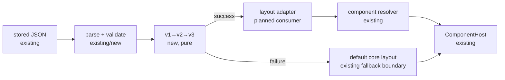

# Layout Schema migrations — A

## 📝 TLDR

Custom layouts zapisane w starszym formacie będą mogły zostać otwarte po aktualizacji Cezara.
Proponujemy jawny, deterministyczny łańcuch migracji `v1 → v2 → v3`, z walidacją po każdym
kroku i atomowym wynikiem: albo kompletny layout w bieżącej wersji, albo bezpieczny domyślny
layout bez częściowo zastosowanych zmian. Migracja nie może pozwolić, aby uszkodzony lub
niekompatybilny zapis wyłączył całą stronę.

## 📝 Problem Statement

`LayoutSchema` z projektu `2026-09-19-create-layout-schema` jest przeznaczony do zapisu jako
plain JSON i ma jawne `schemaVersion`. Gdy kolejne wersje Cezara zmienią nazwę strefy, usuną
component, rozdzielą jeden component na kilka albo zmienią wymagany component, bez migratora
stary layout będzie albo odrzucony, albo doprowadzi do próby renderowania nieistniejącej
implementacji.

To jest kontrakt kompatybilności danych użytkownika: użytkownik może aktualizować Cezara bez
ręcznego przepisywania własnego layoutu. Repozytorium traktuje pliki JSON jako dane, które można
czytać i naprawiać ręcznie; layout nie może być wyjątkiem. Jednocześnie brak komponentu rozszerzenia
nie jest sam w sobie błędem parsera — istniejący resolver ma już core fallback dla replaceable
componentów.

## 📝 Proposed Solution

Wprowadzić czysty, webowy moduł migracji przy granicy ładowania layoutu:

```ts
type LayoutMigrationResult =
  | { status: 'migrated'; schema: LayoutSchemaV3; changes: readonly LayoutChange[] }
  | { status: 'fallback'; reason: LayoutMigrationError; original: unknown }

migrateLayoutSchema(input: unknown, targetVersion?: 3): LayoutMigrationResult
```

Migrator:

1. parsuje i waliduje wersję wejściową;
2. przechodzi wyłącznie po znanych, kolejnych krawędziach `v1 → v2` i `v2 → v3`;
3. waliduje wynik po każdym kroku;
4. zwraca nowy, pełny dokument albo wynik fallbacku — nigdy częściowo zmieniony dokument;
5. zachowuje kolejność placementów i stabilne `placement.id`, chyba że jawna reguła splitu
   definiuje nowe, stabilne identyfikatory;
6. raportuje zmiany diagnostyczne bez logowania treści layoutu, propsów ani danych taska.

Migracje są kodem hosta, wersjonowanym razem z Cezarem. Rozszerzenie nie może dostarczyć
arbitralnego migratora do uruchomienia w procesie ładowania. Reguły są deklaratywne wewnątrz
modułu, aby były testowalne i audytowalne:

- `renameZone(from, to)` przenosi strefę; kolizja z istniejącą strefą kończy migrację błędem,
  chyba że konkretna reguła jawnie określi kolejność merge;
- `removePlacement` usuwa znany, niepotrzebny placement i zapisuje ostrzeżenie;
- `splitPlacement` zastępuje jeden placement listą nowych placementów o określonych referencjach,
  zachowując miejsce źródła w strefie;
- `replaceComponent` aktualizuje contract/component reference, w szczególności przejście ze
  starego wymaganego componentu do jego bieżącego core defaultu;
- nieznany component opcjonalnego placementu pozostaje referencją w danych i jest rozwiązywany
  przez istniejący resolver/fallback; nieznany component wymaganego placementu musi mieć jawny
  replacement albo powoduje bezpieczny fallback całego layoutu.

### Przykładowe reguły objęte testami

Fixture'y nie będą udawały przypadkowych produkcyjnych identyfikatorów; będą używać katalogu
testowego oraz tych samych kształtów, które stosuje produkcyjny registry.

| Przejście | Zmiana | Oczekiwany wynik |
|---|---|---|
| v1 → v2 | `header` renamed to `top` | wszystkie placementy przechodzą do `top` w tej samej kolejności |
| v1 → v2 | usunięty, opcjonalny `legacy-banner` | placement znika, a wynik zawiera ostrzeżenie; pozostały layout działa |
| v2 → v3 | `task-header` split na `task-header-summary` i `task-header-actions` | dwa deterministyczne placementy zajmują miejsce źródła, bez duplikacji przy ponownym odczycie |
| v2 → v3 | wymagany stary component zastąpiony bieżącym core componentem | placement zachowuje stabilne `id`, ale wskazuje aktualny contract/component |
| v2 → v3 | brak replacementu wymaganego componentu | `status: 'fallback'`, zachowany surowy zapis i domyślny layout; brak blank page |

Alternatywa polegająca na „zgadywaniu” mapowania po nazwie albo na pomijaniu każdego
nieznanego componentu została odrzucona. Pierwsza może zmutować layout bez intencji użytkownika,
a druga może usunąć funkcję wymaganą do działania strony.

## Resolved assumptions (autonomous defaults)

| # | Question | Applied default | Why | Confirm? |
|---|---|---|---|---|
| Q1 | Czy migracje mają obejmować tylko pure data, czy także zapis do storage i pełne przełączenie renderera? | Pure migrator plus loader boundary, bez nowej trasy HTTP, nowego storage ani edytora. | To najmniejszy odwracalny seam; loader może otworzyć starszy layout, a istniejący zapis może zostać podłączony bez duplikowania reguł. | reversible |
| Q2 | Czy v2 i v3 mają mieć całkowicie nowe wire formaty? | Zachować `page` i named `zones`; v2 może dodać opcjonalne pole `required`, a v3 może zmieniać semantykę referencji przez jawne reguły. Nie dodawać otwartego `props` ani runtime objects. | Ogranicza blast radius i pozostaje zgodne z v1 z projektu Layout Schema; przykłady zmian są semantycznymi migracjami, nie niejawnie zgadywanym formatem. | reversible |
| Q3 | Co zrobić, gdy migracja nie może zachować wymaganego componentu? | Nie częściowy layout, tylko domyślny layout core, diagnostyka i zachowanie oryginalnego zapisu do ponownej próby. | Użytkownik dostaje działającą stronę i nie traci danych; automatyczne usunięcie wymaganej funkcji byłoby nieodwracalne. | reversible |
| Q4 | Czy fallback wymaga nowego ekranu lub osobnego projektu UI? | Nie. Użyć istniejącej granicy fallbacku `ComponentHost`/shell; dodać tylko stan diagnostyczny zgodny z istniejącym wzorcem alertu, jeśli loader nie ma jeszcze miejsca na komunikat. | Migracja nie powinna tworzyć równoległego systemu błędów ani zmieniać trasy. | reversible |

## 📝 Architecture

### Granice modułów

- `packages/web/src/lib/layout-schema.ts` pozostaje właścicielem typów, walidacji i wersji
  dokumentu z poprzedniej specyfikacji.
- `packages/web/src/lib/layout-migrations.ts` będzie właścicielem typów błędów, map reguł,
  migracji `v1ToV2`/`v2ToV3` i funkcji `migrateLayoutSchema`. Moduł jest pure: bez Reacta, DOM,
  registry, storage i efektów ubocznych.
- loader layoutu (planowany konsument schema) wywołuje migrator przed adapterem strony. Nie wolno
  uruchamiać migracji w `LayoutRegistry`, który jest runtime projection drzewa DOM.
- `packages/web/src/component-registry/resolve.ts` pozostaje jedynym miejscem rozstrzygania,
  czy nieznany opcjonalny component może użyć core fallbacku. Migrator zna tylko jawne reguły
  zmian strukturalnych i required replacementów.
- istniejący `ComponentHost` oraz shell zapewniają niepustą powierzchnię po awarii. Loader ma
  przekazać domyślny layout i status diagnostyczny, zamiast rzucać wyjątek podczas renderowania.



Najważniejsza granica: migrator może zmienić plain data, ale nie może próbować renderować
componentu ani naprawiać DOM. Dzięki temu test awarii migracji jest niezależny od Reacta, a awaria
pojedynczej implementacji nadal podlega istniejącemu component hostowi.

### Wersje i kontrakty danych

Wersje są wersjami całego dokumentu, nie wersjami contractów componentów.

- **v1**: obecny model `page`, `schemaVersion: 1`, `zones: Record<string, LayoutPlacement[]>`,
  placement `{ id, contract: { id, version }, component: { id } }`.
- **v2**: ten sam model stref i referencji; opcjonalne `required: boolean` przy placement może
  zaznaczać, że brak zamiennika nie może zostać przemilczany. Brak pola oznacza `false` po
  normalizacji.
- **v3**: bieżący model dla tego etapu, z tymi samymi plain-data polami i pełnym zestawem
  jawnych reguł zmian componentów/stref. Wprowadzenie dodatkowych wymaganych pól jest możliwe
  wyłącznie razem z walidatorem v3 i regułą `v2 → v3`; nie wolno rozszerzać formatu przez
  passthrough nieznanych obiektów runtime.

Jeśli przyszły renderer potrzebuje większej zmiany kształtu niż ten etap przewiduje, powstaje
nowa specyfikacja i nowa migracja; `v3` nie powinno stać się luźnym workiem na przyszłe pola.

### Wynik migracji i zachowanie atomowe

`LayoutChange` zawiera tylko bezpieczne metadane: kod (`renamed-zone`, `removed-placement`,
`split-placement`, `replaced-component`), stabilny identyfikator placementu/strefy oraz ścieżkę
w dokumencie. Nie zawiera propsów, promptów, treści taska ani całego raw JSON.

`LayoutMigrationError` rozróżnia co najmniej: `invalid-json`, `invalid-schema`,
`unsupported-version`, `zone-collision`, `missing-required-replacement` i `invalid-migration-output`.
Każdy błąd ma ścieżkę oraz krótką przyczynę. Wynik po nieudanym kroku jest odrzucany w całości.

Loader powinien zachować raw input poza wynikiem migratora, aby mógł oznaczyć zapis jako
niezmigrowany i podjąć późniejszą próbę po aktualizacji reguł. Zapis wersji v3 może nastąpić
tylko po udanej migracji i po przejęciu wyniku przez loader; migrator sam niczego nie zapisuje.

## 📝 Data Model

```ts
type LayoutPlacementV2 = LayoutPlacementV1 & { required?: boolean }

type LayoutSchemaV2 = {
  page: string
  schemaVersion: 2
  zones: Record<string, LayoutPlacementV2[]>
}

type LayoutSchemaV3 = {
  page: string
  schemaVersion: 3
  zones: Record<string, LayoutPlacementV2[]>
}
```

W implementacji typy powinny być wyprowadzone z istniejącej walidacji modelu, a nie powielone jako
niezależne interfejsy w loaderze. Każda migracja klonuje wszystkie tablice i rekordy; wejście nie
może zostać zmutowane. Wynik jest JSON-safe, deterministyczny i przechodzi walidację docelowej
wersji.

### Reguły szczegółowe

1. **Rename zone** — zwykłe przeniesienie nie zmienia `placement.id`, order ani referencji.
   Jeśli źródło nie istnieje, reguła kończy się no-opem tylko wtedy, gdy fixture/version policy
   oznacza ją jako opcjonalną; brak obowiązkowej strefy jest błędem. Jeśli cel już istnieje,
   migrator odrzuca wynik, chyba że reguła ma jawny merge order.
2. **Remove component** — optional placement może zostać usunięty z ostrzeżeniem. Required
   placement musi wskazać replacement przez mapę reguły; samo usunięcie jest błędem.
3. **Split component** — source może zostać zastąpiony wyłącznie przez listę kompletnych,
   poprawnych placementów. Nowe ids są częścią reguły, nie są generowane losowo ani z indeksu
   tablicy. Replacementy są wstawiane w miejscu source, a source nie może pozostać drugi raz.
4. **Changed required component** — zachować id placementu, zmienić contract/component na
   wskazany bieżący default i ponownie zwalidować required contract. Brak zgodnego replacementu
   kończy migrację fallbackiem, nawet gdy reszta layoutu jest poprawna.
5. **Idempotencja** — dokument v3 nie przechodzi ponownie przez v1/v2 rules. Ponowne otwarcie
   zmigrowanego dokumentu zwraca v3 bez zdublowanych splitów, przeniesień i ostrzeżeń.

## 📝 API Contracts

Nie powstaje nowa trasa HTTP ani publiczny export `extension-api`. Lokalny moduł udostępnia:

```ts
parseLayoutForLoad(input: unknown):
  | { status: 'current' | 'migrated'; schema: LayoutSchemaV3; changes: readonly LayoutChange[] }
  | { status: 'fallback'; fallback: LayoutSchemaV3; error: LayoutMigrationError }
```

Preferowana nazwa może zostać rozdzielona na `parseLayoutSchema` i `migrateLayoutSchema`, jeśli
istniejący parser z projektu v1 ma już stabilnych konsumentów. Ważny jest kontrakt zachowania,
nie jedna publiczna nazwa: parser waliduje, migrator transformuje, loader wybiera fallback.

Nieznana przyszła wersja (`schemaVersion > 3`) nie jest downgradowana ani ignorowana. Stary Cezar
nie powinien nadpisywać takiego zapisu; bieżący Cezar pokazuje domyślny layout i zachowuje raw
input. `schemaVersion < 1` oraz brak wersji są błędem schema, nie próbą migracji heurystycznej.

## 📝 UI/UX

Ta specyfikacja nie dodaje trasy, edytora ani picker UI. Po udanej migracji layout otwiera się
tak jak layout bieżący. Po nieudanej migracji użytkownik nadal widzi core/default layout z
istniejącym mechanizmem hosta; nie pojawia się pusty ekran ani błąd Reacta na poziomie całej
strony.

Loader powinien pokazać krótką, nieblokującą informację w istniejącym wzorcu alertu/statusu:
„Nie udało się zaktualizować własnego układu. Użyto bezpiecznego układu domyślnego.” Komunikat
nie ujawnia raw JSON ani szczegółów implementacji rozszerzenia. Szczegóły diagnostyczne trafiają
do kontrolowanego logu/telemetrii istniejącej dla hosta, z kodem błędu i ścieżką.

Nie powstaje nowy ekran do zaprojektowania; zachowanie jest stanem istniejącej strony. Z tego
powodu mockupy nie są częścią tej specyfikacji.

## 📝 Edge Cases & Failure Scenarios

- **Uszkodzony JSON lub zła v1/v2 shape.** Parser zwraca błąd, loader używa defaultu, raw input
  pozostaje nienaruszony, a użytkownik dostaje komunikat zamiast blank page.
- **Nieznana wersja.** Loader nie próbuje „najbliższej” migracji. Default jest bezpieczniejszy niż
  cicha utrata danych.
- **Kolizja renamed zone.** Migracja kończy się atomowym fallbackiem; nie łączy tablic bez jawnej
  reguły, aby nie zmienić kolejności użytkownika po cichu.
- **Usunięty optional component.** Placement jest pomijany z ostrzeżeniem, a pozostałe strefy
  otwierają się.
- **Usunięty required component.** Bez mapowania do bieżącego core/default migracja kończy się
  fallbackiem całego layoutu. Nie renderujemy połowy wymaganej strony.
- **Split powtórzony po zapisaniu v3.** Wersja docelowa zatrzymuje łańcuch; nie ma drugiego
  splitu ani duplikatów.
- **Nieznany optional extension component po udanej migracji.** Migrator zachowuje referencję,
  a resolver wybiera core fallback zgodnie z istniejącym kontraktem. To nie jest migration failure.
- **Awaria renderowania fallbacku.** Odpowiada za nią istniejący `ComponentHost`/boundary; plan
  implementacji musi zachować jego niepusty `HostBox` i akcję retry.
- **Równoległy zapis.** Migrator nie wykonuje zapisów. Jeśli loader później zapisuje v3, musi użyć
  istniejącego atomowego mechanizmu storage i nie nadpisywać raw inputu przed sukcesem migracji.

## 📝 Risks & Impact Review

- **Wysokie ryzyko utraty layoutu przy niepełnym split.** Mitigacja: immutable result,
  walidacja po każdym kroku, required replacement jako hard failure i fixture z częściowym
  outputem.
- **Średnie ryzyko rozjazdu z Component Registry.** Migrator nie kopiuje resolvera; production
  rules odwołują się do katalogu contractów/defaultów przez wąski kontekst, a testy pinują
  `coreDefaultComponentId`.
- **Średnie ryzyko nieskończonego łańcucha.** Migracje są indeksowane pojedynczymi parami wersji,
  mają jeden cel `3` i nie uruchamiają się dla dokumentu v3.
- **Średnie ryzyko blank page w loaderze.** Acceptance test musi obejmować błąd migracji oraz
  sprawdzać, że loader zwraca default; test komponentowy potwierdza widoczny host/alert.
- **Koszt odwrócenia.** Po zapisaniu v3 nie ma automatycznego downgrade'u. Raw input trzeba
  zachować do czasu udanego przejęcia v3, a zmiany reguł w kolejnych wydaniach muszą dodawać
  nową krawędź migracji, nie zmieniać historycznej `v1 → v2` w sposób niedeterministyczny.

### Prior art

- Grafana jawnie wersjonuje dashboard JSON i utrzymuje więcej niż jeden model schematu; pokazuje
  to, że wersja dokumentu musi być rozróżniona od innych wersji elementów
  ([Grafana JSON model](https://grafana.com/docs/grafana-cloud/learn-and-build/visualizations/dashboards/build-dashboards/view-dashboard-json-model/)).
- WordPress przechowuje osobne, testowalne deprecations dla starszych wersji i ostrzega, że
  migracje nie powinny być przypadkowym łańcuchem zależnym od aktualnej implementacji
  ([Block deprecation](https://developer.wordpress.org/block-editor/reference-guides/block-api/block-deprecation/)).
- Backstage publikuje migracje jako osobne, wersjonowane przewodniki dla zmian API systemu
  frontendowego, zamiast ukrywać kompatybilność w heurystyce
  ([Frontend System migrations](https://backstage.io/docs/frontend-system/architecture/migrations/)).

## 📋 Phasing

### Phase 1 — Pure migration engine

Wspólny model wyników, walidacja wersji v1/v2/v3, migratory `v1 → v2` i `v2 → v3`, deklaratywne
reguły oraz fixture'y. Po tej fazie dowolny loader może uzyskać atomowy wynik bez Reacta i storage.

### Phase 2 — Load boundary and safe fallback

Podłączyć migrator w jednym miejscu ładowania LayoutSchema, zwrócić default core layout przy
failure, zachować raw input i przekazać diagnostykę do istniejącego mechanizmu hosta. Po tej fazie
starszy layout otwiera się po aktualizacji, a niekompatybilny layout nie daje blank page.

### Phase 3 — Persistence handoff (follow-up boundary)

Opcjonalny zapis udanej v3 oraz narzędzie/akcja naprawcza dla użytkownika pozostają osobnym
krokiem. Ta specyfikacja definiuje wymagania dla tego handoffu, ale nie dodaje trasy ani edytora.

## 📋 Implementation Plan

### Phase 1: Migration engine

1. Dodać wersjonowane typy v2/v3 i wspólne błędy/zmiany migracji w `packages/web/src/lib`.
   *Test:* typecheck nie dopuszcza React/DOM/runtime props w modelu.
2. Zaimplementować atomowe `v1 → v2` i `v2 → v3` z walidacją wejścia i outputu po każdej
   krawędzi. *Test:* poprawny v1 dociera do v3; nieudany krok nie zwraca częściowego modelu.
3. Dodać fixture'y: renamed zone, optional removed component, split component, required
   replacement, missing required replacement, duplicate ids, zone collision i unknown version.
   *Test:* wynik/diagnostyka pinują kolejność, stabilne ids i brak cichej utraty.
4. Dodać testy idempotencji oraz niemutowania wejścia. *Test:* v3 nie przechodzi przez stare
   reguły, a `structuredClone(input)` pozostaje równy po migracji.

### Phase 2: Loader and fallback

5. Podłączyć migrator do jednego loadera LayoutSchema i rozdzielić `migrated`, `current` oraz
   `fallback`. *Test:* v1 otwiera defaultowy adapter jako v3, a unsupported/failed returns
   default plus diagnostic.
6. Zachować raw input do czasu sukcesu i użyć core/default layoutu przy `missing-required-
   replacement` oraz błędzie walidacji. *Test:* failure nie wywołuje zapisu, nie rzuca do root
   Reacta i nie zostawia pustej strony.
7. Przekazać bezpieczny komunikat do istniejącego host/boundary statusu. *Test:* component-level
   render sprawdza alert/host, działający core layout i retry zgodnie z istniejącym wzorcem.
8. Dodać regression test na nieznany optional component, który nadal przechodzi przez resolver
   fallback, oraz test na required component bez replacementu, który wybiera cały default.
   *Test:* oba przypadki są rozróżnione, bez heurystycznego „best effort”.

### Phase 3: Persistence handoff (planned follow-up)

9. Zdefiniować wywołanie atomowego zapisu v3 po sukcesie loadera oraz zachowanie raw backupu.
   *Test:* zapis następuje tylko po sukcesie, a awaria storage nie wpływa na render fallbacku.
10. Dodać ręczną akcję „reset layoutu” lub odpowiednik dopiero po decyzji o UI storage.
   *Test:* reset tworzy valid v3 i nie usuwa danych taska ani konfiguracji rozszerzeń.

## 📝 Acceptance Criteria

- [ ] Poprawny zapis v1 można otworzyć po aktualizacji jako valid v3 przez jawny łańcuch `v1 → v2 → v3`.
- [ ] Migracja renamed zone zachowuje kolejność i stabilne placement ids.
- [ ] Usunięty optional component nie blokuje pozostałego layoutu i zostawia diagnostykę.
- [ ] Split component tworzy dokładnie zdefiniowane placementy w miejscu źródła i jest idempotentny.
- [ ] Zmieniony required component ma jawny replacement; brak replacementu wybiera cały default.
- [ ] Błąd migracji nie mutuje wejścia, nie zapisuje częściowego wyniku i nie rzuca do root Reacta.
- [ ] Użytkownik widzi działający core/default layout oraz komunikat diagnostyczny, nigdy blank page.
- [ ] Nieznany optional component korzysta z istniejącego resolver fallbacku, a nie z migracyjnego
  usuwania danych.
- [ ] Moduł migracji nie dodaje trasy HTTP, publicznego exportu extension-api ani nowego formatu
  runtime props.
