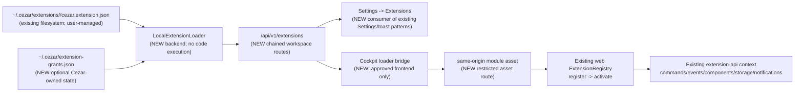

# Local Extension Loader

## 📝 TLDR
Local extension authors need to add a packaged extension without editing or rebuilding Cezar. **Observed current behavior:** the cockpit starts only the empty, compiled-in `BUILTIN_EXTENSIONS` list, and there is no backend package scanner or extension diagnostics screen. **Proposed future behavior:** the local backend discovers packages under `~/.cezar/extensions/`, validates each package before serving its code, applies explicit permission grants, and lets the existing browser-side extension registry register approved frontend modules. Broken or incompatible packages are skipped, logged, and listed in Settings.

## 📝 Problem Statement

The extension platform has the contracts needed for a loader, but no path from an on-disk package to the runtime:

- `packages/extension-api/src/package-manifest.ts` already validates `cezar.extension.json` and checks API generation, `engines.cezar`, and supported entrypoint kinds without executing package code.
- `packages/web/src/extensions/registry.ts` already owns lifecycle, isolation, registration, and explicit requested/granted permission checks, but accepts only `Extension` objects supplied by code.
- `packages/web/src/extensions/host.ts` and `main.tsx` start `BUILTIN_EXTENSIONS`; the current list is empty and static.
- `packages/cezar/src/paths.ts` centralizes `~/.cezar` through `cezarHomeDir()`, but has no extension directory or grant-store path.
- The current UI has no extension list. It does have durable error presentation patterns: `[cezar:extensions]` console diagnostics, the global toaster, and Settings cards that preserve verification failures and expose retry actions.

This blocks the stated outcome: a user cannot add an extension by placing a package on the machine. It also creates a security risk if a future loader imports a package before validating its manifest, compatibility, trust boundary, or permission grant.

The feature is one cohesive capability: discover local packages, make a fail-closed admission decision, expose that decision, and hand only admitted frontend packages to the existing extension host. Marketplace installation, remote downloads, signatures, backend extension execution, and a sandbox remain separate capabilities.

## 📝 Proposed Solution

Add a local-package loader owned by the Node service and a browser bridge owned by the cockpit.

1. The backend scans only direct child directories of `cezarHomeDir()/extensions` (normally `~/.cezar/extensions`). A missing directory is an empty result and never a boot error.
2. For each candidate it reads only `cezar.extension.json`, applies `validatePackageManifest`, then applies `checkPackageCompatibility` with the running Cezar version, API generation `1`, and frontend-only host capability. No package module is imported during this phase.
3. It reads a Cezar-owned grant store, not a manifest-owned approval field. A package requesting no permissions receives the empty grant automatically. A package requesting permissions remains inactive until the user approves the requested permission set in the UI. The grant is Cezar-owned user policy keyed by extension id; it is not invalidated by a version change or arbitrary manifest-byte change. A newly requested permission still requires approval.
4. The backend exposes validated inventory, scan diagnostics, endpoint discovery, and approved frontend assets through versioned, same-origin routes. In hosted mode it exposes no local package metadata or code and returns a non-error unavailable result for discovery and diagnostics.
5. The browser fetches the inventory before loading external modules. For an admitted and approved package it dynamically imports the frontend entrypoint, verifies that the module's `Extension` manifest id and version match the backend descriptor, then calls the existing `registry.register(extension, { grantedPermissions })` and lifecycle activation path.
6. A bad package, failed dynamic import, manifest mismatch, or activation failure affects only that package. The backend log, runtime `[cezar:extensions]` log, and Settings diagnostics retain the failure without taking down the cockpit.

### Alternatives considered

- **Execute packages in the backend.** Rejected. The current `ExtensionContext` includes React component implementations and browser event/component services; executing those modules in Node would cross the extension boundary and require a second host contract.
- **Let the browser scan arbitrary local paths.** Rejected. Browsers cannot safely enumerate the filesystem, and a project-relative or user-selected path would create a new trust and disclosure surface. The backend owns the local filesystem read.
- **Treat declared permissions as granted.** Rejected by the existing permission model. Requested and granted permissions are separate facts; a manifest cannot approve itself.
- **Load every package with zero permissions and deny calls at runtime.** Rejected. It still executes unapproved third-party code and makes a permission request decorative. Requested-permission packages stay unloaded until approval.
- **Hot-reload package updates into the current registry.** Deferred. The registry has no unregister/update transaction, and replacing an active extension safely requires lifecycle, component preference, and event cleanup semantics. A deliberate page reload is the reversible first version.
- **Marketplace or downloaded artifacts.** Deferred. Local discovery does not prove publisher identity, integrity, or safety; those belong to an installer/registry trust model.

## 📝 Resolved assumptions (autonomous defaults)

| # | Question | Applied default | Rationale |
|---|---|---|---|
| Q1 | Should the backend execute discovered extension code, or should it only discover and validate while the browser host performs runtime registration? | **Owner-confirmed: backend discovery/validation; browser runtime registration.** The backend never imports or executes package code. The browser imports only an admitted, explicitly approved frontend entrypoint and registers it through `packages/web/src/extensions/registry.ts`. | This obeys the existing `ExtensionContext` boundary and avoids inventing a Node host. Approved frontend code still runs in the cockpit origin, so this remains a local-code trust boundary rather than a sandbox. |
| Q2 | Which directories and deployment modes are eligible? | **Owner-confirmed: only `~/.cezar/extensions/<extension-id>/` (derived through `cezarHomeDir()`), and only local-handoff mode.** No project-local directories, task worktrees, remote URLs, archives, or hosted-mode loading. | This keeps discovery deterministic and prevents a remote cockpit from executing the server operator's local extensions in every browser. |
| Q3 | How are requested permissions granted and persisted? | **Owner-confirmed: empty requests activate with an empty grant; non-empty requests require explicit Settings approval.** Persist a Cezar-owned grant policy keyed by extension id and containing the approved permission set, without version or manifest-byte staleness keys. A current package is admitted only when its requested permissions are covered by that policy. | Grants represent user-approved permissions, not approval of a particular package byte sequence. Version/manifest changes must not silently revoke that policy. Concrete artifact integrity is a separate validation layer and is not encoded as a grant. |
| Q4 | Should `entrypoints.backend` execute? | **Owner-confirmed: no.** The frontend-only phase may detect, validate, and expose the declared backend entrypoint as metadata/diagnostics, but never executes or serves it. A package with an unsupported backend entrypoint fails the existing frontend-only `checkPackageCompatibility` host gate. | The repository has no backend extension host, route ownership model, or sandbox. Refusal is safer and is represented by `unsupported-entrypoint`. |
| Q5 | Should package changes hot-reload? | **Owner-confirmed: no production hot reload.** Inventory refresh rescans; approval changes take effect after an explicit cockpit reload. The initial implementation loads packages once per page boot and never replaces an active id. | The current registry has lifecycle operations but no unregister/update transaction. Reload gives every extension a fresh context and makes rollback a directory removal plus reload. |
| Q6 | What diagnostics and HTTP surface are required? | **Owner-confirmed: retain the inventory/discovery surface and add a minimal versioned diagnostics endpoint plus a dedicated endpoint-discovery endpoint.** The diagnostics API reports bounded backend scan/admission diagnostics; browser runtime failures remain page-local and are merged by Settings. No SSE/WebSocket topic or persisted diagnostic history in v1. | A query plus explicit refresh is enough for filesystem changes. Contract schemas, chained workspace routes, and the existing Settings/toast/logger patterns provide diagnostics without a new real-time channel or database. |

## 📝 Architecture



**Takeaway:** the backend decides whether a package may be offered; the browser remains the only runtime that can construct `ExtensionContext` and call the existing registry. The word “register” has two deliberately distinct meanings: the backend registers a validated package descriptor in its inventory, while the browser registers the imported `Extension` object with the runtime registry.

### Backend modules and responsibilities

- `packages/cezar/src/extensions/local-loader.ts` owns directory scanning, manifest byte limits, candidate classification, duplicate-id handling, compatibility checks, grant lookup, and safe asset resolution. It imports the extension API package for the package-manifest decision functions, never the web package.
- `packages/cezar/src/extensions/grants.ts` owns the optional Cezar-managed grant file, atomic read/modify/write, `0600` writes, permission-set coverage, and read-only degradation. A corrupt grant file is ignored with one warning and never blocks boot. It does not compare package versions or manifest bytes.
- `packages/cezar/src/paths.ts` adds `extensionsDir()` and `extensionGrantsPath()`, both derived from `cezarHomeDir()`. No second `homedir()` implementation is permitted.
- `packages/cezar/src/server/server.ts` adds a workspace-level chained `extensions` route family. It uses the existing origin guard, `localHandoff` gate, middleware validators, contract schemas, and route manifest/backward-compatibility inventory.
- `packages/cezar/src/index.ts` or the server listening path may prewarm one scan after the server is listening, but it must not await scanning before boot. Route reads may rescan so a newly added package becomes visible without restarting the service.

### Browser modules and responsibilities

- `packages/web/src/extensions/loader.ts` fetches the inventory, skips anything not marked admitted, imports the restricted asset URL, checks the module's default export and manifest identity, and passes the approved permissions to the existing host/registry.
- The browser loader keeps a small page-local immutable runtime-diagnostics snapshot with `subscribe()`/`revision()` semantics. It records import, identity, registration, and activation failures for the Settings section without persisting stack traces or package payloads.
- `startExtensionHost` remains the lifecycle owner. The loader supplies a validated list of runtime `Extension` objects; it does not duplicate timeout, scope, disposal, or permission guarding.
- `packages/web/src/main.tsx` starts built-ins as today, then starts the external load asynchronously without making the first paint wait. A loader failure cannot reject boot.
- `packages/web/src/routes/settings/extensions-section.tsx` reads the inventory query, shows scan and runtime errors, and performs approval writes. It does not import extension modules or call the registry directly.

### Trust boundary

The local directory is an explicit local-code trust boundary, not a sandbox. An approved extension runs in the cockpit origin and can use browser APIs or call local HTTP routes directly; extension permissions are an API admission/guard contract, not a security perimeter. Therefore:

- hosted mode never scans, serves, or activates local extensions;
- manifest validation and compatibility checks happen before dynamic import;
- only package-relative JavaScript entrypoint/assets are served;
- symlinked package roots and assets resolving outside the package root are refused;
- current artifact validation is structural containment, allowed module types, bounded files, and browser module identity; cryptographic artifact integrity, if added, is a separate admission result and never a grant-staleness rule;
- no network download, package install, backend process, shell, or project-root discovery occurs;
- a future sandbox or marketplace signature must be a separate design, not implied by this loader.

## 📝 Data Model

### In-memory inventory

The loader creates a fresh immutable inventory per scan. It is not a database and is not persisted.

| Field | Meaning |
|---|---|
| `candidate` | Direct-child directory name, bounded and safe for display; never an absolute path in the API. |
| `id` | Manifest id when readable and valid; `null` for a package that has no usable id. |
| `manifest` | The validated package metadata needed by the UI and browser bridge; `null` for malformed candidates. |
| `status` | `ready`, `permission-required`, `rejected`, or `duplicate`. `ready` means compatible, approved, and with a readable frontend entrypoint; it does not mean activation succeeded. |
| `requestedPermissions` | Manifest request copied into the descriptor. Empty when no valid manifest exists. |
| `grantedPermissions` | Effective current grant, limited to permissions requested by the valid package and passed to the runtime; never inferred from a malformed package. |
| `entrypoints` | Validated manifest-relative declarations for `frontend` and `backend`; `null` values mean that declaration is absent. These are metadata only and never authorize backend execution. |
| `diagnostic` | One bounded human-readable code/message/path classification, without stack traces, raw JSON, or secrets. |
| `frontendUrl` | Present only for a `ready` descriptor; an opaque same-origin asset URL, not a filesystem path. |

Runtime activation failures stay in the existing in-memory `ExtensionRecord` and `onError` path. They are not written into inventory state or silently converted into a successful package status.

The browser loader's runtime-diagnostics snapshot is separate from backend inventory and is cleared on a full page reload. It contains only `{ candidate, id, phase, code, message }`, so a later Settings visit in the same page can show a failure that already produced a toast while avoiding a new persisted error database.

### Grant file

Path: `extensionGrantsPath()` -> `~/.cezar/extension-grants.json` by default. The file is optional and may be deleted safely.

Each entry is keyed by extension id and contains the user-approved permission set:

```json
{
  "acme.jira": {
    "grantedPermissions": ["commands.execute", "events"]
  }
}
```

The grant is independent of package version and manifest bytes. Admission compares the current requested set with the stored set: all requested permissions must be granted, extra stored permissions are not effective and are not passed to the browser. Approving writes exactly the current requested set; revoking removes the entry. Artifact integrity is not represented here: structural artifact validation is performed by the loader, while any future cryptographic identity/signature mechanism has its own field, diagnostic, and invalidation rules. The store is read-modify-written atomically and with mode `0600`; unknown entries are preserved where the store schema permits. A missing, malformed, or read-only store degrades to no grants, so zero-permission packages can still load and permissioned packages remain pending.

### State transitions

| State | Exit | Rule |
|---|---|---|
| `not discovered` | scan | Missing directory is empty; a readable candidate becomes a classified record. |
| `permission-required` | approve or package refresh | Approval writes the exact current requested set. A version or unrelated manifest-byte change does not change this state; an expanded requested set remains pending until approved, while a reduced set can become ready when already covered. |
| `ready` | page boot, revoke, or package refresh | Browser imports, verifies module identity, registers, and activates through the existing host. Revocation or an expanded request returns to `permission-required`; unrelated version/manifest-byte changes do not. |
| `rejected` | package fix and refresh | Malformed, incompatible, unreadable, unsafe, or unsupported packages are never imported. |
| `duplicate` | remove/rename one package and refresh | All candidates sharing an id are refused; no nondeterministic winner. |
| active runtime | page reload | No hot replacement in v1; existing registry deactivation remains available for host-owned lifecycle tests and future management work. |

## 📝 API Contracts

All JSON request/response shapes belong in `packages/contract/src/extensions.ts`, are inferred from Zod, re-exported by `packages/contract/src/index.ts` and the api-client, and are consumed by the server and cockpit. The server registers the route family through the existing `workspaceV1` chain and validates params/body through `paramZodValidator`/`jsonZodValidator`; no handler-side-only parsing.

### `GET /api/v1/extensions`

Workspace-level, never project-scoped. It rescans the local directory and returns:

```ts
type ExtensionInventoryResponse =
  | {
      available: true
      directory: '~/.cezar/extensions'
      scannedAt: string // ISO timestamp
      extensions: readonly ExtensionInventoryEntry[]
      diagnostics: readonly ExtensionDiagnostic[]
      canApprove: boolean
    }
  | {
      available: false
      reason: 'hosted-mode' | 'local-handoff-unavailable'
      extensions: readonly []
      diagnostics: readonly []
      canApprove: false
    }
```

The response schema must represent optional wire keys conditionally rather than emitting keys whose value is `undefined`. `directory` is a display label, never an absolute home path.

The inventory response is the package discovery surface. It must not be treated as endpoint discovery: clients discover the supported extension routes through the dedicated endpoint-discovery response below. The inventory may be rescanned on every request, but the endpoint list is static for API version `1`.

### `GET /api/v1/extensions/endpoints`

Workspace-level, read-only endpoint discovery. It returns stable relative paths for the extension API and does not scan packages or reveal local paths, package metadata, or code:

```ts
type ExtensionEndpointDiscoveryResponse =
  | {
      available: true
      apiVersion: '1'
      endpoints: {
        inventory: '/api/v1/extensions'
        diagnostics: '/api/v1/extensions/diagnostics'
        approval: '/api/v1/extensions/:id/approval'
        assets: '/api/v1/extensions/:id/assets/*path'
      }
    }
  | {
      available: false
      apiVersion: '1'
      reason: 'hosted-mode' | 'local-handoff-unavailable'
      endpoints: readonly []
    }
```

Hosted mode still answers successfully with `available: false`; it does not expose a local inventory or an asset URL.

```ts
type ExtensionInventoryEntry = {
  candidate: string
  id: string | null
  name: string | null
  version: string | null
  description: string | null
  entrypoints: {
    frontend: string | null
    backend: string | null
  }
  status: 'ready' | 'permission-required' | 'rejected' | 'duplicate'
  requestedPermissions: readonly string[]
  grantedPermissions: readonly string[]
  frontendUrl: string | null
  diagnostic: ExtensionDiagnostic | null
}

type ExtensionDiagnostic = {
  candidate: string
  id: string | null
  code:
    | 'directory-unreadable'
    | 'manifest-missing'
    | 'manifest-too-large'
    | 'manifest-invalid-json'
    | 'manifest-invalid'
    | 'unsupported-api-version'
    | 'unsupported-range'
    | 'release-out-of-range'
    | 'unsupported-entrypoint'
    | 'entrypoint-missing'
    | 'unsafe-path'
    | 'duplicate-id'
    | 'permission-required'
    | 'grant-store-unavailable'
  message: string
  path: string | null
}
```

The exact Zod schema may use a closed union for `code`; it must not expose raw filesystem errors, stack traces, manifest contents, or arbitrary thrown values. The loader maps `validatePackageManifest` and `checkPackageCompatibility` issues to these stable diagnostic codes while retaining the original human-readable reason in `message`.

### `GET /api/v1/extensions/diagnostics`

Workspace-level, read-only diagnostics for the current backend scan and admission decision. It rescans using the same loader as inventory and returns:

```ts
type ExtensionDiagnosticsResponse =
  | {
      available: true
      scannedAt: string
      diagnostics: readonly ExtensionDiagnostic[]
    }
  | {
      available: false
      reason: 'hosted-mode' | 'local-handoff-unavailable'
      diagnostics: readonly []
    }
```

This is deliberately not a runtime event stream and does not persist history. Browser import, identity, registration, and activation failures remain in the page-local runtime-diagnostics snapshot and are joined with this response by Settings. The endpoint is same-origin, workspace-level, versioned, chained, and represented in the endpoint-discovery response.

### `PUT /api/v1/extensions/:id/approval`

Workspace-level and local-machine-only. It is guarded by the existing same-origin and loopback/hosted checks.

Request body:

```ts
type SetExtensionApprovalInput = {
  approved: boolean
}
```

`approved: true` grants exactly the package's current requested permission list; it never accepts an arbitrary grant list and does not record version or manifest bytes. `approved: false` removes the grant and returns the package to `permission-required` when it requests permissions. A later version or unrelated manifest-byte change retains the grant policy; a newly requested permission is not covered and therefore remains pending until the user approves the new set. The server rejects unknown ids with `404`, malformed bodies with `400`, and hosted-mode writes with `409` using the repository's existing `{ error }` shape. A package that is malformed, incompatible, duplicated, or has an unsupported entrypoint cannot be approved.

The response is the same `ExtensionInventoryResponse` as the GET so the cockpit can replace its cache from authoritative state. A failed write changes no grant file and returns a one-line human-readable error.

### Frontend module assets

The browser bridge receives `frontendUrl` only for `ready` entries. The server serves the manifest-declared frontend entrypoint and its relative `.js`/`.mjs` module chunks below a versioned route such as:

```text
GET /api/v1/extensions/:id/assets/*path
```

This is a same-origin executable asset route, not a JSON API response. It is still mounted in the versioned route table and inventoried in `BACKWARD_COMPATIBILITY.md` section 2. The handler must:

- validate the extension id and path before filesystem access;
- resolve the id through the current inventory, never by joining a user-supplied id to `extensionsDir()`;
- allow only `.js` and `.mjs` files inside the candidate's real package root;
- reject dot segments, backslashes, NULs, symlink escapes, missing files, directories, and files over the implementation cap;
- return `application/javascript; charset=utf-8`, `x-content-type-options: nosniff`, no CORS headers, and non-immutable/no-cache semantics because local package bytes may change;
- return `404` for an unavailable, unapproved, incompatible, or unknown package without revealing whether another candidate exists.

The manifest's `entrypoints.backend` is never served. The route must not become a generic file browser.

### Browser bridge contract

`packages/web/src/extensions/loader.ts` is cockpit-internal, not an extension-api export. It accepts the validated inventory response and an injected `importModule(url)` test seam. For each `ready` record it:

1. dynamically imports `frontendUrl`;
2. reads the module's default export without invoking it;
3. verifies it is an `Extension` whose manifest id/version exactly match the descriptor;
4. calls `startExtensionHost`/the existing registry registration path with the descriptor's immutable `grantedPermissions`;
5. lets the existing registry perform `defineExtension`, permission compatibility, activation timeout, scope tracking, and isolated failure reporting.

The bridge loads sequentially in inventory order for deterministic duplicate/contribution behavior. One import or activation failure does not stop later packages. It never retries a failed package in the same page, and it never imports a non-`ready` record.

## 📝 UI/UX

### Existing behavior

There is no Extensions settings section or extension inventory query. Runtime extension errors use `logExtensionError` and the `[cezar:extensions]` prefix; the toaster is already mounted once at the app root. Settings sections are registry-driven and global machine/user settings live under `/settings/global`.

### Proposed future behavior

Add an `extensions` entry to `packages/web/src/routes/settings/registry.tsx` with global scope, using the existing Settings index/route shell. No new visual language or asset is required.

- The section title is **Extensions** and explains: “Local extensions are loaded from `~/.cezar/extensions`. Cezar checks them before loading code.”
- Each candidate is a card showing name, id, version, requested permissions, and a status dot/badge.
- `ready` shows “Available” and whether the page must reload to activate a newly approved package.
- `permission-required` shows every requested permission in plain language and an explicit **Approve permissions** action. Approval never silently grants an extension permission merely because it is present on disk.
- `rejected` and `duplicate` show the stable human message and a **Check again** action. The card remains visible; a broken package is not hidden as if it was never installed.
- The section has an aggregate `role="alert"` when scanning fails, approval cannot be written, or runtime loading reports an error. Details stay on the relevant card; a toast is a summary/action hint, not the only record.
- The **Check again** action refetches the inventory. Approval updates the authoritative query and offers **Reload cockpit**; it does not attempt to replace an active extension in place.
- Hosted mode renders a neutral “Local extensions are unavailable in hosted mode” state and no approval controls.
- A missing directory renders an empty state with the directory label and a concise instruction to place an unpacked package there. It is not an error.
- Keyboard focus, button names, `role="status"` status text, and `role="alert"` failure text follow existing Settings/Provider patterns. Long diagnostics wrap and never require horizontal scrolling.

Backend scan failures are logged once per candidate/reason as `[cez:extensions] ...`; browser registration/import failures use the existing `[cezar:extensions]` logger and one danger toast per failed package during a page load. Neither surface includes raw stack traces or absolute home paths.

The UI uses the existing global Settings route, cards, status dots, buttons, toaster, and error presentation patterns. Current-state evidence is captured in [current-01-global-settings.png](assets/local-extension-loader/current-01-global-settings.png); the illustrative proposal is [mockup-01-extensions-settings.png](assets/local-extension-loader/mockup-01-extensions-settings.png), with its source at [mockup-01-extensions-settings.html](assets/local-extension-loader/mockup-01-extensions-settings.html). These visuals communicate layout only; implementation QA must verify the live states and accessibility behavior.

## 📝 Edge Cases & Failure Scenarios

| Scenario | Backend behavior | User-visible result |
|---|---|---|
| `~/.cezar/extensions` is absent | Return an available empty inventory; do not create the directory during a read. | Empty state, no warning. |
| Extensions directory cannot be read | Return an available inventory with a bounded diagnostic; boot continues. | Settings alert with Check again; one `[cez:extensions]` log line. |
| Candidate is a file, symlink, or nested directory | Ignore it as a package candidate; do not follow the root symlink. | It is listed as rejected only if the scanner can name it safely; otherwise it stays out of inventory and is logged. |
| Manifest is missing, too large, invalid UTF-8/JSON, or invalid by `validatePackageManifest` | Never import; map to `manifest-*` diagnostic. | Candidate card remains rejected with the manifest issue. |
| API generation or Cezar range is unsupported | Use `checkPackageCompatibility`; do not read the entrypoint. | Rejected card names the supported generation/release requirement. |
| Package declares `entrypoints.backend` | Refuse the whole package because the host supports `frontend` only. | Rejected card says backend extensions are not supported by this Cezar. |
| Frontend entrypoint is absent or resolves outside the package root | Refuse the package and never serve the path. | Rejected card and a safe-path diagnostic; no file path disclosure beyond the manifest-relative field. |
| Two candidates declare one id | Mark every candidate for that id duplicate; do not choose by filesystem order. | Each card explains that one id is provided more than once. |
| Package requests unknown permission | Package manifest validation/host permission checks fail closed before import. | Rejected diagnostic names the unsupported permission, never activates. |
| No requested permissions | Use an empty grant and allow the normal browser load path. | Package can become Available without an approval click. |
| Requested permission lacks a current approval | Do not serve its frontend asset as loadable; report `permission-required`. | Permission list and Approve permissions action. |
| Grant file is missing, corrupt, or unreadable | Treat all grants as empty; preserve no partially parsed approval. | Permissioned packages return to approval; one warning/log line. |
| Grant write fails because the home is read-only | Do not mutate state; return a human error. | Approval remains pending and the Settings card explains that the local grant could not be saved. |
| Package version or unrelated manifest bytes change after approval | Retain the Cezar-owned permission policy. Re-run manifest, compatibility, and structural artifact validation independently. | The package stays available when its requested permissions remain covered; it is not forced through approval again. |
| Package requests an additional permission after approval | Do not treat the existing grant as approval for the new permission. | Package returns to `permission-required` with the complete current request and an approval action. |
| Package requests fewer permissions after approval | Use the intersection of the stored policy and the current request; approval may be rewritten to the exact current set. | Package remains available without a needless re-approval. |
| Concrete artifact integrity check fails | Refuse the artifact independently of the grant; do not delete or rewrite the permission policy. | Rejected diagnostic names the integrity failure without exposing raw paths or hashes. |
| Dynamic import rejects, default export is absent, or module manifest id/version differs | Existing host catches and reports the package failure; later packages continue. | One `[cezar:extensions]` line, one danger toast, and the Settings/runtime diagnostic state for this load. |
| `activate` throws, rejects, or times out | Existing registry marks only that extension failed, disposes partial registrations, and continues. | Existing lifecycle diagnostic plus the package card remains available for the next reload. |
| Asset request uses traversal, symlinks, a non-JS extension, unknown id, or unapproved package | Return `404`; do not reveal filesystem layout. | Browser skips the package and reports a bounded load failure. |
| Hosted mode or non-loopback bind | Do not scan or serve local extensions. | Neutral unavailable state; approval route returns `409`. |
| API fetch fails or server is offline | Keep built-ins and core cockpit running; do not retry in a tight loop. | Settings query shows the existing retryable error presentation; no blank page. |
| User removes an active package | Current page keeps the already loaded module; next scan/reload omits it. | Check again shows it gone; reload removes its runtime registrations. |
| Package directory contains secrets or unrelated files | The loader reads only the manifest and allowed JS module paths. | No secret listing or generic file access. |

## 📝 Risks & Impact Review

### High-risk architectural impact

- **Third-party frontend code executes in the cockpit origin.** This is the unavoidable consequence of the current React extension contract. Local-only discovery and explicit grants reduce accidental loading but do not sandbox code. The UI and docs must say this plainly; the loader must not market permissions as a security boundary.
- **Backend/browser split can drift.** The backend owns package compatibility while the browser owns runtime registration. The module identity check, exact grant handoff, and tests that prove non-ready packages are never imported are the guardrails.
- **Asset serving is an executable-file surface.** A path traversal or symlink escape would disclose or execute files outside the package. Restricting ids through the inventory, resolving real paths, allowing only JS modules, and testing 404 behavior are mandatory.
- **Grant policy and artifact identity can be confused.** A permission grant answers what APIs the user approved, not which package bytes the user approved. Permission coverage and structural/cryptographic artifact validation must remain separate in the data model, diagnostics, tests, and UI language.

### Repository-rule impact

- The feature adds no `CEZ_*` variable and therefore no environment contract change. The default is active discovery in local mode, with missing state degrading to an empty result.
- The feature writes optional state only. Deleting `~/.cezar/extension-grants.json` removes approvals and never prevents Cezar from booting.
- New HTTP shapes are Zod schemas in `packages/contract`; routes are versioned, workspace-level, validator middleware-backed, and chained into `workspaceV1`. No unversioned `/api` route is added.
- The extension HTTP surface includes explicit endpoint discovery and a read-only diagnostics endpoint. Neither adds SSE/WebSocket traffic; clients refresh them through ordinary HTTP.
- The extension boundary remains `@open-mercato/cezar-extension-api`. The backend must not import `packages/web`, and the extension API must not gain Node or DOM dependencies.
- Existing built-in lifecycle behavior remains unchanged. The empty/no-package path still starts the cockpit without waiting for filesystem scanning or external activation.

### Compatibility, migration, and rollback

- Existing built-in extensions and all existing registry records continue to use `startExtensionHost` and `builtinGrant`.
- There is no migration for a missing grant file. The v1 grant entry contains only the Cezar-owned approved permission set; malformed or legacy entries with package-version/hash approval keys are ignored or salvaged only when their permission set validates. Old Cezar versions ignore the new optional file and do not load the new routes/assets.
- Rollback is deleting the loader wiring/routes and, if desired, the optional grant file. Deleting the grant file revokes local approvals but does not remove packages or alter artifact validation. No project state, run state, workflow format, or extension API type is changed by the loader itself.
- The new HTTP routes, endpoint-discovery response, diagnostics response, asset route, grant-file format, and local package discovery behavior become compatibility surfaces and must be added to the relevant `BACKWARD_COMPATIBILITY.md` sections in the implementation PR.

### Review limits

This is a design-only spec. No runtime code, route table, tarball, real extension, browser sandbox, or marketplace trust mechanism was changed or exercised here. Q1-Q6 above record the owner-confirmed decisions from PR #70; no confirmation gate remains. Cryptographic artifact integrity and any backend extension host remain outside this item.

## 📋 Phasing

1. **Phase 1 - Pure local discovery and grants.** Add path helpers, the grant store, and a Node-side scanner that returns immutable diagnostics using the existing package-manifest validators. It is independently testable and still inert until routes are wired. Grant tests must prove version and unrelated manifest-byte changes preserve permission policy, while request expansion requires new approval.
2. **Phase 2 - Server inventory, diagnostics, endpoint discovery, and asset boundary.** Add contract schemas, workspace-level inventory/diagnostics/endpoint-discovery/GET/PUT routes, safe JS asset serving, local/hosted gating, logs, and route/backward-compatibility inventory. With no packages the application remains unchanged.
3. **Phase 3 - Browser loading.** Add the asynchronous cockpit bridge, manifest identity check, sequential registration, and isolated runtime failure reporting. Built-ins start as before and external loading never blocks first paint.
4. **Phase 4 - Diagnostics UI and documentation.** Add the global Settings section, approval/reload flow, tests for error visibility, and user-facing extension author/installation guidance. No mockup or asset is required.

## 📋 Implementation Plan

Every step must leave the application bootable and keep the repository validation gate green. The implementation must prove the no-fix regression cases as well as the new behavior: a test for a broken candidate should fail against a loader that imports before validation, and tests for empty/missing directories should pin zero-config degradation.

### Phase 1 - Pure local discovery and grants

1. Add `extensionsDir()` and `extensionGrantsPath()` to `packages/cezar/src/paths.ts`; test `CEZ_HOME`, default paths, and the absence of any second home derivation.
2. Add the grant store with bounded schema validation, atomic `0600` writes, read-modify-write behavior, permission-set coverage, corrupt-file recovery, and read-only degradation. Test that a package cannot store a permission it did not request, that version/unrelated manifest changes preserve grants, and that newly requested permissions require approval.
3. Add the local scanner. Test missing/read-only directories, manifest size/JSON/format failures, API/range/entrypoint incompatibility, duplicate ids, symlink/path escapes, missing frontend files, zero-permission readiness, and pending permissioned packages.
4. Add a scanner fixture containing one valid frontend package and one broken package. Assert that scanning imports no module and that the broken package cannot affect the valid descriptor.

### Phase 2 - Server inventory and asset boundary

5. Add `packages/contract/src/extensions.ts`, export its schemas/types, and add api-client helpers/query keys. Add contract parity and typed-route tests for inventory, diagnostics, endpoint discovery, approval, and asset responses before wiring handlers.
6. Add the chained workspace routes for `GET /api/v1/extensions`, `GET /api/v1/extensions/diagnostics`, `GET /api/v1/extensions/endpoints`, and `PUT /api/v1/extensions/:id/approval`, using route middleware validators, the existing local-handoff/origin guards, exact response shapes, and 404/409 behavior. Test local, hosted, malformed, unknown-id, and failed-write cases, including endpoint discovery's non-error unavailable result.
7. Add the versioned module asset route and route inventory entry. Test only admitted JS is served, relative chunks work, traversal/backslashes/NUL/symlinks/non-JS/unapproved packages return 404, and headers prevent content sniffing/CORS.
8. Add non-blocking post-listen prewarming/logging if needed. Test that scanner failure never rejects server boot and that one candidate/reason is not logged repeatedly within one scan.

### Phase 3 - Browser loading

9. Add the injected browser loader bridge. Test that it imports only `ready` entries, verifies module id/version, passes the exact grant, loads sequentially, and continues after an import or registration failure.
10. Wire the bridge after the existing built-in host startup in `main.tsx`. Test that an empty inventory changes no boot behavior, a fetch failure leaves the cockpit usable, and the first paint does not await external extensions.
11. Reuse the existing registry timeout, permission guard, scope disposal, and `[cezar:extensions]` logging. Test activation throw/rejection/timeout and partial registration cleanup through the real registry rather than duplicating those semantics in the loader.

### Phase 4 - Diagnostics UI and documentation

12. Add the global Settings registry entry and Extensions section with inventory and diagnostics queries, endpoint-discovery handling, status cards, approval action, Check again, Reload cockpit, hosted-mode state, empty state, keyboard/accessibility behavior, and durable `role="alert"` diagnostics. Test each state with the existing toaster and Settings test harness; keep browser runtime diagnostics page-local and separate from backend scan diagnostics.
13. Add author-facing documentation for the directory layout, `cezar.extension.json`, supported frontend-only scope, explicit permissions, reload semantics, and the fact that local extensions are not sandboxed. Document that no Cezar source change is required after a package is built.
14. Update `AGENTS.md`/reference and `BACKWARD_COMPATIBILITY.md` only as required by the implementation, including the new routes, optional grant state, and the backend/browser boundary. Run `npm run typecheck`, `npm test`, `npm run test:unit`, `npm run build`, and `npm run test:package` in the repository-defined order; run the separate browser smoke suite for the new Settings screen.
