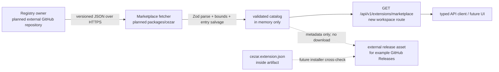

# Marketplace Registry

## 📝 TLDR
The extension package manifest now describes what an extension claims, but Cezar has no central, trusted catalog from which it can discover installable versions. **Future behavior:** Cezar will fetch a read-only catalog of extension metadata from one canonical HTTPS registry document; the catalog will point each version at an immutable external artifact, such as a GitHub Release asset, without storing or proxying the bundle.

## Resolved assumptions (autonomous defaults)

| # | Question | Applied answer | Why |
|---|---|---|---|
| Q1 | Is this one capability or should it include installation, loading, trust UI and a marketplace screen? | **One capability: catalog document plus an explicit fetch/read API.** Installation, dynamic loading, binary caching, permission approval and marketplace UI are separate follow-ups. | The brief's DoD only requires fetching the available list; keeping the first surface read-only minimizes security and rollback impact. |
| Q2 | Where is the central registry hosted and how is it selected? | **One stable canonical HTTPS URL, built into Cezar; the document is maintained outside the Cezar binary, preferably as a versioned JSON file in a public Open Mercato GitHub repository.** Version the catalog format with `schemaVersion`; do not create a new URL for each catalog release. No custom registry configuration in v1. | A single source keeps discovery zero-config and avoids SSRF/configuration surfaces, while schema versioning allows the document format to evolve without URL churn. |
| Q3 | Does Cezar fetch the registry on boot or only on demand? | **Only on an explicit user/API request; no boot fetch and no background polling.** | Network access is user-triggered, avoids slowing or failing boot, and follows the zero-config safe default. |
| Q4 | Is the registry document itself trusted, signed, or merely validated? | **Treat the fixed canonical catalog as a trusted source for discovery, with HTTPS, strict schema validation, bounded payloads and fail-closed entries.** SHA-256 remains artifact integrity metadata; cryptographic catalog signing and publisher verification are not required for discovery and remain prerequisites for installation or execution. | Discovery reports catalog facts but does not download or execute artifacts. The trust boundary is explicit: the canonical source is trusted for metadata, while future install policy must add stronger authenticity and revocation controls. |
| Q5 | What is the artifact policy? | **Every listed version must contain one concrete HTTPS artifact URL and a lowercase SHA-256 checksum; GitHub Release assets are supported, but the registry does not require GitHub-specific API calls.** | A direct URL plus digest satisfies the DoD while keeping the registry provider-neutral and avoiding binary hosting. |
| Q6 | Should the fetched list include only versions compatible with this Cezar, or all catalog entries? | **Fetch and validate the complete catalog; return all valid versions with their declared compatibility.** Compatibility decisions remain outside the catalog reader and use one shared compatibility evaluator, reused by the future installer/loader and any other consumer. | Discovery and selection are different concerns. Returning declarations keeps the registry factual while a common evaluator prevents divergent compatibility rules across consumers. |
| Q7 | Is discovery UI-facing in this item? | **No. API/service-facing only; no Settings page, picker, install button or browser evidence.** | A UI would imply installation and trust decisions that are explicitly out of scope. |

## 📝 Problem Statement

The extension platform currently has two separate pieces but no discovery path:

- `packages/extension-api/src/package-manifest.ts` defines and validates the installable package's self-described `cezar.extension.json`, including `cezar.apiVersion`, `engines.cezar`, entrypoints and requested permissions.
- `packages/web/src/extensions/registry.ts` can run extensions compiled into the cockpit, but `BUILTIN_EXTENSIONS` is empty and there is no loader or catalog for third-party packages.

The package manifest intentionally does not claim publisher identity, verification, artifact location or integrity. Those facts need a central source that Cezar can read before a future installer considers downloading or executing anything. Without that source, extension discovery would require hard-coded lists, binary hosting by Cezar, or an installer to invent trust and compatibility rules.

The first useful capability is narrower than a marketplace: a caller can ask Cezar for the available extension entries and receive enough information to decide whether a concrete release artifact is worth examining. It must work without requiring a database, user-authored config or a Cezar-hosted bundle, and a registry outage must not affect normal cockpit boot.

## 📝 Proposed Solution

Add a versioned, static marketplace catalog document maintained by the registry owner and fetched on demand from one canonical HTTPS URL. Each extension entry carries display metadata and one or more version records. Each version contains:

- the extension version;
- Cezar extension API and product-release compatibility;
- requested permissions;
- a concrete HTTPS download URL for the release artifact; and
- a lowercase SHA-256 digest for that exact artifact.

Cezar validates the document at the service boundary, filters malformed individual entries, and exposes the valid result through one workspace-level read route. It never downloads an artifact as part of discovery, executes package code, follows publisher-provided registry URLs, or stores a bundle. Compatibility remains declarative in the catalog; a future installer/loader decides whether the package can run.

### Prior art

- **Open VSX** separates extension identity and namespace metadata from per-version file URLs, supports all-version queries, and exposes checksums for downloadable files. This supports keeping version records explicit rather than treating `latest` as a version.
- **VS Code Marketplace** exposes publisher identity, repository metadata, versions and typed assets, and distinguishes a display/gallery URL from a download asset. This supports separate catalog metadata from the concrete artifact URL.
- **Grafana plugin distribution** uses release artifacts plus checksums and signed manifests, and distinguishes a catalog listing from authenticity verification. This supports making SHA-256 an integrity prerequisite while not presenting it as publisher authentication.
- **Backstage metadata** favors a small, validated metadata contract and tooling-generated/checked output. Cezar should keep the registry document machine-readable and strict without adding a marketplace database.

### Alternatives considered

- **Host extension bundles in Cezar or its npm package.** Rejected: it makes Cezar the distribution and update channel, increases package size and release coupling, and contradicts the brief.
- **Use GitHub's API as the registry.** Rejected for v1: each repository would become a discovery source, responses would require authentication/rate-limit handling, and GitHub metadata would not provide one authoritative publisher-curated list. GitHub Release assets remain a supported artifact location.
- **Let every installation configure arbitrary registry URLs.** Rejected: it adds configuration and an SSRF/untrusted-source surface before there is a trust model. A later multi-registry design can be additive.
- **Return only the newest compatible version.** Rejected: users and a future installer need version history, rollback choices and an explanation when the newest release is incompatible.
- **Treat a checksum as a signature.** Rejected: a digest detects bytes different from the catalog but does not authenticate the registry, publisher or catalog update. Signing and publisher verification remain explicit follow-ups.

## 📝 Architecture



The service owns the network fetch so the browser does not need CORS access to the external registry and no raw external payload crosses directly into the cockpit. The canonical source URL is a compiled default, not a user input. The fetcher is an ordinary dependency-injected module for tests; it has no boot side effect and uses the same best-effort degradation style as `update-check.ts` and remote skills.

The existing `packages/extension-api` remains the source of extension identity and permission vocabulary. Compatibility decisions use one shared evaluator that the future installer/loader and other consumers can reuse; the catalog reader does not make a per-consumer compatibility decision. The new marketplace schema lives in `packages/contract` because it crosses the HTTP boundary; the service validates the external document with that schema and the api-client re-exports the inferred types. It must not execute or inspect the artifact to produce the discovery response.

This is a workspace-level route: it is mounted once under `/api/v1`, never under `/api/v1/p/:projectId`, because the catalog is global to the Cezar installation. It must be chained into the server's route family builder and added to the route manifest and backward-compatibility inventory.

## 📝 Data Model

The canonical document is UTF-8 JSON with a strict schema version. The following is the logical shape; the implementation must define the wire schema once in `packages/contract` and infer TypeScript types from it.

```json
{
  "schemaVersion": 1,
  "generatedAt": "2026-09-20T09:00:00.000Z",
  "extensions": [
    {
      "id": "acme.jira",
      "name": "Jira Integration",
      "description": "Issues and transitions on the task header.",
      "publisher": { "id": "acme", "name": "ACME Corp" },
      "repository": "https://github.com/acme/cezar-jira",
      "versions": [
        {
          "version": "1.3.0",
          "compatibility": { "apiVersion": 1, "cezar": "^0.12.0" },
          "permissions": ["ui.components", "events"],
          "releaseUrl": "https://github.com/acme/cezar-jira/releases/download/v1.3.0/acme.jira.tgz",
          "checksum": { "algorithm": "sha256", "value": "0123456789abcdef0123456789abcdef0123456789abcdef0123456789abcdef" }
        }
      ]
    }
  ]
}
```

Rules:

- `schemaVersion` is `1`; an unsupported value fails the document rather than being guessed.
- `generatedAt` is an ISO timestamp for diagnostics and cache freshness, not a trust signal.
- `id` follows the existing extension-id grammar. It is the extension namespace, not proof of publisher ownership.
- `name`, `description`, publisher ids/names and repository URLs are bounded strings. `repository` is an absolute HTTPS URL and is display/reference metadata only.
- `publisher.id` is a stable catalog identity and `publisher.name` is its display name. A `verified` boolean is intentionally absent until the registry has a defined verification authority.
- `versions` contains unique semver versions in deterministic descending order. Pre-releases are valid but are not selected implicitly by this item.
- `compatibility.apiVersion` is a positive integer and `compatibility.cezar` is a bounded non-empty range string. Registry publishers must use the supported range grammar from `packages/extension-api/src/ranges.ts`; semantic evaluation remains the installer/loader's responsibility.
- `permissions` is a unique bounded list of permission names known to the current extension API, including `network` only as the existing reserved, non-enforceable declaration. The registry reports requested permissions; it does not grant them.
- `releaseUrl` is an absolute HTTPS URL with a non-empty path to one specific artifact. Known moving aliases such as GitHub `releases/latest` are rejected. The registry publisher is responsible for using an immutable/versioned asset URL; the parser cannot prove remote immutability.
- `checksum.algorithm` is currently the literal `sha256`; `value` is exactly 64 lowercase hexadecimal characters. The digest is for the bytes at `releaseUrl`, not for the metadata document.
- Each extension id and each version within it is unique. Duplicate records are invalid and are omitted from the returned catalog.
- The external document and each returned payload are bounded: maximum document bytes, extension count, versions per extension, string lengths and permission count are fixed implementation constants and tested. These caps prevent a public catalog from becoming a memory or response-size attack.

The fetcher parses the envelope first, then validates entries independently. A malformed envelope, unsupported schema version or unreadable response makes the fetch unavailable. A valid envelope with bad entries returns the valid entries and records a non-sensitive partial-result diagnostic. No registry data is persisted in `.ai/cezar/`, `~/.cezar/` or `localStorage` in v1; a successful result may use a short-lived bounded in-memory cache to avoid repeated identical requests within one server process.

## 📝 API Contracts

### External registry document

`marketplaceCatalogSchema` and its inferred type are added to `packages/contract/src/marketplace.ts` and re-exported from `packages/contract/src/index.ts`. The same schema validates the fetched document and describes the catalog portion of the HTTP response. The parser must not use a hand-written interface or a second schema in the service.

### Cezar HTTP API

Add one workspace-level route:

```text
GET /api/v1/extensions/marketplace
```

Success is exactly:

```json
{
  "available": true,
  "source": "https://registry.example.invalid/cezar/extensions.json",
  "fetchedAt": "2026-09-20T09:00:02.000Z",
  "partial": false,
  "extensions": [/* validated catalog entries */]
}
```

The source URL is the compiled canonical URL, and `fetchedAt` is Cezar's fetch time. `partial` is true when malformed entries were skipped. A failed fetch, timeout, non-2xx response, oversized body, invalid JSON or invalid envelope answers `200` with:

```json
{ "available": false, "reason": "marketplace registry is unavailable" }
```

The reason is a short stable category, never raw response bodies, URLs containing credentials, stack traces or upstream secrets. HTTP transport failure is not a server error because marketplace discovery is optional and the core cockpit must continue working. The route may return a cached successful result when available, marked `partial` as originally observed; cache age and source failures are not persisted.

The route has no request body or project id. If a refresh control is needed later, it should be a separately reviewed additive query contract; v1 does not accept a user-supplied source URL or artifact URL. Route registration must use the existing chained Hono family builder, route middleware is unnecessary for this bodyless route, and the response schema must pass the repository's contract-parity and route-inventory tests.

### Compatibility projection

Each returned version includes the catalog's declared `compatibility` object unchanged after schema validation. No `compatible` boolean is added in v1. The future installer/loader must compare the downloaded `cezar.extension.json` with the catalog record and then call `checkPackageCompatibility` using the current host identity. Discovery must never claim that an artifact is installable: package-manifest validation, artifact checksum verification, permission approval and loader policy remain future gates.

## 📝 UI/UX

This item is **not UI-facing**. There is no marketplace page, Settings section, search, install button, permission dialog, download progress or browser E2E work. The API is designed so a later cockpit view can show name, publisher, description, versions, compatibility and requested permissions without changing the external registry format. A future UI must clearly distinguish `compatible` from trusted/verified and must not present a checksum as a signature.

## 📝 Edge Cases & Failure Scenarios

| Scenario | Required behavior |
|---|---|
| Offline, DNS failure, timeout or non-2xx response | Return `available: false` with a stable reason; do not fail boot or throw into the request loop. |
| Redirect to a different registry host | Reject the fetch unless the implementation's fixed source policy explicitly allows the redirect; never follow an unbounded redirect chain. |
| Response is not JSON or exceeds the byte cap | Reject the whole catalog and return unavailable. Do not parse partial JSON or allocate an unbounded buffer. |
| Unsupported `schemaVersion` | Reject the whole catalog with an unavailable response; do not guess field meanings. |
| One malformed extension or version | Omit only that record, set `partial: true`, and emit one bounded diagnostic without echoing arbitrary catalog text. |
| Duplicate extension/version or duplicate permission | Omit the invalid record; never let order decide which publisher or artifact wins. |
| Compatibility range excludes this Cezar | Return the version with its declared compatibility; the future installer/loader refuses it using the existing compatibility decision. |
| Missing or malformed release URL/checksum | Omit the version. A discoverable version must always point to one concrete artifact and digest. |
| Artifact URL is later unreachable or its bytes hash differently | This item does not download it. The future installer must fail closed on the checksum mismatch and show the version unavailable. |
| Registry lists permissions not granted by a future installer | Discovery only displays the request. The existing requested-versus-granted model remains the activation gate. |
| Two callers request the catalog concurrently | Coalesce or serve one bounded in-flight fetch; never start an unbounded request storm. |
| Cezar restarts or has a read-only home | The catalog cache disappears and the application remains usable; no state file or writable home is required. |

## 📝 Risks & Impact Review

- **Supply-chain risk, high.** A mutable canonical registry or compromised registry owner can redirect users to a malicious artifact. SHA-256 detects a changed artifact only relative to the catalog; it does not authenticate the catalog, publisher or ownership. Before any installer or automatic update is built, the project must choose registry signing, publisher signatures/attestations, publisher verification and a revocation/moderation process. This is a security/design blocker for execution, not for read-only discovery.
- **Canonical source ownership, medium.** The production owner and exact URL still need to be supplied during implementation, but the design decision is settled: use one stable compiled-in HTTPS URL and evolve the document through `schemaVersion`, not per-release URL changes. Do not substitute the current hackathon fork as the production authority.
- **Remote URL policy, medium.** The catalog is external input. The fetcher must contact only its compiled source, reject source changes and bound redirects. A future installer must independently constrain artifact URLs and guard localhost/private-network access; it must not blindly fetch every URL the catalog returns.
- **Catalog/package drift, medium.** Registry compatibility, permissions and identity duplicate selected facts in `cezar.extension.json`. The future installer must compare the downloaded manifest to the catalog entry by id, version, compatibility and permissions before activation. The catalog must not be treated as a replacement for package-manifest validation.
- **API compatibility, medium.** This adds a new versioned workspace route and new contract schemas. It is additive and has no migration. The response must be inventoried in `BACKWARD_COMPATIBILITY.md`; removing or narrowing it later requires the repository's deprecation path.
- **Availability and cache staleness, low/medium.** In-memory caching avoids repeated network calls but can show an older list. The response must expose fetch time, never claim freshness indefinitely, and a later refresh policy must be explicit. No stale disk cache is introduced in v1.
- **Rollback.** The feature is additive and read-only. Rollback removes the route, fetcher and contract schemas; no user state, installed artifact or migration needs cleanup. Existing extension runtime behavior is unchanged.

## 📋 Phasing

- **Phase 1 — Catalog contract and safe parser.** Add the canonical Zod schemas, bounded entry validation, per-entry salvage and compatibility projection as pure/testable service logic. The application remains unchanged because the parser is not reachable until Phase 2.
- **Phase 2 — On-demand service endpoint.** Add the fixed-source fetcher, bounded timeout/cache, workspace API route and typed client method. The existing cockpit still boots and the endpoint degrades to `available: false` when the registry is absent.
- **Phase 3 — Operational handoff.** Document the canonical registry publishing format, update the backward-compatibility inventory and add fixtures for a GitHub Release asset URL. Do not add installation, execution or UI in this phase.

## 📋 Implementation Plan

1. **Define the external and HTTP schemas.** Add `packages/contract/src/marketplace.ts` with strict `schemaVersion`, bounded extension/version records, publisher, compatibility, permissions, HTTPS `releaseUrl` and SHA-256 checksum schemas. Export inferred types from the contract barrel; add contract tests for valid catalog data, missing fields, duplicates, moving URLs, invalid checksums and bounded strings.
2. **Implement pure catalog normalization.** Add a service-owned parser that enforces the document byte/row caps, validates the envelope, validates entries independently, rejects duplicate ids/versions, sorts deterministically and returns `{ extensions, partial }` without executing or downloading package code. Test malformed top-level JSON, hostile getters are not applicable after JSON decoding, invalid entries, partial results and stable ordering.
3. **Validate compatibility metadata without making a local policy decision.** Validate the catalog's `apiVersion` and bounded `cezar` range fields, preserve them in the response, and add fixtures for compatible-looking, out-of-range and pre-release ranges. Reuse the shared compatibility evaluator after reading the package manifest; do not add a second semver evaluator.
4. **Add the bounded fetcher.** Add a dependency-injected `fetchMarketplaceCatalog` in `packages/cezar` with the compiled canonical HTTPS URL, an explicit timeout, maximum response bytes, bounded redirects, in-flight coalescing and a short in-memory success cache. Test offline, timeout, non-2xx, oversized, malformed and redirect responses; assert no raw upstream body or credential-bearing URL reaches the result.
5. **Expose the workspace route.** Add the response schemas to the route contract, chain `GET /api/v1/extensions/marketplace` into the workspace route family, and read the validated service result. Add typed client coverage and route tests for success, partial success, unavailable responses, cache reuse and the required absence of a project-scoped mirror.
6. **Inventory and document the additive surface.** Update `BACKWARD_COMPATIBILITY.md` with the route, exact response union, source/cache semantics and additive evolution rule. Add a checked-in sample catalog fixture using a GitHub Release asset URL, but do not fetch it during tests or boot. Confirm no runtime code downloads, unpacks, imports or activates artifacts.

Every step leaves the application working: steps 1–3 are unreferenced contract/pure logic additions, steps 4–5 add an optional best-effort read surface, and step 6 changes documentation and fixtures only.

## Security/design follow-ups before installation

The feature can be specified and implemented as read-only discovery. Before any installer, automatic update or artifact execution ships:

1. Publish the approved owner and exact HTTPS URL of the canonical registry; do not substitute the current hackathon fork.
2. Choose a catalog/publisher authenticity mechanism beyond SHA-256, plus revocation and moderation semantics.
3. Ensure the future installer enforces artifact URL/network safety and cross-checks the downloaded package manifest against the catalog before granting permissions or loading code. It must also use the shared compatibility evaluator rather than introducing a second policy.
